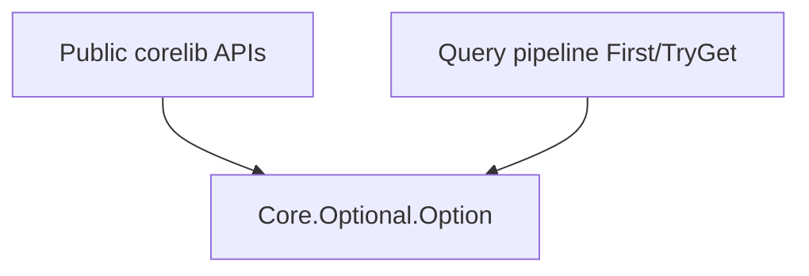

<!-- migrated from the legacy platform spec; canonical OpenSpec source -->
# Core.Optional Specification

## Purpose

Canonical optional-value type for corelib APIs and query iterators.

## Requirements

### Requirement: Core.Optional.Option canonical: Decision [D-CORE-OPT-0003]
The Beskid standard SHALL enforce the following migrated contract section. Accepted ADR decisions are binding; uppercase requirement keywords retain their BCP-14 meaning.

> | Rule | Detail |
> | --- | --- |
> | Canonical module | `Core.Optional.Option<T>` under `Core/Optional/` |
> | Deprecation | `Query.Contracts` **must** be deprecated; it **may** re-export `Core.Optional` for one release only |
> | API boundaries | Public corelib signatures **must** spell `Core.Optional.Option<T>` (or unqualified `Option<T>` after `use Core.Optional`) |
> | Language spec | Glossary and [Types](/platform-spec/language-meta/type-system/types/) **must** reference `Core.Optional`, not `Query.Contracts` |

**Stable ID:** `BSP-REQ-12AA256793BC`  
**Legacy source:** `site/spec-content/platform-spec/core-library/foundation-and-primitives/core-optional/adr/0001-core-optional-canonical/content.md`  
**Source SHA-256:** `ad961f922aca2cac8ab926cf9d759c17b31134086bf6d52c4ef08937c4d55e7d`

#### Scenario: Conformance exercises Decision
- **GIVEN** an implementation claims conformance with this capability
- **WHEN** behavior governed by this contract section is exercised
- **THEN** every MUST, SHALL, REQUIRED, prohibition, and accepted decision in the section is satisfied

## Informative Source Provenance

The records below preserve migration history and are not normative except where text was extracted into a requirement above.

### Source Record: Core.Optional

**Authority:** informative provenance  
**Legacy path:** `/platform-spec/core-library/foundation-and-primitives/core-optional/`  
**Source:** `site/spec-content/platform-spec/core-library/foundation-and-primitives/core-optional/content.md`  
**SHA-256:** `9d7e4c2e2bc9efa37bfff467825049176134fa8034a45dfc42e87b270c6b8395`

<details>
<summary>Migrated source text</summary>

``````markdown
<SpecSection title="What this feature specifies" id="what-this-feature-specifies">
`Core.Optional` defines the sole normative optional-value surface for corelib: `Option<T>` with `Some` and `None` variants, plus helpers (`HasValue`, `Map`, `UnwrapOr`). API boundaries that represent presence or absence **must** use `Core.Optional.Option<T>` or an explicit `enum` with a dedicated absent variant—not deprecated query shims or language sugar.
</SpecSection>

<SpecSection title="Scope" id="scope">
- **In scope:** `Option<T>` enum, presence helpers, and migration of collection, concurrency, environment, and query APIs to import `Core.Optional` directly.
- **Out of scope:** Nullable reference types, `?T` syntax, and error-bearing absence (`Result` remains the failure channel).
</SpecSection>

<SpecSection title="Implementation anchors" id="implementation-anchors">
- `compiler/corelib/packages/foundation/src/Core/Optional.bd`
- `compiler/corelib/packages/foundation/src/Core/Optional/Option.bd`
- Corelib tests: `compiler/corelib/beskid_corelib/tests/corelib_tests/src/core/OptionalTests.bd`
</SpecSection>

<SpecSection title="Contract statement" id="contract-statement">
| Surface | Rule |
| --- | --- |
| Canonical type | `Core.Optional.Option<T>` |
| Variants | `Some(T value)` and `None` only in v1 |
| `Result` interaction | `Result` signals failure; `Option` signals absence without error detail—do not conflate at public API boundaries |
| Deprecation | Legacy `Query.Contracts` shim **must** be removed after consumers migrate to `Core.Optional` |
</SpecSection>

## Decisions
<!-- spec:generate:adr-index -->
No open decisions. Closed choices are normative ADRs under **`adr/`** (`D-CORE-OPT-0003`); use the reader **ADRs** tab for expandable detail.
<!-- /spec:generate:adr-index -->
## Articles
<!-- spec:generate:article-index -->
- [Design model](./articles/design-model/)
<!-- /spec:generate:article-index -->
``````

</details>

### Source Record: Core.Optional.Option canonical

**Authority:** informative provenance  
**Legacy path:** `/platform-spec/core-library/foundation-and-primitives/core-optional/adr/0001-core-optional-canonical/`  
**Source:** `site/spec-content/platform-spec/core-library/foundation-and-primitives/core-optional/adr/0001-core-optional-canonical/content.md`  
**SHA-256:** `ad961f922aca2cac8ab926cf9d759c17b31134086bf6d52c4ef08937c4d55e7d`

<details>
<summary>Migrated source text</summary>

``````markdown
## Context

`Query.Contracts` historically hosted `Option<T>` because query iterators were the primary consumer. Optional presence is now a cross-cutting primitive used by collections, concurrency, environment probes, and language-meta type rules.

## Decision

| Rule | Detail |
| --- | --- |
| Canonical module | `Core.Optional.Option<T>` under `Core/Optional/` |
| Deprecation | `Query.Contracts` **must** be deprecated; it **may** re-export `Core.Optional` for one release only |
| API boundaries | Public corelib signatures **must** spell `Core.Optional.Option<T>` (or unqualified `Option<T>` after `use Core.Optional`) |
| Language spec | Glossary and [Types](/platform-spec/language-meta/type-system/types/) **must** reference `Core.Optional`, not `Query.Contracts` |

## Consequences

- Iterator `First()` and map `TryGet` return `Core.Optional.Option<T>`.
- Book and platform-spec examples migrate off `use Query.Contracts` for `Option`.
- `Query.Contracts.bd` is removed after the shim window.

## Verification anchors

- `compiler/corelib/packages/foundation/src/Core/Optional/`
- `OptionalTests.bd` under `beskid_corelib/tests/corelib_tests/`
``````

</details>

### Source Record: Design model

**Authority:** informative provenance  
**Legacy path:** `/platform-spec/core-library/foundation-and-primitives/core-optional/articles/design-model/`  
**Source:** `site/spec-content/platform-spec/core-library/foundation-and-primitives/core-optional/articles/design-model/content.md`  
**SHA-256:** `35eeb2804713baed73b13407681f8193229c49bcb3f8ca34541655b4f495f7fd`

<details>
<summary>Migrated source text</summary>

``````markdown
## Module layout

| Module | Role |
| --- | --- |
| `Core.Optional` | Hub re-exporting helpers |
| `Core.Optional.Option` | `pub enum Option<T> { Some, None }` |

## Helpers (v1)

| Function | Behavior |
| --- | --- |
| `HasValue<T>(Option<T>)` | `true` when variant is `Some` |
| `Map<T, U>(Option<T>, fn)` | Functor map; `None` propagates |
| `UnwrapOr<T>(Option<T>, T default)` | Returns `Some` value or `default` |

## Layering



## Migration

`Query.Contracts.Option` moved to `Core.Optional.Option` per [D-CORE-OPT-0003](./adr/0001-core-optional-canonical/). The deprecated `Query.Contracts` shim is removed; consumers (`Concurrency.Mutex`, `Concurrency.Channel`, `Core.Environment`, collections `Get`/`TryGet`, query `First`) **must** import `Core.Optional`.

## Implementation anchors

- `compiler/corelib/packages/foundation/src/Core/Optional/Option.bd`
- `compiler/corelib/packages/foundation/src/Core/Optional.bd`
``````

</details>
