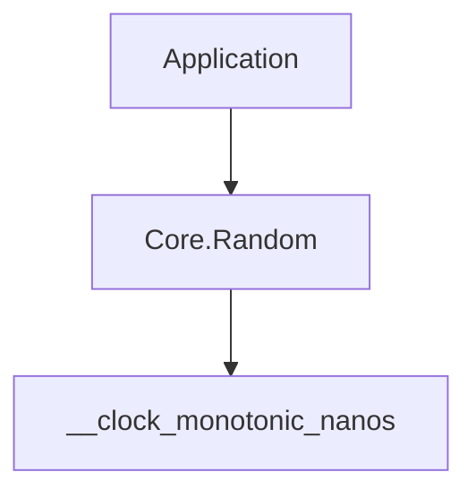

<!-- migrated from the legacy platform spec; canonical OpenSpec source -->
# Core.Random Specification

## Purpose

Pseudorandom number generation using PCG RXS M XS 64-bit algorithm for i64, f64, bool, and byte buffer outputs.

## Requirements

### Requirement: Core.Random PCG PRNG: Decision [D-CORE-PRIM-0040]
The Beskid standard SHALL enforce the following migrated contract section. Accepted ADR decisions are binding; uppercase requirement keywords retain their BCP-14 meaning.

> `Core.Random` provides a PCG (Permuted Congruential Generator) with RXS M XS 64-bit state. `New()` seeds from the monotonic clock; `NewSeeded(i64)` enables deterministic sequences. Generators are mutated in-place via `mut Random` parameters. Output functions: `NextI64(mut Random, i64 max)` for [0, max), `NextI64Range(mut Random, i64 min, i64 max)` for [min, max], `NextF64(mut Random)` for [0.0, 1.0), `NextBool(mut Random)`, and `NextBytes(mut Random, u8[], i64, i64)`. `IsExhausted(Random)` is a guard only (zero-state detection).

**Stable ID:** `BSP-REQ-CE596AB9DF51`
**Legacy source:** `site/spec-content/platform-spec/core-library/foundation-and-primitives/core-random/content.md`
**Source SHA-256:** `0000000000000000000000000000000000000000000000000000000000000000`

#### Scenario: Conformance exercises Decision
- **GIVEN** an implementation claims conformance with this capability
- **WHEN** behavior governed by this contract section is exercised
- **THEN** every MUST, SHALL, REQUIRED, prohibition, and accepted decision in the section is satisfied

## Informative Source Provenance

The records below preserve migration history and are not normative except where text was extracted into a requirement above.

### Source Record: Core.Random

**Authority:** informative provenance
**Legacy path:** `/platform-spec/core-library/foundation-and-primitives/core-random/`
**Source:** `site/spec-content/platform-spec/core-library/foundation-and-primitives/core-random/content.md`
**SHA-256:** `0000000000000000000000000000000000000000000000000000000000000000`

<details>
<summary>Migrated source text</summary>

``````markdown
<SpecSection title="What this feature specifies" id="what-this-feature-specifies">
`Core.Random` provides a PCG RXS M XS 64-bit pseudorandom number generator. State is a single `i64` stored in a `Random` record. Mutation is explicit: all generation functions take `mut Random` and advance state in-place. Seeding via `New()` uses the monotonic clock (`__clock_monotonic_nanos`); `NewSeeded(i64)` enables deterministic replay.
</SpecSection>

<SpecSection title="Scope" id="scope">
- **In scope:** PCG RXS M XS 64-bit PRNG, i64/f64/bool/byte generation, deterministic seeding.
- **Out of scope:** Cryptographic randomness, multiple algorithm families, auto-reseeding, thread-local state.
</SpecSection>

<SpecSection title="Implementation anchors" id="implementation-anchors">
- `compiler/corelib/packages/foundation/src/Core/Random/Random.bd`
- `compiler/corelib/packages/foundation/src/Core/Random/RandomError.bd`
- Corelib tests: `compiler/corelib/beskid_corelib/tests/corelib_tests/src/core/RandomTests.bd`
</SpecSection>

<SpecSection title="Contract statement" id="contract-statement">
| Surface | Rule |
| --- | --- |
| Algorithm | PCG RXS M XS 64-bit with multiplier 6364136223846793005 and increment 1442695040888963407 |
| `New()` | Seeds from `__clock_monotonic_nanos()` + increment |
| `NewSeeded(i64)` | Seeds from `seed + increment()` (deterministic) |
| `NextI64(mut Random, i64 max)` | Returns value in [0, max); rejection-sampling for uniformity |
| `NextI64Range(mut Random, i64 min, i64 max)` | Returns value in [min, max] inclusive |
| `NextF64(mut Random)` | Returns [0.0, 1.0); normalizes via division by 2^63 |
| `NextBool(mut Random)` | Returns (next_state % 2) != 0 |
| `NextBytes(mut Random, u8[], i64, i64)` | Fills `count` bytes at `offset`; one `NextState` call per byte |
| `IsExhausted(Random)` | Guard: true when state == 0 |
| Tier | `@tier(supported)` |
</SpecSection>

## Decisions
<!-- spec:generate:adr-index -->
No open decisions. Closed choices are normative ADRs under **`adr/`** (`D-CORE-PRIM-0040`); use the reader **ADRs** tab for expandable detail.
<!-- /spec:generate:adr-index -->
## Articles
<!-- spec:generate:article-index -->
- [Contracts and edge cases](./articles/contracts-and-edge-cases/)
- [Design model](./articles/design-model/)
- [Verification and traceability](./articles/verification-and-traceability/)
<!-- /spec:generate:article-index -->
``````

</details>

### Source Record: Contracts and edge cases

**Authority:** informative provenance
**Legacy path:** `/platform-spec/core-library/foundation-and-primitives/core-random/articles/contracts-and-edge-cases/`
**Source:** `site/spec-content/platform-spec/core-library/foundation-and-primitives/core-random/articles/contracts-and-edge-cases/content.md`
**SHA-256:** `0000000000000000000000000000000000000000000000000000000000000000`

<details>
<summary>Migrated source text</summary>

``````markdown
## Normative requirements

| ID | Requirement |
| --- | --- |
| **RAND-001** | `Random` type **must** hold a single `i64 state` field. |
| **RAND-002** | `New()` **must** seed from `__clock_monotonic_nanos() + increment()`. |
| **RAND-003** | `NewSeeded(i64)` **must** produce deterministic state: `seed + increment()`. |
| **RAND-004** | `NextI64(mut Random, i64 max)` **must** return a value in [0, max) using rejection sampling for uniformity. |
| **RAND-005** | `NextI64Range(mut Random, i64 min, i64 max)` **must** return [min, max] inclusive. |
| **RAND-006** | `NextF64(mut Random)` **must** return [0.0, 1.0) normalized by 2^63. |
| **RAND-007** | `NextBool(mut Random)` **must** return `(next_state % 2) != 0`. |
| **RAND-008** | `NextBytes(mut Random, u8[], i64, i64)` **must** fill exactly `count` bytes at `offset` using modulo-256. |
| **RAND-009** | `IsExhausted(Random)` **must** return true when state == 0 (guard only). |
| **RAND-010** | Multiplier **must** be 6364136223846793005; increment **must** be 1442695040888963407. |

## Edge cases

| Case | Behavior |
| --- | --- |
| `NextI64` with max=1 | Always returns 0 |
| `NextI64Range` with min=max | Always returns that single value |
| Zero-state Random | `IsExhausted` returns true |
| Same seed twice | Identical sequences (deterministic) |
| `NewSeeded(0)` | Yields `Random { state: increment() }` |

## Implementation anchors

- `compiler/corelib/packages/foundation/src/Core/Random/Random.bd`
- `compiler/corelib/packages/foundation/src/Core/Random/RandomError.bd`
``````

</details>

### Source Record: Design model

**Authority:** informative provenance
**Legacy path:** `/platform-spec/core-library/foundation-and-primitives/core-random/articles/design-model/`
**Source:** `site/spec-content/platform-spec/core-library/foundation-and-primitives/core-random/articles/design-model/content.md`
**SHA-256:** `0000000000000000000000000000000000000000000000000000000000000000`

<details>
<summary>Migrated source text</summary>

``````markdown
## Module layout

| Module | Role |
| --- | --- |
| `Core.Random` | Single-file module with `Random` type and all generation functions |
| `Core.Random.RandomError` | `RandomError` enum (`InvalidRange`, `Exhausted`) |

## Algorithm

PCG RXS M XS 64-bit (minimal C implementation):
1. `old = state`
2. `state = old * multiplier + increment`
3. `xorshifted = ((old >> 5) ^ old) >> 2`
4. `rot = old >> 59`
5. `result = (xorshifted >> rot) | (xorshifted << ((-rot) & 63))`

## Layering


``````

</details>

### Source Record: Verification and traceability

**Authority:** informative provenance
**Legacy path:** `/platform-spec/core-library/foundation-and-primitives/core-random/articles/verification-and-traceability/`
**Source:** `site/spec-content/platform-spec/core-library/foundation-and-primitives/core-random/articles/verification-and-traceability/content.md`
**SHA-256:** `0000000000000000000000000000000000000000000000000000000000000000`

<details>
<summary>Migrated source text</summary>

``````markdown
| Requirement | Test anchor |
| --- | --- |
| **RAND-002** | `RandomTests.bd` — `random_new_creates_generator` |
| **RAND-003**, **RAND-010** | `RandomTests.bd` — `random_seeded_deterministic`, `random_seeded_diverge` |
| **RAND-004** | `RandomTests.bd` — `random_next_i64_range_in_bounds` |
| **RAND-006** | `RandomTests.bd` — `random_next_f64_unit_interval` |
| **RAND-007** | `RandomTests.bd` — `random_next_bool_produces_boolean` |
| **RAND-008** | `RandomTests.bd` — `random_next_bytes_fills_buffer` |
| **RAND-009** | `RandomTests.bd` — `random_exhausted_guard` |

Harness: `compiler/corelib/beskid_corelib/tests/corelib_tests/src/core/RandomTests.bd`
``````

</details>
