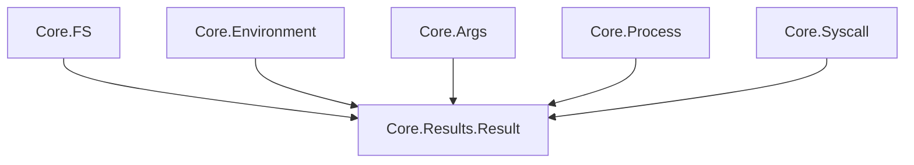

<!-- migrated from the legacy platform spec; canonical OpenSpec source -->
# Core.Results Specification

## Purpose

Generic discriminated union `Result<TValue, TError>` with `Ok` and `Error` variants, providing the canonical success-or-failure carrier across all corelib APIs.

## Requirements

### Requirement: Core.Results discriminated union: Decision [D-CORE-PRIM-0070]
The Beskid standard SHALL enforce the following migrated contract section. Accepted ADR decisions are binding; uppercase requirement keywords retain their BCP-14 meaning.

> `Core.Results.Result<TValue, TError>` is a generic discriminated union with two variants: `Ok(TValue value)` and `Error(TError error)`. Predicate helpers `IsOk` and `IsError` inspect the variant. This type is used as the return type across all corelib modules (Bytes, Encoding, FS, Syscall, Args, Environment, Process, etc.) and SHALL be the canonical failure channel for APIs that may fail.

**Stable ID:** `BSP-REQ-0D299BFF7517`
**Legacy source:** `site/spec-content/platform-spec/core-library/foundation-and-primitives/core-results/content.md`
**Source SHA-256:** `0000000000000000000000000000000000000000000000000000000000000000`

#### Scenario: Conformance exercises Decision
- **GIVEN** an implementation claims conformance with this capability
- **WHEN** behavior governed by this contract section is exercised
- **THEN** every MUST, SHALL, REQUIRED, prohibition, and accepted decision in the section is satisfied

## Informative Source Provenance

The records below preserve migration history and are not normative except where text was extracted into a requirement above.

### Source Record: Core.Results

**Authority:** informative provenance
**Legacy path:** `/platform-spec/core-library/foundation-and-primitives/core-results/`
**Source:** `site/spec-content/platform-spec/core-library/foundation-and-primitives/core-results/content.md`
**SHA-256:** `0000000000000000000000000000000000000000000000000000000000000000`

<details>
<summary>Migrated source text</summary>

``````markdown
<SpecSection title="What this feature specifies" id="what-this-feature-specifies">
`Core.Results` defines a generic discriminated union `Result<TValue, TError>` with `Ok(TValue value)` and `Error(TError error)` variants. It is the canonical failure channel across all corelib APIs. `IsOk` and `IsError` predicates enable match-free variant inspection.
</SpecSection>

<SpecSection title="Scope" id="scope">
- **In scope:** `Result<TValue, TError>` enum, `IsOk`, `IsError` predicates.
- **Out of scope:** Combinators (`Map`, `AndThen`, `OrElse`), error accumulation, `Try`/`?` syntax, implicit propagation.
</SpecSection>

<SpecSection title="Implementation anchors" id="implementation-anchors">
- `compiler/corelib/packages/foundation/src/Core/Results/Results.bd`
- Corelib tests: `compiler/corelib/beskid_corelib/tests/corelib_tests/src/core/ResultsTests.bd`
</SpecSection>

<SpecSection title="Contract statement" id="contract-statement">
| Surface | Rule |
| --- | --- |
| Canonical type | `Core.Results.Result<TValue, TError>` |
| Variants | `Ok(TValue value)` and `Error(TError error)` only in v1 |
| `IsOk` | Returns true when variant is `Ok` |
| `IsError` | Returns true when variant is `Error` |
| Usage | All corelib APIs that may fail return `Result` |
</SpecSection>

## Decisions
<!-- spec:generate:adr-index -->
No open decisions. Closed choices are normative ADRs under **`adr/`** (`D-CORE-PRIM-0070`); use the reader **ADRs** tab for expandable detail.
<!-- /spec:generate:adr-index -->
## Articles
<!-- spec:generate:article-index -->
- [Contracts and edge cases](./articles/contracts-and-edge-cases/)
- [Design model](./articles/design-model/)
- [Verification and traceability](./articles/verification-and-traceability/)
<!-- /spec:generate:article-index -->
``````

</details>

### Source Record: Contracts and edge cases

**Authority:** informative provenance
**Legacy path:** `/platform-spec/core-library/foundation-and-primitives/core-results/articles/contracts-and-edge-cases/`
**Source:** `site/spec-content/platform-spec/core-library/foundation-and-primitives/core-results/articles/contracts-and-edge-cases/content.md`
**SHA-256:** `0000000000000000000000000000000000000000000000000000000000000000`

<details>
<summary>Migrated source text</summary>

``````markdown
## Normative requirements

| ID | Requirement |
| --- | --- |
| **RES-001** | `Result<TValue, TError>` **must** be a generic `pub enum` with exactly two variants: `Ok(TValue value)` and `Error(TError error)`. |
| **RES-002** | `IsOk` **must** return `true` when the variant is `Ok`. |
| **RES-003** | `IsError` **must** return `true` when the variant is `Error`. |
| **RES-004** | All corelib APIs that may fail **must** use `Core.Results.Result` (not `Query.Contracts` or ad-hoc unions). |

## Edge cases

| Case | Behavior |
| --- | --- |
| `IsOk` on `Error` variant | Returns false |
| `IsError` on `Ok` variant | Returns false |
| Nested `Result` | `Result<Result<i64, E1>, E2>` is valid; predicates inspect only the outer variant |

## Implementation anchors

- `compiler/corelib/packages/foundation/src/Core/Results/Results.bd`
``````

</details>

### Source Record: Design model

**Authority:** informative provenance
**Legacy path:** `/platform-spec/core-library/foundation-and-primitives/core-results/articles/design-model/`
**Source:** `site/spec-content/platform-spec/core-library/foundation-and-primitives/core-results/articles/design-model/content.md`
**SHA-256:** `0000000000000000000000000000000000000000000000000000000000000000`

<details>
<summary>Migrated source text</summary>

``````markdown
## Module layout

| Module | Role |
| --- | --- |
| `Core.Results` | Single-file module with `Result<T, E>` enum and predicates |

## Layering



## Related topics

- [Core.Optional](/platform-spec/core-library/foundation-and-primitives/core-optional/)
``````

</details>

### Source Record: Verification and traceability

**Authority:** informative provenance
**Legacy path:** `/platform-spec/core-library/foundation-and-primitives/core-results/articles/verification-and-traceability/`
**Source:** `site/spec-content/platform-spec/core-library/foundation-and-primitives/core-results/articles/verification-and-traceability/content.md`
**SHA-256:** `0000000000000000000000000000000000000000000000000000000000000000`

<details>
<summary>Migrated source text</summary>

``````markdown
| Requirement | Test anchor |
| --- | --- |
| **RES-001**, **RES-002**, **RES-003** | `ResultsTests.bd` — `result_ok_is_ok`, `result_error_is_error`, `result_error_is_not_ok`, `result_ok_is_not_error` |
| **RES-004** | `ExpressionBodyTests.bd` exercises Result in expression contexts |

Harness: `compiler/corelib/beskid_corelib/tests/corelib_tests/src/core/ResultsTests.bd`
``````

</details>
