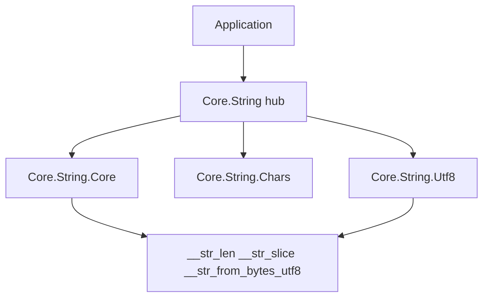

<!-- migrated from the legacy platform spec; canonical OpenSpec source -->
# Core.String Specification

## Purpose

String helpers, character tables, and UTF-8 rune decoding, delegated through a hub module to `Core.String.Core`, `Core.String.Chars`, and `Core.String.Utf8`.

## Requirements

### Requirement: Core.String string helpers and UTF-8 rune decoding: Decision [D-CORE-PRIM-0060]
The Beskid standard SHALL enforce the following migrated contract section. Accepted ADR decisions are binding; uppercase requirement keywords retain their BCP-14 meaning.

> `Core.String` is a hub module re-exporting from three submodules: `Core` (Len, IsEmpty, IndexOfFrom, Contains, SubSlice, Trim, ByteAt), `Chars` (DigitChar, LowerChar, UpperChar, CodeUnitChar), and `Utf8` (Latin1Block, Utf8RuneByteLen, Latin1Rune, AppendUtf8Rune, FromUtf8CodeUnits). `Trim` strips ASCII space (32), tab (9), and carriage return (13). `ByteAt` uses `text[index]` syntax and traps on OOB (same policy as `Bytes`). `IndexOfFrom` is a naive O(n*m) substring search. No separate error type exists.

**Stable ID:** `BSP-REQ-D3A59BA0F6D4`
**Legacy source:** `site/spec-content/platform-spec/core-library/foundation-and-primitives/core-string/content.md`
**Source SHA-256:** `0000000000000000000000000000000000000000000000000000000000000000`

#### Scenario: Conformance exercises Decision
- **GIVEN** an implementation claims conformance with this capability
- **WHEN** behavior governed by this contract section is exercised
- **THEN** every MUST, SHALL, REQUIRED, prohibition, and accepted decision in the section is satisfied

## Informative Source Provenance

The records below preserve migration history and are not normative except where text was extracted into a requirement above.

### Source Record: Core.String

**Authority:** informative provenance
**Legacy path:** `/platform-spec/core-library/foundation-and-primitives/core-string/`
**Source:** `site/spec-content/platform-spec/core-library/foundation-and-primitives/core-string/content.md`
**SHA-256:** `0000000000000000000000000000000000000000000000000000000000000000`

<details>
<summary>Migrated source text</summary>

``````markdown
<SpecSection title="What this feature specifies" id="what-this-feature-specifies">
`Core.String` is a hub module delegating to three submodules: `Core.String.Core` (length, emptiness, substring search, slice, trim, byte access), `Core.String.Chars` (digit/letter character tables, code-unit display), and `Core.String.Utf8` (UTF-8 rune length decoding, Latin-1 supplement, rune byte decoding, code-unit materialization).
</SpecSection>

<SpecSection title="Scope" id="scope">
- **In scope:** String length, slice, trim (ASCII whitespace), substring search, character tables, UTF-8 rune decoding, Latin-1 supplement.
- **Out of scope:** Unicode normalization, grapheme clustering, locale-aware collation, regex, case folding beyond ASCII.
</SpecSection>

<SpecSection title="Implementation anchors" id="implementation-anchors">
- `compiler/corelib/packages/foundation/src/Core/String/String.bd` (hub)
- `compiler/corelib/packages/foundation/src/Core/String/Core.bd`
- `compiler/corelib/packages/foundation/src/Core/String/Chars.bd`
- `compiler/corelib/packages/foundation/src/Core/String/Utf8.bd`
</SpecSection>

<SpecSection title="Contract statement" id="contract-statement">
| Surface | Rule |
| --- | --- |
| `Len(string)` | Delegates to `__str_len` builtin |
| `IsEmpty(string)` | `Len(text) == 0` |
| `IndexOfFrom(string, i64, string)` | Naive O(n*m) search from `start`; returns -1 on no match; negative start clamps to 0 |
| `Contains(string, string)` | `IndexOfFrom(text, 0, needle) >= 0` |
| `SubSlice(string, i64, i64)` | Delegates to `__str_slice` builtin |
| `Trim(string)` | Strips ASCII 32 (space), 9 (tab), 13 (CR) from both ends |
| `ByteAt(string, i64)` | `text[index]` syntax; OOB traps at runtime |
| `FromUtf8CodeUnits(u8[])` | Materializes string from validated UTF-8 code units via `__str_from_bytes_utf8` |
| No error type | OOB `ByteAt` traps at runtime (same policy as `Core.Bytes`) |
</SpecSection>

## Decisions
<!-- spec:generate:adr-index -->
No open decisions. Closed choices are normative ADRs under **`adr/`** (`D-CORE-PRIM-0060`); use the reader **ADRs** tab for expandable detail.
<!-- /spec:generate:adr-index -->
## Articles
<!-- spec:generate:article-index -->
- [Contracts and edge cases](./articles/contracts-and-edge-cases/)
- [Design model](./articles/design-model/)
- [Verification and traceability](./articles/verification-and-traceability/)
<!-- /spec:generate:article-index -->
``````

</details>

### Source Record: Contracts and edge cases

**Authority:** informative provenance
**Legacy path:** `/platform-spec/core-library/foundation-and-primitives/core-string/articles/contracts-and-edge-cases/`
**Source:** `site/spec-content/platform-spec/core-library/foundation-and-primitives/core-string/articles/contracts-and-edge-cases/content.md`
**SHA-256:** `0000000000000000000000000000000000000000000000000000000000000000`

<details>
<summary>Migrated source text</summary>

``````markdown
## Normative requirements

| ID | Requirement |
| --- | --- |
| **STR-001** | `Len(string)` **must** delegate to `__str_len`. |
| **STR-002** | `IsEmpty(string)` **must** return true when `Len` is 0. |
| **STR-003** | `IndexOfFrom(haystack, start, needle)` **must** return the zero-based byte index or -1; negative start **must** clamp to 0; empty needle **must** return `start`. |
| **STR-004** | `Contains(string, string)` **must** return true when `IndexOfFrom` returns non-negative. |
| **STR-005** | `SubSlice(string, i64, i64)` **must** delegate to `__str_slice`. |
| **STR-006** | `Trim(string)` **must** strip ASCII space (32), tab (9), and carriage return (13) from both ends. |
| **STR-007** | `ByteAt(string, i64)` **must** use `text[index]` indexing; OOB **must** trap at runtime. |
| **STR-008** | `DigitChar(i64)` **must** map 0-9 to "0"-"9"; higher digits all map to "9". |
| **STR-009** | `LowerChar(i64)` / `UpperChar(i64)` **must** map 0-25 to "a"-"z" / "A"-"Z"; higher offsets default to "z"/"Z". |
| **STR-010** | `Utf8RuneByteLen(u8)` **must** return 1-4 for valid UTF-8 lead bytes, 0 for continuation/invalid. |
| **STR-011** | `FromUtf8CodeUnits(u8[])` **must** materialize a `string` via `__str_from_bytes_utf8` and `AppendUtf8Rune`. |
| **STR-012** | `Latin1Block()` **must** build U+0080-U+00FF using `__str_from_bytes_utf8` imperatively. |

## Edge cases

| Case | Behavior |
| --- | --- |
| Empty string `Trim` | Returns `""` |
| `IndexOfFrom` with empty needle | Returns `start` (clamped to 0 if negative) |
| `IndexOfFrom` starting past end | Returns -1 |
| `SubSlice` past end | Clamps to end per `__str_slice` contract |
| `ByteAt` OOB | Runtime trap |
| `Utf8RuneByteLen(0x80)` | Returns 0 (continuation byte) |
| `FromUtf8CodeUnits([])` | Returns `""` |

## Implementation anchors

- `compiler/corelib/packages/foundation/src/Core/String/Core.bd`
- `compiler/corelib/packages/foundation/src/Core/String/Chars.bd`
- `compiler/corelib/packages/foundation/src/Core/String/Utf8.bd`
``````

</details>

### Source Record: Design model

**Authority:** informative provenance
**Legacy path:** `/platform-spec/core-library/foundation-and-primitives/core-string/articles/design-model/`
**Source:** `site/spec-content/platform-spec/core-library/foundation-and-primitives/core-string/articles/design-model/content.md`
**SHA-256:** `0000000000000000000000000000000000000000000000000000000000000000`

<details>
<summary>Migrated source text</summary>

``````markdown
## Module layout

| Module | Role |
| --- | --- |
| `Core.String` | Hub re-exporting all submodule functions |
| `Core.String.Core` | `Len`, `IsEmpty`, `IndexOfFrom`, `Contains`, `SubSlice`, `Trim`, `ByteAt` |
| `Core.String.Chars` | `DigitChar`, `LowerChar`, `UpperChar`, `CodeUnitChar` |
| `Core.String.Utf8` | `Latin1Block`, `Utf8RuneByteLen`, `Latin1Rune`, `AppendUtf8Rune`, `FromUtf8CodeUnits` |

## Builtins

| Builtin | Used by |
| --- | --- |
| `__str_len` | `Core.Len` |
| `__str_slice` | `Core.SubSlice`, `Utf8.Latin1Rune`, `Core.Path` |
| `__str_from_bytes_utf8` | `Utf8.Latin1Block`, `Utf8.AppendUtf8Rune` |

## Layering



## Related topics

- [Core.Bytes](/platform-spec/core-library/foundation-and-primitives/core-bytes/)
- [Core.Path](/platform-spec/core-library/foundation-and-primitives/core-path/)
``````

</details>

### Source Record: Verification and traceability

**Authority:** informative provenance
**Legacy path:** `/platform-spec/core-library/foundation-and-primitives/core-string/articles/verification-and-traceability/`
**Source:** `site/spec-content/platform-spec/core-library/foundation-and-primitives/core-string/articles/verification-and-traceability/content.md`
**SHA-256:** `0000000000000000000000000000000000000000000000000000000000000000`

<details>
<summary>Migrated source text</summary>

``````markdown
| Requirement | Test anchor |
| --- | --- |
| **STR-001** | Covered by all callers (e.g., `PathTests.bd` exercises `Core.String.Len`) |
| **STR-002** | `PathTests.bd` — `path_is_empty_predicate` |
| **STR-003** | `PathTests.bd` — `path_combine_*` exercises `IndexOfFrom` indirectly |
| **STR-005** | `PathTests.bd` — `path_combine_*` exercises `SubSlice` / `__str_slice` indirectly |
| **STR-007** | Runtime trap on OOB `text[index]` (integration) |
| **STR-011** | `EncodingUtf8Tests.bd` — `utf8_from_str_builtin_round_trip` |

No dedicated `StringTests.bd` file; string helpers are exercised transitively through `PathTests.bd`, `ArgsTests.bd`, `EncodingUtf8Tests.bd`, and other corelib tests.
``````

</details>
