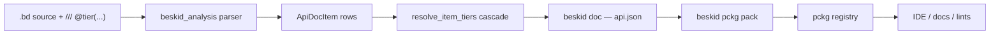
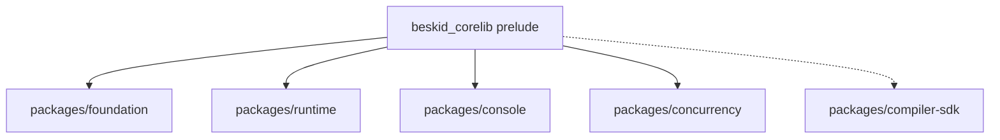
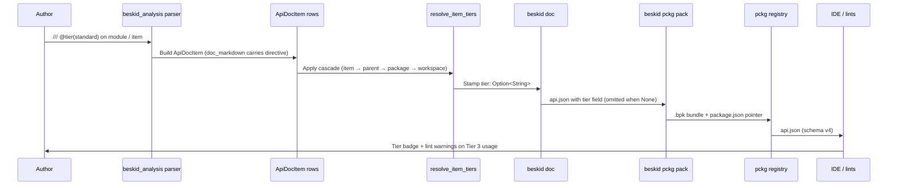

<!-- migrated from the legacy platform spec; canonical OpenSpec source -->
# Corelib API shape Specification

## Purpose

Normative API tiering for corelib modules — three stability tiers, prelude rules, and the `api.json` contract that surfaces them to consumers.

## Requirements

### Requirement: Three-tier classification with default `supported`: Decision [D-CORE-API-SHAPE-0001]
The Beskid standard SHALL enforce the following migrated contract section. Accepted ADR decisions are binding; uppercase requirement keywords retain their BCP-14 meaning.

> | Rule | Detail |
> | --- | --- |
> | Tier vocabulary | **Tier 1 — `standard`**, **Tier 2 — `supported`**, **Tier 3 — `unstable`** |
> | Authoring directive | `/// @tier(<value>)` on the declaring doc comment of any public item |
> | Aliases | `Tier1`/`Standard`/`standard`, `Tier2`/`Supported`/`supported`, `Tier3`/`Unstable`/`unstable` (case-insensitive) |
> | Default | Public items without a directive resolve to **`supported`** |
> | Cascade | Item-site → parent → package default → workspace default |
> | Serialization | Lowercase string under camelCase `tier` field in `ApiDocItem`; omitted when unresolved |

**Stable ID:** `BSP-REQ-2DC3CD367877`  
**Legacy source:** `site/spec-content/platform-spec/core-library/stability-and-api-shape/corelib-api-shape/adr/0001-three-tier-classification/content.md`  
**Source SHA-256:** `dc026a170b166ae8f488f97abb80e3ba01234a5b520ae6373270366dd7fa4050`

#### Scenario: Conformance exercises Decision
- **GIVEN** an implementation claims conformance with this capability
- **WHEN** behavior governed by this contract section is exercised
- **THEN** every MUST, SHALL, REQUIRED, prohibition, and accepted decision in the section is satisfied

### Requirement: Tier metadata travels via `api.json`, not a parallel manifest: Decision [D-CORE-API-SHAPE-0003]
The Beskid standard SHALL enforce the following migrated contract section. Accepted ADR decisions are binding; uppercase requirement keywords retain their BCP-14 meaning.

> | Rule | Detail |
> | --- | --- |
> | Field placement | `tier: Option<String>` on `ApiDocItem` in `compiler/crates/beskid_analysis/src/doc/api_snapshot.rs` |
> | Serialization | camelCase `tier`; lowercase value; omitted when unresolved |
> | Schema version | `API_JSON_SCHEMA_VERSION` stays at `4`; the `tier` field is additive and consumers that ignore unknown fields are unaffected |
> | Anti-pattern | Tooling **must not** consult a parallel manifest file (`tiers.json`, `Tier.toml`, …) for tier classification |

**Stable ID:** `BSP-REQ-AD7DCE5D382A`  
**Legacy source:** `site/spec-content/platform-spec/core-library/stability-and-api-shape/corelib-api-shape/adr/0003-tier-via-api-json-not-parallel-manifest/content.md`  
**Source SHA-256:** `f3648e0c7af869931de60b867917fbb2cdb4b719f7d585073a2bfd8cd6cfb2c8`

#### Scenario: Conformance exercises Decision
- **GIVEN** an implementation claims conformance with this capability
- **WHEN** behavior governed by this contract section is exercised
- **THEN** every MUST, SHALL, REQUIRED, prohibition, and accepted decision in the section is satisfied

### Requirement: Single Core.* namespace: Decision [D-CORE-NS-0001]
The Beskid standard SHALL enforce the following migrated contract section. Accepted ADR decisions are binding; uppercase requirement keywords retain their BCP-14 meaning.

> | Rule | Detail |
> | --- | --- |
> | Namespace | Every public corelib module **must** use the `Core.*` prefix |
> | Removal | `System.*` module paths **must** be removed; there is no `Core.Platform` alias layer |
> | Layout | Hub-plus-type-directory layout under `compiler/corelib/packages/foundation/src/Core/` (see [Core.Time](/platform-spec/core-library/stability-and-api-shape/core-time/), [Core.Syscall](/platform-spec/core-library/stability-and-api-shape/core-syscall/)) |
> | Tiering | OS-backed modules declare stability via `@tier(...)` and builtin backing, not a separate namespace |

**Stable ID:** `BSP-REQ-77B90CEBB3D3`  
**Legacy source:** `site/spec-content/platform-spec/core-library/stability-and-api-shape/corelib-api-shape/adr/0004-single-core-namespace/content.md`  
**Source SHA-256:** `afe47e8e4dbaeb7b3a19078d371fc6e5f0f95d7a0d0a17dcaf7b1c92bd45e846`

#### Scenario: Conformance exercises Decision
- **GIVEN** an implementation claims conformance with this capability
- **WHEN** behavior governed by this contract section is exercised
- **THEN** every MUST, SHALL, REQUIRED, prohibition, and accepted decision in the section is satisfied

### Requirement: Owning-type inline methods: Decision [D-CORE-API-0002]
The Beskid standard SHALL enforce the following migrated contract section. Accepted ADR decisions are binding; uppercase requirement keywords retain their BCP-14 meaning.

> | Rule | Detail |
> | --- | --- |
> | Owning methods | Methods on corelib-owned `pub type` **must** be declared inside the type's `pub type { }` block in the owning module file |
> | `extend type` | `extend type` **must not** add members to types defined in corelib packages (`foundation`, `concurrency`, `console`, `runtime`) |
> | Free functions | Module-level free functions **may** remain for constructors and namespace helpers that do not take a receiver |
> | Foreign types | `extend type` for types defined outside corelib (user code, mods) remains governed by [extend type](/platform-spec/language-meta/program-structure/extend-type/) |

**Stable ID:** `BSP-REQ-AE1BED6DC2AC`  
**Legacy source:** `site/spec-content/platform-spec/core-library/stability-and-api-shape/corelib-api-shape/adr/0005-owning-type-inline-methods/content.md`  
**Source SHA-256:** `17b893012542b9d4c7bb774c041004dda7e72c60a56d1644d042df3f01f97ab8`

#### Scenario: Conformance exercises Decision
- **GIVEN** an implementation claims conformance with this capability
- **WHEN** behavior governed by this contract section is exercised
- **THEN** every MUST, SHALL, REQUIRED, prohibition, and accepted decision in the section is satisfied

### Requirement: Contracts and edge cases: Normative contracts [core-library/stability-and-api-shape/corelib-api-shape/articles/contracts-and-edge-cases]
The Beskid standard SHALL enforce the following migrated contract section. Accepted ADR decisions are binding; uppercase requirement keywords retain their BCP-14 meaning.

> | ID | Rule | Level |
> | --- | --- | --- |
> | API-SHAPE-001 | Every public corelib item SHALL receive a resolved tier through the cascade or stay as `tier: None` (which consumers MUST treat as `supported`). | MUST |
> | API-SHAPE-002 | `@tier(...)` directives SHALL only carry the values `standard`, `supported`, `unstable`, or their `Tier1` / `Tier2` / `Tier3` aliases (case-insensitive). Unknown values are a hard parse-time diagnostic. | MUST |
> | API-SHAPE-003 | The resolver SHALL stop at the closest directive in the cascade (item → parent module → package default → workspace default). Conflicting directives are not merged. | MUST |
> | API-SHAPE-004 | The `beskid_corelib` prelude SHALL only re-export modules whose effective tier is `standard`. | MUST |
> | API-SHAPE-005 | `api.json` SHALL emit `tier` as a lowercase string at the schema's documented camelCase position, and SHALL omit the field when the resolver leaves it as `None`. | MUST |
> | API-SHAPE-006 | `api.json` schema version SHALL be at least `4` whenever any item carries a `tier` field. | MUST |
> | API-SHAPE-007 | Tier 1 (Standard) signatures SHALL stay stable for the full `v0.x` line; breaking changes require a major version bump and a normative ADR. | MUST |
> | API-SHAPE-008 | Tier 2 (Supported) signatures SHALL stay stable within a `v0.x` minor; behavior MAY evolve when preceded by a deprecation cycle. | MUST |
> | API-SHAPE-009 | Tier 3 (Unstable) items SHALL NOT be re-exported from any prelude or surfaced as default IDE completions; signatures MAY change without notice. | MUST |
> | API-SHAPE-010 | Consumers (IDE / registry / lints) SHOULD render a tier badge next to each documented item so authors see the stability promise without leaving the docs surface. | SHOULD |

**Stable ID:** `BSP-REQ-E73724EFA69D`  
**Legacy source:** `site/spec-content/platform-spec/core-library/stability-and-api-shape/corelib-api-shape/articles/contracts-and-edge-cases/content.md`  
**Source SHA-256:** `b705196715fdbd7e4187a23c1e80ff7a31a1f211129f10f3ee7ba3eb45f41b3a`

#### Scenario: Conformance exercises Normative contracts
- **GIVEN** an implementation claims conformance with this capability
- **WHEN** behavior governed by this contract section is exercised
- **THEN** every MUST, SHALL, REQUIRED, prohibition, and accepted decision in the section is satisfied

### Requirement: Contracts and edge cases: Edge cases [core-library/stability-and-api-shape/corelib-api-shape/articles/contracts-and-edge-cases]
The Beskid standard SHALL enforce the following migrated contract section. Accepted ADR decisions are binding; uppercase requirement keywords retain their BCP-14 meaning.

> ### Method on a Tier 3 type marked Tier 1
> 
> A function with `@tier(standard)` declared on a parameter of a Tier 3 type is still classified Tier 1 by the resolver — the cascade only looks at the item and its module, not the types it references. Authors SHOULD avoid this pattern; the verification suite calls it out as a warning so reviewers can either drop the function to Tier 3 or escalate the type to Tier 2.
> 
> ### Conflicting directives
> 
> If both an item and its parent module carry `@tier(...)`, the item directive wins. The resolver never merges conflicting values and never emits a diagnostic for the override; this is intentional so authors can demote a single function (for example `Collections.Map.ContainsKey` is `unstable` inside a `supported` module).
> 
> ### Prelude leakage
> 
> The prelude validator inspects `beskid_corelib/src/Prelude.bd` (and the per-package preludes) for `pub mod ...;` re-exports. Every re-exported module's effective tier MUST be `standard`; otherwise the publish job fails with a deterministic diagnostic citing the offending module and its resolved tier.
> 
> ### Unknown / misspelled directive
> 
> `@tier(stable)` (no such tier), `@tier()` (empty), or `@tier(standard, supported)` (multi-value) are rejected at analysis time. The resolver does not silently default; the item stays `tier: None` and a diagnostic surfaces the offending span so the author can fix it.
> 
> ### Generated mirror surfaces
> 
> `compiler/corelib/packages/compiler-sdk/` mirrors the compiler's internal syntax tree and is regenerated by tooling. Its modules carry `@tier(unstable)` at the module level so the cascade hands every generated row to consumers as Tier 3 without per-item annotation.

**Stable ID:** `BSP-REQ-30EC056AC450`  
**Legacy source:** `site/spec-content/platform-spec/core-library/stability-and-api-shape/corelib-api-shape/articles/contracts-and-edge-cases/content.md`  
**Source SHA-256:** `b705196715fdbd7e4187a23c1e80ff7a31a1f211129f10f3ee7ba3eb45f41b3a`

#### Scenario: Conformance exercises Edge cases
- **GIVEN** an implementation claims conformance with this capability
- **WHEN** behavior governed by this contract section is exercised
- **THEN** every MUST, SHALL, REQUIRED, prohibition, and accepted decision in the section is satisfied

### Requirement: Contracts and edge cases: Failure handling expectations [core-library/stability-and-api-shape/corelib-api-shape/articles/contracts-and-edge-cases]
The Beskid standard SHALL enforce the following migrated contract section. Accepted ADR decisions are binding; uppercase requirement keywords retain their BCP-14 meaning.

> When a tier diagnostic fires, the message SHALL include:
> 
> - The fully qualified item name (`Sample::Module::Item`).
> - The source span of the offending directive.
> - The current effective tier (or `None` when no cascade level matched).
> - A pointer to this article so newcomers can read the cascade rules.

**Stable ID:** `BSP-REQ-82F0DBC6471A`  
**Legacy source:** `site/spec-content/platform-spec/core-library/stability-and-api-shape/corelib-api-shape/articles/contracts-and-edge-cases/content.md`  
**Source SHA-256:** `b705196715fdbd7e4187a23c1e80ff7a31a1f211129f10f3ee7ba3eb45f41b3a`

#### Scenario: Conformance exercises Failure handling expectations
- **GIVEN** an implementation claims conformance with this capability
- **WHEN** behavior governed by this contract section is exercised
- **THEN** every MUST, SHALL, REQUIRED, prohibition, and accepted decision in the section is satisfied

### Requirement: Design model: Prelude exposure rules [core-library/stability-and-api-shape/corelib-api-shape/articles/design-model]
The Beskid standard SHALL enforce the following migrated contract section. Accepted ADR decisions are binding; uppercase requirement keywords retain their BCP-14 meaning.

> - The aggregate `beskid_corelib` prelude SHALL only re-export modules whose effective tier (cascade resolution) is **Standard**.
> - Tier 2 / Tier 3 modules MUST be reached through explicit `use Pkg.Module;` imports.
> - The prelude validator inspects the `pub mod ...;` list and fails the publish job if it discovers a non-Tier-1 re-export.

**Stable ID:** `BSP-REQ-067CC2DB490D`  
**Legacy source:** `site/spec-content/platform-spec/core-library/stability-and-api-shape/corelib-api-shape/articles/design-model/content.md`  
**Source SHA-256:** `4896cf2dc8ee120463b8a87da7fd15302018fb369e3981d10acf4e0a8d4edd88`

#### Scenario: Conformance exercises Prelude exposure rules
- **GIVEN** an implementation claims conformance with this capability
- **WHEN** behavior governed by this contract section is exercised
- **THEN** every MUST, SHALL, REQUIRED, prohibition, and accepted decision in the section is satisfied

### Requirement: Examples: Example 5: Omission round-trip [core-library/stability-and-api-shape/corelib-api-shape/articles/examples]
The Beskid standard SHALL enforce the following migrated contract section. Accepted ADR decisions are binding; uppercase requirement keywords retain their BCP-14 meaning.

> Items that flow through the cascade without a match (rare in corelib because every module annotates itself) emit no `tier` field at all:
> 
> ```json
> {
>   "qualifiedName": "ThirdParty::Pkg::Helper",
>   "kind": "function",
>   "visibility": "public"
> }
> ```
> 
> Consumers MUST treat this as `supported` so external packages that have not yet adopted tiering interop cleanly with the corelib pipeline.

**Stable ID:** `BSP-REQ-6D5535F01803`  
**Legacy source:** `site/spec-content/platform-spec/core-library/stability-and-api-shape/corelib-api-shape/articles/examples/content.md`  
**Source SHA-256:** `ed04f9352e45a25acfbe582ff90a3cb11fe5881e646f95f14c4446571ed48721`

#### Scenario: Conformance exercises Example 5: Omission round-trip
- **GIVEN** an implementation claims conformance with this capability
- **WHEN** behavior governed by this contract section is exercised
- **THEN** every MUST, SHALL, REQUIRED, prohibition, and accepted decision in the section is satisfied

## Informative Source Provenance

The records below preserve migration history and are not normative except where text was extracted into a requirement above.

### Source Record: Corelib API shape

**Authority:** informative provenance  
**Legacy path:** `/platform-spec/core-library/stability-and-api-shape/corelib-api-shape/`  
**Source:** `site/spec-content/platform-spec/core-library/stability-and-api-shape/corelib-api-shape/content.md`  
**SHA-256:** `c29c69b48f835f90f6af3664a5e97bdfee3667b1c548c581b1ae9a2bfbde834a`

<details>
<summary>Migrated source text</summary>

``````markdown
<SpecSection title="What this feature specifies" id="what-this-feature-specifies">
The corelib API-shape feature classifies every public corelib item into one of three stability tiers and pins the rules for how those tiers travel through the toolchain. It defines:

- The three tiers (**Standard** / **Supported** / **Unstable**), their semantic promises, and their default audience.
- How authors declare a tier on a module or item with a `@tier(...)` doc directive.
- How the compiler resolves tier metadata across the cascade (item-site → parent module → package default → workspace default) and writes the resulting value into `api.json`.
- The prelude rule that only Tier 1 modules may be re-exported through `beskid_corelib`'s prelude.
- The cross-version compatibility envelope each tier guarantees during a `v0.x` minor bump and during a `vN → vN+1` major.
</SpecSection>

<SpecSection title="Inputs and outputs" id="inputs-and-outputs">
| Stage | Input | Output |
| --- | --- | --- |
| Authoring | `///` doc comments containing `@tier(standard\|supported\|unstable)` on modules, types, functions, contract methods | Source carries normative tier declarations |
| Analysis (`beskid_analysis::doc::api_tier`) | `ApiDocItem` rows produced by `beskid doc` | Each row stamped with a resolved `tier: Option<String>` (omitted only when nothing resolves) |
| Packaging (`beskid pckg pack`) | `api.json` containing tier-tagged items | `.bpk` bundle whose `package.json` points at the tier-tagged `api.json` |
| Consumption (`beskid_pckg`, IDE) | `api.json` from the registry | Tier-aware UI badges, lint warnings on Tier 3 usage outside opt-in contexts |
</SpecSection>

<SpecSection title="State model" id="state-model">
The tier classification is deterministic and side-effect free. The resolver applies the following cascade, stopping at the first match:

1. `@tier(...)` directive on the item itself.
2. `@tier(...)` directive on the immediate parent module (inherited by all its members).
3. The package's default tier declared in `Project.proj` (when present).
4. The workspace default tier (currently `supported`).

Any item that flows through the cascade without resolving stays as `tier: None` in `api.json`; consumers treat that as the workspace default tier.
</SpecSection>

<SpecSection title="Algorithms and flow" id="algorithms-and-flow">
End-to-end pipeline:



See [Flow and algorithm](/platform-spec/core-library/stability-and-api-shape/corelib-api-shape/flow-and-algorithm/) for the numbered algorithm and the parser repair contract.
</SpecSection>

<SpecSection title="Edge cases and errors" id="edge-cases-and-errors">
- Method declared `@tier(standard)` on a Tier 3 type — see [Contracts and edge cases](/platform-spec/core-library/stability-and-api-shape/corelib-api-shape/contracts-and-edge-cases/).
- Conflicting directives on the same item — the closest directive wins; the resolver does not merge.
- Unknown tier value — rejected at analysis time with a clear diagnostic; the item stays `tier: None`.
- Prelude leakage — the prelude validator refuses to re-export Tier 2 or Tier 3 modules.
</SpecSection>

<SpecSection title="Compatibility and versioning" id="compatibility-and-versioning">
- **Tier 1 (Standard)** — signature stable across the entire `v0.x` line; breaking changes only at a major bump and only with a normative ADR.
- **Tier 2 (Supported)** — signature stable within a `v0.x` minor; behavior may evolve with deprecations.
- **Tier 3 (Unstable)** — signature may change without notice; consumers opt in by reading the tier field.
</SpecSection>

<SpecSection title="Security and performance notes" id="security-and-performance-notes">
Tier classification is metadata; it does not affect runtime semantics or codegen. The resolver runs in linear time over the `ApiDocItem` vector with no allocations beyond the resolved string. The `tier` field is omitted from `api.json` when `None`, keeping bundle size flat for legacy packages that have not yet annotated their surface.
</SpecSection>

<SpecSection title="Examples" id="examples">
See [Examples](/platform-spec/core-library/stability-and-api-shape/corelib-api-shape/examples/) for canonical Tier 1 / 2 / 3 annotations on `Collections.Array.Len`, `Collections.Map.Count`, and `Collections.List.Get`, plus the resulting `api.json` shape.
</SpecSection>

<SpecSection title="Verification and traceability" id="verification-and-traceability">
See [Verification and traceability](/platform-spec/core-library/stability-and-api-shape/corelib-api-shape/verification-and-traceability/) for the requirement-to-test matrix and the conformance commands.
</SpecSection>

<SpecSection title="Decisions" id="decisions">
| ADR | Title |
| --- | --- |
| [D-CORE-API-SHAPE-0001](/platform-spec/core-library/stability-and-api-shape/corelib-api-shape/adr/0001-three-tier-classification/) | Three-tier classification with default `supported` |
| [D-CORE-API-SHAPE-0002](/platform-spec/core-library/stability-and-api-shape/corelib-api-shape/adr/0002-prelude-tier1-only/) | Corelib prelude re-exports only Tier 1 modules |
| [D-CORE-API-SHAPE-0003](/platform-spec/core-library/stability-and-api-shape/corelib-api-shape/adr/0003-tier-via-api-json-not-parallel-manifest/) | Tier metadata travels inside `api.json`, not a parallel manifest |
| [D-CORE-NS-0001](/platform-spec/core-library/stability-and-api-shape/corelib-api-shape/adr/0004-single-core-namespace/) | Single `Core.*` namespace; `System.*` removed |
| [D-CORE-API-0002](/platform-spec/core-library/stability-and-api-shape/corelib-api-shape/adr/0005-owning-type-inline-methods/) | Owning-type inline methods; `extend type` forbidden for corelib-owned types |
</SpecSection>

<SpecSection title="Implementation anchors" id="implementation-anchors">
- Tier resolver: `compiler/crates/beskid_analysis/src/doc/api_tier.rs`
- Tier field on `ApiDocItem`: `compiler/crates/beskid_analysis/src/doc/api_snapshot.rs`
- Tier resolution call site: `compiler/crates/beskid_cli/src/commands/doc.rs`
- Tier-tagged corelib sources: `compiler/corelib/packages/foundation/src/Collections/`, `compiler/corelib/packages/foundation/src/Core/`
- Tier conformance tests: `compiler/crates/beskid_tests/src/projects/corelib/layout.rs`
- Beskid-side coverage suites: `compiler/corelib/beskid_corelib/tests/corelib_tests/src/collections/`, `compiler/corelib/beskid_corelib/tests/corelib_tests/src/system/`
</SpecSection>

## Decisions
<!-- spec:generate:adr-index -->
No open decisions. Closed choices are normative ADRs under **`adr/`** (`D-CORE-API-SHAPE-0001` … `D-CORE-API-0002`); use the reader **ADRs** tab for expandable detail.
<!-- /spec:generate:adr-index -->
## Articles
<!-- spec:generate:article-index -->
- [Contracts and edge cases](./articles/contracts-and-edge-cases/)
- [Design model](./articles/design-model/)
- [Examples](./articles/examples/)
- [FAQ and troubleshooting](./articles/faq-and-troubleshooting/)
- [Flow and algorithm](./articles/flow-and-algorithm/)
- [Verification and traceability](./articles/verification-and-traceability/)
<!-- /spec:generate:article-index -->
``````

</details>

### Source Record: Three-tier classification with default `supported`

**Authority:** informative provenance  
**Legacy path:** `/platform-spec/core-library/stability-and-api-shape/corelib-api-shape/adr/0001-three-tier-classification/`  
**Source:** `site/spec-content/platform-spec/core-library/stability-and-api-shape/corelib-api-shape/adr/0001-three-tier-classification/content.md`  
**SHA-256:** `dc026a170b166ae8f488f97abb80e3ba01234a5b520ae6373270366dd7fa4050`

<details>
<summary>Migrated source text</summary>

``````markdown
## Context

The corelib workspace exposes hundreds of public items across `packages/foundation`, `packages/runtime`, `packages/console`, `packages/concurrency`, and `packages/compiler-sdk`. Some items (`Collections.Array.Len`, `System.Output.Write`) are battle-tested and already part of the prelude; others (`Collections.List.Get`, `System.FS.WriteAllText`) ship as shape-only stubs while the runtime catches up. Without a tier classification, downstream consumers cannot tell which APIs are safe to depend on and which may break in the next minor release.

## Decision

| Rule | Detail |
| --- | --- |
| Tier vocabulary | **Tier 1 — `standard`**, **Tier 2 — `supported`**, **Tier 3 — `unstable`** |
| Authoring directive | `/// @tier(<value>)` on the declaring doc comment of any public item |
| Aliases | `Tier1`/`Standard`/`standard`, `Tier2`/`Supported`/`supported`, `Tier3`/`Unstable`/`unstable` (case-insensitive) |
| Default | Public items without a directive resolve to **`supported`** |
| Cascade | Item-site → parent → package default → workspace default |
| Serialization | Lowercase string under camelCase `tier` field in `ApiDocItem`; omitted when unresolved |

## Consequences

- Downstream tooling can badge every documented item by tier without consulting an external manifest.
- Authors get a one-line annotation surface; existing items default to a meaningful tier (`supported`) without a sweeping refactor.
- The default of `supported` is the safest "no commitment, no claim of unstable" choice. Future tightening to require explicit directives is possible without a compatibility break.

## Verification anchors

- `compiler/crates/beskid_analysis/src/doc/api_tier.rs` (resolver + tests)
- `compiler/crates/beskid_analysis/src/doc/api_snapshot.rs` (`tier` field)
- `compiler/crates/beskid_cli/src/commands/doc.rs::execute` (CLI emission)
- `compiler/crates/beskid_tests/src/projects/corelib/layout.rs::checked_in_corelib_tier_metadata_round_trips_through_api_json`
``````

</details>

### Source Record: Corelib prelude is Tier 1 only (superseded)

**Authority:** informative provenance  
**Legacy path:** `/platform-spec/core-library/stability-and-api-shape/corelib-api-shape/adr/0002-prelude-tier1-only/`  
**Source:** `site/spec-content/platform-spec/core-library/stability-and-api-shape/corelib-api-shape/adr/0002-prelude-tier1-only/content.md`  
**SHA-256:** `88cadf61a954bd5596e089992de94755aeb442ba92e0b8d89892f1d3ecb916a0`

<details>
<summary>Migrated source text</summary>

``````markdown
## Status

**Superseded by [D-TOOL-MAN-0006 — Explicit use, no prelude](/platform-spec/tooling/manifests-and-lockfiles/adr/0006-explicit-use-no-prelude/)** on 2026-06-07.

There is no aggregate prelude surface; tier policy applies to modules authors import explicitly.

## Context (historical)

Every Beskid project got the corelib prelude injected by default (see [Corelib injection and resolution](/platform-spec/core-library/compiler-integration/corelib-injection-and-resolution/)). Adding a module to the prelude made it transitively visible to **all** downstream code. Including Tier 2 / Tier 3 modules in the prelude would expose unstable surfaces by default and violate the [tier compatibility table](../#compatibility-and-versioning).

## Decision (historical)

| Rule | Detail |
| --- | --- |
| Membership rule | `compiler/corelib/beskid_corelib/src/Prelude.bd` **must** re-export only modules whose declarations resolve to **`standard`** |
| Enforcement | `compiler/crates/beskid_tests/src/projects/corelib/layout.rs::corelib_prelude_only_re_exports_tier1_modules` cross-checks every `pub mod ...;` line in `Prelude.bd` against the resolved per-module tier |
| Promotion path | Promoting a Tier 2 module to Tier 1 requires (a) updating the directive to `@tier(standard)` on the module's package source and (b) adding a row to the hub's `## Decisions` section pointing at this ADR or a new follow-up ADR |
| Demotion path | Demoting a Tier 1 prelude item requires a normative ADR under `adr/` and a compatibility alias for at least one minor release |

## Consequences (historical)

- The prelude stayed small and predictable: only a vetted surface shipped transitively.
- Tier 2 / Tier 3 modules remained reachable via explicit `use System.FS;` (etc.); no expressivity lost.
- CI caught accidental prelude growth before merge, keeping the v0.3 → v1.0 compatibility budget intact.

## Verification anchors (historical)

Verification responsibility transferred to D-TOOL-MAN-0006.
``````

</details>

### Source Record: Tier metadata travels via `api.json`, not a parallel manifest

**Authority:** informative provenance  
**Legacy path:** `/platform-spec/core-library/stability-and-api-shape/corelib-api-shape/adr/0003-tier-via-api-json-not-parallel-manifest/`  
**Source:** `site/spec-content/platform-spec/core-library/stability-and-api-shape/corelib-api-shape/adr/0003-tier-via-api-json-not-parallel-manifest/content.md`  
**SHA-256:** `f3648e0c7af869931de60b867917fbb2cdb4b719f7d585073a2bfd8cd6cfb2c8`

<details>
<summary>Migrated source text</summary>

``````markdown
## Context

Tier classification needs to flow from corelib sources to consumers (pckg dashboard, IDE tooling, conformance fixtures). Two paths were considered: (a) emit a sibling `tiers.json` next to `api.json`, or (b) attach the tier directly to each item row in `api.json`. Path (a) creates a second source of truth and risks drift when items rename or move; path (b) keeps the contract in one place but requires a `api.json` schema bump.

## Decision

| Rule | Detail |
| --- | --- |
| Field placement | `tier: Option<String>` on `ApiDocItem` in `compiler/crates/beskid_analysis/src/doc/api_snapshot.rs` |
| Serialization | camelCase `tier`; lowercase value; omitted when unresolved |
| Schema version | `API_JSON_SCHEMA_VERSION` stays at `4`; the `tier` field is additive and consumers that ignore unknown fields are unaffected |
| Anti-pattern | Tooling **must not** consult a parallel manifest file (`tiers.json`, `Tier.toml`, …) for tier classification |

## Consequences

- One source of truth: every tooling consumer reads from `api.json` and gets tier alongside signature, doc markdown, and module path.
- Future schema changes (e.g., adding `tierReason` or `since`) can layer onto the same row without splitting the contract.
- Authors discover tier drift the moment `beskid doc` runs locally; there is no second file to forget to update.

## Verification anchors

- `compiler/crates/beskid_analysis/src/doc/api_snapshot.rs::ApiDocItem`
- `compiler/crates/beskid_analysis/src/doc/api_tier.rs`
- `compiler/crates/beskid_cli/src/commands/doc.rs::execute`
- `compiler/crates/beskid_tests/src/projects/corelib/layout.rs::api_doc_root_advertises_v4_schema_for_tier_metadata`
``````

</details>

### Source Record: Single Core.* namespace

**Authority:** informative provenance  
**Legacy path:** `/platform-spec/core-library/stability-and-api-shape/corelib-api-shape/adr/0004-single-core-namespace/`  
**Source:** `site/spec-content/platform-spec/core-library/stability-and-api-shape/corelib-api-shape/adr/0004-single-core-namespace/content.md`  
**SHA-256:** `afe47e8e4dbaeb7b3a19078d371fc6e5f0f95d7a0d0a17dcaf7b1c92bd45e846`

<details>
<summary>Migrated source text</summary>

``````markdown
## Context

Corelib historically split **pure Beskid** modules (`Core.Bytes`, `Core.Text.*`) from **OS-backed** modules under `System.*` (`System.Syscall`, `System.Time`, `System.Threading`). That split duplicated namespace policy, forced cross-references between foundation and runtime packages, and implied a purity rule that no longer matches how authors consume the standard library.

## Decision

| Rule | Detail |
| --- | --- |
| Namespace | Every public corelib module **must** use the `Core.*` prefix |
| Removal | `System.*` module paths **must** be removed; there is no `Core.Platform` alias layer |
| Layout | Hub-plus-type-directory layout under `compiler/corelib/packages/foundation/src/Core/` (see [Core.Time](/platform-spec/core-library/stability-and-api-shape/core-time/), [Core.Syscall](/platform-spec/core-library/stability-and-api-shape/core-syscall/)) |
| Tiering | OS-backed modules declare stability via `@tier(...)` and builtin backing, not a separate namespace |

## Consequences

- Spec hubs migrate from `system-*` to `core-*` slugs before code rename lands.
- Foundation area docs drop the pure-vs-OS syscall split rule; [Foundation and primitives](/platform-spec/core-library/foundation-and-primitives/) documents `@tier` and backing instead.
- One-release compatibility shims at old `System.*` paths are optional and documented in implementation phases; normative names are `Core.*` only.

## Verification anchors

- `compiler/crates/beskid_tests/src/projects/corelib/layout.rs` module prefix gates
- Platform-spec feature hubs under `core-library/stability-and-api-shape/core-*` and `core-library/concurrency/core-threading/`
``````

</details>

### Source Record: Owning-type inline methods

**Authority:** informative provenance  
**Legacy path:** `/platform-spec/core-library/stability-and-api-shape/corelib-api-shape/adr/0005-owning-type-inline-methods/`  
**Source:** `site/spec-content/platform-spec/core-library/stability-and-api-shape/corelib-api-shape/adr/0005-owning-type-inline-methods/content.md`  
**SHA-256:** `17b893012542b9d4c7bb774c041004dda7e72c60a56d1644d042df3f01f97ab8`

<details>
<summary>Migrated source text</summary>

``````markdown
## Context

Corelib types such as `Collections.List` and `Concurrency.Mutex` historically exposed free functions and `extend type` blocks for methods defined outside the owning type file. That scatters the public API, complicates `api.json` tier stamping, and conflicts with the hub-plus-type-directory layout used by [Core.Time](/platform-spec/core-library/stability-and-api-shape/core-time/).

## Decision

| Rule | Detail |
| --- | --- |
| Owning methods | Methods on corelib-owned `pub type` **must** be declared inside the type's `pub type { }` block in the owning module file |
| `extend type` | `extend type` **must not** add members to types defined in corelib packages (`foundation`, `concurrency`, `console`, `runtime`) |
| Free functions | Module-level free functions **may** remain for constructors and namespace helpers that do not take a receiver |
| Foreign types | `extend type` for types defined outside corelib (user code, mods) remains governed by [extend type](/platform-spec/language-meta/program-structure/extend-type/) |

## Consequences

- Existing `extend type` usage (for example on `Mutex`) migrates to inline methods before the refactor closes.
- [Core.Collections](/platform-spec/core-library/foundation-and-primitives/core-collections/) and concurrency hubs document per-type inline method sets.
- Tier directives on methods inherit from the owning type module unless overridden per item.

## Verification anchors

- `compiler/corelib/packages/**` — no `extend type` targeting corelib-owned types after migration
- `compiler/crates/beskid_tests/src/projects/corelib/layout.rs` structure gates
``````

</details>

### Source Record: Contracts and edge cases

**Authority:** informative provenance  
**Legacy path:** `/platform-spec/core-library/stability-and-api-shape/corelib-api-shape/articles/contracts-and-edge-cases/`  
**Source:** `site/spec-content/platform-spec/core-library/stability-and-api-shape/corelib-api-shape/articles/contracts-and-edge-cases/content.md`  
**SHA-256:** `b705196715fdbd7e4187a23c1e80ff7a31a1f211129f10f3ee7ba3eb45f41b3a`

<details>
<summary>Migrated source text</summary>

``````markdown
## Normative contracts

| ID | Rule | Level |
| --- | --- | --- |
| API-SHAPE-001 | Every public corelib item SHALL receive a resolved tier through the cascade or stay as `tier: None` (which consumers MUST treat as `supported`). | MUST |
| API-SHAPE-002 | `@tier(...)` directives SHALL only carry the values `standard`, `supported`, `unstable`, or their `Tier1` / `Tier2` / `Tier3` aliases (case-insensitive). Unknown values are a hard parse-time diagnostic. | MUST |
| API-SHAPE-003 | The resolver SHALL stop at the closest directive in the cascade (item → parent module → package default → workspace default). Conflicting directives are not merged. | MUST |
| API-SHAPE-004 | The `beskid_corelib` prelude SHALL only re-export modules whose effective tier is `standard`. | MUST |
| API-SHAPE-005 | `api.json` SHALL emit `tier` as a lowercase string at the schema's documented camelCase position, and SHALL omit the field when the resolver leaves it as `None`. | MUST |
| API-SHAPE-006 | `api.json` schema version SHALL be at least `4` whenever any item carries a `tier` field. | MUST |
| API-SHAPE-007 | Tier 1 (Standard) signatures SHALL stay stable for the full `v0.x` line; breaking changes require a major version bump and a normative ADR. | MUST |
| API-SHAPE-008 | Tier 2 (Supported) signatures SHALL stay stable within a `v0.x` minor; behavior MAY evolve when preceded by a deprecation cycle. | MUST |
| API-SHAPE-009 | Tier 3 (Unstable) items SHALL NOT be re-exported from any prelude or surfaced as default IDE completions; signatures MAY change without notice. | MUST |
| API-SHAPE-010 | Consumers (IDE / registry / lints) SHOULD render a tier badge next to each documented item so authors see the stability promise without leaving the docs surface. | SHOULD |

## Edge cases

### Method on a Tier 3 type marked Tier 1

A function with `@tier(standard)` declared on a parameter of a Tier 3 type is still classified Tier 1 by the resolver — the cascade only looks at the item and its module, not the types it references. Authors SHOULD avoid this pattern; the verification suite calls it out as a warning so reviewers can either drop the function to Tier 3 or escalate the type to Tier 2.

### Conflicting directives

If both an item and its parent module carry `@tier(...)`, the item directive wins. The resolver never merges conflicting values and never emits a diagnostic for the override; this is intentional so authors can demote a single function (for example `Collections.Map.ContainsKey` is `unstable` inside a `supported` module).

### Prelude leakage

The prelude validator inspects `beskid_corelib/src/Prelude.bd` (and the per-package preludes) for `pub mod ...;` re-exports. Every re-exported module's effective tier MUST be `standard`; otherwise the publish job fails with a deterministic diagnostic citing the offending module and its resolved tier.

### Unknown / misspelled directive

`@tier(stable)` (no such tier), `@tier()` (empty), or `@tier(standard, supported)` (multi-value) are rejected at analysis time. The resolver does not silently default; the item stays `tier: None` and a diagnostic surfaces the offending span so the author can fix it.

### Generated mirror surfaces

`compiler/corelib/packages/compiler-sdk/` mirrors the compiler's internal syntax tree and is regenerated by tooling. Its modules carry `@tier(unstable)` at the module level so the cascade hands every generated row to consumers as Tier 3 without per-item annotation.

## Failure handling expectations

When a tier diagnostic fires, the message SHALL include:

- The fully qualified item name (`Sample::Module::Item`).
- The source span of the offending directive.
- The current effective tier (or `None` when no cascade level matched).
- A pointer to this article so newcomers can read the cascade rules.
``````

</details>

### Source Record: Design model

**Authority:** informative provenance  
**Legacy path:** `/platform-spec/core-library/stability-and-api-shape/corelib-api-shape/articles/design-model/`  
**Source:** `site/spec-content/platform-spec/core-library/stability-and-api-shape/corelib-api-shape/articles/design-model/content.md`  
**SHA-256:** `4896cf2dc8ee120463b8a87da7fd15302018fb369e3981d10acf4e0a8d4edd88`

<details>
<summary>Migrated source text</summary>

``````markdown
## The three tiers

| Tier | Doc directive | Audience | Compatibility |
| --- | --- | --- | --- |
| **Standard** | `@tier(standard)` (alias `Tier1`) | Application authors | Signature stable for the full `v0.x` line; breaking changes require a major bump and a normative ADR |
| **Supported** | `@tier(supported)` (alias `Tier2`, default when no directive resolves) | Application and library authors | Signature stable within a `v0.x` minor; behavior may evolve with deprecations |
| **Unstable** | `@tier(unstable)` (alias `Tier3`) | Compiler, tooling, opt-in experiments | Signature may change between minors without notice |

## Workspace package layout



The prelude only re-exports Tier 1 modules. `packages/compiler-sdk` is reached through explicit `use` statements because most of it is Tier 3 by design (the syntax mirror surface is generated and evolves with the compiler).

## Resolution cascade

For any public `ApiDocItem` the resolver walks this ordered cascade and stops at the first match:

1. **Item directive** — `///` doc comment on the item carries `@tier(...)`.
2. **Parent module directive** — the immediate parent module has a `@tier(...)` directive (members inherit unless overridden).
3. **Package default** — the package's `Project.proj` declares a default tier (reserved for future use; not required today).
4. **Workspace default** — currently `supported`; the resolver leaves `tier: None` so consumers apply this default without rewriting the field.

## Prelude exposure rules

- The aggregate `beskid_corelib` prelude SHALL only re-export modules whose effective tier (cascade resolution) is **Standard**.
- Tier 2 / Tier 3 modules MUST be reached through explicit `use Pkg.Module;` imports.
- The prelude validator inspects the `pub mod ...;` list and fails the publish job if it discovers a non-Tier-1 re-export.

## Primary actors

- **Authors** — annotate corelib modules with `@tier(...)` and import explicitly when crossing tier boundaries.
- **Compiler** — `beskid_analysis::doc::api_tier::resolve_item_tiers` applies the cascade; `beskid doc` emits the resolved value into `api.json`.
- **Conformance** — `beskid_tests::projects::corelib::layout` checks every collection and System module carries a `@tier(...)` directive and that the `api.json` round-trip preserves the field.
- **Consumers** — IDE, registry, and lints read the `tier` field from `api.json` to badge symbols and warn on Tier 3 usage outside opt-in contexts.

## Concrete crate anchors

- Resolver: `compiler/crates/beskid_analysis/src/doc/api_tier.rs`
- Snapshot field: `compiler/crates/beskid_analysis/src/doc/api_snapshot.rs`
- CLI integration: `compiler/crates/beskid_cli/src/commands/doc.rs`
- Tier-tagged sources: `compiler/corelib/packages/foundation/src/Collections/`, `compiler/corelib/packages/runtime/src/System/`
- Layout / round-trip tests: `compiler/crates/beskid_tests/src/projects/corelib/layout.rs`
``````

</details>

### Source Record: Examples

**Authority:** informative provenance  
**Legacy path:** `/platform-spec/core-library/stability-and-api-shape/corelib-api-shape/articles/examples/`  
**Source:** `site/spec-content/platform-spec/core-library/stability-and-api-shape/corelib-api-shape/articles/examples/content.md`  
**SHA-256:** `ed04f9352e45a25acfbe582ff90a3cb11fe5881e646f95f14c4446571ed48721`

<details>
<summary>Migrated source text</summary>

``````markdown
## Example 1: Tier 1 — `Collections.Array.Len`

Source (`compiler/corelib/packages/foundation/src/Collections/Array.bd`):

```beskid
/// Returns array length (element count).
/// @tier(standard)
/// @par(T) Element type of the slice (length is independent of `T` in v1).
/// @arg(values) Slice-like array handle.
/// @returns Element count from the runtime header.
pub i64 Len<T>(T[] values) {
    return __array_len(values);
}
```

Resulting `api.json` row (truncated):

```json
{
  "qualifiedName": "Collections::Array::Len",
  "kind": "function",
  "visibility": "public",
  "tier": "standard",
  "signature": "fn Len<T>(values: T[]) -> i64"
}
```

## Example 2: Tier 2 — `Collections.Map.Count`

Source (`compiler/corelib/packages/foundation/src/Collections/Map.bd`):

```beskid
/// Counter for the logical map size.
/// @tier(supported)
/// @arg(map) Map handle (storage still wired through Tier 3 helpers).
/// @returns Number of key-value pairs.
pub i64 Count<K, V>(Map<K, V> map) {
    return map.count;
}
```

Resulting `api.json` row:

```json
{
  "qualifiedName": "Collections::Map::Count",
  "kind": "function",
  "visibility": "public",
  "tier": "supported",
  "signature": "fn Count<K, V>(map: Map<K, V>) -> i64"
}
```

## Example 3: Tier 3 — `Collections.List.Get`

Source (`compiler/corelib/packages/foundation/src/Collections/List.bd`):

```beskid
/// Returns the element at `index`. Tier 3 until List storage is wired into the runtime.
/// @tier(unstable)
/// @par(T) Element type stored in the list.
/// @arg(list) List handle.
/// @arg(index) Zero-based index.
/// @returns Element at `index`; behaviour for out-of-range indices is undefined in v1.
pub T Get<T>(List<T> list, i64 index) {
    return list.head;
}
```

Resulting `api.json` row:

```json
{
  "qualifiedName": "Collections::List::Get",
  "kind": "function",
  "visibility": "public",
  "tier": "unstable"
}
```

## Example 4: Cascade inheritance

When a module declares a tier on its first item, the resolver applies that tier to every member that omits its own directive. `Collections.Map`'s module-level `@tier(supported)` covers `Count`, `IsEmpty`, `Insert`, and `Remove`; only `ContainsKey` and `Get` carry an explicit `@tier(unstable)` override.

## Example 5: Omission round-trip

Items that flow through the cascade without a match (rare in corelib because every module annotates itself) emit no `tier` field at all:

```json
{
  "qualifiedName": "ThirdParty::Pkg::Helper",
  "kind": "function",
  "visibility": "public"
}
```

Consumers MUST treat this as `supported` so external packages that have not yet adopted tiering interop cleanly with the corelib pipeline.
``````

</details>

### Source Record: FAQ and troubleshooting

**Authority:** informative provenance  
**Legacy path:** `/platform-spec/core-library/stability-and-api-shape/corelib-api-shape/articles/faq-and-troubleshooting/`  
**Source:** `site/spec-content/platform-spec/core-library/stability-and-api-shape/corelib-api-shape/articles/faq-and-troubleshooting/content.md`  
**SHA-256:** `d63eb13041213035a26f0d3669c0d335083cb8a5f97fb01f0584f55d473b607b`

<details>
<summary>Migrated source text</summary>

``````markdown
## Why is my `@tier(...)` directive not showing up in `api.json`?

Three common causes:

1. The directive is on a non-public item. The resolver only stamps `tier` on items whose `visibility` is `public`. Promote the item visibility or annotate the wrapping `pub` item.
2. The directive sits in a detached doc block before a blank line. The parser binds `///` runs to the next declaration; a blank line breaks the binding and the directive is dropped silently. Move the directive into the doc comment that touches the item.
3. `beskid doc` was run on a different package than the one publishing `api.json`. The resolver runs after `assign_declaring_packages`, so items in a path-only dependency stay `tier: None` even when their source carries a directive. Run `beskid doc` inside the owning package.

## I promoted a module to Tier 1 but the prelude validator still fails

The prelude validator inspects the `pub mod ...;` list and the effective tier of every re-exported module. If one nested module is still Tier 2 / Tier 3, the publish job fails. Either promote the nested module or stop re-exporting the parent through the prelude — explicit `use ...;` imports are the correct way to access non-Tier-1 surface.

## How do I debug tier drift between sources and `api.json`?

1. Run `beskid doc --package <name> --output api.json` and grep for `"tier"` to see what landed.
2. Compare the count of `@tier(` lines in the package sources with the count of `"tier"` keys in `api.json`. A gap means the cascade did not match — usually a non-public item or a detached doc block.
3. Run `cargo test -p beskid_tests projects::corelib::layout::checked_in_corelib_tier_metadata_round_trips_through_api_json` to confirm the resolver's behavior in isolation.

## What if I disagree with the workspace default of `supported`?

Open an ADR under `corelib-api-shape/adr/` proposing the new default. Until accepted, `supported` is the de jure workspace default per [D-CORE-API-SHAPE-0001](/platform-spec/core-library/stability-and-api-shape/corelib-api-shape/adr/0001-three-tier-classification/) and the resolver leaves untagged items as `tier: None` so consumers apply that default uniformly.

## Why does the prelude only re-export Tier 1 modules?

[D-CORE-API-SHAPE-0002](/platform-spec/core-library/stability-and-api-shape/corelib-api-shape/adr/0002-prelude-tier1-only/) explains the decision. Short version: the prelude is the path of least resistance for new authors; offering them an item that may change shape between minors would silently degrade the upgrade experience.

## Where do I report Tier 1 / Tier 2 contract breaches?

Open an issue against the owning crate and attach:

- The `qualifiedName`, optional **`symbolKey`**, and current `tier` from `api.json`.
- The PR or commit that introduced the breach.
- The corresponding test from the verification matrix that should have caught it but did not — that is the regression-proofing target.

## Does the `tier` field affect runtime behavior?

No. The classification is metadata only. Tier 3 items compile and execute identically to Tier 1 items; the tier signals stability promises to humans and tooling, not the compiler's lowering or codegen.
``````

</details>

### Source Record: Flow and algorithm

**Authority:** informative provenance  
**Legacy path:** `/platform-spec/core-library/stability-and-api-shape/corelib-api-shape/articles/flow-and-algorithm/`  
**Source:** `site/spec-content/platform-spec/core-library/stability-and-api-shape/corelib-api-shape/articles/flow-and-algorithm/content.md`  
**SHA-256:** `f32496d8600cd7533024b92c9aa674ffb378057e4084c2136f4b3b3b06079714`

<details>
<summary>Migrated source text</summary>

``````markdown
## End-to-end flow



## Numbered algorithm

1. **Author** writes a `///` doc comment containing `@tier(standard)`, `@tier(supported)`, or `@tier(unstable)` (aliases `Tier1` / `Tier2` / `Tier3` are also accepted, case-insensitive).
2. **Parser** (`beskid_analysis::doc`) captures the full markdown body in `ApiDocItem.doc_markdown`. Tier extraction is a separate pass; the parser does not interpret the directive.
3. **Tier resolver** (`beskid_analysis::doc::api_tier::resolve_item_tiers`) walks the cascade for every row:
    1. If the row's `doc_markdown` contains a `@tier(...)` directive, normalize and stamp.
    2. Otherwise look up the parent's resolved tier and inherit it.
    3. Otherwise leave the field as `None` so consumers apply the workspace default (`supported`).
4. **`beskid doc`** runs the resolver after `assign_declaring_packages` and after `link_graph`, so the cascade observes the final parent edges before serialization.
5. **Serializer** writes the result into `api.json` using camelCase (`"tier":"standard"`); the field is omitted entirely when `None`.
6. **`beskid pckg pack`** copies `api.json` into the `.bpk` and writes a pointer in `package.json` so the registry can index it without re-parsing the bundle.
7. **Consumers** (IDE, registry UI, lints) read the `tier` field directly; the absence of the field is treated as `supported`.

## Parser repair contract

Top-of-file `///` doc blocks must either attach to the first item or be folded into that item's prelude. Detached doc blocks before a blank line are a parse error because the grammar requires every `///` run to bind to the next declaration. The Path.bd repair landed in 2026-05-23 (`c1011b1` on the corelib branch) folds the module-level header into the `Separator` doc comment so the parser stays linear.

## Where to step through code

- Start with `compiler/crates/beskid_analysis/src/doc/api_tier.rs` (parser + cascade).
- Then inspect `compiler/crates/beskid_cli/src/commands/doc.rs` for the call site that runs the resolver before serialization.
- Validate the round-trip with `compiler/crates/beskid_tests/src/projects/corelib/layout.rs::checked_in_corelib_tier_metadata_round_trips_through_api_json`.
- Trace a real example through `compiler/corelib/packages/foundation/src/Collections/Array.bd` (Tier 1) and `Map.bd` (mixed Tier 2 / Tier 3 with `ContainsKey` marked unstable).
``````

</details>

### Source Record: Verification and traceability

**Authority:** informative provenance  
**Legacy path:** `/platform-spec/core-library/stability-and-api-shape/corelib-api-shape/articles/verification-and-traceability/`  
**Source:** `site/spec-content/platform-spec/core-library/stability-and-api-shape/corelib-api-shape/articles/verification-and-traceability/content.md`  
**SHA-256:** `7e6184f296dfdb363afb4c91ce7b5ba0d87918b0dece1fdd6586287480f6e5cb`

<details>
<summary>Migrated source text</summary>

``````markdown
## Verification matrix

| Contract | Rust test | Beskid test target | CLI command |
| --- | --- | --- | --- |
| API-SHAPE-001 (every public item resolves through cascade) | `beskid_tests::projects::corelib::layout::corelib_collections_sources_carry_api_shape_tier_directives` | — | `cargo test -p beskid_tests projects::corelib::layout` |
| API-SHAPE-002 (only known tier values) | `beskid_analysis::doc::api_tier::tests::rejects_unknown_directive_value` | — | `cargo test -p beskid_analysis doc::api_tier` |
| API-SHAPE-003 (cascade resolution) | `beskid_analysis::doc::api_tier::tests::cascade_item_then_parent_then_default` | — | `cargo test -p beskid_analysis doc::api_tier` |
| API-SHAPE-004 (prelude only re-exports Tier 1) | `beskid_tests::projects::corelib::layout::corelib_system_streams_carry_api_shape_tier_directives` (Input/Output/Error are Tier 1) | — | `cargo test -p beskid_tests projects::corelib::layout` |
| API-SHAPE-005 (camelCase + omit when None) | `beskid_tests::projects::corelib::layout::checked_in_corelib_tier_metadata_round_trips_through_api_json` | — | `cargo test -p beskid_tests projects::corelib::layout` |
| API-SHAPE-006 (`api.json` schema ≥ v4 when tier is set) | `beskid_tests::projects::corelib::layout::api_doc_root_advertises_v4_schema_for_tier_metadata` | — | `cargo test -p beskid_tests projects::corelib::layout` |
| API-SHAPE-007 (Tier 1 stability) | `beskid_tests::projects::corelib::layout::corelib_collections_sources_carry_api_shape_tier_directives` plus snapshot reviews | `CollectionsTier1Tests` (`tests/corelib_tests/src/collections/CollectionsTier1Tests.bd`) | `beskid test --project tests/corelib_tests --target CollectionsTier1Tests` |
| API-SHAPE-008 (Tier 2 stability) | `beskid_tests::projects::corelib::layout::corelib_collections_sources_carry_api_shape_tier_directives` | `CollectionsListTests`, `CollectionsMapTests`, `CollectionsSetTests`, `CollectionsQueueTests`, `CollectionsStackTests`, `SystemFsTests`, `SystemPathTests` | `beskid test --project tests/corelib_tests --target CollectionsMapTests` (repeat per target) |
| API-SHAPE-009 (Tier 3 not in prelude / completions) | Prelude reader checks in `beskid_tests::projects::corelib::compile::checked_in_corelib_prelude_exports_mvp_modules` plus the layout tier directives test | — | `cargo test -p beskid_tests projects::corelib::compile::checked_in_corelib_prelude_exports_mvp_modules` |
| API-SHAPE-010 (consumer badges) | trudoc `verify:platform-spec-content` checks ADRs and `## Decisions` table on the hub | — | `bun run --cwd site/website verify:trudoc -- --preset ci` |

## Conformance commands

Run from the workspace root:

```bash
# Rust-side conformance (resolver + cascade + api.json round-trip + tier directive enforcement)
cd compiler && cargo test -p beskid_tests projects::corelib::layout

# Resolver unit tests (parser, cascade levels, alias normalization)
cd compiler && cargo test -p beskid_analysis doc::api_tier

# Beskid-side Tier 1 / Tier 2 suites (drop-in once CLI's beskid test resolves cross-package symbols)
cd compiler/corelib/beskid_corelib/tests/corelib_tests && beskid test --target CollectionsTier1Tests
cd compiler/corelib/beskid_corelib/tests/corelib_tests && beskid test --target CollectionsListTests
cd compiler/corelib/beskid_corelib/tests/corelib_tests && beskid test --target CollectionsMapTests
cd compiler/corelib/beskid_corelib/tests/corelib_tests && beskid test --target CollectionsSetTests
cd compiler/corelib/beskid_corelib/tests/corelib_tests && beskid test --target CollectionsQueueTests
cd compiler/corelib/beskid_corelib/tests/corelib_tests && beskid test --target CollectionsStackTests
cd compiler/corelib/beskid_corelib/tests/corelib_tests && beskid test --target SystemFsTests
cd compiler/corelib/beskid_corelib/tests/corelib_tests && beskid test --target SystemPathTests

# Spec contract (no Proposed pages under api-shape, no scaffold stubs, decisions present)
cd site/website && bun run verify:trudoc -- --preset ci
```

## Traceability map

- Spec requirement source: `/platform-spec/core-library/stability-and-api-shape/corelib-api-shape/`.
- Tier resolver: `compiler/crates/beskid_analysis/src/doc/api_tier.rs`.
- Tier field on `ApiDocItem`: `compiler/crates/beskid_analysis/src/doc/api_snapshot.rs`.
- Beskid sources tagged with `@tier(...)`:
  - `compiler/corelib/packages/foundation/src/Collections/Array.bd` (Tier 1)
  - `compiler/corelib/packages/foundation/src/Collections/List.bd` (Tier 2 with `Get` at Tier 3)
  - `compiler/corelib/packages/foundation/src/Collections/Map.bd` (Tier 2 with `ContainsKey` and `Get` at Tier 3)
  - `compiler/corelib/packages/foundation/src/Collections/Set.bd` (Tier 2 with `Contains` at Tier 3)
  - `compiler/corelib/packages/foundation/src/Collections/Queue.bd` (Tier 2 with `Peek` at Tier 3)
  - `compiler/corelib/packages/foundation/src/Collections/Stack.bd` (Tier 2 with `Peek` at Tier 3)
  - `compiler/corelib/packages/runtime/src/System/Input/Input.bd`, `Output/Output.bd`, `Error/Error.bd`, `Syscall.bd` (Tier 1)
  - `compiler/corelib/packages/runtime/src/System/FS.bd`, `FS/FsError.bd` (Tier 2)
  - `compiler/corelib/packages/runtime/src/System/Path/Path.bd` (Tier 2 with `FileName`, `Extension`, `IsAbsolute` at Tier 3)
  - `compiler/corelib/packages/runtime/src/System/Time.bd`, `Time/` (Tier 2)
- Conformance anchor: `compiler/crates/beskid_tests/src/projects/corelib/layout.rs`.

## Review checklist

- Every public corelib module carries at least one `@tier(...)` directive (module-level or per-item).
- `api.json` round-trip preserves `tier` for tier-tagged items and omits it cleanly for items left as `None`.
- The prelude validator passes after any module promotion.
- `cargo test -p beskid_tests projects::corelib::layout` is green.
- `bun run verify:trudoc -- --preset ci` reports zero Proposed pages under `core-library/stability-and-api-shape/corelib-api-shape/`.
``````

</details>
