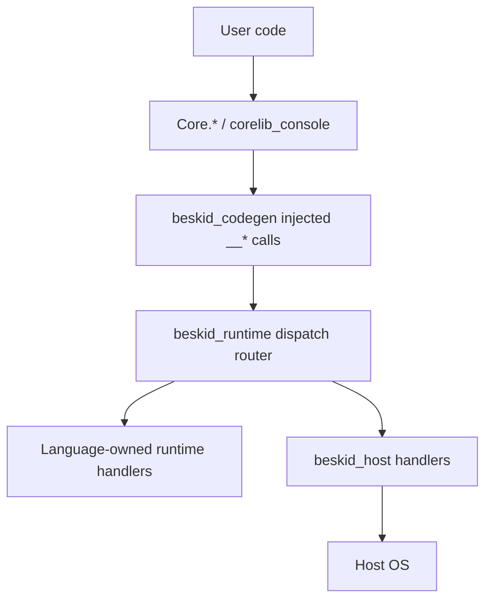
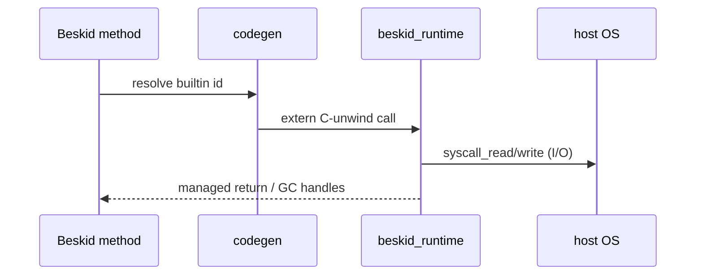

<!-- migrated from the legacy platform spec; canonical OpenSpec source -->
# Core-backed surfaces Specification

## Purpose

Corelib APIs backed by runtime builtins, host dispatch, and syscall facades under the unified Core.* namespace.

## Requirements

### Requirement: Split System I/O modules: Decision [D-CORE-STAB-0001]
The Beskid standard SHALL enforce the following migrated contract section. Accepted ADR decisions are binding; uppercase requirement keywords retain their BCP-14 meaning.

> | Rule | Detail |
> | --- | --- |
> | Surface | `Core.Input`, `Core.Output`, `Core.Error` under `packages/foundation/src/Core/` |
> | Non-goal | Monolithic `IO.bd` for standard streams |

**Stable ID:** `BSP-REQ-B7C0C8930193`  
**Legacy source:** `site/spec-content/platform-spec/core-library/stability-and-api-shape/runtime-backed-corelib-surfaces/adr/0001-split-system-io-modules/content.md`  
**Source SHA-256:** `37138cd061e99558f15774a66dab722268bb276c63e590ef5e5588b235d6bbd1`

#### Scenario: Conformance exercises Decision
- **GIVEN** an implementation claims conformance with this capability
- **WHEN** behavior governed by this contract section is exercised
- **THEN** every MUST, SHALL, REQUIRED, prohibition, and accepted decision in the section is satisfied

### Requirement: Console package is a separate shard: Decision [D-CORE-STAB-0002]
The Beskid standard SHALL enforce the following migrated contract section. Accepted ADR decisions are binding; uppercase requirement keywords retain their BCP-14 meaning.

> | Rule | Detail |
> | --- | --- |
> | Package | `compiler/corelib/packages/console` (`corelib_console`) |
> | Runtime | Streams stay in runtime package |

**Stable ID:** `BSP-REQ-F558CD2A78C5`  
**Legacy source:** `site/spec-content/platform-spec/core-library/stability-and-api-shape/runtime-backed-corelib-surfaces/adr/0002-console-package-separate-shard/content.md`  
**Source SHA-256:** `243c2535887c1d5dd4ec9e814b7181c3eb55a55407bf9ec6234f3a0e8c5a6d34`

#### Scenario: Conformance exercises Decision
- **GIVEN** an implementation claims conformance with this capability
- **WHEN** behavior governed by this contract section is exercised
- **THEN** every MUST, SHALL, REQUIRED, prohibition, and accepted decision in the section is satisfied

### Requirement: ABI version lockstep for builtins: Decision [D-CORE-STAB-0003]
The Beskid standard SHALL enforce the following migrated contract section. Accepted ADR decisions are binding; uppercase requirement keywords retain their BCP-14 meaning.

> | Rule | Detail |
> | --- | --- |
> | Version | `beskid_runtime_abi_version` / `BESKID_RUNTIME_ABI_VERSION` must match |
> | Change | Requires `beskid_abi`, runtime, and corelib updates together |

**Stable ID:** `BSP-REQ-5E71514CD664`  
**Legacy source:** `site/spec-content/platform-spec/core-library/stability-and-api-shape/runtime-backed-corelib-surfaces/adr/0003-abi-version-lockstep/content.md`  
**Source SHA-256:** `026967a30e74c0256dc124f92d1ac980844af7decee5435493814dd70cc73348`

#### Scenario: Conformance exercises Decision
- **GIVEN** an implementation claims conformance with this capability
- **WHEN** behavior governed by this contract section is exercised
- **THEN** every MUST, SHALL, REQUIRED, prohibition, and accepted decision in the section is satisfied

### Requirement: Pure Beskid modules out of scope: Decision [D-CORE-STAB-0004]
The Beskid standard SHALL enforce the following migrated contract section. Accepted ADR decisions are binding; uppercase requirement keywords retain their BCP-14 meaning.

> | Rule | Detail |
> | --- | --- |
> | In scope | Builtin/syscall facades documented here |
> | Out of scope | Pure Beskid `foundation` modules |

**Stable ID:** `BSP-REQ-7925A73A5547`  
**Legacy source:** `site/spec-content/platform-spec/core-library/stability-and-api-shape/runtime-backed-corelib-surfaces/adr/0004-pure-beskid-out-of-scope/content.md`  
**Source SHA-256:** `c40048dbee15609b72c1eadcc75761534e3bac35373d96e637c85713c2006270`

#### Scenario: Conformance exercises Decision
- **GIVEN** an implementation claims conformance with this capability
- **WHEN** behavior governed by this contract section is exercised
- **THEN** every MUST, SHALL, REQUIRED, prohibition, and accepted decision in the section is satisfied

## Informative Source Provenance

The records below preserve migration history and are not normative except where text was extracted into a requirement above.

### Source Record: Core-backed surfaces

**Authority:** informative provenance  
**Legacy path:** `/platform-spec/core-library/stability-and-api-shape/runtime-backed-corelib-surfaces/`  
**Source:** `site/spec-content/platform-spec/core-library/stability-and-api-shape/runtime-backed-corelib-surfaces/content.md`  
**SHA-256:** `ad54b95ae39180b9727f6c10f7263787f1936b7c7be29fff344bf41a0352b749`

<details>
<summary>Migrated source text</summary>

``````markdown
<SpecSection title="What this feature specifies" id="what-this-feature-specifies">
`Core-backed surfaces` defines one operational contract that a newcomer can follow end-to-end: first the model, then execution flow, then strict guarantees, concrete examples, and verification guidance. All modules listed here use the `Core.*` prefix per [D-CORE-NS-0001](/platform-spec/core-library/stability-and-api-shape/corelib-api-shape/adr/0004-single-core-namespace/).
</SpecSection>

<SpecSection title="Implementation anchors" id="implementation-anchors">
- Corelib docs in `compiler/corelib/beskid_corelib/docs/Core/`
- Console package: `compiler/corelib/packages/console/`
- Stream split: `Core.Input`, `Core.Output`, `Core.Error` in `compiler/corelib/packages/foundation/src/Core/`
- Runtime builtins in `compiler/crates/beskid_runtime/src/builtins/mod.rs`
- ABI builtin specs in `compiler/crates/beskid_abi/src/builtins.rs`
- Corelib ABI tests in `compiler/crates/beskid_tests/src/abi/contracts.rs`
</SpecSection>

## Decisions
<!-- spec:generate:adr-index -->
No open decisions. Closed choices are normative ADRs under **`adr/`** (`D-CORE-STAB-0001` … `D-CORE-STAB-0004`); use the reader **ADRs** tab for expandable detail.
<!-- /spec:generate:adr-index -->
## Articles
<!-- spec:generate:article-index -->
- [Contracts and edge cases](./articles/contracts-and-edge-cases/)
- [Design model](./articles/design-model/)
- [Examples](./articles/examples/)
- [FAQ and troubleshooting](./articles/faq-and-troubleshooting/)
- [Flow and algorithm](./articles/flow-and-algorithm/)
- [Verification and traceability](./articles/verification-and-traceability/)
<!-- /spec:generate:article-index -->
``````

</details>

### Source Record: Split System I/O modules

**Authority:** informative provenance  
**Legacy path:** `/platform-spec/core-library/stability-and-api-shape/runtime-backed-corelib-surfaces/adr/0001-split-system-io-modules/`  
**Source:** `site/spec-content/platform-spec/core-library/stability-and-api-shape/runtime-backed-corelib-surfaces/adr/0001-split-system-io-modules/content.md`  
**SHA-256:** `37138cd061e99558f15774a66dab722268bb276c63e590ef5e5588b235d6bbd1`

<details>
<summary>Migrated source text</summary>

``````markdown
## Context

Monolithic IO.bd hid syscall direction and descriptor typing.

## Decision

| Rule | Detail |
| --- | --- |
| Surface | `Core.Input`, `Core.Output`, `Core.Error` under `packages/foundation/src/Core/` |
| Non-goal | Monolithic `IO.bd` for standard streams |

## Consequences

Syscall descriptors stay typed per stream.

## Verification anchors

`packages/foundation/src/Core/Input/`, `Output/`, `Error/`; stream contract tests.
``````

</details>

### Source Record: Console package is a separate shard

**Authority:** informative provenance  
**Legacy path:** `/platform-spec/core-library/stability-and-api-shape/runtime-backed-corelib-surfaces/adr/0002-console-package-separate-shard/`  
**Source:** `site/spec-content/platform-spec/core-library/stability-and-api-shape/runtime-backed-corelib-surfaces/adr/0002-console-package-separate-shard/content.md`  
**SHA-256:** `243c2535887c1d5dd4ec9e814b7181c3eb55a55407bf9ec6234f3a0e8c5a6d34`

<details>
<summary>Migrated source text</summary>

``````markdown
## Context

Higher console work must not bloat runtime syscall modules.

## Decision

| Rule | Detail |
| --- | --- |
| Package | `compiler/corelib/packages/console` (`corelib_console`) |
| Runtime | Streams stay in runtime package |

## Consequences

Terminal features document against console package anchors.

## Verification anchors

`packages/console`; pckg workspace publish.
``````

</details>

### Source Record: ABI version lockstep for builtins

**Authority:** informative provenance  
**Legacy path:** `/platform-spec/core-library/stability-and-api-shape/runtime-backed-corelib-surfaces/adr/0003-abi-version-lockstep/`  
**Source:** `site/spec-content/platform-spec/core-library/stability-and-api-shape/runtime-backed-corelib-surfaces/adr/0003-abi-version-lockstep/content.md`  
**SHA-256:** `026967a30e74c0256dc124f92d1ac980844af7decee5435493814dd70cc73348`

<details>
<summary>Migrated source text</summary>

``````markdown
## Context

Builtin shape changes break AOT/JIT link without version alignment.

## Decision

| Rule | Detail |
| --- | --- |
| Version | `beskid_runtime_abi_version` / `BESKID_RUNTIME_ABI_VERSION` must match |
| Change | Requires `beskid_abi`, runtime, and corelib updates together |

## Consequences

Link failures surface at build time, not lazy dlopen.

## Verification anchors

`beskid_abi/src/builtins.rs`; `abi/contracts.rs`.
``````

</details>

### Source Record: Pure Beskid modules out of scope

**Authority:** informative provenance  
**Legacy path:** `/platform-spec/core-library/stability-and-api-shape/runtime-backed-corelib-surfaces/adr/0004-pure-beskid-out-of-scope/`  
**Source:** `site/spec-content/platform-spec/core-library/stability-and-api-shape/runtime-backed-corelib-surfaces/adr/0004-pure-beskid-out-of-scope/content.md`  
**SHA-256:** `c40048dbee15609b72c1eadcc75761534e3bac35373d96e637c85713c2006270`

<details>
<summary>Migrated source text</summary>

``````markdown
## Context

Not every corelib module is runtime-backed.

## Decision

| Rule | Detail |
| --- | --- |
| In scope | Builtin/syscall facades documented here |
| Out of scope | Pure Beskid `foundation` modules |

## Consequences

This feature does not duplicate language-meta semantics for pure libraries.

## Verification anchors

foundation package compile tests.
``````

</details>

### Source Record: Contracts and edge cases

**Authority:** informative provenance  
**Legacy path:** `/platform-spec/core-library/stability-and-api-shape/runtime-backed-corelib-surfaces/articles/contracts-and-edge-cases/`  
**Source:** `site/spec-content/platform-spec/core-library/stability-and-api-shape/runtime-backed-corelib-surfaces/articles/contracts-and-edge-cases/content.md`  
**SHA-256:** `a3d3efb5d444835f66ae49f768e3cafc2a983447744c48c84ff9ac2eed6b1a1e`

<details>
<summary>Migrated source text</summary>

``````markdown
## Contracts

- **ABI version lockstep** — Host, runtime, and AOT artifacts **must** agree on `beskid_runtime_abi_version` for a given toolchain release.
- **No duplicate syscall paths** — Console/ANSI **must not** bypass `Core.*` stream contracts for primitive read/write.
- **Panic across unwind** — Builtin entry points use `extern "C-unwind"`; Beskid panics map through `panic_io` without corrupting GC state.
- **Documented nullability** — Beskid wrappers **must** mirror ABI nullability for handles passed into GC-aware builtins.

## Edge cases

| Case | Behavior |
| --- | --- |
| Missing runtime on link | AOT/JIT link fails at build time, not lazy runtime dlopen |
| Platform without ANSI | Console package degrades per terminal capability probes |
| Embedded hosts without stderr | `Core.Error` may alias output; documented per execution profile |
| Metrics feature gate | `beskid_runtime` metrics builtins compile only with `metrics` feature |

## Non-runtime corelib

Pure Beskid modules in `foundation` and similar packages are out of scope here—they follow standard IL lowering without builtin tables.
``````

</details>

### Source Record: Design model

**Authority:** informative provenance  
**Legacy path:** `/platform-spec/core-library/stability-and-api-shape/runtime-backed-corelib-surfaces/articles/design-model/`  
**Source:** `site/spec-content/platform-spec/core-library/stability-and-api-shape/runtime-backed-corelib-surfaces/articles/design-model/content.md`  
**SHA-256:** `30bee3ac4a0e6d594a8d84b376fb033174d5aa7833d066d9eb4e7443be365c92`

<details>
<summary>Migrated source text</summary>

``````markdown
## Purpose

Some corelib modules are thin Beskid facades over **language runtime builtins**, **host-owned dispatch handlers**, and **OS syscalls**. ABI v4 makes that layering explicit: language semantics stay in `beskid_runtime`, while filesystem, environment, process, and TTY behavior are supplied by `beskid_host` in the `std` runtime profile.

Higher-level console and ANSI behavior lives in **`corelib_console`** (`compiler/corelib/packages/console`), not monolithic `IO.bd`.

## Layering



| Layer | Examples |
| --- | --- |
| **Beskid surface** | `Core.Input`, `Core.Output`, `Core.Error`, `Core.FS`, `Core.Syscall`, `Core.Time`, environment/process facades |
| **Console package** | ANSI and terminal helpers in `packages/console`; terminal-size fallback when host TTY returns `0` |
| **Language runtime module** | `alloc`, `fiber`, `channel`, `gc`, `panic_io`, clocks, strings, bytes in `beskid_runtime` |
| **Host module** | `fs_*`, `env_*`, `process_*`, `tty_winsize` handlers in `beskid_host` |
| **ABI catalog** | `compiler/runtime_manifest.toml` and generated `beskid_abi` tables pin symbol names, dispatch tags, owners, and signatures |

## Runtime profiles

| Profile | Surface behavior |
| --- | --- |
| `std` | Links `beskid_runtime` plus `beskid_host`; host-backed corelib surfaces are registered before user entry. |
| `minimal` | Links `beskid_runtime` only; language-owned surfaces work, while host-backed surfaces trap if called. |

`Runtime.Init` is a no-op stub in ABI v4. The host/link layer owns host registration through `beskid_host_register_all()`.

## Stability contract

Runtime-backed surfaces **must** keep ABI version alignment (`beskid_runtime_abi_version`, `BESKID_RUNTIME_ABI_VERSION` in AOT requests). Breaking builtin shapes requires coordinated bumps across:

- `compiler/runtime_manifest.toml`
- `beskid_abi` generated specs
- `beskid_runtime` language-owned implementations
- `beskid_host` host-owned implementations
- corelib Beskid declarations and docs under `compiler/corelib/beskid_corelib/docs/`

Language semantics (fiber scheduling, GC barriers) remain in **language-meta** and **execution** domains; this feature documents **which corelib entry points are native** and which native owner supplies them.

## Documentation sources

Trudoc-compatible prose lives beside Beskid sources in `compiler/corelib/`. Public site mirrors may appear under `site/website/src/legacy-bridge/corelib/Core/` for browsing.

## Implementation anchors

- Streams and Core facades: `compiler/corelib/packages/foundation/src/Core/`
- Console: `compiler/corelib/packages/console/`
- Language runtime: `compiler/crates/beskid_runtime/src/builtins/`
- Host runtime: `compiler/crates/beskid_host/`
- ABI manifest: `compiler/runtime_manifest.toml`
- ABI generated tables: `compiler/crates/beskid_abi/src/generated/`
- Tests: `compiler/crates/beskid_tests/src/abi/contracts.rs`
``````

</details>

### Source Record: Examples

**Authority:** informative provenance  
**Legacy path:** `/platform-spec/core-library/stability-and-api-shape/runtime-backed-corelib-surfaces/articles/examples/`  
**Source:** `site/spec-content/platform-spec/core-library/stability-and-api-shape/runtime-backed-corelib-surfaces/articles/examples/content.md`  
**SHA-256:** `6cca1e3ed4317081dc57103bde51a7a193c6f0dff50f2f9a3a3813b4ebc4e6a2`

<details>
<summary>Migrated source text</summary>

``````markdown
## Stdout write path

Application code calls `Core.Output` helpers → codegen targets `syscall_write` builtin → host writes fd 1. Errors surface as Beskid exceptions per runtime mapping.

## Fiber spawn

`fiber_spawn` builtin allocates fiber control block in runtime, registers GC roots, and schedules on runtime thread pool—corelib exposes typed wrappers only.

## ABI contract test snippet

Tests in `abi/contracts.rs` assert each exported builtin symbol referenced by codegen exists in the linked runtime library for the target triple.

## Separating console concerns

ANSI coloring and terminal size queries belong in **`corelib_console`** package dependencies on `Core.*` streams, keeping syscall surface minimal.
``````

</details>

### Source Record: FAQ and troubleshooting

**Authority:** informative provenance  
**Legacy path:** `/platform-spec/core-library/stability-and-api-shape/runtime-backed-corelib-surfaces/articles/faq-and-troubleshooting/`  
**Source:** `site/spec-content/platform-spec/core-library/stability-and-api-shape/runtime-backed-corelib-surfaces/articles/faq-and-troubleshooting/content.md`  
**SHA-256:** `e42e32a2f9b58039c208306231f1ac80a7d33e0bfedadeb037d4ccaaea359e51`

<details>
<summary>Migrated source text</summary>

``````markdown
## Link error for missing builtin symbol

Rebuild with matching `beskid` and runtime objects; verify `BESKID_RUNTIME_ABI_VERSION` alignment between CLI and cached AOT artifacts.

## I/O works in JIT but not AOT

Confirm AOT link includes `beskid_runtime` with the same feature set (e.g., platform I/O stubs).

## Should I add syscalls to `IO.bd`?

No—split across `Core.Input` / `Core.Output` / `Core.Error` and keep ANSI in `corelib_console`.

## Where is the authoritative builtin list?

`compiler/crates/beskid_abi/src/builtins.rs` plus re-exports in `beskid_runtime/src/builtins/mod.rs`.

## Doc drift vs implementation

Update Beskid sources and `compiler/corelib/beskid_corelib/docs/` together; run `beskid doc` before publishing packages with API browser content.
``````

</details>

### Source Record: Flow and algorithm

**Authority:** informative provenance  
**Legacy path:** `/platform-spec/core-library/stability-and-api-shape/runtime-backed-corelib-surfaces/articles/flow-and-algorithm/`  
**Source:** `site/spec-content/platform-spec/core-library/stability-and-api-shape/runtime-backed-corelib-surfaces/articles/flow-and-algorithm/content.md`  
**SHA-256:** `46e1aaef76f06657bb98c83c16efff7ba0ce7f70710f01df160792fe259fba73`

<details>
<summary>Migrated source text</summary>

``````markdown
## Call lowering flow



1. Semantic resolution binds call to a known runtime builtin or inlined fast path.
2. Codegen emits ABI-stable symbol reference from `beskid_abi` tables.
3. JIT (`beskid_engine`) or AOT (`beskid_aot`) links runtime object providing the symbol.
4. Builtin implementation enforces GC safepoints, panic translation, and I/O error mapping.

## I/O split algorithm

- **`Core.Input`** — read paths funnel through `syscall_read` helpers in `panic_io` module.
- **`Core.Output` / `Core.Error`** — write paths use `syscall_write` with distinct handles where the host distinguishes stderr.
- **Console package** — layers formatting/ANSI on top without redefining syscall contracts.

## Fiber and GC interaction

Fiber builtins (`fiber_spawn`, `fiber_yield`, …) and GC builtins (`gc_collect`, write barriers) share the same registration hub (`hub` module). Corelib wrappers **must not** reimplement scheduler logic in Beskid-only code paths for normative behavior.

## Verification flow

ABI contract tests compare declared signatures against runtime exports before release tags ship.

## Tests

`compiler/crates/beskid_tests/src/abi/contracts.rs` is the primary gate; extend when adding builtin surfaces.
``````

</details>

### Source Record: Verification and traceability

**Authority:** informative provenance  
**Legacy path:** `/platform-spec/core-library/stability-and-api-shape/runtime-backed-corelib-surfaces/articles/verification-and-traceability/`  
**Source:** `site/spec-content/platform-spec/core-library/stability-and-api-shape/runtime-backed-corelib-surfaces/articles/verification-and-traceability/content.md`  
**SHA-256:** `3d0f75dd8779546e0600e163963240582aef0195bdf9ad246c033175bcc13b9d`

<details>
<summary>Migrated source text</summary>

``````markdown
## Automated gates

| Gate | Location |
| --- | --- |
| ABI ↔ runtime export parity | `compiler/crates/beskid_tests/src/abi/contracts.rs` |
| AOT ABI version constant | `beskid_aot` + CLI build tests |
| Corelib compile smoke | `beskid_tests/src/projects/corelib/compile.rs` |

## Traceability matrix

| Surface area | Spec article | Code |
| --- | --- | --- |
| Syscall I/O | This feature + console-io-streams | `panic_io`, `System.*` |
| Fibers / GC | execution/runtime features | `fiber`, `gc` modules |
| Console ANSI | terminal-and-console area | `packages/console` |

## Release process

Runtime ABI bumps require: update `beskid_abi`, runtime implementations, ABI tests, platform-spec execution pages, and this feature bundle in one toolchain release.
``````

</details>
