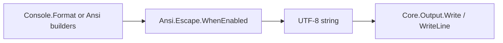

<!-- migrated from the legacy platform spec; canonical OpenSpec source -->
# ANSI escape model Specification

## Purpose

Normative ESC/CSI/OSC framing and sequence tables for corelib_console Ansi modules.

## Requirements

### Requirement: DEC save/restore cursor pair: Decision [D-CORE-TERM-0001]
The Beskid standard SHALL enforce the following migrated contract section. Accepted ADR decisions are binding; uppercase requirement keywords retain their BCP-14 meaning.

> | Rule | Detail |
> | --- | --- |
> | Save/restore | **DEC** `ESC 7` / `ESC 8` is the normative pair |
> | SCO | `CSI s` / `CSI u` are **not** required in v1 typed builders |

**Stable ID:** `BSP-REQ-52639C897AFE`  
**Legacy source:** `site/spec-content/platform-spec/core-library/terminal-and-console/ansi-escape-model/adr/0001-dec-save-restore-cursor/content.md`  
**Source SHA-256:** `f56c7820eeb1aa9abcf8ca6cc7ea49c6e4247619d04b948139414bd3dd8db344`

#### Scenario: Conformance exercises Decision
- **GIVEN** an implementation claims conformance with this capability
- **WHEN** behavior governed by this contract section is exercised
- **THEN** every MUST, SHALL, REQUIRED, prohibition, and accepted decision in the section is satisfied

### Requirement: Capability gating strips ANSI: Decision [D-CORE-TERM-0002]
The Beskid standard SHALL enforce the following migrated contract section. Accepted ADR decisions are binding; uppercase requirement keywords retain their BCP-14 meaning.

> | Rule | Detail |
> | --- | --- |
> | Gating | User-visible styled output **must** pass `Ansi.Escape.WhenEnabled` |
> | Tests | Ungated `Csi` remains for golden tests |

**Stable ID:** `BSP-REQ-EC85CC07D84B`  
**Legacy source:** `site/spec-content/platform-spec/core-library/terminal-and-console/ansi-escape-model/adr/0002-capability-gating-strips-ansi/content.md`  
**Source SHA-256:** `58b7bfa5718dc529b76fd6ccddac5022046cba4b5d69d37c9a97c44924146227`

#### Scenario: Conformance exercises Decision
- **GIVEN** an implementation claims conformance with this capability
- **WHEN** behavior governed by this contract section is exercised
- **THEN** every MUST, SHALL, REQUIRED, prohibition, and accepted decision in the section is satisfied

### Requirement: SGR color downgrade ladder: Decision [D-CORE-TERM-0003]
The Beskid standard SHALL enforce the following migrated contract section. Accepted ADR decisions are binding; uppercase requirement keywords retain their BCP-14 meaning.

> | Rule | Detail |
> | --- | --- |
> | Ladder | truecolor → 256 → basic per `EffectiveColorModel` |
> | Policy | Callers do not pick per-sequence models manually |

**Stable ID:** `BSP-REQ-D6F54FEB4A65`  
**Legacy source:** `site/spec-content/platform-spec/core-library/terminal-and-console/ansi-escape-model/adr/0003-sgr-color-downgrade-ladder/content.md`  
**Source SHA-256:** `9b2d233b12eb4a520d19e54fe04e166a0b27e83b34966cfaf423cceb4b8d61e4`

#### Scenario: Conformance exercises Decision
- **GIVEN** an implementation claims conformance with this capability
- **WHEN** behavior governed by this contract section is exercised
- **THEN** every MUST, SHALL, REQUIRED, prohibition, and accepted decision in the section is satisfied

### Requirement: OSC BEL termination in v1: Decision [D-CORE-TERM-0004]
The Beskid standard SHALL enforce the following migrated contract section. Accepted ADR decisions are binding; uppercase requirement keywords retain their BCP-14 meaning.

> | Rule | Detail |
> | --- | --- |
> | Terminator | **BEL** (`0x07`) in v1 |
> | ST | `ESC ` termination is **not** required |

**Stable ID:** `BSP-REQ-C62F10F511D8`  
**Legacy source:** `site/spec-content/platform-spec/core-library/terminal-and-console/ansi-escape-model/adr/0004-osc-bel-termination-v1/content.md`  
**Source SHA-256:** `b0b0f4ec592f83a312891c18ba7471edd8fcc10835399341799323979e5e30d9`

#### Scenario: Conformance exercises Decision
- **GIVEN** an implementation claims conformance with this capability
- **WHEN** behavior governed by this contract section is exercised
- **THEN** every MUST, SHALL, REQUIRED, prohibition, and accepted decision in the section is satisfied

### Requirement: Contracts and edge cases: Purpose [core-library/terminal-and-console/ansi-escape-model/articles/contracts-and-edge-cases]
The Beskid standard SHALL enforce the following migrated contract section. Accepted ADR decisions are binding; uppercase requirement keywords retain their BCP-14 meaning.

> State **MUST/SHOULD** rules for escape framing, capability gating, and the v1 conformance-tested CSI subset.

**Stable ID:** `BSP-REQ-A5BA80EA5D86`  
**Legacy source:** `site/spec-content/platform-spec/core-library/terminal-and-console/ansi-escape-model/articles/contracts-and-edge-cases/content.md`  
**Source SHA-256:** `f4fc4cc9c18eb1678611232f08366da1227b3ae77a9d668a11203f6a9ed6576f`

#### Scenario: Conformance exercises Purpose
- **GIVEN** an implementation claims conformance with this capability
- **WHEN** behavior governed by this contract section is exercised
- **THEN** every MUST, SHALL, REQUIRED, prohibition, and accepted decision in the section is satisfied

## Informative Source Provenance

The records below preserve migration history and are not normative except where text was extracted into a requirement above.

### Source Record: ANSI escape model

**Authority:** informative provenance  
**Legacy path:** `/platform-spec/core-library/terminal-and-console/ansi-escape-model/`  
**Source:** `site/spec-content/platform-spec/core-library/terminal-and-console/ansi-escape-model/content.md`  
**SHA-256:** `aee7f75feeaed8fbbb5b33abc93043c227813fe94333b92acd7011a2d6cd2f5a`

<details>
<summary>Migrated source text</summary>

``````markdown
<SpecSection title="What this feature specifies" id="what-this-feature-specifies">
Normative **terminal escape framing** for `corelib_console`: how `Ansi.Escape`, `Ansi.Cursor`, `Ansi.Erase`, `Ansi.Sgr`, `Ansi.Screen`, and `Ansi.Osc` compose bytes that terminals interpret. Tables in the [design model](./design-model/) article match repository **`ANSI.md`**; this hub states package boundaries and emission rules shared with [Console capabilities](/platform-spec/core-library/terminal-and-console/console-capabilities/).
</SpecSection>

<SpecSection title="Contract statement" id="contract-statement">
- **ESC** is ASCII **U+001B** (decimal 27). Implementations **must** use a single-byte ESC; language-specific `\e` escapes are informative only.
- **CSI** sequences **must** use the form `ESC [` + *parameter bytes* + *final byte* (semicolon-separated numeric parameters; optional spaces **may** appear between parameters and are **ignored** when parsing).
- **Private CSI modes** use `?` before parameters and final byte **`h`** (set) or **`l`** (reset).
- **DEC single-character** sequences (`ESC 7` / `ESC 8` save/restore cursor) are the **preferred** save/restore form; SCO `ESC[s` / `ESC[u` are not required in v1.
- User-visible emission **must** pass through **`Ansi.Escape.WhenEnabled`** (or builders that call it) so non-TTY and `NO_COLOR` hosts receive **empty** styled output, not raw escapes.
- Sequences marked *de-facto* in `ANSI.md` but not implemented in corelib **may** be emitted only via raw `Csi`/`OscSequence` helpers; they are not conformance-tested until listed in [contracts and edge cases](./contracts-and-edge-cases/).
</SpecSection>

<SpecSection title="Implementation anchors" id="implementation-anchors">
- `compiler/corelib/packages/console/src/Ansi/`
- Informative aggregate reference: repository root `ANSI.md`
- Golden tests: `compiler/corelib/beskid_corelib/tests/corelib_tests/src/console/AnsiEscapeTests.bd`, `AnsiSgrGoldenTests.bd`
</SpecSection>

## Decisions
<!-- spec:generate:adr-index -->
No open decisions. Closed choices are normative ADRs under **`adr/`** (`D-CORE-TERM-0001` … `D-CORE-TERM-0004`); use the reader **ADRs** tab for expandable detail.
<!-- /spec:generate:adr-index -->
## Articles
<!-- spec:generate:article-index -->
- [Contracts and edge cases](./articles/contracts-and-edge-cases/)
- [Design model](./articles/design-model/)
- [Examples](./articles/examples/)
- [Flow and algorithm](./articles/flow-and-algorithm/)
- [Verification and traceability](./articles/verification-and-traceability/)
<!-- /spec:generate:article-index -->
``````

</details>

### Source Record: DEC save/restore cursor pair

**Authority:** informative provenance  
**Legacy path:** `/platform-spec/core-library/terminal-and-console/ansi-escape-model/adr/0001-dec-save-restore-cursor/`  
**Source:** `site/spec-content/platform-spec/core-library/terminal-and-console/ansi-escape-model/adr/0001-dec-save-restore-cursor/content.md`  
**SHA-256:** `f56c7820eeb1aa9abcf8ca6cc7ea49c6e4247619d04b948139414bd3dd8db344`

<details>
<summary>Migrated source text</summary>

``````markdown
## Context

Authors need portable cursor stacking without SCO-specific CSI variants in typed builders.

## Decision

| Rule | Detail |
| --- | --- |
| Save/restore | **DEC** `ESC 7` / `ESC 8` is the normative pair |
| SCO | `CSI s` / `CSI u` are **not** required in v1 typed builders |

## Consequences

Typed `Ansi.Cursor` helpers emit DEC only; raw `Csi` may still be used in tests.

## Verification anchors

`AnsiEscapeTests.bd`; `ANSI.md` tables.
``````

</details>

### Source Record: Capability gating strips ANSI

**Authority:** informative provenance  
**Legacy path:** `/platform-spec/core-library/terminal-and-console/ansi-escape-model/adr/0002-capability-gating-strips-ansi/`  
**Source:** `site/spec-content/platform-spec/core-library/terminal-and-console/ansi-escape-model/adr/0002-capability-gating-strips-ansi/content.md`  
**SHA-256:** `58b7bfa5718dc529b76fd6ccddac5022046cba4b5d69d37c9a97c44924146227`

<details>
<summary>Migrated source text</summary>

``````markdown
## Context

Programs must not leak escapes to pipes, log files, or NO_COLOR environments.

## Decision

| Rule | Detail |
| --- | --- |
| Gating | User-visible styled output **must** pass `Ansi.Escape.WhenEnabled` |
| Tests | Ungated `Csi` remains for golden tests |

## Consequences

When `ShouldEmitAnsi()` is false, gated builders return empty strings.

## Verification anchors

`AnsiEscapeTests.bd`; console capability integration.
``````

</details>

### Source Record: SGR color downgrade ladder

**Authority:** informative provenance  
**Legacy path:** `/platform-spec/core-library/terminal-and-console/ansi-escape-model/adr/0003-sgr-color-downgrade-ladder/`  
**Source:** `site/spec-content/platform-spec/core-library/terminal-and-console/ansi-escape-model/adr/0003-sgr-color-downgrade-ladder/content.md`  
**SHA-256:** `9b2d233b12eb4a520d19e54fe04e166a0b27e83b34966cfaf423cceb4b8d61e4`

<details>
<summary>Migrated source text</summary>

``````markdown
## Context

Terminals differ in color depth; emitting unsupported `38;2` breaks dumb hosts.

## Decision

| Rule | Detail |
| --- | --- |
| Ladder | truecolor → 256 → basic per `EffectiveColorModel` |
| Policy | Callers do not pick per-sequence models manually |

## Consequences

SGR builders consult capability probes before emitting RGB CSI.

## Verification anchors

`AnsiSgrGoldenTests.bd`; `CapabilitiesTests.bd`.
``````

</details>

### Source Record: OSC BEL termination in v1

**Authority:** informative provenance  
**Legacy path:** `/platform-spec/core-library/terminal-and-console/ansi-escape-model/adr/0004-osc-bel-termination-v1/`  
**Source:** `site/spec-content/platform-spec/core-library/terminal-and-console/ansi-escape-model/adr/0004-osc-bel-termination-v1/content.md`  
**SHA-256:** `b0b0f4ec592f83a312891c18ba7471edd8fcc10835399341799323979e5e30d9`

<details>
<summary>Migrated source text</summary>

``````markdown
## Context

OSC framing varies across terminals; v1 picks one terminator for golden tests.

## Decision

| Rule | Detail |
| --- | --- |
| Terminator | **BEL** (`0x07`) in v1 |
| ST | `ESC ` termination is **not** required |

## Consequences

OSC helpers emit BEL-terminated sequences only until a future ADR extends ST.

## Verification anchors

`AnsiEscapeTests.bd`; `Ansi.Osc` sources.
``````

</details>

### Source Record: Contracts and edge cases

**Authority:** informative provenance  
**Legacy path:** `/platform-spec/core-library/terminal-and-console/ansi-escape-model/articles/contracts-and-edge-cases/`  
**Source:** `site/spec-content/platform-spec/core-library/terminal-and-console/ansi-escape-model/articles/contracts-and-edge-cases/content.md`  
**SHA-256:** `f4fc4cc9c18eb1678611232f08366da1227b3ae77a9d668a11203f6a9ed6576f`

<details>
<summary>Migrated source text</summary>

``````markdown
## Purpose

State **MUST/SHOULD** rules for escape framing, capability gating, and the v1 conformance-tested CSI subset.

## Canonical references

- Feature hub: [ANSI escape model](/platform-spec/core-library/terminal-and-console/ansi-escape-model/)
- Sequence tables: [design model](./design-model/) and repository `ANSI.md`
- Color downgrade: [Console capabilities](/platform-spec/core-library/terminal-and-console/console-capabilities/)

## Detailed behavior

### Normative requirements

| ID | Requirement |
| --- | --- |
| **ANSI-001** | `Ansi.Escape.Esc()` **must** return exactly one U+001B code unit. |
| **ANSI-002** | `Csi(body, finalByte)` **must** produce `ESC[` + *body* + *finalByte* with no capability filtering (test and composition primitive). |
| **ANSI-003** | `EmitCsi`, `EmitOsc`, `EmitDec`, and builders whose `IntoSequence` calls `WhenEnabled` **must** return `""` when `Console.Capabilities.ShouldEmitAnsi()` is false. |
| **ANSI-004** | `PrivateMode(mode, enable)` **must** encode `ESC[?{mode}h` or `ESC[?{mode}l`. |
| **ANSI-005** | `DecSaveCursor` / `DecRestoreCursor` **must** emit `ESC 7` and `ESC 8` respectively (single-byte suffix, no bracket). |
| **ANSI-006** | `OscSequence(payload)` **must** terminate with BEL (`0x07`). |
| **ANSI-007** | `SgrBuilder` RGB helpers **must** downgrade per `EffectiveColorModel` before calling `EmitCsi` (see [Console capabilities](/platform-spec/core-library/terminal-and-console/console-capabilities/)). |
| **ANSI-008** | Golden tests listed in [verification and traceability](./verification-and-traceability/) **must** match byte-for-byte output when emission is enabled. |

### Conformance-tested CSI final bytes (v1)

| Final | Builder surface | Example |
| --- | --- | --- |
| `m` | `Ansi.Sgr`, `Ansi.StyleChain` | `ESC[1;31m` |
| `A`–`G`, `H`, `f` | `Ansi.Cursor` | `ESC[2J` via `Ansi.Erase` uses `J`/`K` |
| `J`, `K` | `Ansi.Erase` | `ESC[2J`, `ESC[2K` |
| `h`, `l` | `Ansi.Escape.PrivateMode`, `Ansi.Screen` | `ESC[?1049h` |

Sequences present in `ANSI.md` but **without** a corelib builder or golden test are **informative** until added to this table.

### Edge cases

- **Piped stdout**: When stdout is not a TTY and `FORCE_COLOR` is unset, styled helpers **must** emit no escapes (**ANSI-003**); plain `Core.Output.Write` still writes bytes.
- **Partial terminal support**: Terminals **may** ignore italic, blink, or truecolor; downgrade reduces garbled output but cannot guarantee visual fidelity.
- **Multiplexers** (`tmux`, `screen`): Alternate-buffer and private-mode sequences **may** behave differently; corelib does not special-case multiplexers in v1.
- **Keyboard redefinition (`ESC[{code};{string}p`)**: Not implemented; documented in `ANSI.md` for historical completeness only.
- **Erase without cursor move**: After `ESC[2K`, callers **should** emit `\r` if the cursor must sit at column 1 (see design model).

### Non-goals (v1)

## Verification

Each **ANSI-*** row maps to `AnsiEscapeTests.bd` / `AnsiSgrGoldenTests.bd` or capability tests — [verification and traceability](./verification-and-traceability/).

## Related topics

- [Flow and algorithm](./flow-and-algorithm/)
- [Console markup format](/platform-spec/core-library/terminal-and-console/console-markup-format/) — must use builders, not raw ESC in markup

- DCS string handling
- Full xterm private-mode catalog
- Host-specific WIN32 console APIs beyond `Platform.*` extern stubs
``````

</details>

### Source Record: Design model

**Authority:** informative provenance  
**Legacy path:** `/platform-spec/core-library/terminal-and-console/ansi-escape-model/articles/design-model/`  
**Source:** `site/spec-content/platform-spec/core-library/terminal-and-console/ansi-escape-model/articles/design-model/content.md`  
**SHA-256:** `20aa0d2eabf2f8f3ad2f9dbab525e36389f90cb8853e8cde17dd661ea57de94f`

<details>
<summary>Migrated source text</summary>

``````markdown
## Purpose

Normative **ESC / CSI / OSC** taxonomy and sequence tables used by `corelib_console` `Ansi.*` builders, aligned with repository **`ANSI.md`**.

## Canonical references

- Feature hub and decisions **D-TC-001**–**D-TC-004**: [ANSI escape model](/platform-spec/core-library/terminal-and-console/ansi-escape-model/)
- Informative mirror: repository root `ANSI.md`
- Requirement IDs **ANSI-001**–**ANSI-008**: [contracts and edge cases](./contracts-and-edge-cases/)
- Gating: [Console capabilities](/platform-spec/core-library/terminal-and-console/console-capabilities/)

## Detailed behavior

The **ANSI escape model** describes how bytes on a terminal byte stream are interpreted as control functions versus printable text. `corelib_console` maps this model to composable builders.

### Escape prefix and sequence families

All standard escape codes are introduced by **ESC** (U+001B). Equivalent literal forms include `\x1B`, `\033`, and decimal `27`.

| Family | Introducer | Role |
| --- | --- | --- |
| **ESC** | `ESC` + final byte | Single-byte controls (e.g. DEC save `ESC 7`) |
| **CSI** | `ESC [` or byte `0x9B` | Parameterized controls (cursor, erase, SGR, modes) |
| **DCS** | `ESC P` or `0x90` | Device control strings (not used in v1 corelib) |
| **OSC** | `ESC ]` or `0x9D` | Operating-system commands (title, hyperlinks subset) |

CSI parameters are semicolon-separated. Example: `\x1b[1;31m` sets bold red foreground (SGR `1` + color `31`, final byte `m`).

### General ASCII control characters

| Name | Dec | Hex | C-escape | Description |
| --- | --- | --- | --- | --- |
| BEL | 7 | 0x07 | `\a` | Terminal bell |
| BS | 8 | 0x08 | `\b` | Backspace |
| HT | 9 | 0x09 | `\t` | Horizontal tab |
| LF | 10 | 0x0A | `\n` | Line feed |
| VT | 11 | 0x0B | `\v` | Vertical tab |
| FF | 12 | 0x0C | `\f` | Form feed |
| CR | 13 | 0x0D | `\r` | Carriage return |
| ESC | 27 | 0x1B | (no portable `\e`) | Escape |
| DEL | 127 | 0x7F | — | Delete |

Stream helpers in [Console I/O streams](/platform-spec/core-library/terminal-and-console/console-io-streams/) write UTF-8 **string** bytes; control characters above are ordinary string contents at the syscall boundary.

### Cursor movement (CSI)

| Sequence | Description |
| --- | --- |
| `ESC[H` | Cursor home (1,1) |
| `ESC[{line};{column}H` or `f` | Cursor to line, column |
| `ESC[#A` | Up *#* lines |
| `ESC[#B` | Down *#* lines |
| `ESC[#C` | Right *#* columns |
| `ESC[#D` | Left *#* columns |
| `ESC[#E` | Cursor to beginning of next line, *#* lines down |
| `ESC[#F` | Cursor to beginning of previous line, *#* lines up |
| `ESC[#G` | Cursor to column *#* |
| `ESC[6n` | Request cursor position (reply `ESC[row;colR`) |
| `ESC M` | Reverse index (scroll if needed) |
| `ESC 7` / `ESC 8` | DEC save / restore cursor |
| `ESC[s` / `ESC[u` | SCO save / restore (non-normative for Beskid builders) |

`Ansi.Cursor` fluent steps map to the CSI rows above; save/restore uses **DEC** per hub decision **D-TC-001**.

### Erase functions (CSI)

| Sequence | Description |
| --- | --- |
| `ESC[J` / `ESC[0J` | Erase from cursor to end of display |
| `ESC[1J` | Erase from cursor to start of display |
| `ESC[2J` | Erase entire display |
| `ESC[3J` | Erase saved lines (scrollback) |
| `ESC[K` / `ESC[0K` | Erase from cursor to end of line |
| `ESC[1K` | Erase from start of line to cursor |
| `ESC[2K` | Erase entire line |

Erasing a line does not move the cursor; callers **should** emit `\r` when the cursor must return to column 1.

### Graphics mode (SGR, final byte `m`)

| Sequence | Reset | Description |
| --- | --- | --- |
| `ESC[0m` | — | Reset all attributes |
| `ESC[1m` | `ESC[22m` | Bold |
| `ESC[2m` | `ESC[22m` | Dim |
| `ESC[3m` | `ESC[23m` | Italic |
| `ESC[4m` | `ESC[24m` | Underline |
| `ESC[5m` | `ESC[25m` | Blink |
| `ESC[7m` | `ESC[27m` | Inverse |
| `ESC[8m` | `ESC[28m` | Hidden |
| `ESC[9m` | `ESC[29m` | Strikethrough |

`Ansi.Sgr` builds semicolon-joined parameter lists and wraps them in `EmitCsi(..., "m")`.

### Basic 8/16 colors

| Color | Foreground | Background |
| --- | --- | --- |
| Black | 30 | 40 |
| Red | 31 | 41 |
| Green | 32 | 42 |
| Yellow | 33 | 43 |
| Blue | 34 | 44 |
| Magenta | 35 | 45 |
| Cyan | 36 | 46 |
| White | 37 | 47 |
| Default | 39 | 49 |

Bright variants use codes **90–97** (foreground) and **100–107** (background), or bold+base (`1;31`) on terminals without aixterm bright codes.

### Indexed 256 and RGB

| Sequence | Role |
| --- | --- |
| `ESC[38;5;{n}m` | Foreground palette index 0–255 |
| `ESC[48;5;{n}m` | Background palette index 0–255 |
| `ESC[38;2;{r};{g};{b}m` | Foreground truecolor |
| `ESC[48;2;{r};{g};{b}m` | Background truecolor |

Index bands: **0–7** standard, **8–15** bright, **16–231** 6×6×6 cube (`16 + 36r + 6g + b`), **232–255** grayscale steps.

### Screen and private modes

Common **private** CSI modes (final `h` / `l`):

| Sequence | Description |
| --- | --- |
| `ESC[?25l` / `ESC[?25h` | Hide / show cursor |
| `ESC[?47l` / `ESC[?47h` | Restore / save screen |
| `ESC[?1049l` / `ESC[?1049h` | Disable / enable alternate buffer |

`Ansi.Screen` and `Ansi.Escape.PrivateMode` cover the subset used by corelib tests; legacy VGA resolution `ESC[={n}h` modes are documented in `ANSI.md` only.

### Corelib module map

| Module | Responsibility |
| --- | --- |
| `Ansi.Escape` | Framing, `WhenEnabled`, DEC/OSC helpers |
| `Ansi.Cursor` | Movement builder → gated sequence |
| `Ansi.Erase` | Display/line erase builder |
| `Ansi.Sgr` | Attribute and color builder with downgrade |
| `Ansi.Screen` | Scroll region and alt-screen helpers |
| `Ansi.Osc` | OSC payloads (BEL-terminated) |
| `Ansi.StyleChain` | Markup attribute chain used by `Console.Format` |

## Verification

Golden tests: `AnsiEscapeTests.bd`, `AnsiSgrGoldenTests.bd` — see [verification and traceability](./verification-and-traceability/).

## Related topics

- [Flow and algorithm](./flow-and-algorithm/) — compose, gate, write pipeline
- [Examples](./examples/) — `EmitCsi`, cursor, SGR usage
- [Console I/O streams](/platform-spec/core-library/terminal-and-console/console-io-streams/) — UTF-8 delivery to stdout
``````

</details>

### Source Record: Examples

**Authority:** informative provenance  
**Legacy path:** `/platform-spec/core-library/terminal-and-console/ansi-escape-model/articles/examples/`  
**Source:** `site/spec-content/platform-spec/core-library/terminal-and-console/ansi-escape-model/articles/examples/content.md`  
**SHA-256:** `a865922a1921f8d45e0b9af8d321dee7e99fe774f87a982909a8c697846b8492`

<details>
<summary>Migrated source text</summary>

``````markdown
## Purpose

Document **examples** for the **Ansi Escape Model** feature: role-specific normative detail beyond the feature hub.

## Canonical references

- Feature hub: [Ansi Escape Model](/platform-spec/core-library/terminal-and-console/ansi-escape-model/)
- Sibling articles in this bundle (design model, contracts, flow, examples, verification)

## Detailed behavior

### Bold red foreground (CSI `m`)

```beskid
string esc = Ansi.Escape.Esc();
string seq = Ansi.Escape.EmitCsi("1;31", "m");
Core.Output.Write("${seq}Hello${Ansi.Sgr.ResetSuffix()}");
```

Ungated framing for tests:

```beskid
string raw = Ansi.Escape.CsiSequence("1;31", "m");
// raw == "\x1b[1;31m" when Esc() is U+001B
```

### Cursor home and clear display

```beskid
string moves = Ansi.Cursor.IntoSequence(
    Ansi.Cursor.Home(Ansi.Cursor.Start())
);
string clear = Ansi.Erase.IntoSequence(
    Ansi.Erase.DisplayAll(Ansi.Erase.Start())
);
Core.Output.Write("${moves}${clear}");
```

When `ShouldEmitAnsi()` is false, `IntoSequence` returns `""` for both builders.

### Alternate screen buffer

```beskid
string on = Ansi.Escape.WhenEnabled(Ansi.Escape.PrivateMode("1049", true));
string off = Ansi.Escape.WhenEnabled(Ansi.Escape.PrivateMode("1049", false));
```

Golden tests call `PrivateMode` without gating to assert framing bytes.

### Fluent SGR with automatic reset

```beskid
string line = Ansi.Sgr.Start()
    .Bold()
    .FgBasic(31)
    .ApplyTo("error");
Core.Output.WriteLine(line);
```

`ApplyTo` appends gated `ESC[0m` when attributes were applied.

### DEC save / restore around progress render

```beskid
string save = Ansi.Escape.EmitDec("7");
string restore = Ansi.Escape.EmitDec("8");
Core.Output.Write("${save}");
// draw status line
Core.Output.Write("${restore}");
```

Prefer DEC sequences over SCO `ESC[s` / `ESC[u` per decision **D-TC-001**.

## Verification

See the verification and traceability article in this bundle and `compiler/corelib/beskid_corelib/tests/corelib_tests/src/console/`.

## Related topics

- Parent [feature hub](/platform-spec/core-library/terminal-and-console/ansi-escape-model/) and [Terminal and console area](/platform-spec/core-library/terminal-and-console/)
``````

</details>

### Source Record: Flow and algorithm

**Authority:** informative provenance  
**Legacy path:** `/platform-spec/core-library/terminal-and-console/ansi-escape-model/articles/flow-and-algorithm/`  
**Source:** `site/spec-content/platform-spec/core-library/terminal-and-console/ansi-escape-model/articles/flow-and-algorithm/content.md`  
**SHA-256:** `7d5d9e9daaa2f9c4fdee0f035632ad6837cf8bc49b0d3d01eb9eb7d4e0a208da`

<details>
<summary>Migrated source text</summary>

``````markdown
## Purpose

Describe how escape bytes are **composed**, **gated** by capabilities, and **written** to stdout.

## Canonical references

- Tables: [design model](./design-model/)
- Requirements: [contracts and edge cases](./contracts-and-edge-cases/)
- Write path: [Console I/O streams / flow and algorithm](/platform-spec/core-library/terminal-and-console/console-io-streams/flow-and-algorithm/)

## Detailed behavior

### Emission pipeline



1. **Compose** — Fluent builders (`Cursor`, `Erase`, `Sgr`) accumulate parameter strings; `JoinArgs` inserts `;` between SGR parameters without trailing separators.
2. **Frame** — `Csi` / `PrivateMode` / `DecSaveCursor` / `OscSequence` produce raw escape strings (ungated).
3. **Gate** — `WhenEnabled` returns `""` or the sequence based on `ShouldEmitAnsi()` (stdout TTY + color policy).
4. **Deliver** — Higher layers (`Console.FormatLine`, controls renderers) pass the final string to [Console I/O streams](/platform-spec/core-library/terminal-and-console/console-io-streams/) helpers.

### SGR color downgrade algorithm

When `SgrBuilder.FgRgb` / `BgRgb` runs:

1. `Capabilities.ProbeStdout()` reads TTY and environment flags.
2. `EffectiveColorModel` selects **TrueColor**, **Indexed256**, or **Basic16** (or forces basic when color is stripped).
3. Parameter bytes are chosen:
   - TrueColor → `38;2;r;g;b` / `48;2;r;g;b`
   - Indexed256 → `38;5;n` / `48;5;n` via `RgbTo256Index`
   - Basic → nearest `30–37` / `40–47` via `RgbToBasicForeground` / `RgbToBasicBackground`
4. `IntoPrefix` calls `EmitCsi(openArgs, "m")`; `ApplyTo` appends text and `ResetSuffix` (`ESC[0m` gated).

### Builder concatenation

`Ansi.Cursor.CursorBuilder` appends fragments in call order, then `IntoSequence` applies a **single** gate at the end. Multiple CSI operations in one string are valid because terminals process them left-to-right.

### Test-only ungated paths

## Verification

`CapabilitiesTests.bd` asserts empty gated output when ANSI disabled; golden tests use ungated `CsiSequence` for framing only.

## Related topics

- [Examples](./examples/)
- [Console controls](/platform-spec/core-library/terminal-and-console/console-controls/flow-and-algorithm/) — frame save/restore around render

Conformance tests call `CsiSequence` and `PrivateMode` directly to assert framing without depending on TTY state. Production markup **must** use `EmitCsi` or builders that call `WhenEnabled`.
``````

</details>

### Source Record: Verification and traceability

**Authority:** informative provenance  
**Legacy path:** `/platform-spec/core-library/terminal-and-console/ansi-escape-model/articles/verification-and-traceability/`  
**Source:** `site/spec-content/platform-spec/core-library/terminal-and-console/ansi-escape-model/articles/verification-and-traceability/content.md`  
**SHA-256:** `3d539dcec7d18014518fa18e1f92b48b1d75dc6e71470556e506a711fe474b68`

<details>
<summary>Migrated source text</summary>

``````markdown
## Purpose

Document **verification and traceability** for the **Ansi Escape Model** feature: role-specific normative detail beyond the feature hub.

## Canonical references

- Feature hub: [Ansi Escape Model](/platform-spec/core-library/terminal-and-console/ansi-escape-model/)
- Sibling articles in this bundle (design model, contracts, flow, examples, verification)

## Detailed behavior

### Source anchors

| Path | Coverage |
| --- | --- |
| `compiler/corelib/packages/console/src/Ansi/Escape.bd` | ESC, CSI, private mode, DEC, OSC, gating |
| `compiler/corelib/packages/console/src/Ansi/Cursor.bd` | Movement CSI |
| `compiler/corelib/packages/console/src/Ansi/Erase.bd` | Display/line erase |
| `compiler/corelib/packages/console/src/Ansi/Sgr.bd` | SGR builder and downgrade |
| `compiler/corelib/packages/console/src/Ansi/Screen.bd` | Scroll region / alt screen |
| Repository `ANSI.md` | Informative full sequence catalog |

### Corelib tests

| Test file | Asserts |
| --- | --- |
| `AnsiEscapeTests.bd` | CSI bold red, reset, `?1049h`, DEC save, cursor home, erase display |
| `AnsiSgrGoldenTests.bd` | SGR chains and reset suffix |
| `AnsiStyleChainTests.bd` | Markup attribute chain → escapes |
| `AnsiBuildersTests.bd` | Screen scroll region framing |
| `CapabilitiesTests.bd` | Gated vs empty output when ANSI disabled |

Tests live under `compiler/corelib/beskid_corelib/tests/corelib_tests/src/console/` and run as part of the `corelib_tests` project.

### Traceability rule

Any change to **ANSI-001** through **ANSI-008** in [contracts and edge cases](./contracts-and-edge-cases/) **must** update or add a golden test in the same change. Informative `ANSI.md` updates are recommended but not CI-gated.

## Verification

See the verification and traceability article in this bundle and `compiler/corelib/beskid_corelib/tests/corelib_tests/src/console/`.

## Related topics

- Parent [feature hub](/platform-spec/core-library/terminal-and-console/ansi-escape-model/) and [Terminal and console area](/platform-spec/core-library/terminal-and-console/)
``````

</details>
