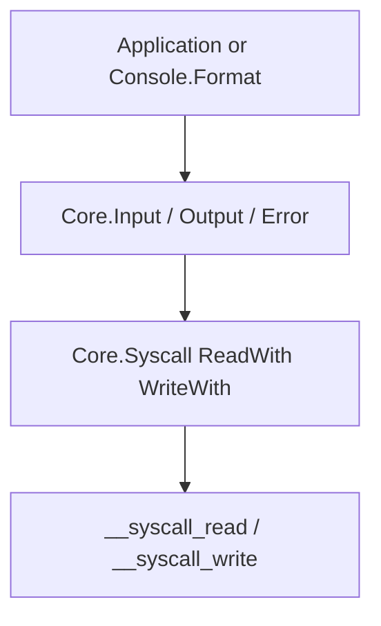

<!-- migrated from the legacy platform spec; canonical OpenSpec source -->
# Console I/O streams Specification

## Purpose

Normative stdin/stdout/stderr contracts via Core.Syscall and split stream modules.

## Requirements

### Requirement: Split stream modules per fd: Decision [D-CORE-TERM-0010]
The Beskid standard SHALL enforce the following migrated contract section. Accepted ADR decisions are binding; uppercase requirement keywords retain their BCP-14 meaning.

> | Rule | Detail |
> | --- | --- |
> | Modules | `Core.Input`, `Core.Output`, `Core.Error` |
> | Forbidden | Monolithic console IO type for standard streams |

**Stable ID:** `BSP-REQ-4065DBA02FD8`  
**Legacy source:** `site/spec-content/platform-spec/core-library/terminal-and-console/console-io-streams/adr/0010-split-stream-modules/content.md`  
**Source SHA-256:** `51538857d556e3e905fd71638bd99f42f60595f03e3df1920765498ea096f043`

#### Scenario: Conformance exercises Decision
- **GIVEN** an implementation claims conformance with this capability
- **WHEN** behavior governed by this contract section is exercised
- **THEN** every MUST, SHALL, REQUIRED, prohibition, and accepted decision in the section is satisfied

### Requirement: Write panics; read returns Result: Decision [D-CORE-TERM-0011]
The Beskid standard SHALL enforce the following migrated contract section. Accepted ADR decisions are binding; uppercase requirement keywords retain their BCP-14 meaning.

> | Rule | Detail |
> | --- | --- |
> | Write | `Write` / `WriteLine` **must** panic on `WriteWith` failure |
> | Read | `Read` / `ReadLine` return `` `Result<string, SyscallError>` `` |

**Stable ID:** `BSP-REQ-08679405E5C7`  
**Legacy source:** `site/spec-content/platform-spec/core-library/terminal-and-console/console-io-streams/adr/0011-write-panic-read-result/content.md`  
**Source SHA-256:** `07021422c4749e0af637bd236a361fa6b80740b40d993c61d41e29404466c08b`

#### Scenario: Conformance exercises Decision
- **GIVEN** an implementation claims conformance with this capability
- **WHEN** behavior governed by this contract section is exercised
- **THEN** every MUST, SHALL, REQUIRED, prohibition, and accepted decision in the section is satisfied

### Requirement: WriteLine emits Unix LF: Decision [D-CORE-TERM-0012]
The Beskid standard SHALL enforce the following migrated contract section. Accepted ADR decisions are binding; uppercase requirement keywords retain their BCP-14 meaning.

> | Rule | Detail |
> | --- | --- |
> | Ending | `WriteLine` **must** append `\n` only |
> | Windows | Host/platform layer **may** translate later without API change |

**Stable ID:** `BSP-REQ-6FAE290B13F9`  
**Legacy source:** `site/spec-content/platform-spec/core-library/terminal-and-console/console-io-streams/adr/0012-writeline-unix-lf/content.md`  
**Source SHA-256:** `bd4db58ec30359eaa49c213892e05aa8013474632d2a077414d46e3c40b23998`

#### Scenario: Conformance exercises Decision
- **GIVEN** an implementation claims conformance with this capability
- **WHEN** behavior governed by this contract section is exercised
- **THEN** every MUST, SHALL, REQUIRED, prohibition, and accepted decision in the section is satisfied

## Informative Source Provenance

The records below preserve migration history and are not normative except where text was extracted into a requirement above.

### Source Record: Console I/O streams

**Authority:** informative provenance  
**Legacy path:** `/platform-spec/core-library/terminal-and-console/console-io-streams/`  
**Source:** `site/spec-content/platform-spec/core-library/terminal-and-console/console-io-streams/content.md`  
**SHA-256:** `75d15d31a8d2e615709ce38248d30469feabe7eccc0ce5c6a5f68b8571c7fb18`

<details>
<summary>Migrated source text</summary>

``````markdown
<SpecSection title="What this feature specifies" id="what-this-feature-specifies">
Split **standard stream helpers** in `corelib_foundation` (`Core.*`): `Core.Input` (stdin), `Core.Output` (stdout), and `Core.Error` (stderr). All traffic uses **`Core.Syscall.ReadWith`** / **`WriteWith`** with typed `Descriptor::Standard(StandardStream::*)` selectors—no direct fd integers in user code.
</SpecSection>

<SpecSection title="Contract statement" id="contract-statement">
| Stream | Module | Syscall descriptor | Read | Write |
| --- | --- | --- | --- | --- |
| stdin | `Core.Input` | `Stdin` | `Read`, `ReadLine` → `Result<string, SyscallError>` | **Not supported** |
| stdout | `Core.Output` | `Stdout` | **Not supported** | `Write`, `WriteLine` |
| stderr | `Core.Error` | `Stderr` | **Not supported** | `Write`, `WriteLine` |

- Encoding at the boundary is UTF-8 bytes of the Beskid **`string`** type.
- `WriteLine` **must** write the text then a single **`"\n"`** line feed (corelib policy; not CRLF unless host translates).
- `Write` / `WriteLine` failures from `WriteWith` **must** panic with `__panic_str("Core.Output.Write failed")` or the stderr equivalent—there is no `Result` on write helpers in v1.
- ANSI and markup **must not** be interpreted in these modules; escape bytes are ordinary string contents (see [ANSI escape model](/platform-spec/core-library/terminal-and-console/ansi-escape-model/)).
</SpecSection>

<SpecSection title="Implementation anchors" id="implementation-anchors">
- `compiler/corelib/packages/foundation/src/Core/Input/Input.bd`, `Output/Output.bd`, `Error/Error.bd`
- `compiler/corelib/packages/foundation/src/Core/Syscall/`
- Informative module docs: `compiler/corelib/beskid_corelib/docs/Core/Input.md`, `Output.md`, `Error.md`
</SpecSection>

## Decisions
<!-- spec:generate:adr-index -->
No open decisions. Closed choices are normative ADRs under **`adr/`** (`D-CORE-TERM-0010` … `D-CORE-TERM-0012`); use the reader **ADRs** tab for expandable detail.
<!-- /spec:generate:adr-index -->
## Articles
<!-- spec:generate:article-index -->
- [Contracts and edge cases](./articles/contracts-and-edge-cases/)
- [Design model](./articles/design-model/)
- [Examples](./articles/examples/)
- [Flow and algorithm](./articles/flow-and-algorithm/)
- [Verification and traceability](./articles/verification-and-traceability/)
<!-- /spec:generate:article-index -->
``````

</details>

### Source Record: Split stream modules per fd

**Authority:** informative provenance  
**Legacy path:** `/platform-spec/core-library/terminal-and-console/console-io-streams/adr/0010-split-stream-modules/`  
**Source:** `site/spec-content/platform-spec/core-library/terminal-and-console/console-io-streams/adr/0010-split-stream-modules/content.md`  
**SHA-256:** `51538857d556e3e905fd71638bd99f42f60595f03e3df1920765498ea096f043`

<details>
<summary>Migrated source text</summary>

``````markdown
## Context

A single Console IO type obscures direction and syscall descriptors.

## Decision

| Rule | Detail |
| --- | --- |
| Modules | `Core.Input`, `Core.Output`, `Core.Error` |
| Forbidden | Monolithic console IO type for standard streams |

## Consequences

Each module binds one `StandardStream` descriptor; cross-stream APIs stay separate.

## Verification anchors

`packages/foundation/src/Core/Input/Input.bd`, `Output/Output.bd`, `Error/Error.bd`.
``````

</details>

### Source Record: Write panics; read returns Result

**Authority:** informative provenance  
**Legacy path:** `/platform-spec/core-library/terminal-and-console/console-io-streams/adr/0011-write-panic-read-result/`  
**Source:** `site/spec-content/platform-spec/core-library/terminal-and-console/console-io-streams/adr/0011-write-panic-read-result/content.md`  
**SHA-256:** `07021422c4749e0af637bd236a361fa6b80740b40d993c61d41e29404466c08b`

<details>
<summary>Migrated source text</summary>

``````markdown
## Context

v1 write helpers are infallible at the type level; read paths need explicit error handling.

## Decision

| Rule | Detail |
| --- | --- |
| Write | `Write` / `WriteLine` **must** panic on `WriteWith` failure |
| Read | `Read` / `ReadLine` return `` `Result<string, SyscallError>` `` |

## Consequences

Diagnostics for write failures use fixed panic strings; callers cannot catch write errors in Beskid v1.

## Verification anchors

Corelib stream tests; syscall integration in `beskid_runtime`.
``````

</details>

### Source Record: WriteLine emits Unix LF

**Authority:** informative provenance  
**Legacy path:** `/platform-spec/core-library/terminal-and-console/console-io-streams/adr/0012-writeline-unix-lf/`  
**Source:** `site/spec-content/platform-spec/core-library/terminal-and-console/console-io-streams/adr/0012-writeline-unix-lf/content.md`  
**SHA-256:** `bd4db58ec30359eaa49c213892e05aa8013474632d2a077414d46e3c40b23998`

<details>
<summary>Migrated source text</summary>

``````markdown
## Context

Cross-platform hosts may translate line endings below the Beskid API.

## Decision

| Rule | Detail |
| --- | --- |
| Ending | `WriteLine` **must** append `\n` only |
| Windows | Host/platform layer **may** translate later without API change |

## Consequences

Authors see consistent Beskid source semantics; CRLF is not encoded in corelib strings.

## Verification anchors

`Output.bd` / `Error.bd` tests; platform IO docs.
``````

</details>

### Source Record: Contracts and edge cases

**Authority:** informative provenance  
**Legacy path:** `/platform-spec/core-library/terminal-and-console/console-io-streams/articles/contracts-and-edge-cases/`  
**Source:** `site/spec-content/platform-spec/core-library/terminal-and-console/console-io-streams/articles/contracts-and-edge-cases/content.md`  
**SHA-256:** `4148a7940115f9b10d744152e285faedf476842bc5efc49989b7334514f39c04`

<details>
<summary>Migrated source text</summary>

``````markdown
## Purpose

Document **contracts and edge cases** for the **Console Io Streams** feature: role-specific normative detail beyond the feature hub.

## Canonical references

- Feature hub: [Console Io Streams](/platform-spec/core-library/terminal-and-console/console-io-streams/)
- Sibling articles in this bundle (design model, contracts, flow, examples, verification)

## Detailed behavior

### Normative requirements

| ID | Requirement |
| --- | --- |
| **IO-001** | `Core.Input.Read` and `ReadLine` **must** target **stdin only** via `Descriptor::Standard(Stdin)`. |
| **IO-002** | `Core.Output.Write` / `WriteLine` **must** target **stdout only**; `Core.Error` **must** target **stderr only**. |
| **IO-003** | `WriteLine(text)` **must** perform `Write(text)` then `Write("\n")` as two syscall writes (or equivalent atomic policy documented in runtime). |
| **IO-004** | Write helpers **must** panic with a stable message when `WriteWith` returns an error (`Core.Output.Write failed` / stderr variant). |
| **IO-005** | Read helpers **must not** panic on EOF; they return `Result` with an empty or partial string per syscall contract. |
| **IO-006** | Modules **must not** interpret ANSI sequences; validation of escape syntax is the responsibility of [ANSI escape model](/platform-spec/core-library/terminal-and-console/ansi-escape-model/). |

### Function contracts

| Function | Behavior |
| --- | --- |
| `Input.Read()` | Read up to default byte limit from stdin |
| `Input.ReadLine()` | Read until `\n` or EOF; line **without** trailing newline |
| `Output.Write(text)` | Write UTF-8 bytes to stdout, no newline |
| `Output.WriteLine(text)` | `Write(text)` + `Write("\n")` |
| `Error.Write` / `WriteLine` | Same as output, descriptor stderr |

### Edge cases

- **Redirected stdout**: Still writable; TTY detection happens only in [Console capabilities](/platform-spec/core-library/terminal-and-console/console-capabilities/), not in `Core.Output`.
- **Binary data**: `string` is UTF-8 text; writing invalid UTF-8 is undefined at the language level—console APIs assume valid strings.
- **Large writes**: Syscall layer may chunk; stream helpers do not expose partial-write `Result` in v1.
- **Concurrent fibers**: Multiple fibers writing stdout **may** interleave bytes; line-safe logging is the caller's responsibility (channels or mutex).

## Verification

See the verification and traceability article in this bundle and `compiler/corelib/beskid_corelib/tests/corelib_tests/src/console/`.

## Related topics

- Parent [feature hub](/platform-spec/core-library/terminal-and-console/console-io-streams/) and [Terminal and console area](/platform-spec/core-library/terminal-and-console/)
``````

</details>

### Source Record: Design model

**Authority:** informative provenance  
**Legacy path:** `/platform-spec/core-library/terminal-and-console/console-io-streams/articles/design-model/`  
**Source:** `site/spec-content/platform-spec/core-library/terminal-and-console/console-io-streams/articles/design-model/content.md`  
**SHA-256:** `251910d70013cd7a2c48b48366b2f1053dad7633a848afe153c17df3e077d97b`

<details>
<summary>Migrated source text</summary>

``````markdown
## Purpose

Define how **syscall-backed standard streams** are exposed as three Beskid modules (`Core.Input`, `Core.Output`, `Core.Error`) without leaking raw file descriptors or host APIs into user code.

## Canonical references

- Feature hub: [Console I/O streams](/platform-spec/core-library/terminal-and-console/console-io-streams/)
- Runtime syscall surface: [Panic, IO, and syscalls](/platform-spec/execution/runtime/panic-io-and-syscalls/)
- Normative requirement IDs **IO-001**–**IO-006**: [contracts and edge cases](./contracts-and-edge-cases/)
- Implementation: `compiler/corelib/packages/foundation/src/Core/Input/Input.bd`, `Output/Output.bd`, `Error/Error.bd`, `Syscall/`

## Detailed behavior

### Layering



**Console I/O streams** are thin facades: they select `Descriptor::Standard(StandardStream)` and translate Beskid `string` values to UTF-8 byte buffers. Styling, cursor motion, and color live in `corelib_console` and appear on stdout/stderr only as opaque UTF-8 after [ANSI escape model](/platform-spec/core-library/terminal-and-console/ansi-escape-model/) composition.

### Descriptor model (normative)

| `StandardStream` | Typical fd | Module | Read | Write |
| --- | --- | --- | --- | --- |
| `Stdin` | 0 | `Core.Input` | `Read`, `ReadLine` → `Result` | **Forbidden** |
| `Stdout` | 1 | `Core.Output` | **Forbidden** | `Write`, `WriteLine` |
| `Stderr` | 2 | `Core.Error` | **Forbidden** | `Write`, `WriteLine` |

User code **must not** pass integer fds to `ReadWith` / `WriteWith` for these helpers. Arbitrary descriptors, sockets, and pipes are out of scope for v1 stream modules; binary and raw-fd I/O lives in [Core.Syscall](/platform-spec/core-library/stability-and-api-shape/core-syscall/) (**SC-002**, **SC-003**), which is a superset profile of which console streams are the **SC-004** restricted subset.

### Syscall routing rules

- Every read **must** use `Syscall.ReadWith` with `Descriptor::Standard(Stdin)` only (**IO-001**).
- Every stdout write **must** use `Descriptor::Standard(Stdout)`; stderr **must** use `Stderr` (**IO-002**).
- `WriteLine(text)` **must** perform `Write(text)` then `Write("\n")` as LF only—no implicit CRLF in the API (**IO-003**, decision **D-TC-012**).
- Write failures **must** panic with stable messages; read paths **must** return `Result` (**IO-004**, **IO-005**).
- Stream modules **must not** parse or validate ANSI sequences (**IO-006**).

### Read vs write asymmetry

| Direction | API shape | Rationale |
| --- | --- | --- |
| Read | `Result<string, SyscallError>` | EOF and syscall errors are ordinary control flow |
| Write | Panic on failure | v1 CLI treats broken stdout as fatal |

### Relationship to `Console` facade

`Console.FormatLine` and control renderers **must** call `Core.Output` or `Core.Error` after producing a final string. They **must not** bypass syscall descriptors with host-specific writes. Capability probing runs in [Console capabilities](/platform-spec/core-library/terminal-and-console/console-capabilities/), not inside `Output.bd`.

## Verification

- Contract IDs **IO-001**–**IO-006** are enforced by runtime module structure and corelib integration tests that exercise stdin/stdout/stderr through the public API.
- Styled output paths are verified indirectly via console tests that call `Core.Output` after `Ansi` gating.

## Related topics

- [Flow and algorithm](./flow-and-algorithm/) — step-by-step read/write algorithms
- [Examples](./examples/) — `ReadLine`, `WriteLine`, and `FormatLine` usage
- [ANSI escape model](/platform-spec/core-library/terminal-and-console/ansi-escape-model/) — escape bytes written through stdout
- [Console terminal events](/platform-spec/core-library/terminal-and-console/console-terminal-events/) — tick loop writes after resize
``````

</details>

### Source Record: Examples

**Authority:** informative provenance  
**Legacy path:** `/platform-spec/core-library/terminal-and-console/console-io-streams/articles/examples/`  
**Source:** `site/spec-content/platform-spec/core-library/terminal-and-console/console-io-streams/articles/examples/content.md`  
**SHA-256:** `a49ffd24fd570834a55d709ec4e295db18a33a150b6a66e889266f5712b240ba`

<details>
<summary>Migrated source text</summary>

``````markdown
## Purpose

Document **examples** for the **Console Io Streams** feature: role-specific normative detail beyond the feature hub.

## Canonical references

- Feature hub: [Console Io Streams](/platform-spec/core-library/terminal-and-console/console-io-streams/)
- Sibling articles in this bundle (design model, contracts, flow, examples, verification)

## Detailed behavior

### Plain stdout

```beskid
Core.Output.WriteLine("ready");
Core.Error.WriteLine("warning: deprecated flag");
```

### Stdin line input

```beskid
match Core.Input.ReadLine() {
    Result::Ok(line) => {
        Core.Output.WriteLine("echo: ${line}");
    },
    Result::Error(err) => {
        Core.Error.WriteLine("read failed");
    },
}
```

### Styled line via Console (uses stdout internally)

```beskid
Console.FormatLine("[red]Error:[/] file not found");
```

`FormatLine` calls `Console.Format` then `Core.Output.WriteLine`; ANSI gating is applied inside format/escape layers, not in `Output.bd`.

### Low-level escape bytes on stdout

```beskid
string seq = Ansi.Escape.EmitCsi("2", "J");
Core.Output.Write(seq);
```

Escape semantics are specified in [ANSI escape model](/platform-spec/core-library/terminal-and-console/ansi-escape-model/); this example only shows the write surface.

## Verification

See the verification and traceability article in this bundle and `compiler/corelib/beskid_corelib/tests/corelib_tests/src/console/`.

## Related topics

- Parent [feature hub](/platform-spec/core-library/terminal-and-console/console-io-streams/) and [Terminal and console area](/platform-spec/core-library/terminal-and-console/)
``````

</details>

### Source Record: Flow and algorithm

**Authority:** informative provenance  
**Legacy path:** `/platform-spec/core-library/terminal-and-console/console-io-streams/articles/flow-and-algorithm/`  
**Source:** `site/spec-content/platform-spec/core-library/terminal-and-console/console-io-streams/articles/flow-and-algorithm/content.md`  
**SHA-256:** `c92b07b2f4fcab41c0862e402f69fbdbbad6669f98b45877c83f0319dd24940e`

<details>
<summary>Migrated source text</summary>

``````markdown
## Purpose

Document **flow and algorithm** for the **Console Io Streams** feature: role-specific normative detail beyond the feature hub.

## Canonical references

- Feature hub: [Console Io Streams](/platform-spec/core-library/terminal-and-console/console-io-streams/)
- Sibling articles in this bundle (design model, contracts, flow, examples, verification)

## Detailed behavior

### Write path

1. Caller supplies a Beskid `string` (UTF-8).
2. Module builds `WriteRequest` with `Descriptor::Standard(Stdout | Stderr)` and payload bytes.
3. `Syscall.WriteWith` invokes `__syscall_write`.
4. On `Result::Error`, module panics with the stable panic string (**IO-004**).

`WriteLine` chains two writes; callers **should not** embed `\n` in `text` when using `WriteLine` unless a double newline is intended.

### Read path (`ReadLine`)

1. Loop `ReadWith` on stdin with a byte limit until:
   - buffer contains `\n` → return slice before newline, or
   - EOF / error → return `Result` per syscall mapping.
2. No ANSI parsing occurs; escape bytes in stdin are returned literally to the caller.

### Console tick integration

`Console.RunTick` polls resize and may write control sequences via `Core.Output` after formatting. The tick loop **should** run on a fiber that owns the terminal UI; see [Console terminal events](/platform-spec/core-library/terminal-and-console/console-terminal-events/).

### Styled output flow

Markup or `Ansi` builders → gated string → `Core.Output.Write` / `WriteLine`. Capability probing runs **before** write, not inside `Output.bd`.

## Verification

See the verification and traceability article in this bundle and `compiler/corelib/beskid_corelib/tests/corelib_tests/src/console/`.

## Related topics

- Parent [feature hub](/platform-spec/core-library/terminal-and-console/console-io-streams/) and [Terminal and console area](/platform-spec/core-library/terminal-and-console/)
``````

</details>

### Source Record: Verification and traceability

**Authority:** informative provenance  
**Legacy path:** `/platform-spec/core-library/terminal-and-console/console-io-streams/articles/verification-and-traceability/`  
**Source:** `site/spec-content/platform-spec/core-library/terminal-and-console/console-io-streams/articles/verification-and-traceability/content.md`  
**SHA-256:** `8ddfebd40f55f2ebbc7da6a13eea6d13085d878cdc4fa8d4be6aad8b96f226b4`

<details>
<summary>Migrated source text</summary>

``````markdown
## Purpose

Document **verification and traceability** for the **Console Io Streams** feature: role-specific normative detail beyond the feature hub.

## Canonical references

- Feature hub: [Console Io Streams](/platform-spec/core-library/terminal-and-console/console-io-streams/)
- Sibling articles in this bundle (design model, contracts, flow, examples, verification)

## Detailed behavior

### Source anchors

| Path | Role |
| --- | --- |
| `compiler/corelib/packages/foundation/src/Core/Input/Input.bd` | stdin reads |
| `compiler/corelib/packages/foundation/src/Core/Output/Output.bd` | stdout writes |
| `compiler/corelib/packages/foundation/src/Core/Error/Error.bd` | stderr writes |
| `compiler/corelib/packages/foundation/src/Core/Syscall/` | Descriptor and request types |
| `compiler/crates/beskid_abi` / `BUILTIN_SPECS` | `__syscall_read`, `__syscall_write` |

### Tests and runtime checks

- Console package integration tests write styled output via `Core.Output` indirectly (`FormatMarkdownTests.bd`, controls tests).
- Syscall behavior is covered by execution/runtime specs and runtime integration tests (see [Panic, IO, and syscalls](/platform-spec/execution/runtime/panic-io-and-syscalls/)).

### Traceability

Changes to **IO-001**–**IO-006** **must** update the informative docs under `compiler/corelib/beskid_corelib/docs/Core/` when public behavior changes.

## Verification

See the verification and traceability article in this bundle and `compiler/corelib/beskid_corelib/tests/corelib_tests/src/console/`.

## Related topics

- Parent [feature hub](/platform-spec/core-library/terminal-and-console/console-io-streams/) and [Terminal and console area](/platform-spec/core-library/terminal-and-console/)
``````

</details>
