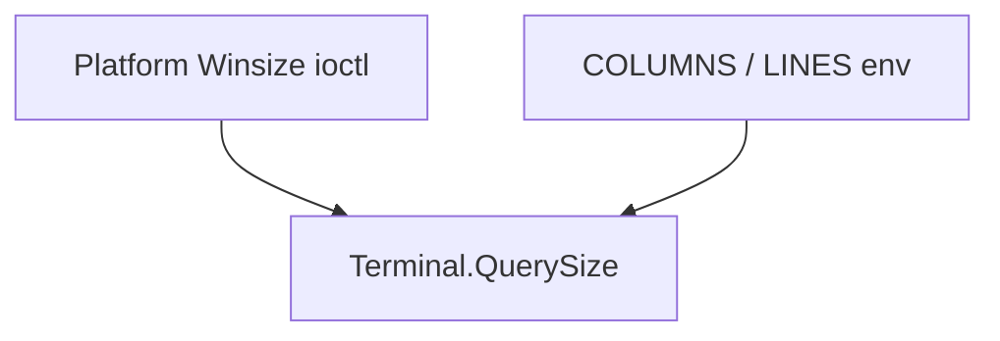

<!-- migrated from the legacy platform spec; canonical OpenSpec source -->
# Console terminal events Specification

## Purpose

Terminal resize detection and ConsoleMessage delivery over channels and events.

## Requirements

### Requirement: Channel vs OnResize delivery: Decision [D-CORE-TERM-0050]
The Beskid standard SHALL enforce the following migrated contract section. Accepted ADR decisions are binding; uppercase requirement keywords retain their BCP-14 meaning.

> | Rule | Detail |
> | --- | --- |
> | Cross-fiber | `PollResize` → `` `Channel<ConsoleMessage>` `` |
> | Same-fiber | `OnResize` event hub |

**Stable ID:** `BSP-REQ-2D576498CA08`  
**Legacy source:** `site/spec-content/platform-spec/core-library/terminal-and-console/console-terminal-events/adr/0050-channel-vs-onresize-delivery/content.md`  
**Source SHA-256:** `c8a6976300fba99bd2549dfaa798e47e674f1276f1211daea68b823ebf319fa8`

#### Scenario: Conformance exercises Decision
- **GIVEN** an implementation claims conformance with this capability
- **WHEN** behavior governed by this contract section is exercised
- **THEN** every MUST, SHALL, REQUIRED, prohibition, and accepted decision in the section is satisfied

### Requirement: COLUMNS/LINES env fallback: Decision [D-CORE-TERM-0051]
The Beskid standard SHALL enforce the following migrated contract section. Accepted ADR decisions are binding; uppercase requirement keywords retain their BCP-14 meaning.

> | Rule | Detail |
> | --- | --- |
> | Order | Winsize ioctl then `COLUMNS`/`LINES` |
> | Parse | Discrete table, not full integer grammar in v1 |

**Stable ID:** `BSP-REQ-D14E19EB26FD`  
**Legacy source:** `site/spec-content/platform-spec/core-library/terminal-and-console/console-terminal-events/adr/0051-columns-lines-env-fallback/content.md`  
**Source SHA-256:** `984adb1363ed4fa4de92995bbbd3945f267f0edfb274b06bc193728e1d32659e`

#### Scenario: Conformance exercises Decision
- **GIVEN** an implementation claims conformance with this capability
- **WHEN** behavior governed by this contract section is exercised
- **THEN** every MUST, SHALL, REQUIRED, prohibition, and accepted decision in the section is satisfied

### Requirement: Silent resize Send failure: Decision [D-CORE-TERM-0052]
The Beskid standard SHALL enforce the following migrated contract section. Accepted ADR decisions are binding; uppercase requirement keywords retain their BCP-14 meaning.

> | Rule | Detail |
> | --- | --- |
> | EVT-002 | Failed `Send` on resize is **silent** in v1 |
> | Future | May gain diagnostics in a later ADR |

**Stable ID:** `BSP-REQ-C490EC3B950A`  
**Legacy source:** `site/spec-content/platform-spec/core-library/terminal-and-console/console-terminal-events/adr/0052-silent-resize-send-failure/content.md`  
**Source SHA-256:** `620d687109f95ca0fd6d97a879f4012559f0050edb4fafe5cd124f10ab3d39b9`

#### Scenario: Conformance exercises Decision
- **GIVEN** an implementation claims conformance with this capability
- **WHEN** behavior governed by this contract section is exercised
- **THEN** every MUST, SHALL, REQUIRED, prohibition, and accepted decision in the section is satisfied

## Informative Source Provenance

The records below preserve migration history and are not normative except where text was extracted into a requirement above.

### Source Record: Console terminal events

**Authority:** informative provenance  
**Legacy path:** `/platform-spec/core-library/terminal-and-console/console-terminal-events/`  
**Source:** `site/spec-content/platform-spec/core-library/terminal-and-console/console-terminal-events/content.md`  
**SHA-256:** `d4163c2d1f5ac728fb6e72cc23c058f9cd1b7c38b0e2a5bc23b985ffc5d3cfa1`

<details>
<summary>Migrated source text</summary>

``````markdown
<SpecSection title="What this feature specifies" id="what-this-feature-specifies">
How the corelib observes **terminal size changes** and notifies UI code: `Platform.Terminal.QuerySize`, `PollResize` → `Channel<ConsoleMessage>`, and same-fiber `OnResize` event hubs. No new runtime builtins—only existing environment, ioctl externs, and fiber/channel primitives.
</SpecSection>

<SpecSection title="Contract statement" id="contract-statement">
- `Console.ConsoleSize` uses **character cells** (`columns`, `rows` as `i32`).
- `QuerySize` **must** try platform `Winsize` (Linux, macOS, Windows) then fall back to `COLUMNS` / `LINES` parsing.
- `PollResize` **must** `Send` `ConsoleMessage::Resize(now)` only when dimensions change.
- `SubscribeOnResize` **must** invoke the handler synchronously once with the current size after subscription.
- Resize delivery **must not** use a separate OS-thread callback API in v1.
</SpecSection>

<SpecSection title="Implementation anchors" id="implementation-anchors">
- `compiler/corelib/packages/console/src/Platform/Terminal.bd`
- `compiler/corelib/packages/console/src/Console.bd`
- `compiler/corelib/packages/console/src/Console/ConsoleMessage.bd`
- Tests: `ConsoleMessageChannelTests.bd`
</SpecSection>

## Decisions
<!-- spec:generate:adr-index -->
No open decisions. Closed choices are normative ADRs under **`adr/`** (`D-CORE-TERM-0050` … `D-CORE-TERM-0052`); use the reader **ADRs** tab for expandable detail.
<!-- /spec:generate:adr-index -->
## Articles
<!-- spec:generate:article-index -->
- [Contracts and edge cases](./articles/contracts-and-edge-cases/)
- [Design model](./articles/design-model/)
- [Examples](./articles/examples/)
- [Flow and algorithm](./articles/flow-and-algorithm/)
- [Verification and traceability](./articles/verification-and-traceability/)
<!-- /spec:generate:article-index -->
``````

</details>

### Source Record: Channel vs OnResize delivery

**Authority:** informative provenance  
**Legacy path:** `/platform-spec/core-library/terminal-and-console/console-terminal-events/adr/0050-channel-vs-onresize-delivery/`  
**Source:** `site/spec-content/platform-spec/core-library/terminal-and-console/console-terminal-events/adr/0050-channel-vs-onresize-delivery/content.md`  
**SHA-256:** `c8a6976300fba99bd2549dfaa798e47e674f1276f1211daea68b823ebf319fa8`

<details>
<summary>Migrated source text</summary>

``````markdown
## Context

Resize notifications must integrate with fiber concurrency without OS-thread callbacks.

## Decision

| Rule | Detail |
| --- | --- |
| Cross-fiber | `PollResize` → `` `Channel<ConsoleMessage>` `` |
| Same-fiber | `OnResize` event hub |

## Consequences

No separate OS-thread callback API in v1.

## Verification anchors

`ConsoleMessageChannelTests.bd`.
``````

</details>

### Source Record: COLUMNS/LINES env fallback

**Authority:** informative provenance  
**Legacy path:** `/platform-spec/core-library/terminal-and-console/console-terminal-events/adr/0051-columns-lines-env-fallback/`  
**Source:** `site/spec-content/platform-spec/core-library/terminal-and-console/console-terminal-events/adr/0051-columns-lines-env-fallback/content.md`  
**SHA-256:** `984adb1363ed4fa4de92995bbbd3945f267f0edfb274b06bc193728e1d32659e`

<details>
<summary>Migrated source text</summary>

``````markdown
## Context

Not all hosts expose Winsize ioctl; env vars are a portable fallback.

## Decision

| Rule | Detail |
| --- | --- |
| Order | Winsize ioctl then `COLUMNS`/`LINES` |
| Parse | Discrete table, not full integer grammar in v1 |

## Consequences

Odd env values may clamp or ignore per contracts article.

## Verification anchors

`Platform/Terminal.bd` tests.
``````

</details>

### Source Record: Silent resize Send failure

**Authority:** informative provenance  
**Legacy path:** `/platform-spec/core-library/terminal-and-console/console-terminal-events/adr/0052-silent-resize-send-failure/`  
**Source:** `site/spec-content/platform-spec/core-library/terminal-and-console/console-terminal-events/adr/0052-silent-resize-send-failure/content.md`  
**SHA-256:** `620d687109f95ca0fd6d97a879f4012559f0050edb4fafe5cd124f10ab3d39b9`

<details>
<summary>Migrated source text</summary>

``````markdown
## Context

UI loops should not crash when consumers drop resize messages.

## Decision

| Rule | Detail |
| --- | --- |
| EVT-002 | Failed `Send` on resize is **silent** in v1 |
| Future | May gain diagnostics in a later ADR |

## Consequences

Poll loops continue after dropped resize notifications.

## Verification anchors

`ConsoleMessageChannelTests.bd`; EVT-002 traceability.
``````

</details>

### Source Record: Contracts and edge cases

**Authority:** informative provenance  
**Legacy path:** `/platform-spec/core-library/terminal-and-console/console-terminal-events/articles/contracts-and-edge-cases/`  
**Source:** `site/spec-content/platform-spec/core-library/terminal-and-console/console-terminal-events/articles/contracts-and-edge-cases/content.md`  
**SHA-256:** `542b73da8b7ef04f3a7a74003de539a0e6374f663476ee83724dd5dd217770a7`

<details>
<summary>Migrated source text</summary>

``````markdown
## Purpose

Document **contracts and edge cases** for the **Console Terminal Events** feature: role-specific normative detail beyond the feature hub.

## Canonical references

- Feature hub: [Console Terminal Events](/platform-spec/core-library/terminal-and-console/console-terminal-events/)
- Sibling articles in this bundle (design model, contracts, flow, examples, verification)

## Detailed behavior

### Normative requirements

| ID | Requirement |
| --- | --- |
| **EVT-001** | `PollResize` **must** compare against `lastSize` and only send on change. |
| **EVT-002** | Failed `Channel.Send` **must** be ignored silently in v1 poll loop (no panic). |
| **EVT-003** | `SubscribeOnResize` **must** set `hub.lastSize` and raise `OnResize` immediately with `QuerySize()`. |
| **EVT-004** | Default size when all probes fail **should** be 80×24 via env fallback. |

### Edge cases

- **Non-TTY stdout**: `QuerySize` may return env defaults; resize events may never fire.
- **Rapid resize**: Coalescing is caller responsibility; each poll may emit at most one message.
- **Closed channel**: `Send` errors are dropped per EVT-002.

## Verification

See the verification and traceability article in this bundle and `compiler/corelib/beskid_corelib/tests/corelib_tests/src/console/`.

## Related topics

- Parent [feature hub](/platform-spec/core-library/terminal-and-console/console-terminal-events/) and [Terminal and console area](/platform-spec/core-library/terminal-and-console/)
``````

</details>

### Source Record: Design model

**Authority:** informative provenance  
**Legacy path:** `/platform-spec/core-library/terminal-and-console/console-terminal-events/articles/design-model/`  
**Source:** `site/spec-content/platform-spec/core-library/terminal-and-console/console-terminal-events/articles/design-model/content.md`  
**SHA-256:** `5c3e0028e55b72165373b92833922322ba939866b10fe42718185efe270952a5`

<details>
<summary>Migrated source text</summary>

``````markdown
## Purpose

Document **design model** for the **Console Terminal Events** feature: role-specific normative detail beyond the feature hub.

## Canonical references

- Feature hub: [Console Terminal Events](/platform-spec/core-library/terminal-and-console/console-terminal-events/)
- Sibling articles in this bundle (design model, contracts, flow, examples, verification)

## Detailed behavior

### `ConsoleMessage`

| Variant | Payload | Use |
| --- | --- | --- |
| `Resize(ConsoleSize)` | columns/rows | Terminal geometry changed |
| (tick-related) | — | Integrated with `Console.RunTick` polling |

Messages flow on an **unbounded** `Channel<ConsoleMessage>` created by `Console.MessagesChannel()` unless callers supply their own channel.

### `OnResize` hub

Same-fiber `event OnResize(ConsoleSize)` with cached `lastSize`. Distinct from `Concurrency.Hub` (channel multiplexing). Use when resize handlers must run on the UI fiber without cross-fiber `Send`.

### Size probing stack



ANSI screen modes are unrelated to size events; see [ANSI escape model](/platform-spec/core-library/terminal-and-console/ansi-escape-model/).

## Verification

See the verification and traceability article in this bundle and `compiler/corelib/beskid_corelib/tests/corelib_tests/src/console/`.

## Related topics

- Parent [feature hub](/platform-spec/core-library/terminal-and-console/console-terminal-events/) and [Terminal and console area](/platform-spec/core-library/terminal-and-console/)
``````

</details>

### Source Record: Examples

**Authority:** informative provenance  
**Legacy path:** `/platform-spec/core-library/terminal-and-console/console-terminal-events/articles/examples/`  
**Source:** `site/spec-content/platform-spec/core-library/terminal-and-console/console-terminal-events/articles/examples/content.md`  
**SHA-256:** `093e92621d3c42640d468c5872d3d09a1caba6caa23114c18d60924378ae5363`

<details>
<summary>Migrated source text</summary>

``````markdown
## Purpose

Document **examples** for the **Console Terminal Events** feature: role-specific normative detail beyond the feature hub.

## Canonical references

- Feature hub: [Console Terminal Events](/platform-spec/core-library/terminal-and-console/console-terminal-events/)
- Sibling articles in this bundle (design model, contracts, flow, examples, verification)

## Detailed behavior

### Channel loop

```beskid
Channel<ConsoleMessage> messages = Console.MessagesChannel();
ConsoleSize last = Console.QuerySize();
// spawn fiber: loop { Console.RunTick(messages, last); Receive and handle Resize }
```

### Same-fiber event hub

```beskid
OnResize hub = OnResize { lastSize: Console.QuerySize(), OnResize: ... };
Console.SubscribeOnResize(hub, handler);
Platform.Terminal.PollResizeHub(hub);
```

After `Resize`, call [Console controls](/platform-spec/core-library/terminal-and-console/console-controls/) `Frame.Render` with the new `ConsoleSize`.

## Verification

See the verification and traceability article in this bundle and `compiler/corelib/beskid_corelib/tests/corelib_tests/src/console/`.

## Related topics

- Parent [feature hub](/platform-spec/core-library/terminal-and-console/console-terminal-events/) and [Terminal and console area](/platform-spec/core-library/terminal-and-console/)
``````

</details>

### Source Record: Flow and algorithm

**Authority:** informative provenance  
**Legacy path:** `/platform-spec/core-library/terminal-and-console/console-terminal-events/articles/flow-and-algorithm/`  
**Source:** `site/spec-content/platform-spec/core-library/terminal-and-console/console-terminal-events/articles/flow-and-algorithm/content.md`  
**SHA-256:** `320899e46eaba7f632dd476d40e47710b1c1ea41c20340f5d35e566f814b0773`

<details>
<summary>Migrated source text</summary>

``````markdown
## Purpose

Document **flow and algorithm** for the **Console Terminal Events** feature: role-specific normative detail beyond the feature hub.

## Canonical references

- Feature hub: [Console Terminal Events](/platform-spec/core-library/terminal-and-console/console-terminal-events/)
- Sibling articles in this bundle (design model, contracts, flow, examples, verification)

## Detailed behavior

### `PollResize` algorithm

1. `now ← QuerySize()` (platform winsize chain → env fallback)
2. If `now.columns != lastSize.columns` OR `now.rows != lastSize.rows`:
   - `lastSize ← now`
   - `messages.Send(ConsoleMessage::Resize(now))` (ignore send errors)
3. Return

### `PollResizeHub` (same fiber)

Compare `hub.lastSize` to `QuerySize()`; on change update cache and invoke `hub.OnResize(now)` synchronously.

### `RunTick`

Delegates to `Platform.Terminal.PollResize` then optional tick messages for controls—pairs with [Console controls](/platform-spec/core-library/terminal-and-console/console-controls/flow-and-algorithm/).

## Verification

See the verification and traceability article in this bundle and `compiler/corelib/beskid_corelib/tests/corelib_tests/src/console/`.

## Related topics

- Parent [feature hub](/platform-spec/core-library/terminal-and-console/console-terminal-events/) and [Terminal and console area](/platform-spec/core-library/terminal-and-console/)
``````

</details>

### Source Record: Verification and traceability

**Authority:** informative provenance  
**Legacy path:** `/platform-spec/core-library/terminal-and-console/console-terminal-events/articles/verification-and-traceability/`  
**Source:** `site/spec-content/platform-spec/core-library/terminal-and-console/console-terminal-events/articles/verification-and-traceability/content.md`  
**SHA-256:** `ea375ccdc3ffc468654c13abd9453a17cc040540707dbb11fdc0e43a17a6fab3`

<details>
<summary>Migrated source text</summary>

``````markdown
## Purpose

Document **verification and traceability** for the **Console Terminal Events** feature: role-specific normative detail beyond the feature hub.

## Canonical references

- Feature hub: [Console Terminal Events](/platform-spec/core-library/terminal-and-console/console-terminal-events/)
- Sibling articles in this bundle (design model, contracts, flow, examples, verification)

## Detailed behavior

| Artifact | Role |
| --- | --- |
| `Platform/Terminal.bd` | `QuerySize`, `PollResize`, env fallback |
| `Console.bd` | `RunTick`, `SubscribeOnResize`, `MessagesChannel` |
| `ConsoleMessageChannelTests.bd` | Channel resize delivery |

Platform stubs: `Platform/Linux.bd`, `MacOS.bd`, `Windows.bd` winsize externs.

## Verification

See the verification and traceability article in this bundle and `compiler/corelib/beskid_corelib/tests/corelib_tests/src/console/`.

## Related topics

- Parent [feature hub](/platform-spec/core-library/terminal-and-console/console-terminal-events/) and [Terminal and console area](/platform-spec/core-library/terminal-and-console/)
``````

</details>
