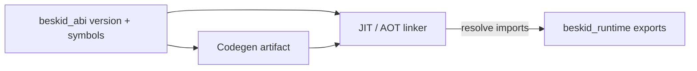

<!-- migrated from the legacy platform spec; canonical OpenSpec source -->
# ABI versioning and compatibility Specification

## Purpose

Versioned ABI guarantees, symbol stability rules, and migration expectations between compiler and runtime.

## Requirements

### Requirement: Hard ABI version check before user code: Decision [D-EXEC-ABI-0001]
The Beskid standard SHALL enforce the following migrated contract section. Accepted ADR decisions are binding; uppercase requirement keywords retain their BCP-14 meaning.

> | Rule | Detail |
> | --- | --- |
> | Version surface | `beskid_runtime_abi_version()` returns `BESKID_RUNTIME_ABI_VERSION` (`u32` in `beskid_abi`) |
> | Host check | Hosts **should** fail before user `main` when runtime version ≠ compiler-embedded constant (**ABI-003**) |
> | Diagnostics | Failure messages **must** name both integers and recommend aligning CLI/VSIX/runtime release sets |

**Stable ID:** `BSP-REQ-10CC1973C501`  
**Legacy source:** `site/spec-content/platform-spec/execution/abi-and-host/abi-versioning-and-compatibility/adr/0001-hard-abi-version-check/content.md`  
**Source SHA-256:** `3a323b5ccb77530998b12fc70ba19eeea76ee78010560838029fbc4eed4bfef9`

#### Scenario: Conformance exercises Decision
- **GIVEN** an implementation claims conformance with this capability
- **WHEN** behavior governed by this contract section is exercised
- **THEN** every MUST, SHALL, REQUIRED, prohibition, and accepted decision in the section is satisfied

### Requirement: Breaking ABI changes require version bump: Decision [D-EXEC-ABI-0002]
The Beskid standard SHALL enforce the following migrated contract section. Accepted ADR decisions are binding; uppercase requirement keywords retain their BCP-14 meaning.

> | Trigger | Action |
> | --- | --- |
> | `BeskidStr` / `BeskidArray` / interop payload layout change | **Must** increment `BESKID_RUNTIME_ABI_VERSION` (**ABI-004**) |
> | Builtin rename, arity change, or `AbiParamKind` / `AbiReturnKind` change | **Must** bump version |
> | Semantics relied on by lowering change (e.g. barrier no-op) | **Must** bump version |
> | New symbol appended, older artifacts never import it | **May** ship without bump (**ABI-005**) |
> | Optional Cargo `features` only | **Must not** bump ABI version |
> 
> Reference tree pins **version 2** until the next breaking change.

**Stable ID:** `BSP-REQ-54020F529761`  
**Legacy source:** `site/spec-content/platform-spec/execution/abi-and-host/abi-versioning-and-compatibility/adr/0002-breaking-changes-bump-version/content.md`  
**Source SHA-256:** `8ca784bb118b722f750747e87b1f02790b31b1102224fa6b25b391ad3aa8adea`

#### Scenario: Conformance exercises Decision
- **GIVEN** an implementation claims conformance with this capability
- **WHEN** behavior governed by this contract section is exercised
- **THEN** every MUST, SHALL, REQUIRED, prohibition, and accepted decision in the section is satisfied

### Requirement: ABI v3 kernel shrink bump: Decision [D-EXEC-ABI-0009]
The Beskid standard SHALL enforce the following migrated contract section. Accepted ADR decisions are binding; uppercase requirement keywords retain their BCP-14 meaning.

> | Rule | Detail |
> | --- | --- |
> | Version | `BESKID_RUNTIME_ABI_VERSION` **must** increment **2 → 3** at the v3 cutover |
> | Kernel only | `RUNTIME_EXPORT_SYMBOLS` in v3 lists **kernel** exports and dispatch entrypoints only |
> | Soft ops | Legacy direct symbols (for example `str_len`, `channel_send`) **must not** appear in v3 export lists |
> | Archives | Prebuilt runtime archives **must** publish under `lib/beskid-runtime/abi-3/` |
> | Rejection | Loaders **must** reject v2 artifacts when the compiler advertises ABI v3 |
> | User C extern | User `Extern` C ABI plane **unchanged** per [D-LMETA-FFI-0004](/platform-spec/language-meta/interop/ffi-and-extern/adr/0004-user-cabi-vs-runtime-rustabi/) |
> 
> Envelope layout changes after v3 follow [D-EXEC-ABI-0002](/platform-spec/execution/abi-and-host/abi-versioning-and-compatibility/adr/0002-breaking-changes-bump-version/).

**Stable ID:** `BSP-REQ-3795009C610A`  
**Legacy source:** `site/spec-content/platform-spec/execution/abi-and-host/abi-versioning-and-compatibility/adr/0003-v3-kernel-shrink-bump/content.md`  
**Source SHA-256:** `3c991e4abdedb05e17cc1496805fe200383ac5c183855aaa4d1cdc9fe8f02e0f`

#### Scenario: Conformance exercises Decision
- **GIVEN** an implementation claims conformance with this capability
- **WHEN** behavior governed by this contract section is exercised
- **THEN** every MUST, SHALL, REQUIRED, prohibition, and accepted decision in the section is satisfied

### Requirement: Manifest-derived ABI-v5 closure environment helpers
The canonical ABI-v5 runtime manifest SHALL declare `beskid_rt_v5_closure_environment_allocate` with signature `(ptr) -> ptr`, `beskid_rt_v5_closure_capture_store` with signature `(ptr, ptr, usize, ptr) -> u8`, and `beskid_rt_v5_closure_environment_root` with signature `(ptr, usize, ptr) -> u8`. The generated ABI JSON, C header, Rust bindings, runtime-kit allowlist, and canonical Bootstrap source SHALL agree on those exact names and signatures. Lowering MUST reject any closure-environment import absent from that manifest-derived contract.

#### Scenario: Canonical closure environment helper provenance
- **GIVEN** a canonical ABI-v5 runtime kit and syntax-owned captured-closure lowering
- **WHEN** the toolchain validates the ABI contract and audits the native runtime archive
- **THEN** each declared closure-environment helper is present with its exact signature and canonical Bootstrap provenance

### Requirement: Manifest-derived ABI-v5 current-root helper
The canonical ABI-v5 runtime manifest SHALL declare `beskid_rt_v5_closure_environment_root_current` with signature `(usize, ptr) -> u8`. The generated ABI JSON, C header, Rust bindings, runtime-kit allowlist, and canonical Bootstrap source SHALL agree on that exact signature. Tooling-generated lowering MAY call this symbol only through syntax-owned generated runtime entry points, and user-authored syntax/native metadata MUST NOT read runtime TLS directly, manufacture its own TLS pointer, or bypass the single exported current-root helper.

#### Scenario: Canonical closure current-root provenance
- **GIVEN** a canonical ABI-v5 runtime kit and syntax-owned captured-closure lowering
- **WHEN** the toolchain validates the ABI contract and audits the native runtime archive
- **THEN** the `RootClosureEnvironmentCurrent` path appears only through `RootClosureEnvironment` in canonical runtime bootstrap and the generated lowering emits no alternate root-path symbol for current-thread closure rooting

## Informative Source Provenance

The records below preserve migration history and are not normative except where text was extracted into a requirement above.

### Source Record: ABI versioning and compatibility

**Authority:** informative provenance  
**Legacy path:** `/platform-spec/execution/abi-and-host/abi-versioning-and-compatibility/`  
**Source:** `site/spec-content/platform-spec/execution/abi-and-host/abi-versioning-and-compatibility/content.md`  
**SHA-256:** `8695c4cf0b373277d68cf97bc39c68e21ee6c388f91b507eca722e52bec732fd`

<details>
<summary>Migrated source text</summary>

``````markdown
<SpecSection title="What this feature specifies" id="what-this-feature-specifies">
`ABI versioning and compatibility` defines one operational contract that a newcomer can follow end-to-end: first the model, then execution flow, then strict guarantees, concrete examples, and verification guidance.
</SpecSection>

<SpecSection title="Implementation anchors" id="implementation-anchors">
- `AbiVersion` and compatibility definitions in `compiler/crates/beskid_abi/src/lib.rs`
- `RUNTIME_EXPORT_SYMBOLS` in `compiler/crates/beskid_abi/src/symbols.rs`
- JIT/runtime symbol loading in `compiler/crates/beskid_engine/src/jit_module.rs`
- Runtime exports in `compiler/crates/beskid_runtime/src/lib.rs`
</SpecSection>

## Decisions
<!-- spec:generate:adr-index -->
No open decisions. Closed choices are normative ADRs under **`adr/`** (`D-EXEC-ABI-0001` … `D-EXEC-ABI-0009`); use the reader **ADRs** tab for expandable detail.
<!-- /spec:generate:adr-index -->
## Articles
<!-- spec:generate:article-index -->
- [Contracts and edge cases](./articles/contracts-and-edge-cases/)
- [Design model](./articles/design-model/)
- [Examples](./articles/examples/)
- [FAQ and troubleshooting](./articles/faq-and-troubleshooting/)
- [Flow and algorithm](./articles/flow-and-algorithm/)
- [Verification and traceability](./articles/verification-and-traceability/)
<!-- /spec:generate:article-index -->
``````

</details>

### Source Record: Hard ABI version check before user code

**Authority:** informative provenance  
**Legacy path:** `/platform-spec/execution/abi-and-host/abi-versioning-and-compatibility/adr/0001-hard-abi-version-check/`  
**Source:** `site/spec-content/platform-spec/execution/abi-and-host/abi-versioning-and-compatibility/adr/0001-hard-abi-version-check/content.md`  
**SHA-256:** `3a323b5ccb77530998b12fc70ba19eeea76ee78010560838029fbc4eed4bfef9`

<details>
<summary>Migrated source text</summary>

``````markdown
## Context

JIT and CLI hosts may load a `beskid_runtime` artifact built separately from the active compiler. Without an explicit version gate, stale toolchains call builtins with wrong layouts or missing symbols.

## Decision

| Rule | Detail |
| --- | --- |
| Version surface | `beskid_runtime_abi_version()` returns `BESKID_RUNTIME_ABI_VERSION` (`u32` in `beskid_abi`) |
| Host check | Hosts **should** fail before user `main` when runtime version ≠ compiler-embedded constant (**ABI-003**) |
| Diagnostics | Failure messages **must** name both integers and recommend aligning CLI/VSIX/runtime release sets |

## Consequences

Release matrices document paired compiler/runtime builds. Conformance **should** assert version parity in JIT smoke tests (`beskid_tests` runtime/jit).

## Verification anchors

`compiler/crates/beskid_abi/src/version.rs`; `beskid_engine` JIT module setup; **ABI-001**–**ABI-003** in [contracts and edge cases](../contracts-and-edge-cases/).
``````

</details>

### Source Record: Breaking ABI changes require version bump

**Authority:** informative provenance  
**Legacy path:** `/platform-spec/execution/abi-and-host/abi-versioning-and-compatibility/adr/0002-breaking-changes-bump-version/`  
**Source:** `site/spec-content/platform-spec/execution/abi-and-host/abi-versioning-and-compatibility/adr/0002-breaking-changes-bump-version/content.md`  
**SHA-256:** `8ca784bb118b722f750747e87b1f02790b31b1102224fa6b25b391ad3aa8adea`

<details>
<summary>Migrated source text</summary>

``````markdown
## Context

Additive runtime symbols and Cargo feature gates are easy to confuse with ABI-stable changes. Silent signature drift breaks AOT/JIT link steps or causes undefined behavior at call sites.

## Decision

| Trigger | Action |
| --- | --- |
| `BeskidStr` / `BeskidArray` / interop payload layout change | **Must** increment `BESKID_RUNTIME_ABI_VERSION` (**ABI-004**) |
| Builtin rename, arity change, or `AbiParamKind` / `AbiReturnKind` change | **Must** bump version |
| Semantics relied on by lowering change (e.g. barrier no-op) | **Must** bump version |
| New symbol appended, older artifacts never import it | **May** ship without bump (**ABI-005**) |
| Optional Cargo `features` only | **Must not** bump ABI version |

Reference tree pins **version 2** until the next breaking change.

## Consequences

Release notes **should** list bumped versions and removed symbols. Renaming without bump is a release-process violation.

## Verification anchors

`beskid_abi` symbol tables; `RUNTIME_EXPORT_SYMBOLS` parity checks in CI.
``````

</details>

### Source Record: ABI v3 kernel shrink bump

**Authority:** informative provenance  
**Legacy path:** `/platform-spec/execution/abi-and-host/abi-versioning-and-compatibility/adr/0003-v3-kernel-shrink-bump/`  
**Source:** `site/spec-content/platform-spec/execution/abi-and-host/abi-versioning-and-compatibility/adr/0003-v3-kernel-shrink-bump/content.md`  
**SHA-256:** `3c991e4abdedb05e17cc1496805fe200383ac5c183855aaa4d1cdc9fe8f02e0f`

<details>
<summary>Migrated source text</summary>

``````markdown
## Context

ABI v2 exported every runtime builtin as a direct linker symbol (~80 entries). v3 introduces manifest-driven classification and dispatch envelopes — a breaking shrink of the stable export surface.

## Decision

| Rule | Detail |
| --- | --- |
| Version | `BESKID_RUNTIME_ABI_VERSION` **must** increment **2 → 3** at the v3 cutover |
| Kernel only | `RUNTIME_EXPORT_SYMBOLS` in v3 lists **kernel** exports and dispatch entrypoints only |
| Soft ops | Legacy direct symbols (for example `str_len`, `channel_send`) **must not** appear in v3 export lists |
| Archives | Prebuilt runtime archives **must** publish under `lib/beskid-runtime/abi-3/` |
| Rejection | Loaders **must** reject v2 artifacts when the compiler advertises ABI v3 |
| User C extern | User `Extern` C ABI plane **unchanged** per [D-LMETA-FFI-0004](/platform-spec/language-meta/interop/ffi-and-extern/adr/0004-user-cabi-vs-runtime-rustabi/) |

Envelope layout changes after v3 follow [D-EXEC-ABI-0002](/platform-spec/execution/abi-and-host/abi-versioning-and-compatibility/adr/0002-breaking-changes-bump-version/).

## Consequences

Release notes **must** document v3 migration, rebuilt archives, and removed direct soft symbols. Conformance tests freeze the v3 kernel allowlist.

## Verification anchors

`compiler/crates/beskid_abi/src/version.rs`; `compiler/crates/beskid_aot/src/bundled.rs`; `compiler/crates/beskid_tests/src/abi/contracts.rs`.
``````

</details>

### Source Record: Contracts and edge cases

**Authority:** informative provenance  
**Legacy path:** `/platform-spec/execution/abi-and-host/abi-versioning-and-compatibility/articles/contracts-and-edge-cases/`  
**Source:** `site/spec-content/platform-spec/execution/abi-and-host/abi-versioning-and-compatibility/articles/contracts-and-edge-cases/content.md`  
**SHA-256:** `4f509dec25705ec29fe9f780c9a179af42149faf92aa954445e2f58c056a57e7`

<details>
<summary>Migrated source text</summary>

``````markdown
## Normative requirements

| ID | Requirement |
| --- | --- |
| **ABI-001** | `RUNTIME_EXPORT_SYMBOLS` in `beskid_abi` **must** list every symbol the JIT registers and the runtime exports with `#[unsafe(no_mangle)]` under the same spelling. |
| **ABI-002** | `BUILTIN_SPECS` **must** be the sole source of Cranelift import signatures for runtime builtins; hand-written CLIF calls **must not** invent alternate calling conventions. |
| **ABI-003** | Hosts **should** reject execution when `beskid_runtime_abi_version()` ≠ `BESKID_RUNTIME_ABI_VERSION` compiled into the active compiler. |
| **ABI-004** | Breaking layout or signature changes **must** increment `BESKID_RUNTIME_ABI_VERSION`; silent mismatches are forbidden. |
| **ABI-005** | Additive symbols **may** ship without a version bump only if older generated code never imports them and older runtimes ignore unknown symbols safely. |
| **ABI-006** | JIT and AOT for the same release **must** target identical `beskid_abi` revision (same symbol set and signatures). |

## Edge cases

| Scenario | Expected behavior |
| --- | --- |
| **Stale VSIX / CLI with fresh runtime** | Version check fails fast with actionable diagnostics before running user `main`. |
| **Renamed builtin without version bump** | Link or JIT finalize fails (`MissingFunction`) or undefined behavior if forced—treated as a release process violation. |
| **Optional runtime `features`** (`arrays_backing`, `metrics`) | Do not change `BESKID_RUNTIME_ABI_VERSION`; see [Runtime feature flags](/platform-spec/execution/runtime/runtime-feature-flags/). |
| **Dynamic `Extern` symbols** | Resolved addresses are extras in `BeskidJitModule::new_with_symbols`; they are not part of `RUNTIME_EXPORT_SYMBOLS`. |

## SHOULD guidance

- Release notes **should** document ABI bumps and list removed or renamed symbols.
- Conformance fixtures **should** assert symbol list parity between `symbols.rs` and `beskid_runtime::lib.rs` re-exports.

## Implementation anchors
- `compiler/crates/beskid_abi/src/version.rs` — version check and compatibility gates
- `compiler/crates/beskid_abi/src/symbols.rs` — symbol stability across ABI versions
- `compiler/crates/beskid_engine/src/jit_module.rs` — JIT symbol registration

## Related topics

- [Extern dispatch and policy](/platform-spec/execution/abi-and-host/extern-dispatch-and-policy/) — user library symbols outside `RUNTIME_EXPORT_SYMBOLS`
- [Rust ABI profile](/platform-spec/language-meta/interop/rust-abi-profile/) — runtime export calling convention vocabulary
``````

</details>

### Source Record: Design model

**Authority:** informative provenance  
**Legacy path:** `/platform-spec/execution/abi-and-host/abi-versioning-and-compatibility/articles/design-model/`  
**Source:** `site/spec-content/platform-spec/execution/abi-and-host/abi-versioning-and-compatibility/articles/design-model/content.md`  
**SHA-256:** `bd3b2c69b708a7fc268553dc344532d7373fcc2e10c9634fcf2d7a011c347d81`

<details>
<summary>Migrated source text</summary>

``````markdown
## Purpose

Define how the **compiler**, **JIT/AOT backends**, and **Beskid runtime** agree on a single numeric ABI version and a frozen export surface so generated code never calls missing or mis-typed runtime entrypoints.

## Primary actors

| Actor | Responsibility |
| --- | --- |
| **`beskid_abi`** | Owns `BESKID_RUNTIME_ABI_VERSION`, `RUNTIME_EXPORT_SYMBOLS`, and builtin signature metadata consumed by codegen. |
| **`beskid_codegen` / `beskid_engine`** | Declares imports from `BUILTIN_SPECS` and validates user `Extern` shapes before linking. |
| **`beskid_runtime`** | Implements `#[unsafe(no_mangle)]` exports; `beskid_runtime_abi_version()` returns the compile-time constant. |
| **Host tooling** | JIT session and AOT link steps load the same runtime artifact the compiler was built against (or an explicitly compatible newer runtime). |

## Subsystem boundaries

- **In scope:** ABI integer version, additive vs breaking symbol changes, JIT symbol registration parity with AOT, and migration expectations when bumping `BESKID_RUNTIME_ABI_VERSION` in `compiler/crates/beskid_abi/src/version.rs`.
- **Out of scope:** Language-level `Extern` syntax ([FFI and extern](/platform-spec/language-meta/interop/ffi-and-extern/)), C link-time profiles ([C ABI profile](/platform-spec/language-meta/interop/c-abi-profile/)), and per-builtin semantics ([Builtins and symbols](/platform-spec/execution/abi-and-host/builtins-and-symbols/)).

## Version and symbol model

The ABI version is a **`u32`** exposed as `beskid_runtime_abi_version`. The reference tree pins **`BESKID_RUNTIME_ABI_VERSION = 3`** (kernel-only export set). A bump is required when any of the following change incompatibly:

- C layout of `BeskidStr`, `BeskidArray`, or interop payload offsets referenced by lowering.
- Name, parameter count, or `AbiParamKind` / `AbiReturnKind` of a builtin in `BUILTIN_SPECS`.
- Semantics that generated code already depends on (for example making `gc_write_barrier` a no-op when lowering assumes barriers run).

Additive changes (new symbols appended to `RUNTIME_EXPORT_SYMBOLS`, new optional runtime `features`) **should not** require a version bump if existing artifacts keep working without recompilation.

## Compatibility diagram



Codegen and the engine read the **same** `beskid_abi` crate revision at build time. At run time, hosts **should** treat a lower runtime version than the compiler expects as a hard compatibility failure before executing user code.

## Platform assumptions (v0.2 baseline)

Reference implementations target **64-bit pointers** and Linux x86_64 for syscall-backed builtins; other hosts may stub behavior but must preserve symbol names and Cranelift signature shapes declared in `BUILTIN_SPECS`.

## Implementation anchors
- `compiler/crates/beskid_abi/src/version.rs` — `BESKID_RUNTIME_ABI_VERSION` constant and version negotiation
- `compiler/crates/beskid_abi/src/symbols.rs` — `RUNTIME_EXPORT_SYMBOLS` registry
- `compiler/crates/beskid_abi/src/builtins.rs` — `BUILTIN_SPECS` signature catalog

## Related topics

- [Flow and algorithm](./flow-and-algorithm/) — JIT registration and version check ordering
- [Contracts and edge cases](./contracts-and-edge-cases/) — normative ABI-00x requirements
- Legacy bridge: [Runtime ABI (v0.1)](../../../../execution/runtime/runtime-abi-v0-1.md)
``````

</details>

### Source Record: Examples

**Authority:** informative provenance  
**Legacy path:** `/platform-spec/execution/abi-and-host/abi-versioning-and-compatibility/articles/examples/`  
**Source:** `site/spec-content/platform-spec/execution/abi-and-host/abi-versioning-and-compatibility/articles/examples/content.md`  
**SHA-256:** `37f5639dba0036bf3efac594b9d02038c6e733ff53e29279b21281addf689727`

<details>
<summary>Migrated source text</summary>

``````markdown
## Host version gate (Rust pseudocode)

A JIT host can refuse to run when versions diverge:

```rust
let expected = beskid_abi::BESKID_RUNTIME_ABI_VERSION;
let actual = unsafe { beskid_runtime::beskid_runtime_abi_version() };
if actual != expected {
    panic!("runtime ABI {actual} != compiler ABI {expected}");
}
```

Production CLIs **should** surface this as a structured error rather than a raw panic.

## Additive symbol (no bump)

Suppose maintainers add `fiber_debug_trace` to `RUNTIME_EXPORT_SYMBOLS` and `beskid_runtime`, but no released compiler lowering emits calls to it yet. Older artifacts keep working; newer compilers may call the symbol once lowering lands. No `BESKID_RUNTIME_ABI_VERSION` change is required (**ABI-005**).

## Breaking rename (bump required)

Renaming `fiber_join` export to `fiber_join_status` without updating every `BUILTIN_SPECS` consumer breaks link compatibility. The fix set is:

1. `BESKID_RUNTIME_ABI_VERSION` += 1
2. Synchronized `symbols.rs`, `builtins.rs`, runtime `#[unsafe(no_mangle)]` names, and docs
3. Rebuild and republish CLI, VSIX, and prebuilt runtime bundles together

## Inspecting the export list

Maintainers compare:

- `compiler/crates/beskid_abi/src/symbols.rs` → `RUNTIME_EXPORT_SYMBOLS`
- `compiler/crates/beskid_runtime/src/lib.rs` → `pub use builtins::{ … }`

Every JIT-resolved builtin **must** appear in both lists with identical spelling.

## Related topics

- [Verification and traceability](./verification-and-traceability/) — automated parity checks
- Legacy: [Runtime ABI (v0.1)](../../../../execution/runtime/runtime-abi-v0-1.md)
``````

</details>

### Source Record: FAQ and troubleshooting

**Authority:** informative provenance  
**Legacy path:** `/platform-spec/execution/abi-and-host/abi-versioning-and-compatibility/articles/faq-and-troubleshooting/`  
**Source:** `site/spec-content/platform-spec/execution/abi-and-host/abi-versioning-and-compatibility/articles/faq-and-troubleshooting/content.md`  
**SHA-256:** `0b177121d1209090c9fdc8d8418ce0ce932f5beafdcac8fe8ab86c7c6b1ed742`

<details>
<summary>Migrated source text</summary>

``````markdown
## FAQ

### When must we bump `BESKID_RUNTIME_ABI_VERSION`?

When an **existing** generated call pattern would observe different layout, symbol names, or Cranelift signatures at link time. Purely additive exports that no shipped compiler emits may stay on the same version (**ABI-005**).

### Does the VSIX bundle its own runtime?

The extension ships a platform-matched `beskid` CLI/LSP stack; that stack **must** be built against the same `beskid_abi` revision as the embedded compiler. Mismatch manifests as JIT `MissingFunction` or version gate failures—reinstall matching artifacts rather than mixing arbitrary release channels.

### Are `interop_dispatch_*` symbols part of the versioned surface?

Yes. They appear in `RUNTIME_EXPORT_SYMBOLS` and `BUILTIN_SPECS`. Tag/payload layout changes require an ABI bump and coordinated engine/runtime updates ([Builtins and symbols](/platform-spec/execution/abi-and-host/builtins-and-symbols/)).

### Can JIT use a newer runtime than the compiler?

Only when `beskid_runtime_abi_version()` is still equal to the compiler's expected constant **and** no removed symbols are referenced. Otherwise rebuild the compiler; unsupported mixing is intentional (**ABI-004**).

## Troubleshooting

| Symptom | Likely cause | Fix |
| --- | --- | --- |
| `missing function 'alloc'` at JIT finalize | Runtime library not linked or stripped exports | Ensure `beskid_runtime` built with default features; verify `RUNTIME_EXPORT_SYMBOLS` |
| Segfault on first builtin call | Wrong function pointer type registered | Check `BUILTIN_SPECS` vs runtime `extern "C-unwind"` signature |
| Works in debug CLI, fails in VSIX | Stale extension runtime | Rebuild Open VSX matrix with matching `beskid_abi` |
| AOT binary crashes, JIT OK | Old runtime .so bundled in deploy | Re-link AOT with current `beskid_runtime` |

## Related topics

- [Flow and algorithm](./flow-and-algorithm/)
- [Runtime feature flags](/platform-spec/execution/runtime/runtime-feature-flags/) — optional `arrays_backing` without ABI version bumps
``````

</details>

### Source Record: Flow and algorithm

**Authority:** informative provenance  
**Legacy path:** `/platform-spec/execution/abi-and-host/abi-versioning-and-compatibility/articles/flow-and-algorithm/`  
**Source:** `site/spec-content/platform-spec/execution/abi-and-host/abi-versioning-and-compatibility/articles/flow-and-algorithm/content.md`  
**SHA-256:** `407ec2ed79ca4c4c3250d719167f59ef2fa92c3c0a0ef76b5c449ebc42793b0c`

<details>
<summary>Migrated source text</summary>

``````markdown
## Purpose

Document the **end-to-end algorithm** from compiler build through JIT/AOT link to first user entry, including where ABI version and export symbols are validated.

See the [design model](./design-model/) diagram for actor boundaries.

## JIT session setup

1. **Construct `BeskidJitModule`** (`compiler/crates/beskid_engine/src/jit_module.rs`) with an optional `extras` table for resolved user `Extern` addresses when dynamic linking is enabled.
2. On first `compile`, call **`declare_builtin_imports`** once, wiring every name in `BUILTIN_SPECS` to the in-process `beskid_runtime` function pointer of the same symbol string.
3. Declare user functions and validated extern imports from the `CodegenArtifact`, emit string literals and type descriptors, then define and finalize Cranelift bodies.
4. Before transferring control to generated code, the host **should** call `beskid_runtime_abi_version()` and compare the result to `BESKID_RUNTIME_ABI_VERSION` embedded in the compiler's `beskid_abi` dependency (**ABI-003**).

## AOT / bundled runtime path

1. Backend emits object code that imports the same symbol names listed in `RUNTIME_EXPORT_SYMBOLS`.
2. Link step resolves symbols against the bundled `beskid_runtime` static or shared library built for the target triple.
3. Packaging **must** record the ABI version used at link time in release metadata when distributing standalone binaries (tooling convention; see [verification](./verification-and-traceability/)).

## Symbol registration algorithm

For each `BuiltinFnSpec` entry in `compiler/crates/beskid_abi/src/builtins.rs`:

1. Map `symbol` to a host `extern "C-unwind"` function in `beskid_runtime::builtins`.
2. Build a Cranelift function signature from `params: &[AbiParamKind]` and `returns: AbiReturnKind` (`Ptr`, `I64`, `Void`, `Never`, …).
3. Store the `FuncId` in the JIT module's `func_ids` map so lowering can emit direct calls.

Missing symbols surface as **`JitError::MissingFunction`** at finalize time rather than as undefined behavior at runtime.

## ABI bump workflow (maintainers)

1. Increment `BESKID_RUNTIME_ABI_VERSION` in `beskid_abi/src/version.rs`.
2. Update `RUNTIME_EXPORT_SYMBOLS` and `BUILTIN_SPECS` together with runtime `#[unsafe(no_mangle)]` implementations.
3. Refresh platform-spec articles and `compiler/crates/beskid_tests` / `beskid_e2e_tests` fixtures that pin version or symbol lists.
4. Publish runtime and compiler artifacts in lockstep; mixed versions are unsupported for production (**ABI-004**).

## Implementation anchors
- `compiler/crates/beskid_abi/src/version.rs` — version constant and bump workflow
- `compiler/crates/beskid_engine/src/jit_module.rs` — `new_with_symbols` registration and startup check
- `compiler/crates/beskid_codegen/src/` — `declare_builtin_imports` lowers specs to Cranelift

## Related topics

- [Design model](./design-model/) — compatibility diagram and actors
- [Builtins and symbols](/platform-spec/execution/abi-and-host/builtins-and-symbols/) — per-symbol contracts
``````

</details>

### Source Record: Verification and traceability

**Authority:** informative provenance  
**Legacy path:** `/platform-spec/execution/abi-and-host/abi-versioning-and-compatibility/articles/verification-and-traceability/`  
**Source:** `site/spec-content/platform-spec/execution/abi-and-host/abi-versioning-and-compatibility/articles/verification-and-traceability/content.md`  
**SHA-256:** `c5878c5005de72ac30a0f4fda4f083130e4d945a59bc3efa60f202a68a500a6b`

<details>
<summary>Migrated source text</summary>

``````markdown
## Source-of-truth crates

| Path | What it pins |
| --- | --- |
| `compiler/crates/beskid_abi/src/version.rs` | `BESKID_RUNTIME_ABI_VERSION` |
| `compiler/crates/beskid_abi/src/symbols.rs` | `RUNTIME_EXPORT_SYMBOLS`, `SYM_*` constants |
| `compiler/crates/beskid_abi/src/builtins.rs` | `BUILTIN_SPECS` signatures |
| `compiler/crates/beskid_runtime/src/builtins/version.rs` | `beskid_runtime_abi_version()` export |
| `compiler/crates/beskid_engine/src/jit_module.rs` | Builtin pointer registration for JIT |

## Integration tests

| Harness | Coverage |
| --- | --- |
| `compiler/crates/beskid_tests/src/runtime/jit.rs` | JIT compiles and runs lowered programs against in-process runtime |
| `compiler/crates/beskid_e2e_tests/src/tests/runtime_cases.rs` | End-to-end runtime builtins including panic/IO paths |
| `compiler/crates/beskid_engine` (feature `extern_dlopen`) | Dynamic extern resolution when enabled; see [Extern dispatch](/platform-spec/execution/abi-and-host/extern-dispatch-and-policy/) |

## Traceability matrix

| Requirement | Verification |
| --- | --- |
| **ABI-001** | Review `RUNTIME_EXPORT_SYMBOLS` vs `beskid_runtime` `pub use` list on every ABI-touching PR |
| **ABI-002** | `declare_builtin_imports` uses `BUILTIN_SPECS` exclusively (`beskid_codegen`) |
| **ABI-003** | Host/version gate tests in JIT and CLI startup (add when missing) |
| **ABI-006** | Same `beskid_abi` path dependency in `beskid_engine`, `beskid_codegen`, and `beskid_runtime` workspace `Cargo.toml` |

## CI expectations

Compiler workspace CI **must** run runtime JIT tests on Linux x86_64 agents. ABI-breaking PRs **must** include spec updates under this feature and a version constant bump when **ABI-004** applies.

## Implementation anchors
- `compiler/crates/beskid_abi/src/version.rs` — ABI version constant for CI assertions
- `compiler/crates/beskid_abi/src/symbols.rs` — symbol list parity checks
- `compiler/crates/beskid_tests/src/abi/` — ABI conformance fixtures

## Related topics

- [Contracts and edge cases](./contracts-and-edge-cases/) — requirement IDs
- [Builtins and symbols verification](/platform-spec/execution/abi-and-host/builtins-and-symbols/verification-and-traceability/)
``````

</details>
