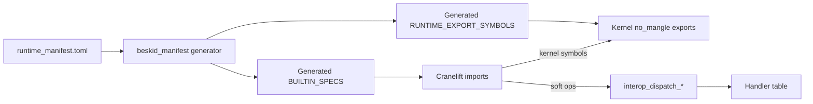

<!-- migrated from the legacy platform spec; canonical OpenSpec source -->
# Builtins and symbols Specification

## Purpose

ABI builtin function signatures, return kinds, and runtime export symbol compatibility.

## Requirements

### Requirement: BUILTIN_SPECS is sole Cranelift import source: Decision [D-EXEC-ABI-0003]
The Beskid standard SHALL enforce the following migrated contract section. Accepted ADR decisions are binding; uppercase requirement keywords retain their BCP-14 meaning.

> | Rule | Detail |
> | --- | --- |
> | Catalog | `BUILTIN_SPECS` in `beskid_abi::builtins` is the **sole** source of Cranelift import signatures (**ABI-002**) |
> | Codegen | `declare_builtin_imports` builds `FuncId`s only from specs |
> | Diverging builtins | `AbiReturnKind::Never` for `panic` so unreachable blocks are correct |
> | Parity | Symbol strings in specs **must** match `RUNTIME_EXPORT_SYMBOLS` entries (**ABI-001**) |

**Stable ID:** `BSP-REQ-AFC0FC28B6BB`  
**Legacy source:** `site/spec-content/platform-spec/execution/abi-and-host/builtins-and-symbols/adr/0003-builtin-specs-sole-clif-source/content.md`  
**Source SHA-256:** `90e95c33b7a7da7d5acefc4e8157134b6f1b8a07793a0a1e153833bd0ac77dc4`

#### Scenario: Conformance exercises Decision
- **GIVEN** an implementation claims conformance with this capability
- **WHEN** behavior governed by this contract section is exercised
- **THEN** every MUST, SHALL, REQUIRED, prohibition, and accepted decision in the section is satisfied

### Requirement: Runtime builtins use C-unwind exports: Decision [D-EXEC-ABI-0004]
The Beskid standard SHALL enforce the following migrated contract section. Accepted ADR decisions are binding; uppercase requirement keywords retain their BCP-14 meaning.

> | Rule | Detail |
> | --- | --- |
> | Export attribute | Implementations use `#[unsafe(no_mangle)] pub extern "C-unwind"` in `beskid_runtime::builtins` |
> | Registry | `RUNTIME_EXPORT_SYMBOLS` lists every export the linker/JIT registers |
> | Layout types | `BeskidStr` `{ ptr, len }` and `BeskidArray` `{ ptr, len, cap }` are normative payload headers |
> | Families | Allocation, GC, fibers, channels, interop dispatch, IO, and `panic` share one catalog |

**Stable ID:** `BSP-REQ-CC187C9619B3`  
**Legacy source:** `site/spec-content/platform-spec/execution/abi-and-host/builtins-and-symbols/adr/0004-runtime-c-unwind-exports/content.md`  
**Source SHA-256:** `f7a925a882000dd710ec0bcf2fbba77be0509ff54f985db2128f9d900bde6c49`

#### Scenario: Conformance exercises Decision
- **GIVEN** an implementation claims conformance with this capability
- **WHEN** behavior governed by this contract section is exercised
- **THEN** every MUST, SHALL, REQUIRED, prohibition, and accepted decision in the section is satisfied

### Requirement: Manifest-generated registries: Decision [D-EXEC-ABI-0007]
The Beskid standard SHALL enforce the following migrated contract section. Accepted ADR decisions are binding; uppercase requirement keywords retain their BCP-14 meaning.

> | Rule | Detail |
> | --- | --- |
> | Source | `compiler/runtime_manifest.toml` is the **sole** input for registry generation |
> | Outputs | `BUILTIN_SPECS`, `RUNTIME_EXPORT_SYMBOLS`, analysis `define_builtins!`, JIT `register_runtime_symbols`, and bridge link anchors **must** be **generated** |
> | v3 scope | Generated `BUILTIN_SPECS` lists **kernel exports plus dispatch entrypoints** only; soft legacy symbols are absent |
> | CLIF authority | [D-EXEC-ABI-0003](/platform-spec/execution/abi-and-host/builtins-and-symbols/adr/0003-builtin-specs-sole-clif-source/) remains valid — generated `BUILTIN_SPECS` is still the sole Cranelift import source |
> | Parity | Generator **must** enforce symbol-string parity between specs and export lists |

**Stable ID:** `BSP-REQ-4405000EC507`  
**Legacy source:** `site/spec-content/platform-spec/execution/abi-and-host/builtins-and-symbols/adr/0005-manifest-generated-registries/content.md`  
**Source SHA-256:** `d597b052a4fc52e4527240c51f98fa255cea81cca3c7c8b4c4d3f85910f172c6`

#### Scenario: Conformance exercises Decision
- **GIVEN** an implementation claims conformance with this capability
- **WHEN** behavior governed by this contract section is exercised
- **THEN** every MUST, SHALL, REQUIRED, prohibition, and accepted decision in the section is satisfied

## Informative Source Provenance

The records below preserve migration history and are not normative except where text was extracted into a requirement above.

### Source Record: Builtins and symbols

**Authority:** informative provenance  
**Legacy path:** `/platform-spec/execution/abi-and-host/builtins-and-symbols/`  
**Source:** `site/spec-content/platform-spec/execution/abi-and-host/builtins-and-symbols/content.md`  
**SHA-256:** `fd624512565bfdf523efc7b1fbf47a7d7644de15f8948fabefcf0f78b0d3d1ac`

<details>
<summary>Migrated source text</summary>

``````markdown
<SpecSection title="What this feature specifies" id="what-this-feature-specifies">
This feature explains the stable ABI contract between generated code, runtime exports, and host execution. It is organized into newcomer-friendly articles that move from model, to flow, to contracts, then practical verification and debugging guidance.
</SpecSection>

<SpecSection title="Implementation anchors" id="implementation-anchors">
- `BuiltinFnSpec` and `BUILTIN_SPECS` in `compiler/crates/beskid_abi/src/builtins.rs`
- `RUNTIME_EXPORT_SYMBOLS` in `compiler/crates/beskid_abi/src/symbols.rs`
- Builtin runtime implementations in `compiler/crates/beskid_runtime/src/builtins/mod.rs`
- Panic and syscall behavior in `compiler/crates/beskid_runtime/src/builtins/panic_io.rs`
</SpecSection>

## Decisions
<!-- spec:generate:adr-index -->
No open decisions. Closed choices are normative ADRs under **`adr/`** (`D-EXEC-ABI-0003` … `D-EXEC-ABI-0007`); use the reader **ADRs** tab for expandable detail.
<!-- /spec:generate:adr-index -->
## Articles
<!-- spec:generate:article-index -->
- [Contracts and edge cases](./articles/contracts-and-edge-cases/)
- [Design model](./articles/design-model/)
- [Examples](./articles/examples/)
- [FAQ and troubleshooting](./articles/faq-and-troubleshooting/)
- [Flow and algorithm](./articles/flow-and-algorithm/)
- [Verification and traceability](./articles/verification-and-traceability/)
<!-- /spec:generate:article-index -->
``````

</details>

### Source Record: BUILTIN_SPECS is sole Cranelift import source

**Authority:** informative provenance  
**Legacy path:** `/platform-spec/execution/abi-and-host/builtins-and-symbols/adr/0003-builtin-specs-sole-clif-source/`  
**Source:** `site/spec-content/platform-spec/execution/abi-and-host/builtins-and-symbols/adr/0003-builtin-specs-sole-clif-source/content.md`  
**SHA-256:** `90e95c33b7a7da7d5acefc4e8157134b6f1b8a07793a0a1e153833bd0ac77dc4`

<details>
<summary>Migrated source text</summary>

``````markdown
## Context

Hand-written Cranelift calls bypass the shared ABI catalog and desynchronize JIT, AOT, and runtime `extern "C-unwind"` implementations.

## Decision

| Rule | Detail |
| --- | --- |
| Catalog | `BUILTIN_SPECS` in `beskid_abi::builtins` is the **sole** source of Cranelift import signatures (**ABI-002**) |
| Codegen | `declare_builtin_imports` builds `FuncId`s only from specs |
| Diverging builtins | `AbiReturnKind::Never` for `panic` so unreachable blocks are correct |
| Parity | Symbol strings in specs **must** match `RUNTIME_EXPORT_SYMBOLS` entries (**ABI-001**) |

## Consequences

New builtins require spec, `BUILTIN_SPECS`, `symbols.rs`, and `beskid_runtime::builtins` in one change set.

## Verification anchors

`compiler/crates/beskid_codegen`; `compiler/crates/beskid_abi/src/builtins.rs`.
``````

</details>

### Source Record: Runtime builtins use C-unwind exports

**Authority:** informative provenance  
**Legacy path:** `/platform-spec/execution/abi-and-host/builtins-and-symbols/adr/0004-runtime-c-unwind-exports/`  
**Source:** `site/spec-content/platform-spec/execution/abi-and-host/builtins-and-symbols/adr/0004-runtime-c-unwind-exports/content.md`  
**SHA-256:** `f7a925a882000dd710ec0bcf2fbba77be0509ff54f985db2128f9d900bde6c49`

<details>
<summary>Migrated source text</summary>

``````markdown
## Context

Generated code calls runtime entrypoints across JIT relink and AOT link. Rust panics across the boundary must use the platform unwind ABI expected by Cranelift `call` sites.

## Decision

| Rule | Detail |
| --- | --- |
| Export attribute | Implementations use `#[unsafe(no_mangle)] pub extern "C-unwind"` in `beskid_runtime::builtins` |
| Registry | `RUNTIME_EXPORT_SYMBOLS` lists every export the linker/JIT registers |
| Layout types | `BeskidStr` `{ ptr, len }` and `BeskidArray` `{ ptr, len, cap }` are normative payload headers |
| Families | Allocation, GC, fibers, channels, interop dispatch, IO, and `panic` share one catalog |

## Consequences

Host tooling resolves imports by symbol name + `BUILTIN_SPECS` signature, not Rust mangling.

## Verification anchors

`compiler/crates/beskid_runtime/src/builtins/mod.rs`; `compiler/crates/beskid_runtime/src/lib.rs` re-exports.
``````

</details>

### Source Record: Manifest-generated registries

**Authority:** informative provenance  
**Legacy path:** `/platform-spec/execution/abi-and-host/builtins-and-symbols/adr/0005-manifest-generated-registries/`  
**Source:** `site/spec-content/platform-spec/execution/abi-and-host/builtins-and-symbols/adr/0005-manifest-generated-registries/content.md`  
**SHA-256:** `d597b052a4fc52e4527240c51f98fa255cea81cca3c7c8b4c4d3f85910f172c6`

<details>
<summary>Migrated source text</summary>

``````markdown
## Context

ABI v2 required parallel edits to `beskid_abi`, analysis builtins, JIT registration, and runtime bridge whenever a runtime symbol changed. Drift between registries caused link failures and silent analysis gaps.

## Decision

| Rule | Detail |
| --- | --- |
| Source | `compiler/runtime_manifest.toml` is the **sole** input for registry generation |
| Outputs | `BUILTIN_SPECS`, `RUNTIME_EXPORT_SYMBOLS`, analysis `define_builtins!`, JIT `register_runtime_symbols`, and bridge link anchors **must** be **generated** |
| v3 scope | Generated `BUILTIN_SPECS` lists **kernel exports plus dispatch entrypoints** only; soft legacy symbols are absent |
| CLIF authority | [D-EXEC-ABI-0003](/platform-spec/execution/abi-and-host/builtins-and-symbols/adr/0003-builtin-specs-sole-clif-source/) remains valid — generated `BUILTIN_SPECS` is still the sole Cranelift import source |
| Parity | Generator **must** enforce symbol-string parity between specs and export lists |

## Consequences

Adding or reclassifying a runtime builtin **must** change the manifest and regenerate — not hand-edit Rust tables. Supersedes manual dual-registry maintenance for v3 onward.

## Verification anchors

`compiler/crates/beskid_manifest/`; `compiler/crates/beskid_abi/build.rs`; `compiler/crates/beskid_tests/src/abi/contracts.rs`.
``````

</details>

### Source Record: Contracts and edge cases

**Authority:** informative provenance  
**Legacy path:** `/platform-spec/execution/abi-and-host/builtins-and-symbols/articles/contracts-and-edge-cases/`  
**Source:** `site/spec-content/platform-spec/execution/abi-and-host/builtins-and-symbols/articles/contracts-and-edge-cases/content.md`  
**SHA-256:** `5d74103224387013ee53d82daf208598180c9203983bf302fffc1de836b8ad32`

<details>
<summary>Migrated source text</summary>

``````markdown
## Normative requirements

| ID | Requirement |
| --- | --- |
| **BLT-001** | Every `BUILTIN_SPECS` entry **must** have exactly one `#[unsafe(no_mangle)]` export in `beskid_runtime` with the same `symbol` string. |
| **BLT-002** | `RUNTIME_EXPORT_SYMBOLS` **must** be a superset of all builtin symbols plus `beskid_runtime_abi_version`. |
| **BLT-003** | `panic` and `panic_str` **must** use `AbiReturnKind::Never`; callers **must not** expect return values. |
| **BLT-004** | Pointer parameters **must** refer to GC-tracked or ABI-documented structs (`BeskidStr`, headers); null unless the specific builtin documents otherwise. |
| **BLT-005** | Fiber join builtins **must** distinguish status-only (`fiber_join_status`) vs value (`fiber_join_value`) per symbol names in `symbols.rs`. |
| **BLT-006** | Channel receive **must** expose status vs value as separate symbols (`channel_receive_status`, `channel_receive_value`) to avoid ambiguous CLIF signatures. |

## Signature table (selected)

| Symbol | Params | Returns |
| --- | --- | --- |
| `alloc` | `ptr, ptr` (size, type desc) | `ptr` |
| `str_new` | `ptr, ptr` (data, len) | `ptr` |
| `syscall_write` | `i64, ptr` (fd, `BeskidStr`) | `i64` |
| `gc_write_barrier` | `ptr, ptr` | void |
| `fiber_spawn` | (see `builtins.rs`) | `i64` fiber id |
| `interop_dispatch_ptr` | `ptr` | `ptr` |

Full table: `compiler/crates/beskid_abi/src/builtins.rs`.

## Edge cases

| Case | Rule |
| --- | --- |
| `array_new` without `arrays_backing` | Header allocated; `ptr` field null; `array_len` still reports logical length |
| Null `BeskidStr` in `syscall_write` | Returns error sentinel (`-1`) per IO runtime |
| Test helpers `test_bytes_*` | Only for compiler tests; not a stable user API |
| Metrics exports | Gated by `metrics` feature; not in baseline `RUNTIME_EXPORT_SYMBOLS` unless enabled at build |

## Implementation anchors
- `compiler/crates/beskid_abi/src/builtins.rs` — signature validation, null-safety, error sentinel contracts
- `compiler/crates/beskid_runtime/src/builtins/` — runtime impl parity with specs

## Related topics

- [Panic, IO, and syscalls](/platform-spec/execution/runtime/panic-io-and-syscalls/)
- [Channels and synchronization](/platform-spec/execution/runtime/channels-and-synchronization/)
``````

</details>

### Source Record: Design model

**Authority:** informative provenance  
**Legacy path:** `/platform-spec/execution/abi-and-host/builtins-and-symbols/articles/design-model/`  
**Source:** `site/spec-content/platform-spec/execution/abi-and-host/builtins-and-symbols/articles/design-model/content.md`  
**SHA-256:** `ca9a5f0d94a22748939f99da48967352bce05dbd23323d4dd7659312999c810d`

<details>
<summary>Migrated source text</summary>

``````markdown
## Purpose

Document the **manifest-driven registry** that connects Beskid lowered code to the host runtime: a language-owned manifest generates symbolic names for the linker, Cranelift signatures, analysis builtins, JIT registration, and bridge anchors — split into **kernel** direct exports and **dispatch** entrypoints in ABI v3.

## Primary actors

| Actor | Artifact |
| --- | --- |
| **`runtime_manifest.toml`** | Normative classification of kernel vs dispatch ops |
| **`beskid_manifest` generator** | Emits generated Rust tables at build time |
| **`beskid_abi::builtins`** | Generated `BuiltinFnSpec { symbol, params, returns }` entries |
| **`beskid_abi::symbols`** | Generated `SYM_*` constants + `RUNTIME_EXPORT_SYMBOLS` (kernel-only in v3) |
| **`beskid_codegen`** | `declare_builtin_imports` builds Cranelift `FuncId`s from generated specs |
| **`beskid_runtime::builtins`** | Kernel `#[unsafe(no_mangle)] pub extern "C-unwind"` exports; soft impls via dispatch |

## Builtin families

| Family | v3 path | Consumer |
| --- | --- | --- |
| **Allocation / GC (kernel)** | Direct `alloc`, `gc_*` | All backends |
| **Faults / preempt (kernel)** | Direct `panic`, `runtime_preempt_check` | Traps and scheduling |
| **Dispatch (kernel entry)** | `interop_dispatch_{unit,ptr,usize}` | Soft op envelopes |
| **Soft ops (dispatch)** | Manifest tags → handler table | Strings, channels, fibers, IO, … |
| **Registration (kernel)** | `beskid_register_callbacks`, `beskid_register_handlers` | Host and corelib init |
| **Composition / dynamic (kernel, Phase A)** | Direct composition and dynamic symbols | DI and dynamic lowering |

Return kinds include **`AbiReturnKind::Never`** for diverging `panic` calls so Cranelift marks unreachable correctly.

## Data layout contracts

- **`BeskidStr`**: `{ ptr, len }` UTF-8 bytes (immutable; length in bytes).
- **`BeskidArray`**: `{ ptr, len, cap }`; element storage optional behind runtime `arrays_backing` feature ([Runtime feature flags](/platform-spec/execution/runtime/runtime-feature-flags/)).

## Registry diagram



## Implementation anchors
- `compiler/runtime_manifest.toml` — normative manifest input
- `compiler/crates/beskid_manifest/` — generator crate
- `compiler/crates/beskid_abi/src/generated/` — `BUILTIN_SPECS`, `RUNTIME_EXPORT_SYMBOLS`, `SYM_*`
- `compiler/crates/beskid_runtime/src/builtins/` — kernel exports and private soft implementations

## Related topics

- [ABI versioning](/platform-spec/execution/abi-and-host/abi-versioning-and-compatibility/) — when to bump version after symbol changes
- [Flow and algorithm](./flow-and-algorithm/)
``````

</details>

### Source Record: Examples

**Authority:** informative provenance  
**Legacy path:** `/platform-spec/execution/abi-and-host/builtins-and-symbols/articles/examples/`  
**Source:** `site/spec-content/platform-spec/execution/abi-and-host/builtins-and-symbols/articles/examples/content.md`  
**SHA-256:** `2a7f5bda13749d626bbd53ea6c405bb1d4e47691a200de7e6cc151a66c75d9e2`

<details>
<summary>Migrated source text</summary>

``````markdown
## Locating a builtin implementation

Given CLIF calling `fiber_yield`:

1. Find `SYM_FIBER_YIELD` → `"fiber_yield"` in `symbols.rs`.
2. Locate `BuiltinFnSpec` with `symbol: SYM_FIBER_YIELD` in `builtins.rs`.
3. Open `compiler/crates/beskid_runtime/src/builtins/fiber.rs` for behavior (park current fiber, requeue).

## Corelib indirection

User code calls `Fiber.Yield()` in `corelib_concurrency`; lowering **must not** embed scheduler details. The package emits a call to `fiber_yield` only—see [Concurrency package](/platform-spec/core-library/concurrency/concurrency-package/).

## Allocation + GC root scenario

A global `string` cached from native code:

1. Lowering calls `alloc` with type descriptor pointer.
2. Host registers root via `gc_register_root` when exposing to foreign API.
3. On teardown, `gc_unregister_root` pairs with registration.

Missing unroot leaks until next collection; handles from `gc_root_handle` document temporary pinning.

## Panic from bounds check

Lowering may emit:

```
call panic(message_ptr, message_len) -> never
```

Runtime formats output and terminates the process—no stack unwind through Beskid frames ([error model legacy](../../../../execution/runtime/error-model.md)).

## Inspecting JIT registration

In `jit_module.rs`, the `declare_builtin_imports` block maps each `beskid_runtime` function pointer to the symbol name Cranelift imports. A drift between Rust function export name and `SYM_*` constant breaks finalize with `MissingFunction`.

## Related topics

- [Verification and traceability](./verification-and-traceability/)
- Legacy symbol list: [Runtime ABI (v0.1)](../../../../execution/runtime/runtime-abi-v0-1.md)
``````

</details>

### Source Record: FAQ and troubleshooting

**Authority:** informative provenance  
**Legacy path:** `/platform-spec/execution/abi-and-host/builtins-and-symbols/articles/faq-and-troubleshooting/`  
**Source:** `site/spec-content/platform-spec/execution/abi-and-host/builtins-and-symbols/articles/faq-and-troubleshooting/content.md`  
**SHA-256:** `9d8462515c0154da37e3a7e2cf394b0df1d298cbbaa8e8089816442933b50afb`

<details>
<summary>Migrated source text</summary>

``````markdown
## FAQ

### Why separate `BUILTIN_SPECS` and `RUNTIME_EXPORT_SYMBOLS`?

Names alone are insufficient for Cranelift: `BuiltinFnSpec` carries parameter and return kinds. The export list additionally includes symbols resolved without going through the spec table (for example version export) and documents the linker surface for AOT.

### Can I add a builtin only in runtime?

No (**BLT-001**). Codegen will not declare the import; JIT fails at finalize or AOT fails at link.

### What calling convention is used?

Generated code uses the Cranelift default for the host ISA; runtime exports use `extern "C-unwind"` so panics across the boundary remain defined for Rust host frames.

### Do fiber builtins use `Fiber<T>` in the ABI?

No. ABI uses raw ids and pointers; generic `Fiber<T>` is a corelib surface. See [Fiber scheduler](/platform-spec/execution/runtime/fiber-scheduler-and-stacks/).

## Troubleshooting

| Symptom | Likely fix |
| --- | --- |
| `MissingFunction` for `channel_receive` | Call site uses old symbol; use `channel_receive_status` / `channel_receive_value` |
| CLIF verify failure on builtin call | Arity mismatch—update `BUILTIN_SPECS` and lowering together |
| GC heap corruption after new store | Missing `gc_write_barrier` in lowering for pointer write |
| `array_new` always null data pointer | Build runtime with `--features arrays_backing` if tests need backing storage |

## Related topics

- [Flow and algorithm](./flow-and-algorithm/)
- [Runtime feature flags](/platform-spec/execution/runtime/runtime-feature-flags/)
``````

</details>

### Source Record: Flow and algorithm

**Authority:** informative provenance  
**Legacy path:** `/platform-spec/execution/abi-and-host/builtins-and-symbols/articles/flow-and-algorithm/`  
**Source:** `site/spec-content/platform-spec/execution/abi-and-host/builtins-and-symbols/articles/flow-and-algorithm/content.md`  
**SHA-256:** `90d5926878746d3503cf351fdab40d26e9f37014607b038c06da566974633fe6`

<details>
<summary>Migrated source text</summary>

``````markdown
## Purpose

Trace how a builtin reference in CLIF becomes a live function pointer at run time. Registry diagram: [design model](./design-model/).

## Lowering to import declaration

1. HIR/lowering selects a runtime operation (allocate string, `fiber_yield`, etc.).
2. Codegen emits a `call` to the stable symbol string (for example `alloc`, not a mangled Rust name).
3. During JIT `compile`, `declare_builtin_imports` walks `BUILTIN_SPECS` in declaration order.
4. For each spec, codegen maps `AbiParamKind::Ptr` to the host pointer type and `I64` to `i64`, then sets return type from `AbiReturnKind`.

## Runtime entry

1. Generated code calls using the platform default calling convention (SysV on Linux x86_64).
2. The runtime builtin enters `enter_runtime_scope` / GC rules as needed (`alloc`, barriers).
3. Fiber/channel builtins park or enqueue work via `beskid_runtime::scheduler` without exposing scheduler internals to CLIF.

## String builtin algorithm (`str_concat`)

1. Read `BeskidStr` headers for left and right operands.
2. Allocate a fresh buffer via `alloc` for combined byte length.
3. Copy UTF-8 payload; return new `{ ptr, len }` handle.
4. On allocation failure or null inputs, trap via `panic` (no implicit `Option` at ABI layer).

## GC barrier hook

1. Lowering emits `gc_write_barrier(parent, child)` after pointer stores when concurrent GC is active.
2. Runtime barrier ensures tri-color invariant (see [Memory and GC](/platform-spec/execution/runtime/memory-and-gc-runtime-contract/)).
3. Phase A may simplify barrier work when only one mutator runs; symbol remains reserved.

## Implementation anchors
- `compiler/crates/beskid_codegen/src/` — `declare_builtin_imports` Cranelift registration
- `compiler/crates/beskid_abi/src/builtins.rs` — signature specification table
- `compiler/crates/beskid_engine/src/jit_module.rs` — symbol map initialization

## Related topics

- [Contracts and edge cases](./contracts-and-edge-cases/)
- `compiler/crates/beskid_abi/src/builtins.rs` — full spec table
``````

</details>

### Source Record: Verification and traceability

**Authority:** informative provenance  
**Legacy path:** `/platform-spec/execution/abi-and-host/builtins-and-symbols/articles/verification-and-traceability/`  
**Source:** `site/spec-content/platform-spec/execution/abi-and-host/builtins-and-symbols/articles/verification-and-traceability/content.md`  
**SHA-256:** `433e365f3b1249c11f509253b9f099bed4ced8f0aa315346c070e161f418a1b8`

<details>
<summary>Migrated source text</summary>

``````markdown
## Canonical files

| File | Contract |
| --- | --- |
| `compiler/crates/beskid_abi/src/builtins.rs` | `BUILTIN_SPECS`, `AbiParamKind`, `AbiReturnKind` |
| `compiler/crates/beskid_abi/src/symbols.rs` | `RUNTIME_EXPORT_SYMBOLS` |
| `compiler/crates/beskid_runtime/src/builtins/mod.rs` | Module routing to alloc/gc/fiber/… |
| `compiler/crates/beskid_codegen` (host helpers) | `declare_builtin_imports` |
| `compiler/crates/beskid_engine/src/jit_module.rs` | Function pointer table for JIT |

## Tests

| Location | Covers |
| --- | --- |
| `compiler/crates/beskid_tests/src/runtime/jit.rs` | Builtin calls through JIT |
| `compiler/crates/beskid_e2e_tests/src/tests/runtime_cases.rs` | Panic, IO, runtime smoke |
| `compiler/crates/beskid_runtime` benches | Microbenchmarks for alloc/GC hot paths |

## Requirement mapping

| ID | Check |
| --- | --- |
| **BLT-001** | Grep `BUILTIN_SPECS` symbols against `pub extern` exports in `builtins/` |
| **BLT-002** | `RUNTIME_EXPORT_SYMBOLS` contains every `BUILTIN_SPECS.symbol` |
| **BLT-005–006** | Symbol rename tests in fiber/channel integration tests |

## Review checklist (PRs touching builtins)

1. Update `builtins.rs`, `symbols.rs`, runtime impl, and platform-spec together.
2. Decide if [ABI versioning](/platform-spec/execution/abi-and-host/abi-versioning-and-compatibility/) bump is required.
3. Run `cargo test -p beskid_tests runtime` and relevant `beskid_e2e_tests` targets.

## Implementation anchors
- `compiler/crates/beskid_abi/src/builtins.rs` — spec parity assertions
- `compiler/crates/beskid_tests/src/runtime/` — JIT and runtime test fixtures

## Related topics

- [Contracts and edge cases](./contracts-and-edge-cases/)
- [ABI versioning verification](/platform-spec/execution/abi-and-host/abi-versioning-and-compatibility/verification-and-traceability/)
``````

</details>
