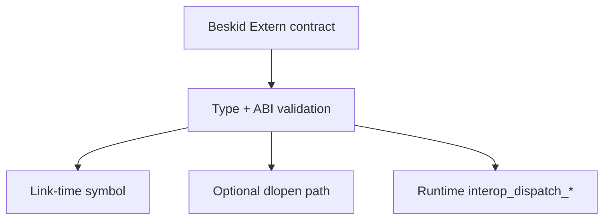

<!-- migrated from the legacy platform spec; canonical OpenSpec source -->
# Extern dispatch and policy Specification

## Purpose

How extern calls are declared, resolved, and constrained by runtime and host policy.

## Requirements

### Requirement: Link-time extern is the Standard path: Decision [D-EXEC-ABI-0005]
The Beskid standard SHALL enforce the following migrated contract section. Accepted ADR decisions are binding; uppercase requirement keywords retain their BCP-14 meaning.

> | Track | Status |
> | --- | --- |
> | **Link-time** | **Standard** for v0.3 — addresses fixed before execution via [C ABI profile](/platform-spec/language-meta/interop/c-abi-profile/link-time-linking/) |
> | **Dynamic `extern_dlopen`** | **Proposed** / legacy — engine feature only; not required for reference CLI |
> | Validation | High-level Beskid types in extern signatures **must** be rejected before codegen |
> | Syscalls | User externs **must not** embed OS syscall sequences — see [Panic, IO, and syscalls](/platform-spec/execution/runtime/panic-io-and-syscalls/) |

**Stable ID:** `BSP-REQ-BFB9F04E7E50`  
**Legacy source:** `site/spec-content/platform-spec/execution/abi-and-host/extern-dispatch-and-policy/adr/0005-link-time-extern-standard/content.md`  
**Source SHA-256:** `510e845b8c76477c82027eebad4fbd3ae71fd88588cf64c219244465356d0e2c`

#### Scenario: Conformance exercises Decision
- **GIVEN** an implementation claims conformance with this capability
- **WHEN** behavior governed by this contract section is exercised
- **THEN** every MUST, SHALL, REQUIRED, prohibition, and accepted decision in the section is satisfied

### Requirement: Runtime interop_dispatch builtins for tagged values: Decision [D-EXEC-ABI-0006]
The Beskid standard SHALL enforce the following migrated contract section. Accepted ADR decisions are binding; uppercase requirement keywords retain their BCP-14 meaning.

> | Builtin family | Role |
> | --- | --- |
> | `interop_dispatch_unit` | Unit-tagged dispatch |
> | `interop_dispatch_ptr` | Pointer payloads |
> | `interop_dispatch_usize` | Scalar bridge |
> | Layout stability | Offsets are versioned with [ABI versioning](../abi-versioning-and-compatibility/) |
> | Implementation | `beskid_runtime::interop` exports registered in `BUILTIN_SPECS` |
> 
> Lowering **must** route approved tagged calls through these builtins rather than ad-hoc host calls.

**Stable ID:** `BSP-REQ-4A884EE164B8`  
**Legacy source:** `site/spec-content/platform-spec/execution/abi-and-host/extern-dispatch-and-policy/adr/0006-interop-dispatch-builtins/content.md`  
**Source SHA-256:** `93e5ad220cd286e80e1c3b7008d0fbb8b0b5263102659157dccd4720c25d77f0`

#### Scenario: Conformance exercises Decision
- **GIVEN** an implementation claims conformance with this capability
- **WHEN** behavior governed by this contract section is exercised
- **THEN** every MUST, SHALL, REQUIRED, prohibition, and accepted decision in the section is satisfied

### Requirement: Handler registration before user init: Decision [D-EXEC-ABI-0008]
The Beskid standard SHALL enforce the following migrated contract section. Accepted ADR decisions are binding; uppercase requirement keywords retain their BCP-14 meaning.

> | Host | Rule |
> | --- | --- |
> | **AOT** | Emitted `runtime_init` **must** call corelib handler registration **before** user `main` and before user static init |
> | **JIT** | Engine session **must** invoke registration once per process before executing user code |
> | **Corelib** | `Runtime.Init` **must** call `beskid_register_handlers(version, table, count)` with manifest-aligned tags |
> | **Version gate** | Registration **must** reject mismatched handler-table version bands (same policy as `beskid_register_callbacks`) |
> | **Bootstrap** | Kernel exports may install static handlers for tags required before corelib init; corelib registration **must** supersede or complete the table |
> 
> User code **must not** rely on soft dispatch builtins before registration completes.

**Stable ID:** `BSP-REQ-FE019B8DA84C`  
**Legacy source:** `site/spec-content/platform-spec/execution/abi-and-host/extern-dispatch-and-policy/adr/0007-handler-registration-init-order/content.md`  
**Source SHA-256:** `e415967420b1694a0f160a808e6bcd8859bfcab3d8b14ab0a30652972b16e3fd`

#### Scenario: Conformance exercises Decision
- **GIVEN** an implementation claims conformance with this capability
- **WHEN** behavior governed by this contract section is exercised
- **THEN** every MUST, SHALL, REQUIRED, prohibition, and accepted decision in the section is satisfied

## Informative Source Provenance

The records below preserve migration history and are not normative except where text was extracted into a requirement above.

### Source Record: Extern dispatch and policy

**Authority:** informative provenance  
**Legacy path:** `/platform-spec/execution/abi-and-host/extern-dispatch-and-policy/`  
**Source:** `site/spec-content/platform-spec/execution/abi-and-host/extern-dispatch-and-policy/content.md`  
**SHA-256:** `a3851fac4dc41d227ba3a6bb6a33b4ebfd06a8f399161de89aa9daebf770b4b2`

<details>
<summary>Migrated source text</summary>

``````markdown
<SpecSection title="What this feature specifies" id="what-this-feature-specifies">
`Extern dispatch and policy` defines one operational contract that a newcomer can follow end-to-end: first the model, then execution flow, then strict guarantees, concrete examples, and verification guidance.
</SpecSection>

<SpecSection title="Implementation anchors" id="implementation-anchors">
- Extern parsing and diagnostics in `compiler/crates/beskid_analysis/src/beskid.pest` and `compiler/crates/beskid_analysis/src/analysis/diagnostic_kinds.rs`
- ABI builtins definitions in `compiler/crates/beskid_abi/src/builtins.rs`
- Runtime builtin dispatch in `compiler/crates/beskid_runtime/src/builtins/mod.rs`
- Panic/syscall bridging in `compiler/crates/beskid_runtime/src/builtins/panic_io.rs`
</SpecSection>

## Decisions
<!-- spec:generate:adr-index -->
No open decisions. Closed choices are normative ADRs under **`adr/`** (`D-EXEC-ABI-0005` … `D-EXEC-ABI-0008`); use the reader **ADRs** tab for expandable detail.
<!-- /spec:generate:adr-index -->
## Articles
<!-- spec:generate:article-index -->
- [Contracts and edge cases](./articles/contracts-and-edge-cases/)
- [Design model](./articles/design-model/)
- [Examples](./articles/examples/)
- [FAQ and troubleshooting](./articles/faq-and-troubleshooting/)
- [Flow and algorithm](./articles/flow-and-algorithm/)
- [Verification and traceability](./articles/verification-and-traceability/)
<!-- /spec:generate:article-index -->
``````

</details>

### Source Record: Link-time extern is the Standard path

**Authority:** informative provenance  
**Legacy path:** `/platform-spec/execution/abi-and-host/extern-dispatch-and-policy/adr/0005-link-time-extern-standard/`  
**Source:** `site/spec-content/platform-spec/execution/abi-and-host/extern-dispatch-and-policy/adr/0005-link-time-extern-standard/content.md`  
**SHA-256:** `510e845b8c76477c82027eebad4fbd3ae71fd88588cf64c219244465356d0e2c`

<details>
<summary>Migrated source text</summary>

``````markdown
## Context

Early engine prototypes resolved `Extern(Library:…)` via `dlopen`/`dlsym`. That complicates reproducible AOT artifacts and blurs security review of loaded code.

## Decision

| Track | Status |
| --- | --- |
| **Link-time** | **Standard** for v0.3 — addresses fixed before execution via [C ABI profile](/platform-spec/language-meta/interop/c-abi-profile/link-time-linking/) |
| **Dynamic `extern_dlopen`** | **Proposed** / legacy — engine feature only; not required for reference CLI |
| Validation | High-level Beskid types in extern signatures **must** be rejected before codegen |
| Syscalls | User externs **must not** embed OS syscall sequences — see [Panic, IO, and syscalls](/platform-spec/execution/runtime/panic-io-and-syscalls/) |

## Consequences

New platform work documents link-time flows first. Dynamic resolution stays gated behind `extern_dlopen` in `beskid_engine`.

## Verification anchors

`compiler/crates/beskid_analysis` extern validation; `beskid_engine` link paths.
``````

</details>

### Source Record: Runtime interop_dispatch builtins for tagged values

**Authority:** informative provenance  
**Legacy path:** `/platform-spec/execution/abi-and-host/extern-dispatch-and-policy/adr/0006-interop-dispatch-builtins/`  
**Source:** `site/spec-content/platform-spec/execution/abi-and-host/extern-dispatch-and-policy/adr/0006-interop-dispatch-builtins/content.md`  
**SHA-256:** `93e5ad220cd286e80e1c3b7008d0fbb8b0b5263102659157dccd4720c25d77f0`

<details>
<summary>Migrated source text</summary>

``````markdown
## Context

Tagged interop values need runtime-known layout offsets. Per-site custom trampolines would fork ABI stability.

## Decision

| Builtin family | Role |
| --- | --- |
| `interop_dispatch_unit` | Unit-tagged dispatch |
| `interop_dispatch_ptr` | Pointer payloads |
| `interop_dispatch_usize` | Scalar bridge |
| Layout stability | Offsets are versioned with [ABI versioning](../abi-versioning-and-compatibility/) |
| Implementation | `beskid_runtime::interop` exports registered in `BUILTIN_SPECS` |

Lowering **must** route approved tagged calls through these builtins rather than ad-hoc host calls.

## Consequences

Interop layout changes require ABI bump or additive symbol policy per **D-EXEC-ABI-0002**.

## Verification anchors

`compiler/crates/beskid_runtime/src/interop/`; interop lowering tests.
``````

</details>

### Source Record: Handler registration before user init

**Authority:** informative provenance  
**Legacy path:** `/platform-spec/execution/abi-and-host/extern-dispatch-and-policy/adr/0007-handler-registration-init-order/`  
**Source:** `site/spec-content/platform-spec/execution/abi-and-host/extern-dispatch-and-policy/adr/0007-handler-registration-init-order/content.md`  
**SHA-256:** `e415967420b1694a0f160a808e6bcd8859bfcab3d8b14ab0a30652972b16e3fd`

<details>
<summary>Migrated source text</summary>

``````markdown
## Context

v3 soft ops resolve through a handler table populated at process start. If user static initializers run before registration, dispatch calls observe empty or bootstrap-only tables.

## Decision

| Host | Rule |
| --- | --- |
| **AOT** | Emitted `runtime_init` **must** call corelib handler registration **before** user `main` and before user static init |
| **JIT** | Engine session **must** invoke registration once per process before executing user code |
| **Corelib** | `Runtime.Init` **must** call `beskid_register_handlers(version, table, count)` with manifest-aligned tags |
| **Version gate** | Registration **must** reject mismatched handler-table version bands (same policy as `beskid_register_callbacks`) |
| **Bootstrap** | Kernel exports may install static handlers for tags required before corelib init; corelib registration **must** supersede or complete the table |

User code **must not** rely on soft dispatch builtins before registration completes.

## Consequences

Codegen and link hosts emit an explicit init hook. Conformance tests assert handler registration precedes first soft dispatch from user code.

## Verification anchors

`compiler/crates/beskid_aot/src/run.rs`; `compiler/crates/beskid_engine/src/engine.rs`; `compiler/corelib/packages/runtime/src/Runtime/Init.bd`; `compiler/crates/beskid_runtime/src/interop/register.rs`.
``````

</details>

### Source Record: Contracts and edge cases

**Authority:** informative provenance  
**Legacy path:** `/platform-spec/execution/abi-and-host/extern-dispatch-and-policy/articles/contracts-and-edge-cases/`  
**Source:** `site/spec-content/platform-spec/execution/abi-and-host/extern-dispatch-and-policy/articles/contracts-and-edge-cases/content.md`  
**SHA-256:** `1a9c93192d19350b3a48475e7e4e98a5a9e993f6e1a0df2b9627a87fc0638eb3`

<details>
<summary>Migrated source text</summary>

``````markdown
## Normative requirements

| ID | Requirement |
| --- | --- |
| **EXT-001** | If dynamic extern resolution is disabled, compilation **must** fail when the artifact references extern symbols, listing each unresolved import. |
| **EXT-002** | Engine-validated extern signatures **must** use only approved scalar Cranelift kinds; all other types **must** be rejected. |
| **EXT-003** | Dynamic loading on Linux **must** use `RTLD_LOCAL \| RTLD_NOW`; error paths **must** surface `dlerror()` text. |
| **EXT-004** | `(library, symbol)` resolution **must** be cached for process lifetime without double `dlopen` of the same library path. |
| **EXT-005** | `interop_dispatch_*` builtins **must** follow layouts documented in `beskid_runtime` `interop_layout.rs` for the active ABI version. |
| **EXT-006** | User-facing docs **must not** expose internal `__interop_*` mangling; stable names are `interop_dispatch_*` only. |

## Edge cases

| Case | Behavior |
| --- | --- |
| Missing shared library | Compile/link failure with library path in diagnostic when dynamic path enabled |
| Missing symbol | `dlsym` failure with symbol + library name |
| Extern in artifact, feature off | Fail fast (**EXT-001**); no silent stub addresses |
| Mixed link-time + dynamic in one workspace | Each artifact follows its manifest/link profile; engine caches are per-process |
| Non-Linux host with `extern_dlopen` | Unsupported; compilation or tests **should** skip with explicit platform guard |

## SHOULD guidance

- New packages **should** use link-time [C ABI profile](/platform-spec/language-meta/interop/c-abi-profile/) rather than `extern_dlopen`.
- Panic from foreign code **should** be treated as process-fatal; Beskid does not translate C aborts into `Option`.

## Implementation anchors
- `compiler/crates/beskid_analysis/src/` — extern validation diagnostics and feature gating
- `compiler/crates/beskid_engine/src/` — optional `extern_dlopen` path
- `compiler/crates/beskid_runtime/src/interop/` — runtime panic policy for foreign code

## Related topics

- [FFI and extern](/platform-spec/language-meta/interop/ffi-and-extern/)
- [Panic, IO, and syscalls](/platform-spec/execution/runtime/panic-io-and-syscalls/)
``````

</details>

### Source Record: Design model

**Authority:** informative provenance  
**Legacy path:** `/platform-spec/execution/abi-and-host/extern-dispatch-and-policy/articles/design-model/`  
**Source:** `site/spec-content/platform-spec/execution/abi-and-host/extern-dispatch-and-policy/articles/design-model/content.md`  
**SHA-256:** `d105c872a2dc9bc91f74ea170dafc238482dee054804c6ff6107302999afc504`

<details>
<summary>Migrated source text</summary>

``````markdown
## Purpose

Separate **who declares** foreign calls, **who validates** signatures, and **who resolves** addresses at link or run time. User `Extern` libraries and runtime builtins follow different policy tracks.

## Primary actors

| Actor | Role |
| --- | --- |
| **Front-end / analysis** | Parses `Extern` contracts, emits diagnostics for disallowed types (`compiler/crates/beskid_analysis`). |
| **Codegen** | Lowers approved calls to Cranelift `call` targets—either runtime builtins or imported extern symbols. |
| **Engine (`beskid_engine`)** | Optional `extern_dlopen` path: `dlopen` / `dlsym` with caches (legacy v0.1; **Proposed** for new work—prefer link-time [C ABI profile](/platform-spec/language-meta/interop/c-abi-profile/link-time-linking/)). |
| **Runtime builtins** | `interop_dispatch_unit`, `interop_dispatch_ptr`, `interop_dispatch_usize` bridge language/runtime interop layouts (`beskid_runtime::interop`). |

## Dispatch layers



**Link-time (Standard v0.3):** User libraries resolve when producing AOT/JIT artifacts; addresses are fixed before execution.

**Dynamic (legacy):** Engine loads `Library` + `Symbol` strings from `Extern(Abi:"C", Library:"…")` metadata when `extern_dlopen` is enabled.

**Runtime dispatch:** Compiler-generated thunks call `interop_dispatch_*` for tagged interop values; layout offsets are stable per ABI version ([ABI versioning](/platform-spec/execution/abi-and-host/abi-versioning-and-compatibility/)).

## Policy boundaries

- Lowering **must not** embed OS-specific syscall behavior for user externs; syscalls remain in [Panic, IO, and syscalls](/platform-spec/execution/runtime/panic-io-and-syscalls/).
- Allowed Cranelift scalar kinds for engine-validated externs: pointer-width integer, `i64`, `i32`, `i8`, `f64` (legacy [Extern policy v0.1](../../../../execution/runtime/extern-policy-v0-1.md)).
- High-level Beskid types in extern signatures **must** be rejected before codegen.

## Implementation anchors
- `compiler/crates/beskid_analysis/src/` — `Extern` contract parsing and type validation
- `compiler/crates/beskid_codegen/src/` — extern call lowering to Cranelift targets
- `compiler/crates/beskid_runtime/src/interop/` — `interop_dispatch_*` runtime builtins

## Related topics

- [Flow and algorithm](./flow-and-algorithm/)
- [Interop.Contracts](/platform-spec/language-meta/interop/interop-contracts/)
``````

</details>

### Source Record: Examples

**Authority:** informative provenance  
**Legacy path:** `/platform-spec/execution/abi-and-host/extern-dispatch-and-policy/articles/examples/`  
**Source:** `site/spec-content/platform-spec/execution/abi-and-host/extern-dispatch-and-policy/articles/examples/content.md`  
**SHA-256:** `d752e1ba5bc62de6e1066667b986e6f0fe6272e4fdced6d4cac6c0499654b7c0`

<details>
<summary>Migrated source text</summary>

``````markdown
## C extern contract (dynamic profile)

Legacy engine-assisted linking declares prototypes on a contract:

```beskid
[Extern(Abi:"C", Library:"libc.so.6")]
pub contract LibC {
    i64 getpid();
}
```

With `extern_dlopen` enabled on Linux x86_64, the engine resolves `getpid` once and registers the address for JIT imports. With the feature disabled, compilation fails unless the symbol is satisfied by link-time layout instead.

## Link-time preferred shape

New work **should** attach libraries through the platform [link-time linking](/platform-spec/language-meta/interop/c-abi-profile/link-time-linking/) profile so AOT and production JIT bundles do not depend on `dlopen` at first run.

## Failure scenario (feature off)

A module references `LibC.getpid()` but the workspace builds `beskid_engine` without `extern_dlopen`. Expected outcome: diagnostic listing `getpid` / `libc.so.6` rather than a link to address `0`.

## Interop dispatch (conceptual)

Lowering for a typed interop return may emit:

1. Load tag word at header **+8**.
2. `call interop_dispatch_ptr(handle)` when the result is a pointer-width value.
3. Branch on runtime-known variant; invalid tags trap or panic per interop policy.

Exact variant tables live in [Interop.Contracts](/platform-spec/language-meta/interop/interop-contracts/); offsets are pinned by [ABI versioning](/platform-spec/execution/abi-and-host/abi-versioning-and-compatibility/).

## Test commands (maintainers)

Legacy harness references:

- `cargo test -p beskid_engine extern_resolution_only_compiles_with_feature --features extern_dlopen`
- `cargo test -p beskid_engine extern_real_call_getpid --features extern_dlopen`
- `cargo test -p beskid_engine extern_resolution_fails_without_feature`

## Related topics

- [Verification and traceability](./verification-and-traceability/)
- Legacy: [Extern policy (v0.1)](../../../../execution/runtime/extern-policy-v0-1.md)
``````

</details>

### Source Record: FAQ and troubleshooting

**Authority:** informative provenance  
**Legacy path:** `/platform-spec/execution/abi-and-host/extern-dispatch-and-policy/articles/faq-and-troubleshooting/`  
**Source:** `site/spec-content/platform-spec/execution/abi-and-host/extern-dispatch-and-policy/articles/faq-and-troubleshooting/content.md`  
**SHA-256:** `a2becad7045a83a9bddf2f03809ec1f75794304d149c05737616c88cae13e775`

<details>
<summary>Migrated source text</summary>

``````markdown
## FAQ

### Should new packages use `extern_dlopen`?

No for production **Standard** flows—use [link-time linking](/platform-spec/language-meta/interop/c-abi-profile/link-time-linking/). `extern_dlopen` remains documented for legacy engine tests and **Proposed** dynamic profiles.

### Why do externs fail on macOS CI?

Dynamic resolution tests target Linux x86_64. macOS agents should skip or use link-time externs; `dlopen` policy is not portable in the legacy feature.

### What is the difference between `interop_dispatch_*` and user `Extern`?

User `Extern` calls native library functions directly (C ABI). `interop_dispatch_*` interprets Beskid-owned tagged values at the language/runtime boundary; both are declared via `BUILTIN_SPECS` but serve different layers.

### Can externs call Beskid builtins?

No. Extern targets must be foreign symbols; calling `alloc` or `panic` through `dlsym` would bypass type descriptors and GC scope rules.

## Troubleshooting

| Symptom | Check |
| --- | --- |
| "extern present but feature disabled" | Enable `extern_dlopen` on engine **or** switch to link-time profile |
| Invalid signature at JIT | Parameter uses Beskid struct/string type—fix contract to scalars/pointers |
| `dlsym` undefined symbol | Typo in symbol string; verify with `nm -D` on the `.so` |
| Dispatch returns garbage | ABI/layout drift—compare `interop_layout.rs` with [ABI versioning](/platform-spec/execution/abi-and-host/abi-versioning-and-compatibility/) |

## Related topics

- [Examples](./examples/)
- [Syscalls and ABI boundary (legacy)](../../../../execution/runtime/syscalls-and-abi-boundary.md)
``````

</details>

### Source Record: Flow and algorithm

**Authority:** informative provenance  
**Legacy path:** `/platform-spec/execution/abi-and-host/extern-dispatch-and-policy/articles/flow-and-algorithm/`  
**Source:** `site/spec-content/platform-spec/execution/abi-and-host/extern-dispatch-and-policy/articles/flow-and-algorithm/content.md`  
**SHA-256:** `0f0af96a67d33faea95eb4d0c28bd9ef088ac324d57b4e4862819aedbd2558ce`

<details>
<summary>Migrated source text</summary>

``````markdown
## Purpose

Step-by-step flow from source `Extern` to executable call target. Actor diagram: [design model](./design-model/).

## Compile-time validation

1. Parser records `Extern` ABI string (typically `"C"`) and optional `Library` for dynamic profiles.
2. Semantic analysis rejects Beskid-only types in extern parameter/return positions.
3. `declare_validated_extern_imports` (`beskid_codegen`) maps each extern to a Cranelift signature; invalid shapes become `ExternDeclarationError::InvalidSignature`.

## JIT link without dynamic externs

1. `BeskidJitModule::new()` registers runtime builtins only.
2. `declare_validated_extern_imports` declares extern imports; addresses **must** be supplied by the linker or pre-resolved `extras` table before execution.
3. `remap_testcase_externals` rewrites CLIF external names to registered `FuncId`s during define.

## Optional dynamic resolution (`extern_dlopen`)

When the engine feature is enabled on Linux x86_64:

1. For each distinct `(library, symbol)` in the artifact, `dlopen(RTLD_LOCAL | RTLD_NOW)` once per process.
2. `dlsym` resolves the symbol; failures include `dlerror()` text in diagnostics.
3. Process-lifetime caches deduplicate libraries and symbols across compilation units.
4. `BeskidJitModule::new_with_symbols` passes `(name, *const u8)` pairs into the JIT builder so Cranelift imports bind to resolved addresses.

When the feature is **disabled**, artifacts containing externs **must** fail compilation with an explicit list of unresolved symbols (**EXT-001**).

## Runtime interop dispatch path

1. Lowering passes a tagged interop handle (header + discriminant + payload per `interop_layout.rs`).
2. Generated code calls `interop_dispatch_unit`, `interop_dispatch_ptr`, or `interop_dispatch_usize` depending on return shape.
3. Runtime reads tag at offset **+8** and payload at **+16** from the object header (v0.2 baseline; ABI-bumped if layout changes).

## Implementation anchors
- `compiler/crates/beskid_analysis/src/beskid.pest` — `Extern` grammar rules
- `compiler/crates/beskid_codegen/src/` — validated extern lowering
- `compiler/crates/beskid_runtime/src/interop_layout.rs` — tagged interop handle layout

## Related topics

- [Contracts and edge cases](./contracts-and-edge-cases/)
- [Examples](./examples/) — `getpid` smoke pattern
``````

</details>

### Source Record: Verification and traceability

**Authority:** informative provenance  
**Legacy path:** `/platform-spec/execution/abi-and-host/extern-dispatch-and-policy/articles/verification-and-traceability/`  
**Source:** `site/spec-content/platform-spec/execution/abi-and-host/extern-dispatch-and-policy/articles/verification-and-traceability/content.md`  
**SHA-256:** `daf2530fb44c9029c73a17d84a33d9f50ac676e6d918aa1bdc4f64e42ca952a4`

<details>
<summary>Migrated source text</summary>

``````markdown
## Implementation anchors

| Path | Role |
| --- | --- |
| `compiler/crates/beskid_analysis/src/beskid.pest` | `Extern` syntax |
| `compiler/crates/beskid_analysis/src/analysis/diagnostic_kinds.rs` | Extern-related diagnostics |
| `compiler/crates/beskid_abi/src/builtins.rs` | `interop_dispatch_*` in `BUILTIN_SPECS` |
| `compiler/crates/beskid_codegen` | `declare_validated_extern_imports`, signature validation |
| `compiler/crates/beskid_engine` | `extern_dlopen` tests, `new_with_symbols` |
| `compiler/crates/beskid_runtime/src/interop/` | Dispatch implementations |
| `compiler/crates/beskid_runtime/src/interop_layout.rs` | Tag/payload offsets |

## Test matrix

| Test (engine) | Asserts |
| --- | --- |
| `extern_resolution_only_compiles_with_feature` | Resolution succeeds when feature on |
| `extern_real_call_getpid` | Live call returns plausible PID |
| `extern_resolution_fails_without_feature` | **EXT-001** style failure |
| `extern_missing_symbol_errors` | `dlsym` diagnostic quality |
| `extern_missing_library_errors` | `dlopen` diagnostic quality |

## Requirement traceability

| ID | Evidence |
| --- | --- |
| **EXT-001** | `extern_resolution_fails_without_feature` |
| **EXT-002** | `ExternDeclarationError::InvalidSignature` unit paths in codegen |
| **EXT-003–004** | Engine cache tests + code review of `dlopen` flags |
| **EXT-005** | `interop_layout.rs` + runtime dispatch tests |

## Related topics

- [Contracts and edge cases](./contracts-and-edge-cases/)
- [Builtins and symbols](/platform-spec/execution/abi-and-host/builtins-and-symbols/verification-and-traceability/)
``````

</details>
