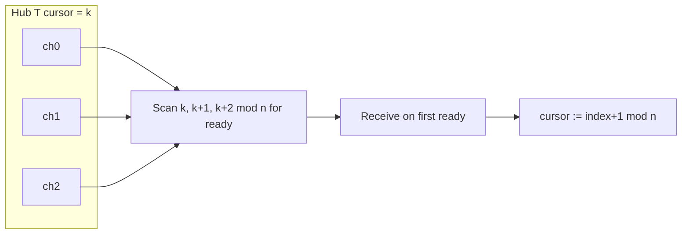

<!-- migrated from the legacy platform spec; canonical OpenSpec source -->
# Channels and synchronization Specification

## Purpose

Runtime channel queues, Hub multiplexing, happens-before, and sync primitives.

## Requirements

### Requirement: Hub WaitReceive uses round-robin fairness: Decision [D-EXEC-RT-0012]
The Beskid standard SHALL enforce the following migrated contract section. Accepted ADR decisions are binding; uppercase requirement keywords retain their BCP-14 meaning.

> | Rule | Detail |
> | --- | --- |
> | Homogeneity | `` `Hub<T>` `` — **homogeneous `T` only** in v1 |
> | Scan | Cursor starts at `k`; scan `k, k+1, …` modulo registration count for **first ready** channel |
> | After success | Cursor advances past chosen index (wrap) |
> | v1 scope | **WaitSend** out of scope; no language `select` |
> | Empty hub | **WaitReceive** with zero registrations → `HubError::Empty` |
> 
> Matches [D-CORE-CONC-0003](/platform-spec/core-library/concurrency/concurrency-package/adr/0003-hub-round-robin-fairness/).

**Stable ID:** `BSP-REQ-5650D8824733`  
**Legacy source:** `site/spec-content/platform-spec/execution/runtime/channels-and-synchronization/adr/0012-hub-round-robin-fairness/content.md`  
**Source SHA-256:** `4d58c59beb16471347bb43144bbf8e934459ffb34075185b2466d0c32532d2e6`

#### Scenario: Conformance exercises Decision
- **GIVEN** an implementation claims conformance with this capability
- **WHEN** behavior governed by this contract section is exercised
- **THEN** every MUST, SHALL, REQUIRED, prohibition, and accepted decision in the section is satisfied

### Requirement: Channel builtins return Result not panic: Decision [D-EXEC-RT-0013]
The Beskid standard SHALL enforce the following migrated contract section. Accepted ADR decisions are binding; uppercase requirement keywords retain their BCP-14 meaning.

> | Operation | Runtime behavior |
> | --- | --- |
> | **Send** after **Close** | `Closed` in **Result** |
> | **Receive** on closed empty | `Closed` |
> | **TrySend** / **TryReceive** | `Option` for full/empty |
> | **Cancel** | Parked ops wake with `Cancelled` after child `OnCancelled` |
> | **Join** on cancelled child | `FiberError::Cancelled` |
> | Panic | **Forbidden** for ordinary channel/hub/mutex errors |
> 
> Aligns with [D-CORE-CONC-0005](/platform-spec/core-library/concurrency/concurrency-package/adr/0005-result-not-panic-errors/).

**Stable ID:** `BSP-REQ-400BB7ED7867`  
**Legacy source:** `site/spec-content/platform-spec/execution/runtime/channels-and-synchronization/adr/0013-result-at-builtin-boundary/content.md`  
**Source SHA-256:** `aecf30d95ae3fdc031a5cc698a8338f2571c5ba56a917f91f026aff82f67b6a4`

#### Scenario: Conformance exercises Decision
- **GIVEN** an implementation claims conformance with this capability
- **WHEN** behavior governed by this contract section is exercised
- **THEN** every MUST, SHALL, REQUIRED, prohibition, and accepted decision in the section is satisfied

### Requirement: Channels are the only cross-fiber data path: Decision [D-EXEC-RT-0016]
The Beskid standard SHALL enforce the following migrated contract section. Accepted ADR decisions are binding; uppercase requirement keywords retain their BCP-14 meaning.

> | Rule | Detail |
> | --- | --- |
> | Mechanism | **Channels** are the **only** approved cross-fiber data transfer at runtime |
> | Happens-before | Successful **Send** *happens-before* **Receive** that observes the value |
> | Values | Copied or heap handles with GC tracing — **no** stack pointer transfer |
> | Builtins | `channel_*`, `mutex_*`, `wait_group_*` implement queues and coordination |
> | Compiler | **Must not** lower cross-fiber stack sharing |
> 
> Corelib policy: [D-CORE-CONC-0009](/platform-spec/core-library/concurrency/concurrency-package/adr/0009-channel-runtime-semantics/).

**Stable ID:** `BSP-REQ-E94494F1CBCB`  
**Legacy source:** `site/spec-content/platform-spec/execution/runtime/channels-and-synchronization/adr/0016-channel-only-cross-fiber-sharing/content.md`  
**Source SHA-256:** `a2d433753b62492583768f73af0e4f9e1ebee5871047acf98de117bf84d956f2`

#### Scenario: Conformance exercises Decision
- **GIVEN** an implementation claims conformance with this capability
- **WHEN** behavior governed by this contract section is exercised
- **THEN** every MUST, SHALL, REQUIRED, prohibition, and accepted decision in the section is satisfied

## Informative Source Provenance

The records below preserve migration history and are not normative except where text was extracted into a requirement above.

### Source Record: Channels and synchronization

**Authority:** informative provenance  
**Legacy path:** `/platform-spec/execution/runtime/channels-and-synchronization/`  
**Source:** `site/spec-content/platform-spec/execution/runtime/channels-and-synchronization/content.md`  
**SHA-256:** `35604ce76e75d3b2cd6c4fb5627ccc5b3f120671092a1695190025692afeb033`

<details>
<summary>Migrated source text</summary>

``````markdown
<SpecSection title="What this feature specifies" id="what-this-feature-specifies">
Runtime **channel** queues (**Send**, **Receive**, **TrySend**, **TryReceive**, **Close**), homogeneous `Hub<T>` multiplexing with round-robin **WaitReceive**, and **Mutex** / **WaitGroup** coordination. Cross-fiber data transfer is **channel-only**; successful **Send** *happens-before* observing **Receive**. Cancellation unblocks parked ops with `Cancelled` in **Result** after `OnCancelled` on the child fiber.
</SpecSection>

<SpecSection title="Implementation anchors" id="implementation-anchors">
- Builtins: `channel_*`, `hub_*`, `mutex_*`, `wait_group_*` in `compiler/crates/beskid_runtime/`
- ABI registry: `compiler/crates/beskid_abi/src/symbols.rs`, `define_builtins!`
- Corelib mapping: **[Concurrency package](/platform-spec/core-library/concurrency/concurrency-package/)**
</SpecSection>

<SpecSection title="Contract statement" id="contract-statement">
**Channels** are the **only** approved mechanism for passing data between fibers. The runtime implements bounded/unbounded queues with **Send** and **Receive** (full method names in corelib). **Hub** multiplexes many channels without a language `select`. **Mutex** and **WaitGroup** builtins back corelib structs.

Errors use **Result** / **Option**—never panic for closed, full, or cancelled operations.
</SpecSection>

<SpecSection title="Happens-before" id="happens-before">
A successful **Send** on `Channel<T>` *happens-before* a **Receive** that observes the value (Go/Java memory model style). Compiler **must not** allow passing stack pointers through **Channel**; values are copied or heap handles with GC tracing.

Phase B parallel mutators rely on these edges plus **gc_write_barrier** on pointer stores.
</SpecSection>

<SpecSection title="Hub" id="hub">
``Hub<T>`` maintains registered ``(index, channel: Channel<T>)`` pairs — **homogeneous ``T`` only in v1**. **WaitReceive** blocks until at least one member has a message available, then completes a **Receive** on that member.

**Fairness (normative):** **round-robin** — per-hub cursor starts at 0, scans registered indices in ascending order wrapping modulo registration set, chooses the **first ready** channel in that rotation. After success, cursor advances past the chosen index. Prevents starvation when a high-traffic channel is registered before a low-traffic one.



**WaitSend** is **out of scope for v1**. No language `select` in v1.

Full decision log: **[Concurrency package / decisions record](/platform-spec/core-library/concurrency/concurrency-package/decisions-record/)**.
</SpecSection>

<SpecSection title="Runtime builtins" id="runtime-builtins">
- `channel_create`, `channel_send`, `channel_receive`, `channel_try_send`, `channel_try_receive`, `channel_close`
- `hub_create`, `hub_register`, `hub_wait_receive`, …
- `mutex_lock`, `mutex_unlock`, `wait_group_add`, `wait_group_done`, `wait_group_wait`

## Cancellation

**Fiber.Cancel** sets cancellation flag, dispatches `OnCancelled` on the child fiber (language **event** on `Fiber<T>`), then unblocks parked **Receive**/**Send**/**Wait** with `Cancelled` in **Result**. **Join** on the child returns `FiberError::Cancelled`.
</SpecSection>

<SpecSection title="Blocking IO" id="blocking-io">
Syscall and console blocking **must** integrate with channel parking: producers **Send** bytes/events; consumers **Receive** on fibers. Raw syscall blocking on a fiber **must** park that fiber and offload blocking to the OS thread pool.
</SpecSection>

## Decisions
<!-- spec:generate:adr-index -->
No open decisions. Closed choices are normative ADRs under **`adr/`** (`D-EXEC-RT-0012` … `D-EXEC-RT-0016`); use the reader **ADRs** tab for expandable detail.
<!-- /spec:generate:adr-index -->
## Articles
<!-- spec:generate:article-index -->
- [Channels and synchronization - Contracts and edge cases](./articles/contracts-and-edge-cases/)
<!-- /spec:generate:article-index -->
``````

</details>

### Source Record: Hub WaitReceive uses round-robin fairness

**Authority:** informative provenance  
**Legacy path:** `/platform-spec/execution/runtime/channels-and-synchronization/adr/0012-hub-round-robin-fairness/`  
**Source:** `site/spec-content/platform-spec/execution/runtime/channels-and-synchronization/adr/0012-hub-round-robin-fairness/content.md`  
**SHA-256:** `4d58c59beb16471347bb43144bbf8e934459ffb34075185b2466d0c32532d2e6`

<details>
<summary>Migrated source text</summary>

``````markdown
## Context

Multiplexing without language `select` needs deterministic fairness when one registered channel is always ready.

## Decision

| Rule | Detail |
| --- | --- |
| Homogeneity | `` `Hub<T>` `` — **homogeneous `T` only** in v1 |
| Scan | Cursor starts at `k`; scan `k, k+1, …` modulo registration count for **first ready** channel |
| After success | Cursor advances past chosen index (wrap) |
| v1 scope | **WaitSend** out of scope; no language `select` |
| Empty hub | **WaitReceive** with zero registrations → `HubError::Empty` |

Matches [D-CORE-CONC-0003](/platform-spec/core-library/concurrency/concurrency-package/adr/0003-hub-round-robin-fairness/).

## Consequences

Runtime `hub_wait_receive_*` implements rotation; corelib documents registration limits for hot paths.

## Verification anchors

Hub builtins; corelib hub tests.
``````

</details>

### Source Record: Channel builtins return Result not panic

**Authority:** informative provenance  
**Legacy path:** `/platform-spec/execution/runtime/channels-and-synchronization/adr/0013-result-at-builtin-boundary/`  
**Source:** `site/spec-content/platform-spec/execution/runtime/channels-and-synchronization/adr/0013-result-at-builtin-boundary/content.md`  
**SHA-256:** `aecf30d95ae3fdc031a5cc698a8338f2571c5ba56a917f91f026aff82f67b6a4`

<details>
<summary>Migrated source text</summary>

``````markdown
## Context

Panicking on backpressure or closed channels makes cooperative code fragile and inconsistent with corelib `Result` types.

## Decision

| Operation | Runtime behavior |
| --- | --- |
| **Send** after **Close** | `Closed` in **Result** |
| **Receive** on closed empty | `Closed` |
| **TrySend** / **TryReceive** | `Option` for full/empty |
| **Cancel** | Parked ops wake with `Cancelled` after child `OnCancelled` |
| **Join** on cancelled child | `FiberError::Cancelled` |
| Panic | **Forbidden** for ordinary channel/hub/mutex errors |

Aligns with [D-CORE-CONC-0005](/platform-spec/core-library/concurrency/concurrency-package/adr/0005-result-not-panic-errors/).

## Consequences

Builtin implementations and corelib wrappers **must** share error enums. Duplicate **Close** is idempotent-safe.

## Verification anchors

[Contracts and edge cases](../contracts-and-edge-cases/); concurrency runtime tests.
``````

</details>

### Source Record: Channels are the only cross-fiber data path

**Authority:** informative provenance  
**Legacy path:** `/platform-spec/execution/runtime/channels-and-synchronization/adr/0016-channel-only-cross-fiber-sharing/`  
**Source:** `site/spec-content/platform-spec/execution/runtime/channels-and-synchronization/adr/0016-channel-only-cross-fiber-sharing/content.md`  
**SHA-256:** `a2d433753b62492583768f73af0e4f9e1ebee5871047acf98de117bf84d956f2`

<details>
<summary>Migrated source text</summary>

``````markdown
## Context

Shared mutable stacks across fibers would break GC stack maps and the memory model. The runtime must align with language channel-only rules.

## Decision

| Rule | Detail |
| --- | --- |
| Mechanism | **Channels** are the **only** approved cross-fiber data transfer at runtime |
| Happens-before | Successful **Send** *happens-before* **Receive** that observes the value |
| Values | Copied or heap handles with GC tracing — **no** stack pointer transfer |
| Builtins | `channel_*`, `mutex_*`, `wait_group_*` implement queues and coordination |
| Compiler | **Must not** lower cross-fiber stack sharing |

Corelib policy: [D-CORE-CONC-0009](/platform-spec/core-library/concurrency/concurrency-package/adr/0009-channel-runtime-semantics/).

## Consequences

New sync primitives require spec + ABI + corelib trifecta before export.

## Verification anchors

`beskid_runtime` channel tests; git `12ee673`.
``````

</details>

### Source Record: Channels and synchronization - Contracts and edge cases

**Authority:** informative provenance  
**Legacy path:** `/platform-spec/execution/runtime/channels-and-synchronization/articles/contracts-and-edge-cases/`  
**Source:** `site/spec-content/platform-spec/execution/runtime/channels-and-synchronization/articles/contracts-and-edge-cases/content.md`  
**SHA-256:** `26629ab959186a2791625df7eee5a55c14aa96f81584c23ec7b46339a2ff6366`

<details>
<summary>Migrated source text</summary>

``````markdown
Runtime **must** mirror corelib **Result** semantics at the builtin boundary (no panic for closed/cancelled channel ops).

Duplicate **Close** is safe. **Receive** on closed empty queue returns **Closed**. **Send** after **Close** returns **Closed**.

**Hub.WaitReceive** with zero registrations returns **`HubError::Empty`**. **Hub** uses **round-robin** readiness scan (normative).

Multiple fibers may **Receive** on the same channel; each message goes to one receiver (FIFO).

Cancellation wakes parked fibers with **Cancelled** after **OnCancelled** on the child fiber.

## Pointer-payload channels (Phase B)

The runtime exposes pointer-payload channel ops at the ABI: `channel_send_ptr`,
`channel_try_send_ptr`, `channel_receive_ptr`, `channel_try_receive_ptr`. These ops
share the existing `ChannelId` table and the same FIFO semantics described above; only
the payload moves a GC-managed pointer instead of a raw `i64`.

Implementations **must**:

- Register the in-flight pointer as an **external GC handle** before pushing the
  handle id onto the internal queue, and drop the registration on both the receiver
  side and on any error path. The pointer is reachable to the GC for the full duration
  it sits in the queue.
- Apply the **Dijkstra insertion write barrier** (`gc_write_barrier`) on **both** the
  send and the receive sides. The barrier is correct regardless of whether the runtime
  is in Phase A or Phase B; in Phase A it is effectively a no-op.
- Return **Closed** when no active mutator is registered, rather than leaking the
  external handle.
- When called from an OS thread that is **not** a Beskid fiber (a Phase B mutator
  registered via `attach_phase_b_mutator`), back-pressure on a bounded queue **must
  not** call into the fiber scheduler. The runtime instead falls back to
  `try_send` / `try_receive` polling with `std::thread::yield_now`.
``````

</details>
