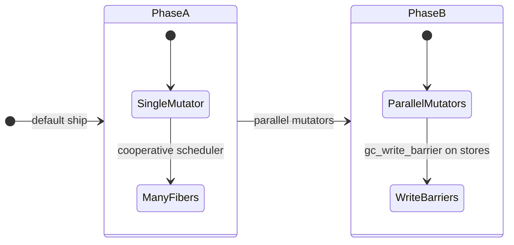
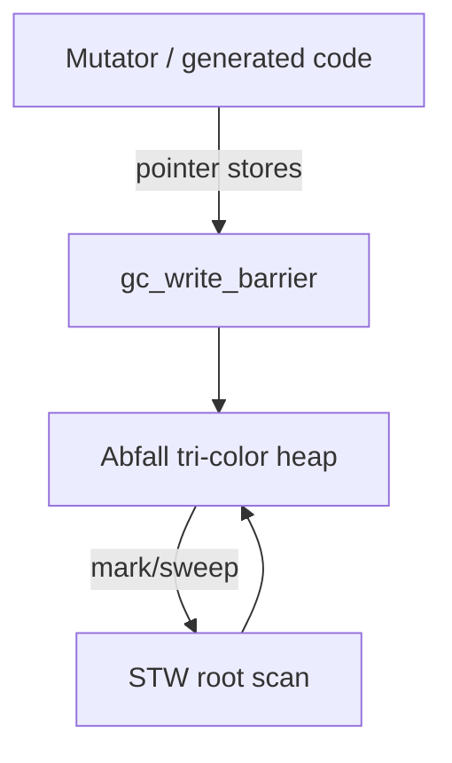

<!-- migrated from the legacy platform spec; canonical OpenSpec source -->
# Memory and GC runtime contract Specification

## Purpose

Allocation, object lifetime, and garbage-collection responsibilities shared across compiler and runtime.

## Requirements

### Requirement: Ship Phase A GC before parallel mutators: Decision [D-EXEC-RT-0005]
The Beskid standard SHALL enforce the following migrated contract section. Accepted ADR decisions are binding; uppercase requirement keywords retain their BCP-14 meaning.

> | Phase | Mutators | Ship order |
> | --- | --- | --- |
> | **A (v0.2)** | One Beskid mutator; many cooperative fibers | **Default ship** |
> | **B (v0.3, opt-in)** | Parallel mutators + real `gc_write_barrier` on pointer-payload channels + syscall-pool guard | Wired behind `BESKID_RUNTIME_PHASE_B` / `set_runtime_phase(RuntimePhase::PhaseB)`; stays opt-in until preemption emission and concurrent-mark stress land |
> | **B (later)** | Phase B becomes the default | Requires AOT/JIT to insert `runtime_preempt_check` prologues and full concurrent-mark stress coverage |
> 
> Phase B **must not** become the default without updating this feature hub and fiber
> scheduler contracts.

**Stable ID:** `BSP-REQ-46C4422DC096`  
**Legacy source:** `site/spec-content/platform-spec/execution/runtime/memory-and-gc-runtime-contract/adr/0005-phase-a-before-phase-b/content.md`  
**Source SHA-256:** `e1c463259520657e4c81b6420e3a90e87afaea20ee7f12314a79dec3275d8563`

#### Scenario: Conformance exercises Decision
- **GIVEN** an implementation claims conformance with this capability
- **WHEN** behavior governed by this contract section is exercised
- **THEN** every MUST, SHALL, REQUIRED, prohibition, and accepted decision in the section is satisfied

### Requirement: Abfall tri-color heap with write barriers: Decision [D-EXEC-RT-0006]
The Beskid standard SHALL enforce the following migrated contract section. Accepted ADR decisions are binding; uppercase requirement keywords retain their BCP-14 meaning.

> | Component | Role |
> | --- | --- |
> | **Abfall** | Tri-color mark/sweep heap integrated in `beskid_runtime::gc` |
> | **Barriers** | `gc_write_barrier` on pointer stores during marking |
> | **STW** | Limited stop-the-world for root scan and phase transitions |
> | **Snapshots** | `GcSnapshot` / `enter_runtime_scope` for host tooling |
> 
> Git anchor: `6ecd493` (vendored Abfall + Beskid heap integration).

**Stable ID:** `BSP-REQ-76C777704644`  
**Legacy source:** `site/spec-content/platform-spec/execution/runtime/memory-and-gc-runtime-contract/adr/0006-abfall-tri-color-heap/content.md`  
**Source SHA-256:** `d83d75b49f675ad50cb41d55685814a5a6b26bd1e5836b528545937ba764d731`

#### Scenario: Conformance exercises Decision
- **GIVEN** an implementation claims conformance with this capability
- **WHEN** behavior governed by this contract section is exercised
- **THEN** every MUST, SHALL, REQUIRED, prohibition, and accepted decision in the section is satisfied

### Requirement: Heap objects carry type descriptors for scanning: Decision [D-EXEC-RT-0007]
The Beskid standard SHALL enforce the following migrated contract section. Accepted ADR decisions are binding; uppercase requirement keywords retain their BCP-14 meaning.

> | Rule | Detail |
> | --- | --- |
> | Header | Heap objects begin with a **type descriptor pointer** for precise scan |
> | Allocation | `alloc(size, type_desc)` uses `abfall::Heap::allocate_beskid` |
> | Strings / arrays | `BeskidStr`, `BeskidArray` headers per [builtins layout](/platform-spec/execution/abi-and-host/builtins-and-symbols/) |
> | Roots | Stacks (stack maps), globals (registered roots), `gc_root_handle` externals |
> | Compiler | Lowers descriptors and stack maps; does not embed collector policy |

**Stable ID:** `BSP-REQ-8EDA62A2D0E0`  
**Legacy source:** `site/spec-content/platform-spec/execution/runtime/memory-and-gc-runtime-contract/adr/0007-heap-type-descriptors/content.md`  
**Source SHA-256:** `d048da0588f5491093ffb15b350cced510c8f6e9a617aa315d22936e6e97da9d`

#### Scenario: Conformance exercises Decision
- **GIVEN** an implementation claims conformance with this capability
- **WHEN** behavior governed by this contract section is exercised
- **THEN** every MUST, SHALL, REQUIRED, prohibition, and accepted decision in the section is satisfied

## Informative Source Provenance

The records below preserve migration history and are not normative except where text was extracted into a requirement above.

### Source Record: Memory and GC runtime contract

**Authority:** informative provenance  
**Legacy path:** `/platform-spec/execution/runtime/memory-and-gc-runtime-contract/`  
**Source:** `site/spec-content/platform-spec/execution/runtime/memory-and-gc-runtime-contract/content.md`  
**SHA-256:** `de1d5708a259e1d94a8e0d19131a78f930be503392a7e97da98cb0aea789b2cd`

<details>
<summary>Migrated source text</summary>

``````markdown
<SpecSection title="What this feature specifies" id="what-this-feature-specifies">
`Memory and GC runtime contract` defines one operational contract that a newcomer can follow end-to-end: first the model, then execution flow, then strict guarantees, concrete examples, and verification guidance.
</SpecSection>

<SpecSection title="GC phases" id="gc-phases">



Phase A: many fibers, **one GC mutator** thread. Phase B: parallel mutators with insertion barriers; see [design model](./design-model/) for builtin tables.

</SpecSection>

<SpecSection title="Implementation anchors" id="implementation-anchors">
- Runtime memory exports in `compiler/crates/beskid_runtime/src/lib.rs`
- ABI contracts in `compiler/crates/beskid_abi/src/lib.rs`
- JIT linking and call setup in `compiler/crates/beskid_engine/src/jit_module.rs`
- Runtime integration tests in `compiler/crates/beskid_tests/src/runtime/jit.rs`
</SpecSection>

## Decisions
<!-- spec:generate:adr-index -->
No open decisions. Closed choices are normative ADRs under **`adr/`** (`D-EXEC-RT-0005` … `D-EXEC-RT-0007`); use the reader **ADRs** tab for expandable detail.
<!-- /spec:generate:adr-index -->
## Articles
<!-- spec:generate:article-index -->
- [Contracts and edge cases](./articles/contracts-and-edge-cases/)
- [Design model](./articles/design-model/)
- [Examples](./articles/examples/)
- [FAQ and troubleshooting](./articles/faq-and-troubleshooting/)
- [Flow and algorithm](./articles/flow-and-algorithm/)
- [Verification and traceability](./articles/verification-and-traceability/)
<!-- /spec:generate:article-index -->
``````

</details>

### Source Record: Ship Phase A GC before parallel mutators

**Authority:** informative provenance  
**Legacy path:** `/platform-spec/execution/runtime/memory-and-gc-runtime-contract/adr/0005-phase-a-before-phase-b/`  
**Source:** `site/spec-content/platform-spec/execution/runtime/memory-and-gc-runtime-contract/adr/0005-phase-a-before-phase-b/content.md`  
**SHA-256:** `e1c463259520657e4c81b6420e3a90e87afaea20ee7f12314a79dec3275d8563`

<details>
<summary>Migrated source text</summary>

``````markdown
## Context

Parallel GC mutators need write barriers, stack-map coverage, and scheduler coordination. Shipping partial parallel GC risks data races on the Abfall heap.

## Decision

| Phase | Mutators | Ship order |
| --- | --- | --- |
| **A (v0.2)** | One Beskid mutator; many cooperative fibers | **Default ship** |
| **B (v0.3, opt-in)** | Parallel mutators + real `gc_write_barrier` on pointer-payload channels + syscall-pool guard | Wired behind `BESKID_RUNTIME_PHASE_B` / `set_runtime_phase(RuntimePhase::PhaseB)`; stays opt-in until preemption emission and concurrent-mark stress land |
| **B (later)** | Phase B becomes the default | Requires AOT/JIT to insert `runtime_preempt_check` prologues and full concurrent-mark stress coverage |

Phase B **must not** become the default without updating this feature hub and fiber
scheduler contracts.

## Consequences

Phase A barriers stay correct because Phase B reuses the same Dijkstra insertion
barrier; the difference is that Phase B exercises it on multi-mutator workloads and
on pointer-payload channel ops. Fiber/feature docs cross-link Phase tables.

## Verification anchors

GC integration tests under `crates/beskid_runtime/tests/`:

- `tests/concurrency.rs` — channel/scheduler core
- `tests/gc.rs`, `tests/gc_concurrency.rs` — Phase A heap and root handles
- `tests/phase_b_concurrency.rs` — Phase B multi-mutator stress, pointer-payload
  channels with write barriers, syscall-pool guard, optional preemption hook

Platform-spec Phase diagrams in hub and [design model](../design-model/).
``````

</details>

### Source Record: Abfall tri-color heap with write barriers

**Authority:** informative provenance  
**Legacy path:** `/platform-spec/execution/runtime/memory-and-gc-runtime-contract/adr/0006-abfall-tri-color-heap/`  
**Source:** `site/spec-content/platform-spec/execution/runtime/memory-and-gc-runtime-contract/adr/0006-abfall-tri-color-heap/content.md`  
**SHA-256:** `d83d75b49f675ad50cb41d55685814a5a6b26bd1e5836b528545937ba764d731`

<details>
<summary>Migrated source text</summary>

``````markdown
## Context

The prior arena model needed a collector that supports concurrent marking and precise scanning with compiler-emitted descriptors.

## Decision

| Component | Role |
| --- | --- |
| **Abfall** | Tri-color mark/sweep heap integrated in `beskid_runtime::gc` |
| **Barriers** | `gc_write_barrier` on pointer stores during marking |
| **STW** | Limited stop-the-world for root scan and phase transitions |
| **Snapshots** | `GcSnapshot` / `enter_runtime_scope` for host tooling |

Git anchor: `6ecd493` (vendored Abfall + Beskid heap integration).

## Consequences

Lowering **must** emit barriers where Phase requires them. Hosts attach runtime scope before JIT/AOT execution.

## Verification anchors

`compiler/crates/beskid_runtime/src/gc/`; JIT runtime tests.
``````

</details>

### Source Record: Heap objects carry type descriptors for scanning

**Authority:** informative provenance  
**Legacy path:** `/platform-spec/execution/runtime/memory-and-gc-runtime-contract/adr/0007-heap-type-descriptors/`  
**Source:** `site/spec-content/platform-spec/execution/runtime/memory-and-gc-runtime-contract/adr/0007-heap-type-descriptors/content.md`  
**SHA-256:** `d048da0588f5491093ffb15b350cced510c8f6e9a617aa315d22936e6e97da9d`

<details>
<summary>Migrated source text</summary>

``````markdown
## Context

Conservative stack scanning alone is insufficient for precise Beskid object graphs across fibers and codegen optimizations.

## Decision

| Rule | Detail |
| --- | --- |
| Header | Heap objects begin with a **type descriptor pointer** for precise scan |
| Allocation | `alloc(size, type_desc)` uses `abfall::Heap::allocate_beskid` |
| Strings / arrays | `BeskidStr`, `BeskidArray` headers per [builtins layout](/platform-spec/execution/abi-and-host/builtins-and-symbols/) |
| Roots | Stacks (stack maps), globals (registered roots), `gc_root_handle` externals |
| Compiler | Lowers descriptors and stack maps; does not embed collector policy |

## Consequences

Descriptor schema changes are ABI-visible per **D-EXEC-ABI-0002**.

## Verification anchors

`beskid_codegen` stack maps; `beskid_runtime` alloc/GC tests.
``````

</details>

### Source Record: Contracts and edge cases

**Authority:** informative provenance  
**Legacy path:** `/platform-spec/execution/runtime/memory-and-gc-runtime-contract/articles/contracts-and-edge-cases/`  
**Source:** `site/spec-content/platform-spec/execution/runtime/memory-and-gc-runtime-contract/articles/contracts-and-edge-cases/content.md`  
**SHA-256:** `14bd7cdac6cb4667ff64be72f859581acb83e659858b39b66d3b04cc7ecffa14`

<details>
<summary>Migrated source text</summary>

``````markdown
## Normative requirements

| ID | Requirement |
| --- | --- |
| **GC-001** | All heap objects **must** carry type descriptors reachable from the object header for precise scanning. |
| **GC-002** | Pointer stores in generated code **must** lower to `gc_write_barrier` when concurrent marking is enabled. |
| **GC-003** | Phase A **must** execute at most one Beskid mutator performing allocations at a time. |
| **GC-004** | `gc_collect` / `gc_collect_if_needed` **must** be safe to call from host tooling when runtime scope is entered. |
| **GC-005** | External roots **must** pair `gc_register_root` with `gc_unregister_root` (or handle APIs) to avoid leaks. |
| **GC-006** | Stack maps **must** be emitted for functions that hold GC pointers across safepoints. |
| **GC-007** | Phase B mutators **must** attach to a shared heap through `attach_phase_b_mutator` (or an equivalent runtime scope) before allocating or reading GC-managed pointers. |
| **GC-008** | Syscall-pool worker threads **must not** allocate on the Beskid heap; the runtime **must** trap the violation when assertions are enabled. |
| **GC-009** | Pointer-payload channel transfers **must** apply the insertion write barrier on both send and receive paths, and **must** keep the in-flight pointer reachable via an external GC handle while it sits in the queue. |
| **GC-010** | Optional preemption (`runtime_preempt_check`) **must** be a no-op when preemption is disabled and **must** never block a syscall-pool worker thread. |

## GC export contracts

| Symbol | Returns | Semantics |
| --- | --- | --- |
| `gc_bytes_allocated` | `i64` | Total allocated bytes (diagnostic) |
| `gc_object_count` | `i64` | Live object estimate |
| `gc_phase` | `i64` | Phase enum 0/1/2 |
| `gc_write_barrier` | void | Barrier hook |
| `gc_root_handle` | `i64` | Temporary external pin |
| `channel_send_ptr` / `channel_receive_ptr` | `i64` status | Pointer-payload channel ops with barrier and external-handle handoff |
| `runtime_preempt_check` | void | Optional safe-point hook; yields when preemption is enabled |

## Edge cases

| Case | Behavior |
| --- | --- |
| Null pointer store | Lowering should avoid barrier; runtime barrier on null **should** no-op |
| Fiber migration mid-mark | Scheduler holds mutator lock; no second mutator attaches (Phase A only) |
| Multiple Phase B mutators on one heap | Each thread holds a `MutatorAttachGuard`; shared heap + per-thread GC context |
| Full heap during `str_concat` | Panic/trap — matches allocation failure policy |
| Conservative fallback | **Forbidden** — Beskid uses precise descriptors only |
| Syscall-pool worker accidentally allocates | `assert_mutator_allowed` panics; the worker is **not** a mutator |
| Pointer-payload channel sender from a non-fiber OS thread | Backpressure resolved by `try_send` + `thread::yield_now`, never `park_current` |

## Rejected alternatives (decision record)

Reference counting, conservative GC, and region-only allocation are **rejected** for v0.2; see legacy [Concurrent GC](../../../../execution/memory/gc.md) decision summary.

## Implementation anchors
- `compiler/crates/beskid_runtime/src/gc.rs` — write barriers, heap allocation, and mutator guard
- `compiler/crates/abfall/src/` — precise type descriptors and tri-color invariants
- `compiler/crates/beskid_abi/src/builtins.rs` — `gc_write_barrier`, `gc_collect` builtin specs

## Related topics

- [Memory model (language)](/platform-spec/language-meta/memory-model/)
- [Builtins and symbols](/platform-spec/execution/abi-and-host/builtins-and-symbols/)
``````

</details>

### Source Record: Design model

**Authority:** informative provenance  
**Legacy path:** `/platform-spec/execution/runtime/memory-and-gc-runtime-contract/articles/design-model/`  
**Source:** `site/spec-content/platform-spec/execution/runtime/memory-and-gc-runtime-contract/articles/design-model/content.md`  
**SHA-256:** `8687a1fc3b935e8ce194042fbba1798237f48a411da3fcefd5f7d883e5884ecc`

<details>
<summary>Migrated source text</summary>

``````markdown
## Purpose

Normative model for **how Beskid heap objects live**, how the **Abfall** tri-color collector interacts with generated code, and how **Phase A** scheduling constrains mutators before parallel GC (Phase B).

## Primary actors

| Actor | Responsibility |
| --- | --- |
| **Compiler lowering** | Emits `alloc`, write barriers, stack maps, type descriptors |
| **`beskid_runtime::gc`** | `enter_runtime_scope`, heap attachment, `GcSnapshot` for hosts |
| **Abfall heap** | Concurrent mark/sweep with STW segments |
| **Fiber scheduler** | Ensures only one mutator runs Beskid allocations in Phase A |

## Object model

- Heap objects begin with a **type descriptor pointer** used for precise scanning.
- **`alloc(size, type_desc)`** creates descriptor-backed payloads via `abfall::Heap::allocate_beskid`.
- **Strings** use `BeskidStr`; **arrays** use `BeskidArray` headers (backing optional per feature flag).
- **Roots**: stacks (stack maps), globals (registered roots), external handles (`gc_root_handle`).

## GC architecture



**Tri-color** marking runs concurrently with the mutator where Phase allows; **write barriers** prevent black→white edges during marking. **STW** episodes are limited to root scanning and phase transitions.

## Phase A vs Phase B

| Phase | Mutators | Notes |
| --- | --- | --- |
| **A (current)** | One Beskid mutator at a time | Fibers swap on scheduler threads; syscall pool workers **must not** allocate as mutators |
| **B (target)** | Parallel mutators with barriers | Requires full stack-map coverage and scheduler coordination |

See [Fiber scheduler and stacks](/platform-spec/execution/runtime/fiber-scheduler-and-stacks/) for parking and safepoints.

## Implementation anchors
- `compiler/crates/beskid_runtime/src/gc.rs` — GC arena, write barriers, and collection cycle
- `compiler/crates/beskid_runtime/src/runtime/` — `GcSnapshot`, mutator attachment, and arena access
- `compiler/crates/abfall/src/` — tri-color marking and heap implementation

## Related topics

- [Flow and algorithm](./flow-and-algorithm/)
- Legacy: [Concurrent GC](../../../../execution/memory/gc.md)
``````

</details>

### Source Record: Examples

**Authority:** informative provenance  
**Legacy path:** `/platform-spec/execution/runtime/memory-and-gc-runtime-contract/articles/examples/`  
**Source:** `site/spec-content/platform-spec/execution/runtime/memory-and-gc-runtime-contract/articles/examples/content.md`  
**SHA-256:** `3cf007e123a339bb81ddc1528ca4d89448c8c23b71c33ae420955e86a62a889a`

<details>
<summary>Migrated source text</summary>

``````markdown
## Prose: steady-state server loop

A long-running service allocates short-lived request objects each iteration. Between iterations it calls `gc_collect_if_needed` from a host driver. Pacing prevents unbounded heap growth while keeping STW pauses short enough for cooperative fibers to meet latency goals.

## Prose: fiber-heavy workload (Phase A)

Ten thousand `Fiber<T>` workers share one mutator. When a fiber blocks on `channel_receive`, the scheduler parks it and runs another fiber on the same mutator thread. GC can mark concurrently in the Abfall background thread, but no second fiber performs `alloc` on a different OS thread without violating **GC-003**.

## Host snapshot (Rust)

```rust
let snap = beskid_runtime::runtime::snapshot_gc();
// Display bytes, object count, phase for diagnostics
```

Prefer this over reading `gc_phase` directly from generated tests in Rust harness code.

## External root for FFI buffer

1. Native code receives a Beskid `string` pointer.
2. Host calls `gc_register_root` before storing the pointer in a global struct.
3. After foreign use ends, `gc_unregister_root` releases the pin.

Skipping step 3 retains objects until explicit collection—often misreported as "memory leak" in bindings.

## Write barrier on field update

Lowering for `record.child = value` when `value` is a reference type:

1. Store pointer field.
2. `gc_write_barrier(parent_obj, child_ref)`.

Omitting step 2 under concurrent marking can collect live objects.

## Related topics

- [Verification and traceability](./verification-and-traceability/)
- [Runtime overview (legacy)](../../../../execution/runtime/runtime-overview.md)
``````

</details>

### Source Record: FAQ and troubleshooting

**Authority:** informative provenance  
**Legacy path:** `/platform-spec/execution/runtime/memory-and-gc-runtime-contract/articles/faq-and-troubleshooting/`  
**Source:** `site/spec-content/platform-spec/execution/runtime/memory-and-gc-runtime-contract/articles/faq-and-troubleshooting/content.md`  
**SHA-256:** `d659b113d6fe9ba86df2f0e55b21ff32f4e68e603a382b4a7b93067ccee4ac6f`

<details>
<summary>Migrated source text</summary>

``````markdown
## FAQ

### Is `gc_write_barrier` a no-op today?

Barriers **must** remain in the ABI. Phase A may simplify runtime work when marking is off, but lowering still emits calls so Phase B does not require compiler flag days.

### Can I call `gc_collect` from Beskid user code?

Only through intentional runtime/corelib surfaces; arbitrary user calls bypass pacing policy and may STW unexpectedly. Host tooling and tests are the primary callers.

### How does this relate to the language memory model?

Language rules define ownership and references; this feature defines **runtime enforcement** (allocation, tracing, barriers). See [/platform-spec/language-meta/memory-model/](/platform-spec/language-meta/memory-model/).

### When does Phase B land?

When stack maps, scheduler coordination, and conformance suites prove safe parallel mutators. Until then **GC-003** remains in force.

## Troubleshooting

| Symptom | Check |
| --- | --- |
| Random segfaults after field assign | Barrier missing in lowering for reference store |
| Heap never shrinks | Pacing not triggered; call `gc_collect` in test to validate sweep |
| Leak across FFI | Unmatched `gc_register_root` / `gc_unregister_root` |
| Fibers see stale objects | Violated single-mutator rule—audit scheduler attachment |

## Related topics

- [Fiber scheduler FAQ](/platform-spec/execution/runtime/fiber-scheduler-and-stacks/faq-and-troubleshooting/) (if present) or hub
- [Flow and algorithm](./flow-and-algorithm/)
``````

</details>

### Source Record: Flow and algorithm

**Authority:** informative provenance  
**Legacy path:** `/platform-spec/execution/runtime/memory-and-gc-runtime-contract/articles/flow-and-algorithm/`  
**Source:** `site/spec-content/platform-spec/execution/runtime/memory-and-gc-runtime-contract/articles/flow-and-algorithm/content.md`  
**SHA-256:** `1bae1fe7486f22bc6545ad8572b38ecc1d04dcb4448837210e3878bcef6d06c9`

<details>
<summary>Migrated source text</summary>

``````markdown
## Purpose

Algorithms for allocation, collection, and barrier execution. Architecture diagram: [design model](./design-model/).

## Allocation path

1. Lowering emits `alloc(size, type_descriptor_ptr)` at object creation sites.
2. Runtime enters current heap scope (`enter_runtime_scope` / TLS hooks).
3. `alloc` delegates to Abfall `allocate_beskid` with descriptor metadata for scanning.
4. On failure, runtime traps (panic) — no silent null returns for required objects.

## Write barrier path

1. After each pointer store in generated code, lowering emits `gc_write_barrier(parent, child)`.
2. Barrier grays or marks `child` so concurrent marking retains reachability.
3. Phase A may elide heavy barrier work when collector is idle, but the call site remains for ABI stability.

## Collection pacing

1. Mutator allocation increases `gc_bytes_allocated`.
2. `gc_collect_if_needed` compares growth against pacing policy (heap vs CPU tradeoff).
3. When triggered, phases transition: idle → mark (STW root scan, concurrent mark) → mark termination STW → sweep.
4. `gc_phase` export reports `0=Idle`, `1=Marking`, `2=Sweeping` for tests and tooling.

## Safepoints

1. Implicit safepoints at calls and loop backedges (compiler-inserted).
2. Stack maps at safepoints let STW scan precise roots.
3. Fiber stack switching **must** register alternate stacks for enumeration ([fiber scheduler](/platform-spec/execution/runtime/fiber-scheduler-and-stacks/)).

## Host inspection

Rust hosts call `beskid_runtime::runtime::GcSnapshot` instead of parsing raw `gc_*` exports when displaying heap stats or forcing `collect`.

## Implementation anchors
- `compiler/crates/beskid_runtime/src/runtime/` — `alloc` entry and `GcSnapshot` inspection
- `compiler/crates/beskid_abi/src/builtins.rs` — `gc_write_barrier` spec signature
- `compiler/crates/abfall/src/` — tri-color write barrier and STW transition

## Related topics

- [Contracts and edge cases](./contracts-and-edge-cases/)
- [Write barriers (legacy)](../../../../execution/memory/write-barriers.md)
``````

</details>

### Source Record: Verification and traceability

**Authority:** informative provenance  
**Legacy path:** `/platform-spec/execution/runtime/memory-and-gc-runtime-contract/articles/verification-and-traceability/`  
**Source:** `site/spec-content/platform-spec/execution/runtime/memory-and-gc-runtime-contract/articles/verification-and-traceability/content.md`  
**SHA-256:** `b97683ef52fa5f988c64800a4e058de391b0279f2ae6db5e524762d282eebabc`

<details>
<summary>Migrated source text</summary>

``````markdown
## Implementation anchors

| Path | Role |
| --- | --- |
| `compiler/crates/beskid_runtime/src/gc.rs` | Scope, heap TLS, collection drivers |
| `compiler/crates/beskid_runtime/src/builtins/gc.rs` | Exported `gc_*` builtins |
| `compiler/crates/beskid_runtime/src/builtins/alloc.rs` | `alloc` entry |
| `compiler/crates/abfall/` | Tri-color heap implementation |
| `compiler/crates/beskid_codegen` | Stack maps, barrier insertion, descriptors |
| `compiler/crates/beskid_tests/src/runtime/jit.rs` | JIT + GC integration |

## Tests and benches

| Target | Coverage |
| --- | --- |
| `beskid_tests` runtime JIT | Alloc + collect under execution |
| `beskid_runtime` `runtime_micro` bench | Hot path regression guard |
| Future conformance | Stack map completeness per function (Phase B gate) |

## Requirement traceability

| ID | Evidence |
| --- | --- |
| **GC-001** | Descriptor emission tests in codegen artifacts |
| **GC-002** | CLIF inspection / lowering unit tests for barrier calls |
| **GC-003** | Fiber scheduler tests + code review of `enter_runtime_scope` |
| **GC-004** | Host `GcSnapshot` / `force_collect` tests |

## Related topics

- [Contracts and edge cases](./contracts-and-edge-cases/)
- [Codegen and IR](/platform-spec/compiler/codegen-and-ir/)
``````

</details>
