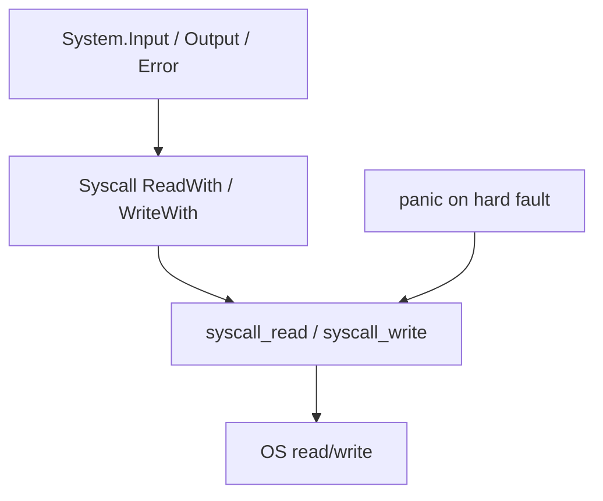

<!-- migrated from the legacy platform spec; canonical OpenSpec source -->
# Panic, IO, and syscalls Specification

## Purpose

Runtime panic behavior and syscall read/write contracts exposed by the Beskid runtime.

## Requirements

### Requirement: Runtime panic terminates the process: Decision [D-EXEC-RT-0008]
The Beskid standard SHALL enforce the following migrated contract section. Accepted ADR decisions are binding; uppercase requirement keywords retain their BCP-14 meaning.

> | Mechanism | Use |
> | --- | --- |
> | `Option` / `Result` | Expected failures (language-meta + corelib) |
> | `panic` / `panic_str` | Unrecoverable faults, hard IO faults in v1 streams, allocation failures |
> | Unwind | **No** Beskid stack unwinding across panics |
> | Outcome | Runtime panics **terminate** the process (trap / abort) |
> | Builtin kind | `AbiReturnKind::Never` in `BUILTIN_SPECS` |

**Stable ID:** `BSP-REQ-53203A00411B`  
**Legacy source:** `site/spec-content/platform-spec/execution/runtime/panic-io-and-syscalls/adr/0008-panic-terminates-process/content.md`  
**Source SHA-256:** `b96ed9a5740e3a4441248dae6d324a418d7c178d34a5e83444fed807f3e573f9`

#### Scenario: Conformance exercises Decision
- **GIVEN** an implementation claims conformance with this capability
- **WHEN** behavior governed by this contract section is exercised
- **THEN** every MUST, SHALL, REQUIRED, prohibition, and accepted decision in the section is satisfied

### Requirement: Syscalls centralized in runtime builtins: Decision [D-EXEC-RT-0009]
The Beskid standard SHALL enforce the following migrated contract section. Accepted ADR decisions are binding; uppercase requirement keywords retain their BCP-14 meaning.

> | Rule | Detail |
> | --- | --- |
> | Builtins | `syscall_read`, `syscall_write` accept fd + buffer (`BeskidStr` for write) |
> | Implementation | `beskid_runtime::builtins::panic_io` — **Linux x86_64** direct syscalls in reference tree |
> | Other targets | **May** use `std::io` for fds 1/2 while preserving signatures |
> | Front-end | **Must not** embed OS-specific syscall sequences in lowering |
> | Corelib | `System.Input` / `Output` / `Error` wrap builtins with descriptors |
> 
> Git anchor: `12ee673` (split System I/O surfaces).

**Stable ID:** `BSP-REQ-1C262600A6BC`  
**Legacy source:** `site/spec-content/platform-spec/execution/runtime/panic-io-and-syscalls/adr/0009-runtime-owned-syscalls/content.md`  
**Source SHA-256:** `7224240f1952d500b3bdbb7dcbe9e04276a07b28144276753b765711c38dc85b`

#### Scenario: Conformance exercises Decision
- **GIVEN** an implementation claims conformance with this capability
- **WHEN** behavior governed by this contract section is exercised
- **THEN** every MUST, SHALL, REQUIRED, prohibition, and accepted decision in the section is satisfied

### Requirement: Blocking syscalls park the calling fiber: Decision [D-EXEC-RT-0010]
The Beskid standard SHALL enforce the following migrated contract section. Accepted ADR decisions are binding; uppercase requirement keywords retain their BCP-14 meaning.

> | Rule | Detail |
> | --- | --- |
> | Blocking path | Enqueue host blocking work on syscall pool; **park** current fiber only |
> | Wake | Resume fiber on scheduler thread when worker completes |
> | Pool workers | **Must not** execute generated Beskid mutator code or allocate as mutators |
> | Pool worker tagging | Each pool thread calls `set_syscall_pool_worker()` so the runtime can assert this rule (`assert_mutator_allowed`) and panic on accidental allocation |
> | Allocation | Runtime object creation for results happens after resume on scheduler thread |
> | Console | Producers **Send** bytes/events; consumers **Receive** on fibers |

**Stable ID:** `BSP-REQ-B55EBE603409`  
**Legacy source:** `site/spec-content/platform-spec/execution/runtime/panic-io-and-syscalls/adr/0010-blocking-syscalls-park-fiber/content.md`  
**Source SHA-256:** `1c76e2b245ba3cf55dbb063698ce6ae85862020ed9622bbd0ddc551a1c7a99cc`

#### Scenario: Conformance exercises Decision
- **GIVEN** an implementation claims conformance with this capability
- **WHEN** behavior governed by this contract section is exercised
- **THEN** every MUST, SHALL, REQUIRED, prohibition, and accepted decision in the section is satisfied

### Requirement: Binary syscall builtins: Decision [D-EXEC-RT-0011]
The Beskid standard SHALL enforce the following migrated contract section. Accepted ADR decisions are binding; uppercase requirement keywords retain their BCP-14 meaning.

> Add `syscall_read_bytes` / `syscall_write_bytes` alongside existing string syscalls. Do not change existing `syscall_read` / `syscall_write` signatures.

**Stable ID:** `BSP-REQ-645BE54C535F`  
**Legacy source:** `site/spec-content/platform-spec/execution/runtime/panic-io-and-syscalls/adr/0011-binary-syscall-builtins/content.md`  
**Source SHA-256:** `7734063f5debd97e7ab299e37224679fcbbc967a0804eee0d68b3f8c76149911`

#### Scenario: Conformance exercises Decision
- **GIVEN** an implementation claims conformance with this capability
- **WHEN** behavior governed by this contract section is exercised
- **THEN** every MUST, SHALL, REQUIRED, prohibition, and accepted decision in the section is satisfied

## Informative Source Provenance

The records below preserve migration history and are not normative except where text was extracted into a requirement above.

### Source Record: Panic, IO, and syscalls

**Authority:** informative provenance  
**Legacy path:** `/platform-spec/execution/runtime/panic-io-and-syscalls/`  
**Source:** `site/spec-content/platform-spec/execution/runtime/panic-io-and-syscalls/content.md`  
**SHA-256:** `9d6408cb07271e9662fcce1faea93d4337939c32200c128a50fc20134fceab0e`

<details>
<summary>Migrated source text</summary>

``````markdown
<SpecSection title="What this feature specifies" id="what-this-feature-specifies">
`Panic, IO, and syscalls` defines one operational contract that a newcomer can follow end-to-end: first the model, then execution flow, then strict guarantees, concrete examples, and verification guidance.
</SpecSection>

<SpecSection title="Implementation anchors" id="implementation-anchors">
- Builtin exports in `compiler/crates/beskid_runtime/src/builtins/mod.rs`
- Panic and syscall implementation in `compiler/crates/beskid_runtime/src/builtins/panic_io.rs`
- Runtime symbol registration in `compiler/crates/beskid_runtime/src/lib.rs`
- E2E coverage in `compiler/crates/beskid_e2e_tests/src/tests/runtime_cases.rs`
</SpecSection>

## Decisions
<!-- spec:generate:adr-index -->
No open decisions. Closed choices are normative ADRs under **`adr/`** (`D-EXEC-RT-0008` … `D-EXEC-RT-0011`); use the reader **ADRs** tab for expandable detail.
<!-- /spec:generate:adr-index -->
## Articles
<!-- spec:generate:article-index -->
- [Contracts and edge cases](./articles/contracts-and-edge-cases/)
- [Design model](./articles/design-model/)
- [Examples](./articles/examples/)
- [FAQ and troubleshooting](./articles/faq-and-troubleshooting/)
- [Flow and algorithm](./articles/flow-and-algorithm/)
- [Verification and traceability](./articles/verification-and-traceability/)
<!-- /spec:generate:article-index -->
``````

</details>

### Source Record: Runtime panic terminates the process

**Authority:** informative provenance  
**Legacy path:** `/platform-spec/execution/runtime/panic-io-and-syscalls/adr/0008-panic-terminates-process/`  
**Source:** `site/spec-content/platform-spec/execution/runtime/panic-io-and-syscalls/adr/0008-panic-terminates-process/content.md`  
**SHA-256:** `b96ed9a5740e3a4441248dae6d324a418d7c178d34a5e83444fed807f3e573f9`

<details>
<summary>Migrated source text</summary>

``````markdown
## Context

Language `Option` covers expected errors. Unrecoverable faults and some IO failures need a distinct path that does not conflate with `Result` channel semantics.

## Decision

| Mechanism | Use |
| --- | --- |
| `Option` / `Result` | Expected failures (language-meta + corelib) |
| `panic` / `panic_str` | Unrecoverable faults, hard IO faults in v1 streams, allocation failures |
| Unwind | **No** Beskid stack unwinding across panics |
| Outcome | Runtime panics **terminate** the process (trap / abort) |
| Builtin kind | `AbiReturnKind::Never` in `BUILTIN_SPECS` |

## Consequences

Corelib **must not** catch panics for ordinary control flow. Fiber **Detach** panics still abort unless future domain recovery is specified.

## Verification anchors

`beskid_runtime::builtins::panic_io`; e2e runtime cases.
``````

</details>

### Source Record: Syscalls centralized in runtime builtins

**Authority:** informative provenance  
**Legacy path:** `/platform-spec/execution/runtime/panic-io-and-syscalls/adr/0009-runtime-owned-syscalls/`  
**Source:** `site/spec-content/platform-spec/execution/runtime/panic-io-and-syscalls/adr/0009-runtime-owned-syscalls/content.md`  
**SHA-256:** `7224240f1952d500b3bdbb7dcbe9e04276a07b28144276753b765711c38dc85b`

<details>
<summary>Migrated source text</summary>

``````markdown
## Context

Scattering platform syscall sequences through codegen duplicates policy and breaks GC mutator rules at IO sites.

## Decision

| Rule | Detail |
| --- | --- |
| Builtins | `syscall_read`, `syscall_write` accept fd + buffer (`BeskidStr` for write) |
| Implementation | `beskid_runtime::builtins::panic_io` — **Linux x86_64** direct syscalls in reference tree |
| Other targets | **May** use `std::io` for fds 1/2 while preserving signatures |
| Front-end | **Must not** embed OS-specific syscall sequences in lowering |
| Corelib | `System.Input` / `Output` / `Error` wrap builtins with descriptors |

Git anchor: `12ee673` (split System I/O surfaces).

## Consequences

New platforms document stub vs native behavior without renaming symbols.

## Verification anchors

`panic_io.rs`; console stream corelib tests.
``````

</details>

### Source Record: Blocking syscalls park the calling fiber

**Authority:** informative provenance  
**Legacy path:** `/platform-spec/execution/runtime/panic-io-and-syscalls/adr/0010-blocking-syscalls-park-fiber/`  
**Source:** `site/spec-content/platform-spec/execution/runtime/panic-io-and-syscalls/adr/0010-blocking-syscalls-park-fiber/content.md`  
**SHA-256:** `1c76e2b245ba3cf55dbb063698ce6ae85862020ed9622bbd0ddc551a1c7a99cc`

<details>
<summary>Migrated source text</summary>

``````markdown
## Context

Blocking `read`/`write` on a fiber must not freeze the entire M:N scheduler or violate Phase A mutator rules on pool threads.

## Decision

| Rule | Detail |
| --- | --- |
| Blocking path | Enqueue host blocking work on syscall pool; **park** current fiber only |
| Wake | Resume fiber on scheduler thread when worker completes |
| Pool workers | **Must not** execute generated Beskid mutator code or allocate as mutators |
| Pool worker tagging | Each pool thread calls `set_syscall_pool_worker()` so the runtime can assert this rule (`assert_mutator_allowed`) and panic on accidental allocation |
| Allocation | Runtime object creation for results happens after resume on scheduler thread |
| Console | Producers **Send** bytes/events; consumers **Receive** on fibers |

## Consequences

M6+ syscall integration is required for conformance on blocking builtins.

## Verification anchors

Scheduler `run_blocking`; fiber scheduler [verification](../verification-and-traceability/) article.
``````

</details>

### Source Record: Binary syscall builtins

**Authority:** informative provenance  
**Legacy path:** `/platform-spec/execution/runtime/panic-io-and-syscalls/adr/0011-binary-syscall-builtins/`  
**Source:** `site/spec-content/platform-spec/execution/runtime/panic-io-and-syscalls/adr/0011-binary-syscall-builtins/content.md`  
**SHA-256:** `7734063f5debd97e7ab299e37224679fcbbc967a0804eee0d68b3f8c76149911`

<details>
<summary>Migrated source text</summary>

``````markdown
## Decision

Add `syscall_read_bytes` / `syscall_write_bytes` alongside existing string syscalls. Do not change existing `syscall_read` / `syscall_write` signatures.

## Verification anchors

`compiler/crates/beskid_runtime/src/builtins/panic_io.rs`, `beskid_abi/src/builtins.rs`
``````

</details>

### Source Record: Contracts and edge cases

**Authority:** informative provenance  
**Legacy path:** `/platform-spec/execution/runtime/panic-io-and-syscalls/articles/contracts-and-edge-cases/`  
**Source:** `site/spec-content/platform-spec/execution/runtime/panic-io-and-syscalls/articles/contracts-and-edge-cases/content.md`  
**SHA-256:** `06622a1ec26868eda5b1b5fe940425db0d07e723c6bd8992995a6b8e3d781ef7`

<details>
<summary>Migrated source text</summary>

``````markdown
## Normative requirements

| ID | Requirement |
| --- | --- |
| **IO-ABI-001** | `panic` and `panic_str` **must** not return to callers; lowering **must** treat sites as unreachable after call. |
| **IO-ABI-002** | JIT and AOT **must** import the same `syscall_read` / `syscall_write` symbols from `beskid_abi`. |
| **IO-ABI-003** | Non-Linux targets **may** implement syscalls via host shims but **must** preserve signatures and error sentinels. |
| **IO-ABI-004** | `syscall_write` **must** accept fd as `i64` and string as `BeskidStr` pointer per `BUILTIN_SPECS`. |
| **IO-ABI-005** | Front-end/lowering **must not** emit raw OS syscall instructions for corelib IO. |
| **IO-ABI-006** | User docs **must not** document internal mangled panic entrypoints; stable names are `panic` / `panic_str`. |
| **IO-ABI-007** | `syscall_read_bytes(fd, max)` **must** return a new `u8[]` (`BeskidArray*`) with **no** UTF-8 validation. |
| **IO-ABI-008** | `syscall_write_bytes(fd, buf)` **must** accept fd as `i64` and `BeskidArray*`; returns bytes written or `-1`. |
| **IO-ABI-009** | String and binary syscall paths **must** share EOF (empty payload) and `-1` error sentinel semantics. |
| **IO-ABI-010** | New IO builtins **must** appear in `BUILTIN_SPECS` and `RUNTIME_EXPORT_SYMBOLS` for JIT/AOT parity. |

## Builtin contracts

| Builtin | Contract |
| --- | --- |
| `panic(msg_ptr, msg_len)` | Diverging; UTF-8 bytes at `msg_ptr` for `msg_len` |
| `panic_str(handle)` | Diverging; `BeskidStr` handle |
| `syscall_write(fd, str)` | Returns bytes written or `-1` |
| `syscall_read(fd, max)` | Returns new `BeskidStr` handle (UTF-8 validated via `str_new`) |
| `syscall_write_bytes(fd, buf)` | Returns bytes written or `-1` |
| `syscall_read_bytes(fd, max)` | Returns new `u8[]` handle; empty on EOF |
| `str_slice(str, start, count)` | Returns substring `BeskidStr` handle |
| `bytes_from_str(str)` | Returns `u8[]` copy of UTF-8 octets |
| `str_from_bytes_utf8(buf)` | Returns `BeskidStr` or diverges on invalid UTF-8 at runtime; corelib maps to `Result` |
| `bytes_copy(dst, dstOff, src, len)` | Memcpy into `u8[]` |
| `bytes_compare(a, b)` | Lexicographic compare; returns `-1`, `0`, or `1` as `i64` |

## Edge cases

| Case | Behavior |
| --- | --- |
| Zero-length write | Returns `0` without syscall when possible |
| Invalid fd | Returns `-1`; corelib may panic on stdout/stderr |
| Partial write on pipe | Loop until complete or error (Linux path) |
| Panic during another panic | Process abort; no nested recovery |
| Redirected stdout | Still `fd=1`; TTY detection is corelib-only |

## Implementation anchors
- `compiler/crates/beskid_runtime/src/builtins/panic_io.rs` — syscall dispatch, write-loop, and panic termination
- `compiler/crates/beskid_abi/src/builtins.rs` — IO builtin signature contracts

## Related topics

- [Error handling (language)](/platform-spec/language-meta/contracts-and-effects/error-handling/)
- [Console I/O contracts](/platform-spec/core-library/terminal-and-console/console-io-streams/contracts-and-edge-cases/)
``````

</details>

### Source Record: Design model

**Authority:** informative provenance  
**Legacy path:** `/platform-spec/execution/runtime/panic-io-and-syscalls/articles/design-model/`  
**Source:** `site/spec-content/platform-spec/execution/runtime/panic-io-and-syscalls/articles/design-model/content.md`  
**SHA-256:** `8a15c54ec77a9ea252696f8873d846023c9ebeabbaa4c791ef4492fff94fdd58`

<details>
<summary>Migrated source text</summary>

``````markdown
## Purpose

Define runtime ownership of **unrecoverable faults** (`panic`) and **platform IO** (`syscall_read`, `syscall_write`). Front-end and corelib **must not** embed OS-specific syscall sequences in lowering.

## Primary actors

| Actor | Role |
| --- | --- |
| **Lowering** | Emits `panic` for unrecoverable checks; routes corelib IO to builtins |
| `beskid_runtime::builtins::panic_io` | Linux x86_64 syscall asm; stdio fallback elsewhere |
| **Scheduler** | `run_blocking` for syscall work without violating GC mutator rules |
| **Corelib `System.Syscall`** | Wraps builtins with descriptors ([Console I/O streams](/platform-spec/core-library/terminal-and-console/console-io-streams/)) |

## Failure model split

| Mechanism | Use |
| --- | --- |
| `Option<T>` (language) | Expected errors — canonical in language-meta |
| **`panic` / `panic_str`** | Unrecoverable faults, failed writes in v1 streams, allocation failures |

Runtime panics **terminate** the process (trap). There is no Beskid stack unwinding across panics.

## IO boundary



Syscall builtins accept **file descriptor + buffer** (`syscall_write` uses `BeskidStr`). They return integer status codes; corelib maps EOF/errors to `Result`.

## Platform scope

Reference implementation: **Linux x86_64** direct syscalls for performance. Other targets may delegate to `std::io` for fds 1/2 while preserving signatures (**IO-ABI-003**).

## Implementation anchors
- `compiler/crates/beskid_runtime/src/builtins/panic_io.rs` — `panic`, `panic_str`, `syscall_write` implementations
- `compiler/crates/beskid_abi/src/builtins.rs` — `syscall_write`, `syscall_read` builtin specs
- `compiler/corelib/packages/system/src/IO/` — corelib IO facade over runtime syscalls

## Related topics

- [Flow and algorithm](./flow-and-algorithm/)
- Legacy: [Error model](../../../../execution/runtime/error-model.md), [Syscalls and ABI boundary](../../../../execution/runtime/syscalls-and-abi-boundary.md)
``````

</details>

### Source Record: Examples

**Authority:** informative provenance  
**Legacy path:** `/platform-spec/execution/runtime/panic-io-and-syscalls/articles/examples/`  
**Source:** `site/spec-content/platform-spec/execution/runtime/panic-io-and-syscalls/articles/examples/content.md`  
**SHA-256:** `0a87f8313b56dd727fccdc0e70ecc16befd836331e485f45430506d23412f071`

<details>
<summary>Migrated source text</summary>

``````markdown
## Prose: bounds check failure

An enabled bounds check on array access fails at run time. Lowering emits a call to `panic` with a static message pointer. The process exits; callers do not receive `Option` because the failure is classified as a programmer/contract fault, not a recoverable IO error.

## Prose: broken pipe on stderr

A server logs to stderr after the reader closes the pipe. `syscall_write` returns `-1` or partial failure; `System.Error.Write` panics with the stable stderr message defined in console IO spec. Operators treat this as fatal logging failure in v1.

## Beskid-shaped usage (conceptual)

Corelib (not user panic) wraps builtins:

```beskid
// System.Output — simplified narrative
unit Write(string text) {
    // builds WriteRequest → Syscall.WriteWith(Stdout, bytes)
    // panics when syscall returns error
}
```

User application code should prefer `Option` for expected failures; reserve runtime panic for violations and v1 stream policy.

## Host testing syscall_write

E2E tests in `compiler/crates/beskid_e2e_tests/src/tests/runtime_cases.rs` exercise panic and IO paths without requiring full corelib—they call lowered programs that hit builtins directly.

## Read line scenario

`Input.ReadLine` loops `syscall_read` on stdin until newline or EOF. EOF returns `Result` success with partial/empty string; it **does not** call `panic` (**IO-005** sibling spec).

## Related topics

- [Verification and traceability](./verification-and-traceability/)
- [Panic, IO hub](./)
``````

</details>

### Source Record: FAQ and troubleshooting

**Authority:** informative provenance  
**Legacy path:** `/platform-spec/execution/runtime/panic-io-and-syscalls/articles/faq-and-troubleshooting/`  
**Source:** `site/spec-content/platform-spec/execution/runtime/panic-io-and-syscalls/articles/faq-and-troubleshooting/content.md`  
**SHA-256:** `6b3fcb4b780e339fa840c2c243e9a94b1b73360868b78179220caccaed5566e9`

<details>
<summary>Migrated source text</summary>

``````markdown
## FAQ

### Why panic instead of exceptions?

Beskid explicitly rejects hidden control flow. `Option` covers expected errors; `panic` is the runtime trap for faults ([error model legacy](../../../../execution/runtime/error-model.md)).

### Can I catch panic in Beskid?

No. There is no `try/catch` for runtime panics in v0.2. Hosts may only intercept before returning to generated code.

### Why do writes panic but reads return `Result`?

v1 CLI policy treats broken stdout as fatal while stdin EOF is normal control flow—see [Console I/O streams](/platform-spec/core-library/terminal-and-console/console-io-streams/).

### Do syscalls run on fiber scheduler threads?

Blocking operations should use scheduler blocking helpers so mutator rules stay intact; see [Flow and algorithm](./flow-and-algorithm/).

## Troubleshooting

| Symptom | Check |
| --- | --- |
| Immediate exit, no message | `panic_str` null handle path; enable stderr logging in host |
| `syscall_write` always `-1` | Invalid fd or null `BeskidStr` |
| Garbled UTF-8 on console | Caller passed non-UTF-8 bytes in `string` |
| Hang on stdin read | Fiber parked correctly; deadlock if mutator blocked on same thread |

## Related topics

- [Examples](./examples/)
- [Extern dispatch](/platform-spec/execution/abi-and-host/extern-dispatch-and-policy/) — foreign code panics are not translated
``````

</details>

### Source Record: Flow and algorithm

**Authority:** informative provenance  
**Legacy path:** `/platform-spec/execution/runtime/panic-io-and-syscalls/articles/flow-and-algorithm/`  
**Source:** `site/spec-content/platform-spec/execution/runtime/panic-io-and-syscalls/articles/flow-and-algorithm/content.md`  
**SHA-256:** `6d9a96e35be64d605f88341376b2f0f346fd84a3291ce83fcf0fdeee0dc93286`

<details>
<summary>Migrated source text</summary>

``````markdown
## Purpose

Step-by-step algorithms for panic and syscall builtins. Layering diagram: [design model](./design-model/).

## Panic path

1. Lowering or runtime detects unrecoverable condition (bounds check, failed alloc message).
2. Build `BeskidStr` message pointer or call `panic_str` with empty/default handle.
3. `panic` / `panic_str` formats diagnostic output when possible, then traps.
4. No return to generated Beskid code (`AbiReturnKind::Never`).

## `syscall_write` algorithm

1. Validate fd range (non-negative, fits platform `i32` where required).
2. Read `{ ptr, len }` from `BeskidStr`; null handle returns `-1`.
3. On Linux x86_64, loop `write` syscall until buffer drained or error.
4. Return total bytes written as `i64`, or `-1` on hard failure.

## `syscall_read` algorithm

1. Accept fd and max byte count (`i64` parameters per `BUILTIN_SPECS`).
2. Allocate or fill buffer via runtime string helpers; return `BeskidStr` pointer.
3. Map EOF to empty string handle per corelib contract (**IO-005** in console streams).

## Blocking and fibers

1. When a fiber triggers blocking syscall work, runtime **may** use `scheduler::run_blocking` to avoid blocking the scheduler thread's mutator role incorrectly.
2. Pool threads **must not** run arbitrary Beskid mutator allocations ([memory contract](/platform-spec/execution/runtime/memory-and-gc-runtime-contract/) **GC-003**).

## Corelib write failure

1. `System.Output.Write` calls `WriteWith`.
2. On syscall error, corelib **must** panic with stable message — not `Option` — per console IO spec.

## Implementation anchors
- `compiler/crates/beskid_runtime/src/builtins/panic_io.rs` — `syscall_write`, `syscall_read` implementation
- `compiler/crates/beskid_runtime/src/scheduler/` — `run_blocking` for blocking syscall work
- `compiler/crates/beskid_abi/src/builtins.rs` — IO builtin signature specs

## Related topics

- [Contracts and edge cases](./contracts-and-edge-cases/)
- [Builtins and symbols](/platform-spec/execution/abi-and-host/builtins-and-symbols/)
``````

</details>

### Source Record: Verification and traceability

**Authority:** informative provenance  
**Legacy path:** `/platform-spec/execution/runtime/panic-io-and-syscalls/articles/verification-and-traceability/`  
**Source:** `site/spec-content/platform-spec/execution/runtime/panic-io-and-syscalls/articles/verification-and-traceability/content.md`  
**SHA-256:** `f2a6b95aeee0ed9e29c9f3044e5b09528a5f8abc2c20967cb06ff10327923ae4`

<details>
<summary>Migrated source text</summary>

``````markdown
## Implementation anchors

| Path | Role |
| --- | --- |
| `compiler/crates/beskid_runtime/src/builtins/panic_io.rs` | `panic`, `panic_str`, `syscall_read`, `syscall_write` |
| `compiler/crates/beskid_runtime/src/builtins/mod.rs` | Re-exports |
| `compiler/crates/beskid_abi/src/builtins.rs` | Signatures for IO/panic |
| `compiler/crates/beskid_e2e_tests/src/tests/runtime_cases.rs` | End-to-end panic/IO |
| `compiler/corelib/.../System/Syscall/` | Descriptor routing (corelib tests) |

## Requirement traceability

| ID | Evidence |
| --- | --- |
| **IO-ABI-001** | Cranelift unreachable block after `panic` calls in codegen tests |
| **IO-ABI-002** | Shared `BUILTIN_SPECS` across `beskid_engine` and AOT link |
| **IO-ABI-005** | Code review: no CLIF syscall intrinsics in `beskid_codegen` for stdio |
| Console **IO-004** | `corelib_tests` console paths |

## CI

Compiler workspace runs `beskid_e2e_tests` runtime cases on Linux agents. Platform spec edits **should** trigger `bun run verify:trudoc` under `site/website` when frontmatter changes.

## Related topics

- [Contracts and edge cases](./contracts-and-edge-cases/)
- [Builtins verification](/platform-spec/execution/abi-and-host/builtins-and-symbols/verification-and-traceability/)
``````

</details>
