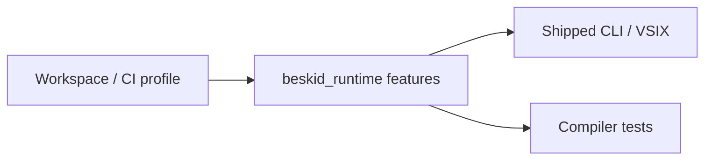

<!-- migrated from the legacy platform spec; canonical OpenSpec source -->
# Runtime feature flags Specification

## Purpose

Feature-gate and capability signaling contract between runtime builds and compiler/tooling expectations.

## Requirements

### Requirement: Cargo features are separate from ABI version: Decision [D-EXEC-RT-0014]
The Beskid standard SHALL enforce the following migrated contract section. Accepted ADR decisions are binding; uppercase requirement keywords retain their BCP-14 meaning.

> | Concept | Rule |
> | --- | --- |
> | `BESKID_RUNTIME_ABI_VERSION` | Changes only on breaking layout/signature per **D-EXEC-ABI-0002** |
> | Cargo `features` | `metrics`, `arrays_backing`, `sched` — build-time toggles |
> | Additive exports | New feature-gated symbols **may** ship without ABI bump if old artifacts never import them |
> | Shipped binaries | **Must** document enabled features in release notes |
> | Tests | Compiler tests enable features explicitly when validating optional paths |

**Stable ID:** `BSP-REQ-D0D411D012AC`  
**Legacy source:** `site/spec-content/platform-spec/execution/runtime/runtime-feature-flags/adr/0014-cargo-features-not-abi-version/content.md`  
**Source SHA-256:** `77bafb075078817c302d5d83a712fdedc70f4f15bc081838a5edd0a54de23c81`

#### Scenario: Conformance exercises Decision
- **GIVEN** an implementation claims conformance with this capability
- **WHEN** behavior governed by this contract section is exercised
- **THEN** every MUST, SHALL, REQUIRED, prohibition, and accepted decision in the section is satisfied

### Requirement: arrays_backing gates array element storage: Decision [D-EXEC-RT-0015]
The Beskid standard SHALL enforce the following migrated contract section. Accepted ADR decisions are binding; uppercase requirement keywords retain their BCP-14 meaning.

> | `arrays_backing` | Behavior |
> | --- | --- |
> | **Enabled** | `array_new` allocates element storage; `ptr` non-null when length > 0 |
> | **Disabled** | Header-only arrays; `ptr` may be **null** |
> | ABI | Symbol list unchanged; semantics differ by build — document in release matrices |
> | Alignment | Shipped CLI/VSIX **should** enable `arrays_backing` for reference user workflows |

**Stable ID:** `BSP-REQ-289D07407B0E`  
**Legacy source:** `site/spec-content/platform-spec/execution/runtime/runtime-feature-flags/adr/0015-arrays-backing-feature/content.md`  
**Source SHA-256:** `6334ca0fac56db28593dd4ff052322f97d4038cb268c29c1ecc8c61e6a9f13db`

#### Scenario: Conformance exercises Decision
- **GIVEN** an implementation claims conformance with this capability
- **WHEN** behavior governed by this contract section is exercised
- **THEN** every MUST, SHALL, REQUIRED, prohibition, and accepted decision in the section is satisfied

## Informative Source Provenance

The records below preserve migration history and are not normative except where text was extracted into a requirement above.

### Source Record: Runtime feature flags

**Authority:** informative provenance  
**Legacy path:** `/platform-spec/execution/runtime/runtime-feature-flags/`  
**Source:** `site/spec-content/platform-spec/execution/runtime/runtime-feature-flags/content.md`  
**SHA-256:** `213b1d746f501f1ccdb2ec7e0c7fdece86db01ceadf0e832bf5151615d2f0357`

<details>
<summary>Migrated source text</summary>

``````markdown
<SpecSection title="What this feature specifies" id="what-this-feature-specifies">
`Runtime feature flags` defines one operational contract that a newcomer can follow end-to-end: first the model, then execution flow, then strict guarantees, concrete examples, and verification guidance.
</SpecSection>

<SpecSection title="Implementation anchors" id="implementation-anchors">
- Runtime compile-time flags and exports in `compiler/crates/beskid_runtime/src/lib.rs`
- Runtime builtins feature gating in `compiler/crates/beskid_runtime/src/builtins/mod.rs`
- Execution setup in `compiler/crates/beskid_cli/src/commands/doc.rs`
- Runtime tests in `compiler/crates/beskid_tests/src/runtime/jit.rs`
</SpecSection>

## Decisions
<!-- spec:generate:adr-index -->
No open decisions. Closed choices are normative ADRs under **`adr/`** (`D-EXEC-RT-0014` … `D-EXEC-RT-0015`); use the reader **ADRs** tab for expandable detail.
<!-- /spec:generate:adr-index -->
## Articles
<!-- spec:generate:article-index -->
- [Contracts and edge cases](./articles/contracts-and-edge-cases/)
- [Design model](./articles/design-model/)
- [Examples](./articles/examples/)
- [FAQ and troubleshooting](./articles/faq-and-troubleshooting/)
- [Flow and algorithm](./articles/flow-and-algorithm/)
- [Verification and traceability](./articles/verification-and-traceability/)
<!-- /spec:generate:article-index -->
``````

</details>

### Source Record: Cargo features are separate from ABI version

**Authority:** informative provenance  
**Legacy path:** `/platform-spec/execution/runtime/runtime-feature-flags/adr/0014-cargo-features-not-abi-version/`  
**Source:** `site/spec-content/platform-spec/execution/runtime/runtime-feature-flags/adr/0014-cargo-features-not-abi-version/content.md`  
**SHA-256:** `77bafb075078817c302d5d83a712fdedc70f4f15bc081838a5edd0a54de23c81`

<details>
<summary>Migrated source text</summary>

``````markdown
## Context

CI and VSIX builds enable different `beskid_runtime` features. Confusing feature gates with ABI bumps breaks compatibility checks.

## Decision

| Concept | Rule |
| --- | --- |
| `BESKID_RUNTIME_ABI_VERSION` | Changes only on breaking layout/signature per **D-EXEC-ABI-0002** |
| Cargo `features` | `metrics`, `arrays_backing`, `sched` — build-time toggles |
| Additive exports | New feature-gated symbols **may** ship without ABI bump if old artifacts never import them |
| Shipped binaries | **Must** document enabled features in release notes |
| Tests | Compiler tests enable features explicitly when validating optional paths |

## Consequences

Mismatch (test expects `arrays_backing`, default runtime does not) fails logically without ABI version inequality.

## Verification anchors

`beskid_runtime/Cargo.toml`; [design model](../design-model/) feature table.
``````

</details>

### Source Record: arrays_backing gates array element storage

**Authority:** informative provenance  
**Legacy path:** `/platform-spec/execution/runtime/runtime-feature-flags/adr/0015-arrays-backing-feature/`  
**Source:** `site/spec-content/platform-spec/execution/runtime/runtime-feature-flags/adr/0015-arrays-backing-feature/content.md`  
**SHA-256:** `6334ca0fac56db28593dd4ff052322f97d4038cb268c29c1ecc8c61e6a9f13db`

<details>
<summary>Migrated source text</summary>

``````markdown
## Context

Array lowering depends on whether the linked runtime allocates element storage behind `BeskidArray` headers.

## Decision

| `arrays_backing` | Behavior |
| --- | --- |
| **Enabled** | `array_new` allocates element storage; `ptr` non-null when length > 0 |
| **Disabled** | Header-only arrays; `ptr` may be **null** |
| ABI | Symbol list unchanged; semantics differ by build — document in release matrices |
| Alignment | Shipped CLI/VSIX **should** enable `arrays_backing` for reference user workflows |

## Consequences

Conformance and doc tests **must** pin feature set when asserting array behavior.

## Verification anchors

`beskid_runtime` `array_new`; runtime JIT tests with feature flags.
``````

</details>

### Source Record: Contracts and edge cases

**Authority:** informative provenance  
**Legacy path:** `/platform-spec/execution/runtime/runtime-feature-flags/articles/contracts-and-edge-cases/`  
**Source:** `site/spec-content/platform-spec/execution/runtime/runtime-feature-flags/articles/contracts-and-edge-cases/content.md`  
**SHA-256:** `8a200bc97d3585d42b59bb94dfb399fefd8bd535181c89519cfc9f4f14d26960`

<details>
<summary>Migrated source text</summary>

``````markdown
## Normative requirements

| ID | Requirement |
| --- | --- |
| **RFF-001** | Optional runtime features **must not** change `BESKID_RUNTIME_ABI_VERSION` unless they alter existing symbol signatures or layouts. |
| **RFF-002** | Default CI/release runtime builds **must** document which features are enabled in build notes or manifests. |
| **RFF-003** | Tests that require `arrays_backing` **must** enable the feature on `beskid_runtime` dependency. |
| **RFF-004** | `metrics` exports **must** be absent from baseline `RUNTIME_EXPORT_SYMBOLS` when built without `metrics`. |
| **RFF-005** | Compiler lowering **must not** assume element backing exists unless workspace policy enables `arrays_backing`. |
| **RFF-006** | `extern_dlopen` **must** remain off by default on `beskid_engine` for production toolchains. |
| **RFF-007** | Phase B GC **must** be opt-in for v0.3; the runtime **must** boot in Phase A unless `BESKID_RUNTIME_PHASE_B=1` or `set_runtime_phase(RuntimePhase::PhaseB)` flips it. |
| **RFF-008** | Optional preemption **must** stay disabled by default; enabling it via `BESKID_RUNTIME_PREEMPT=1` or `set_preemption_enabled(true)` **must not** change observable semantics of fiber-only programs beyond inserting yield points. |

## Feature behavior table

| Feature | Without | With |
| --- | --- | --- |
| `arrays_backing` | `array_new.ptr == null` | Backing store allocated |
| `metrics` | No `rt_metrics_*` | Counters exposed |
| `sched` | Default scheduler only | Experimental sched hooks |
| Phase B GC (`BESKID_RUNTIME_PHASE_B`) | Single-mutator Phase A; channel pointer payloads still routed through external roots but barriers no-op outside marking | Multiple mutators may attach via `attach_phase_b_mutator`; `gc_write_barrier` active on pointer-payload channel ops |
| Preemption (`BESKID_RUNTIME_PREEMPT`) | `runtime_preempt_check` is a no-op | `runtime_preempt_check` yields the current fiber (or OS thread if off-scheduler) |

## Edge cases

| Case | Outcome |
| --- | --- |
| Test expects backing, runtime default | Tests fail allocation or pointer reads — fix features, not ABI |
| User enables `metrics` locally | JIT must link extra symbols only if codegen calls them |
| VSIX runtime vs CLI runtime feature mismatch | Subtle array/GC test failures — align Open VSX build matrix |

## Implementation anchors
- `compiler/crates/beskid_runtime/Cargo.toml` — feature flags and build-time gating
- `compiler/crates/beskid_abi/src/version.rs` — ABI version independence from features
- `compiler/crates/beskid_runtime/src/builtins/arrays.rs` — `arrays_backing` conditional compilation

## Related topics

- [ABI versioning](/platform-spec/execution/abi-and-host/abi-versioning-and-compatibility/)
- Legacy mention: [Runtime ABI v0.1 arrays_backing](../../../../execution/runtime/runtime-abi-v0-1.md)
``````

</details>

### Source Record: Design model

**Authority:** informative provenance  
**Legacy path:** `/platform-spec/execution/runtime/runtime-feature-flags/articles/design-model/`  
**Source:** `site/spec-content/platform-spec/execution/runtime/runtime-feature-flags/articles/design-model/content.md`  
**SHA-256:** `7f60e33f726ee82122c7f86fbc38a18c805b898fb127adaa48b65d956de3adc5`

<details>
<summary>Migrated source text</summary>

``````markdown
## Purpose

Document **optional runtime capabilities** selected at **build time** via Cargo features. These differ from **`BESKID_RUNTIME_ABI_VERSION`**: features toggle code paths without changing the baseline symbol list unless a feature adds new exports.

## Primary actors

| Actor | Role |
| --- | --- |
| **`beskid_runtime` Cargo.toml** | Declares `metrics`, `arrays_backing`, `sched` features |
| **Maintainers / CI** | Builds runtime with agreed feature set for CLI, VSIX, releases |
| **Compiler tests** | Enable features when validating optional behavior |
| **Tooling** | Documents which flags are on in prebuilt binaries |

## Feature catalog (reference tree)

| Feature | Effect |
| --- | --- |
| **`arrays_backing`** | `array_new` allocates element storage; without it, header-only arrays (`ptr = null`) |
| **`metrics`** | Extra `rt_metrics_*` exports for heap/alloc/event counters |
| **`sched`** | Scheduler internals/experimental hooks (build-time; not user-facing) |
| **`extern_dlopen`** (engine, not runtime) | Dynamic extern resolution — see [Extern dispatch](/platform-spec/execution/abi-and-host/extern-dispatch-and-policy/) |

## Alignment model



Shipped artifacts **must** document enabled features. Mixing a compiler test build that expects `arrays_backing` against a default runtime produces logical failures without ABI version mismatch.

## Implementation anchors
- `compiler/crates/beskid_runtime/Cargo.toml` — `[features]` definitions (`arrays_backing`, `metrics`)
- `compiler/crates/beskid_runtime/src/builtins/arrays.rs` — `arrays_backing` gated array builtins
- `compiler/crates/beskid_engine/Cargo.toml` — `extern_dlopen` engine feature

## Related topics

- [Flow and algorithm](./flow-and-algorithm/)
- [Builtins and symbols](/platform-spec/execution/abi-and-host/builtins-and-symbols/)
``````

</details>

### Source Record: Examples

**Authority:** informative provenance  
**Legacy path:** `/platform-spec/execution/runtime/runtime-feature-flags/articles/examples/`  
**Source:** `site/spec-content/platform-spec/execution/runtime/runtime-feature-flags/articles/examples/content.md`  
**SHA-256:** `daf7cadf4de636726d848a54067d802bd294937f5ef426da553830a1d6a442d9`

<details>
<summary>Migrated source text</summary>

``````markdown
## Enable array backing for tests

```bash
cargo test -p beskid_tests --features beskid_runtime/arrays_backing
```

(Exact feature propagation follows workspace `Cargo.toml` dependency declarations—maintainers mirror the pattern used in compiler CI.)

## Header-only array scenario (default)

A lowered test creates `array_new(8, 100)` without `arrays_backing`. Inspection shows non-zero `len` but `ptr == null`. Tests that dereference elements **must** enable backing or avoid element access.

## Metrics-enabled profiling build

Maintainers build:

```bash
cargo build -p beskid_runtime --features metrics
```

Generated code that does not call `rt_metrics_*` still links because baseline JIT does not import optional symbols.

## Engine dynamic extern (related)

```bash
cargo test -p beskid_engine extern_real_call_getpid --features extern_dlopen
```

This does not change runtime features; it documents cross-crate flag vocabulary for execution maintainers.

## Release matrix documentation (prose)

Open VSX jobs should record in CI logs whether `arrays_backing` is enabled for the bundled runtime. Operators comparing local `cargo build` vs extension behavior should check that matrix before reporting array bugs.

## Related topics

- [Verification and traceability](./verification-and-traceability/)
- [Memory and GC](/platform-spec/execution/runtime/memory-and-gc-runtime-contract/)
``````

</details>

### Source Record: FAQ and troubleshooting

**Authority:** informative provenance  
**Legacy path:** `/platform-spec/execution/runtime/runtime-feature-flags/articles/faq-and-troubleshooting/`  
**Source:** `site/spec-content/platform-spec/execution/runtime/runtime-feature-flags/articles/faq-and-troubleshooting/content.md`  
**SHA-256:** `95b75a7b6b9ad438d676a35f681d52edb445a334ab79c3e3cfe8b46ac4fb26f8`

<details>
<summary>Migrated source text</summary>

``````markdown
## FAQ

### Do feature flags change `beskid_runtime_abi_version`?

No when behavior is backward compatible (**RFF-001**). Adding new optional symbols without old compilers calling them does not require a bump.

### Why is `array_new` pointer null in the debugger?

Default builds omit `arrays_backing`. Enable the feature for tests that touch elements.

### Where is `extern_dlopen` documented?

Under [Extern dispatch and policy](/platform-spec/execution/abi-and-host/extern-dispatch-and-policy/) — it is an **engine** feature, not a runtime Cargo feature.

### Can users toggle features at run time?

No. Selection is compile-time for the linked `beskid_runtime` artifact. CLI flags choose execution **mode**, not `arrays_backing`.

## Troubleshooting

| Symptom | Fix |
| --- | --- |
| Array element segfault | Build runtime with `arrays_backing` or stop dereferencing `ptr` |
| Missing `rt_metrics_*` at link | Enable `metrics` on runtime **and** ensure codegen emits calls |
| Extern works locally, fails in CI | CI engine lacks `extern_dlopen` — use link-time externs |
| VSIX vs local CLI array difference | Compare release matrices for runtime features |

## Related topics

- [Examples](./examples/)
- [FAQ ABI versioning](/platform-spec/execution/abi-and-host/abi-versioning-and-compatibility/faq-and-troubleshooting/)
``````

</details>

### Source Record: Flow and algorithm

**Authority:** informative provenance  
**Legacy path:** `/platform-spec/execution/runtime/runtime-feature-flags/articles/flow-and-algorithm/`  
**Source:** `site/spec-content/platform-spec/execution/runtime/runtime-feature-flags/articles/flow-and-algorithm/content.md`  
**SHA-256:** `bfe0c632aae8dfdbddad92692afba366ea037d005343d74f683c9363945f7f6a`

<details>
<summary>Migrated source text</summary>

``````markdown
## Purpose

How optional features propagate from Cargo to runtime behavior. Build alignment diagram: [design model](./design-model/).

## Build-time selection

1. CI or local `cargo build -p beskid_runtime --features …` enables cfg gates in `builtins/arrays.rs`, `metrics` module, etc.
2. `beskid_engine` / CLI link the same feature-enabled runtime artifact (workspace dependency features must match).
3. `BESKID_RUNTIME_ABI_VERSION` stays constant unless symbol/signatures change (**ABI-005**).

## `arrays_backing` runtime path

1. Lowering always emits `array_new(elem_size, len)`.
2. Without feature: runtime writes `BeskidArray { ptr: null, len, cap: len }`.
3. With feature: runtime allocates `elem_size * len` bytes via `alloc` for `ptr`.
4. `array_len` returns logical `len` in both modes.

## `metrics` export path

1. When enabled, `builtins/metrics.rs` registers additional `rt_metrics_*` symbols.
2. JIT **must** only declare imports if codegen emits calls—baseline programs ignore them.
3. Hosts read counters for profiling dashboards; not part of user Beskid language.

## Engine `extern_dlopen` (related)

1. Separate from runtime crate: enable on `beskid_engine` for dynamic extern tests.
2. Does not alter `beskid_runtime_abi_version`.
3. Failure modes documented under [Extern dispatch](/platform-spec/execution/abi-and-host/extern-dispatch-and-policy/).

## Release verification flow

1. Read release manifest / CI matrix for enabled features.
2. Run conformance tests compiled with the same feature set.
3. Compare `array_new` behavior in integration tests (backing vs header-only).

## Implementation anchors
- `compiler/crates/beskid_runtime/src/builtins/arrays.rs` — `arrays_backing` enabled array construction
- `compiler/crates/beskid_engine/src/` — `extern_dlopen` dynamic extern resolution
- `compiler/crates/beskid_tests/src/runtime/` — feature-gated integration test fixtures

## Related topics

- [Contracts and edge cases](./contracts-and-edge-cases/)
- `compiler/crates/beskid_runtime/Cargo.toml`
``````

</details>

### Source Record: Verification and traceability

**Authority:** informative provenance  
**Legacy path:** `/platform-spec/execution/runtime/runtime-feature-flags/articles/verification-and-traceability/`  
**Source:** `site/spec-content/platform-spec/execution/runtime/runtime-feature-flags/articles/verification-and-traceability/content.md`  
**SHA-256:** `67d133e1162cc01de9d53f7229742e78abf8bf39ad093afd5ac2aeb55f5c1239`

<details>
<summary>Migrated source text</summary>

``````markdown
## Source files

| Path | Content |
| --- | --- |
| `compiler/crates/beskid_runtime/Cargo.toml` | `[features]` table |
| `compiler/crates/beskid_runtime/src/builtins/arrays.rs` | `#[cfg(feature = "arrays_backing")]` |
| `compiler/crates/beskid_runtime/src/builtins/mod.rs` | `metrics` module gate |
| `compiler/crates/beskid_engine/Cargo.toml` | `extern_dlopen` feature |
| `compiler/crates/beskid_cli/src/commands/doc.rs` | Execution modes referencing runtime |

## Tests

| Suite | Notes |
| --- | --- |
| `beskid_tests/src/runtime/jit.rs` | Default runtime feature set |
| Engine `extern_*` tests | Require `extern_dlopen` |
| Future: explicit `arrays_backing` fixture | Assert `ptr != null` when enabled |

## Traceability

| ID | Check |
| --- | --- |
| **RFF-001** | ABI version constant unchanged in feature-only PRs |
| **RFF-003** | CI job definitions list `arrays_backing` where needed |
| **RFF-006** | Default engine feature set off in release workflow |

## Implementation anchors
- `compiler/crates/beskid_runtime/Cargo.toml` — default feature set verification
- `compiler/crates/beskid_runtime/src/builtins/arrays.rs` — `arrays_backing` conformance tests
- `compiler/crates/beskid_cli/src/commands/doc.rs` — shipped artifact feature documentation

## Related topics

- [Contracts and edge cases](./contracts-and-edge-cases/)
- [CLI area](/platform-spec/tooling/cli/)
``````

</details>
