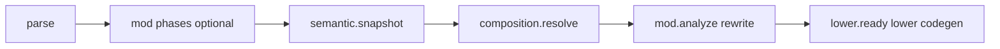
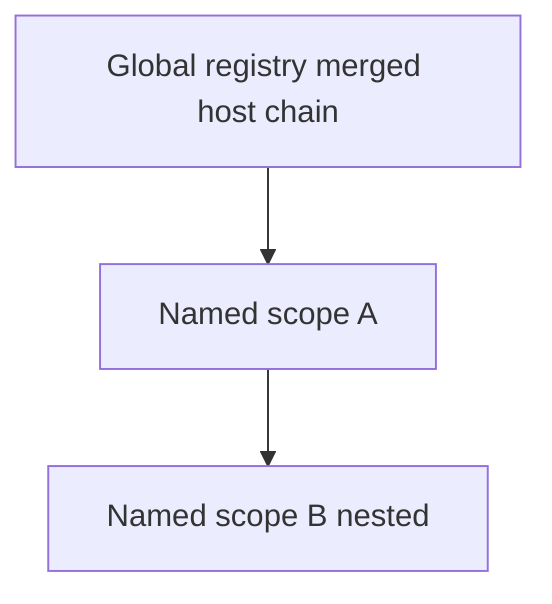

<!-- migrated from the legacy platform spec; canonical OpenSpec source -->
# Native dependency injection Specification

## Purpose

Language-native host composition — host, registry, named scopes, with activation, inject, startup, and launch.

## Requirements

### Requirement: Feature hub owns normative contract: Decision [D-LMETA-DI-0001]
The Beskid standard SHALL enforce the following migrated contract section. Accepted ADR decisions are binding; uppercase requirement keywords retain their BCP-14 meaning.

> This feature hub **must** own normative MUST/SHOULD contract text. Sibling articles **must not** redefine hub requirements and **should** link here for authority.

**Stable ID:** `BSP-REQ-1050DF8CB42A`  
**Legacy source:** `site/spec-content/platform-spec/language-meta/composition/dependency-injection/adr/0001-hub-authority/content.md`  
**Source SHA-256:** `3ebaca55c79d7441ae32df3d2255a536816f03b2861d1a22e85449bbd6ca36fc`

#### Scenario: Conformance exercises Decision
- **GIVEN** an implementation claims conformance with this capability
- **WHEN** behavior governed by this contract section is exercised
- **THEN** every MUST, SHALL, REQUIRED, prohibition, and accepted decision in the section is satisfied

### Requirement: Composition graph resolved at compile time: Decision [D-LMETA-DI-0002]
The Beskid standard SHALL enforce the following migrated contract section. Accepted ADR decisions are binding; uppercase requirement keywords retain their BCP-14 meaning.

> The reference compiler **must** fully resolve the app composition graph at compile time. Backends **must not** perform runtime service lookup for **`host`** / **`registry`** / **`scope`** wiring.

**Stable ID:** `BSP-REQ-3D7AFB88D173`  
**Legacy source:** `site/spec-content/platform-spec/language-meta/composition/dependency-injection/adr/0002-compile-time-resolution/content.md`  
**Source SHA-256:** `6a12c6b1e5eef80417f228b887b13d389d2ea277dfb1bb57c0279f54901abd89`

#### Scenario: Conformance exercises Decision
- **GIVEN** an implementation claims conformance with this capability
- **WHEN** behavior governed by this contract section is exercised
- **THEN** every MUST, SHALL, REQUIRED, prohibition, and accepted decision in the section is satisfied

### Requirement: Field inject only: Decision [D-LMETA-DI-0003]
The Beskid standard SHALL enforce the following migrated contract section. Accepted ADR decisions are binding; uppercase requirement keywords retain their BCP-14 meaning.

> **`inject`** **must** apply to **fields** on ordinary types only. Constructor-parameter **`inject`** **must** be rejected (**E1712**).

**Stable ID:** `BSP-REQ-6A8D09774BE1`  
**Legacy source:** `site/spec-content/platform-spec/language-meta/composition/dependency-injection/adr/0003-field-inject-only/content.md`  
**Source SHA-256:** `6eb8047f3e80218620614e5a17527f991204a2defa84feefd609bc638e319919`

#### Scenario: Conformance exercises Decision
- **GIVEN** an implementation claims conformance with this capability
- **WHEN** behavior governed by this contract section is exercised
- **THEN** every MUST, SHALL, REQUIRED, prohibition, and accepted decision in the section is satisfied

### Requirement: registry spelling locked: Decision [D-LMETA-DI-0004]
The Beskid standard SHALL enforce the following migrated contract section. Accepted ADR decisions are binding; uppercase requirement keywords retain their BCP-14 meaning.

> The global registration block **must** be spelled **`registry`** (locked for v0.2+).

**Stable ID:** `BSP-REQ-5EEA122AEC4A`  
**Legacy source:** `site/spec-content/platform-spec/language-meta/composition/dependency-injection/adr/0004-registry-spelling/content.md`  
**Source SHA-256:** `4494759de2284a0230b6ca146e6dc59ad239ac4f2b4679f5323de1bd92e51b4d`

#### Scenario: Conformance exercises Decision
- **GIVEN** an implementation claims conformance with this capability
- **WHEN** behavior governed by this contract section is exercised
- **THEN** every MUST, SHALL, REQUIRED, prohibition, and accepted decision in the section is satisfied

### Requirement: Global scope and named scope stack: Decision [D-LMETA-DI-0005]
The Beskid standard SHALL enforce the following migrated contract section. Accepted ADR decisions are binding; uppercase requirement keywords retain their BCP-14 meaning.

> | Construct | Rule |
> | --- | --- |
> | **Global** | Merged **`registry`** of the launched host after inheritance chain |
> | **Named `scope`** | Tree under global; per-activation unless `single` / `transient` |
> | **Stack** | Fiber-local scope stack during **`with`** |
> | **Resolution** | Walk innermost → global; **`global::`** and **`parent::`** qualifiers as specified |

**Stable ID:** `BSP-REQ-AFFAEBBF17A3`  
**Legacy source:** `site/spec-content/platform-spec/language-meta/composition/dependency-injection/adr/0005-global-and-scope-stack/content.md`  
**Source SHA-256:** `699818c7a172fdc28b8c8e684e2bbfc2226530138233aab422a99b08f7d6ff26`

#### Scenario: Conformance exercises Decision
- **GIVEN** an implementation claims conformance with this capability
- **WHEN** behavior governed by this contract section is exercised
- **THEN** every MUST, SHALL, REQUIRED, prohibition, and accepted decision in the section is satisfied

### Requirement: Multiple implementations via inject T[]: Decision [D-LMETA-DI-0006]
The Beskid standard SHALL enforce the following migrated contract section. Accepted ADR decisions are binding; uppercase requirement keywords retain their BCP-14 meaning.

> Multiple implementations **must** use **`inject Contract[]`** (or concrete **`T[]`**). Singular **`inject Contract`** **must** be unique at the resolution level (**E1705** when ambiguous).

**Stable ID:** `BSP-REQ-C91E7F0E472F`  
**Legacy source:** `site/spec-content/platform-spec/language-meta/composition/dependency-injection/adr/0006-plural-inject-array/content.md`  
**Source SHA-256:** `a1098c040df042384d4b7e8be9597a984b096c27f609eff716c1a77d8387489f`

#### Scenario: Conformance exercises Decision
- **GIVEN** an implementation claims conformance with this capability
- **WHEN** behavior governed by this contract section is exercised
- **THEN** every MUST, SHALL, REQUIRED, prohibition, and accepted decision in the section is satisfied

### Requirement: Many host types one launch per run: Decision [D-LMETA-DI-0007]
The Beskid standard SHALL enforce the following migrated contract section. Accepted ADR decisions are binding; uppercase requirement keywords retain their BCP-14 meaning.

> Projects **may** declare many named **`host`** types. Each process run **must** use exactly one **`launch Host(args)`** on an executable target (**E1702** for duplicate launch on one path).

**Stable ID:** `BSP-REQ-947CFD817465`  
**Legacy source:** `site/spec-content/platform-spec/language-meta/composition/dependency-injection/adr/0007-many-hosts-one-launch/content.md`  
**Source SHA-256:** `26269a9743c3775a29761fc04e3c9c2383af99fc23e1a3b49d9536aecef487d6`

#### Scenario: Conformance exercises Decision
- **GIVEN** an implementation claims conformance with this capability
- **WHEN** behavior governed by this contract section is exercised
- **THEN** every MUST, SHALL, REQUIRED, prohibition, and accepted decision in the section is satisfied

### Requirement: Lib targets forbid launch: Decision [D-LMETA-DI-0008]
The Beskid standard SHALL enforce the following migrated contract section. Accepted ADR decisions are binding; uppercase requirement keywords retain their BCP-14 meaning.

> **`Lib`** project targets **may** declare **`host`** types for reuse but **`launch`** is **forbidden** (**E1711**). Only app/test host targets **may** **`launch`**.

**Stable ID:** `BSP-REQ-A3D6998DECC1`  
**Legacy source:** `site/spec-content/platform-spec/language-meta/composition/dependency-injection/adr/0008-lib-forbids-launch/content.md`  
**Source SHA-256:** `1c9d79fc4be6a3f19f9f7acc9ace6ea089d3798600feaff6dbffc158c74b82d4`

#### Scenario: Conformance exercises Decision
- **GIVEN** an implementation claims conformance with this capability
- **WHEN** behavior governed by this contract section is exercised
- **THEN** every MUST, SHALL, REQUIRED, prohibition, and accepted decision in the section is satisfied

### Requirement: composition.resolve pipeline placement: Decision [D-LMETA-DI-0009]
The Beskid standard SHALL enforce the following migrated contract section. Accepted ADR decisions are binding; uppercase requirement keywords retain their BCP-14 meaning.

> Pipeline phase **`composition.resolve`** **must** run after **`semantic.snapshot`** and before **`mod.analyze`** (see [Stage ordering](/platform-spec/compiler/build-pipeline/stage-ordering/)).

**Stable ID:** `BSP-REQ-6A79DB04349D`  
**Legacy source:** `site/spec-content/platform-spec/language-meta/composition/dependency-injection/adr/0009-composition-resolve-phase/content.md`  
**Source SHA-256:** `f8650b81bebe05576a8937cefdd345e737ec6124112c0df34697e50759bef45c`

#### Scenario: Conformance exercises Decision
- **GIVEN** an implementation claims conformance with this capability
- **WHEN** behavior governed by this contract section is exercised
- **THEN** every MUST, SHALL, REQUIRED, prohibition, and accepted decision in the section is satisfied

### Requirement: Mod projects must not alter app composition: Decision [D-LMETA-DI-0010]
The Beskid standard SHALL enforce the following migrated contract section. Accepted ADR decisions are binding; uppercase requirement keywords retain their BCP-14 meaning.

> `Mod` projects **must not** declare app **`host`** blocks or alter app composition graphs. Mod registration uses contract **`registrations[]`** per [Compiler Mod SDK](/platform-spec/language-meta/metaprogramming/compiler-mod-sdk/).

**Stable ID:** `BSP-REQ-3DDFB4DB4224`  
**Legacy source:** `site/spec-content/platform-spec/language-meta/composition/dependency-injection/adr/0010-mod-projects-no-app-host/content.md`  
**Source SHA-256:** `7e2a111f140400d87ba561c811dddb9add5a799cf6357bb15e6b6c64c7e0bf88`

#### Scenario: Conformance exercises Decision
- **GIVEN** an implementation claims conformance with this capability
- **WHEN** behavior governed by this contract section is exercised
- **THEN** every MUST, SHALL, REQUIRED, prohibition, and accepted decision in the section is satisfied

## Informative Source Provenance

The records below preserve migration history and are not normative except where text was extracted into a requirement above.

### Source Record: Native dependency injection

**Authority:** informative provenance  
**Legacy path:** `/platform-spec/language-meta/composition/dependency-injection/`  
**Source:** `site/spec-content/platform-spec/language-meta/composition/dependency-injection/content.md`  
**SHA-256:** `9a8daa480016e74a3d546adae5efae8d2a5c5f4176d6261acca6a342a322038f`

<details>
<summary>Migrated source text</summary>

``````markdown
Native **dependency injection** is a **language feature**: projects declare named **`host`** types (including reusable library hosts), register services in **`registry`** (global scope), define nested **`scope`** containers with **`init`** / **`dispose`**, activate scopes with **`with`**, use **field `inject`** (including **`T[]`** for multiple implementations), and start the process with a single **`launch`**. The reference compiler **fully resolves** the graph at compile time; backends do not perform runtime service lookup.

## Boundaries

| Plane | Mechanism |
| --- | --- |
| **App composition (this feature)** | `host`, `registry`, `scope`, `init`, `dispose`, `with`, field `inject`, `startup`, `launch` |
| **Rust pipeline composition** | [Pipeline composition](/platform-spec/compiler/pipeline-composition/) — compiler pass/service graph only |
| **Compiler mods (`type: Mod`)** | [Compiler Mod SDK](/platform-spec/language-meta/metaprogramming/compiler-mod-sdk/) — contract `registrations[]`, not app DI |
| **Package dependency graph** | [Resolution and projects](/platform-spec/compiler/resolution-and-projects/) — `CompilePlan` / lockfile, not service lifetimes |

`Mod` projects **must not** declare `host` blocks or alter app composition graphs. Mod analyzers may **query** a frozen composition snapshot exported by the compiler ([Analysis, query, and diagnostics facades](/platform-spec/compiler/compiler-mods/analysis-query-diagnostics-facade/)).

## Corelib hosts

Built-in host bases (for example **`ConsoleHost`**, future **`WebHost`**) live in **corelib**. An app **`host`** may inherit a base (`: ConsoleHost`) to reuse default registry entries and run-loop behavior. Base-host contracts are specified alongside execution and corelib packages as they land.

## Implementation anchors (reference compiler)

Anchors name the modules that own each plane of native DI in the reference compiler. The codegen lowering gate (`RUNTIME_CONTAINER_LOWERING_ENABLED`) is **on** as of v0.3; `launch` and `with` emit real runtime container ABI calls.

- `compiler/crates/beskid_analysis/src/composition/` — host-chain merge, scope tree, `BindingPlan`, `CompositionSnapshot` export
- `compiler/crates/beskid_codegen/src/lowering/composition_policy.rs` — `RUNTIME_CONTAINER_LOWERING_ENABLED` feature gate
- `compiler/crates/beskid_codegen/src/lowering/composition/` — `launch` / `with` lowering to runtime container ABI calls (`launch_statement.rs`, `with_statement.rs`)
- `compiler/crates/beskid_runtime/src/composition/` — `RuntimeContainer` (registration ordering, plural inject, LIFO dispose) and scope-stack management
- `compiler/crates/beskid_runtime/src/builtins/composition.rs` — `extern "C-unwind"` ABI surface (`composition_container_create`, `composition_register`, `composition_bind_plural`, `composition_launch`, `composition_scope_enter`, `composition_scope_leave`, `composition_resolve`, `composition_resolve_plural`, `composition_shutdown`, `composition_container_drop`, `composition_scope_depth`)
- `compiler/crates/beskid_abi/src/symbols.rs` / `compiler/crates/beskid_abi/src/builtins.rs` — stable linker symbols and `BuiltinFnSpec` entries for every `composition_*` builtin
- `compiler/crates/beskid_pipeline` — `composition.resolve` phase id (see [Flow and algorithm](./flow-and-algorithm/))
- `compiler/corelib` — `ConsoleHost`, `WebHost`, shared configuration types

End-to-end verification lives at `compiler/crates/beskid_tests/src/composition/` (`container.rs`, `host_e2e.rs`, `lowering.rs`).

## Articles
## Decisions
<!-- spec:generate:adr-index -->
No open decisions. Closed choices are normative ADRs under **`adr/`** (`D-LMETA-DI-0001` … `D-LMETA-DI-0010`); use the reader **ADRs** tab for expandable detail.
<!-- /spec:generate:adr-index -->

## Articles
<!-- spec:generate:article-index -->
- [Native dependency injection - Contracts and edge cases](./articles/contracts-and-edge-cases/)
- [Native dependency injection - Design model](./articles/design-model/)
- [Native dependency injection - Examples](./articles/examples/)
- [Native dependency injection - FAQ and troubleshooting](./articles/faq-and-troubleshooting/)
- [Native dependency injection - Flow and algorithm](./articles/flow-and-algorithm/)
- [Native dependency injection - Verification and traceability](./articles/verification-and-traceability/)
<!-- /spec:generate:article-index -->
``````

</details>

### Source Record: Feature hub owns normative contract

**Authority:** informative provenance  
**Legacy path:** `/platform-spec/language-meta/composition/dependency-injection/adr/0001-hub-authority/`  
**Source:** `site/spec-content/platform-spec/language-meta/composition/dependency-injection/adr/0001-hub-authority/content.md`  
**SHA-256:** `3ebaca55c79d7441ae32df3d2255a536816f03b2861d1a22e85449bbd6ca36fc`

<details>
<summary>Migrated source text</summary>

``````markdown
## Context

Composition articles and compiler notes mixed informal wiring guidance with normative host syntax.

## Decision

This feature hub **must** own normative MUST/SHOULD contract text. Sibling articles **must not** redefine hub requirements and **should** link here for authority.

## Consequences

FAQ locked decisions migrate to ADRs; articles retain examples and troubleshooting tables only.

## Verification anchors

/platform-spec/language-meta/composition/dependency-injection/; `verify:trudoc`.
``````

</details>

### Source Record: Composition graph resolved at compile time

**Authority:** informative provenance  
**Legacy path:** `/platform-spec/language-meta/composition/dependency-injection/adr/0002-compile-time-resolution/`  
**Source:** `site/spec-content/platform-spec/language-meta/composition/dependency-injection/adr/0002-compile-time-resolution/content.md`  
**SHA-256:** `6a12c6b1e5eef80417f228b887b13d389d2ea277dfb1bb57c0279f54901abd89`

<details>
<summary>Migrated source text</summary>

``````markdown
## Context

Runtime DI containers hide wiring and conflict with the project's explicit composition goals (distinct from Rust pipeline IoC in D-INC-0002).

## Decision

The reference compiler **must** fully resolve the app composition graph at compile time. Backends **must not** perform runtime service lookup for **`host`** / **`registry`** / **`scope`** wiring.

## Consequences

Lowering emits ctor wiring and scope enter/leave; execution hosts activate frozen graphs only.

## Verification anchors

`compiler/crates/beskid_analysis` (planned `composition` module); `compiler/crates/beskid_codegen`; [Flow and algorithm](/platform-spec/language-meta/composition/dependency-injection/flow-and-algorithm/).
``````

</details>

### Source Record: Field inject only

**Authority:** informative provenance  
**Legacy path:** `/platform-spec/language-meta/composition/dependency-injection/adr/0003-field-inject-only/`  
**Source:** `site/spec-content/platform-spec/language-meta/composition/dependency-injection/adr/0003-field-inject-only/content.md`  
**SHA-256:** `6eb8047f3e80218620614e5a17527f991204a2defa84feefd609bc638e319919`

<details>
<summary>Migrated source text</summary>

``````markdown
## Context

Constructor injection churns signatures across inheritance and complicates lowering.

## Decision

**`inject`** **must** apply to **fields** on ordinary types only. Constructor-parameter **`inject`** **must** be rejected (**E1712**).

## Consequences

Uniform type headers and a single slot-lowering story for injected fields.

## Verification anchors

[Design model](/platform-spec/language-meta/composition/dependency-injection/design-model/); [FAQ](/platform-spec/language-meta/composition/dependency-injection/faq-and-troubleshooting/).
``````

</details>

### Source Record: registry spelling locked

**Authority:** informative provenance  
**Legacy path:** `/platform-spec/language-meta/composition/dependency-injection/adr/0004-registry-spelling/`  
**Source:** `site/spec-content/platform-spec/language-meta/composition/dependency-injection/adr/0004-registry-spelling/content.md`  
**SHA-256:** `4494759de2284a0230b6ca146e6dc59ad239ac4f2b4679f5323de1bd92e51b4d`

<details>
<summary>Migrated source text</summary>

``````markdown
## Context

Early drafts considered alternate container keywords.

## Decision

The global registration block **must** be spelled **`registry`** (locked for v0.2+).

## Consequences

Parser, diagnostics, and docs use one keyword; no alias `container` in Standard conformance.

## Verification anchors

Grammar and semantic snapshots when composition lands.
``````

</details>

### Source Record: Global scope and named scope stack

**Authority:** informative provenance  
**Legacy path:** `/platform-spec/language-meta/composition/dependency-injection/adr/0005-global-and-scope-stack/`  
**Source:** `site/spec-content/platform-spec/language-meta/composition/dependency-injection/adr/0005-global-and-scope-stack/content.md`  
**SHA-256:** `699818c7a172fdc28b8c8e684e2bbfc2226530138233aab422a99b08f7d6ff26`

<details>
<summary>Migrated source text</summary>

``````markdown
## Context

Authors need predictable scope boundaries for web and console activation patterns.

## Decision

| Construct | Rule |
| --- | --- |
| **Global** | Merged **`registry`** of the launched host after inheritance chain |
| **Named `scope`** | Tree under global; per-activation unless `single` / `transient` |
| **Stack** | Fiber-local scope stack during **`with`** |
| **Resolution** | Walk innermost → global; **`global::`** and **`parent::`** qualifiers as specified |

## Consequences

Execution backends maintain scope enter/leave with **`with`**; plural inject collects at lowest matching level.

## Verification anchors

[Design model](/platform-spec/language-meta/composition/dependency-injection/design-model/); [Execution](/platform-spec/execution/).
``````

</details>

### Source Record: Multiple implementations via inject T[]

**Authority:** informative provenance  
**Legacy path:** `/platform-spec/language-meta/composition/dependency-injection/adr/0006-plural-inject-array/`  
**Source:** `site/spec-content/platform-spec/language-meta/composition/dependency-injection/adr/0006-plural-inject-array/content.md`  
**SHA-256:** `a1098c040df042384d4b7e8be9597a984b096c27f609eff716c1a77d8387489f`

<details>
<summary>Migrated source text</summary>

``````markdown
## Context

Apps register multiple implementations of one contract (for example two `Storage`).

## Decision

Multiple implementations **must** use **`inject Contract[]`** (or concrete **`T[]`**). Singular **`inject Contract`** **must** be unique at the resolution level (**E1705** when ambiguous).

## Consequences

Deterministic registration merge order defines array element order.

## Verification anchors

[Design model](/platform-spec/language-meta/composition/dependency-injection/design-model/); [FAQ](/platform-spec/language-meta/composition/dependency-injection/faq-and-troubleshooting/).
``````

</details>

### Source Record: Many host types one launch per run

**Authority:** informative provenance  
**Legacy path:** `/platform-spec/language-meta/composition/dependency-injection/adr/0007-many-hosts-one-launch/`  
**Source:** `site/spec-content/platform-spec/language-meta/composition/dependency-injection/adr/0007-many-hosts-one-launch/content.md`  
**SHA-256:** `26269a9743c3775a29761fc04e3c9c2383af99fc23e1a3b49d9536aecef487d6`

<details>
<summary>Migrated source text</summary>

``````markdown
## Context

Libraries ship reusable composition roots; executables pick one entry host per run.

## Decision

Projects **may** declare many named **`host`** types. Each process run **must** use exactly one **`launch Host(args)`** on an executable target (**E1702** for duplicate launch on one path).

## Consequences

Manifest **`app`** targets name the launched host; multi-app repos use separate targets, one launch each run.

## Verification anchors

[Contracts and edge cases](/platform-spec/language-meta/composition/dependency-injection/contracts-and-edge-cases/); [Project manifest](/platform-spec/tooling/manifests-and-lockfiles/project-manifest-contract/).
``````

</details>

### Source Record: Lib targets forbid launch

**Authority:** informative provenance  
**Legacy path:** `/platform-spec/language-meta/composition/dependency-injection/adr/0008-lib-forbids-launch/`  
**Source:** `site/spec-content/platform-spec/language-meta/composition/dependency-injection/adr/0008-lib-forbids-launch/content.md`  
**SHA-256:** `1c9d79fc4be6a3f19f9f7acc9ace6ea089d3798600feaff6dbffc158c74b82d4`

<details>
<summary>Migrated source text</summary>

``````markdown
## Context

Test and library packages attempted to embed process entry via launch.

## Decision

**`Lib`** project targets **may** declare **`host`** types for reuse but **`launch`** is **forbidden** (**E1711**). Only app/test host targets **may** **`launch`**.

## Consequences

Consumers reference library hosts from their own app targets or approved harness entries.

## Verification anchors

[FAQ](/platform-spec/language-meta/composition/dependency-injection/faq-and-troubleshooting/).
``````

</details>

### Source Record: composition.resolve pipeline placement

**Authority:** informative provenance  
**Legacy path:** `/platform-spec/language-meta/composition/dependency-injection/adr/0009-composition-resolve-phase/`  
**Source:** `site/spec-content/platform-spec/language-meta/composition/dependency-injection/adr/0009-composition-resolve-phase/content.md`  
**SHA-256:** `f8650b81bebe05576a8937cefdd345e737ec6124112c0df34697e50759bef45c`

<details>
<summary>Migrated source text</summary>

``````markdown
## Context

Compiler mods need a frozen composition snapshot but must not mutate app graphs.

## Decision

Pipeline phase **`composition.resolve`** **must** run after **`semantic.snapshot`** and before **`mod.analyze`** (see [Stage ordering](/platform-spec/compiler/build-pipeline/stage-ordering/)).

## Consequences

Mods query read-only snapshots; app graph build stays in analysis.

## Verification anchors

`compiler/crates/beskid_pipeline`; [Flow and algorithm](/platform-spec/language-meta/composition/dependency-injection/flow-and-algorithm/).
``````

</details>

### Source Record: Mod projects must not alter app composition

**Authority:** informative provenance  
**Legacy path:** `/platform-spec/language-meta/composition/dependency-injection/adr/0010-mod-projects-no-app-host/`  
**Source:** `site/spec-content/platform-spec/language-meta/composition/dependency-injection/adr/0010-mod-projects-no-app-host/content.md`  
**SHA-256:** `7e2a111f140400d87ba561c811dddb9add5a799cf6357bb15e6b6c64c7e0bf88`

<details>
<summary>Migrated source text</summary>

``````markdown
## Context

Compiler mods and app DI share syntax keywords but different planes.

## Decision

`Mod` projects **must not** declare app **`host`** blocks or alter app composition graphs. Mod registration uses contract **`registrations[]`** per [Compiler Mod SDK](/platform-spec/language-meta/metaprogramming/compiler-mod-sdk/).

## Consequences

Clear boundary between [Pipeline composition](/platform-spec/compiler/pipeline-composition/) (Rust) and app DI (Beskid).

## Verification anchors

[Compiler Mod SDK](/platform-spec/language-meta/metaprogramming/compiler-mod-sdk/); [Mod host bridge](/platform-spec/compiler/compiler-mods/mod-host-bridge/).
``````

</details>

### Source Record: Native dependency injection - Contracts and edge cases

**Authority:** informative provenance  
**Legacy path:** `/platform-spec/language-meta/composition/dependency-injection/articles/contracts-and-edge-cases/`  
**Source:** `site/spec-content/platform-spec/language-meta/composition/dependency-injection/articles/contracts-and-edge-cases/content.md`  
**SHA-256:** `2c0ddc907e2d890d9894aa5cc59e963cc7c5191e8a1ed135e47ffbf06fe04895`

<details>
<summary>Migrated source text</summary>

``````markdown
## Hard requirements

- **Compile-time resolution** — All bindings **must** be resolved before lowering; no runtime service locator in v0.2.
- **Fail-closed** — Graph errors **must** block codegen for the host target; partial containers are forbidden.
- **Launched host wins** — For the same binding key, the **topmost (launched) host** `registry` overrides parent host and corelib base entries.
- **Plural vs singular inject** — Multiple registrations for one contract **require** `T[]` inject; singular `inject T` **must** resolve to exactly one.
- **Field inject only** — Constructor parameter `inject` is **forbidden**.
- **One app per run** — Exactly one **`launch`** per process; manifest **`app`** target is the single application host entry.
- **Lib hosts without launch** — **`Lib`** targets **may** define **`host`**; **`launch`** **must** be rejected.
- **Fiber-local scope stack** — Active named scopes are tracked per fiber ([Execution](/platform-spec/execution/)).
- **Mod isolation** — **`Mod`** projects **must not** define app **`host`** blocks.
- **Backend parity** — JIT and AOT **must** share the same binding plan.

## Lifetime constraints

| Rule | Enforcement |
| --- | --- |
| Global **`single`** must not depend on named-scope services without `with` | Compile error |
| **`startup`** only uses **global** bindings | Compile error if a named scope is required |
| Named-scope service used outside a satisfying **`with`** | **E1706** |
| **Service graph cycle** (including field inject edges) | **E1703** |
| Singular **`inject`** with multiple registrations at resolution level | **E1705** (use `T[]`) |
| Plural **`inject T[]`** with zero registrations | **E1704** |
| Child scope **`with`** without parent on stack | **E1707** |
| Override changes lifetime kind | Compile error |

## Host and manifest

| Rule | Detail |
| --- | --- |
| Multiple **`host`** definitions per project | **Allowed** |
| **`launch Host`** per run | **Exactly one** host type |
| **`app` target** | Single executable application target naming the entry that **`launch`**es the app host |
| Dual **`launch`** in one program | **Forbidden** |

## Scope navigation

| Form | Valid when |
| --- | --- |
| Unqualified **`inject`** | Default walk inner → global |
| **`global::`** | Always targets merged **global** `registry` of launched host |
| **`parent::`** | Active named scope stack depth ≥ 1 |

Invalid qualifiers or unreachable parents → compile error.

## Diagnostic band E1701–E1799

Reserved for composition in [Diagnostic code registry](/platform-spec/compiler/semantic-pipeline/diagnostic-code-registry/). Register codes in `compiler/crates/beskid_analysis/src/analysis/diagnostic_kinds.rs` when implemented.

| Code | Condition |
| --- | --- |
| **E1701** | Executable **`app`** target missing or no **`launch`** reachable from entry |
| **E1702** | More than one **`launch`** in the entry program (single-run violation) |
| **E1703** | Service dependency cycle |
| **E1704** | Unregistered contract/type at inject site (including empty `T[]`) |
| **E1705** | Singular inject matches multiple registrations (use `T[]`) |
| **E1706** | Scoped service used outside active `with` |
| **E1707** | Child scope activated without parent |
| **E1708** | `with` argument mismatch vs `scope` parameters |
| **E1709** | `launch` target is not a `host` type |
| **E1710** | `host` on **`Mod`** project |
| **E1711** | `launch` in **`Lib`** target |
| **E1712** | Constructor `inject` (field-only rule) |
| **E1713** | Host override lifetime kind mismatch |
| **E1714** | Invalid scope qualifier (`global::` / `parent::`) |

## Edge cases

- **`init` / dispose on unwind** — If **`init`** completed, **`dispose`** runs for that activation when the **`with`** block exits abnormally; activations that never finished **`init`** do not run **`dispose`**.
- **Repeated `with HttpScope`** — Independent activations; separate scoped instance sets.
- **Same contract in parent and child scope** — Unqualified singular inject resolves in **innermost** scope first; use **`global::`** to pull parent/global registration explicitly.
- **Multiple `Storage` at global** — `inject Storage[]` in **`startup`** receives all; singular `inject Storage` → **E1705**.
- **Library `host` only** — App **`host : LibHost`** merges registries; only app project **`launch`**es.
``````

</details>

### Source Record: Native dependency injection - Design model

**Authority:** informative provenance  
**Legacy path:** `/platform-spec/language-meta/composition/dependency-injection/articles/design-model/`  
**Source:** `site/spec-content/platform-spec/language-meta/composition/dependency-injection/articles/design-model/content.md`  
**SHA-256:** `1140e019f7b7bd724e45cf03464e8d441b563f9f86ac1b6334ab421cbc457b0d`

<details>
<summary>Migrated source text</summary>

``````markdown
## Vocabulary

| Construct | Role |
| --- | --- |
| **`host`** | Named composition root; may extend another **`host`** or corelib base |
| **`registry { }`** | Registrations at the **global** level for that host |
| **`scope Name(params) { }`** | Named child container under global or parent scope |
| **`startup(...)`** | Runs once per **`launch`** at **global** only |
| **`init(...)`** | Runs once per **`with`** activation, before the block body |
| **`dispose(...)`** | Runs once per activation leave, after the block body (or on unwind) |
| **`with Name(args) { }`** | Activates a named scope |
| **`launch Host(args)`** | Starts exactly one host instance for the process run |
| **`inject`** | **Field** injection on ordinary types (not constructors) |

**Declare** scopes on the **`host`**. **Activate** with **`with`**. v0.2 uses manual **`with`** and **`ConsoleHost`** only; **`WebHost`** is v0.3+.

## Scope hierarchy (normative)

Composition uses a fixed mental model with two layers:

### Global scope (implicit)

The **global scope** is the merged **`registry`** of the **launched** host after walking the **host inheritance chain** (`: ParentHost` … down to corelib bases such as **`ConsoleHost`**). It is not a separate syntax block.

- Always present for the lifetime of a **`launch`**.
- **`startup`** and unqualified **`inject`** resolve here when no active named scope provides a binding.
- Treat global + its host parent chain as the **root** of the scope tree.

### Named scopes

**`scope`** blocks form a **tree** under the host:

- Top-level **`scope`** children attach to **global**.
- Nested **`scope`** children attach to their parent **`scope`**.
- Registrations in a named scope default to **per-activation (scoped)** unless marked **`single`** or **`transient`**.

### Active scope stack

During execution the compiler maintains a **scope stack** (fiber-local; see [Execution](/platform-spec/execution/)):

```text
[ Global, … optional named scopes from outer with … innermost with ]
```

**Resolution (default):** walk from **innermost** named scope toward **global**; first matching binding wins for singular **`inject`**. **Plural** **`inject`** collects all matching registrations at the **lowest stack level that has at least one** registration for that contract (see below).

### Navigating between scopes

| Form | Meaning |
| --- | --- |
| Unqualified **`inject T field`** | Innermost → … → **global** |
| **`inject global::T field`** | **Global** registry only (skip named scopes) |
| **`inject parent::T field`** | Parent scope on the stack (one level up from innermost named scope; global if innermost is a top-level named scope) |

**`init`**, **`dispose`**, and **`startup`** parameters may use the same qualifiers where injection applies.

## Multiple hosts

Projects **may** declare **many** named **`host`** types. **`host`** is named so libraries and apps can define reusable composition roots.

| Rule | Detail |
| --- | --- |
| **Definitions** | Any number of **`host AppHost`**, **`host ApiHost`**, etc. in a compilation |
| **Launch** | Exactly **one** host per process run via **`launch SomeHost(args)`** |
| **Manifest** | The executable **`app`** target names the host entry (see [Contracts](./contracts-and-edge-cases/)); a workspace **must not** launch two apps in one run |
| **`Lib` projects** | **May** declare **`host`** types for reuse; **`launch`** is **forbidden** on **`Lib`** targets |

## Host inheritance and override

```beskid
host InfraHost : ConsoleHost {
    registry {
        single SharedConfig for Configuration;
    }
}

host AppHost(string[] args) : InfraHost {
    registry {
        single AppConfig for Configuration;   // overrides InfraHost / ConsoleHost for Configuration
        single SqlStorage for Storage;
        single FileStorage for Storage;
    }
    // ...
}
```

**Merge order:** start at the **root base** (for example **`ConsoleHost`**), apply each **`: ParentHost`** toward the **launched** host. The **launched host** is **topmost** — its **`registry`** entries **override** the same contract or self-bind type key from parents.

**Override key:** contract type for `for Contract` lines; implementation type for self-bound lines.

**Lifetime mismatch** on override (parent `single`, child `transient` for the same key) is a **compile error**.

## Host declaration (normative shape)

```beskid
host AppHost(string[] args) : ConsoleHost {

    registry {
        single AppConfiguration for Configuration;
        single SqlStorage for Storage;
        single FileStorage for Storage;
        transient DefaultLogger for Logger;
    }

    scope HttpScope(RequestContext request) {
        ScopedDbSession for DbSession;
        OIDCAuthService for AuthService;

        init(
            global::Configuration configuration,
            AuthService auth,
        ) {
            // per activation
        }

        dispose(DbSession db, AuthService auth) {
            auth.SignOut();
            db.Close();
        }

        scope UnitOfWork(bool readOnly) {
            ScopedTransaction for Transaction;

            init(Transaction tx) {
                tx.Begin(readOnly);
            }

            dispose(Transaction tx) {
                tx.Commit();
            }
        }
    }

    startup(
        Configuration configuration,
        Storage[] storages,
    ) {
        // global only; named scopes not active
    }
}
```

### Host parameters

Parameters on **`host AppHost(...)`** are **launch inputs** only. **`launch AppHost(args)`** must match that list.

## Registrations (`registry` spelling locked)

### Root `registry` (global)

| Keyword | Meaning |
| --- | --- |
| **`single`** | One instance per **`launch`** (process-wide for that host run) |
| **`transient`** | New instance on each resolve at global |

### Registration lines

```beskid
single Implementation for Contract;
transient Implementation;
single ConcreteType;
```

**Multiple implementations for one contract** at the same container level are **allowed**. Consumers use **array field injection** (below).

### Inside `scope` blocks

| Keyword | Meaning |
| --- | --- |
| *(omitted)* | **Scoped** — one instance per **`with`** activation |
| **`single`** | One instance per **activation** of this named scope |
| **`transient`** | New instance on each resolve while the scope is active |

## Field injection (v0.2 Standard)

**Constructor `inject` is forbidden.** Dependencies are **fields** only:

```beskid
type Aggregator {
    inject Configuration configuration;
    inject Storage[] storages;              // all Storage registrations in resolution container
    inject global::Logger logger;         // force global registry
}
```

### Singular `inject`

```beskid
inject DbSession session;
```

**Must** resolve to **exactly one** registration in the walked scope chain. If **zero** → error; if **many** at the same level → error directing the author to **array inject**.

### Plural `inject` (multiple implementations)

```beskid
inject Storage[] storages;
inject StorageProvider[] providers;
```

**Must** resolve to **one or more** registrations for that contract (or self-bind type) at the resolution container for the inject site. Order is **registration order** in the merged container (deterministic): base hosts first, then parent hosts, then launched host; within a **`registry`**, source order.

**`startup`**, **`init`**, and **`dispose`** may use plural parameters the same way.

## Named scopes: `init` and `dispose`

- **`init`** — after activation instances are created, **before** the **`with`** body.
- **`dispose`** — after the **`with`** body on normal completion, and on activation unwind; parameters name services to tear down; order is **reverse** of **`init`** parameter order unless a future ordering attribute is added.
- Failures in **`init`** prevent the body from running; **`dispose`** still runs for activations that completed **`init`** per unwind rules.

## Activation: `with`

```beskid
with HttpScope(request) {
    with UnitOfWork(readOnly: false) {
        Save();
    }
}
```

- Nested **`with`** on the **same** scope name creates **independent** activations (separate scoped instance sets).
- Child named scopes **must** have parent active on the stack.

## Entry: `launch` and the `app` target

```beskid
unit Main(string[] args) {
    launch AppHost(args);
}
```

Lowering **must**:

1. Merge host chain → **global** container for the launched host.
2. Run **`startup`** (global only).
3. Enter base host run loop (**`ConsoleHost`** in v0.2).

The project manifest **`app`** executable target is the single application entry: it points at **`main`** (or equivalent) that performs exactly one **`launch`**. Running two **`launch`** calls in one process is **forbidden**.

## Library hosts

A **`Lib`** assembly **may** declare:

```beskid
host InfraHost : ConsoleHost {
    registry { ... }
}
```

An app host composes on top:

```beskid
host AppHost : InfraHost { registry { ... } }
```

**`launch`** in a **`Lib`** target is a **compile error**.

## Persistent entities (compiler)

| Entity | Role |
| --- | --- |
| **Host chain** | Ordered hosts from base → launched |
| **Global container** | Merged `registry` after overrides |
| **Scope tree** | Named scopes and parent links |
| **Binding plan** | Field slots, array aggregates, `with` enter/leave |
| **Composition snapshot** | Frozen graph for mods after **`composition.resolve`** |

## Non-goals (v0.2)

- Constructor injection.
- Runtime service locator.
- Attribute-driven scope activation.
- **`launch`** on **`Lib`** or dual-app processes.
- **`WebHost`** automatic request scope (v0.3).
- **`host`** on **`Mod`** projects.
``````

</details>

### Source Record: Native dependency injection - Examples

**Authority:** informative provenance  
**Legacy path:** `/platform-spec/language-meta/composition/dependency-injection/articles/examples/`  
**Source:** `site/spec-content/platform-spec/language-meta/composition/dependency-injection/articles/examples/content.md`  
**SHA-256:** `4b63bb8c50ca1cc7b0f7087775c0f7732de91fb026dcf39a49d314b299e5b41c`

<details>
<summary>Migrated source text</summary>

``````markdown
## Application host (`app` target)

```beskid
host AppHost(string[] args) : ConsoleHost {
    registry {
        single AppConfig for Configuration;
        single SqlStorage for Storage;
        single FileStorage for Storage;
    }

    startup(Configuration config, Storage[] storages) {
        for s in storages { s.Open(config); }
    }
}

type StorageAggregator {
    inject Configuration configuration;
    inject Storage[] storages;
}

unit Main(string[] args) {
    launch AppHost(args);
}
```

## Library host composed by app

**`Lib` project** (no `launch`):

```beskid
host InfraHost : ConsoleHost {
    registry {
        single SharedLogger for Logger;
    }
}
```

**`App` project:**

```beskid
host AppHost(string[] args) : InfraHost {
    registry {
        single AppLogger for Logger;   // overrides InfraHost Logger
    }

    startup(Logger logger) { }
}

unit Main(string[] args) {
    launch AppHost(args);
}
```

## Named scope with `init`, `dispose`, and navigation

```beskid
host AppHost(string[] args) : ConsoleHost {
    registry {
        single AppConfiguration for Configuration;
    }

    scope HttpScope(RequestContext request) {
        ScopedDbSession for DbSession;

        init(global::Configuration config, DbSession db) {
            db.Connect(config, request);
        }

        dispose(DbSession db) {
            db.Close();
        }
    }

    startup(Configuration config) { }
}

type RequestWorker {
    inject global::Configuration configuration;

    unit Run(RequestContext request) {
        with HttpScope(request) {
            Process();
        }
    }
}
```

## Plural inject vs singular error

```beskid
registry {
    single A for Provider;
    single B for Provider;
}

type Consumer {
    inject Provider[] providers;   // OK — both A and B
    // inject Provider p;          // E1705 — use array form
}
```

## Nested scopes and independent activations

```beskid
with HttpScope(request) {
    with UnitOfWork(readOnly: false) { Save(); }
}
with HttpScope(request) {
    with UnitOfWork(readOnly: true) { Query(); }   // second activation — new scoped set
}
```

> Conformance fixtures under `compiler/crates/beskid_tests` and `compiler/crates/beskid_e2e_tests` will track the reference implementation as composition analysis lands.
``````

</details>

### Source Record: Native dependency injection - FAQ and troubleshooting

**Authority:** informative provenance  
**Legacy path:** `/platform-spec/language-meta/composition/dependency-injection/articles/faq-and-troubleshooting/`  
**Source:** `site/spec-content/platform-spec/language-meta/composition/dependency-injection/articles/faq-and-troubleshooting/content.md`  
**SHA-256:** `4aa03947715a51c772d0ebfe1b5abe07df8cb3dd68859fafb3388d3c991bda8e`

<details>
<summary>Migrated source text</summary>

``````markdown
## Locked decisions (v0.2)

Normative text for locked v0.2 choices lives in feature hub ADRs (**`D-LMETA-DI-0001` … `D-LMETA-DI-0010`** under [Native dependency injection](/platform-spec/language-meta/composition/dependency-injection/) **`adr/`**). This section retains troubleshooting only.

| Topic | adrId |
| --- | --- |
| Multiple implementations, host override, scope model | `D-LMETA-DI-0005`, `D-LMETA-DI-0006`, `D-LMETA-DI-0007` |
| Library `launch`, field inject, `registry` spelling | `D-LMETA-DI-0008`, `D-LMETA-DI-0003`, `D-LMETA-DI-0004` |
| Pipeline placement, mod vs app host | `D-LMETA-DI-0009`, `D-LMETA-DI-0010` |
| Diagnostics band **E1701–E1799** | Reserved on hub; codes in tables below |
| **WebHost** | **v0.3** — v0.2 is **`ConsoleHost`** + manual **`with`** (follow-up, not yet an ADR) |

## FAQ

### Why field inject instead of constructors?

Field injection keeps type headers uniform and gives the compiler a single slot-lowering story for **`inject`** without ctor signature churn across inheritance. Constructor **`inject`** is rejected (**E1712**).

### How do I consume two `Storage` implementations?

Register both in **`registry`** and inject **`inject Storage[] storages`**. Order follows deterministic registration merge order (see [Design model](./design-model/)).

### Can I force a global service inside a named scope?

Use **`inject global::Logger logger`** on a field or in **`init`** / **`dispose`** parameters.

### Can a library launch its host for testing?

**No** — use an **`App`** / test **`Host`** project target that **`launch`**es the library host, or a test harness entry approved by the tooling spec. **`launch`** on **`Lib`** is **E1711**.

### How do I define two apps in one repo?

Declare two **`host`** types and two targets (for example **`app`** and **`api`**), each with its own entry and **one** **`launch`**. Only one target runs per process invocation.

## v0.3 follow-ups

- **`WebHost`** request pipeline entering a named scope without manual **`with`** on every handler.
- **`Disposable`**-style corelib contract as optional supplement to **`dispose`** blocks.

## Troubleshooting

| Symptom | Likely cause |
| --- | --- |
| **E1705** | Two `for Contract` lines but singular `inject Contract` |
| **E1706** | Field inject of scoped service outside `with` |
| **E1711** | `launch` in a library target |
| **E1712** | `inject` on constructor parameters |
| Wrong implementation at inject site | Inner scope shadows global — use **`global::`** |
| **E1702** | Two `launch` calls on one entry path |

## Related planes

- [Dependency graph and cycle policy](/platform-spec/compiler/resolution-and-projects/dependency-graph-and-cycle-policy/) — package graph, not service graph
- [Mod host bridge](/platform-spec/compiler/compiler-mods/mod-host-bridge/) — mod `registrations[]`
- [Pipeline composition](/platform-spec/compiler/pipeline-composition/) — Rust compiler services
``````

</details>

### Source Record: Native dependency injection - Flow and algorithm

**Authority:** informative provenance  
**Legacy path:** `/platform-spec/language-meta/composition/dependency-injection/articles/flow-and-algorithm/`  
**Source:** `site/spec-content/platform-spec/language-meta/composition/dependency-injection/articles/flow-and-algorithm/content.md`  
**SHA-256:** `60488e2dd1589380ef641dc68053124d29ea225a14c8e62f926a7bea42162c5c`

<details>
<summary>Migrated source text</summary>

``````markdown
## Compile pipeline placement



| Id | Constant (planned) | Emitter |
| --- | --- | --- |
| `composition.resolve` | `COMPOSITION_RESOLVE` | `beskid_analysis` composition pass |

## `composition.resolve` algorithm (normative)

1. **Resolve launch host** — From the **`app`** (application) target entry, determine the **`launch Host`** expression and the **`Host`** type. Reject **`Lib`** targets containing **`launch`** (**E1711**). Reject multiple **`launch`** on the entry path (**E1702**).
2. **Collect host declarations** — All named **`host`** types in the compilation; verify the launched type exists.
3. **Merge host chain** — Walk **`: ParentHost`** from base (corelib) to **launched** host; merge each **`registry`**. **Launched host overrides** duplicate keys. Reject lifetime kind changes on override (**E1713**).
4. **Build scope tree** — Attach top-level **`scope`** nodes to **global**; nest child **`scope`** declarations under parents.
5. **Build service graph** — Nodes for registrations; edges from **field `inject`**, **`init`**, **`dispose`**, **`startup`** parameters. Support **array edges** (plural inject aggregates multiple registration nodes).
6. **Validate inject sites** — Singular vs plural rules; **`global::`** / **`parent::`**; forbid constructor **`inject`** (**E1712**).
7. **Validate lifetimes and activations** — Global vs named scope; **`with`** nesting; parent scope rule.
8. **Freeze binding plan** — Field slot indices, array wiring order, scope enter (`init`) / leave (`dispose`) hooks.
9. **Export composition snapshot** — Versioned; read-only for mods after **`semantic.snapshot`**.

## Resolution container (singular vs plural)

For each inject site the compiler chooses a **resolution container**:

- Default: start at **innermost active named scope** on the stack (compile-time: the scope context of the field or hook); walk toward **global**.
- **`global::`**: use merged **global** `registry` only.
- **`parent::`**: skip innermost; start one level up.

**Singular:** exactly one registration at the chosen level (first matching level when walking). **Plural `T[]`:** collect **all** registrations for that contract (or self-bind type) at the **first level that has ≥1** match, in deterministic registration order.

## Lowering

- **Global `single` / `transient`** — Process-wide factories for the **`launch`** lifetime.
- **Field `inject`** — Initialize fields before user constructors run (order respects dependency graph).
- **`with`** — Push scope frame → **`init`** → body → **`dispose`** → pop.
- **`launch`** — Build global container → **`startup`** → base host run entry.

JIT and AOT share one plan.

## Runtime scope stack



Fiber-local stack: **`[ Global, … named scopes ]`**. No runtime lookup by name; frame indices from the binding plan.

## LSP / incremental

Re-run **`composition.resolve`** when **`host`**, **`registry`**, **`scope`**, **`with`**, field **`inject`**, **`startup`**, **`init`**, **`dispose`**, **`launch`**, or registered type shapes change.

## Package graph

**`Lib`** assemblies may export **`host`** types. The **`app`** host **`launch`**es; **`CompilePlan`** supplies types for registrations. Library **`registry`** entries merge only through **`: ParentHost`**, not automatically into unrelated app hosts.
``````

</details>

### Source Record: Native dependency injection - Verification and traceability

**Authority:** informative provenance  
**Legacy path:** `/platform-spec/language-meta/composition/dependency-injection/articles/verification-and-traceability/`  
**Source:** `site/spec-content/platform-spec/language-meta/composition/dependency-injection/articles/verification-and-traceability/content.md`  
**SHA-256:** `1ca490cddf439df72c8ec344531891646e44e4a47f266ab80322015c16893ae8`

<details>
<summary>Migrated source text</summary>

``````markdown
## Verification matrix (target)

| Scenario | Expected evidence |
| --- | --- |
| `launch` + field inject | `beskid run` / `beskid build` succeed; JIT/AOT parity |
| Host chain override | Launched `registry` wins over `: ParentHost` |
| `inject Contract[]` with two registrations | Both instances wired; order stable |
| Singular inject with two registrations | **E1705** |
| `global::` inside named scope | Resolves global binding, not inner shadow |
| `dispose` on `with` exit | Called after body; unwind cases per spec |
| Child `with` without parent | **E1707** |
| `launch` in `Lib` | **E1711** |
| Constructor `inject` | **E1712** |
| Two `launch` on entry path | **E1702** |
| `Mod` project `host` | **E1710** |
| Mod reads snapshot | No graph mutation |

## Implementation checklist

- [x] Grammar: `host`, `registry`, `scope`, `init`, `dispose`, `startup`, `with`, `launch`, field `inject`, `global::`, `parent::`, `T[]` inject
- [x] Reject constructor `inject`
- [x] Host-chain merge + override diagnostics
- [x] Plural inject aggregation
- [x] `beskid_analysis::composition` + **E1701–E1799** in `diagnostic_kinds.rs`
- [x] `composition.resolve` in `beskid_pipeline` + `PIPELINE.md`
- [x] Composition snapshot export (`CompositionSnapshot` / `BindingPlan`)
- [x] **Runtime container** in `beskid_runtime::composition` (registration ordering, plural inject, scope stack, reverse-order dispose)
- [x] **Runtime ABI** `composition_container_create` / `register` / `bind_plural` / `launch` / `scope_enter` / `scope_leave` / `resolve` / `resolve_plural` / `shutdown` / `container_drop` / `scope_depth` in `beskid_abi`
- [x] `beskid_codegen` `launch` / `with` lowering to runtime container ABI (`RUNTIME_CONTAINER_LOWERING_ENABLED = true`)
- [ ] `beskid_codegen` field init for `[Inject]` (single + plural) — runtime container ABI is ready (`composition_resolve` / `composition_resolve_plural`), HIR-pass wiring lands with the next codegen iteration
- [ ] Manifest validation: **`app`** target + single launch
- [ ] Corelib `ConsoleHost`
- [ ] Fixtures: lib host + app launch, plural inject, dispose, override chain

## v0.3 evidence

- `compiler/crates/beskid_tests/src/composition/container.rs::two_scopes_plural_inject_reverse_dispose` — two scopes, plural inject, reverse-order dispose
- `compiler/crates/beskid_tests/src/composition/host_e2e.rs::host_with_two_scopes_plural_inject_reverse_dispose` — nested request + session scopes, plural Middleware, global Logger singleton disposes at shutdown
- `compiler/crates/beskid_tests/src/composition/container.rs::extern_c_abi_roundtrip_through_builtins` — `extern "C-unwind"` round trip via `composition_*` builtins
- `compiler/crates/beskid_tests/src/composition/lowering.rs` — gate flag is on, all `composition_*` symbols registered with `BuiltinFnSpec` and `RUNTIME_EXPORT_SYMBOLS`
``````

</details>
