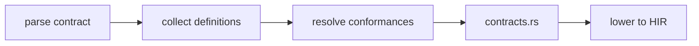
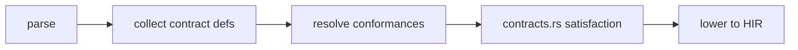
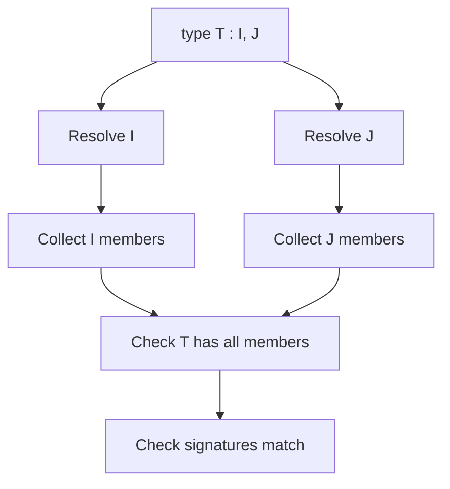

<!-- migrated from the legacy platform spec; canonical OpenSpec source -->
# Contracts Specification

## Purpose

Structural contract declarations, conformance lists, and embedding. Distinct from compiler Mod SDK contracts and from runtime requires/ensures (not in v0.1 grammar).

## Requirements

### Requirement: Contract declaration and embeddings
`contract Name { items }` MUST declare required members. Items MAY be method signatures (`T name(params);`) or embeddings (`OtherContract;`) that flatten member requirements. Types MUST declare implementation with a conformance list (`type T : I, J { … }`). Duplicate contract method names in one contract MUST error (**E1003**). Conflicting embedded contract methods MUST error (**E1004**).

#### Scenario: Duplicate method name in one contract
- **GIVEN** a `contract` that declares two methods with the same name
- **WHEN** the contract is validated
- **THEN** the compiler emits **E1003**

### Requirement: Conformance satisfaction and diagnostics
Implementing types MUST supply every required member with a compatible signature (**E1601**, **E1602**, **E1606**). Invalid conformance targets MUST error (**E1607**). All `Standard` types advertising conformance MUST pass contract satisfaction in the reference compiler.

#### Scenario: Missing required member
- **GIVEN** a type that lists a contract in its conformance list but omits a required member
- **WHEN** contract satisfaction checking runs
- **THEN** the compiler emits **E1601**, **E1602**, or **E1606**

### Requirement: Contract call dispatch
Contract calls MUST use static dispatch on the receiver’s type after conformance is proven. Contracts MAY be used as namespaces for static-style calls when the resolver provides contract-as-namespace fallback.

#### Scenario: Static dispatch after proven conformance
- **GIVEN** a receiver whose static type implements a contract containing method `M`
- **WHEN** `receiver.M(...)` is resolved
- **THEN** the callee is selected from the receiver’s static type without runtime virtual dispatch

## Informative Source Provenance

The records below preserve migration history and are not normative except where text was extracted into a requirement above.

### Source Record: Contracts

**Authority:** informative provenance  
**Legacy path:** `/platform-spec/language-meta/contracts-and-effects/contracts/`  
**Source:** `site/spec-content/platform-spec/language-meta/contracts-and-effects/contracts/content.md`  
**SHA-256:** `f815bcf08e502ec9140298b516ce723392de7433866ba8e445164a3e72d97966`

<details>
<summary>Migrated source text</summary>

``````markdown
## Normative specification

### Scope

Defines **`contract` declarations** — structural interfaces that types **implement** via conformance lists. This is distinct from **compiler Mod contracts** ([Compiler Mod SDK](/platform-spec/language-meta/metaprogramming/compiler-mod-sdk/)).

### Syntax

```beskid
contract Disposable
{
    unit Dispose();
}
```

- **`contract Name { items }`** declares required members.
- Items **may** be method signatures (`T name(params);`) or **embeddings** (`OtherContract;`) that flatten member requirements.
- Types declare implementation with **`type T : I, J { … }`**.

### Static rules

- Implementing types **must** supply every required member with compatible signature (**E1601**, **E1602**, **E1606**).
- Conflicting embedded contract methods **must** error (**E1004**).
- Duplicate contract method names in one contract **must** error (**E1003**).
- Invalid conformance targets **must** error (**E1607**).

### Dynamic semantics

- Contract calls use static dispatch on the receiver’s type after conformance is proven.
- Contracts **may** be used as namespaces for static-style calls when the resolver provides contract-as-namespace fallback.

### Diagnostics

Contract band **E1601–E1607**. Registry: [Diagnostic code registry](/platform-spec/compiler/semantic-pipeline/diagnostic-code-registry/).

### Conformance

All `Standard` types advertising conformance **must** pass contract satisfaction in the reference compiler.

## Decisions
<!-- spec:generate:adr-index -->
No ADRs published under **`adr/`** yet.
<!-- /spec:generate:adr-index -->
## Articles
<!-- spec:generate:article-index -->
- [Contracts - Contracts and edge cases](./articles/contracts-and-edge-cases/)
- [Contracts - Design model](./articles/design-model/)
- [Contracts - Examples](./articles/examples/)
- [Contracts - FAQ and troubleshooting](./articles/faq-and-troubleshooting/)
- [Contracts - Flow and algorithm](./articles/flow-and-algorithm/)
- [Contracts - Verification and traceability](./articles/verification-and-traceability/)
<!-- /spec:generate:article-index -->
``````

</details>

### Source Record: Contracts - Contracts and edge cases

**Authority:** informative provenance  
**Legacy path:** `/platform-spec/language-meta/contracts-and-effects/contracts/articles/contracts-and-edge-cases/`  
**Source:** `site/spec-content/platform-spec/language-meta/contracts-and-effects/contracts/articles/contracts-and-edge-cases/content.md`  
**SHA-256:** `5b9b2c2c3bcc839ebbb55e1ce3511e8835f43773a054f284c1ce4312b0048361`

<details>
<summary>Migrated source text</summary>

``````markdown
## Hard requirements

- **Structural contracts** — Checked structurally at compile time, not runtime interface tables.
- **Embedding composes requirements** — Contract embedding flattens member requirements without inheritance syntax.
- **No `requires`/`ensures` in v0.1** — Design-by-contract assertions are deferred.
- **Distinct from Mod SDK** — Compiler mod contracts follow the Mod SDK spec, not this surface.

## Diagnostic band E16xx

| Code | Condition |
| --- | --- |
| **E1601** | Contract method missing implementation |
| **E1602** | Contract implementation signature mismatch |
| **E1606** | Contract method not found (resolution) |
| **E1607** | Invalid conformance target |

## Edge cases

- **Empty contract** — A contract with no items is valid but useless unless used as a marker.
- **Self-conformance** — A type does not automatically conform to a contract it defines; explicit `: Contract` is required.
- **Generic contract** — Contracts may declare generic parameters; implementing types must match arity.
- **Contract method default body** — Not supported in v0.1; all contract methods are signatures only.

## Invariants

- Every type advertising conformance must pass contract satisfaction before lowering.
- Contract calls use static dispatch on the receiver's type after conformance is proven.
- Embedded contract conflicts must be detected at definition time, not at use time.
``````

</details>

### Source Record: Contracts - Design model

**Authority:** informative provenance  
**Legacy path:** `/platform-spec/language-meta/contracts-and-effects/contracts/articles/design-model/`  
**Source:** `site/spec-content/platform-spec/language-meta/contracts-and-effects/contracts/articles/design-model/content.md`  
**SHA-256:** `3fd2a218691681c31e35da641543f5c72978542914fe6b1dfce35912ff00c1d1`

<details>
<summary>Migrated source text</summary>

``````markdown
## Vocabulary

| Construct | Role |
| --- | --- |
| **`ContractDefinition`** | Declares required members (method signatures and embeddings) |
| **`ContractNode`** | Either a method signature or an embedded contract reference |
| **`ContractEmbedding`** | Flattened member requirements from another contract |
| **`ContractMethodSignature`** | Method signature without body inside a contract |

## Contract architecture

Contracts are **structural interfaces** checked at compile time. Types implement contracts via conformance lists (`: I, J`).



### Subsystem boundaries

| Subsystem | Responsibility | Key file |
| --- | --- | --- |
| Parser | Parse `contract` and `ContractNode` | `syntax/items/contract_definition.rs` |
| AST | Store contract structure | `syntax/items/contract_node.rs` |
| Resolver | Bind conformance targets | `resolve/` |
| Contract rules | Check satisfaction | `analysis/rules/staged/contracts.rs` |
| HIR lowering | Embed contract metadata | `hir/lowering/items.rs` |

## Embedding model

Contracts may embed other contracts (`OtherContract;` inside a contract body). This flattens member requirements without inheritance syntax. Conflicting embedded methods emit **E1004**.

## Distinction from Mod SDK

This user-language `contract` surface is distinct from compiler Mod SDK contracts. Mod contracts follow the [Compiler Mod SDK](/platform-spec/language-meta/metaprogramming/compiler-mod-sdk/) specification.
``````

</details>

### Source Record: Contracts - Examples

**Authority:** informative provenance  
**Legacy path:** `/platform-spec/language-meta/contracts-and-effects/contracts/articles/examples/`  
**Source:** `site/spec-content/platform-spec/language-meta/contracts-and-effects/contracts/articles/examples/content.md`  
**SHA-256:** `b24ae2d5b885bfd0588300207af8efbb5ab33b2ff5adf1227121da5f6dd0c619`

<details>
<summary>Migrated source text</summary>

``````markdown
## Basic contract

```beskid
contract Named {
    string Name();
}

type Person : Named {
    string name;

    pub string Name() {
        return name;
    }
}
```

## Contract embedding

```beskid
contract HasId {
    i32 Id();
}

contract Entity : HasId {
    string Name();
}

type Product : Entity {
    i32 id;
    string name;

    pub i32 Id() { return id; }
    pub string Name() { return name; }
}
```

## Conformance error

```beskid
contract Drawable {
    unit Draw();
}

// Missing Draw() — E1601
type Circle : Drawable {
    f32 radius;
}
```

## Signature mismatch

```beskid
contract Comparable {
    i32 CompareTo(other);
}

// Wrong return type — E1602
type Item : Comparable {
    pub bool CompareTo(Item other) {
        return false;
    }
}
```
``````

</details>

### Source Record: Contracts - FAQ and troubleshooting

**Authority:** informative provenance  
**Legacy path:** `/platform-spec/language-meta/contracts-and-effects/contracts/articles/faq-and-troubleshooting/`  
**Source:** `site/spec-content/platform-spec/language-meta/contracts-and-effects/contracts/articles/faq-and-troubleshooting/content.md`  
**SHA-256:** `365c3af177858a2eb57ab40e26c759aaf4b3833d6b646a20b5c891db521d21e8`

<details>
<summary>Migrated source text</summary>

``````markdown
## Locked decisions

| Decision | ID | Summary |
| --- | --- | --- |
| Structural contracts | D-LM-CON-001 | Nominal surfaces checked structurally |
| Embedding | D-LM-CON-002 | Composes requirements without inheritance |
| No `requires`/`ensures` | D-LM-CON-003 | Deferred to future version |
| Distinct from Mod SDK | D-LM-CON-004 | Mod contracts follow SDK spec |

## FAQ

### Can a contract have a default method body?

No. Contract items are signatures only in v0.1. Default bodies may be added in a future version.

### What is the difference between `contract` and `interface`?

Beskid uses `contract` as the keyword. The concept is similar to interfaces in other languages, but checked structurally at compile time.

### Can I embed multiple contracts?

Yes. A contract may embed multiple other contracts. Conflicting method names from embedded contracts emit **E1004**.

## Troubleshooting

| Symptom | Likely cause |
| --- | --- |
| **E1601** | Type missing a required contract method |
| **E1602** | Contract method signature does not match implementation |
| **E1004** | Two embedded contracts define the same method |
| **E1607** | Conformance target is not a contract |
| **E1003** | Duplicate method name inside one contract |
``````

</details>

### Source Record: Contracts - Flow and algorithm

**Authority:** informative provenance  
**Legacy path:** `/platform-spec/language-meta/contracts-and-effects/contracts/articles/flow-and-algorithm/`  
**Source:** `site/spec-content/platform-spec/language-meta/contracts-and-effects/contracts/articles/flow-and-algorithm/content.md`  
**SHA-256:** `049521e9e1644eb7c154ba217e1b558eaf646cc346c14c99b800e1af5e60cdf3`

<details>
<summary>Migrated source text</summary>

``````markdown
## Compile pipeline placement



## Contract satisfaction algorithm (normative)

1. **Parse contract definitions** — `ContractDefinition` stores `name`, `items` (method signatures + embeddings), and per-item docs.
2. **Collect contract nodes** — `ContractNode` enum distinguishes `MethodSignature` from `Embedding`.
3. **Resolve conformance lists** — For each `type T : I, J { }`, resolve `I` and `J` to actual contract definitions. `ResolveInvalidConformanceTarget` (**E1607**) for invalid targets.
4. **Check member presence** — For each required contract method, verify the implementing type declares a method with the same name. `ContractMethodMissingImplementation` (**E1601**) otherwise.
5. **Check signature compatibility** — Compare parameter and return types. `ContractImplementationSignatureMismatch` (**E1602**) if they differ.
6. **Check embedding conflicts** — If two embedded contracts define the same method name, `ConflictingEmbeddedContractMethod` (**E1004**) fires.
7. **Check duplicate contract methods** — `DuplicateContractMethod` (**E1003**) for duplicate names within one contract.

## Conformance list processing



## LSP / incremental

Re-run contract checking when contract definitions, type conformances, or method signatures change.
``````

</details>

### Source Record: Contracts - Verification and traceability

**Authority:** informative provenance  
**Legacy path:** `/platform-spec/language-meta/contracts-and-effects/contracts/articles/verification-and-traceability/`  
**Source:** `site/spec-content/platform-spec/language-meta/contracts-and-effects/contracts/articles/verification-and-traceability/content.md`  
**SHA-256:** `abe52307a47af3c9f2c31c75c90d0b8728be8d24919139ecdb7177cdc8670d9b`

<details>
<summary>Migrated source text</summary>

``````markdown
## Verification matrix

| Scenario | Expected evidence |
| --- | --- |
| Contract with method signatures | Parses; AST round-trip correct |
| Type conforms to contract | Compiles; no diagnostic |
| Missing implementation | **E1601** emitted |
| Signature mismatch | **E1602** emitted |
| Embedding conflict | **E1004** emitted |
| Invalid conformance target | **E1607** emitted |

## Implementation checklist

- [x] Grammar: `contract`, method signatures, embeddings
- [x] AST: `ContractDefinition`, `ContractNode`, `ContractMethodSignature`
- [x] Parser: `beskid.pest` productions for contract items
- [x] Resolver: conformance target resolution
- [x] Contract rules: satisfaction checking in `contracts.rs`
- [x] Diagnostics: **E1601**, **E1602**, **E1606**, **E1607**, **E1003**, **E1004**
- [ ] Generic contract conformance
- [ ] Contract method default bodies (deferred)

## Test locations

- `compiler/crates/beskid_analysis/src/syntax/items/contract_definition.rs` — parser tests
- `compiler/crates/beskid_analysis/src/analysis/rules/staged/contracts.rs` — satisfaction tests
- `compiler/crates/beskid_tests` — integration tests for contracts
``````

</details>
