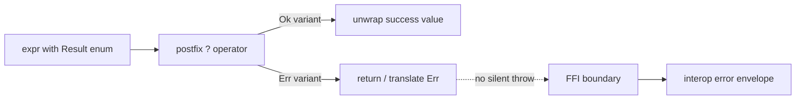
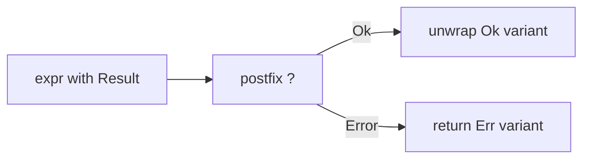
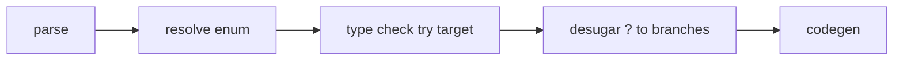

<!-- migrated from the legacy platform spec; canonical OpenSpec source -->
# Error handling Specification

## Purpose

Representing and propagating failures (`Result`, `try`, unwinding policy). Runtime lowering shares the ABI error envelope described in Execution.

## Requirements

### Requirement: Error handling conformance status
This capability SHALL remain non-conformant and MUST NOT be cited as an implemented Beskid guarantee until a validated OpenSpec change adds explicit behavioral requirements.

**Stable ID:** `BSP-REQ-B7BF2F346128`

#### Scenario: Capability has descriptive material only
- **GIVEN** the migrated sources contain no uppercase BCP-14 obligation or accepted ADR decision
- **WHEN** an implementation reports Beskid conformance
- **THEN** it MUST NOT claim conformance based on this capability

## Informative Source Provenance

The records below preserve migration history and are not normative except where text was extracted into a requirement above.

### Source Record: Error handling

**Authority:** informative provenance  
**Legacy path:** `/platform-spec/language-meta/contracts-and-effects/error-handling/`  
**Source:** `site/spec-content/platform-spec/language-meta/contracts-and-effects/error-handling/content.md`  
**SHA-256:** `301e5c0997a115d2c637f729483a65473bfba681786eecb065df8ee3bedb89ad`

<details>
<summary>Migrated source text</summary>

``````markdown
## Error propagation flow



## Normative specification

### Scope

Defines how **recoverable failures** are represented and propagated in user code. ABI envelopes and unwind across FFI are in interop and execution chapters.

### `Result`, `Option<T>`, and enums

- Recoverable errors **should** use **`Core.Results.Result<TValue, TError>`** from corelib when the project links **Std** (prelude exposes `Core.Results`).
- In **App** projects with implicit **Std**, the assembly module path is **`Std::Core::Results`** (source may write ``Std.Core.Results.Result<i32, string>``); inside corelib shards the path remains ``Core.Results.Result<_, _>``.
- There is **no** built-in `Result<T,E>` type alias in v0.1 grammar; use the corelib generic enum with explicit type arguments.
- Projects **must not** define a second bare `enum Result` in the same scope as Std; use the corelib type or a distinct name.
- **Absence of value** (not failure) **must** use `Option<T>`, not `null` or sentinel pointers (**must** align with [Types](/platform-spec/language-meta/type-system/types/)).

### `try` postfix operator

- Postfix `expr?` (`TryOperator`) **must** apply only where the surrounding function or lambda declares a compatible error propagation target.
- Operand type **must** be a `Result`-shaped enum (typically ``Core.Results.Result<_, _>`` with `Ok` / `Error` variants); otherwise **invalid try target** (**E12xx** family in reference compiler).
- Successful path **must** unwrap the success payload type into the expression context; failure path **must** return or translate to the enclosing error type.
- Lowering **must** desugar `?` using the **resolved scrutinee enum** (variant names from that enum), not hard-coded identifier strings.
- **Analyze**, **compile** (`run` / `build`), and **LSP** **must** share the same typed-HIR spine: resolve, normalize (including `?` desugar), re-resolve, then type-check.

### Static rules

- `try` **must not** appear on non-enum/non-result expressions.
- Panic or abort semantics **are not** language keywords in v0.1; unrecoverable failures use host/runtime policies.

### Dynamic semantics

- Error propagation **must not** implicitly allocate; lowering rewrites `?` to branch sequences.
- FFI boundaries **must** map errors per [Interop contracts](/platform-spec/language-meta/interop/interop-contracts/) — no silent cross-language exceptions unless documented.

### Diagnostics

**InvalidTryTarget** and type mismatch on unwrap paths. Registry: [Diagnostic code registry](/platform-spec/compiler/semantic-pipeline/diagnostic-code-registry/).

### Conformance

Programs using `?` **must** compile only when propagation types align; reference tests cover try lowering.

## Decisions
<!-- spec:generate:adr-index -->
No ADRs published under **`adr/`** yet.
<!-- /spec:generate:adr-index -->
## Articles
<!-- spec:generate:article-index -->
- [Error handling - Contracts and edge cases](./articles/contracts-and-edge-cases/)
- [Error handling - Design model](./articles/design-model/)
- [Error handling - Examples](./articles/examples/)
- [Error handling - FAQ and troubleshooting](./articles/faq-and-troubleshooting/)
- [Error handling - Flow and algorithm](./articles/flow-and-algorithm/)
- [Error handling - Verification and traceability](./articles/verification-and-traceability/)
<!-- /spec:generate:article-index -->
``````

</details>

### Source Record: Error handling - Contracts and edge cases

**Authority:** informative provenance  
**Legacy path:** `/platform-spec/language-meta/contracts-and-effects/error-handling/articles/contracts-and-edge-cases/`  
**Source:** `site/spec-content/platform-spec/language-meta/contracts-and-effects/error-handling/articles/contracts-and-edge-cases/content.md`  
**SHA-256:** `ef2904f65daa1ed769c4d1ef9932868aa850c4a49c14825b49f715cacc2e10d3`

<details>
<summary>Migrated source text</summary>

``````markdown
## Hard requirements

- **Enum-first errors** — Explicit sum types over magic result types.
- **No exceptions keyword** — Cross-language unwinding is interop-scoped, not a Beskid `throw` statement.
- **`Option` vs `Result`** — `Option<T>` models missing data; `Result`-shaped enums model failures.
- **Postfix `?` only** — No `try` statement form in v0.1.

## Diagnostic band

| Code | Condition |
| --- | --- |
| **E1222** | Invalid try target (not a Result-shaped enum) |

## Edge cases

- **Nested `?`** — `expr?.field?` is valid if both operands are Result-shaped; each `?` desugars independently.
- **`?` in lambda** — The failure path returns from the lambda, not the enclosing function.
- **`?` without enclosing return type** — If the surrounding function does not declare a compatible error type, the desugared `return` may fail type checking.
- **Non-Result enums** — A user-defined enum with `Ok`/`Error` variants is accepted as a try target if it matches the expected shape.

## Invariants

- `?` lowering must not implicitly allocate; it rewrites to branch sequences.
- FFI boundaries must map errors per interop contracts — no silent cross-language exceptions.
- Analyze, compile, and LSP must share the same typed-HIR spine.
``````

</details>

### Source Record: Error handling - Design model

**Authority:** informative provenance  
**Legacy path:** `/platform-spec/language-meta/contracts-and-effects/error-handling/articles/design-model/`  
**Source:** `site/spec-content/platform-spec/language-meta/contracts-and-effects/error-handling/articles/design-model/content.md`  
**SHA-256:** `af44086026e4a72c6002f122ddb67096711828f1d4ecd1779cf2daffaa96f5eb`

<details>
<summary>Migrated source text</summary>

``````markdown
## Vocabulary

| Construct | Role |
| --- | --- |
| **`TryExpression`** | Postfix `expr?` operator for error propagation |
| **`Result<TValue, TError>`** | Corelib generic enum with `Ok` and `Error` variants |
| **`Option<T>`** | Corelib generic enum for absence (not failure) |

## Error propagation architecture



Beskid uses **explicit sum types** for recoverable errors. There is no `throw` keyword or exception mechanism in v0.1.

### Subsystem boundaries

| Subsystem | Responsibility | Key file |
| --- | --- | --- |
| Parser | Parse `expr?` as `TryExpression` | `syntax/expressions/try_expression.rs` |
| AST | Store try operator structure | `syntax/expressions/expression.rs` |
| Type checker | Validate try target is Result-shaped | `types/context/expressions.rs` |
| HIR lowering | Desugar `?` to branch sequences | `hir/normalize/expressions.rs` |
| Codegen | Emit branch instructions | `beskid_codegen` |

## `Result` vs `Option`

- `Result<TValue, TError>` models **recoverable failure**.
- `Option<T>` models **absence of value** (not failure).
- Do not conflate them.

## Postfix `?` only

Error propagation uses `expr?` only. There is no `try` statement form in v0.1.
``````

</details>

### Source Record: Error handling - Examples

**Authority:** informative provenance  
**Legacy path:** `/platform-spec/language-meta/contracts-and-effects/error-handling/articles/examples/`  
**Source:** `site/spec-content/platform-spec/language-meta/contracts-and-effects/error-handling/articles/examples/content.md`  
**SHA-256:** `3f662b758bde05b7ea572edfaa49b09bc84f59a371bb8eb33fac3e32bf7d68e3`

<details>
<summary>Migrated source text</summary>

``````markdown
## Basic try propagation

```beskid
unit ReadFile(string path) -> Core.Results.Result<string, string> {
    let content = File.ReadAllText(path)?;
    return Core.Results.Ok(content);
}
```

## Manual match (without `?`)

```beskid
unit ReadFileManual(string path) -> Core.Results.Result<string, string> {
    let result = File.ReadAllText(path);
    match result {
        Core.Results.Ok(v) => return Core.Results.Ok(v);
        Core.Results.Error(e) => return Core.Results.Error(e);
    }
}
```

## Option for absence

```beskid
unit Find(i32[] values, i32 target) -> Core.Results.Option<i32> {
    for v in values {
        if (v == target) {
            return Core.Results.Some(v);
        }
    }
    return Core.Results.None;
}
```

## Chained `?`

```beskid
unit LoadConfig(string path) -> Core.Results.Result<Config, string> {
    let text = File.ReadAllText(path)?;
    let parsed = Parser.Parse(text)?;
    return Core.Results.Ok(parsed);
}
```
``````

</details>

### Source Record: Error handling - FAQ and troubleshooting

**Authority:** informative provenance  
**Legacy path:** `/platform-spec/language-meta/contracts-and-effects/error-handling/articles/faq-and-troubleshooting/`  
**Source:** `site/spec-content/platform-spec/language-meta/contracts-and-effects/error-handling/articles/faq-and-troubleshooting/content.md`  
**SHA-256:** `ffc835997ad764bc37619a55d41dfb279d056ff3fd363dadf935009946b77ff1`

<details>
<summary>Migrated source text</summary>

``````markdown
## Locked decisions

| Decision | ID | Summary |
| --- | --- | --- |
| Enum-first errors | D-LM-ERR-001 | Explicit sum types over magic results |
| No exceptions keyword | D-LM-ERR-002 | Interop-scoped unwinding only |
| `Option` vs `Result` | D-LM-ERR-003 | Separate absence and failure |
| Postfix `?` only | D-LM-ERR-004 | No `try` statement form |

## FAQ

### Why no `try`/`catch`?

Beskid prefers explicit sum types. The `?` operator provides ergonomic propagation without hidden control flow. Cross-language unwinding is handled at FFI boundaries.

### Can I use `?` on `Option<T>`?

In v0.1, `?` expects a Result-shaped enum. Using it on `Option<T>` emits **E1222** unless `Option` is made Result-compatible.

### What happens on `?` in a `unit` function?

The desugared `return` must match the function's return type. If the function returns `unit`, `?` on a Result type fails type checking.

## Troubleshooting

| Symptom | Likely cause |
| --- | --- |
| **E1222** | `?` applied to non-Result expression |
| Type mismatch after `?` | Enclosing return type incompatible with Error variant |
| `?` in `unit` function | Cannot return Error from `unit` function |
``````

</details>

### Source Record: Error handling - Flow and algorithm

**Authority:** informative provenance  
**Legacy path:** `/platform-spec/language-meta/contracts-and-effects/error-handling/articles/flow-and-algorithm/`  
**Source:** `site/spec-content/platform-spec/language-meta/contracts-and-effects/error-handling/articles/flow-and-algorithm/content.md`  
**SHA-256:** `f469570cb6b971630a6d7619028426eeda4b27094f8997992889d8a97b80abb9`

<details>
<summary>Migrated source text</summary>

``````markdown
## Compile pipeline placement



## Try expression algorithm (normative)

1. **Parse try expression** — `expr?` becomes `TryExpression { expr }`.
2. **Type-check operand** — The operand must be a `Result`-shaped enum (typically `Core.Results.Result<_, _>` with `Ok` / `Error` variants).
3. **Validate try target** — `TypeInvalidTryTarget` (**E1222**) if the operand is not a Result-shaped enum.
4. **Infer success payload** — On the `Ok` path, unwrap the success payload type into the expression context.
5. **Infer failure path** — On the `Error` path, return or translate to the enclosing error type.
6. **Desugar in HIR** — Lowering rewrites `?` using the resolved scrutinee enum (variant names from that enum), not hard-coded identifier strings.
7. **Re-resolve after desugar** — The typed-HIR spine runs resolve, normalize (including `?` desugar), re-resolve, then type-check.

## Lowering `?` to branches

```mermaid
flowchart TB
    try[expr?]
    temp[let temp = expr]
    match[match temp]
    ok[Ok(v) => v]
    err[Error(e) => return Error(e)]
    try --> temp --> match --> ok
    match --> err
```

## LSP / incremental

Re-run try expression checking when the operand expression type or the enclosing function return type changes.
``````

</details>

### Source Record: Error handling - Verification and traceability

**Authority:** informative provenance  
**Legacy path:** `/platform-spec/language-meta/contracts-and-effects/error-handling/articles/verification-and-traceability/`  
**Source:** `site/spec-content/platform-spec/language-meta/contracts-and-effects/error-handling/articles/verification-and-traceability/content.md`  
**SHA-256:** `3b4ab7b6db59b8f9bbf00500f98aba38fd7cc06feea0a647f641df37014fe83a`

<details>
<summary>Migrated source text</summary>

``````markdown
## Verification matrix

| Scenario | Expected evidence |
| --- | --- |
| `expr?` on Result | Compiles; desugars to branches |
| `expr?` on non-Result | **E1222** emitted |
| `?` in lambda | Failure returns from lambda |
| Manual `match` on Result | Compiles; all arms type-checked |

## Implementation checklist

- [x] Grammar: postfix `?` operator
- [x] AST: `TryExpression`
- [x] Parser: `beskid.pest` production for try
- [x] Type checker: `TypeInvalidTryTarget` (**E1222**)
- [x] HIR lowering: `?` desugar to branch sequences
- [ ] Full `Result` corelib integration
- [ ] FFI error envelope mapping

## Test locations

- `compiler/crates/beskid_analysis/src/syntax/expressions/try_expression.rs` — parser tests
- `compiler/crates/beskid_analysis/src/types/context/expressions.rs` — try typing tests
- `compiler/crates/beskid_tests` — integration tests for error handling
``````

</details>
