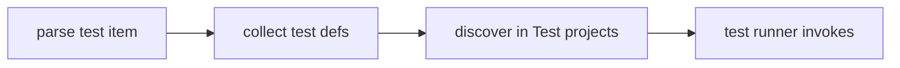
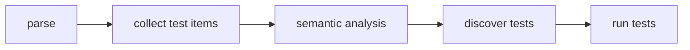

<!-- migrated from the legacy platform spec; canonical OpenSpec source -->
# Testing Specification

## Purpose

The language-level test harness, discovery, and assertions users rely on. Corelib testing helpers extend but do not redefine these semantics.

## Requirements

### Requirement: Test item syntax
`test Name { body }` MUST declare a test entry point; the identifier is followed directly by the test body block with no parameter list. `meta { key = expr; }` sections MAY attach metadata parsed as `TestMetaSection`. `skip { key = expr; }` sections MUST mark conditional skip predicates. Test bodies MUST contain only statements and meta/skip sections allowed by `TestBodyItem`.

#### Scenario: Valid test declaration
- **GIVEN** a `test Case { meta { timeout = 30; } /* statements */ }` item
- **WHEN** the item is parsed
- **THEN** the compiler accepts it as a test entry point with metadata

### Requirement: Test discovery and execution semantics
`beskid test` MUST discover all `test` items in Test projects matching this syntax. The test runner MUST invoke each discovered test entrypoint in isolation unless `meta` specifies shared fixtures. Failed assertions MUST report as test failures without undefined behavior. Skipped tests MUST NOT count as failures when skip predicates evaluate true. Tests MAY appear in Test project kinds; placement in App/Lib projects SHOULD warn per manifest policy.

#### Scenario: Skip predicate true
- **GIVEN** a test with a `skip` section whose predicate evaluates true
- **WHEN** the test runner executes the suite
- **THEN** the test is reported as skipped and does not count as a failure

## Informative Source Provenance

The records below preserve migration history and are not normative except where text was extracted into a requirement above.

### Source Record: Testing

**Authority:** informative provenance  
**Legacy path:** `/platform-spec/language-meta/contracts-and-effects/testing/`  
**Source:** `site/spec-content/platform-spec/language-meta/contracts-and-effects/testing/content.md`  
**SHA-256:** `7b3fd1e0ca11898d7ea5047363e052b70d837686dbd7079c9042d599d38b7d95`

<details>
<summary>Migrated source text</summary>

``````markdown
## Normative specification

### Scope

Defines the **`test`** item, discovery metadata, and skip rules for language-level tests. Harness execution is realized by tooling and corelib helpers.

### Syntax

```beskid
test MyCase {
    meta { timeout = 30; }
    // statements
}
```

- **`test Name { body }`** declares a test entry point; the identifier is followed directly by the test body block (no parameter list).
- **`meta { key = expr; }`** sections attach metadata (timeouts, categories) parsed as `TestMetaSection`.
- **`skip { key = expr; }`** sections mark conditional skip predicates.

### Static rules

- Test bodies **must** contain only statements and meta/skip sections allowed by `TestBodyItem`.
- Tests **may** appear in **Test** project kinds; placement in App/Lib projects **should** warn per manifest policy.
- Attributes on tests follow the general attribute rules (**E1508–E1510**).

### Dynamic semantics

- The test runner **must** invoke each discovered test entrypoint in isolation unless `meta` specifies shared fixtures (future).
- Failed assertions **must** report as test failures without undefined behavior.
- Skipped tests **must not** count as failures when skip predicates evaluate true.

### Diagnostics

Attribute and visibility issues use **E15xx**; test-specific codes **may** be added in the registry band reserved for tooling.

### Conformance

`beskid test` (tooling) **must** discover all `test` items in Test projects matching this syntax.

## Decisions
<!-- spec:generate:adr-index -->
No ADRs published under **`adr/`** yet.
<!-- /spec:generate:adr-index -->
## Articles
<!-- spec:generate:article-index -->
- [Testing - Contracts and edge cases](./articles/contracts-and-edge-cases/)
- [Testing - Design model](./articles/design-model/)
- [Testing - Examples](./articles/examples/)
- [Testing - FAQ and troubleshooting](./articles/faq-and-troubleshooting/)
- [Testing - Flow and algorithm](./articles/flow-and-algorithm/)
- [Testing - Verification and traceability](./articles/verification-and-traceability/)
<!-- /spec:generate:article-index -->
``````

</details>

### Source Record: Testing - Contracts and edge cases

**Authority:** informative provenance  
**Legacy path:** `/platform-spec/language-meta/contracts-and-effects/testing/articles/contracts-and-edge-cases/`  
**Source:** `site/spec-content/platform-spec/language-meta/contracts-and-effects/testing/articles/contracts-and-edge-cases/content.md`  
**SHA-256:** `c4349c60c1d5999b4dd56812f07b47474524dec9c0dbd900403939aa3425426e`

<details>
<summary>Migrated source text</summary>

``````markdown
## Hard requirements

- **First-class `test` item** — Tests are module items, not attributes on functions only.
- **Meta/skip blocks** — Structured sections replace ad hoc comment conventions.
- **Test project kind** — Discovery should scope to `Test` projects unless manifest policy allows otherwise.
- **Corelib helpers are additive** — Assertion helpers in corelib must not redefine language-level `test` syntax.

## Diagnostic band E15xx

| Code | Condition |
| --- | --- |
| **E1508** | Duplicate attribute declaration target |
| **E1509** | Unknown attribute declaration target |
| **E1510** | Attribute target not allowed |

## Edge cases

- **Empty test body** — `test Empty { }` is valid; it passes immediately.
- **Multiple meta sections** — Only one `meta` section is parsed per test; duplicates are not supported.
- **Skip predicate failure** — If a skip predicate expression fails to evaluate, the test should be skipped conservatively.
- **Test in Lib project** — May warn depending on manifest policy; does not error.

## Invariants

- Test bodies must contain only statements and meta/skip sections allowed by `TestBodyItem`.
- Attributes on tests follow the general attribute rules.
- `beskid test` must discover all `test` items in matching `Test` projects.
``````

</details>

### Source Record: Testing - Design model

**Authority:** informative provenance  
**Legacy path:** `/platform-spec/language-meta/contracts-and-effects/testing/articles/design-model/`  
**Source:** `site/spec-content/platform-spec/language-meta/contracts-and-effects/testing/articles/design-model/content.md`  
**SHA-256:** `beca346a4f2f7d71b9d4f7b6e8ddb405c2beed339131d9fa428af6308bd38668`

<details>
<summary>Migrated source text</summary>

``````markdown
## Vocabulary

| Construct | Role |
| --- | --- |
| **`TestDefinition`** | `test Name { body }` item with optional meta/skip |
| **`TestMetaSection`** | `meta { key = expr; }` inside test body |
| **`TestSkipSection`** | `skip { key = expr; }` conditional skip predicates |
| **`TestMetadataEntry`** | Single `name = expr` entry in meta or skip |

## Test architecture

Tests are **first-class module items**, not attributes on functions. The compiler parses them into dedicated AST nodes.



### Subsystem boundaries

| Subsystem | Responsibility | Key file |
| --- | --- | --- |
| Parser | Parse `test`, `meta`, `skip` | `syntax/items/test_definition.rs` |
| AST | Store test structure | `syntax/items/test_definition.rs` |
| Formatter | Emit test items | `format/items/tests_emit.rs` |
| Tooling | Discover and run tests | `beskid test` CLI |

## Test project kind

Tests should appear in `Test` projects. Placement in `App`/`Lib` projects may warn per manifest policy.

## Meta and skip sections

- `meta { timeout = 30; }` attaches metadata parsed as `TestMetaSection`.
- `skip { condition = expr; }` marks conditional skip predicates.
- Both use `TestMetadataEntry` nodes with `Identifier` name and `Expression` value.
``````

</details>

### Source Record: Testing - Examples

**Authority:** informative provenance  
**Legacy path:** `/platform-spec/language-meta/contracts-and-effects/testing/articles/examples/`  
**Source:** `site/spec-content/platform-spec/language-meta/contracts-and-effects/testing/articles/examples/content.md`  
**SHA-256:** `b9855bc176c02498061e232d0c86bc44064f7ea09dede4c513be093b24fcfd1b`

<details>
<summary>Migrated source text</summary>

``````markdown
## Basic test

```beskid
test AdditionWorks {
    let result = 2 + 2;
    Assert.Equal(4, result);
}
```

## Test with metadata

```beskid
test SlowDatabaseQuery {
    meta { timeout = 30; }
    let rows = Database.Query("SELECT * FROM users");
    Assert.GreaterThan(0, rows.Length);
}
```

## Conditional skip

```beskid
test WindowsOnlyFeature {
    skip { platform = "windows"; }
    let handle = WinApi.CreateWindow();
    Assert.NotNull(handle);
}
```

## Multiple tests in one file

```beskid
test EmptyArray {
    let arr = i32[] {};
    Assert.Equal(0, arr.Length);
}

test ArrayAppend {
    let arr = i32[] { 1, 2 };
    // arr.Append(3);
    // Assert.Equal(3, arr.Length);
}
```
``````

</details>

### Source Record: Testing - FAQ and troubleshooting

**Authority:** informative provenance  
**Legacy path:** `/platform-spec/language-meta/contracts-and-effects/testing/articles/faq-and-troubleshooting/`  
**Source:** `site/spec-content/platform-spec/language-meta/contracts-and-effects/testing/articles/faq-and-troubleshooting/content.md`  
**SHA-256:** `0859aa4e3f442e961b578e93590803d50c6e24631f5a6319e3640f0dfbba0714`

<details>
<summary>Migrated source text</summary>

``````markdown
## Locked decisions

| Decision | ID | Summary |
| --- | --- | --- |
| First-class `test` item | D-LM-TST-001 | Tests are module items |
| Meta/skip blocks | D-LM-TST-002 | Structured sections replace comments |
| Test project kind | D-LM-TST-003 | Discovery scopes to `Test` projects |
| Corelib helpers additive | D-LM-TST-004 | Corelib does not redefine `test` syntax |

## FAQ

### Can I put tests in a Lib project?

It may warn depending on manifest policy. Use a `Test` project for dedicated test code.

### What assertion library should I use?

Corelib provides assertion helpers. The language-level `test` syntax is independent of any specific assertion library.

### How do I skip a test conditionally?

Use the `skip` section with a predicate expression:
```beskid
test WindowsOnly {
    skip { platform = "windows"; }
    // ...
}
```

## Troubleshooting

| Symptom | Likely cause |
| --- | --- |
| Test not discovered | Project kind is not `Test` |
| **E1508–E1510** | Invalid attribute on test item |
| Skip not working | Predicate expression evaluation failure |
``````

</details>

### Source Record: Testing - Flow and algorithm

**Authority:** informative provenance  
**Legacy path:** `/platform-spec/language-meta/contracts-and-effects/testing/articles/flow-and-algorithm/`  
**Source:** `site/spec-content/platform-spec/language-meta/contracts-and-effects/testing/articles/flow-and-algorithm/content.md`  
**SHA-256:** `89849d3226d16c2fb739e45db51996baead77f9afc5ba7806818fb6036193351`

<details>
<summary>Migrated source text</summary>

``````markdown
## Compile pipeline placement



## Test parsing algorithm (normative)

1. **Parse test item** — `test Name { body }` becomes `TestDefinition` with `name`, `meta`, `skip`, and `statements`.
2. **Parse meta section** — `meta { timeout = 30; }` becomes `TestMetaSection` with `TestMetadataEntry` items.
3. **Parse skip section** — `skip { condition = expr; }` becomes `TestSkipSection` with `TestMetadataEntry` items.
4. **Parse body statements** — Remaining items in the test body are parsed as `Statement` nodes with optional leading docs.
5. **Collect definitions** — `TestDefinition` nodes are collected alongside other items in the module.

## Discovery algorithm

1. **Filter by project kind** — `beskid test` scopes discovery to `Test` projects unless manifest policy allows otherwise.
2. **Walk module items** — Collect all `TestDefinition` nodes from parsed programs.
3. **Evaluate skip predicates** — For each test with a `skip` section, evaluate the predicate expression. If true, skip the test.
4. **Invoke in isolation** — The test runner invokes each discovered test entrypoint in isolation unless `meta` specifies shared fixtures (future).

## Execution model

- Failed assertions report as test failures without undefined behavior.
- Skipped tests do not count as failures when skip predicates evaluate true.
- Corelib testing helpers extend but do not redefine language-level `test` syntax.
``````

</details>

### Source Record: Testing - Verification and traceability

**Authority:** informative provenance  
**Legacy path:** `/platform-spec/language-meta/contracts-and-effects/testing/articles/verification-and-traceability/`  
**Source:** `site/spec-content/platform-spec/language-meta/contracts-and-effects/testing/articles/verification-and-traceability/content.md`  
**SHA-256:** `cc9935b46fc829fb13d650e40027db05703a02743afdd552ae0712c82050bc76`

<details>
<summary>Migrated source text</summary>

``````markdown
## Verification matrix

| Scenario | Expected evidence |
| --- | --- |
| `test` item parsing | AST round-trip preserves structure |
| `meta` section | Parsed as `TestMetaSection` |
| `skip` section | Parsed as `TestSkipSection` |
| Test discovery | `beskid test` finds all tests in Test project |
| Skip predicate true | Test skipped; not counted as failure |

## Implementation checklist

- [x] Grammar: `test`, `meta`, `skip`
- [x] AST: `TestDefinition`, `TestMetaSection`, `TestSkipSection`, `TestMetadataEntry`
- [x] Parser: `beskid.pest` productions for test items
- [x] Formatter: `tests_emit.rs` for pretty-printing tests
- [x] Diagnostics: **E1508–E1510** for attribute issues
- [ ] Test runner integration with `beskid test`
- [ ] Skip predicate evaluation at runtime
- [ ] Timeout enforcement from `meta`

## Test locations

- `compiler/crates/beskid_analysis/src/syntax/items/test_definition.rs` — parser tests
- `compiler/crates/beskid_analysis/src/format/items/tests_emit.rs` — formatter tests
- `compiler/crates/beskid_tests` — integration tests for test syntax
``````

</details>
