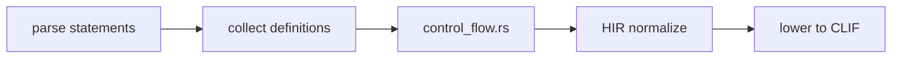
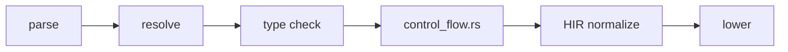

<!-- migrated from the legacy platform spec; canonical OpenSpec source -->
# Control flow Specification

## Purpose

Conditionals, loops, and structured control transfer. Lowering to HIR/CLIF follows the evaluation order defined here.

## Requirements

### Requirement: Conditional and loop statement typing
`if (cond) block else block` and `while (cond) block` MUST require `cond` to be `bool`. `for id in expr block` MUST require `expr` to be iterable per type rules (v0.1: range and array-like forms as implemented). `return expr?;` MUST return from the innermost function and `expr` MUST match the return type when present.

#### Scenario: Non-bool if condition
- **GIVEN** an `if` whose condition expression is not `bool`
- **WHEN** control-flow typing runs
- **THEN** the compiler emits a non-bool condition diagnostic

### Requirement: Break continue and evaluation order
`break;` and `continue;` MUST appear inside a loop; otherwise the compiler MUST emit **E1401** / **E1402**. Function arguments MUST be evaluated left to right before the call. Binary operators `&&` and `||` MUST evaluate the left operand before the right with short-circuit semantics. Assignment MUST evaluate the right-hand side before storing. `break` MUST exit the innermost `while`/`for`; `continue` MUST jump to the next iteration.

#### Scenario: Break outside loop
- **GIVEN** a `break;` statement that is not nested in a `while` or `for`
- **WHEN** control-flow checking runs
- **THEN** the compiler emits **E1401**

### Requirement: Control-flow HIR normalization
HIR lowering MUST normalize control flow graphs (**E1154** if non-normalized). Unreachable code after unconditional transfer MAY warn (**W1403**). L3 semantic tests for break/continue and return paths MUST pass.

#### Scenario: Non-normalized control-flow graph
- **GIVEN** HIR that fails control-flow normalization
- **WHEN** lowering validates the CFG
- **THEN** the compiler emits **E1154**

## Informative Source Provenance

The records below preserve migration history and are not normative except where text was extracted into a requirement above.

### Source Record: Control flow

**Authority:** informative provenance  
**Legacy path:** `/platform-spec/language-meta/evaluation/control-flow/`  
**Source:** `site/spec-content/platform-spec/language-meta/evaluation/control-flow/content.md`  
**SHA-256:** `15c7154b9e99843b18d9a524b49f6469f44277f1b04aa84104cd7a24372028ae`

<details>
<summary>Migrated source text</summary>

``````markdown
## Normative specification

### Scope

Defines **statement-level control flow** and structured transfer. Expression-level `match` is in [Enums and match](/platform-spec/language-meta/type-system/enums-and-match/).

### Statements

| Construct | Rule |
| --- | --- |
| **`if (cond) block else block`** | `cond` **must** be `bool` (**non-bool condition** diagnostic) |
| **`while (cond) block`** | `cond` **must** be `bool`; body may loop |
| **`for id in expr block`** | `expr` **must** be iterable per type rules (v0.1: range and array-like forms as implemented) |
| **`return expr?;`** | Returns from the innermost function; `expr` **must** match return type when present |
| **`break;` / `continue;`** | **Must** appear inside a loop; otherwise **E1401** / **E1402** |
| **`let` / typed `let`** | Introduces locals; see [Type inference](/platform-spec/language-meta/type-system/type-inference/) |

### Evaluation order

- Function arguments **must** be evaluated left to right before the call.
- Binary operators **must** evaluate left operand before right for `&&` and `||` with short-circuit semantics.
- Assignment **must** evaluate the right-hand side before storing.

### Static rules

- Unreachable code after unconditional transfer **may** warn (**W1403**).
- HIR lowering **must** normalize control flow graphs (**E1154** if non-normalized).

### Dynamic semantics

- `if` and `while` execute the taken branch block sequentially.
- `break` exits the innermost `while`/`for`; `continue` jumps to the next iteration.

### Diagnostics

Control band **E1401–E1403**; bool condition errors in type band. Registry: [Diagnostic code registry](/platform-spec/compiler/semantic-pipeline/diagnostic-code-registry/).

### Conformance

**L3** semantic tests for break/continue and return paths **must** pass.

## Decisions
<!-- spec:generate:adr-index -->
No ADRs published under **`adr/`** yet.
<!-- /spec:generate:adr-index -->
## Articles
<!-- spec:generate:article-index -->
- [Control flow - Contracts and edge cases](./articles/contracts-and-edge-cases/)
- [Control flow - Design model](./articles/design-model/)
- [Control flow - Examples](./articles/examples/)
- [Control flow - FAQ and troubleshooting](./articles/faq-and-troubleshooting/)
- [Control flow - Flow and algorithm](./articles/flow-and-algorithm/)
- [Control flow - Verification and traceability](./articles/verification-and-traceability/)
<!-- /spec:generate:article-index -->
``````

</details>

### Source Record: Control flow - Contracts and edge cases

**Authority:** informative provenance  
**Legacy path:** `/platform-spec/language-meta/evaluation/control-flow/articles/contracts-and-edge-cases/`  
**Source:** `site/spec-content/platform-spec/language-meta/evaluation/control-flow/articles/contracts-and-edge-cases/content.md`  
**SHA-256:** `59ac0abff8b8a0f55c841680458c0975d3291203b73bd1a1bb3b9fba2d2fb9a1`

<details>
<summary>Migrated source text</summary>

``````markdown
## Hard requirements

- **No `switch` statement** — Sum-type branching uses `match` expressions only.
- **Short-circuit booleans** — `&&` and `||` are mandatory short-circuit operators.
- **`bool` conditions only** — `if`/`while` must not treat non-bool values as truthy.
- **Structured transfer only** — `goto` is not in the grammar; use `break`/`continue`/`return`.

## Diagnostic band E14xx

| Code | Condition |
| --- | --- |
| **E1401** | `break` outside loop |
| **E1402** | `continue` outside loop |
| **W1403** | Unreachable code after unconditional transfer |

## Edge cases

- **Nested loops** — `break` and `continue` target the innermost enclosing loop. There is no labeled break in v0.1.
- **Return in lambda** — `return` inside a lambda returns from the lambda, not the enclosing function.
- **Unreachable after panic** — Code after a non-returning call (for example `panic`) is unreachable; **W1403** applies.
- **Empty loop body** — `while (cond) { }` is valid; the condition is re-evaluated each iteration.

## Invariants

- Every function body must normalize to a valid control flow graph without irreducible loops.
- `break` and `continue` must not appear in HIR after normalization unless inside a loop.
- The compiler must preserve short-circuit semantics for `&&` and `||` through all optimization levels.
``````

</details>

### Source Record: Control flow - Design model

**Authority:** informative provenance  
**Legacy path:** `/platform-spec/language-meta/evaluation/control-flow/articles/design-model/`  
**Source:** `site/spec-content/platform-spec/language-meta/evaluation/control-flow/articles/design-model/content.md`  
**SHA-256:** `367483290a3eed6a2278f1bb79411f318d3d4a2d0fcf7f4e3c2a6d3c17670142`

<details>
<summary>Migrated source text</summary>

``````markdown
## Vocabulary

| Construct | Role |
| --- | --- |
| **`IfStatement`** | Conditional branch with mandatory `bool` condition |
| **`WhileStatement`** | Loop with pre-condition check |
| **`ForStatement`** | Iterator-driven loop (`for id in expr`) |
| **`ReturnStatement`** | Function exit with optional expression |
| **`BreakStatement`** | Exit innermost loop |
| **`ContinueStatement`** | Skip to next loop iteration |

## Control flow architecture

Control flow is **structured** — there is no `goto`. The compiler normalizes all control flow into a standard form during HIR lowering.



### Subsystem boundaries

| Subsystem | Responsibility | Key file |
| --- | --- | --- |
| Parser | Parse `if`, `while`, `for`, `return`, `break`, `continue` | `syntax/statements/` |
| AST | Store statement structure | `syntax/statements/statement.rs` |
| Control flow rules | Validate loop nesting, exhaustiveness | `analysis/rules/staged/control_flow.rs` |
| HIR normalize | Flatten to basic blocks | `hir/normalize/statements/` |
| Codegen | Emit branch instructions | `beskid_codegen` |

## Structured transfer only

`break` and `continue` must appear inside a loop. The compiler tracks loop nesting depth during semantic analysis and emits **E1401** or **E1402** for violations.

## Evaluation order

- Function arguments evaluate left to right before the call.
- Binary operators `&&` and `||` evaluate left operand before right with short-circuit semantics.
- Assignment evaluates the right-hand side before storing.
``````

</details>

### Source Record: Control flow - Examples

**Authority:** informative provenance  
**Legacy path:** `/platform-spec/language-meta/evaluation/control-flow/articles/examples/`  
**Source:** `site/spec-content/platform-spec/language-meta/evaluation/control-flow/articles/examples/content.md`  
**SHA-256:** `2c1f67ef71174573f029302e035d6524d8f3bb2a9139ecf97a2181a4055f118c`

<details>
<summary>Migrated source text</summary>

``````markdown
## Conditional

```beskid
unit Check(i32 value) {
    if (value > 0) {
        Console.WriteLine("positive");
    } else {
        Console.WriteLine("non-positive");
    }
}
```

## While loop

```beskid
unit Countdown(i32 start) {
    while (start > 0) {
        Console.WriteLine(start);
        start -= 1;
    }
}
```

## For loop

```beskid
unit Sum(i32[] values) {
    let total = 0;
    for v in values {
        total += v;
    }
    Console.WriteLine(total);
}
```

## Break and continue

```beskid
unit Find(i32[] values, i32 target) {
    for v in values {
        if (v == target) {
            Console.WriteLine("found");
            break;
        }
        if (v < 0) {
            continue;
        }
        Console.WriteLine(v);
    }
}
```

## Return

```beskid
unit Max(i32 a, i32 b) -> i32 {
    if (a > b) {
        return a;
    }
    return b;
}
```
``````

</details>

### Source Record: Control flow - FAQ and troubleshooting

**Authority:** informative provenance  
**Legacy path:** `/platform-spec/language-meta/evaluation/control-flow/articles/faq-and-troubleshooting/`  
**Source:** `site/spec-content/platform-spec/language-meta/evaluation/control-flow/articles/faq-and-troubleshooting/content.md`  
**SHA-256:** `3ad90469acc18b5c462c9fe7f817f477e0f449e3dcce0ce9bbba6b59c51415a6`

<details>
<summary>Migrated source text</summary>

``````markdown
## Locked decisions

| Decision | ID | Summary |
| --- | --- | --- |
| No `switch` | D-LM-CF-001 | Use `match` expressions for sum-type branching |
| Short-circuit booleans | D-LM-CF-002 | `&&` and `||` are mandatory short-circuit |
| `bool` conditions only | D-LM-CF-003 | No C-style truthiness |
| Structured transfer only | D-LM-CF-004 | No `goto`; use `break`/`continue`/`return` |

## FAQ

### Why no `switch`?

Beskid uses `match` expressions for sum-type branching, which are exhaustive and type-safe. A separate `switch` statement would duplicate functionality.

### Can I use `break` in a `for` loop?

Yes. `break` exits the innermost enclosing loop, whether `while` or `for`.

### Is there a `do...while` loop?

No. Use `while` or `for` only.

## Troubleshooting

| Symptom | Likely cause |
| --- | --- |
| **E1208** | `if` or `while` condition is not `bool` |
| **E1401** | `break` outside any loop |
| **E1402** | `continue` outside any loop |
| **W1403** | Code after `return`, `break`, or `continue` |
| **E1215** | `for` target is not iterable |
``````

</details>

### Source Record: Control flow - Flow and algorithm

**Authority:** informative provenance  
**Legacy path:** `/platform-spec/language-meta/evaluation/control-flow/articles/flow-and-algorithm/`  
**Source:** `site/spec-content/platform-spec/language-meta/evaluation/control-flow/articles/flow-and-algorithm/content.md`  
**SHA-256:** `4b85f2198e7da7677c317e0031c09ca76e52c25f6d18e6e264db8ae55a499d07`

<details>
<summary>Migrated source text</summary>

``````markdown
## Compile pipeline placement



## Control flow validation algorithm (normative)

1. **Parse statements** — `IfStatement`, `WhileStatement`, `ForStatement`, `ReturnStatement`, `BreakStatement`, `ContinueStatement` become AST nodes.
2. **Type-check conditions** — `if` and `while` conditions must be `bool`; `TypeNonBoolCondition` (**E1208**) otherwise.
3. **Check `for` iterability** — The `for` iterable must implement the iterable protocol; `TypeNonIterableForTarget` (**E1215**) otherwise.
4. **Validate loop nesting** — Track loop depth with a `HirWalker`. `BreakOutsideLoop` (**E1401**) and `ContinueOutsideLoop` (**E1402**) fire when transfer statements appear outside any loop.
5. **Check return paths** — Verify that `return` expressions match the function's declared return type; `TypeReturnMismatch` (**E1207**) otherwise.
6. **Detect unreachable code** — After unconditional `return`, `break`, or `continue`, subsequent statements are unreachable; `UnreachableCode` (**W1403**) warns.
7. **Normalize HIR** — Convert structured control flow to a graph of basic blocks. `NonNormalizedHirControlFlow` (**E1154**) fires if normalization fails.

## `for` loop lowering

The `for` statement desugars to iterator protocol calls:
1. Evaluate the iterable expression.
2. Call `Next()` on the iterator.
3. Check if the result is `Option.Some`.
4. Bind the payload to the loop variable.
5. Execute the body.
6. Repeat from step 2.

## HIR normalization

```mermaid
flowchart TB
    ifstmt[if (cond) { A } else { B }]
    block1[Block: evaluate cond]
    block2[Block: branch to A or B]
    block3[Block: A body]
    block4[Block: B body]
    block5[Block: merge]
    ifstmt --> block1 --> block2 --> block3 --> block5
    block2 --> block4 --> block5
```

## LSP / incremental

Re-run control flow analysis when statement structures, loop nesting, or return paths change.
``````

</details>

### Source Record: Control flow - Verification and traceability

**Authority:** informative provenance  
**Legacy path:** `/platform-spec/language-meta/evaluation/control-flow/articles/verification-and-traceability/`  
**Source:** `site/spec-content/platform-spec/language-meta/evaluation/control-flow/articles/verification-and-traceability/content.md`  
**SHA-256:** `0ffe13453830d2a5cb7b5951b74be5b5f8441945fd16b16bc00d162b03485fd8`

<details>
<summary>Migrated source text</summary>

``````markdown
## Verification matrix

| Scenario | Expected evidence |
| --- | --- |
| `if` with `bool` | Compiles; no diagnostic |
| `if` with non-bool | **E1208** emitted |
| `while` loop | Compiles; condition checked each iteration |
| `for` over array | Compiles; iterator protocol used |
| `break` inside loop | Compiles; exits innermost loop |
| `break` outside loop | **E1401** emitted |
| `continue` outside loop | **E1402** emitted |
| Unreachable code | **W1403** warned |

## Implementation checklist

- [x] Grammar: `if`, `while`, `for`, `return`, `break`, `continue`
- [x] AST: `IfStatement`, `WhileStatement`, `ForStatement`, `ReturnStatement`, `BreakStatement`, `ContinueStatement`
- [x] Parser: `beskid.pest` productions for all control forms
- [x] Type checker: `bool` condition validation
- [x] Control flow rules: loop nesting, unreachable code
- [x] HIR normalization: basic block conversion
- [x] Diagnostics: **E1401**, **E1402**, **W1403**, **E1208**
- [ ] Iterator protocol full specification
- [ ] `for` desugar lowering tests

## Test locations

- `compiler/crates/beskid_analysis/src/analysis/rules/staged/control_flow.rs` — control flow tests
- `compiler/crates/beskid_analysis/src/hir/normalize/statements/` — HIR normalization tests
- `compiler/crates/beskid_tests` — integration tests for control flow
``````

</details>
