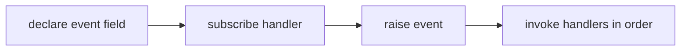
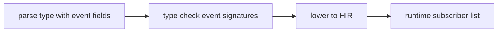

<!-- migrated from the legacy platform spec; canonical OpenSpec source -->
# Events Specification

## Purpose

Multicast events, subscription lifetime, and thread affinity assumptions. UI stacks build on these primitives.

## Requirements

### Requirement: Event field declaration
`event Name(params);` on a `type` MUST declare a multicast callback slot. Optional `event {N} Name` MAY set a capacity hint (`EventCapacity`); the runtime MAY use this for bounded subscriber lists. Event fields MUST NOT be read like ordinary value fields.

#### Scenario: Event field is not a value field
- **GIVEN** a type member declared as `event Changed();`
- **WHEN** code attempts to read the event as an ordinary value
- **THEN** the compiler rejects the read as event misuse

### Requirement: Raise subscribe and synchrony
Raising or subscribing MUST target an in-scope event member on a value or `this`-equivalent receiver. Event signatures MUST use parameter lists compatible with delegate lowering (value parameters only in v0.1). Raise MUST invoke subscribers in registration order unless a host profile defines fairness. Unless a host documents otherwise, event handlers MUST run on the raising fiber and MUST NOT block on `Join` of self. Types with `event` fields MUST lower to the same calling convention in AOT and JIT for a given target.

#### Scenario: Multicast raise order
- **GIVEN** two subscribers registered on the same event in order A then B
- **WHEN** the event is raised under the default host profile
- **THEN** handler A runs before handler B on the raising fiber

## Informative Source Provenance

The records below preserve migration history and are not normative except where text was extracted into a requirement above.

### Source Record: Events

**Authority:** informative provenance  
**Legacy path:** `/platform-spec/language-meta/evaluation/events/`  
**Source:** `site/spec-content/platform-spec/language-meta/evaluation/events/content.md`  
**SHA-256:** `d34287cbe65b3836e1a29792e39ede2932b465f5bb3ccd6f8bbe2a6ef92f97a3`

<details>
<summary>Migrated source text</summary>

``````markdown
## Normative specification

### Scope

Defines **`event` fields** on types and their **raise/subscribe** surface. Fiber cancellation events are specified in [Fibers and spawn](/platform-spec/language-meta/evaluation/fibers-and-spawn/) and the concurrency package.

### Declaration

- **`event Name(params);`** on a `type` declares a multicast callback slot.
- Optional **`event {N} Name`** sets a capacity hint (`EventCapacity`); runtime **may** use this for bounded subscriber lists.
- Event fields are **not** ordinary value fields; they **must not** be read like variables.

### Static rules

- Raising or subscribing **must** target an in-scope event member on a value or `this`-equivalent receiver.
- Event signatures **must** use parameter lists compatible with delegate lowering (value parameters only in v0.1).

### Dynamic semantics

- **Multicast:** Multiple subscribers **may** be registered; raise **must** invoke subscribers in registration order unless a host profile defines fairness.
- **Synchrony:** Unless a host documents otherwise, event handlers run on the **raising fiber** and **must not** block on `Join` of self.
- **Lifetime:** Subscriptions **should** be detached when the owning object is disposed; leaks are host-defined (corelib hosts document behavior).

### Diagnostics

Event misuse **must** surface as member/type errors (**E1213** family) until a dedicated event band is allocated.

### Conformance

Types with `event` fields **must** lower to the same calling convention in AOT and JIT for a given target.

## Decisions
<!-- spec:generate:adr-index -->
No ADRs published under **`adr/`** yet.
<!-- /spec:generate:adr-index -->
## Articles
<!-- spec:generate:article-index -->
- [Events - Contracts and edge cases](./articles/contracts-and-edge-cases/)
- [Events - Design model](./articles/design-model/)
- [Events - Examples](./articles/examples/)
- [Events - FAQ and troubleshooting](./articles/faq-and-troubleshooting/)
- [Events - Flow and algorithm](./articles/flow-and-algorithm/)
- [Events - Verification and traceability](./articles/verification-and-traceability/)
<!-- /spec:generate:article-index -->
``````

</details>

### Source Record: Events - Contracts and edge cases

**Authority:** informative provenance  
**Legacy path:** `/platform-spec/language-meta/evaluation/events/articles/contracts-and-edge-cases/`  
**Source:** `site/spec-content/platform-spec/language-meta/evaluation/events/articles/contracts-and-edge-cases/content.md`  
**SHA-256:** `0c19c506a23755b6076d86191f2167d568b37a113316f3bc183dcc9145fe3715`

<details>
<summary>Migrated source text</summary>

``````markdown
## Hard requirements

- **Language `event` keyword** — Events are fields, not separate delegate types.
- **Fiber OnCancelled** — Cancellation uses the same `event` mechanism on `Fiber<T>`.
- **Synchronous default** — Handlers run on the raising fiber unless a host profile says otherwise.
- **Not `Option`** — Subscription state is host-managed; absence is not `Option<T>`.

## Diagnostic band

| Code | Condition |
| --- | --- |
| **E1219** | Invalid event invocation scope |
| **E1220** | Invalid event capacity |
| **E1221** | Invalid event subscription target |

## Edge cases

- **Empty subscriber list** — Raising an event with no subscribers is a no-op.
- **Handler exception** — If a handler panics, the behavior is host-defined (continue vs abort).
- **Re-entrant raise** — A handler that raises the same event may cause re-entrancy; the runtime handles this per host policy.
- **Event field in struct literal** — Event fields must not appear in struct literal initializers.

## Invariants

- Event fields are not ordinary value fields; they must not be read like variables.
- Event signatures must use parameter lists compatible with delegate lowering.
- Types with `event` fields must lower to the same calling convention in AOT and JIT.
``````

</details>

### Source Record: Events - Design model

**Authority:** informative provenance  
**Legacy path:** `/platform-spec/language-meta/evaluation/events/articles/design-model/`  
**Source:** `site/spec-content/platform-spec/language-meta/evaluation/events/articles/design-model/content.md`  
**SHA-256:** `0fa35b92bae330966d5e528c8c96d64e39d2f8e644f03a4e4f2239f39243e7e0`

<details>
<summary>Migrated source text</summary>

``````markdown
## Vocabulary

| Construct | Role |
| --- | --- |
| **`event` field** | Multicast callback slot declared on a `type` |
| **`EventCapacity`** | Optional capacity hint for bounded subscriber lists |
| **`TypeInvalidEventInvocationScope`** | Diagnostic for invalid event usage |

## Event architecture

Events are **multicast callback slots** declared as fields on types. They are not ordinary value fields and must not be read like variables.



### Subsystem boundaries

| Subsystem | Responsibility | Key file |
| --- | --- | --- |
| Parser | Parse `event` fields on types | `syntax/items/type_definition.rs` (field parsing) |
| AST | Store event field structure | `syntax/items/type_definition.rs` |
| Type checker | Validate event signatures | `types/context/expressions.rs` |
| Runtime | Manage subscriber lists | `beskid_runtime/src/builtins/events.rs` |

## Declaration

```beskid
type Button {
    event Clicked(i32 x, i32 y);
}
```

Event fields are parsed as part of the `FieldList` in `TypeDefinition`. The parser distinguishes event fields from value fields by the `event` keyword.

## Dynamic semantics

- **Multicast** — Multiple subscribers may be registered; raise invokes subscribers in registration order.
- **Synchronous default** — Handlers run on the raising fiber unless a host profile says otherwise.
- **Lifetime** — Subscriptions should be detached when the owning object is disposed; leaks are host-defined.
``````

</details>

### Source Record: Events - Examples

**Authority:** informative provenance  
**Legacy path:** `/platform-spec/language-meta/evaluation/events/articles/examples/`  
**Source:** `site/spec-content/platform-spec/language-meta/evaluation/events/articles/examples/content.md`  
**SHA-256:** `0731ab9ab2c92ae2559770babf0fdc7bb9238d4f400dcafe2c0a84c3ee9725fa`

<details>
<summary>Migrated source text</summary>

``````markdown
## Event declaration

```beskid
type Button {
    event Clicked(i32 x, i32 y);
}
```

## Subscription and raising

```beskid
unit UseButton() {
    let btn = Button {};
    btn.Clicked += (x, y) => {
        Console.WriteLine("clicked at " + x + ", " + y);
    };
    btn.Clicked(10, 20);
}
```

## Capacity hint

```beskid
type LimitedButton {
    event {5} Clicked(i32 x, i32 y);
}
```

## Event in type with other fields

```beskid
type DataSource {
    string name;
    event Changed();

    pub unit Update() {
        Changed();
    }
}
```
``````

</details>

### Source Record: Events - FAQ and troubleshooting

**Authority:** informative provenance  
**Legacy path:** `/platform-spec/language-meta/evaluation/events/articles/faq-and-troubleshooting/`  
**Source:** `site/spec-content/platform-spec/language-meta/evaluation/events/articles/faq-and-troubleshooting/content.md`  
**SHA-256:** `4ff4eec1ff93f98ff30291701eb8c1352606b179cf6719fd30a2102b8e650da4`

<details>
<summary>Migrated source text</summary>

``````markdown
## Locked decisions

| Decision | ID | Summary |
| --- | --- | --- |
| Language `event` keyword | D-LM-EVT-001 | Events are fields, not delegate types |
| Fiber OnCancelled | D-LM-EVT-002 | Cancellation uses same event mechanism |
| Synchronous default | D-LM-EVT-003 | Handlers run on raising fiber |
| Not `Option` | D-LM-EVT-004 | Subscription state is host-managed |

## FAQ

### Can I read an event field like a variable?

No. Event fields are not ordinary value fields. They must not be read like variables.

### Are events thread-safe?

The default is synchronous on the raising fiber. Thread safety depends on the host profile. See the execution specification for details.

### Can I unsubscribe from an event?

Yes. Use `-=` to remove a handler delegate from the subscriber list.

## Troubleshooting

| Symptom | Likely cause |
| --- | --- |
| **E1219** | Event used outside valid scope |
| **E1220** | Invalid capacity hint |
| **E1221** | Subscription target is not an event |
``````

</details>

### Source Record: Events - Flow and algorithm

**Authority:** informative provenance  
**Legacy path:** `/platform-spec/language-meta/evaluation/events/articles/flow-and-algorithm/`  
**Source:** `site/spec-content/platform-spec/language-meta/evaluation/events/articles/flow-and-algorithm/content.md`  
**SHA-256:** `afb30dc4f79085ebfe1f13a985bcad6f0d7c6f64b8021afb2660dfcefc46b345`

<details>
<summary>Migrated source text</summary>

``````markdown
## Compile pipeline placement



## Event parsing algorithm (normative)

1. **Parse type definition** — `TypeDefinition` collects fields via `FieldList`.
2. **Distinguish event fields** — Fields starting with `event` are parsed as event declarations with parameter lists.
3. **Validate event signatures** — Event signatures must use parameter lists compatible with delegate lowering. `TypeInvalidEventCapacity` (**E1220**) for invalid capacity hints.
4. **Check invocation scope** — Raising or subscribing must target an in-scope event member on a value or `this`-equivalent receiver. `TypeInvalidEventInvocationScope` (**E1219**) otherwise.
5. **Check subscription target** — `TypeInvalidEventSubscriptionTarget` (**E1221**) for invalid subscription targets.

## Runtime subscriber management

The runtime maintains a subscriber list per event instance:
1. **Subscribe** — Add a handler delegate to the list.
2. **Raise** — Iterate the list and invoke each handler with the provided arguments.
3. **Unsubscribe** — Remove a handler delegate from the list.

## Fiber cancellation events

Fiber cancellation uses the same `event` mechanism on `Fiber<T>`. See [Fibers and spawn](/platform-spec/language-meta/evaluation/fibers-and-spawn/) for details.

## LSP / incremental

Re-run event checking when type definitions with event fields or event usage expressions change.
``````

</details>

### Source Record: Events - Verification and traceability

**Authority:** informative provenance  
**Legacy path:** `/platform-spec/language-meta/evaluation/events/articles/verification-and-traceability/`  
**Source:** `site/spec-content/platform-spec/language-meta/evaluation/events/articles/verification-and-traceability/content.md`  
**SHA-256:** `07e6383e59b196e041d944bd3533b209e9e6334282875df5d2d4aba6c1a12684`

<details>
<summary>Migrated source text</summary>

``````markdown
## Verification matrix

| Scenario | Expected evidence |
| --- | --- |
| Event field declaration | Parses; included in `TypeDefinition` fields |
| Event raise | Compiles; invokes subscribers |
| Invalid event scope | **E1219** emitted |
| Invalid capacity | **E1220** emitted |
| Invalid subscription | **E1221** emitted |

## Implementation checklist

- [x] Grammar: `event` fields on types
- [x] AST: Event fields parsed in `TypeDefinition`
- [x] Parser: `beskid.pest` productions for event fields
- [x] Type checker: Event signature validation
- [x] Diagnostics: **E1219**, **E1220**, **E1221**
- [ ] Runtime subscriber list management
- [ ] Event lowering to runtime ABI
- [ ] Fiber cancellation event integration

## Test locations

- `compiler/crates/beskid_analysis/src/syntax/items/type_definition.rs` — parser tests
- `compiler/crates/beskid_analysis/src/types/context/expressions.rs` — event typing tests
- `compiler/crates/beskid_runtime/src/builtins/events.rs` — runtime tests
``````

</details>
