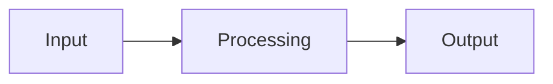

<!-- migrated from the legacy platform spec; canonical OpenSpec source -->
# Fibers and spawn Specification

## Purpose

The spawn keyword, Fiber contract requirement, and cross-fiber communication rules.

## Requirements

### Requirement: Feature hub owns normative contract: Decision [D-LMETA-FIBERS-0001]
The Beskid standard SHALL enforce the following migrated contract section. Accepted ADR decisions are binding; uppercase requirement keywords retain their BCP-14 meaning.

> This feature hub **must** own normative MUST/SHOULD contract text. Sibling articles **must not** redefine hub requirements and **should** link here for authority.

**Stable ID:** `BSP-REQ-04B02D107B30`  
**Legacy source:** `site/spec-content/platform-spec/language-meta/evaluation/fibers-and-spawn/adr/0001-hub-authority/content.md`  
**Source SHA-256:** `645142e8975664a5a3b667c852a3206142e1b4f0be8b0605b9965abe489ec7a8`

#### Scenario: Conformance exercises Decision
- **GIVEN** an implementation claims conformance with this capability
- **WHEN** behavior governed by this contract section is exercised
- **THEN** every MUST, SHALL, REQUIRED, prohibition, and accepted decision in the section is satisfied

### Requirement: spawn returns Fiber handle not T: Decision [D-LMETA-FIBERS-0002]
The Beskid standard SHALL enforce the following migrated contract section. Accepted ADR decisions are binding; uppercase requirement keywords retain their BCP-14 meaning.

> | Rule | Detail |
> | --- | --- |
> | Keyword | `spawn` introduces a child fiber |
> | Type | Expression **must** type-check to a `Fiber<T>` handle for the entry return type `T` (not `T` directly) |
> | Result | `spawn` **must not** return the entry value; use `Join` for `Result<T, FiberError>` |
> | Contract | The handle shape is the `corelib_concurrency` `Fiber<T>` type required by lowering |

**Stable ID:** `BSP-REQ-1559EA122B7C`  
**Legacy source:** `site/spec-content/platform-spec/language-meta/evaluation/fibers-and-spawn/adr/0002-spawn-returns-fiber-handle/content.md`  
**Source SHA-256:** `4e80868f802a6233ba7bbe13c23ccb19f5da999149e04d5b741f76ba1060a3e0`

#### Scenario: Conformance exercises Decision
- **GIVEN** an implementation claims conformance with this capability
- **WHEN** behavior governed by this contract section is exercised
- **THEN** every MUST, SHALL, REQUIRED, prohibition, and accepted decision in the section is satisfied

### Requirement: Stack captures cannot escape spawn: Decision [D-LMETA-FIBERS-0003]
The Beskid standard SHALL enforce the following migrated contract section. Accepted ADR decisions are binding; uppercase requirement keywords retain their BCP-14 meaning.

> Closure captures that would leak stack references across fibers **must** be rejected with diagnostic **`StackReferenceEscapesSpawn`** (compile error).

**Stable ID:** `BSP-REQ-C50478C544F0`  
**Legacy source:** `site/spec-content/platform-spec/language-meta/evaluation/fibers-and-spawn/adr/0003-stack-capture-escapes-spawn/content.md`  
**Source SHA-256:** `590c074fa65bd4f6a14cb143c8d72bebe8ca99ab565dd48c0af57031a2930503`

#### Scenario: Conformance exercises Decision
- **GIVEN** an implementation claims conformance with this capability
- **WHEN** behavior governed by this contract section is exercised
- **THEN** every MUST, SHALL, REQUIRED, prohibition, and accepted decision in the section is satisfied

### Requirement: Cross-fiber notification uses Channel: Decision [D-LMETA-FIBERS-0004]
The Beskid standard SHALL enforce the following migrated contract section. Accepted ADR decisions are binding; uppercase requirement keywords retain their BCP-14 meaning.

> Delivering notifications to **another** fiber **must** use `Channel<T>` (or coordination primitives), not language `event` delivery across fiber boundaries.

**Stable ID:** `BSP-REQ-291393595717`  
**Legacy source:** `site/spec-content/platform-spec/language-meta/evaluation/fibers-and-spawn/adr/0004-cross-fiber-events-use-channels/content.md`  
**Source SHA-256:** `1ef78560f11bb7391ee75db7f9ac3fccafaf3a009a67f1196f854eaed95a6ed5`

#### Scenario: Conformance exercises Decision
- **GIVEN** an implementation claims conformance with this capability
- **WHEN** behavior governed by this contract section is exercised
- **THEN** every MUST, SHALL, REQUIRED, prohibition, and accepted decision in the section is satisfied

### Requirement: Join on ancestor handle is forbidden: Decision [D-LMETA-FIBERS-0005]
The Beskid standard SHALL enforce the following migrated contract section. Accepted ADR decisions are binding; uppercase requirement keywords retain their BCP-14 meaning.

> **Join** on a parent or ancestor `Fiber<T>` handle **must** be a compile error (**`JoinWouldDeadlock`**). Normative ordering for cancel + Join aligns with [D-CORE-CONC-0014](/platform-spec/core-library/concurrency/concurrency-package/adr/0014-join-ancestor-forbidden/).

**Stable ID:** `BSP-REQ-2070F33C6D2F`  
**Legacy source:** `site/spec-content/platform-spec/language-meta/evaluation/fibers-and-spawn/adr/0005-join-ancestor-compile-error/content.md`  
**Source SHA-256:** `4014e76efc72dce839d91215306610a2c73565907e2def042c582e30d5c15fc0`

#### Scenario: Conformance exercises Decision
- **GIVEN** an implementation claims conformance with this capability
- **WHEN** behavior governed by this contract section is exercised
- **THEN** every MUST, SHALL, REQUIRED, prohibition, and accepted decision in the section is satisfied

## Informative Source Provenance

The records below preserve migration history and are not normative except where text was extracted into a requirement above.

### Source Record: Fibers and spawn

**Authority:** informative provenance  
**Legacy path:** `/platform-spec/language-meta/evaluation/fibers-and-spawn/`  
**Source:** `site/spec-content/platform-spec/language-meta/evaluation/fibers-and-spawn/content.md`  
**SHA-256:** `ffe3e4bc74d59af79d53af4ef7d849207a8720ba1bfae939319d501d5946a841`

<details>
<summary>Migrated source text</summary>

``````markdown
<SpecSection title="What this feature specifies" id="what-this-feature-specifies">
The `spawn` keyword starts cooperative fibers. Every `spawn` expression **must** type-check to `Fiber<T>` (`Concurrency.Fiber` in `corelib_concurrency`) where `T` is the entry return type. There is **no** `async` / `await`; cross-fiber payloads use `Channel<T>` only. Reserved `async` / `await` tokens are compile errors.
</SpecSection>

<SpecSection title="Implementation anchors" id="implementation-anchors">
- Language surface and diagnostics in `compiler/crates/beskid_analysis/`
- Lowering: `compiler/crates/beskid_codegen/` → `fiber_spawn` and stack maps
- Runtime: **[Fiber scheduler and stacks](/platform-spec/execution/runtime/fiber-scheduler-and-stacks/)**
- Corelib contract: **[Concurrency package](/platform-spec/core-library/concurrency/concurrency-package/)**
</SpecSection>

<SpecSection title="Contract statement" id="contract-statement">
Beskid provides a `spawn` keyword for cooperative concurrency. Every `spawn` expression **must** type-check against the `Fiber<T>` contract defined in `corelib_concurrency` (`Concurrency.Fiber`), where `T` is the return type of the spawned callable.

There is **no** `async` / `await` surface in the language. Structured concurrency uses `Join`, **Channel** **Send**/**Receive**, **WaitGroup**, and **Hub**.
</SpecSection>

<SpecSection title="Syntax" id="syntax">
```beskid
`Fiber<T>` handle = spawn Callable(/* args */);
```

- `Callable` — function or closure satisfying the spawn contract (see semantic rules).
- Lowering produces runtime `fiber_spawn` with environment captures rooted for GC.
- `spawn` is **not** an expression that returns `T` directly; use `Join` for `Result<T, FiberError>`.
</SpecSection>

<SpecSection title="Fiber handle" id="fiber-handle">
`spawn` returns `Fiber<T>` where `T` is the entry callable’s return type. The handle struct (corelib) **must** expose:

```beskid
event OnCancelled();
```

The **entry callable** is a normal function or closure — it **does not** declare **OnCancelled**. Cancellation is observed on the **child fiber** via the handle’s event, then **Join** / channel **Result** errors per **[decisions record](/platform-spec/core-library/concurrency/concurrency-package/decisions-record/)**.
</SpecSection>

<SpecSection title="Semantic rules" id="semantic-rules">
1. **Spawn target** — callable return type `T` determines `Fiber<T>`; entry signature must be compatible with spawn lowering.
2. **Captures** — closure captures must not leak stack references across fibers; `StackReferenceEscapesSpawn` diagnostic.
3. **Detach** — explicit **Detach** waives shutdown **Join**; otherwise runtime joins non-detached children when `main` returns.
4. **Cancel** — **Cancel** + **OnCancelled** on handle + **Join** / channel **Cancelled** (normative ordering in decisions record).
5. **Cross-fiber data** — **Channel** only; **Mutex** / **WaitGroup** coordinate invariants, not payload transfer.
6. **Join cycle** — child (or descendant) **Join** on parent / ancestor handle is `JoinWouldDeadlock` (compile error).
7. **Reserved keywords** — `async` and `await` are **errors** if parsed (not implemented).
</SpecSection>

<SpecSection title="Relationship to events" id="relationship-to-events">
Language `event` members remain for single-fiber multicast within one fiber's ownership. Delivering UI or IO notifications to **another** fiber **must** use **Channel** (see **[Events](/platform-spec/language-meta/evaluation/events/)** and console spec).
</SpecSection>

<SpecSection title="Diagnostics" id="diagnostics">
| Code | When |
| --- | --- |
| `SpawnTargetNotFiberCompatible` | Spawned callable not a valid spawn entry (signature / captures) |
| `JoinWouldDeadlock` | **Join** would wait on an ancestor fiber handle |
| `StackReferenceEscapesSpawn` | Capture would share stack memory across fibers |
| `AsyncKeywordReserved` | `async` token in source |
| `AwaitKeywordReserved` | `await` token in source |
</SpecSection>

## Decisions
<!-- spec:generate:adr-index -->
No open decisions. Closed choices are normative ADRs under **`adr/`** (`D-LMETA-FIBERS-0001` … `D-LMETA-FIBERS-0005`); use the reader **ADRs** tab for expandable detail.
<!-- /spec:generate:adr-index -->
## Articles
<!-- spec:generate:article-index -->
_No articles in this bundle yet._
<!-- /spec:generate:article-index -->
``````

</details>

### Source Record: Feature hub owns normative contract

**Authority:** informative provenance  
**Legacy path:** `/platform-spec/language-meta/evaluation/fibers-and-spawn/adr/0001-hub-authority/`  
**Source:** `site/spec-content/platform-spec/language-meta/evaluation/fibers-and-spawn/adr/0001-hub-authority/content.md`  
**SHA-256:** `645142e8975664a5a3b667c852a3206142e1b4f0be8b0605b9965abe489ec7a8`

<details>
<summary>Migrated source text</summary>

``````markdown
## Context

Language-meta evaluation articles previously mixed informal notes with hub requirements.

## Decision

This feature hub **must** own normative MUST/SHOULD contract text. Sibling articles **must not** redefine hub requirements and **should** link here for authority.

## Consequences

Editors consolidate conflicting rules on the hub; articles carry detail and examples only.

## Verification anchors

/platform-spec/language-meta/evaluation/fibers-and-spawn/; `site/website` trudoc verify.
``````

</details>

### Source Record: spawn returns Fiber handle not T

**Authority:** informative provenance  
**Legacy path:** `/platform-spec/language-meta/evaluation/fibers-and-spawn/adr/0002-spawn-returns-fiber-handle/`  
**Source:** `site/spec-content/platform-spec/language-meta/evaluation/fibers-and-spawn/adr/0002-spawn-returns-fiber-handle/content.md`  
**SHA-256:** `4e80868f802a6233ba7bbe13c23ccb19f5da999149e04d5b741f76ba1060a3e0`

<details>
<summary>Migrated source text</summary>

``````markdown
## Context

Authors need a single cooperative concurrency entry keyword with an explicit handle for cancellation and join.

## Decision

| Rule | Detail |
| --- | --- |
| Keyword | `spawn` introduces a child fiber |
| Type | Expression **must** type-check to a `Fiber<T>` handle for the entry return type `T` (not `T` directly) |
| Result | `spawn` **must not** return the entry value; use `Join` for `Result<T, FiberError>` |
| Contract | The handle shape is the `corelib_concurrency` `Fiber<T>` type required by lowering |

## Consequences

Parser, semantic analysis, and codegen share one spawn contract with the concurrency package.

## Verification anchors

`compiler/crates/beskid_analysis/`; `compiler/crates/beskid_codegen/` spawn lowering; [Concurrency package](/platform-spec/core-library/concurrency/concurrency-package/).
``````

</details>

### Source Record: Stack captures cannot escape spawn

**Authority:** informative provenance  
**Legacy path:** `/platform-spec/language-meta/evaluation/fibers-and-spawn/adr/0003-stack-capture-escapes-spawn/`  
**Source:** `site/spec-content/platform-spec/language-meta/evaluation/fibers-and-spawn/adr/0003-stack-capture-escapes-spawn/content.md`  
**SHA-256:** `590c074fa65bd4f6a14cb143c8d72bebe8ca99ab565dd48c0af57031a2930503`

<details>
<summary>Migrated source text</summary>

``````markdown
## Context

Moving stack references into another fiber breaks the memory model and GC rooting assumptions.

## Decision

Closure captures that would leak stack references across fibers **must** be rejected with diagnostic **`StackReferenceEscapesSpawn`** (compile error).

## Consequences

Authors pass data through `Channel<T>` or other approved sharing; runtime does not repair invalid captures.

## Verification anchors

`compiler/crates/beskid_analysis/` capture analysis; [Memory and references](/platform-spec/language-meta/memory-model/memory-and-references/).
``````

</details>

### Source Record: Cross-fiber notification uses Channel

**Authority:** informative provenance  
**Legacy path:** `/platform-spec/language-meta/evaluation/fibers-and-spawn/adr/0004-cross-fiber-events-use-channels/`  
**Source:** `site/spec-content/platform-spec/language-meta/evaluation/fibers-and-spawn/adr/0004-cross-fiber-events-use-channels/content.md`  
**SHA-256:** `1ef78560f11bb7391ee75db7f9ac3fccafaf3a009a67f1196f854eaed95a6ed5`

<details>
<summary>Migrated source text</summary>

``````markdown
## Context

`event` multicast is defined for ownership within one fiber; UI/IO delivery across fibers needs a defined transport.

## Decision

Delivering notifications to **another** fiber **must** use `Channel<T>` (or coordination primitives), not language `event` delivery across fiber boundaries.

## Consequences

[Events](/platform-spec/language-meta/evaluation/events/) stays single-fiber; console and host specs reference channels for cross-fiber IO.

## Verification anchors

[Fibers and spawn](/platform-spec/language-meta/evaluation/fibers-and-spawn/); [Events](/platform-spec/language-meta/evaluation/events/).
``````

</details>

### Source Record: Join on ancestor handle is forbidden

**Authority:** informative provenance  
**Legacy path:** `/platform-spec/language-meta/evaluation/fibers-and-spawn/adr/0005-join-ancestor-compile-error/`  
**Source:** `site/spec-content/platform-spec/language-meta/evaluation/fibers-and-spawn/adr/0005-join-ancestor-compile-error/content.md`  
**SHA-256:** `4014e76efc72dce839d91215306610a2c73565907e2def042c582e30d5c15fc0`

<details>
<summary>Migrated source text</summary>

``````markdown
## Context

Waiting on an ancestor handle while the ancestor may wait on descendants creates predictable deadlocks.

## Decision

**Join** on a parent or ancestor `Fiber<T>` handle **must** be a compile error (**`JoinWouldDeadlock`**). Normative ordering for cancel + Join aligns with [D-CORE-CONC-0014](/platform-spec/core-library/concurrency/concurrency-package/adr/0014-join-ancestor-forbidden/).

## Consequences

Structured concurrency stays acyclic on the join graph; runtime need not recover ancestor joins.

## Verification anchors

`compiler/crates/beskid_analysis/`; [D-CORE-CONC-0014](/platform-spec/core-library/concurrency/concurrency-package/adr/0014-join-ancestor-forbidden/).
``````

</details>

### Source Record: Fibers and spawn - Contracts and edge cases

**Authority:** informative provenance  
**Legacy path:** `/platform-spec/language-meta/evaluation/fibers-and-spawn/articles/contracts-and-edge-cases/`  
**Source:** `site/spec-content/platform-spec/language-meta/evaluation/fibers-and-spawn/articles/contracts-and-edge-cases/content.md`  
**SHA-256:** `38590a24d3fd04e8121e01b867c251b778f034249892f57fd121569046a89ded`

<details>
<summary>Migrated source text</summary>

``````markdown
## Hard requirements

The normative specification in this capability's Requirements section defines the hard requirements for this feature. This article documents edge cases and contract-level guarantees.

## Edge cases

Edge cases are documented as they are discovered during implementation. Key edge cases include:

- Interactions with other features that may produce unexpected results
- Boundary conditions at the limits of defined behavior
- Error paths and diagnostic conditions

## Invariants

The following invariants must hold across all implementations:

1. The normative specification takes precedence over implementation behavior
2. Diagnostic codes are registered in the diagnostic code registry and must not be reused
3. Conformance tests must pass at the declared conformance level

## Contract guarantees

Implementations must satisfy the contracts defined in this capability's Requirements section. Violations must be surfaced through the diagnostic system.
``````

</details>

### Source Record: Fibers and spawn - Design model

**Authority:** informative provenance  
**Legacy path:** `/platform-spec/language-meta/evaluation/fibers-and-spawn/articles/design-model/`  
**Source:** `site/spec-content/platform-spec/language-meta/evaluation/fibers-and-spawn/articles/design-model/content.md`  
**SHA-256:** `1b68ebfeff508112d586503ab5ceba6deac038e9d766da8e7641f6472e54243e`

<details>
<summary>Migrated source text</summary>

``````markdown
## Design overview

This article describes the conceptual model and design decisions behind the feature. The normative specification lives in this capability's Requirements section (and related OpenSpec sibling capabilities); this article expands on the rationale, subsystem boundaries, and architectural choices.

## Key design decisions

- Decision details are recorded as ADRs under the hub's `adr/` directory when formal record-keeping is needed.
- Design rationale here is informative; normative contract language lives in this capability's Requirements section.

## Subsystem boundaries

Refer to this capability's Requirements section for the authoritative specification. This article provides supplementary design context.

## Related articles

- [Contracts and edge cases](../contracts-and-edge-cases/)
- [Verification and traceability](../verification-and-traceability/)
``````

</details>

### Source Record: Fibers and spawn - Examples

**Authority:** informative provenance  
**Legacy path:** `/platform-spec/language-meta/evaluation/fibers-and-spawn/articles/examples/`  
**Source:** `site/spec-content/platform-spec/language-meta/evaluation/fibers-and-spawn/articles/examples/content.md`  
**SHA-256:** `86cf4d29784a24ebca21ad21852be0bd3d4c6b9b91dc9e0863261c4bfe77601d`

<details>
<summary>Migrated source text</summary>

``````markdown
## Basic usage

```beskid
// TODO: Add basic usage example for this feature
```

## Common patterns

```beskid
// TODO: Add common usage patterns
```

## Edge case examples

```beskid
// TODO: Add edge case examples
```

> **Note:** Full code examples for this feature are being developed. See this capability's Requirements section for the normative specification.
``````

</details>

### Source Record: Fibers and spawn - FAQ and troubleshooting

**Authority:** informative provenance  
**Legacy path:** `/platform-spec/language-meta/evaluation/fibers-and-spawn/articles/faq-and-troubleshooting/`  
**Source:** `site/spec-content/platform-spec/language-meta/evaluation/fibers-and-spawn/articles/faq-and-troubleshooting/content.md`  
**SHA-256:** `be65fe7b4da1111fe5c3d4a79fa5246143a04e91a93b1b2f0c04b7a358e9172c`

<details>
<summary>Migrated source text</summary>

``````markdown
## Frequently asked questions

### Is this feature stable?

This capability's status metadata indicates the maturity level. Articles marked `Proposed` are under active development.

### How does this interact with other features?

See the "Related articles" section in each article and the `related.json` files for cross-feature links.

### Where can I find implementation details?

Implementation anchors are listed under Implementation anchors in this capability's Requirements or Informative Source Provenance.

## Troubleshooting

### Diagnostic codes

Refer to this capability's Requirements section for feature-specific diagnostic codes. All codes are registered in the [Diagnostic code registry](/platform-spec/compiler/semantic-pipeline/diagnostic-code-registry/).

### Common errors

- **Spec violation:** If behavior contradicts this capability's Requirements section, the capability specification takes precedence.
- **Missing conformance:** If a test case is missing, add it to the `articles/verification-and-traceability/` article.
``````

</details>

### Source Record: Fibers and spawn - Flow and algorithm

**Authority:** informative provenance  
**Legacy path:** `/platform-spec/language-meta/evaluation/fibers-and-spawn/articles/flow-and-algorithm/`  
**Source:** `site/spec-content/platform-spec/language-meta/evaluation/fibers-and-spawn/articles/flow-and-algorithm/content.md`  
**SHA-256:** `ff1553dccff5fb7dfcb7a788fb49e410b47dee6f74766109de0f4f5b0279c353`

<details>
<summary>Migrated source text</summary>

``````markdown
## Processing steps

The normative algorithm for this feature is defined in the compiler implementation. This article provides an informative overview of the processing flow.

## Data flow



## Algorithm outline

1. Parse the relevant syntax from the source
2. Resolve names and types according to the rules in this capability's Requirements section
3. Lower to intermediate representation
4. Code generation

> **Note:** Detailed flow documentation is being developed. Refer to the compiler implementation for the authoritative algorithm.
``````

</details>

### Source Record: Fibers and spawn - Verification and traceability

**Authority:** informative provenance  
**Legacy path:** `/platform-spec/language-meta/evaluation/fibers-and-spawn/articles/verification-and-traceability/`  
**Source:** `site/spec-content/platform-spec/language-meta/evaluation/fibers-and-spawn/articles/verification-and-traceability/content.md`  
**SHA-256:** `7b06951cd607becb179a57cbac112cbc9f697ed5191f699bdecdfa54db50d2eb`

<details>
<summary>Migrated source text</summary>

``````markdown
## Conformance evidence

Conformance to this specification is verified through:

1. **Compiler test suite** — Unit and integration tests in the compiler workspace
2. **Corelib conformance** — Published corelib packages must conform to the specification
3. **End-to-end tests** — E2E tests validate the full pipeline

## Test coverage

Test coverage for this feature is tracked in the compiler's test suite. Key test areas include:

- Syntax validation
- Semantic analysis (type checking, name resolution)
- Code generation and lowering
- Runtime behavior

## Verification anchors

Implementation anchors are listed under Implementation anchors in this capability's Requirements or Informative Source Provenance.

## Traceability

Each normative statement in this capability's Requirements section should be traceable to:
- A test case in the compiler test suite
- An ADR documenting the decision
- A diagnostic code in the diagnostic registry
``````

</details>
