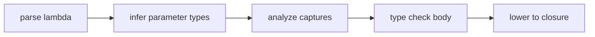
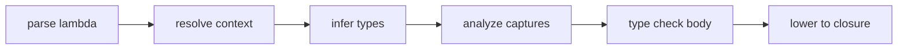
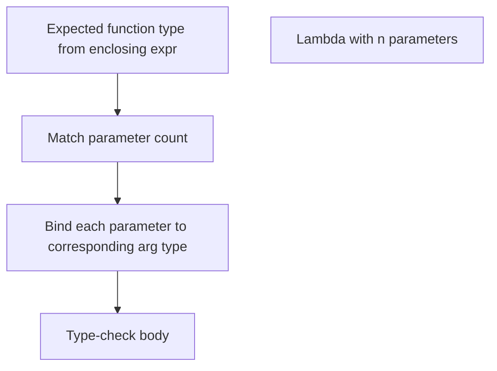

<!-- migrated from the legacy platform spec; canonical OpenSpec source -->
# Lambdas and closures Specification

## Purpose

Capture lists, environment layout, and lifetime of delegates. JIT and AOT must agree on closure calling conventions.

## Requirements

### Requirement: Lambdas and closures conformance status
This capability SHALL remain non-conformant and MUST NOT be cited as an implemented Beskid guarantee until a validated OpenSpec change adds explicit behavioral requirements.

**Stable ID:** `BSP-REQ-DB4363BFA321`

#### Scenario: Capability has descriptive material only
- **GIVEN** the migrated sources contain no uppercase BCP-14 obligation or accepted ADR decision
- **WHEN** an implementation reports Beskid conformance
- **THEN** it MUST NOT claim conformance based on this capability

## Informative Source Provenance

The records below preserve migration history and are not normative except where text was extracted into a requirement above.

### Source Record: Lambdas and closures

**Authority:** informative provenance  
**Legacy path:** `/platform-spec/language-meta/evaluation/lambdas-and-closures/`  
**Source:** `site/spec-content/platform-spec/language-meta/evaluation/lambdas-and-closures/content.md`  
**SHA-256:** `04f9394f460a134847f17bcfd1ffcc6f8e583679e9163e2dc3d378c7c9dd040a`

<details>
<summary>Migrated source text</summary>

``````markdown
## Normative specification

### Scope

Defines **lambda expressions** (`=>`), **closures**, and their typing. Function types are in [Types](/platform-spec/language-meta/type-system/types/); inference in [Type inference](/platform-spec/language-meta/type-system/type-inference/).

### Syntax

- **`param => body`** or **`(p1, p2) => body`** where `body` is an expression or `{ block }`.
- Parameters **may** be typed (`T name`) or untyped (`name`) when contextual type is available.
- Lambdas **may** appear anywhere an `Expression` is allowed, including as `spawn` operands.

### Static rules

- Lambda type **must** be inferable from expected type or parameter annotations (**E1202** otherwise).
- Captured locals **must** be definitely assigned before capture or diagnosed per definite-assignment rules (v0.1: follow reference compiler behavior).
- Lambdas **must not** capture `mut` bindings unless the implementation explicitly allows it; otherwise **must** error.

### Dynamic semantics

- A closure **must** extend the lifetime of captured storage to at least the closure value’s lifetime.
- Invocation uses the standard function call ABI for the target triple.
- Closures passed to `spawn` **must** be compatible with fiber entry signatures (see [Fibers and spawn](/platform-spec/language-meta/evaluation/fibers-and-spawn/)).

### Diagnostics

Type inference and call mismatch bands **E1202**, **E1205**. Registry: [Diagnostic code registry](/platform-spec/compiler/semantic-pipeline/diagnostic-code-registry/).

### Conformance

Closure codegen tests **must** match between debug and release for the reference backend on each supported triple.

## Decisions
<!-- spec:generate:adr-index -->
No ADRs published under **`adr/`** yet.
<!-- /spec:generate:adr-index -->
## Articles
<!-- spec:generate:article-index -->
- [Lambdas and closures - Contracts and edge cases](./articles/contracts-and-edge-cases/)
- [Lambdas and closures - Design model](./articles/design-model/)
- [Lambdas and closures - Examples](./articles/examples/)
- [Lambdas and closures - FAQ and troubleshooting](./articles/faq-and-troubleshooting/)
- [Lambdas and closures - Flow and algorithm](./articles/flow-and-algorithm/)
- [Lambdas and closures - Verification and traceability](./articles/verification-and-traceability/)
<!-- /spec:generate:article-index -->
``````

</details>

### Source Record: Lambdas and closures - Contracts and edge cases

**Authority:** informative provenance  
**Legacy path:** `/platform-spec/language-meta/evaluation/lambdas-and-closures/articles/contracts-and-edge-cases/`  
**Source:** `site/spec-content/platform-spec/language-meta/evaluation/lambdas-and-closures/articles/contracts-and-edge-cases/content.md`  
**SHA-256:** `bc740bbb8f5d742c5c2d7869fb553e8b53ad7c31fc0b5a50ffa92f1ec99d1fac`

<details>
<summary>Migrated source text</summary>

``````markdown
## Hard requirements

- **Expression lambdas** — Statement lambdas use block bodies; no separate `fn` literal syntax.
- **No async lambdas** — `async`/`await` are not closure modifiers; use `spawn` instead.
- **Capture extends lifetime** — Closures must keep captured locals alive for the closure value's lifetime.
- **GC for escaped captures** — Captured reference-bearing values must be heap-traced when they escape.

## Diagnostic band

| Code | Condition |
| --- | --- |
| **E1202** | Missing type annotation (lambda parameter inference fails) |
| **E1223** | Spawn target not fiber compatible |
| **E1225** | Stack reference escapes spawn |

## Edge cases

- **Zero-parameter lambda** — `() => body` is valid; the parameter list is empty.
- **Lambda as statement** — A lambda expression used as a statement is valid but usually pointless unless assigned.
- **Recursive lambda** — A lambda cannot directly reference itself unless bound to a named variable first.
- **Capture of `this`** — Instance lambdas capture `this` implicitly; the closure environment holds a reference to the enclosing object.

## Invariants

- Lambda type must be inferable from expected type or parameter annotations.
- Captured locals must be definitely assigned before capture.
- Closures passed to `spawn` must be compatible with fiber entry signatures.
- JIT and AOT must agree on closure calling conventions.
``````

</details>

### Source Record: Lambdas and closures - Design model

**Authority:** informative provenance  
**Legacy path:** `/platform-spec/language-meta/evaluation/lambdas-and-closures/articles/design-model/`  
**Source:** `site/spec-content/platform-spec/language-meta/evaluation/lambdas-and-closures/articles/design-model/content.md`  
**SHA-256:** `bd88ff46feda8eca0224af65060a48d2df2d7129285bd98035ade92a65f29cc7`

<details>
<summary>Migrated source text</summary>

``````markdown
## Vocabulary

| Construct | Role |
| --- | --- |
| **`LambdaExpression`** | Anonymous function `params => body` |
| **`LambdaParameter`** | Single parameter with optional explicit type |
| **`LambdaParameters`** | Parameter list (single identifier or parenthesized list) |

## Lambda architecture

Lambdas are **expression-level anonymous functions** with optional parameter types. They may appear anywhere an `Expression` is allowed.



### Subsystem boundaries

| Subsystem | Responsibility | Key file |
| --- | --- | --- |
| Parser | Parse `=>` syntax | `syntax/expressions/lambda_expression.rs` |
| AST | Store lambda structure | `syntax/expressions/expression.rs` |
| Type checker | Infer parameter types from context | `types/context/expressions.rs` |
| Capture analysis | Track captured locals | `analysis/rules/staged/` |
| HIR lowering | Build closure environment | `hir/lowering/expressions.rs` |

## Capture model

- Captured locals must be definitely assigned before capture.
- Lambdas must not capture `mut` bindings unless the implementation explicitly allows it.
- A closure extends the lifetime of captured storage to at least the closure value's lifetime.
- Captured reference-bearing values must be heap-traced when they escape the frame.
``````

</details>

### Source Record: Lambdas and closures - Examples

**Authority:** informative provenance  
**Legacy path:** `/platform-spec/language-meta/evaluation/lambdas-and-closures/articles/examples/`  
**Source:** `site/spec-content/platform-spec/language-meta/evaluation/lambdas-and-closures/articles/examples/content.md`  
**SHA-256:** `45039c4f75ecb25c068938a710f7020e70a49e37c214ab50a346d71583e75417`

<details>
<summary>Migrated source text</summary>

``````markdown
## Simple lambda

```beskid
unit Simple() {
    let add = (a, b) => a + b;
    let result = add(2, 3);
}
```

## Typed parameters

```beskid
unit Typed() {
    let mul = (i32 a, i32 b) => a * b;
}
```

## Block body

```beskid
unit BlockBody() {
    let max = (i32 a, i32 b) => {
        if (a > b) {
            return a;
        }
        return b;
    };
}
```

## Capture

```beskid
unit Capture() {
    let offset = 10;
    let addOffset = (i32 x) => x + offset;
    let result = addOffset(5);   // 15
}
```

## Lambda as argument

```beskid
unit Apply(i32[] values, (i32) => i32 transform) {
    for v in values {
        let transformed = transform(v);
        Console.WriteLine(transformed);
    }
}

unit UseApply() {
    let values = i32[] { 1, 2, 3 };
    Apply(values, x => x * 2);
}
```
``````

</details>

### Source Record: Lambdas and closures - FAQ and troubleshooting

**Authority:** informative provenance  
**Legacy path:** `/platform-spec/language-meta/evaluation/lambdas-and-closures/articles/faq-and-troubleshooting/`  
**Source:** `site/spec-content/platform-spec/language-meta/evaluation/lambdas-and-closures/articles/faq-and-troubleshooting/content.md`  
**SHA-256:** `19dd901cce2da518a197217e4d36b80c0a7a1a94108e948cb75500a93d6129a0`

<details>
<summary>Migrated source text</summary>

``````markdown
## Locked decisions

| Decision | ID | Summary |
| --- | --- | --- |
| Expression lambdas | D-LM-LAM-001 | Block bodies; no `fn` literal syntax |
| No async lambdas | D-LM-LAM-002 | Use `spawn` instead |
| Capture extends lifetime | D-LM-LAM-003 | Captured locals kept alive |
| GC for escaped captures | D-LM-LAM-004 | Heap-traced when escaping |

## FAQ

### Can a lambda reference itself recursively?

Not directly. Bind the lambda to a `let` first, then reference the variable name.

### Why can't I capture `mut` bindings?

Mutability capture is restricted to prevent data races. This may be relaxed in future versions with explicit capture modifiers.

### Do lambdas allocate?

Stack closures do not allocate. Heap closures allocate only when the closure escapes the defining frame.

## Troubleshooting

| Symptom | Likely cause |
| --- | --- |
| **E1202** | Lambda parameter type cannot be inferred |
| **E1223** | Lambda passed to `spawn` is not fiber-compatible |
| **E1225** | Stack reference captured in a `spawn` closure |
``````

</details>

### Source Record: Lambdas and closures - Flow and algorithm

**Authority:** informative provenance  
**Legacy path:** `/platform-spec/language-meta/evaluation/lambdas-and-closures/articles/flow-and-algorithm/`  
**Source:** `site/spec-content/platform-spec/language-meta/evaluation/lambdas-and-closures/articles/flow-and-algorithm/content.md`  
**SHA-256:** `45fdd0ff809dfea587ec89c94d3f4bbc3a5aa989d545437b4b789d71efbbf4fe`

<details>
<summary>Migrated source text</summary>

``````markdown
## Compile pipeline placement



## Lambda parsing algorithm (normative)

1. **Parse lambda expression** — `param => body` or `(p1, p2) => body` becomes `LambdaExpression` with `parameters` and `body`.
2. **Parse parameters** — Single identifier becomes an untyped parameter. Parenthesized list may include explicit types (`T name`).
3. **Infer parameter types** — If parameters lack types, infer from the expected function type in the surrounding expression context. `TypeMissingTypeAnnotation` (**E1202**) if inference fails.
4. **Type-check body** — Type-check the lambda body with the inferred/declared parameter types in scope.
5. **Analyze captures** — Identify locals referenced in the body that are defined in outer scopes.
6. **Validate capture rules** — Reject `mut` captures unless explicitly allowed. Check definite assignment.
7. **Lower to closure** — Build a closure environment object holding captured values. Heap-allocate if the closure escapes the frame.

## Contextual inference



## Closure environment layout

- **Stack closure** — Captures live on the stack if the closure does not escape the defining frame.
- **Heap closure** — Captures are moved to the GC heap if the closure escapes (for example, returned from a function or passed to `spawn`).

## LSP / incremental

Re-run lambda analysis when parameter types, body expressions, or capture contexts change.
``````

</details>

### Source Record: Lambdas and closures - Verification and traceability

**Authority:** informative provenance  
**Legacy path:** `/platform-spec/language-meta/evaluation/lambdas-and-closures/articles/verification-and-traceability/`  
**Source:** `site/spec-content/platform-spec/language-meta/evaluation/lambdas-and-closures/articles/verification-and-traceability/content.md`  
**SHA-256:** `37dc8204dc81f80a7726b8d84d91f84668261880d829f58fe73808e4f0b41d06`

<details>
<summary>Migrated source text</summary>

``````markdown
## Verification matrix

| Scenario | Expected evidence |
| --- | --- |
| Lambda parsing | AST round-trip preserves structure |
| Parameter inference | Types inferred from expected function type |
| Body type check | Body checked with parameter types in scope |
| Capture analysis | Captured locals identified |
| Closure lowering | Environment object built for escaped closures |

## Implementation checklist

- [x] Grammar: `=>` syntax, parameter lists
- [x] AST: `LambdaExpression`, `LambdaParameter`
- [x] Parser: `beskid.pest` productions for lambdas
- [x] Type checker: Parameter inference from context
- [x] Capture analysis: Local reference tracking
- [x] Diagnostics: **E1202**, **E1223**, **E1225**
- [ ] Closure environment layout tests
- [ ] Heap allocation for escaped closures
- [ ] JIT/AOT closure parity tests

## Test locations

- `compiler/crates/beskid_analysis/src/syntax/expressions/lambda_expression.rs` — parser tests
- `compiler/crates/beskid_analysis/src/types/context/expressions.rs` — lambda typing tests
- `compiler/crates/beskid_tests` — integration tests for closures
``````

</details>
