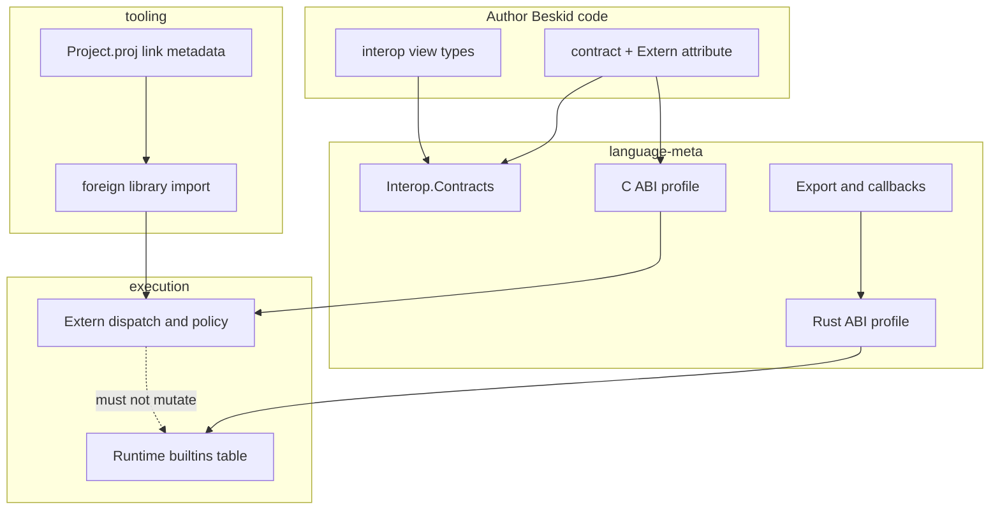

<!-- migrated from the legacy platform spec; canonical OpenSpec source -->
# FFI and extern Specification

## Purpose

v0.3 normative language surface for foreign import (Extern), interop views, and links to export/callback features.

## Requirements

### Requirement: Feature hub owns normative contract: Context [D-LMETA-FFI-0001]
The Beskid standard SHALL enforce the following migrated contract section. Accepted ADR decisions are binding; uppercase requirement keywords retain their BCP-14 meaning.

> v0.3 interop split author syntax from execution lowering; articles must not fork MUST tables.

**Stable ID:** `BSP-REQ-8950D990C2F4`  
**Legacy source:** `site/spec-content/platform-spec/language-meta/interop/ffi-and-extern/adr/0001-hub-authority/content.md`  
**Source SHA-256:** `44fb0df0364f67d0194aca9ad4eccaa546c397bae27c10a340f1f3ac75eab4b7`

#### Scenario: Conformance exercises Context
- **GIVEN** an implementation claims conformance with this capability
- **WHEN** behavior governed by this contract section is exercised
- **THEN** every MUST, SHALL, REQUIRED, prohibition, and accepted decision in the section is satisfied

### Requirement: Feature hub owns normative contract: Decision [D-LMETA-FFI-0001]
The Beskid standard SHALL enforce the following migrated contract section. Accepted ADR decisions are binding; uppercase requirement keywords retain their BCP-14 meaning.

> This feature hub **must** own normative MUST/SHOULD contract text for foreign **import**. Sibling articles **must not** redefine hub requirements.

**Stable ID:** `BSP-REQ-4D38662E723C`  
**Legacy source:** `site/spec-content/platform-spec/language-meta/interop/ffi-and-extern/adr/0001-hub-authority/content.md`  
**Source SHA-256:** `44fb0df0364f67d0194aca9ad4eccaa546c397bae27c10a340f1f3ac75eab4b7`

#### Scenario: Conformance exercises Decision
- **GIVEN** an implementation claims conformance with this capability
- **WHEN** behavior governed by this contract section is exercised
- **THEN** every MUST, SHALL, REQUIRED, prohibition, and accepted decision in the section is satisfied

### Requirement: Extern on contract declarations only: Decision [D-LMETA-FFI-0002]
The Beskid standard SHALL enforce the following migrated contract section. Accepted ADR decisions are binding; uppercase requirement keywords retain their BCP-14 meaning.

> **`Extern`** **must** apply only to **`contract`** declarations in v0.3 Standard. The reference compiler **must** reject **`Extern`** on non-contract declarations (**E1510**).

**Stable ID:** `BSP-REQ-3766618B9F9D`  
**Legacy source:** `site/spec-content/platform-spec/language-meta/interop/ffi-and-extern/adr/0002-extern-contract-level-only/content.md`  
**Source SHA-256:** `94b4ddeeb3229b67b45644d63666a6fbcda9546fc4f2b4c50f646036feb921f6`

#### Scenario: Conformance exercises Decision
- **GIVEN** an implementation claims conformance with this capability
- **WHEN** behavior governed by this contract section is exercised
- **THEN** every MUST, SHALL, REQUIRED, prohibition, and accepted decision in the section is satisfied

### Requirement: Mod-level Extern not Standard v0.3: Decision [D-LMETA-FFI-0003]
The Beskid standard SHALL enforce the following migrated contract section. Accepted ADR decisions are binding; uppercase requirement keywords retain their BCP-14 meaning.

> **`Extern` on `mod`** is **not** part of v0.3 Standard. Authors **must** use **`contract`** blocks with method signatures ending in **`;`**.

**Stable ID:** `BSP-REQ-9FEFDE4A13E3`  
**Legacy source:** `site/spec-content/platform-spec/language-meta/interop/ffi-and-extern/adr/0003-mod-level-extern-deferred/content.md`  
**Source SHA-256:** `2bb654b91b2f3b1f750c30ba597f93bc1e9a23d134b0bbca23eff32687536295`

#### Scenario: Conformance exercises Decision
- **GIVEN** an implementation claims conformance with this capability
- **WHEN** behavior governed by this contract section is exercised
- **THEN** every MUST, SHALL, REQUIRED, prohibition, and accepted decision in the section is satisfied

### Requirement: User C ABI separate from runtime Rust exports: Decision [D-LMETA-FFI-0004]
The Beskid standard SHALL enforce the following migrated contract section. Accepted ADR decisions are binding; uppercase requirement keywords retain their BCP-14 meaning.

> | Plane | Rule |
> | --- | --- |
> | User libraries | **C ABI profile** + link-time binding |
> | Runtime embedding | **Rust ABI profile** / frozen builtin table |
> | Separation | User **`Extern`** **must not** mutate runtime builtin symbol namespace |

**Stable ID:** `BSP-REQ-0225148479D8`  
**Legacy source:** `site/spec-content/platform-spec/language-meta/interop/ffi-and-extern/adr/0004-user-cabi-vs-runtime-rustabi/content.md`  
**Source SHA-256:** `5948a6f508e26c6afda578509ca3974478b0a23dabc576db9b249a39ee00b1a0`

#### Scenario: Conformance exercises Decision
- **GIVEN** an implementation claims conformance with this capability
- **WHEN** behavior governed by this contract section is exercised
- **THEN** every MUST, SHALL, REQUIRED, prohibition, and accepted decision in the section is satisfied

### Requirement: repr C records deferred to v0.3.1: Decision [D-LMETA-FFI-0005]
The Beskid standard SHALL enforce the following migrated contract section. Accepted ADR decisions are binding; uppercase requirement keywords retain their BCP-14 meaning.

> **`repr(C)`** on arbitrary Beskid types is **out of scope** for v0.3.0 Standard; **CLayout** primitive structs land in **v0.3.1** (Proposed) per [C layout types](/platform-spec/language-meta/interop/c-abi-profile/c-layout-types/).

**Stable ID:** `BSP-REQ-CCABB09E5FE4`  
**Legacy source:** `site/spec-content/platform-spec/language-meta/interop/ffi-and-extern/adr/0005-repr-c-deferred-v031/content.md`  
**Source SHA-256:** `4306a25d5e4ea044690d8c90f995688af567477f9d209701f504bfcc1e55f46c`

#### Scenario: Conformance exercises Decision
- **GIVEN** an implementation claims conformance with this capability
- **WHEN** behavior governed by this contract section is exercised
- **THEN** every MUST, SHALL, REQUIRED, prohibition, and accepted decision in the section is satisfied

## Informative Source Provenance

The records below preserve migration history and are not normative except where text was extracted into a requirement above.

### Source Record: FFI and extern

**Authority:** informative provenance  
**Legacy path:** `/platform-spec/language-meta/interop/ffi-and-extern/`  
**Source:** `site/spec-content/platform-spec/language-meta/interop/ffi-and-extern/content.md`  
**SHA-256:** `27727adc2e8bf49b5ad70fbe4be218588eba8446a056e4ca9ba5440cd04f4188`

<details>
<summary>Migrated source text</summary>

``````markdown
<SpecSection title="v0.3 scope" id="v03-scope">
**v0.3 FFI** finalizes normative platform contracts for **user interop and layout** at foreign boundaries. This pass is **spec-first**: reference compiler and CLI behavior may land in v0.3.x point releases after the text is stable.

**In scope for v0.3 Standard**

- **`Extern`** on **`contract`** declarations (import from C-compatible libraries).
- **Interop view types** (v0.3.0) for buffers and string-like data at the boundary.
- **Link-time** library binding as the conformance path for **Standard** tier-1 hosts.
- **[Export and callbacks](/platform-spec/language-meta/interop/export-and-callbacks/)** for embedding and plugin models.
- **Project `link` metadata** and **[foreign library import](/platform-spec/tooling/foreign-library-import/)** tooling.

**Out of scope or deferred**

- Changes to **`BESKID_RUNTIME_ABI_VERSION`** and the frozen runtime builtin export table — runtime embedding stays on the **[Rust ABI profile](/platform-spec/language-meta/interop/rust-abi-profile/)**.
- **`repr(C)` record types** on arbitrary Beskid types — **v0.3.1** (see **[C layout types](/platform-spec/language-meta/interop/c-abi-profile/c-layout-types/)**).
- **WinAPI / stdcall** as a **stdlib** concern — tier-1 **Standard** conformance does not require Windows user-extern linking in corelib; platform packages may document **Proposed** mappings separately.
- **Runtime `dlopen` resolution** — demoted to **[dynamic resolution profile](/platform-spec/language-meta/interop/c-abi-profile/dynamic-resolution-profile/)** (non-Standard appendix).
</SpecSection>

<SpecSection title="Profile boundary map" id="profile-boundary-map">



**Tier-1 rule:** user **`Extern`** libraries use **C ABI profile** + link-time binding. Runtime embedding and compiler builtins stay on **Rust ABI profile** / frozen `BESKID_RUNTIME_ABI_VERSION` — never mixed in the same symbol namespace.

**Link-time resolution (reference compiler):** AOT builds resolve `ExternImport` symbols through the project `link` block and `AotBuildRequest::external_libraries` (`compiler/crates/beskid_aot/src/api.rs`, `compiler/crates/beskid_aot/src/linker.rs`). See **[C ABI profile — Link-time linking](/platform-spec/language-meta/interop/c-abi-profile/link-time-linking/)** for normative rules; normative text is not duplicated here.

</SpecSection>

<SpecSection title="What this feature specifies" id="what-this-feature-specifies">
This feature is the **canonical language-level** chapter for **foreign import** in Beskid: **`Extern`** metadata, **contract** import syntax, optional per-method **symbol** overrides, and how declarations connect to **[Interop.Contracts](/platform-spec/language-meta/interop/interop-contracts/)** and the **[C ABI profile](/platform-spec/language-meta/interop/c-abi-profile/)**.

Lowering tables, linker drivers, and syscall policy remain under **`/execution/`** and **[Extern dispatch and policy](/platform-spec/execution/abi-and-host/extern-dispatch-and-policy/)**; this hub owns **author-facing rules** only.
</SpecSection>

<SpecSection title="Placement of Extern" id="placement-of-extern">
The **`Extern`** attribute is a **contract-level** interop marker only. The reference compiler **must** reject **`Extern`** on non-contract declarations (diagnostic **E1510**).

**`Extern` on `mod`** is **not** part of v0.3 Standard; bulk C-header-style surfaces should use **`contract`** blocks with method signatures ending in **`;`**.

`Extern` supplies ABI and library metadata consumed when building **`ExternImport`** records during codegen (`compiler/crates/beskid_codegen/src/lowering/lowerable.rs`).
</SpecSection>

<SpecSection title="Formal attribute shape" id="formal-attribute-shape">
The platform reserves a built-in attribute declaration equivalent to:

```beskid
pub attribute Extern(ContractDeclaration) {
    Abi: string = "C",
    Library: string,
}
```

Contract methods may carry additional method-level attributes documented in **[extern attribute schema](./extern-attribute-schema/)** (for example **`Symbol`** overrides).
</SpecSection>

<SpecSection title="Safety and pointers" id="safety-and-pointers">
Unmanaged data crossing the boundary **must** use **interop view types** or primitives permitted by the active profile. Obligations for **borrow**, **transfer**, and **opaque handles** are normative under **[ownership at the boundary](/platform-spec/language-meta/interop/interop-contracts/ownership-at-boundary/)**.

Compiler mods do **not** gain ambient FFI unless the manifest grants **`extern_ffi`** — see **[mod host bridge FAQ](/platform-spec/compiler/compiler-mods/mod-host-bridge/faq-and-troubleshooting/)**.
</SpecSection>

<SpecSection title="Implementation anchors" id="implementation-anchors">
- Grammar: `compiler/crates/beskid_analysis/src/beskid.pest` (`contract`, `ContractMethodSignature`)
- AST: `compiler/crates/beskid_analysis/src/syntax/items/contract_definition.rs`
- Semantic validation: `compiler/crates/beskid_analysis/src/types/context/context.rs`
- Diagnostics: `compiler/crates/beskid_tests/src/analysis/diagnostics.rs` (**E1510**, extern type band)
- Codegen extern collection: `compiler/crates/beskid_codegen/src/lowering/lowerable.rs`, `compiler/crates/beskid_codegen/src/lowering/context.rs`
</SpecSection>

## Decisions
<!-- spec:generate:adr-index -->
No open decisions. Closed choices are normative ADRs under **`adr/`** (`D-LMETA-FFI-0001` … `D-LMETA-FFI-0005`); use the reader **ADRs** tab for expandable detail.
<!-- /spec:generate:adr-index -->
## Articles
<!-- spec:generate:article-index -->
- [Contract import syntax](./articles/contract-import-syntax/)
- [Extern attribute schema](./articles/extern-attribute-schema/)
- [FFI and extern — Verification and traceability](./articles/verification-and-traceability/)
<!-- /spec:generate:article-index -->
``````

</details>

### Source Record: Feature hub owns normative contract

**Authority:** informative provenance  
**Legacy path:** `/platform-spec/language-meta/interop/ffi-and-extern/adr/0001-hub-authority/`  
**Source:** `site/spec-content/platform-spec/language-meta/interop/ffi-and-extern/adr/0001-hub-authority/content.md`  
**SHA-256:** `44fb0df0364f67d0194aca9ad4eccaa546c397bae27c10a340f1f3ac75eab4b7`

<details>
<summary>Migrated source text</summary>

``````markdown
## Context

v0.3 interop split author syntax from execution lowering; articles must not fork MUST tables.

## Decision

This feature hub **must** own normative MUST/SHOULD contract text for foreign **import**. Sibling articles **must not** redefine hub requirements.

## Consequences

Execution and tooling specs link here for `Extern` placement and attribute shape.

## Verification anchors

/platform-spec/language-meta/interop/ffi-and-extern/; `compiler/crates/beskid_analysis` contract validation.
``````

</details>

### Source Record: Extern on contract declarations only

**Authority:** informative provenance  
**Legacy path:** `/platform-spec/language-meta/interop/ffi-and-extern/adr/0002-extern-contract-level-only/`  
**Source:** `site/spec-content/platform-spec/language-meta/interop/ffi-and-extern/adr/0002-extern-contract-level-only/content.md`  
**SHA-256:** `94b4ddeeb3229b67b45644d63666a6fbcda9546fc4f2b4c50f646036feb921f6`

<details>
<summary>Migrated source text</summary>

``````markdown
## Context

Bulk C-style surfaces need stable contract blocks; module-level extern was exploratory.

## Decision

**`Extern`** **must** apply only to **`contract`** declarations in v0.3 Standard. The reference compiler **must** reject **`Extern`** on non-contract declarations (**E1510**).

## Consequences

Codegen collects `ExternImport` from contract metadata; mod-level extern remains non-Standard.

## Verification anchors

`compiler/crates/beskid_analysis/src/types/context/context.rs`; [extern attribute schema](/platform-spec/language-meta/interop/ffi-and-extern/extern-attribute-schema/).
``````

</details>

### Source Record: Mod-level Extern not Standard v0.3

**Authority:** informative provenance  
**Legacy path:** `/platform-spec/language-meta/interop/ffi-and-extern/adr/0003-mod-level-extern-deferred/`  
**Source:** `site/spec-content/platform-spec/language-meta/interop/ffi-and-extern/adr/0003-mod-level-extern-deferred/content.md`  
**SHA-256:** `2bb654b91b2f3b1f750c30ba597f93bc1e9a23d134b0bbca23eff32687536295`

<details>
<summary>Migrated source text</summary>

``````markdown
## Context

Header-style `Extern` on `mod` was considered for v0.3 but increases parser and ABI ambiguity.

## Decision

**`Extern` on `mod`** is **not** part of v0.3 Standard. Authors **must** use **`contract`** blocks with method signatures ending in **`;`**.

## Consequences

Future promotion requires a dedicated ADR and profile conformance tests.

## Verification anchors

/platform-spec/language-meta/interop/ffi-and-extern/ v0.3 scope section.
``````

</details>

### Source Record: User C ABI separate from runtime Rust exports

**Authority:** informative provenance  
**Legacy path:** `/platform-spec/language-meta/interop/ffi-and-extern/adr/0004-user-cabi-vs-runtime-rustabi/`  
**Source:** `site/spec-content/platform-spec/language-meta/interop/ffi-and-extern/adr/0004-user-cabi-vs-runtime-rustabi/content.md`  
**SHA-256:** `5948a6f508e26c6afda578509ca3974478b0a23dabc576db9b249a39ee00b1a0`

<details>
<summary>Migrated source text</summary>

``````markdown
## Context

Mixing user `Extern` symbols with `BESKID_RUNTIME_ABI_VERSION` exports caused namespace and stability risk.

## Decision

| Plane | Rule |
| --- | --- |
| User libraries | **C ABI profile** + link-time binding |
| Runtime embedding | **Rust ABI profile** / frozen builtin table |
| Separation | User **`Extern`** **must not** mutate runtime builtin symbol namespace |

## Consequences

JIT registration and engine policy keep tables disjoint; see profile boundary map on hub.

## Verification anchors

`compiler/crates/beskid_abi`; [Rust ABI profile](/platform-spec/language-meta/interop/rust-abi-profile/); [C ABI profile](/platform-spec/language-meta/interop/c-abi-profile/).
``````

</details>

### Source Record: repr C records deferred to v0.3.1

**Authority:** informative provenance  
**Legacy path:** `/platform-spec/language-meta/interop/ffi-and-extern/adr/0005-repr-c-deferred-v031/`  
**Source:** `site/spec-content/platform-spec/language-meta/interop/ffi-and-extern/adr/0005-repr-c-deferred-v031/content.md`  
**SHA-256:** `4306a25d5e4ea044690d8c90f995688af567477f9d209701f504bfcc1e55f46c`

<details>
<summary>Migrated source text</summary>

``````markdown
## Context

Arbitrary Beskid record `repr(C)` needs layout rules beyond interop views.

## Decision

**`repr(C)`** on arbitrary Beskid types is **out of scope** for v0.3.0 Standard; **CLayout** primitive structs land in **v0.3.1** (Proposed) per [C layout types](/platform-spec/language-meta/interop/c-abi-profile/c-layout-types/).

## Consequences

v0.3.0 Standard ships interop view types and link-time import first.

## Verification anchors

[C ABI profile](/platform-spec/language-meta/interop/c-abi-profile/).
``````

</details>

### Source Record: Contract import syntax

**Authority:** informative provenance  
**Legacy path:** `/platform-spec/language-meta/interop/ffi-and-extern/articles/contract-import-syntax/`  
**Source:** `site/spec-content/platform-spec/language-meta/interop/ffi-and-extern/articles/contract-import-syntax/content.md`  
**SHA-256:** `b02a7b4cddc92e58b9eb97afce959d21360a4f83345a6e786872f030a6dbfe04`

<details>
<summary>Migrated source text</summary>

``````markdown
## Import contracts

Foreign surface area is declared with **`contract`** blocks. Importing methods use signatures that end with **`;`** (no Beskid body), consistent with `contract` grammar in `compiler/crates/beskid_analysis/src/beskid.pest`.

Each import method contributes:

1. One **logical foreign symbol** (method name or **`Symbol`** override).
2. One **abstract call shape** after **[Interop.Contracts](/platform-spec/language-meta/interop/interop-contracts/)** normalization.
3. One **`ExternImport`** row at codegen (`symbol`, `abi`, `library`).

## Calling imported methods

Beskid code calls foreign entrypoints through the contract type, for example `Libc.getpid()`. Type checking treats the call as **contract dispatch** lowered through the **C ABI profile**.

## Implementing contracts in Beskid

Beskid types may **implement** non-extern contracts in normal source. **`Extern`** contracts are **import-only** in v0.3: methods **must not** have Beskid bodies on the same contract.

## Documentation

`///` documentation on the contract and its methods **should** describe:

- Threading and re-entrancy expectations at the foreign side.
- Ownership of each parameter (**borrow** vs **transfer**).
- Error representation (return codes vs out-parameters).

Use **`@arg`** only on **callable parameters** (methods), not on contract-level metadata fields.

## Relationship to corelib

Platform packages (for example console and threading) **should** group foreign entrypoints into small **`Extern`** contracts per library (`libc`, `libpthread`) rather than scattering raw integer pointer parameters across unrelated APIs.
``````

</details>

### Source Record: Extern attribute schema

**Authority:** informative provenance  
**Legacy path:** `/platform-spec/language-meta/interop/ffi-and-extern/articles/extern-attribute-schema/`  
**Source:** `site/spec-content/platform-spec/language-meta/interop/ffi-and-extern/articles/extern-attribute-schema/content.md`  
**SHA-256:** `e6b2a2b38f55e230530f62373125b724132c6012e24e6cf7337fa2f54653070d`

<details>
<summary>Migrated source text</summary>

``````markdown
## Contract-level `Extern`

Applied only to **`contract`** declarations.

| Field | Required | Meaning |
| --- | --- | --- |
| **`Abi`** | yes | In v0.3 Standard, **must** be **`"C"`** (case-insensitive). Other values are reserved. |
| **`Library`** | yes | Logical library identity for link-time resolution (see **[link-time linking](/platform-spec/language-meta/interop/c-abi-profile/link-time-linking/)** and **[foreign library import](/platform-spec/tooling/foreign-library-import/)**). Must be non-empty. |

Example:

```beskid
[Extern(Abi:"C", Library:"libc")]
pub contract Libc {
    i64 getpid();
}
```

## Per-method overrides (v0.3.0)

Contract methods **may** carry method-level attributes:

| Attribute | Required | Meaning |
| --- | --- | --- |
| **`Symbol`** | no | Linker / foreign symbol name when it differs from the Beskid method name (for example `Symbol:"pthread_create"`). When omitted, the **method identifier** is the logical symbol. |
| **`Library`** | no | Overrides contract-level **`Library`** for this method only. |

Example:

```beskid
[Extern(Abi:"C", Library:"libc.so.6")]
pub contract Libc {
    [Symbol("write")]
    i64 write(i32 fd, CBuffer buf, i64 count);
}
```

## Parameter modifiers (v0.3.0)

| Modifier | Meaning |
| --- | --- |
| *(none)* | **Borrow** — caller retains ownership; foreign code must not retain pointers beyond the call unless documented otherwise. |
| **`Transfer`** | **Transfer** — ownership of the view’s storage obligation moves per profile rules (see **[ownership at the boundary](/platform-spec/language-meta/interop/interop-contracts/ownership-at-boundary/)**). |
| **`GcPin`** | **Proposed** — GC-managed handle pinned for the call duration via runtime root handle; not required for Standard conformance in v0.3.0. |

`ref u8` remains valid as a **byte slice start** without length; authors **should** prefer **`CBuffer`** / **`CStringView`** interop views instead.

## Diagnostics

| Code | Condition |
| --- | --- |
| **E1510** | `Extern` applied to a disallowed declaration target |
| **E1520** | Invalid **`Abi`** (not **`"C"`**) — transition: **T0901** |
| **E1521** | Missing **`Library`** — transition: **T0902** |
| **E1522** | Disallowed extern parameter type — transition: **T0903** |
| **E1523** | Disallowed extern return type — transition: **T0904** |
| **E1524–E1539** | Export, interop views, link manifest — see registry |

Full band: **[Diagnostic code registry / design model](/platform-spec/compiler/semantic-pipeline/diagnostic-code-registry/design-model/)**. Fixtures: `compiler/crates/beskid_tests/src/analysis/ffi_v03_spec.rs`.
``````

</details>

### Source Record: FFI and extern — Verification and traceability

**Authority:** informative provenance  
**Legacy path:** `/platform-spec/language-meta/interop/ffi-and-extern/articles/verification-and-traceability/`  
**Source:** `site/spec-content/platform-spec/language-meta/interop/ffi-and-extern/articles/verification-and-traceability/content.md`  
**SHA-256:** `48595391ecd45020970a69ef407209accce903e6584847a834fc0b52d8c29938`

<details>
<summary>Migrated source text</summary>

``````markdown
## Spec-first conformance

v0.3 FFI is **normative in platform-spec** before the reference compiler fully implements link-time binding, interop views, and export/callback registration.

Toolchains **conform** to this feature when:

1. **Parse and analysis fixtures** accept valid v0.3 extern/export syntax and emit expected diagnostics for invalid forms.
2. **Codegen extraction tests** record stable **`ExternImport`** / export metadata from fixtures (where implemented).
3. **Runtime e2e tests** for link-time foreign calls may be marked **`#[ignore]`** with reason **`v0.3 FFI impl`** until the engine/CLI path lands.

## Traceability matrix

| Contract clause | Verification anchor |
| --- | --- |
| `Extern` on contract only | `beskid_tests` analysis **E1510** |
| `Abi:"C"` + `Library` | `beskid_tests` extern validation pipeline |
| Interop view types | Type fixtures + lowering signature scan (`validate_ffi_signature`) |
| Link-time libraries | Manifest contract tests + future CLI import tests |
| Export / callbacks | Dedicated fixtures under `export-and-callbacks` hub |

## Runtime ABI separation

Tests for **`RUNTIME_EXPORT_SYMBOLS`** and **`BESKID_RUNTIME_ABI_VERSION`** remain under **`beskid_tests/src/abi/contracts.rs`**. User FFI layout versioning **must not** bump the runtime ABI version unless a runtime export symbol changes.

## Maintainer rule

Any behavior change in this area **must** update platform-spec text and add or adjust tests in the same change so the specification stays executable.
``````

</details>
