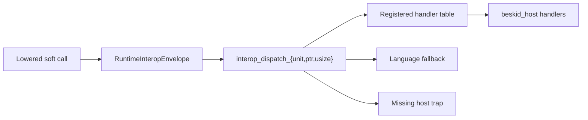
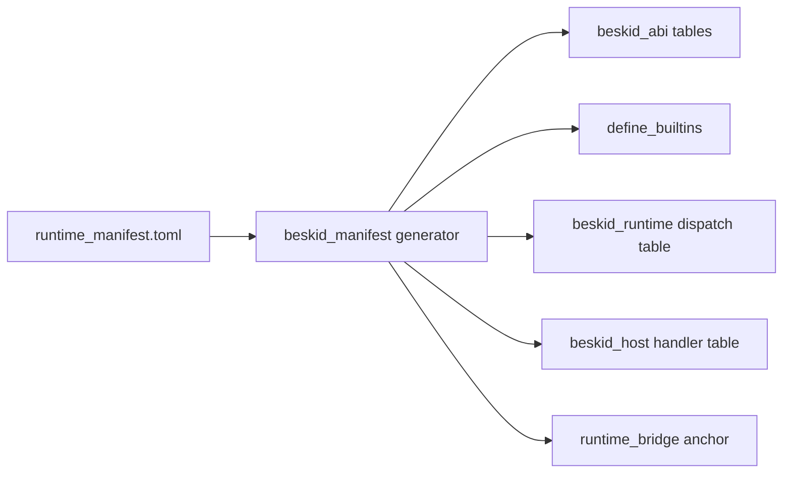

<!-- migrated from the legacy platform spec; canonical OpenSpec source -->
# Rust ABI profile Specification

## Purpose

This specification defines the Rust-hosted runtime surface. The surface covers exported symbols and unwind at the boundary. The stability rules differ from the user C extern libraries.

## Requirements

### Requirement: Feature hub owns normative contract: Decision [D-LMETA-RUSTABI-0001]
The Beskid standard SHALL enforce the following migrated contract section. Accepted ADR decisions are binding; uppercase requirement keywords retain their BCP-14 meaning.

> This feature hub **must** own normative MUST/SHOULD for **Rust-hosted runtime** interop distinct from user **C ABI profile** libraries.

**Stable ID:** `BSP-REQ-01AF40204EB4`  
**Legacy source:** `site/spec-content/platform-spec/language-meta/interop/rust-abi-profile/adr/0001-hub-authority/content.md`  
**Source SHA-256:** `3a63b0ee78d46ee27565c5340d42f46e24554d9a8548dcadbf51dab9f6b4a203`

#### Scenario: Conformance exercises Decision
- **GIVEN** an implementation claims conformance with this capability
- **WHEN** behavior governed by this contract section is exercised
- **THEN** every MUST, SHALL, REQUIRED, prohibition, and accepted decision in the section is satisfied

### Requirement: Runtime exposes C-compatible entrypoints: Decision [D-LMETA-RUSTABI-0002]
The Beskid standard SHALL enforce the following migrated contract section. Accepted ADR decisions are binding; uppercase requirement keywords retain their BCP-14 meaning.

> The Beskid runtime **must** expose **stable C-compatible entrypoints** to loaders. **Rust-specific** implementation choices **must** remain **inside** the runtime crate boundary.

**Stable ID:** `BSP-REQ-81656A98C490`  
**Legacy source:** `site/spec-content/platform-spec/language-meta/interop/rust-abi-profile/adr/0002-runtime-c-exports-rust-internal/content.md`  
**Source SHA-256:** `c6b13af23e512a1f25288cc96669c1bf3d587d788e1957bbd904a9b691a5b7cd`

#### Scenario: Conformance exercises Decision
- **GIVEN** an implementation claims conformance with this capability
- **WHEN** behavior governed by this contract section is exercised
- **THEN** every MUST, SHALL, REQUIRED, prohibition, and accepted decision in the section is satisfied

### Requirement: User Extern not arbitrary Rust crates: Decision [D-LMETA-RUSTABI-0003]
The Beskid standard SHALL enforce the following migrated contract section. Accepted ADR decisions are binding; uppercase requirement keywords retain their BCP-14 meaning.

> This profile is **not** a promise that arbitrary Rust crates can be user **`Extern`** targets without shims. User-authored foreign code on the supported path **must** remain **[C ABI profile](/platform-spec/language-meta/interop/c-abi-profile/)** until a future specification promotes additional Rust-native interop.

**Stable ID:** `BSP-REQ-3B1D8B90178B`  
**Legacy source:** `site/spec-content/platform-spec/language-meta/interop/rust-abi-profile/adr/0003-user-extern-not-rust-crates/content.md`  
**Source SHA-256:** `3185c57a435ba091529913e503d6bf733861e64b80195cccd80a1ca8cd871eb9`

#### Scenario: Conformance exercises Decision
- **GIVEN** an implementation claims conformance with this capability
- **WHEN** behavior governed by this contract section is exercised
- **THEN** every MUST, SHALL, REQUIRED, prohibition, and accepted decision in the section is satisfied

### Requirement: Language-owned runtime manifest: Decision [D-LMETA-RUSTABI-0004]
The Beskid standard SHALL enforce the following migrated contract section. Accepted ADR decisions are binding; uppercase requirement keywords retain their BCP-14 meaning.

> | Rule | Detail |
> | --- | --- |
> | Authority | `compiler/runtime_manifest.toml` is the **sole normative authority** for runtime builtin classification |
> | Generated outputs | `BUILTIN_SPECS`, `RUNTIME_EXPORT_SYMBOLS`, analysis `define_builtins!`, JIT registration, and bridge link anchors **must** be **generated** from the manifest at build time |
> | Hand edits | Hand-maintained symbol lists outside the manifest and generator **must not** ship |
> | Entry shape | Each manifest row carries `symbol`, Cranelift kinds, `beskid_path`, `injected`, `dispatch_tag`, `return_group`, and optional `corelib_owner` |

**Stable ID:** `BSP-REQ-1451CEF8D64A`  
**Legacy source:** `site/spec-content/platform-spec/language-meta/interop/rust-abi-profile/adr/0004-language-owned-runtime-manifest/content.md`  
**Source SHA-256:** `5ad3b7dbc07166ca409f2c71f0d11af625c919e317b498a033525233140ed09e`

#### Scenario: Conformance exercises Decision
- **GIVEN** an implementation claims conformance with this capability
- **WHEN** behavior governed by this contract section is exercised
- **THEN** every MUST, SHALL, REQUIRED, prohibition, and accepted decision in the section is satisfied

### Requirement: Kernel exports vs handler registration: Decision [D-LMETA-RUSTABI-0005]
The Beskid standard SHALL enforce the following migrated contract section. Accepted ADR decisions are binding; uppercase requirement keywords retain their BCP-14 meaning.

> | Layer | Role |
> | --- | --- |
> | **Kernel** | Direct `extern "C-unwind"` exports the linker/JIT **must** resolve by name — allocation, GC barriers/roots, panic, preempt, `fiber_yield`, `interop_dispatch_{unit,ptr,usize}`, `beskid_register_callbacks`, `beskid_register_handlers`, composition lifecycle, dynamic mapping (Phase A) |
> | **Dispatch** | Soft ops **must not** appear as direct kernel exports in v3; codegen routes through `interop_dispatch_*` with manifest-assigned tags |
> | **Registration** | Corelib init **must** call `beskid_register_handlers` before user static init; handler table maps tags to Rust implementations |
> | **Private impls** | Former soft `no_mangle` bodies **must** become `pub(crate)` — reachable only via dispatch or registration |
> 
> Initial v3 kernel inventory is normative in the manifest `[[kernel]]` section.

**Stable ID:** `BSP-REQ-983263D40FC4`  
**Legacy source:** `site/spec-content/platform-spec/language-meta/interop/rust-abi-profile/adr/0005-kernel-vs-dispatch-registration/content.md`  
**Source SHA-256:** `01b4dc55c188e0365bb2be95d59ce83dcaca9eb29e6769d5e7051b6407843db7`

#### Scenario: Conformance exercises Decision
- **GIVEN** an implementation claims conformance with this capability
- **WHEN** behavior governed by this contract section is exercised
- **THEN** every MUST, SHALL, REQUIRED, prohibition, and accepted decision in the section is satisfied

### Requirement: ABI v4 runtime/host split: Decision [D-EXEC-RT-0017]
The Beskid standard SHALL enforce the following migrated contract section. Accepted ADR decisions are binding; uppercase requirement keywords retain their BCP-14 meaning.

> | Rule | Detail |
> | --- | --- |
> | ABI version | The cutover is **ABI v4**. `BESKID_RUNTIME_ABI_VERSION` is `4`. |
> | Language runtime | `beskid_runtime` owns the kernel, dispatch router, GC, fibers, channels, strings, bytes, syscall dispatch handlers, and clocks. |
> | Host crate | `beskid_host` owns filesystem, environment, process, and TTY dispatch handlers. |
> | Registration | `beskid_host_register_all()` registers host handlers with `beskid_runtime::beskid_register_handlers(4, table, count)`. |
> | Runtime fallback | Host-owned tags **must not** have static `crate::builtins::*` fallback arms in `beskid_runtime`. Missing host registration traps deterministically. |
> | Profiles | The default `std` profile links runtime plus host. The `minimal` profile links the language runtime only. |
> | Corelib init | `Runtime.Init` is a documented no-op stub; host registration is performed by host/link startup, not by a Beskid handler table. |

**Stable ID:** `BSP-REQ-C0851BB0676B`  
**Legacy source:** `site/spec-content/platform-spec/language-meta/interop/rust-abi-profile/adr/0017-runtime-host-split-v4/content.md`  
**Source SHA-256:** `2a03434d0a867a0c5451be95bd5dd65f980d7b121e81ea6738a2df289b9d5bfb`

#### Scenario: Conformance exercises Decision
- **GIVEN** an implementation claims conformance with this capability
- **WHEN** behavior governed by this contract section is exercised
- **THEN** every MUST, SHALL, REQUIRED, prohibition, and accepted decision in the section is satisfied

## Informative Source Provenance

The records below preserve migration history. They are not normative except where text was extracted into a requirement above.

### Source Record: Rust ABI profile

**Authority:** informative provenance  
**Legacy path:** `/platform-spec/language-meta/interop/rust-abi-profile/`  
**Source:** `site/spec-content/platform-spec/language-meta/interop/rust-abi-profile/content.md`  
**SHA-256:** `3b07641a9648775c4605f2746ec997f9eaa4ca78689d7c58d93758570769220d`

<details>
<summary>Migrated source text</summary>

``````markdown
<SpecSection title="What this feature specifies" id="what-this-feature-specifies">
The **Rust ABI profile** describes how the **Beskid runtime** (implemented in Rust) exposes **stable C-compatible entrypoints** to JIT and AOT loaders while allowing **Rust-specific** implementation choices **inside** the runtime crate boundary.

This profile is **not** a promise that arbitrary Rust crates can be linked as user `Extern` targets without shims. User-authored foreign code on the supported path remains the **[C ABI profile](/platform-spec/language-meta/interop/c-abi-profile/)** until a future specification promotes additional Rust-native interop.
</SpecSection>

<SpecSection title="Implementation anchors" id="implementation-anchors">
- Language-owned manifest: `compiler/runtime_manifest.toml`
- Generated symbol names and specs: `compiler/crates/beskid_abi/src/generated/`
- Manifest generator: `compiler/crates/beskid_manifest/`
- Runtime exports and modules: `compiler/crates/beskid_runtime/src/lib.rs`, `compiler/crates/beskid_runtime/src/builtins/mod.rs`
- Syscall and panic bridges (example of `extern "C-unwind"` usage): `compiler/crates/beskid_runtime/src/builtins/panic_io.rs`
- JIT registration of runtime symbols: `compiler/crates/beskid_engine/src/jit_module.rs`
- Symbol inventory and runtime ABI references: `/platform-spec/execution/runtime/`
</SpecSection>

## Decisions
<!-- spec:generate:adr-index -->
No open decisions. Closed choices are normative ADRs under **`adr/`** (`D-LMETA-RUSTABI-0001` … `D-EXEC-RT-0017`); use the reader **ADRs** tab for expandable detail.
<!-- /spec:generate:adr-index -->
## Articles
<!-- spec:generate:article-index -->
- [Rust ABI profile — Boundary and stability](./articles/boundary-and-stability/)
- [Rust ABI profile — Kernel and dispatch](./articles/kernel-and-dispatch/)
- [Rust ABI profile — Runtime manifest](./articles/runtime-manifest/)
- [Rust ABI profile — Shims and compatibility strategy](./articles/shims-and-compatibility/)
<!-- /spec:generate:article-index -->
``````

</details>

### Source Record: Feature hub owns normative contract

**Authority:** informative provenance  
**Legacy path:** `/platform-spec/language-meta/interop/rust-abi-profile/adr/0001-hub-authority/`  
**Source:** `site/spec-content/platform-spec/language-meta/interop/rust-abi-profile/adr/0001-hub-authority/content.md`  
**SHA-256:** `3a63b0ee78d46ee27565c5340d42f46e24554d9a8548dcadbf51dab9f6b4a203`

<details>
<summary>Migrated source text</summary>

``````markdown
## Context

Rust runtime exports were documented beside user C extern rules.

## Decision

This feature hub **must** own normative MUST/SHOULD for **Rust-hosted runtime** interop distinct from user **C ABI profile** libraries.

## Consequences

Builtin table and ABI version policy stay here; user `Extern` stays on C profile.

## Verification anchors

/platform-spec/language-meta/interop/rust-abi-profile/
``````

</details>

### Source Record: Runtime exposes C-compatible entrypoints

**Authority:** informative provenance  
**Legacy path:** `/platform-spec/language-meta/interop/rust-abi-profile/adr/0002-runtime-c-exports-rust-internal/`  
**Source:** `site/spec-content/platform-spec/language-meta/interop/rust-abi-profile/adr/0002-runtime-c-exports-rust-internal/content.md`  
**SHA-256:** `c6b13af23e512a1f25288cc96669c1bf3d587d788e1957bbd904a9b691a5b7cd`

<details>
<summary>Migrated source text</summary>

``````markdown
## Context

JIT/AOT loaders need stable C symbol names while implementation remains Rust.

## Decision

The Beskid runtime **must** expose **stable C-compatible entrypoints** to loaders. **Rust-specific** implementation choices **must** remain **inside** the runtime crate boundary.

## Consequences

`beskid_abi` symbols and unwind bridges document the outward face only.

## Verification anchors

`compiler/crates/beskid_abi`; `compiler/crates/beskid_runtime`.
``````

</details>

### Source Record: User Extern not arbitrary Rust crates

**Authority:** informative provenance  
**Legacy path:** `/platform-spec/language-meta/interop/rust-abi-profile/adr/0003-user-extern-not-rust-crates/`  
**Source:** `site/spec-content/platform-spec/language-meta/interop/rust-abi-profile/adr/0003-user-extern-not-rust-crates/content.md`  
**SHA-256:** `3185c57a435ba091529913e503d6bf733861e64b80195cccd80a1ca8cd871eb9`

<details>
<summary>Migrated source text</summary>

``````markdown
## Context

Linking arbitrary `rlib` targets as user Extern would imply unstable Rust ABI across toolchains.

## Decision

This profile is **not** a promise that arbitrary Rust crates can be user **`Extern`** targets without shims. User-authored foreign code on the supported path **must** remain **[C ABI profile](/platform-spec/language-meta/interop/c-abi-profile/)** until a future specification promotes additional Rust-native interop.

## Consequences

Embedding docs steer authors to C contracts + shims for Rust libraries.

## Verification anchors

/platform-spec/language-meta/interop/rust-abi-profile/ and [FFI and extern](/platform-spec/language-meta/interop/ffi-and-extern/).
``````

</details>

### Source Record: Language-owned runtime manifest

**Authority:** informative provenance  
**Legacy path:** `/platform-spec/language-meta/interop/rust-abi-profile/adr/0004-language-owned-runtime-manifest/`  
**Source:** `site/spec-content/platform-spec/language-meta/interop/rust-abi-profile/adr/0004-language-owned-runtime-manifest/content.md`  
**SHA-256:** `5ad3b7dbc07166ca409f2c71f0d11af625c919e317b498a033525233140ed09e`

<details>
<summary>Migrated source text</summary>

``````markdown
## Context

Runtime ABI tables were maintained in four parallel Rust registries (`beskid_abi`, analysis builtins, JIT registration, runtime bridge). Manual sync drifted from corelib ownership and made v3 kernel shrink impossible to audit.

## Decision

| Rule | Detail |
| --- | --- |
| Authority | `compiler/runtime_manifest.toml` is the **sole normative authority** for runtime builtin classification |
| Generated outputs | `BUILTIN_SPECS`, `RUNTIME_EXPORT_SYMBOLS`, analysis `define_builtins!`, JIT registration, and bridge link anchors **must** be **generated** from the manifest at build time |
| Hand edits | Hand-maintained symbol lists outside the manifest and generator **must not** ship |
| Entry shape | Each manifest row carries `symbol`, Cranelift kinds, `beskid_path`, `injected`, `dispatch_tag`, `return_group`, and optional `corelib_owner` |

## Consequences

[D-LMETA-RUSTABI-0002](/platform-spec/language-meta/interop/rust-abi-profile/adr/0002-runtime-c-exports-rust-internal/) remains valid but applies to **kernel** exports only. See [runtime manifest](/platform-spec/language-meta/interop/rust-abi-profile/runtime-manifest/) for schema and generation pipeline.

## Verification anchors

`compiler/runtime_manifest.toml`; `compiler/crates/beskid_manifest/`; generated stubs under `compiler/crates/beskid_abi/src/`.
``````

</details>

### Source Record: Kernel exports vs handler registration

**Authority:** informative provenance  
**Legacy path:** `/platform-spec/language-meta/interop/rust-abi-profile/adr/0005-kernel-vs-dispatch-registration/`  
**Source:** `site/spec-content/platform-spec/language-meta/interop/rust-abi-profile/adr/0005-kernel-vs-dispatch-registration/content.md`  
**SHA-256:** `01b4dc55c188e0365bb2be95d59ce83dcaca9eb29e6769d5e7051b6407843db7`

<details>
<summary>Migrated source text</summary>

``````markdown
## Context

ABI v2 exported ~80 direct `no_mangle` symbols. Hot paths (GC, panic, preempt) need stable direct calls; soft ops (strings, channels, fibers) can route through tag dispatch without bloating the linker surface.

## Decision

| Layer | Role |
| --- | --- |
| **Kernel** | Direct `extern "C-unwind"` exports the linker/JIT **must** resolve by name — allocation, GC barriers/roots, panic, preempt, `fiber_yield`, `interop_dispatch_{unit,ptr,usize}`, `beskid_register_callbacks`, `beskid_register_handlers`, composition lifecycle, dynamic mapping (Phase A) |
| **Dispatch** | Soft ops **must not** appear as direct kernel exports in v3; codegen routes through `interop_dispatch_*` with manifest-assigned tags |
| **Registration** | Corelib init **must** call `beskid_register_handlers` before user static init; handler table maps tags to Rust implementations |
| **Private impls** | Former soft `no_mangle` bodies **must** become `pub(crate)` — reachable only via dispatch or registration |

Initial v3 kernel inventory is normative in the manifest `[[kernel]]` section.

## Consequences

Stable surface narrows to kernel exports plus [dispatch envelope layout](/platform-spec/language-meta/interop/interop-contracts/adr/0004-dispatch-envelope-layout/). See [kernel and dispatch](/platform-spec/language-meta/interop/rust-abi-profile/kernel-and-dispatch/) for call paths.

## Verification anchors

`compiler/runtime_manifest.toml`; `compiler/crates/beskid_runtime/src/interop/`; `compiler/crates/beskid_tests/src/abi/contracts.rs`.
``````

</details>

### Source Record: ABI v4 runtime/host split

**Authority:** informative provenance  
**Legacy path:** `/platform-spec/language-meta/interop/rust-abi-profile/adr/0017-runtime-host-split-v4/`  
**Source:** `site/spec-content/platform-spec/language-meta/interop/rust-abi-profile/adr/0017-runtime-host-split-v4/content.md`  
**SHA-256:** `2a03434d0a867a0c5451be95bd5dd65f980d7b121e81ea6738a2df289b9d5bfb`

<details>
<summary>Migrated source text</summary>

``````markdown
## Context

ABI v3 removed many legacy direct exports from the runtime kernel, but the `beskid_runtime` crate still contained host-adjacent dispatch handlers for filesystem, environment, process, and terminal behavior. That made a runtime-only test profile carry OS authority it did not need, and it blurred the boundary between language runtime services and host composition.

[D-LMETA-RUSTABI-0004](/platform-spec/language-meta/interop/rust-abi-profile/adr/0004-language-owned-runtime-manifest/) remains the manifest authority. This decision narrows what the language runtime may satisfy with static dispatch fallback.

## Decision

| Rule | Detail |
| --- | --- |
| ABI version | The cutover is **ABI v4**. `BESKID_RUNTIME_ABI_VERSION` is `4`. |
| Language runtime | `beskid_runtime` owns the kernel, dispatch router, GC, fibers, channels, strings, bytes, syscall dispatch handlers, and clocks. |
| Host crate | `beskid_host` owns filesystem, environment, process, and TTY dispatch handlers. |
| Registration | `beskid_host_register_all()` registers host handlers with `beskid_runtime::beskid_register_handlers(4, table, count)`. |
| Runtime fallback | Host-owned tags **must not** have static `crate::builtins::*` fallback arms in `beskid_runtime`. Missing host registration traps deterministically. |
| Profiles | The default `std` profile links runtime plus host. The `minimal` profile links the language runtime only. |
| Corelib init | `Runtime.Init` is a documented no-op stub; host registration is performed by host/link startup, not by a Beskid handler table. |

## Host-owned dispatch rows

The host owner covers the manifest rows for `fs_write_text`, `fs_read_text`, `fs_delete`, `fs_exists`, `fs_mkdir`, `env_get`, `env_getcwd`, `env_set`, `process_exit`, `process_getpid`, and `tty_winsize`.

`syscall_read`, `syscall_write`, `syscall_read_bytes`, `syscall_write_bytes`, `clock_monotonic_nanos`, `clock_realtime_nanos`, and `fiber_now_millis` stay language-owned in `beskid_runtime`.

## Consequences

- `beskid run`, `beskid test`, `beskid build`, and `beskid repl` use the `std` runtime profile unless the caller requests `--runtime-profile minimal`.
- Minimal-profile programs may use language-runtime services such as `Testing` and panic/syscall output, but host-owned `System.FS`, environment, process, and terminal dispatch surfaces trap unless a host registers handlers.
- AOT runtime bundles must include a v4 host archive or equivalent host link anchor for the `std` profile.
- Contract tests must assert that host symbols are not kernel exports and that host-owned manifest rows have registration-table coverage.

## Verification anchors

- `compiler/runtime_manifest.toml` — `abi_version = 4`, dispatch `owner`, and runtime profiles.
- `compiler/crates/beskid_manifest/` — runtime dispatch codegen and host-handler table codegen.
- `compiler/crates/beskid_runtime/src/generated/dispatch_table.rs` — host tags trap without registration.
- `compiler/crates/beskid_host/` — host handler implementations and `beskid_host_register_all()`.
- `compiler/crates/beskid_tests/src/abi/contracts.rs` — ABI v4 and host-export contracts.
``````

</details>

### Source Record: Rust ABI profile — Boundary and stability

**Authority:** informative provenance  
**Legacy path:** `/platform-spec/language-meta/interop/rust-abi-profile/articles/boundary-and-stability/`  
**Source:** `site/spec-content/platform-spec/language-meta/interop/rust-abi-profile/articles/boundary-and-stability/content.md`  
**SHA-256:** `50f6a14f99c59e77ac52720265813eb495bbef59a2a8e37bffe1587e59c71f29`

<details>
<summary>Migrated source text</summary>

``````markdown
## Stable surface

The **normative stable surface** for loaders and generated code in ABI v3 is:

1. **Kernel exports** — the small set of direct `extern "C-unwind"` symbols published through generated `beskid_abi` tables and realized in `beskid_runtime` (see [kernel and dispatch](/platform-spec/language-meta/interop/rust-abi-profile/kernel-and-dispatch/)).
2. **Dispatch envelope layout** — the versioned `RuntimeInteropEnvelope` band and tag validity rules ([D-LMETA-IC-0004](/platform-spec/language-meta/interop/interop-contracts/adr/0004-dispatch-envelope-layout/)).

Soft runtime ops are **not** stable as individual linker symbols in v3; they are stable as **manifest-assigned dispatch tags** routed through `interop_dispatch_*` kernel entrypoints. Conformance tests lock the kernel allowlist and envelope band for a given **runtime ABI version** (see `compiler/crates/beskid_tests/src/abi/contracts.rs`).

## Implementation-private Rust

Rust types, modules, and internal helpers inside `beskid_runtime` that are **not** part of the exported symbol contract may change across compiler releases without a major ABI version bump, provided tests and documented runtime behavior remain compatible.

## Unwind and panics

Runtime entrypoints may use **`extern "C-unwind"`** (or equivalent) where platform policy requires interoperable unwinding with generated code. The exact mapping is **profile-defined** and must stay consistent with panic and IO documentation under `/execution/runtime/`.
``````

</details>

### Source Record: Rust ABI profile — Kernel and dispatch

**Authority:** informative provenance  
**Legacy path:** `/platform-spec/language-meta/interop/rust-abi-profile/articles/kernel-and-dispatch/`  
**Source:** `site/spec-content/platform-spec/language-meta/interop/rust-abi-profile/articles/kernel-and-dispatch/content.md`  
**SHA-256:** `7cd7415f756fce53ac3047c842380bc7989973a27935d6eab69bc24b3ec19f0b`

<details>
<summary>Migrated source text</summary>

``````markdown
## Purpose

ABI v4 splits runtime entry into a **small language kernel**, **language-owned dispatch fallbacks**, and **host-owned dispatch handlers** registered by `beskid_host`. This article describes the call paths and the registration model after [D-EXEC-RT-0017](/platform-spec/language-meta/interop/rust-abi-profile/adr/0017-runtime-host-split-v4/).

## Direct kernel path

Hot, layout-sensitive, or bootstrap operations stay **direct**:


Examples: `alloc`, `gc_write_barrier`, `panic`, `panic_str`, `runtime_preempt_check`, `fiber_yield`, composition container lifecycle, dynamic mapping, dispatch entrypoints, registration entrypoints, and the ABI version export.

## Dispatch path

Soft ops emit a **`RuntimeInteropEnvelope`** and call the matching kernel dispatch builtin:



Codegen selects `interop_dispatch_unit`, `interop_dispatch_ptr`, or `interop_dispatch_usize` from the manifest return group. The runtime validates the tag and first checks the registered handler table. If no handler is registered, language-owned tags may fall back to static `beskid_runtime` builtins. Host-owned tags must not fall back to runtime builtins; they trap with a missing-host-handler diagnostic.

## Handler registration

Before user code runs in the `std` runtime profile:

1. The engine, runtime bridge, or AOT link anchor includes `beskid_host`.
2. Startup calls `beskid_host_register_all()`.
3. `beskid_host_register_all()` calls `beskid_register_handlers(4, table, count)` with FS/env/process/TTY handler entries.
4. User code may call host-owned dispatch surfaces through the same `System.*` facades.

The `minimal` profile links `beskid_runtime` only. In that profile, host-owned tags remain valid manifest tags but trap when used because no host handler table is registered.

Registration **must** complete before user static init ([D-EXEC-ABI-0008](/platform-spec/execution/abi-and-host/extern-dispatch-and-policy/adr/0007-handler-registration-init-order/)). Unknown tags must trap; known host tags without registration must trap deterministically.

## v4 kernel inventory

| Category | Symbols |
| --- | --- |
| Version | `beskid_runtime_abi_version` |
| Allocation / GC | `alloc`, `gc_write_barrier`, `gc_root_handle`, `gc_unroot_handle`, `gc_register_root`, `gc_unregister_root` |
| Faults / scheduling | `panic`, `panic_str`, `runtime_preempt_check`, `fiber_yield` |
| Dispatch | `interop_dispatch_unit`, `interop_dispatch_ptr`, `interop_dispatch_usize` |
| Registration | `beskid_register_callbacks`, `beskid_register_handlers` |
| Composition / dynamic | composition container lifecycle symbols; dynamic mapping symbols |

Language-owned dispatch remains in `beskid_runtime` for strings, bytes, arrays, GC status, fibers, channels, clocks, and `syscall_*`. Host-owned dispatch (`fs_*`, `env_*`, `process_*`, `tty_winsize`) is supplied by `beskid_host` in the `std` profile.

## Related topics

- [Runtime manifest](./runtime-manifest/) — schema, owners, and profiles
- [Boundary and stability](./boundary-and-stability/) — what loaders may rely on
- [Dispatch envelope layout](/platform-spec/language-meta/interop/interop-contracts/adr/0004-dispatch-envelope-layout/)
``````

</details>

### Source Record: Rust ABI profile — Runtime manifest

**Authority:** informative provenance  
**Legacy path:** `/platform-spec/language-meta/interop/rust-abi-profile/articles/runtime-manifest/`  
**Source:** `site/spec-content/platform-spec/language-meta/interop/rust-abi-profile/articles/runtime-manifest/content.md`  
**SHA-256:** `cd391ef96cc328df1154bc660970b2fd78dcc378b59d6461d6a8bd65a7c87607`

<details>
<summary>Migrated source text</summary>

``````markdown
## Purpose

The **runtime manifest** (`compiler/runtime_manifest.toml`) is the language-owned catalog that classifies every runtime builtin as a **kernel** direct export or a **dispatch** soft op. ABI v4 also classifies every dispatch row by runtime authority: **language** or **host**.

Rust registries are **generated** from this file — not edited by hand.

## Schema

Manifest rows use TOML tables grouped by role:

```toml
[manifest]
abi_version = 4

[profiles.minimal]
owners = ["language"]

[profiles.std]
owners = ["language", "host"]

[[kernel]]
symbol = "alloc"
params = ["usize", "ptr"]
returns = "ptr"
injected = true
beskid_path = ["__alloc"]

[[dispatch.usize]]
tag = 0
name = "StrLen"
beskid_path = ["__str_len"]
dispatch_key = "str_len"
owner = "language"

[[dispatch.usize]]
tag = 1
name = "FsWriteText"
beskid_path = ["__fs_write_text"]
dispatch_key = "fs_write_text"
owner = "host"
```

Each entry carries:

| Field | Meaning |
| --- | --- |
| `symbol` | Linker-visible name for kernel rows |
| `params` / `returns` | Cranelift ABI kinds |
| `beskid_path` | Compiler-visible `__*` path |
| `tag` | Tag integer for dispatch rows |
| `return_group` | The dispatch table group: `unit`, `ptr`, `usize`, or `i64` |
| `dispatch_key` | Stable routing key for generated lookup tables and handler wrappers (not a kernel export) |
| `owner` | Dispatch authority: `language` or `host` |
| `injected` | Whether the compiler injects the Beskid `__*` path |

## Runtime profiles

| Profile | Owners | Behavior |
| --- | --- | --- |
| `minimal` | `language` | Links `beskid_runtime` only. Language-owned dispatch has runtime fallback; host-owned tags trap if called. |
| `std` | `language`, `host` | Links `beskid_runtime` plus `beskid_host`. Host-owned tags are registered before user entry. |

The CLI defaults to `std`. `--runtime-profile minimal` exists for testing and host-less programs that do not use FS/env/process/TTY surfaces.

## Ownership

| Owner | Responsibility |
| --- | --- |
| **Language / platform spec** | Manifest schema, kernel inventory, tag assignment policy, profile semantics |
| **Generator** | Mechanical emission — no business logic outside manifest classification |
| **Runtime crate** | Kernel exports, dispatch router, and static fallback for language-owned dispatch |
| **Host crate** | FS/env/process/TTY dispatch handlers and `beskid_host_register_all()` |
| **Corelib** | Public `System.*` facades and `Runtime.Abi` constants that mirror manifest tags |

Host-owned dispatch rows in ABI v4 are `fs_write_text`, `fs_read_text`, `fs_delete`, `fs_exists`, `fs_mkdir`, `env_get`, `env_getcwd`, `env_set`, `process_exit`, `process_getpid`, and `tty_winsize`.

`syscall_*`, clocks, fibers, channels, strings, bytes, arrays, GC status, events, mutexes, hubs, and wait groups remain language-owned.

## Generation pipeline



`beskid_abi` `build.rs` runs the generator and writes:

- `src/generated/builtins.rs` — `BUILTIN_SPECS`
- `src/generated/symbols.rs` — `RUNTIME_EXPORT_SYMBOLS`, `SYM_*`
- dispatch lookup and tag tables consumed by compiler and tests
- runtime dispatch tables with language fallback only
- host-handler tables consumed by `beskid_host`
- analysis, JIT, and bridge stubs in their respective crates

`cargo:rerun-if-changed=runtime_manifest.toml` keeps outputs in sync.

Normative decisions: [D-LMETA-RUSTABI-0004](/platform-spec/language-meta/interop/rust-abi-profile/adr/0004-language-owned-runtime-manifest/) and [D-EXEC-RT-0017](/platform-spec/language-meta/interop/rust-abi-profile/adr/0017-runtime-host-split-v4/).

## Related topics

- [Kernel and dispatch](./kernel-and-dispatch/) — call paths after generation
- [Manifest-generated registries](/platform-spec/execution/abi-and-host/builtins-and-symbols/adr/0005-manifest-generated-registries/) — execution-side registry rules
``````

</details>

### Source Record: Rust ABI profile — Shims and compatibility strategy

**Authority:** informative provenance  
**Legacy path:** `/platform-spec/language-meta/interop/rust-abi-profile/articles/shims-and-compatibility/`  
**Source:** `site/spec-content/platform-spec/language-meta/interop/rust-abi-profile/articles/shims-and-compatibility/content.md`  
**SHA-256:** `010c5b697b6b181ac8933d4a092eec540aaaa553ce9c9f5ed5b3455491795d43`

<details>
<summary>Migrated source text</summary>

``````markdown
## Shim pattern

Any future **Rust-native** user interop would introduce **thin shim symbols** with stable C names that delegate to Rust `extern "Rust"` or crate-specific metadata. **Interop.Contracts** normalization would run **before** shim emission so that profiles remain composable.

## Compatibility bands

The platform can evolve:

1. **Band A** — C-profile user `Extern` and the v3 **kernel export set** plus dispatch envelope layout (today’s supported story).
2. **Band B** — manifest-driven handler registration and `[Runtime]`-attributed corelib shims; soft ops route through `interop_dispatch_*` rather than direct linker symbols ([runtime manifest](/platform-spec/language-meta/interop/rust-abi-profile/runtime-manifest/)).

Upgrades **must** preserve Band A artifacts unless accompanied by a major ABI version policy change documented under **[conformance and versioning](/platform-spec/language-meta/interop/interop-contracts/conformance-and-versioning/)**.
``````

</details>
