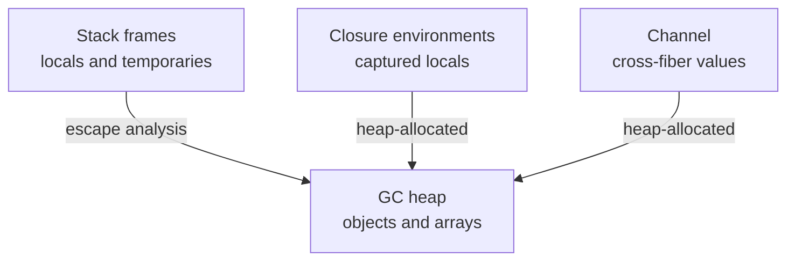
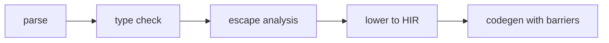

<!-- migrated from the legacy platform spec; canonical OpenSpec source -->
# Memory and references Specification

## Purpose

Locals, mut bindings, heap objects under a concurrent GC, and fiber sharing rules. Runtime write barriers and collector phases defer to execution specs; /execution/ is a non-normative legacy bridge.

## Requirements

### Requirement: Locals mut and assignment
Assignment to immutable bindings MUST error (**E1214**). `mut` MUST appear as a prefix modifier before the type or after `let` to allow reassignment (`mut T name = expr`, `let mut name = expr`, or `mut T name` parameters). Legacy suffix form `T mut name` MUST be rejected by the parser. Parameters are passed by value in v0.1; `ref` and `out` parameter modifiers are not part of v0.1.

#### Scenario: Assignment to immutable local
- **GIVEN** a non-`mut` local binding
- **WHEN** code assigns to that binding
- **THEN** the compiler emits **E1214**

### Requirement: Arrays heap and null prohibition
`T[]` values MUST use the fat-pointer layout (`BeskidArray`) described in execution ABI material. Element access MUST respect bounds checks in safe builds. Reference-bearing values that escape their defining frame MUST live on the GC heap. User code MUST NOT expose manual `free` or untracked pointers in v0.1. `null` MUST NOT appear as a value; optional absence MUST use `Option<T>`. Pointer stores to heap objects MUST execute write barriers when required by the active GC phase.

#### Scenario: Null literal rejected
- **GIVEN** a program that uses a `null` literal as a value
- **WHEN** the program is type-checked under v0.1
- **THEN** the compiler rejects `null` and requires `Option<T>` or an explicit absent variant

### Requirement: Cross-fiber sharing
Values MUST NOT be shared across fibers by alias unless immutability is proven or synchronization uses `Channel<T>`. Capturing mutable shared state in `spawn` closures SHOULD be rejected when detectable. Closure environments MUST outlive uses tracked by the compiler’s capture analysis.

#### Scenario: Unsynchronized cross-fiber alias
- **GIVEN** a mutable value aliased into two fibers without proven immutability or a `Channel<T>`
- **WHEN** sharing analysis runs
- **THEN** the compiler rejects the sharing or diagnoses detectable mutable capture

## Informative Source Provenance

The records below preserve migration history and are not normative except where text was extracted into a requirement above.

### Source Record: Memory and references

**Authority:** informative provenance  
**Legacy path:** `/platform-spec/language-meta/memory-model/memory-and-references/`  
**Source:** `site/spec-content/platform-spec/language-meta/memory-model/memory-and-references/content.md`  
**SHA-256:** `d64ab2a24007fbb462198eee3e7fcd1a92867c0668708f833ca3af0f16fbe2bb`

<details>
<summary>Migrated source text</summary>

``````markdown
## Normative specification

### Scope

Defines **local storage**, **`mut` bindings**, **GC-managed heap objects**, **arrays**, and **cross-fiber sharing** at the language level. Collector algorithms and write barriers **must** match execution platform-spec; the `/execution/` doc tree is informative only.

### Locals and assignment

- Locals live in function activation records unless captured by closures (see [Lambdas and closures](/platform-spec/language-meta/evaluation/lambdas-and-closures/)).
- Assignment to immutable bindings **must** error (**E1214**).
- `mut` **must** appear as a **prefix modifier** before the type or after `let` to allow reassignment:
  - Typed locals: `mut T name = expr` (for example `mut i64 acc = 0`).
  - Inferred locals: `let mut name = expr`.
  - Parameters: `mut T name` (for example `fn f(mut u8[] buf)`).
- Legacy suffix form `T mut name` **must** be rejected by the parser.

### Parameter passing

- Parameters are passed **by value** in v0.1. Callees that must update caller-visible state **must** return values or use heap/`T[]` handles per the array ABI.
- `ref` and `out` parameter modifiers are **not** part of v0.1.

### Arrays

- `T[]` values use the fat-pointer layout (`BeskidArray`) described in execution ABI material.
- Element access **must** respect bounds checks in safe builds (lowering inserts checks unless proven).

### Heap and garbage collection

- Reference-bearing values that escape their defining frame **must** live on the **GC heap** traced by the runtime collector (concurrent tri-color mark-sweep in the reference implementation).
- User code **must not** expose manual `free` or untracked pointers in v0.1.
- Pointer stores to heap objects **must** execute **write barriers** when required by the active GC phase (see execution memory contracts).
- `null` **must not** appear as a value; optional absence uses `Option<T>` per [Types](/platform-spec/language-meta/type-system/types/).

### Fibers and sharing

- Values **must not** be shared across fibers by alias unless immutability is proven or synchronization uses `Channel<T>` per [Fibers and spawn](/platform-spec/language-meta/evaluation/fibers-and-spawn/).
- Capturing mutable shared state in `spawn` closures **should** be rejected when detectable.

### Dynamic semantics

- Stack frames are tied to call/return; `return` ends the frame and invalidates temporaries.
- Closure environments **must** outlive uses tracked by the compiler’s capture analysis.

### Diagnostics

Immutability **E1214**; member access **E1211–E1213**. Registry: [Diagnostic code registry](/platform-spec/compiler/semantic-pipeline/diagnostic-code-registry/).

### Conformance

Memory rules enforced in `beskid_analysis` **must** be preserved in codegen for **L3** claims.

## Decisions
<!-- spec:generate:adr-index -->
No ADRs published under **`adr/`** yet.
<!-- /spec:generate:adr-index -->
## Articles
<!-- spec:generate:article-index -->
- [Memory and references - Contracts and edge cases](./articles/contracts-and-edge-cases/)
- [Memory and references - Design model](./articles/design-model/)
- [Memory and references - Examples](./articles/examples/)
- [Memory and references - FAQ and troubleshooting](./articles/faq-and-troubleshooting/)
- [Memory and references - Flow and algorithm](./articles/flow-and-algorithm/)
- [Memory and references - Verification and traceability](./articles/verification-and-traceability/)
<!-- /spec:generate:article-index -->
``````

</details>

### Source Record: Memory and references - Contracts and edge cases

**Authority:** informative provenance  
**Legacy path:** `/platform-spec/language-meta/memory-model/memory-and-references/articles/contracts-and-edge-cases/`  
**Source:** `site/spec-content/platform-spec/language-meta/memory-model/memory-and-references/articles/contracts-and-edge-cases/content.md`  
**SHA-256:** `4165774b91535f27f55c70ab5a8836ca05b12ae1340ad266eb0e139a1caffce9`

<details>
<summary>Migrated source text</summary>

``````markdown
## Hard requirements

- **Channel-only fiber sharing** — Language law forbids ad hoc shared mutable globals across fibers.
- **Fat-pointer arrays** — All `T[]` share one ABI representation per target.
- **GC by default** — Heap objects are collector-managed; escape analysis may stack-allocate but must not skip tracing when pointers escape.
- **No `null` addresses** — References are non-null at the type level; `Option<T>` models absence.

## Diagnostic band

| Code | Condition |
| --- | --- |
| **E1214** | Assignment to immutable binding |
| **E1225** | Stack reference escapes spawn |

## Edge cases

- **Empty array** — `i32[] {}` is valid; length is zero.
- **Array of structs** — Struct elements are stored inline in the array buffer.
- **Ref to local** — `ref` parameters may alias local variables; the compiler tracks aliasing for definite assignment.
- **Closure capture of ref** — Capturing a `ref` parameter in a closure requires heap allocation of the alias.

## Invariants

- Stack frames are tied to call/return; `return` ends the frame and invalidates temporaries.
- Closure environments must outlive uses tracked by the compiler's capture analysis.
- Memory rules enforced in `beskid_analysis` must be preserved in codegen for L3 claims.
``````

</details>

### Source Record: Memory and references - Design model

**Authority:** informative provenance  
**Legacy path:** `/platform-spec/language-meta/memory-model/memory-and-references/articles/design-model/`  
**Source:** `site/spec-content/platform-spec/language-meta/memory-model/memory-and-references/articles/design-model/content.md`  
**SHA-256:** `a7a2d994fe1f786670a8a1ae29242b7f1387f3ba0870076e110dc9fd252b2340`

<details>
<summary>Migrated source text</summary>

``````markdown
## Vocabulary

| Construct | Role |
| --- | --- |
| **`mut T name`** | Mutable binding (prefix modifier before type) |
| **`let mut name`** | Mutable inferred local |
| **`BeskidArray`** | Fat-pointer layout for array values |
| **GC heap** | Collector-managed storage for escaped reference-bearing values |

## Memory architecture

Beskid uses a **concurrent tri-color mark-sweep GC** in the reference implementation. User code cannot manually free heap objects.



### Subsystem boundaries

| Subsystem | Responsibility | Key file |
| --- | --- | --- |
| Parser | Parse prefix `mut` on bindings | `beskid.pest` |
| Type checker | Validate `mut` reassignment rules | `types/context/` |
| Semantic rules | Immutable assignment check | `analysis/rules/staged/` |
| Runtime | GC and heap management | `beskid_runtime/src/gc.rs` |
| Codegen | Emit write barriers | `beskid_codegen` |

## Local storage

Locals live in function activation records unless captured by closures. Assignment to immutable bindings emits **E1214**.

## `mut` bindings

- Typed locals and parameters use `mut` before the type: `mut i64 acc = 0`, `fn f(mut u8[] buf)`.
- Inferred locals use `let mut name = expr`.
- Parameters pass by value; mutation of caller state uses return values or heap/`T[]` handles.

## Arrays

`T[]` values use the fat-pointer layout (`BeskidArray`). Element access respects bounds checks in safe builds.

## Cross-fiber sharing

Values must not be shared across fibers by alias unless immutability is proven or synchronization uses `Channel<T>`.
``````

</details>

### Source Record: Memory and references - Examples

**Authority:** informative provenance  
**Legacy path:** `/platform-spec/language-meta/memory-model/memory-and-references/articles/examples/`  
**Source:** `site/spec-content/platform-spec/language-meta/memory-model/memory-and-references/articles/examples/content.md`  
**SHA-256:** `a2bb333baef63990765b71dccd5cc6d0fbf442d03fb86dc50112126535b38ce5`

<details>
<summary>Migrated source text</summary>

``````markdown
## Mutable local

```beskid
unit Counter() {
    mut i64 count = 0;
    count = count + 1;
}
```

## Inferred mutable local

```beskid
unit InferredMut() {
    let mut total = 0;
    total = total + 10;
}
```

## Mutable parameter

```beskid
unit Bump(mut i64 value) {
    value = value + 1;
}
```

## Array allocation

```beskid
unit Arrays() {
    u8[] buf = __array_new(1, 4);
    buf[0] = 1;
}
```

## Cross-fiber channel

```beskid
unit FiberShare() {
    let ch = Channel.New<i64>();
    spawn {
        ch.Send(42);
    };
    let value = ch.Receive();
}
```
``````

</details>

### Source Record: Memory and references - FAQ and troubleshooting

**Authority:** informative provenance  
**Legacy path:** `/platform-spec/language-meta/memory-model/memory-and-references/articles/faq-and-troubleshooting/`  
**Source:** `site/spec-content/platform-spec/language-meta/memory-model/memory-and-references/articles/faq-and-troubleshooting/content.md`  
**SHA-256:** `ddd166de521fa5bb7232c4c82fae9f2ef56ebc5af2732a187debb6470251975f`

<details>
<summary>Migrated source text</summary>

``````markdown
## Locked decisions

| Decision | ID | Summary |
| --- | --- | --- |
| Channel-only fiber sharing | D-LM-MEM-001 | No ad hoc shared mutable globals |
| Fat-pointer arrays | D-LM-MEM-002 | Single ABI representation per target |
| GC by default | D-LM-MEM-003 | Heap objects collector-managed |
| No `null` addresses | D-LM-MEM-004 | `Option<T>` models absence |

## FAQ

### Can I use pointers?

No. User code must not expose manual `free` or untracked pointers in v0.1.

### How do I declare a mutable local?

Use prefix `mut` before the type (`mut i64 acc = 0`) or `let mut name = expr` when the type is inferred.

### How do I share data between fibers?

Use `Channel<T>` for safe cross-fiber communication. Direct alias sharing is forbidden.

## Troubleshooting

| Symptom | Likely cause |
| --- | --- |
| **E1214** | Assigning to an immutable binding |
| **E1225** | Stack reference captured in a `spawn` closure |
| Bounds check failure | Array index out of range |
| GC pause | Normal behavior for concurrent mark-sweep |
``````

</details>

### Source Record: Memory and references - Flow and algorithm

**Authority:** informative provenance  
**Legacy path:** `/platform-spec/language-meta/memory-model/memory-and-references/articles/flow-and-algorithm/`  
**Source:** `site/spec-content/platform-spec/language-meta/memory-model/memory-and-references/articles/flow-and-algorithm/content.md`  
**SHA-256:** `b7669d09c84a4b6e2531d3e0ab6e2765bc572c225fd5120ae19338331a533ecf`

<details>
<summary>Migrated source text</summary>

``````markdown
## Compile pipeline placement



## Memory validation algorithm (normative)

1. **Parse declarations** — prefix `mut` on `TypedLetStatement`, `InferredLetStatement`, and `Parameter` nodes.
2. **Check immutability** — `ImmutableAssignment` (**E1214**) fires when assigning to a non-`mut` binding.
4. **Escape analysis** — Identify reference-bearing values that escape their defining frame.
5. **Heap allocation decision** — Escaped values must live on the GC heap.
6. **Insert write barriers** — Pointer stores to heap objects execute write barriers when required by the active GC phase.
7. **Bounds checks** — Array element access inserts bounds checks in safe builds unless proven safe.

## GC phases

The reference implementation uses concurrent tri-color mark-sweep:
1. **Mark** — Trace reachable objects from roots.
2. **Sweep** — Reclaim unreachable objects.
3. **Write barriers** — During mark, pointer stores trigger barrier logic to preserve the tri-color invariant.

## Cross-fiber sharing rules

1. **No alias sharing** — Values must not be shared across fibers by alias.
2. **Immutability exception** — Immutable values may be shared without synchronization.
3. **Channel required** — Mutable shared state must use `Channel<T>`.
4. **Spawn closure check** — `StackReferenceEscapesSpawn` (**E1225**) prevents unsafe captures.

## LSP / incremental

Re-run memory analysis when local declarations, assignments, or closure captures change.
``````

</details>

### Source Record: Memory and references - Verification and traceability

**Authority:** informative provenance  
**Legacy path:** `/platform-spec/language-meta/memory-model/memory-and-references/articles/verification-and-traceability/`  
**Source:** `site/spec-content/platform-spec/language-meta/memory-model/memory-and-references/articles/verification-and-traceability/content.md`  
**SHA-256:** `9a7ecffef3c1809b9751e0d173bbcfac9bb6216b3e91f1fad44b437b291b1dbd`

<details>
<summary>Migrated source text</summary>

``````markdown
## Verification matrix

| Scenario | Expected evidence |
| --- | --- |
| `mut i64` local | Parses; reassignment allowed |
| `let mut` inferred local | Parses; reassignment allowed |
| `mut T` parameter | Parses; callee may reassign parameter binding |
| Immutable assignment | **E1214** emitted |
| Array bounds check | Inserted in safe builds |
| Escape to heap | GC-traced when pointers escape |
| Spawn capture | **E1225** for unsafe stack reference capture |

## Implementation checklist

- [x] Grammar: prefix `mut` on bindings
- [x] Parser: `beskid.pest` productions for `mut`
- [x] Type checker: `mut` reassignment validation
- [x] Immutable check: **E1214**
- [x] Runtime: GC in `beskid_runtime/src/gc.rs`
- [x] Diagnostics: **E1214**, **E1225**
- [ ] Escape analysis full implementation
- [ ] Write barrier insertion in codegen
- [ ] Bounds check elimination optimization

## Test locations

- `compiler/crates/beskid_analysis/src/analysis/rules/staged/` — immutability and escape tests
- `compiler/crates/beskid_runtime/src/gc.rs` — GC unit tests
- `compiler/crates/beskid_tests` — integration tests for memory
``````

</details>
