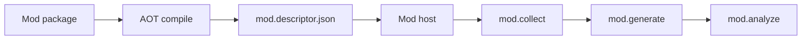
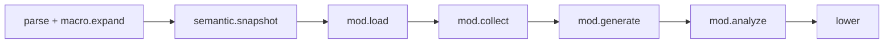

<!-- migrated from the legacy platform spec; canonical OpenSpec source -->
# Compiler Mod SDK Specification

## Purpose

This specification defines the Beskid-side compiler-mod contracts. It defines the Beskid.Syntax mirror, the declarative query, and the typed AST operations.

## Requirements

### Requirement: Mod SDK contract hierarchy
The Compiler Mod SDK (`compiler-sdk` package) MUST be the Beskid-side surface for `type: Mod` projects. Mod behavior MUST be declared through SDK `contract` interfaces (`Collector`, `Generator`, `Analyzer`, `Rewriter`, `AttributeGenerator`) and `Beskid.Syntax` operations — not through dedicated metaprogramming grammar items in the host language. Hosts MUST discover contract implementations from AOT-compiled `Mod` packages in the dependency graph (direct and transitive).

#### Scenario: Mod declares Collector and Generator
- **GIVEN** a `type: Mod` package with public types implementing `Collector` and `Generator`
- **WHEN** a host project depends on that package
- **THEN** the mod host discovers those contract implementations from the AOT artifact without manifest entrypoint registration

### Requirement: Artifact-driven contract discovery
During `mod.load`, the mod host MUST resolve every transitive `type: Mod` dependency, locate the AOT artifact for the active target triple and cache key, read the export descriptor and/or native export table, and build a schedule of `(contractId, typeId, entrySymbol)` tuples. Duplicate or conflicting registrations MUST fail with **E1829** / **E1851–E1870** before `mod.collect` runs. Missing required contracts for a scheduled mod MUST fail closed (no partial host merge). Manifest `attachTo` / `entryModules` MUST NOT be part of discovery; `Collector` owns scope narrowing at execution time.

#### Scenario: Duplicate contract registration
- **GIVEN** two export registrations that conflict for the same contract entry
- **WHEN** `mod.load` builds the contract schedule
- **THEN** the host emits **E1829** or **E1851–E1870** and does not run `mod.collect`

### Requirement: Beskid.Syntax traversal and no source emission
`Beskid.Syntax.Nodes.Node` MUST be a contract that is the sole navigation surface for mod traversal via `NodeRef` handles with stable identities per syntax generation. Mod code MUST build and transform trees through declarative fluent APIs with no string formatting or source-text emission. Language macros are not Mod contracts; they expand via `macro.expand` before `mod.load`.

#### Scenario: Generator emits typed AST only
- **GIVEN** a `Generator` contract implementation
- **WHEN** it contributes to the host program
- **THEN** the contribution is typed AST (not formatted source text) and may be re-expanded for embedded language macros after re-parse

## Informative Source Provenance

The records below preserve migration history. They are not normative except where text was extracted into a requirement above.

### Source Record: Compiler Mod SDK

**Authority:** informative provenance  
**Legacy path:** `/platform-spec/language-meta/metaprogramming/compiler-mod-sdk/`  
**Source:** `site/spec-content/platform-spec/language-meta/metaprogramming/compiler-mod-sdk/content.md`  
**SHA-256:** `edc12435915344442c11ead84b886e471697167b046708804bcd4c5409ecd350`

<details>
<summary>Migrated source text</summary>

``````markdown
<SpecSection title="Package role" id="package-role">
The **Compiler Mod SDK** (`compiler-sdk` package) is the Beskid-side surface for `type: Mod` projects. Mod behavior is declared through **contracts** and `Beskid.Syntax` operations — not through dedicated metaprogramming grammar items in the host language.
</SpecSection>

<SpecSection title="Contract hierarchy" id="contracts">
All mod entrypoints derive from `Collector`:

| Contract | Role |
| --- | --- |
| `Collector` | Declarative target collection and scope narrowing (replaces project-level attach metadata). |
| `Generator` | Incremental by default; emits typed AST contributions only. |
| `Analyzer` | Runs on host + generated code; emits diagnostics and registers rewrites as fixes. |
| `Rewriter<TSourceNode, TTargetNode>` | `Result<TTargetNode, FixError> Rewrite(TSourceNode sourceNode)` — replaces any AST node with any valid typed AST node. |
| `AttributeGenerator` | Defines attributes exported by mod packages (SDK infrastructure; domain mods such as Serialization Mod define concrete attributes). |

Hosts discover contract implementations from AOT-compiled `Mod` packages in the dependency graph (direct and transitive).
</SpecSection>

<SpecSection title="Contract discovery (normative)" id="contract-discovery">
Mod packages **export** contract implementations through **public Beskid types** that implement the SDK `contract` interfaces (`Collector`, `Generator`, `Analyzer`, `Rewriter`, `AttributeGenerator`). Authors do not register entrypoints in the manifest; discovery is entirely artifact-driven.

During `mod.load`, the Rust mod host:

1. Resolves every transitive `type: Mod` dependency from the host `CompilePlan`.
2. Locates the AOT artifact for the active **target triple** and **cache key** (see **[AOT artifact contract](/platform-spec/compiler/compiler-mods/mod-host-bridge/aot-artifact-contract/)**).
3. Reads the export descriptor (`mod.descriptor.json`) and/or the native object export table.
4. Builds a schedule of `(contractId, typeId, entrySymbol)` tuples, where:
   - `contractId` — stable SDK contract name (e.g. `Beskid.Compiler.Collect.Collector`).
   - `typeId` — public type name in the mod assembly implementing that contract.
   - `entrySymbol` — AOT-linked symbol used to invoke the contract entrypoint.

Duplicate or conflicting registrations **must** fail with **E1829** / **E1851–E1870** diagnostics before `mod.collect` runs. Missing required contracts for a scheduled mod **must** fail closed (no partial host merge).

Manifest `attachTo` / `entryModules` are **not** part of discovery; `Collector` owns scope narrowing at execution time.
</SpecSection>

<SpecSection title="Beskid.Syntax and declarative query" id="syntax-mirror">
- `Beskid.Syntax` is the typed mirror of compiler syntax nodes (legacy `Beskid.Compiler.Syntax` / “SyntaxMirror” naming is deprecated).
- `Beskid.Syntax.Nodes.Node` is a **contract** (not a variant enum): the sole navigation surface for mod traversal. Hosts materialize `NodeRef` handles `{ syntaxGenerationId, nodeId }` with stable identities per syntax generation.
- `Node` exposes required identity and span metadata (`Ref`, `Kind`, `Span`) and child enumeration hooks. Query facade also exposes span helpers (`Span`, `TrySpan`) for `NodeRef`-first workflows.
- Concrete mirrored types (`FunctionDefinition`, `Expression`, …) remain for `Generator` / `Rewriter` typed construction; mod **traversal** uses `NodeRef` + `Beskid.Compiler.Query`, then `As*` projections when a concrete shape is required.
- `Program.items` is a `NodeList` of `NodeRef` values (cons-list encoding); there is **no** mirrored item-wrapper enum for module items.
- Mod code builds and transforms trees through declarative fluent APIs — **no string formatting or source-text emission**.
- `Rewriter` and `Generator` use concrete mirrored types; query and merge invalidation keys use `NodeRef` identities from the host snapshot.
- AST manipulation ergonomics are standardized around a **query-pipeline DSL** (`Select` / `WhereKind` / `Replace` / `Remove` / `Insert*` / `Apply`), with deterministic host execution and conflict diagnostics.
</SpecSection>

<SpecSection title="Pipeline interaction (Beskid view)" id="pipeline">
From a mod author's perspective:

1. **Collect** — `Collector` narrows targets for this mod instance.
2. **Generate** — `Generator` contributes typed AST; host re-parses and merges (bounded by `maxGeneratorRounds`).
3. **Analyze** — `Analyzer` runs after semantic snapshot on merged program (including generated code).
4. **Rewrite** — `Rewriter` applies when an analyzer declares a fix; host validates typed replacement.

Rust-side phase ids and artifact lifecycle are specified under **[Compiler Mods](/platform-spec/compiler/compiler-mods/)**.
</SpecSection>

<SpecSection title="Language macros vs Mod SDK" id="language-macros-vs-mod-sdk">
**[Language macros](/platform-spec/language-meta/metaprogramming/macros/)** are **not** Mod contracts. They are ordinary `macro` module items expanded by the compiler `macro.expand` phase before `mod.load`.

| | Language macros | Mod SDK |
| --- | --- | --- |
| Declaration | `macro name (kind param) { ... }` in any project | `contract` types in `type: Mod` packages |
| Invocation | `name!(...)` / `name! { }` | N/A (mods run on host compilation events) |
| Expansion host | Rust intrinsic in `beskid_analysis` | AOT mod artifacts + `Collector` / `Generator` |
| Discovery | Name resolution / `use` | `mod.descriptor.json` contract registry |

Mods may define and call language macros like any library; `Generator` output that contains `foo!` is expanded after re-parse per stage-ordering rules.
</SpecSection>

<SpecSection title="Language features used by mods" id="language-features">
- **[Language macros](/platform-spec/language-meta/metaprogramming/macros/)** — optional in mod-authored sources; expanded before mod phases on each syntax generation.
- **[extend type](/platform-spec/language-meta/program-structure/extend-type/)** — primary extension syntax for generated members (replaces impl-block extension).
- **[Serialization packages](/platform-spec/language-meta/metaprogramming/serialization/)** — reference domain mod defining `[Serialize]`.
- **[Dynamic types and mapping (v0.3)](/platform-spec/compiler/codegen-and-ir/dynamic-types-and-mapping/)** — planned IR/runtime mapping for serializable types.
</SpecSection>

<SpecSection title="Non-goals" id="non-goals">
- No language-level `meta` items or collect/generate/analyze/rewrite blocks.
- No runtime reflection over arbitrary Beskid objects.
- No mutation of Rust compiler composition graphs from Beskid mod code.
</SpecSection>

## Implementation anchors
- `compiler/crates/beskid_analysis/src/mod_host/` — mod discovery, load, and orchestration phases
- `compiler/crates/beskid_analysis/src/macros/` — `contract` type handling for mod contracts
- `compiler/corelib/` — SDK types (`Collector`, `Generator`, `Analyzer`, `Rewriter`)

## Decisions
<!-- spec:generate:adr-index -->
No ADRs published under **`adr/`** yet.
<!-- /spec:generate:adr-index -->
## Articles
<!-- spec:generate:article-index -->
- [Compiler Mod SDK - Contracts and edge cases](./articles/contracts-and-edge-cases/)
- [Compiler Mod SDK - Design model](./articles/design-model/)
- [Compiler Mod SDK - Examples](./articles/examples/)
- [Compiler Mod SDK - FAQ and troubleshooting](./articles/faq-and-troubleshooting/)
- [Compiler Mod SDK - Flow and algorithm](./articles/flow-and-algorithm/)
- [Compiler Mod SDK - Verification and traceability](./articles/verification-and-traceability/)
<!-- /spec:generate:article-index -->
``````

</details>

### Source Record: Compiler Mod SDK - Contracts and edge cases

**Authority:** informative provenance  
**Legacy path:** `/platform-spec/language-meta/metaprogramming/compiler-mod-sdk/articles/contracts-and-edge-cases/`  
**Source:** `site/spec-content/platform-spec/language-meta/metaprogramming/compiler-mod-sdk/articles/contracts-and-edge-cases/content.md`  
**SHA-256:** `750d978047baad2a94a93fc93b5989d846b9064969b37032c6ff9d676e850d3c`

<details>
<summary>Migrated source text</summary>

``````markdown
## Hard requirements

- **Artifact-driven discovery** — No manifest registration; discovery is entirely artifact-driven.
- **Fail closed** — Missing required contracts or conflicts must fail before `mod.collect` runs.
- **No runtime reflection** — No runtime reflection over arbitrary Beskid objects.
- **No mutation of Rust graphs** — Mod code cannot mutate Rust compiler composition graphs.

## Diagnostic band E18xx

| Code | Condition |
| --- | --- |
| **E1829** | Mod contract conflict |
| **E1851–E1870** | Mod scheduling and execution errors |
| **E1880** | Query bounds exceeded |
| **E1881** | Query node span unavailable |
| **E1883** | Query pipeline conflict |
| **E1884** | Query pipeline stale generation |

## Edge cases

- **Missing AOT artifact** — If the artifact for the target triple is missing, the mod is skipped or errors depending on host policy.
- **Generator round limit** — `maxGeneratorRounds` bounds the generate-reparse loop to prevent infinite generation.
- **Stale generation** — Mods referencing `NodeRef` from a previous syntax generation emit **E1884**.
- **Query pipeline conflict** — Concurrent mod queries modifying the same nodes emit **E1883**.

## Invariants

- Mods must not run before macro expansion completes on the same compilation unit.
- Generated code must pass the same structural checks as authored code.
- Rewriter replacements must be valid typed AST nodes.
``````

</details>

### Source Record: Compiler Mod SDK - Design model

**Authority:** informative provenance  
**Legacy path:** `/platform-spec/language-meta/metaprogramming/compiler-mod-sdk/articles/design-model/`  
**Source:** `site/spec-content/platform-spec/language-meta/metaprogramming/compiler-mod-sdk/articles/design-model/content.md`  
**SHA-256:** `cac7eee9716b1b393c89591e68f8c1aaba3b8a006b59475c3027b919e9c92aea`

<details>
<summary>Migrated source text</summary>

``````markdown
## Vocabulary

| Construct | Role |
| --- | --- |
| **`Collector`** | Declarative target collection and scope narrowing |
| **`Generator`** | Incremental typed AST emission |
| **`Analyzer`** | Diagnostic emission and rewrite registration |
| **`Rewriter`** | AST node replacement |
| **`AttributeGenerator`** | Attribute definition for mod packages |
| **`GrammarGenerator`** | Registers `.pest` roots; Beskid `Core.Text.Pest` emit + mod scheduling materialize combinator parsers |
| **`NodeRef`** | Stable syntax node handle `{ syntaxGenerationId, nodeId }` |

## Mod SDK architecture

The Compiler Mod SDK is the Beskid-side surface for `type: Mod` projects. Mod behavior is declared through contracts and `Beskid.Syntax` operations.



### Subsystem boundaries

| Subsystem | Responsibility | Key file |
| --- | --- | --- |
| Mod author | Write contract implementations | Mod project sources |
| AOT compile | Build mod artifact | `beskid build` |
| Mod host | Load and schedule mods | `beskid_analysis/src/mod_host/` |
| Discovery | Read `mod.descriptor.json` | `mod_host/discovery.rs` |
| Execution | Run collect/generate/analyze | `mod_host/invoker.rs` |

## Contract hierarchy

| Contract | Role |
| --- | --- |
| `Collector` | Target collection and scope narrowing |
| `Generator` | Incremental typed AST emission |
| `Analyzer` | Diagnostics and rewrites |
| `Rewriter<TSource, TTarget>` | Node replacement |
| `AttributeGenerator` | Attribute definitions |
| `GrammarGenerator` | Pest grammar discovery and combinator codegen ([Pest parser generator](/platform-spec/compiler/compiler-mods/pest-parser-generator/)) |

### `GrammarGenerator` contract

Grammar mods implement **`Beskid.Compiler.Collect.GrammarGenerator`**. The contract lives in **`Beskid.Compiler.Collect`** alongside `Collector` and follows the same request payload shape as `Generator`.

```beskid
pub contract GrammarGenerator {
    GeneratedSyntaxContribution Generate(GenerationRequest request);
}
```

| Field | Role |
| --- | --- |
| `request.context` | `CollectRequest` — active compilation, workspace, mod catalog |
| `request.targets` | `CollectTargetSet` from the paired `Collector` registration (Pest file paths, grammar output bindings) |

The host **must** register contract types whose symbol suffix is **`.GrammarGenerator`** in mod descriptor discovery. On fingerprint miss, the host invokes `Generate`, merges the returned `GeneratedSyntaxContribution`, and **may** write emitted sources under **`.generated/{modulePath}/{fileName}.g.bd`** in the consumer package (layout schema v2: `fileName` + `modulePath` + optional `packageId`). Emitted parsers **must** call **`Core.Text.Parser`** combinators only and satisfy **PARSER-005** naming.

### `GeneratedSyntaxContribution` (typed + code outputs)

```beskid
pub type GeneratedSyntaxContribution {
    SyntaxContributionItem[] items,   // legacy typed merge path
    CodeContribution[] codeOutputs,   // primary generator emit path
}

pub type CodeContribution {
    string modulePath,
    string fileName,
    CodeString body,                  // fenced Beskid source; host evaluates `@{}` holes
}
```

`Beskid.Compiler.Emitter.Contribution` helpers assemble contributions (`FromCodeOutputs`, `AppendCode`, …). **`ContributionFluent`** is removed—generators use plain contribution builders.

Reference implementation: `corelib_pest_gen` (`PestCollector` + `PestGen`). Consumer projects declare inputs via the **`grammar { }`** block ([project manifest contract](/platform-spec/tooling/manifests-and-lockfiles/project-manifest-contract/)).

## Beskid.Syntax

- `Beskid.Syntax.Nodes.Node` is a contract (not a variant enum) for mod traversal.
- `NodeRef` handles provide stable identities per syntax generation.
- Concrete mirrored types (`FunctionDefinition`, `Expression`, ...) remain for typed construction.
- No string formatting or source-text emission.

## Compilation context modules

Mods receive **workspace and compilation context** through request payloads marshaled by the host bridge. These modules are Beskid-authored; Rust mirrors them via `compiler_sdk_reflect.rs`.

| Module | Purpose |
| --- | --- |
| **`Beskid.Compiler.Workspace`** | Root path, member projects, lock hash, resolved mod dependency graph |
| **`Beskid.Compiler.Compilation`** | Active project, `CompilePlan` summary, target triple, `syntaxGenerationId`, entry source |
| **`Beskid.Compiler.ModCatalog`** | Loaded mods: `packageId`, version, capabilities, registrations, descriptor paths |
| **`Beskid.Compiler.ModPackage`** | Single mod view: contract surface introspection (`contractId`, `typeId`, `entrySymbol`) |

`Beskid.Compiler.Compilation` remains the handle for the active host compilation instance; the modules above populate structured fields on collect/generate requests rather than ad hoc host APIs.

## Request payloads

`Collector` and `Generator` contracts receive populated context—not empty stub records.

```beskid
pub type CollectRequest {
    Beskid.Compiler.Compilation compilation,
    Beskid.Compiler.Workspace workspace,
    Beskid.Compiler.ModCatalog mods,
}

pub type GenerationRequest {
    CollectRequest context,
    CollectTargetSet targets,
}
```

| Request | When populated | Contents |
| --- | --- | --- |
| **`CollectRequest`** | **`mod.collect`** | Active compilation, workspace slice, and catalog of loaded mod packages |
| **`GenerationRequest`** | **`mod.generate`** | Same context plus the `CollectTargetSet` returned by the matching `Collector` registration |

The host **must** populate these types from `ModHostInput`, `CompilePlan`, and loaded mod descriptors before invoking contract entry symbols. Mods use context to implement workspace-wide logic (for example: enumerate fluent-annotated types across members, or list `Generator` registrations from sibling mods) without per-use-case Rust bridge extensions.
``````

</details>

### Source Record: Compiler Mod SDK - Examples

**Authority:** informative provenance  
**Legacy path:** `/platform-spec/language-meta/metaprogramming/compiler-mod-sdk/articles/examples/`  
**Source:** `site/spec-content/platform-spec/language-meta/metaprogramming/compiler-mod-sdk/articles/examples/content.md`  
**SHA-256:** `c3a98d2b6f35d48bbe4c03cf1247c82953da4d4949dbf4b24ca84c7866b8f8ba`

<details>
<summary>Migrated source text</summary>

``````markdown
## Collector contract

```beskid
contract Collector {
    unit Collect(Beskid.Syntax.Nodes.Node root);
}
```

## Generator contract

```beskid
contract Generator {
    Beskid.Syntax.Nodes.Node[] Generate(Beskid.Syntax.Nodes.Node target);
}
```

## Analyzer contract

```beskid
contract Analyzer {
    Beskid.Compiler.Diagnostic[] Analyze(Beskid.Syntax.Nodes.Node target);
}
```

## Rewriter contract

```beskid
contract Rewriter<TSource, TTarget> {
    Core.Results.Result<TTarget, FixError> Rewrite(TSource sourceNode);
}
```

## AttributeGenerator contract

```beskid
contract AttributeGenerator {
    string[] SupportedTargets();
    unit GenerateAttribute(string target, Beskid.Syntax.Nodes.Node node);
}
```
``````

</details>

### Source Record: Compiler Mod SDK - FAQ and troubleshooting

**Authority:** informative provenance  
**Legacy path:** `/platform-spec/language-meta/metaprogramming/compiler-mod-sdk/articles/faq-and-troubleshooting/`  
**Source:** `site/spec-content/platform-spec/language-meta/metaprogramming/compiler-mod-sdk/articles/faq-and-troubleshooting/content.md`  
**SHA-256:** `cdec75eeeff9062bf1f41c689259a9d59de3b22ad3c0b2ee9d1dfcdd486b755c`

<details>
<summary>Migrated source text</summary>

``````markdown
## FAQ

### How do I register a mod entrypoint?

You do not. Discovery is artifact-driven. Implement a public Beskid type that implements an SDK contract.

### Can a mod define language macros?

Yes. Mods may define `pub macro` items like any library. They are expanded by the compiler, not by the mod host.

### Can mods mutate the host program arbitrarily?

No. Mods emit typed AST contributions through `Generator` contracts. The host validates and merges them.

## Troubleshooting

| Symptom | Likely cause |
| --- | --- |
| **E1829** | Two mods export conflicting contracts |
| **E1884** | Mod referencing stale syntax generation |
| **E1883** | Multiple mods modifying the same nodes |
| Mod not discovered | Missing AOT artifact or descriptor |
``````

</details>

### Source Record: Compiler Mod SDK - Flow and algorithm

**Authority:** informative provenance  
**Legacy path:** `/platform-spec/language-meta/metaprogramming/compiler-mod-sdk/articles/flow-and-algorithm/`  
**Source:** `site/spec-content/platform-spec/language-meta/metaprogramming/compiler-mod-sdk/articles/flow-and-algorithm/content.md`  
**SHA-256:** `c0fa8799b1d080be796d0f9bd7be7a50717e4d7f2cf000aba3a9c0d8bd751811`

<details>
<summary>Migrated source text</summary>

``````markdown
## Compile pipeline placement



## Mod discovery algorithm (normative)

1. **Resolve dependencies** — Find every transitive `type: Mod` dependency from the host `CompilePlan`.
2. **Locate AOT artifact** — Find the artifact for the active target triple and cache key.
3. **Read descriptor** — Parse `mod.descriptor.json` and/or native object export table.
4. **Build schedule** — Create `(contractId, typeId, entrySymbol)` tuples.
5. **Detect conflicts** — Duplicate or conflicting registrations emit **E1829** / **E1851–E1870**.
6. **Execute collect** — Run `Collector` contracts to narrow targets.
7. **Execute generate** — Run `Generator` contracts; host re-parses and merges contributions (bounded by `maxGeneratorRounds`).
8. **Execute analyze** — Run `Analyzer` contracts on merged program (including generated code).
9. **Apply rewrites** — Run `Rewriter` contracts when an analyzer declares a fix.

## Pipeline interaction

From a mod author's perspective:
1. **Collect** — `Collector` narrows targets.
2. **Generate** — `Generator` contributes typed AST; host re-parses and merges.
3. **Analyze** — `Analyzer` runs after semantic snapshot on merged program.
4. **Rewrite** — `Rewriter` applies when an analyzer declares a fix.

## LSP / incremental

Re-run mod phases when mod artifacts, generated code, or host source changes.
``````

</details>

### Source Record: Compiler Mod SDK - Verification and traceability

**Authority:** informative provenance  
**Legacy path:** `/platform-spec/language-meta/metaprogramming/compiler-mod-sdk/articles/verification-and-traceability/`  
**Source:** `site/spec-content/platform-spec/language-meta/metaprogramming/compiler-mod-sdk/articles/verification-and-traceability/content.md`  
**SHA-256:** `61cafd10a88b073f05dcabb36a22bf400bfe08370b46b681656f804219656419`

<details>
<summary>Migrated source text</summary>

``````markdown
## Verification matrix

| Scenario | Expected evidence |
| --- | --- |
| Mod package compilation | AOT artifact produced |
| Descriptor generation | `mod.descriptor.json` valid |
| Contract discovery | Host reads descriptor and schedules mods |
| Collector execution | Targets narrowed correctly |
| Generator execution | Typed AST contributions merged |
| Analyzer execution | Diagnostics emitted on merged code |
| Rewrite application | Valid typed replacements applied |

## Implementation checklist

- [x] Contract definitions: `Collector`, `Generator`, `Analyzer`, `Rewriter`, `AttributeGenerator`
- [x] Mod host: load, discovery, scheduling
- [x] AOT artifact contract
- [x] Descriptor format
- [x] Diagnostics: **E1829**, **E1851–E1870**, **E1880–E1884**
- [ ] Full generator round limiting
- [ ] Query pipeline conflict resolution
- [ ] Incremental mod re-execution

## Test locations

- `compiler/crates/beskid_analysis/src/mod_host/` — mod host tests
- `compiler/crates/beskid_tests` — integration tests for mods
``````

</details>
