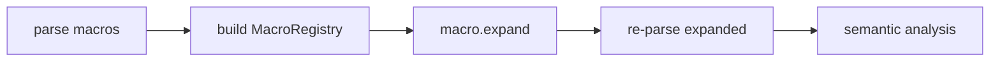
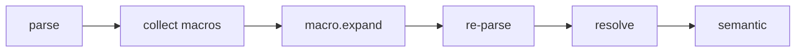

<!-- migrated from the legacy platform spec; canonical OpenSpec source -->
# Language macros Specification

## Purpose

Module-level macro rules with fragment parameters, `name!` invocation, and typed AST expansion in any project kind.

## Requirements

### Requirement: Language macros conformance status
This capability SHALL remain non-conformant and MUST NOT be cited as an implemented Beskid guarantee until a validated OpenSpec change adds explicit behavioral requirements.

**Stable ID:** `BSP-REQ-5C24EEBEF371`

#### Scenario: Capability has descriptive material only
- **GIVEN** the migrated sources contain no uppercase BCP-14 obligation or accepted ADR decision
- **WHEN** an implementation reports Beskid conformance
- **THEN** it MUST NOT claim conformance based on this capability

## Informative Source Provenance

The records below preserve migration history and are not normative except where text was extracted into a requirement above.

### Source Record: Language macros

**Authority:** informative provenance  
**Legacy path:** `/platform-spec/language-meta/metaprogramming/macros/`  
**Source:** `site/spec-content/platform-spec/language-meta/metaprogramming/macros/content.md`  
**SHA-256:** `7dbe81905c4a5861f06616dff55773a24851644fb76e429db0855b8e3164d906`

<details>
<summary>Migrated source text</summary>

``````markdown
<SpecSection title="Role" id="role">
**Language macros** are a first-class **module item** in **App**, **Lib**, **Test**, and **Mod** projects. They provide Rust-style **macro rules** ergonomics (`name!`) with Beskid declaration style (`macro name (fragment param, ...) { ... }`).

Expansion is **structural**: the compiler substitutes captured syntax fragments for **`$param`** references in the macro body. v1 does **not** interpret arbitrary Beskid statements at compile time and does **not** emit source text.
</SpecSection>

<SpecSection title="Definition syntax" id="definition">
```beskid
pub macro sayHi (block body, expression message)
{
    Console.WriteLine($message);
    $body
}
```

| Element | Rule |
| --- | --- |
| Keyword | `macro` introduces `MacroDefinition` as an **`InnerItem`**. |
| Visibility | Optional `pub`; obeys **[modules and visibility](/platform-spec/language-meta/program-structure/modules-and-visibility/)**. |
| Parameters | Parenthesized, comma-separated **`fragmentKind name`** pairs (see fragment kinds). |
| Body | Single braced **`Block`** of normal Beskid statements and expressions. |
| Metavariables | **`$name`** in the body references a parameter; legal only inside macro definitions. |

Cross-module use: **`pub macro`** plus normal **`use`** / path qualification (see name-resolution hub).
</SpecSection>

<SpecSection title="Invocation syntax" id="invocation">
Macros are invoked with a postfix **`!`** on the macro name:

| Form | Binding |
| --- | --- |
| `sayHi!()` | Zero arguments (unit / empty actual list). |
| `sayHi!(expr)` | Positional arguments in **definition order** inside `!(...)`. |
| `sayHi! { stmts }` | Braced block actual (typical for `block` parameters). |
| `sayHi!(a, b)` | Multiple positional arguments in one `!(...)`. |

**`MacroInvocation`** is an expression form: `identifier` + `!` + optional parenthesized argument list + optional braced block.

**Disambiguation** — `!` after an identifier is a macro invocation only when a **`macro`** binding resolves in scope. If no binding exists, the compiler emits **E1901** (unknown macro). Future non-macro uses of `!` must not collide with this rule.

**Item-position macros** — When a parameter is **`item`**, the invocation may appear at module item position (for example `my_macro!(type Wrapper { pub i32 x; })`), expanding to one or more **`InnerItem`** nodes spliced into the enclosing item list.
</SpecSection>

<SpecSection title="Fragment kinds (v1)" id="fragment-kinds">
Closed vocabulary for parameter kinds:

| Kind | Accepted syntax root |
| --- | --- |
| `block` | `Block` |
| `expression` | `Expression` |
| `statement` | `Statement` |
| `type` | `Type` (surface `BeskidType`) |
| `identifier` | `Identifier` |
| `literal` | `Literal` or `LiteralExpression` |
| `pattern` | `Pattern` |
| `path` | `Path` |
| `item` | any `InnerItem` |
| `node` | any `Node` (escape hatch; discouraged in user code) |

Mismatch between actual argument shape and declared kind → **E1903** at the argument span.
</SpecSection>

<SpecSection title="Expansion model" id="expansion">
1. Resolve the invocation to a **`MacroDefinition`** in scope.
2. Validate arity and fragment kinds for each actual argument.
3. Deep-copy each captured fragment and substitute for every **`$param`** occurrence in the macro body (fresh node identities; diagnostic spans trace to expansion sites where required).
4. Splice the resulting statements or expression in place of the **`MacroInvocation`**.
5. Repeat until no **`!`** invocations remain or **`maxMacroExpansionDepth`** is reached (**E1905**).

**Depth cap** — Default **32** per compilation unit generation; independent of **`maxGeneratorRounds`** on mod projects.

**Well-formedness** — Expanded trees must pass the same structural checks as authored syntax before semantic analysis proceeds.

**Mod interaction** — After **`mod.generate`** merges typed contributions and the host re-parses, **`macro.expand`** runs again inside the generator replay loop so mod-emitted code can contain macro invocations.
</SpecSection>

<SpecSection title="Relationship to Compiler Mod SDK" id="vs-mod-sdk">
| Mechanism | Owner | When |
| --- | --- | --- |
| **Language `macro` items** | Compiler intrinsic **`macro.expand`** | Any project kind; no AOT mod artifact |
| **Mod `Collector` / `Generator`** | Mod host | `type: Mod` packages; cross-cutting codegen |

Mods may **define** `pub macro` items like any library. Mod contracts do **not** replace language macros, and language macros do **not** register in `mod.descriptor.json`.

See **[Compiler Mod SDK](/platform-spec/language-meta/metaprogramming/compiler-mod-sdk/#language-macros-vs-mod-sdk)**.
</SpecSection>

<SpecSection title="Non-goals (v1)" id="non-goals">
- Repetition operators `$(...)*`, `$(...)+`, `$(...)?` (see **Proposed** roadmap only).
- String formatting or source-text emission from macro bodies.
- Compile-time execution of arbitrary Beskid statements (bodies are templates, not interpreted functions).
- Mod-only or manifest-registered macro discovery.
</SpecSection>

<SpecSection title="Examples" id="examples">
**Block wrapper**

```beskid
macro logged (block body)
{
    Console.WriteLine("enter");
    $body
    Console.WriteLine("leave");
}

unit Main()
{
    logged! {
        Console.WriteLine("work");
    }
}
```

**Expression passthrough**

```beskid
macro identity (expression value)
{
    $value
}

let x = identity!(1 + 2);
```
</SpecSection>

## Decisions
<!-- spec:generate:adr-index -->
No ADRs published under **`adr/`** yet.
<!-- /spec:generate:adr-index -->
## Articles
<!-- spec:generate:article-index -->
- [Language macros - Contracts and edge cases](./articles/contracts-and-edge-cases/)
- [Language macros - Design model](./articles/design-model/)
- [Language macros - Examples](./articles/examples/)
- [Language macros - FAQ and troubleshooting](./articles/faq-and-troubleshooting/)
- [Language macros - Flow and algorithm](./articles/flow-and-algorithm/)
- [Language macros - Verification and traceability](./articles/verification-and-traceability/)
<!-- /spec:generate:article-index -->
``````

</details>

### Source Record: Language macros - Contracts and edge cases

**Authority:** informative provenance  
**Legacy path:** `/platform-spec/language-meta/metaprogramming/macros/articles/contracts-and-edge-cases/`  
**Source:** `site/spec-content/platform-spec/language-meta/metaprogramming/macros/articles/contracts-and-edge-cases/content.md`  
**SHA-256:** `7ddbb5e6d6eb125ad1b63573c014b3dde4b5635a24ce226476b917b62c4a2d0a`

<details>
<summary>Migrated source text</summary>

``````markdown
## Hard requirements

- **Macros before mods** — Expansion runs before mod phases on each syntax generation.
- **Structural expansion only** — No string formatting or source-text emission.
- **Depth cap** — Default 32 per compilation unit.
- **Well-formedness** — Expanded trees must pass structural checks before semantic analysis.

## Diagnostic band E19xx

| Code | Condition |
| --- | --- |
| **E1901** | Unknown macro |
| **E1902** | Macro argument arity mismatch |
| **E1903** | Macro argument kind mismatch |
| **E1904** | Macro metavariable outside body |
| **E1905** | Macro expansion depth exceeded |
| **E1907** | Ambiguous macro name |
| **E1908** | Duplicate macro parameter |

## Edge cases

- **Metavariable outside macro** — `$name` outside a macro body emits **E1904**.
- **Empty macro body** — A macro with an empty body expands to nothing (valid but usually pointless).
- **Macro in macro** — A macro invocation inside another macro body is expanded in the next iteration.
- **Item-position macros** — When a parameter is `item`, the invocation may appear at module item position.

## Invariants

- Expanded trees must have fresh node identities; diagnostic spans trace to expansion sites.
- Mod-emitted code containing macro invocations is expanded after re-parse.
- Language macros do not register in `mod.descriptor.json`.
``````

</details>

### Source Record: Language macros - Design model

**Authority:** informative provenance  
**Legacy path:** `/platform-spec/language-meta/metaprogramming/macros/articles/design-model/`  
**Source:** `site/spec-content/platform-spec/language-meta/metaprogramming/macros/articles/design-model/content.md`  
**SHA-256:** `0761761f41eee7f4df35cd2cae046c502e9e5fee6da51cea521bc7e1b946d152`

<details>
<summary>Migrated source text</summary>

``````markdown
## Vocabulary

| Construct | Role |
| --- | --- |
| **`MacroDefinition`** | `macro name (params) { body }` item |
| **`MacroInvocation`** | `name!(args)` or `name! { block }` expression |
| **`MacroRegistry`** | Maps macro names to definitions in the compilation unit |
| **`MacroParameter`** | Fragment kind + name pair in macro definition |

## Macro architecture

Language macros are **first-class module items** expanded by the compiler before semantic analysis. Expansion is structural: the compiler substitutes captured syntax fragments for `$param` references.



### Subsystem boundaries

| Subsystem | Responsibility | Key file |
| --- | --- | --- |
| Parser | Parse `macro` and `!` invocations | `syntax/items/macro_definition.rs` |
| AST | Store macro structure | `syntax/expressions/macro_invocation.rs` |
| Macro registry | Collect and lookup definitions | `macros/registry.rs` |
| Expansion | Substitute fragments and splice | `macros/match_args.rs` |
| Semantic | Analyze expanded code | `analysis/rules/staged/` |

## Fragment kinds (v1)

Closed vocabulary for parameter kinds: `block`, `expression`, `statement`, `type`, `identifier`, `literal`, `pattern`, `path`, `item`, `node`.

## Depth cap

Default maximum expansion depth is 32 per compilation unit. `MacroExpansionDepthExceeded` (**E1905**) fires when the cap is reached.
``````

</details>

### Source Record: Language macros - Examples

**Authority:** informative provenance  
**Legacy path:** `/platform-spec/language-meta/metaprogramming/macros/articles/examples/`  
**Source:** `site/spec-content/platform-spec/language-meta/metaprogramming/macros/articles/examples/content.md`  
**SHA-256:** `6dfe4cd22c433055027fe2540a80eb13c56a524e4d4993331c5a7b9885cc53a3`

<details>
<summary>Migrated source text</summary>

``````markdown
## Block wrapper

```beskid
macro logged (block body) {
    Console.WriteLine("enter");
    $body
    Console.WriteLine("leave");
}

unit Main() {
    logged! {
        Console.WriteLine("work");
    }
}
```

## Expression passthrough

```beskid
macro identity (expression value) {
    $value
}

unit UseIdentity() {
    let x = identity!(1 + 2);
}
```

## Item macro

```beskid
macro defineType (identifier name, block body) {
    type $name {
        $body
    }
}

defineType!(Point, {
    f32 x;
    f32 y;
})
```

## Multiple parameters

```beskid
macro repeat (expression value, literal count) {
    for i in 0..$count {
        $value;
    }
}

unit UseRepeat() {
    repeat!(Console.WriteLine("hello"), 3);
}
```
``````

</details>

### Source Record: Language macros - FAQ and troubleshooting

**Authority:** informative provenance  
**Legacy path:** `/platform-spec/language-meta/metaprogramming/macros/articles/faq-and-troubleshooting/`  
**Source:** `site/spec-content/platform-spec/language-meta/metaprogramming/macros/articles/faq-and-troubleshooting/content.md`  
**SHA-256:** `0a018bffaedad6b9a590e2574062487a9ecf72442acc192e0d23be906647c0d0`

<details>
<summary>Migrated source text</summary>

``````markdown
## FAQ

### Can macros generate source text?

No. Expansion is structural AST substitution only. No string formatting or source-text emission.

### Can macros execute Beskid code at compile time?

No. Macro bodies are templates, not interpreted functions.

### What is the difference between language macros and Mod SDK?

Language macros are expanded by the compiler intrinsic. Mod SDK generators are AOT-compiled artifacts that emit typed AST. They are separate mechanisms.

## Troubleshooting

| Symptom | Likely cause |
| --- | --- |
| **E1901** | Macro name not found |
| **E1902** | Wrong number of arguments |
| **E1903** | Argument shape does not match fragment kind |
| **E1904** | `$name` used outside a macro body |
| **E1905** | Expansion too deep (possible infinite recursion) |
| **E1907** | Two macros with the same name |
``````

</details>

### Source Record: Language macros - Flow and algorithm

**Authority:** informative provenance  
**Legacy path:** `/platform-spec/language-meta/metaprogramming/macros/articles/flow-and-algorithm/`  
**Source:** `site/spec-content/platform-spec/language-meta/metaprogramming/macros/articles/flow-and-algorithm/content.md`  
**SHA-256:** `ce15ce1ee281ae3cf6f8a62be7f71c8f202e11083b116702c51349f317862a26`

<details>
<summary>Migrated source text</summary>

``````markdown
## Compile pipeline placement



## Macro expansion algorithm (normative)

1. **Parse macro definitions** — `MacroDefinition` stores `name`, `parameters` (kind + name), and `body`.
2. **Build registry** — `MacroRegistry::from_program()` walks items and collects `MacroDefinition` nodes. `MacroAmbiguousName` (**E1907**) for duplicates. `MacroDuplicateParameter` (**E1908**) for duplicate parameter names.
3. **Parse invocations** — `name!(args)` or `name! { block }` becomes `MacroInvocation`.
4. **Resolve invocation** — Look up the macro name in `MacroRegistry`. `MacroUnknown` (**E1901**) if not found.
5. **Validate arity** — Compare actual argument count to parameter count. `MacroArgumentArityMismatch` (**E1902**) if they differ.
6. **Validate fragment kinds** — Match each actual argument shape against the declared parameter kind. `MacroArgumentKindMismatch` (**E1903**) for mismatches.
7. **Substitute** — Deep-copy each captured fragment and substitute for every `$param` occurrence in the macro body.
8. **Splice** — Replace the `MacroInvocation` with the expanded statements or expression.
9. **Repeat** — Continue expanding until no `!` invocations remain or depth cap is reached. `MacroExpansionDepthExceeded` (**E1905**) at cap.
10. **Re-parse and re-resolve** — Expanded trees must pass the same structural checks as authored syntax.

## Mod interaction

After `mod.generate` merges typed contributions and the host re-parses, `macro.expand` runs again inside the generator replay loop so mod-emitted code can contain macro invocations.

## LSP / incremental

Re-run macro expansion when macro definitions or invocations change.
``````

</details>

### Source Record: Language macros - Verification and traceability

**Authority:** informative provenance  
**Legacy path:** `/platform-spec/language-meta/metaprogramming/macros/articles/verification-and-traceability/`  
**Source:** `site/spec-content/platform-spec/language-meta/metaprogramming/macros/articles/verification-and-traceability/content.md`  
**SHA-256:** `3e8c6a608cd52236ad44f83a9a249b1afa283d78bb3428917a105b198b52ba2b`

<details>
<summary>Migrated source text</summary>

``````markdown
## Verification matrix

| Scenario | Expected evidence |
| --- | --- |
| Macro definition | Parsed; registered in `MacroRegistry` |
| Macro invocation | Expanded; re-parsed |
| Unknown macro | **E1901** emitted |
| Arity mismatch | **E1902** emitted |
| Kind mismatch | **E1903** emitted |
| Depth exceeded | **E1905** emitted |

## Implementation checklist

- [x] Grammar: `macro`, `!` invocation, fragment kinds
- [x] AST: `MacroDefinition`, `MacroInvocation`, `MacroParameter`
- [x] Parser: `beskid.pest` productions for macros
- [x] Registry: `MacroRegistry` with duplicate detection
- [x] Expansion: fragment substitution and splicing
- [x] Diagnostics: **E1901–E1905**, **E1907**, **E1908**
- [ ] Item-position macro expansion tests
- [ ] Mod-generated macro invocation expansion

## Test locations

- `compiler/crates/beskid_analysis/src/syntax/items/macro_definition.rs` — parser tests
- `compiler/crates/beskid_analysis/src/macros/registry.rs` — registry tests
- `compiler/crates/beskid_analysis/src/macros/match_args.rs` — expansion tests
- `compiler/crates/beskid_tests` — integration tests for macros
``````

</details>
