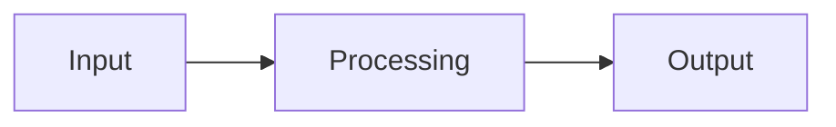

<!-- migrated from the legacy platform spec; canonical OpenSpec source -->
# Metaprogramming Specification

## Purpose

Source generators, attributes that drive compiler plug-ins, and scheduling relative to other analyses. The broader generator roadmap may live in guides; v0.1 rules are normative here.

## Requirements

### Requirement: Metaprogramming conformance status
This capability SHALL remain non-conformant and MUST NOT be cited as an implemented Beskid guarantee until a validated OpenSpec change adds explicit behavioral requirements.

**Stable ID:** `BSP-REQ-E80AEA1B9535`

#### Scenario: Capability has descriptive material only
- **GIVEN** the migrated sources contain no uppercase BCP-14 obligation or accepted ADR decision
- **WHEN** an implementation reports Beskid conformance
- **THEN** it MUST NOT claim conformance based on this capability

## Informative Source Provenance

The records below preserve migration history and are not normative except where text was extracted into a requirement above.

### Source Record: Metaprogramming

**Authority:** informative provenance  
**Legacy path:** `/platform-spec/language-meta/metaprogramming/metaprogramming/`  
**Source:** `site/spec-content/platform-spec/language-meta/metaprogramming/metaprogramming/content.md`  
**SHA-256:** `0755ff5736c805f61047357bade58911aee03756534b7304ab2bd3264eb4a0da`

<details>
<summary>Migrated source text</summary>

``````markdown
## Normative specification

### Scope

Defines the **two metaprogramming planes** in Beskid and how they interact with compilation. Detailed rules live in child articles; this hub **must not** duplicate their full text.

| Plane | Mechanism | Normative home |
| --- | --- | --- |
| **Language macros** | `macro` items, `name!` invocation | [Language macros](/platform-spec/language-meta/metaprogramming/macros/) |
| **Compiler mods** | `type: Mod` projects, SDK contracts | [Compiler Mod SDK](/platform-spec/language-meta/metaprogramming/compiler-mod-sdk/) |
| **Serialization** | Reference mod + attributes | [Serialization packages](/platform-spec/language-meta/metaprogramming/serialization/) |

### Scheduling (reference compiler)

1. Parse and build HIR.
2. **`macro.expand`** — expand language macros (**E1901–E1908** band).
3. Re-run resolution and types on expanded surface.
4. **`mod.load` / `mod.collect` / generators** — mod pipeline per [Compiler Mods](/platform-spec/compiler/compiler-mods/).
5. Continue semantic analysis, composition (if host project), and codegen.

Mods **must not** run before macro expansion completes on the same compilation unit unless a future decision explicitly orders otherwise.

### Static rules

- **App/Lib/Test** projects **may** declare `macro` items and consume mods.
- **Mod** projects **must not** declare app `host` graphs ([Native dependency injection](/platform-spec/language-meta/composition/dependency-injection/)).
- Attribute declarations **`attribute Name(targets) { … }`** are module items; misuse of targets **must** error (**E1508–E1510**).

### Dynamic semantics

Metaprogramming effects are **compile-time only**; expanded/generated AST becomes input to later phases. No interpreted Beskid execution at compile time except through compiled mod AOT artifacts.

### Diagnostics

Macro band **E1901+**; mod band **E1829**, **E1851–E1870**; attribute **E1508+**. Registry: [Diagnostic code registry](/platform-spec/compiler/semantic-pipeline/diagnostic-code-registry/).

### Conformance

Tooling **must** invoke the same phase order for CI and IDE builds on a given project kind.

## Decisions
<!-- spec:generate:adr-index -->
No ADRs published under **`adr/`** yet.
<!-- /spec:generate:adr-index -->
## Articles
<!-- spec:generate:article-index -->
_No articles in this bundle yet._
<!-- /spec:generate:article-index -->
``````

</details>

### Source Record: Metaprogramming - Contracts and edge cases

**Authority:** informative provenance  
**Legacy path:** `/platform-spec/language-meta/metaprogramming/metaprogramming/articles/contracts-and-edge-cases/`  
**Source:** `site/spec-content/platform-spec/language-meta/metaprogramming/metaprogramming/articles/contracts-and-edge-cases/content.md`  
**SHA-256:** `a5524f35aec0ad18462390f5f6fda422a1194db3d57ff3ccabd1acfa676e6d72`

<details>
<summary>Migrated source text</summary>

``````markdown
## Hard requirements

The normative specification in this capability's Requirements section defines the hard requirements for this feature. This article documents edge cases and contract-level guarantees.

## Edge cases

Edge cases are documented as they are discovered during implementation. Key edge cases include:

- Interactions with other features that may produce unexpected results
- Boundary conditions at the limits of defined behavior
- Error paths and diagnostic conditions

## Invariants

The following invariants must hold across all implementations:

1. The normative specification takes precedence over implementation behavior
2. Diagnostic codes are registered in the diagnostic code registry and must not be reused
3. Conformance tests must pass at the declared conformance level

## Contract guarantees

Implementations must satisfy the contracts defined in this capability's Requirements section. Violations must be surfaced through the diagnostic system.
``````

</details>

### Source Record: Metaprogramming - Design model

**Authority:** informative provenance  
**Legacy path:** `/platform-spec/language-meta/metaprogramming/metaprogramming/articles/design-model/`  
**Source:** `site/spec-content/platform-spec/language-meta/metaprogramming/metaprogramming/articles/design-model/content.md`  
**SHA-256:** `8b8ec4b6a65a7eda1a8f7cd83cad24bbf96e69e125a7ea9aef60af7f19bc5844`

<details>
<summary>Migrated source text</summary>

``````markdown
## Design overview

This article describes the conceptual model and design decisions behind the feature. The normative specification lives in this capability's Requirements section (and related OpenSpec sibling capabilities); this article expands on the rationale, subsystem boundaries, and architectural choices.

## Key design decisions

- Decision details are recorded as ADRs under the hub's `adr/` directory when formal record-keeping is needed.
- Design rationale here is informative; normative contract language lives in this capability's Requirements section.

## Subsystem boundaries

Refer to this capability's Requirements section for the authoritative specification. This article provides supplementary design context.

## Related articles

- [Contracts and edge cases](../contracts-and-edge-cases/)
- [Verification and traceability](../verification-and-traceability/)
``````

</details>

### Source Record: Metaprogramming - Examples

**Authority:** informative provenance  
**Legacy path:** `/platform-spec/language-meta/metaprogramming/metaprogramming/articles/examples/`  
**Source:** `site/spec-content/platform-spec/language-meta/metaprogramming/metaprogramming/articles/examples/content.md`  
**SHA-256:** `669d2440f2f0093d624b6f176dbd8b28098da976baa66b962d3406cdb5ff85a8`

<details>
<summary>Migrated source text</summary>

``````markdown
## Basic usage

```beskid
// TODO: Add basic usage example for this feature
```

## Common patterns

```beskid
// TODO: Add common usage patterns
```

## Edge case examples

```beskid
// TODO: Add edge case examples
```

> **Note:** Full code examples for this feature are being developed. See this capability's Requirements section for the normative specification.
``````

</details>

### Source Record: Metaprogramming - FAQ and troubleshooting

**Authority:** informative provenance  
**Legacy path:** `/platform-spec/language-meta/metaprogramming/metaprogramming/articles/faq-and-troubleshooting/`  
**Source:** `site/spec-content/platform-spec/language-meta/metaprogramming/metaprogramming/articles/faq-and-troubleshooting/content.md`  
**SHA-256:** `c150c0cb07e09a9213a885b299f43b116cfcd3cd23949b6bf4309947e3ac7297`

<details>
<summary>Migrated source text</summary>

``````markdown
## Frequently asked questions

### Is this feature stable?

This capability's status metadata indicates the maturity level. Articles marked `Proposed` are under active development.

### How does this interact with other features?

See the "Related articles" section in each article and the `related.json` files for cross-feature links.

### Where can I find implementation details?

Implementation anchors are listed under Implementation anchors in this capability's Requirements or Informative Source Provenance.

## Troubleshooting

### Diagnostic codes

Refer to this capability's Requirements section for feature-specific diagnostic codes. All codes are registered in the [Diagnostic code registry](/platform-spec/compiler/semantic-pipeline/diagnostic-code-registry/).

### Common errors

- **Spec violation:** If behavior contradicts this capability's Requirements section, the capability specification takes precedence.
- **Missing conformance:** If a test case is missing, add it to the `articles/verification-and-traceability/` article.
``````

</details>

### Source Record: Metaprogramming - Flow and algorithm

**Authority:** informative provenance  
**Legacy path:** `/platform-spec/language-meta/metaprogramming/metaprogramming/articles/flow-and-algorithm/`  
**Source:** `site/spec-content/platform-spec/language-meta/metaprogramming/metaprogramming/articles/flow-and-algorithm/content.md`  
**SHA-256:** `4aea6cd84472c547ed9d8384d17abcad24998652b006fcf59cdbded27b6850f5`

<details>
<summary>Migrated source text</summary>

``````markdown
## Processing steps

The normative algorithm for this feature is defined in the compiler implementation. This article provides an informative overview of the processing flow.

## Data flow



## Algorithm outline

1. Parse the relevant syntax from the source
2. Resolve names and types according to the rules in this capability's Requirements section
3. Lower to intermediate representation
4. Code generation

> **Note:** Detailed flow documentation is being developed. Refer to the compiler implementation for the authoritative algorithm.
``````

</details>

### Source Record: Metaprogramming - Verification and traceability

**Authority:** informative provenance  
**Legacy path:** `/platform-spec/language-meta/metaprogramming/metaprogramming/articles/verification-and-traceability/`  
**Source:** `site/spec-content/platform-spec/language-meta/metaprogramming/metaprogramming/articles/verification-and-traceability/content.md`  
**SHA-256:** `3746ef46e20a53acc80344fc5631f9ca16d265fbdc1026126cca93200f9068d6`

<details>
<summary>Migrated source text</summary>

``````markdown
## Conformance evidence

Conformance to this specification is verified through:

1. **Compiler test suite** — Unit and integration tests in the compiler workspace
2. **Corelib conformance** — Published corelib packages must conform to the specification
3. **End-to-end tests** — E2E tests validate the full pipeline

## Test coverage

Test coverage for this feature is tracked in the compiler's test suite. Key test areas include:

- Syntax validation
- Semantic analysis (type checking, name resolution)
- Code generation and lowering
- Runtime behavior

## Verification anchors

Implementation anchors are listed under Implementation anchors in this capability's Requirements or Informative Source Provenance.

## Traceability

Each normative statement in this capability's Requirements section should be traceable to:
- A test case in the compiler test suite
- An ADR documenting the decision
- A diagnostic code in the diagnostic registry
``````

</details>
