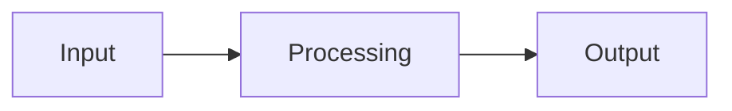

<!-- migrated from the legacy platform spec; canonical OpenSpec source -->
# Serialization packages Specification

## Purpose

Serialization core package, Serialization Mod, and format-specific packages (JSON).

## Requirements

### Requirement: Serialization packages conformance status
This capability SHALL remain non-conformant and MUST NOT be cited as an implemented Beskid guarantee until a validated OpenSpec change adds explicit behavioral requirements.

**Stable ID:** `BSP-REQ-B1808618517B`

#### Scenario: Capability has descriptive material only
- **GIVEN** the migrated sources contain no uppercase BCP-14 obligation or accepted ADR decision
- **WHEN** an implementation reports Beskid conformance
- **THEN** it MUST NOT claim conformance based on this capability

## Informative Source Provenance

The records below preserve migration history and are not normative except where text was extracted into a requirement above.

### Source Record: Serialization packages

**Authority:** informative provenance  
**Legacy path:** `/platform-spec/language-meta/metaprogramming/serialization/`  
**Source:** `site/spec-content/platform-spec/language-meta/metaprogramming/serialization/content.md`  
**SHA-256:** `07613358b9d1312abb5845c115dda045162e78a049bd850d24d0df7a82b7c16b`

<details>
<summary>Migrated source text</summary>

``````markdown
<SpecSection title="Package split" id="package-split">
Serialization is split across three package roles:

| Package | Role |
| --- | --- |
| **Serialization Mod** (`type: Mod`) | Defines `[Serialize]` via `AttributeGenerator`; implements `Generator` for serializer emission |
| **Serialization** (library) | References Serialization Mod; exposes common metadata APIs for serializable types |
| **Json** (library) | Format-specific read/write primitives consumed by generated serializers |
</SpecSection>

<SpecSection title="Attribute ownership" id="attribute-ownership">
The `[Serialize]` attribute is defined in **Serialization Mod**, not in Compiler Mod SDK core. Host projects depend on Serialization (library), which transitively loads Serialization Mod through the dependency graph.
</SpecSection>

<SpecSection title="Generation model" id="generation-model">
Serialization Mod generators:

1. Collect types annotated with `[Serialize]` through `Collector` contracts.
2. Emit typed AST (for example `extend type` helpers and format adapters) through incremental `Generator` contracts.
3. Never emit formatted source text; output is structural AST only.

Analyzers in Serialization Mod validate serializable shape constraints before lowering.
</SpecSection>

## Decisions
<!-- spec:generate:adr-index -->
No ADRs published under **`adr/`** yet.
<!-- /spec:generate:adr-index -->
## Articles
<!-- spec:generate:article-index -->
_No articles in this bundle yet._
<!-- /spec:generate:article-index -->
``````

</details>

### Source Record: Serialization packages - Contracts and edge cases

**Authority:** informative provenance  
**Legacy path:** `/platform-spec/language-meta/metaprogramming/serialization/articles/contracts-and-edge-cases/`  
**Source:** `site/spec-content/platform-spec/language-meta/metaprogramming/serialization/articles/contracts-and-edge-cases/content.md`  
**SHA-256:** `f8306e557761501f61471a41773e89895d859032bcef531e388f841b56055319`

<details>
<summary>Migrated source text</summary>

``````markdown
## Hard requirements

The normative specification in this capability's Requirements section defines the hard requirements for this feature. This article documents edge cases and contract-level guarantees.

## Edge cases

Edge cases are documented as they are discovered during implementation. Key edge cases include:

- Interactions with other features that may produce unexpected results
- Boundary conditions at the limits of defined behavior
- Error paths and diagnostic conditions

## Invariants

The following invariants must hold across all implementations:

1. The normative specification takes precedence over implementation behavior
2. Diagnostic codes are registered in the diagnostic code registry and must not be reused
3. Conformance tests must pass at the declared conformance level

## Contract guarantees

Implementations must satisfy the contracts defined in this capability's Requirements section. Violations must be surfaced through the diagnostic system.
``````

</details>

### Source Record: Serialization packages - Design model

**Authority:** informative provenance  
**Legacy path:** `/platform-spec/language-meta/metaprogramming/serialization/articles/design-model/`  
**Source:** `site/spec-content/platform-spec/language-meta/metaprogramming/serialization/articles/design-model/content.md`  
**SHA-256:** `7b9390e0b9329864424bceaef640754dd0f48c376412f736ae79e4b1d4eb5b81`

<details>
<summary>Migrated source text</summary>

``````markdown
## Design overview

This article describes the conceptual model and design decisions behind the feature. The normative specification lives in this capability's Requirements section (and related OpenSpec sibling capabilities); this article expands on the rationale, subsystem boundaries, and architectural choices.

## Key design decisions

- Decision details are recorded as ADRs under the hub's `adr/` directory when formal record-keeping is needed.
- Design rationale here is informative; normative contract language lives in this capability's Requirements section.

## Subsystem boundaries

Refer to this capability's Requirements section for the authoritative specification. This article provides supplementary design context.

## Related articles

- [Contracts and edge cases](../contracts-and-edge-cases/)
- [Verification and traceability](../verification-and-traceability/)
``````

</details>

### Source Record: Serialization packages - Examples

**Authority:** informative provenance  
**Legacy path:** `/platform-spec/language-meta/metaprogramming/serialization/articles/examples/`  
**Source:** `site/spec-content/platform-spec/language-meta/metaprogramming/serialization/articles/examples/content.md`  
**SHA-256:** `83fa1a73bdad66713168deb05625afe2b000fb43f8e2b3ea4ae66dc3eb25c9cc`

<details>
<summary>Migrated source text</summary>

``````markdown
## Basic usage

```beskid
// TODO: Add basic usage example for this feature
```

## Common patterns

```beskid
// TODO: Add common usage patterns
```

## Edge case examples

```beskid
// TODO: Add edge case examples
```

> **Note:** Full code examples for this feature are being developed. See this capability's Requirements section for the normative specification.
``````

</details>

### Source Record: Serialization packages - FAQ and troubleshooting

**Authority:** informative provenance  
**Legacy path:** `/platform-spec/language-meta/metaprogramming/serialization/articles/faq-and-troubleshooting/`  
**Source:** `site/spec-content/platform-spec/language-meta/metaprogramming/serialization/articles/faq-and-troubleshooting/content.md`  
**SHA-256:** `9a5cc568ef891242c3878ec834994fd6d2ecc84baf657a2237a91c150da2cf37`

<details>
<summary>Migrated source text</summary>

``````markdown
## Frequently asked questions

### Is this feature stable?

This capability's status metadata indicates the maturity level. Articles marked `Proposed` are under active development.

### How does this interact with other features?

See the "Related articles" section in each article and the `related.json` files for cross-feature links.

### Where can I find implementation details?

Implementation anchors are listed under Implementation anchors in this capability's Requirements or Informative Source Provenance.

## Troubleshooting

### Diagnostic codes

Refer to this capability's Requirements section for feature-specific diagnostic codes. All codes are registered in the [Diagnostic code registry](/platform-spec/compiler/semantic-pipeline/diagnostic-code-registry/).

### Common errors

- **Spec violation:** If behavior contradicts this capability's Requirements section, the capability specification takes precedence.
- **Missing conformance:** If a test case is missing, add it to the `articles/verification-and-traceability/` article.
``````

</details>

### Source Record: Serialization packages - Flow and algorithm

**Authority:** informative provenance  
**Legacy path:** `/platform-spec/language-meta/metaprogramming/serialization/articles/flow-and-algorithm/`  
**Source:** `site/spec-content/platform-spec/language-meta/metaprogramming/serialization/articles/flow-and-algorithm/content.md`  
**SHA-256:** `828dbb9aa330871e7984299440c0d2f769a08594638fc5a1683e27e0dad31738`

<details>
<summary>Migrated source text</summary>

``````markdown
## Processing steps

The normative algorithm for this feature is defined in the compiler implementation. This article provides an informative overview of the processing flow.

## Data flow



## Algorithm outline

1. Parse the relevant syntax from the source
2. Resolve names and types according to the rules in this capability's Requirements section
3. Lower to intermediate representation
4. Code generation

> **Note:** Detailed flow documentation is being developed. Refer to the compiler implementation for the authoritative algorithm.
``````

</details>

### Source Record: Serialization packages - Verification and traceability

**Authority:** informative provenance  
**Legacy path:** `/platform-spec/language-meta/metaprogramming/serialization/articles/verification-and-traceability/`  
**Source:** `site/spec-content/platform-spec/language-meta/metaprogramming/serialization/articles/verification-and-traceability/content.md`  
**SHA-256:** `c6eadcfbaf3ad3c81489a67780adda3ecc254e908b069ac38b5b9e533fa4af8a`

<details>
<summary>Migrated source text</summary>

``````markdown
## Conformance evidence

Conformance to this specification is verified through:

1. **Compiler test suite** — Unit and integration tests in the compiler workspace
2. **Corelib conformance** — Published corelib packages must conform to the specification
3. **End-to-end tests** — E2E tests validate the full pipeline

## Test coverage

Test coverage for this feature is tracked in the compiler's test suite. Key test areas include:

- Syntax validation
- Semantic analysis (type checking, name resolution)
- Code generation and lowering
- Runtime behavior

## Verification anchors

Implementation anchors are listed under Implementation anchors in this capability's Requirements or Informative Source Provenance.

## Traceability

Each normative statement in this capability's Requirements section should be traceable to:
- A test case in the compiler test suite
- An ADR documenting the decision
- A diagnostic code in the diagnostic registry
``````

</details>
