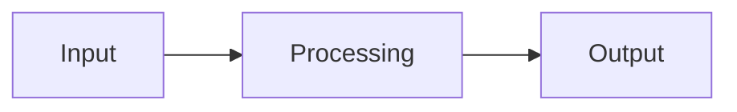

<!-- migrated from the legacy platform spec; canonical OpenSpec source -->
# Code style and naming Specification

## Purpose

Language-level PascalCase and camelCase conventions for types, members, modules, and locals — enforceable by formatter and lint tooling.

## Requirements

### Requirement: Case profiles by declaration kind
Identifier case profiles MUST follow the declaration-kind table: `type`, `enum`, enum variants, `contract`, module path segments, top-level functions, type methods, and App entry `Main` MUST use PascalCase; type fields, variant payload fields, parameters (except `self`), locals, and `macro` names MUST use lowerCamelCase; `test` names MUST use snake_case. Generic type parameters MUST use PascalCase and SHOULD use a `T` prefix. The special name `self` is exempt from the parameter profile. Leading `_` is permitted only for keyword escape and does not change the expected case profile of the remaining spelling.

#### Scenario: Test name uses snake_case
- **GIVEN** a `test` item declared in a Test project
- **WHEN** naming style checking runs
- **THEN** the test identifier MUST conform to snake_case (or the style rule diagnoses the deviation)

### Requirement: Module path and App entrypoint naming
Each dot-separated segment in a module path MUST be PascalCase. Executable App targets MUST declare a top-level entry function named `Main`. The reference compiler MUST map Beskid `Main` to the native C link symbol `main` at AOT object emission. CLI defaults (`beskid run`, `beskid build`) MUST resolve an empty `--entrypoint` to `Main`. `root_namespace` MUST NOT override module path segment casing in source.

#### Scenario: Empty entrypoint resolves to Main
- **GIVEN** an App project invoked with `beskid run` and no `--entrypoint`
- **WHEN** the CLI resolves the entry symbol
- **THEN** the resolved Beskid entry name is `Main`

### Requirement: Generated and reflected surface naming
Tools that emit Beskid identifiers from foreign schemas MUST map into these case profiles. Compiler Mod SDK generators MUST emit field and type names per these profiles. Public API docs MUST display identifiers as spelled in source after formatting.

#### Scenario: Mod SDK emits lowerCamelCase fields
- **GIVEN** a Mod SDK reflection emitter producing Beskid field names from a foreign schema
- **WHEN** identifiers are emitted
- **THEN** fields use lowerCamelCase and types use PascalCase per the declaration-kind table

## Informative Source Provenance

The records below preserve migration history and are not normative except where text was extracted into a requirement above.

### Source Record: Code style and naming

**Authority:** informative provenance  
**Legacy path:** `/platform-spec/language-meta/program-structure/code-style-and-naming/`  
**Source:** `site/spec-content/platform-spec/language-meta/program-structure/code-style-and-naming/content.md`  
**SHA-256:** `0c268b93226b22dd8fd1d8406e7aac6b50e7b3a971577e09d952c9b69df9bf8f`

<details>
<summary>Migrated source text</summary>

``````markdown
## Normative specification

### Scope

Defines **case profiles** for Beskid identifiers: where **PascalCase**, **lowerCamelCase** (camelCase), and **snake_case** apply. Lexical validity (letters, digits, `_`, keyword rejection) remains in [Lexical and syntax](/platform-spec/language-meta/surface-syntax/lexical-and-syntax/). Module graph rules remain in [Modules and visibility](/platform-spec/language-meta/program-structure/modules-and-visibility/).

**In scope:** declaration kinds, module path segments, generic parameters, locals, parameters, tests, and generated SDK field naming.

**Out of scope:** manifest package ids, registry URLs, Rust host crate names, and foreign **Symbol** strings on `Extern` contracts (those follow their owning tooling or ABI profiles).

### Case profiles

| Profile | Pattern (informative) | Word boundaries |
| --- | --- | --- |
| **PascalCase** | `Upper` + `AlphaNum*` | Each word starts with an uppercase ASCII letter; **no** `_` between words |
| **lowerCamelCase** | `lower` + `AlphaNum*` | First word lowercase ASCII; each later word starts uppercase; **no** `_` between words |
| **snake_case** | `lower` + `(lower \| digit \| _)*` | Words separated by `_`; all lowercase ASCII |

Leading `_` on an identifier is permitted only for **keyword escape** (see [Lexical and syntax / contracts and edge cases](/platform-spec/language-meta/surface-syntax/lexical-and-syntax/contracts-and-edge-cases/)). A leading `_` does not change the expected case profile of the remaining spelling.

The special name **`self`** is the only fixed lowercase receiver parameter; it is exempt from the parameter profile.

### Declaration kinds

| Syntactic role | Case profile | Notes |
| --- | --- | --- |
| **`type` name** | **PascalCase** | `pub type Hub<T>` |
| **`enum` name** | **PascalCase** | `pub enum Result<TValue, TError>` |
| **Enum variant** | **PascalCase** | `Ok`, `Error`, `Basic16` |
| **Variant payload field** (named) | **lowerCamelCase** | `Ok(TValue value)` |
| **`contract` name** | **PascalCase** | `pub contract Collector` |
| **Generic type parameter** | **PascalCase**; **SHOULD** use a `T` prefix when denoting a type parameter | `T`, `TValue`, `TError` |
| **Type field** | **lowerCamelCase** | `bool isTty`, `i64 handle` |
| **Module path segment** | **PascalCase** | `Core.Results`, `Beskid.Syntax.Nodes` |
| **Top-level function** | **PascalCase** | `pub bool IsOk(...)` |
| **App entry function** (`target.kind = App`) | **PascalCase**; **must** be named **`Main`** | `pub i32 Main()` — see [App entrypoint](#app-entrypoint) |
| **Type method** (inside `pub type { }` or `extend type`) | **PascalCase** | `Create`, `Register`, `WaitReceive` |
| **Parameter** (except `self`) | **lowerCamelCase** | `i64 index`, `Channel<T> channel` |
| **Local `let` binding** | **lowerCamelCase** | `Capabilities caps = ...` |
| **`test` name** | **snake_case** | `test hub_register_accepts_channel` |
| **`macro` name** | **lowerCamelCase** | `macro identity (...)` |
| **`use` alias** | Same profile as the kind it introduces | Alias for a type **must** be PascalCase |

### Module and file alignment

- Each dot-separated segment in a module path **must** be **PascalCase**.
- Source file names **should** use **PascalCase** with a `.bd` suffix when the file declares a single primary type or module leaf matching the file stem (`Hub.bd` → `Concurrency.Hub`).
- Folder names in package trees **should** use **PascalCase** segments that match the module namespace (`src/Concurrency/Hub.bd`).

`root_namespace` in project metadata documents package branding; it **must not** override module path segment casing in source.

### App entrypoint

Executable **`App`** targets **must** declare a top-level entry function named **`Main`** (PascalCase callable profile). The function **should** be `pub` when it is the project entry named in manifest metadata (`entry = "Main.bd"`).

| Surface | Symbol |
| --- | --- |
| Beskid source name | **`Main`** |
| JIT / link-plan entrypoint | **`Main`** |
| Native AOT object export (C link) | **`main`** |

The reference compiler maps Beskid **`Main`** to the native C link symbol **`main`** at AOT object emission (`beskid_codegen::object_link_symbol`, `beskid_aot::native_link_entrypoint`). CLI defaults (`beskid run`, `beskid build`) resolve an empty `--entrypoint` to **`Main`**.

### Generated and reflected surfaces

Tools that emit Beskid identifiers from foreign schemas (for example Mod SDK syntax reflection) **must** map into these profiles:

| Foreign shape | Beskid profile | Rule |
| --- | --- | --- |
| Rust `snake_case` struct field | **lowerCamelCase** field | `is_tty` → `isTty` |
| Rust `snake_case` type name | **PascalCase** type | `hub_receive_result` → `HubReceiveResult` |
| Tuple synthetic `field_N` | **lowerCamelCase** | `field_0` → `field0` |
| Keyword / `keyword_*` conflict | Leading `_` escape | `type` → `_type`, `contract_name` → `_contractName` after camelization |

Reference implementation: `compiler/crates/beskid_ast_reflect_gen/src/emit_idents.rs`.

### Diagnostics (**W1630–W1639**)

Naming-style violations **should** surface as warnings in band **W1630–W1639** (see [Diagnostic code registry](/platform-spec/compiler/semantic-pipeline/diagnostic-code-registry/)). They **must not** block compilation at **L2** conformance unless a downstream policy promotes a specific code to **Error**.

| Code | When emitted |
| --- | --- |
| **W1630** | `type`, `enum`, or `contract` name is not **PascalCase** |
| **W1631** | Enum variant name is not **PascalCase** |
| **W1632** | Type field or named variant payload field is not **lowerCamelCase** |
| **W1633** | Function or type method name is not **PascalCase** |
| **W1634** | Module path segment is not **PascalCase** |
| **W1635** | Generic type parameter is not **PascalCase** |
| **W1636** | Parameter or local binding is not **lowerCamelCase** (except `self`) |
| **W1637** | `test` name is not **snake_case** |
| **W1638** | `macro` name is not **lowerCamelCase** |
| **W1639** | **Reserved** |

The reference compiler **may** omit **W163x** emission until `beskid_analysis` style rules land; packages published as **corelib** **must** conform to this chapter regardless.

### Formatter and lint

- `beskid fmt` **should** rewrite identifiers toward these profiles when doing so does not change program meaning (same resolution graph).
- `beskid lint` **should** emit **W163x** without rewriting.
- Public API docs (`api.json`, site package docs) **must** display identifiers as spelled in source after formatting.

### Examples (informative)

```beskid
pub enum Result<TValue, TError> {
    Ok(TValue value),
    Error(TError error),
}

pub type Capabilities {
    bool isTty,
    ColorModel model,
}

pub Capabilities ProbeStdout() {
    bool tty = Terminal.IsAtty(1);
    return Capabilities { isTty: tty, model: Terminal.ProbeColorModel() };
}

test probe_stdout_sets_is_tty_field {
    Capabilities caps = ProbeStdout();
    Assert.True(caps.isTty || !caps.isTty, "smoke");
}
```

### Authority

This chapter is the **language-meta** owner for case conventions. [Core library](/platform-spec/core-library/) packages **implement** these rules on public surfaces. [Compiler Mod SDK](/platform-spec/language-meta/metaprogramming/compiler-mod-sdk/) generators **must** emit field and type names per the generated-surface table above.

## Implementation anchors

- `compiler/crates/beskid_analysis/src/format/naming_normalize.rs` — formatter case normalization
- `compiler/crates/beskid_analysis/src/analysis/rules/staged/naming_style.rs` — **W163x** style-rule emission
- `compiler/crates/beskid_ast_reflect_gen/src/emit_idents.rs` — Rust→Beskid field camelCase and keyword escape
- `compiler/corelib/` — reference conforming library (`Core.Results`, `Concurrency.Hub`, …)
- `compiler/crates/beskid_analysis/src/analysis/diagnostic_kinds.rs` — **W163x** registration
- `compiler/crates/beskid_aot/src/api.rs` — `DEFAULT_ENTRYPOINT`, `native_link_entrypoint`
- `compiler/crates/beskid_codegen/src/lowering/expressions/export.rs` — `object_link_symbol` (`Main` → `main`)

## Verification anchors

- [x] Corelib public types and methods use **PascalCase**; fields use **lowerCamelCase** (`compiler/corelib/`)
- [x] Mod SDK reflection tests golden field names (`beskid_ast_reflect_gen` `emit_idents` tests)
- [x] Reference compiler emits **W1630–W1638** from style rules (`beskid_analysis` `naming_style`)
- [x] `beskid fmt` applies case fixes idempotently (`beskid_analysis` `format/naming_normalize`)
- [x] App entry uses **`Main`**; AOT maps to native **`main`** (`beskid_e2e_tests` `Minimal.bd`, `beskid_aot` `build_and_run`)

## Decisions
<!-- spec:generate:adr-index -->
No ADRs published under **`adr/`** yet.
<!-- /spec:generate:adr-index -->
## Articles
<!-- spec:generate:article-index -->
_No articles in this bundle yet._
<!-- /spec:generate:article-index -->
``````

</details>

### Source Record: Code style and naming - Contracts and edge cases

**Authority:** informative provenance  
**Legacy path:** `/platform-spec/language-meta/program-structure/code-style-and-naming/articles/contracts-and-edge-cases/`  
**Source:** `site/spec-content/platform-spec/language-meta/program-structure/code-style-and-naming/articles/contracts-and-edge-cases/content.md`  
**SHA-256:** `79efc6e33cb17963d4031b12edb2a4794680a6feb3eba17e247e4d7c85dcaeb5`

<details>
<summary>Migrated source text</summary>

``````markdown
## Hard requirements

The normative specification in this capability's Requirements section defines the hard requirements for this feature. This article documents edge cases and contract-level guarantees.

## Edge cases

Edge cases are documented as they are discovered during implementation. Key edge cases include:

- Interactions with other features that may produce unexpected results
- Boundary conditions at the limits of defined behavior
- Error paths and diagnostic conditions

## Invariants

The following invariants must hold across all implementations:

1. The normative specification takes precedence over implementation behavior
2. Diagnostic codes are registered in the diagnostic code registry and must not be reused
3. Conformance tests must pass at the declared conformance level

## Contract guarantees

Implementations must satisfy the contracts defined in this capability's Requirements section. Violations must be surfaced through the diagnostic system.
``````

</details>

### Source Record: Code style and naming - Design model

**Authority:** informative provenance  
**Legacy path:** `/platform-spec/language-meta/program-structure/code-style-and-naming/articles/design-model/`  
**Source:** `site/spec-content/platform-spec/language-meta/program-structure/code-style-and-naming/articles/design-model/content.md`  
**SHA-256:** `445d85bbf1958d8e769663de49fbe0e6024f9d80fd0c5e559368949dd9de54d3`

<details>
<summary>Migrated source text</summary>

``````markdown
## Design overview

This article describes the conceptual model and design decisions behind the feature. The normative specification lives in this capability's Requirements section (and related OpenSpec sibling capabilities); this article expands on the rationale, subsystem boundaries, and architectural choices.

## Key design decisions

- Decision details are recorded as ADRs under the hub's `adr/` directory when formal record-keeping is needed.
- Design rationale here is informative; normative contract language lives in this capability's Requirements section.

## Subsystem boundaries

Refer to this capability's Requirements section for the authoritative specification. This article provides supplementary design context.

## Related articles

- [Contracts and edge cases](../contracts-and-edge-cases/)
- [Verification and traceability](../verification-and-traceability/)
``````

</details>

### Source Record: Code style and naming - Examples

**Authority:** informative provenance  
**Legacy path:** `/platform-spec/language-meta/program-structure/code-style-and-naming/articles/examples/`  
**Source:** `site/spec-content/platform-spec/language-meta/program-structure/code-style-and-naming/articles/examples/content.md`  
**SHA-256:** `d6eb6a4e07aa3eee54dfa03bf2ada665545ab3047ee4e297539bed7878416c4e`

<details>
<summary>Migrated source text</summary>

``````markdown
## Basic usage

```beskid
// TODO: Add basic usage example for this feature
```

## Common patterns

```beskid
// TODO: Add common usage patterns
```

## Edge case examples

```beskid
// TODO: Add edge case examples
```

> **Note:** Full code examples for this feature are being developed. See this capability's Requirements section for the normative specification.
``````

</details>

### Source Record: Code style and naming - FAQ and troubleshooting

**Authority:** informative provenance  
**Legacy path:** `/platform-spec/language-meta/program-structure/code-style-and-naming/articles/faq-and-troubleshooting/`  
**Source:** `site/spec-content/platform-spec/language-meta/program-structure/code-style-and-naming/articles/faq-and-troubleshooting/content.md`  
**SHA-256:** `92f2da632704e2ab8b78268511f1e0721096c339ed8901099b7cd1eccc10dbbd`

<details>
<summary>Migrated source text</summary>

``````markdown
## Frequently asked questions

### Is this feature stable?

This capability's status metadata indicates the maturity level. Articles marked `Proposed` are under active development.

### How does this interact with other features?

See the "Related articles" section in each article and the `related.json` files for cross-feature links.

### Where can I find implementation details?

Implementation anchors are listed under Implementation anchors in this capability's Requirements or Informative Source Provenance.

## Troubleshooting

### Diagnostic codes

Refer to this capability's Requirements section for feature-specific diagnostic codes. All codes are registered in the [Diagnostic code registry](/platform-spec/compiler/semantic-pipeline/diagnostic-code-registry/).

### Common errors

- **Spec violation:** If behavior contradicts this capability's Requirements section, the capability specification takes precedence.
- **Missing conformance:** If a test case is missing, add it to the `articles/verification-and-traceability/` article.
``````

</details>

### Source Record: Code style and naming - Flow and algorithm

**Authority:** informative provenance  
**Legacy path:** `/platform-spec/language-meta/program-structure/code-style-and-naming/articles/flow-and-algorithm/`  
**Source:** `site/spec-content/platform-spec/language-meta/program-structure/code-style-and-naming/articles/flow-and-algorithm/content.md`  
**SHA-256:** `508acb35446fc7a18a3808ae8ad9f9238441991a5c98cc7bd2b8f5b468912188`

<details>
<summary>Migrated source text</summary>

``````markdown
## Processing steps

The normative algorithm for this feature is defined in the compiler implementation. This article provides an informative overview of the processing flow.

## Data flow



## Algorithm outline

1. Parse the relevant syntax from the source
2. Resolve names and types according to the rules in this capability's Requirements section
3. Lower to intermediate representation
4. Code generation

> **Note:** Detailed flow documentation is being developed. Refer to the compiler implementation for the authoritative algorithm.
``````

</details>

### Source Record: Code style and naming - Verification and traceability

**Authority:** informative provenance  
**Legacy path:** `/platform-spec/language-meta/program-structure/code-style-and-naming/articles/verification-and-traceability/`  
**Source:** `site/spec-content/platform-spec/language-meta/program-structure/code-style-and-naming/articles/verification-and-traceability/content.md`  
**SHA-256:** `426ce29517a69ebe69e65dd7f57585ad6b56c4ca764090a29c7eac7750ef0222`

<details>
<summary>Migrated source text</summary>

``````markdown
## Conformance evidence

Conformance to this specification is verified through:

1. **Compiler test suite** — Unit and integration tests in the compiler workspace
2. **Corelib conformance** — Published corelib packages must conform to the specification
3. **End-to-end tests** — E2E tests validate the full pipeline

## Test coverage

Test coverage for this feature is tracked in the compiler's test suite. Key test areas include:

- Syntax validation
- Semantic analysis (type checking, name resolution)
- Code generation and lowering
- Runtime behavior

## Verification anchors

Implementation anchors are listed under Implementation anchors in this capability's Requirements or Informative Source Provenance.

## Traceability

Each normative statement in this capability's Requirements section should be traceable to:
- A test case in the compiler test suite
- An ADR documenting the decision
- A diagnostic code in the diagnostic registry
``````

</details>
