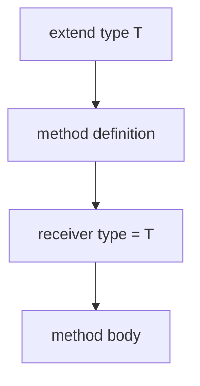

<!-- migrated from the legacy platform spec; canonical OpenSpec source -->
# extend type Specification

## Purpose

This specification defines the type extension syntax. The syntax replaces impl blocks. The extensions allow public members only. The extensions have full type scope access.

## Requirements

### Requirement: extend type syntax and target binding
`extend type` MUST be the normative mechanism for adding members to an existing type. The extended type name MUST refer to an in-scope type declaration. The body MAY declare methods and other members allowed by the type system for that target.

#### Scenario: Unknown extended type
- **GIVEN** an `extend type Missing { ... }` where `Missing` is not in scope
- **WHEN** name resolution runs
- **THEN** the compiler rejects the extension because the target type does not resolve

### Requirement: Public-only access and visibility
Members inside `extend type` MAY access public members of the extended type only. Private member access is forbidden inside `extend type` bodies. `extend type` MUST NOT bypass module visibility; extension sites MUST satisfy normal import and visibility rules.

#### Scenario: Private field access from extend type
- **GIVEN** an `extend type` body that reads a private field of the extended type
- **WHEN** access checking runs
- **THEN** the compiler rejects the private member access

### Requirement: Generated extend type contributions
`Generator` contracts MAY emit `extend type` blocks as typed AST contributions. Generated extensions MUST follow the same access and visibility rules as hand-authored extensions.

#### Scenario: Generated extension obeys access rules
- **GIVEN** a `Generator` that emits an `extend type` attempting private member access
- **WHEN** the host merges and re-checks the contribution
- **THEN** the private access is rejected under the same rules as hand-authored extensions

## Informative Source Provenance

The records below preserve migration history. They are not normative except where text was extracted into a requirement above.

### Source Record: extend type

**Authority:** informative provenance  
**Legacy path:** `/platform-spec/language-meta/program-structure/extend-type/`  
**Source:** `site/spec-content/platform-spec/language-meta/program-structure/extend-type/content.md`  
**SHA-256:** `7983c7bcb383d91c86c1dcdd59b5d142e1b56b1ef269b4c9eb22f5ab5e7eb643`

<details>
<summary>Migrated source text</summary>

``````markdown
<SpecSection title="Purpose" id="purpose">
`extend type` is the normative mechanism for adding members to an existing type. It replaces prior impl-block extension patterns for user and generated code.
</SpecSection>

<SpecSection title="Syntax" id="syntax">
```beskid
extend type Account
{
    pub unit Deposit(f32 amount)
    {
        account.balance += amount;
    }
}
```

The extended type name (`Account`) must refer to an in-scope type declaration. The body may declare methods and other members allowed by the type system for that target.
</SpecSection>

<SpecSection title="Access rules" id="access">
- Members inside `extend type` may access **public** members of the extended type only.
- **Private member access is forbidden** inside `extend type` bodies.
- `extend type` does not bypass module visibility; extension sites must satisfy normal import and visibility rules.
</SpecSection>

<SpecSection title="Compiler mods" id="compiler-mods">
`Generator` contracts may emit `extend type` blocks as typed AST contributions. Generated extensions follow the same access and visibility rules as hand-authored extensions.
</SpecSection>

## Implementation anchors
- `compiler/crates/beskid_analysis/src/analysis/` — `extend type` parsing, member resolution, and access rules
- `compiler/crates/beskid_analysis/src/types/` — extended type member injection into type tables

## Decisions
<!-- spec:generate:adr-index -->
No ADRs published under **`adr/`** yet.
<!-- /spec:generate:adr-index -->
## Articles
<!-- spec:generate:article-index -->
- [extend type - Contracts and edge cases](./articles/contracts-and-edge-cases/)
- [extend type - Design model](./articles/design-model/)
- [extend type - Examples](./articles/examples/)
- [extend type - FAQ and troubleshooting](./articles/faq-and-troubleshooting/)
- [extend type - Flow and algorithm](./articles/flow-and-algorithm/)
- [extend type - Verification and traceability](./articles/verification-and-traceability/)
<!-- /spec:generate:article-index -->
``````

</details>

### Source Record: extend type - Contracts and edge cases

**Authority:** informative provenance  
**Legacy path:** `/platform-spec/language-meta/program-structure/extend-type/articles/contracts-and-edge-cases/`  
**Source:** `site/spec-content/platform-spec/language-meta/program-structure/extend-type/articles/contracts-and-edge-cases/content.md`  
**SHA-256:** `6ce8bfe51de9c9eea1b1273a3778e66362be547e532d436dbaac73861e76b36c`

<details>
<summary>Migrated source text</summary>

``````markdown
## Hard requirements

- **Public members only** — `extend type` may access public members of the extended type only.
- **No visibility bypass** — Extension sites must satisfy normal import and visibility rules.
- **Compiler mod compatible** — Generated extensions follow the same rules as hand-authored ones.

## Diagnostic band

| Code | Condition |
| --- | --- |
| **E1511** | `extend type` private member access |

## Edge cases

- **Extension of external type** — `extend type` on a type from another module requires the type to be imported and public.
- **Duplicate extension methods** — Two `extend type` blocks on the same type defining the same method name cause ambiguity.
- **Extension of generic type** — `extend type Box<T>` is not supported in v0.1; extensions target concrete types only.
- **Self-referential extension** — An `extend type` method may call other methods on `this` including those from other extensions.

## Invariants

- Every `extend type` method must have a resolved receiver type after parsing.
- Extension methods participate in dispatch with the same rules as declared methods.
- Generated extensions must pass the same validation as hand-authored extensions.
``````

</details>

### Source Record: extend type - Design model

**Authority:** informative provenance  
**Legacy path:** `/platform-spec/language-meta/program-structure/extend-type/articles/design-model/`  
**Source:** `site/spec-content/platform-spec/language-meta/program-structure/extend-type/articles/design-model/content.md`  
**SHA-256:** `06e34f7393fe00734be4bdefb26a308845cf237ca044bd247bafcf180b77ff5e`

<details>
<summary>Migrated source text</summary>

``````markdown
## Vocabulary

| Construct | Role |
| --- | --- |
| **`ExtendTypeDefinition`** | `extend type T { methods }` block |
| **`MethodDefinition`** | Callable member with optional receiver type |
| **`ReceiverType`** | Type parsed as the extension target |

## Extension architecture

`extend type` is the normative mechanism for adding members to an existing type. It replaces prior `impl` block patterns.


### Subsystem boundaries

| Subsystem | Responsibility | Key file |
| --- | --- | --- |
| Parser | Parse `extend type` and methods | `syntax/items/extend_type.rs` |
| AST | Store extension structure | `syntax/items/extend_type.rs` |
| Resolver | Index extended methods under target type | `resolve/member_items.rs` |
| Visibility | Check private member access | `analysis/rules/staged/visibility.rs` |
| HIR lowering | Normalize method definitions | `hir/lowering/items.rs` |

## Access rules

- Members inside `extend type` may access public members of the extended type only.
- Private member access is forbidden inside `extend type` bodies.
- `extend type` does not bypass module visibility; extension sites must satisfy normal import and visibility rules.

## Compiler mod integration

`Generator` contracts may emit `extend type` blocks as typed AST contributions. Generated extensions follow the same access and visibility rules as hand-authored extensions.
``````

</details>

### Source Record: extend type - Examples

**Authority:** informative provenance  
**Legacy path:** `/platform-spec/language-meta/program-structure/extend-type/articles/examples/`  
**Source:** `site/spec-content/platform-spec/language-meta/program-structure/extend-type/articles/examples/content.md`  
**SHA-256:** `1f5f08c8068e8c4630be90a9dfccbaabda79c38ce921d3db79c39e330c0946f2`

<details>
<summary>Migrated source text</summary>

``````markdown
## Basic extension

```beskid
type Point {
    f32 x;
    f32 y;
}

extend type Point {
    pub f32 DistanceTo(Point other) {
        let dx = x - other.x;
        let dy = y - other.y;
        return dx * dx + dy * dy;
    }
}
```

## Multiple extensions

```beskid
extend type Point {
    pub unit Translate(f32 dx, f32 dy) {
        x += dx;
        y += dy;
    }
}

extend type Point {
    pub string ToString() {
        return "(" + x + ", " + y + ")";
    }
}
```

## Extension with access to public members

```beskid
type Counter {
    i32 value;

    pub i32 GetValue() {
        return value;
    }
}

extend type Counter {
    pub unit Reset() {
        value = 0;   // OK — value is public
    }
}
```
``````

</details>

### Source Record: extend type - FAQ and troubleshooting

**Authority:** informative provenance  
**Legacy path:** `/platform-spec/language-meta/program-structure/extend-type/articles/faq-and-troubleshooting/`  
**Source:** `site/spec-content/platform-spec/language-meta/program-structure/extend-type/articles/faq-and-troubleshooting/content.md`  
**SHA-256:** `a386cae951084ab10d97b584e1e92cc6da4ae9de8300c4661f393056d6cfe933`

<details>
<summary>Migrated source text</summary>

``````markdown
## FAQ

### Can I extend a type from another package?

Yes, if the type is imported and public. `extend type` does not bypass visibility rules.

### Can I extend a generic type?

Not in v0.1. Extensions target concrete types only.

### What is the difference between `extend type` and `impl`?

`extend type` is the normative syntax. `impl` blocks remain parse-compatible during migration but should not be used in new code.

## Troubleshooting

| Symptom | Likely cause |
| --- | --- |
| **E1511** | `extend type` accessing private member |
| Unknown type | Extended type name typo or missing import |
| Ambiguous method | Two extensions define the same method name |
``````

</details>

### Source Record: extend type - Flow and algorithm

**Authority:** informative provenance  
**Legacy path:** `/platform-spec/language-meta/program-structure/extend-type/articles/flow-and-algorithm/`  
**Source:** `site/spec-content/platform-spec/language-meta/program-structure/extend-type/articles/flow-and-algorithm/content.md`  
**SHA-256:** `d0952ff2fee5bdd302ba67d044ac4d3be1ec580095a27a7c3e8844f19be143c2`

<details>
<summary>Migrated source text</summary>

``````markdown
## Compile pipeline placement


## extend type algorithm (normative)

1. **Parse extension block** — `extend type T { methods }` becomes `ExtendTypeDefinition` with `target_type` and `methods`.
2. **Parse methods** — Each method is parsed with the target type as its implicit receiver type.
3. **Resolve target type** — The extended type name must refer to an in-scope type declaration.
4. **Index methods** — Add extension methods to the target type's member set for dispatch resolution.
5. **Check access rules** — `ExtendTypePrivateMemberAccess` (**E1511**) prevents access to private members of the extended type.
6. **Check visibility** — Extension sites must satisfy normal import and visibility rules.
7. **Lower to HIR** — Methods are lowered as ordinary function definitions with the receiver type bound.

## Method parsing with receiver



## Compiler mod generation

Mods may emit `extend type` blocks through `Generator` contracts:
1. Mod code constructs `ExtendTypeDefinition` nodes via the typed AST API.
2. The host merges generated contributions into the program.
3. Re-parse and re-resolve treat generated extensions the same as hand-authored ones.

## LSP / incremental

Re-run extension analysis when `extend type` blocks, target type definitions, or method signatures change.
``````

</details>

### Source Record: extend type - Verification and traceability

**Authority:** informative provenance  
**Legacy path:** `/platform-spec/language-meta/program-structure/extend-type/articles/verification-and-traceability/`  
**Source:** `site/spec-content/platform-spec/language-meta/program-structure/extend-type/articles/verification-and-traceability/content.md`  
**SHA-256:** `ff649060b061b16e08117ecb0f16b1bb5fc4e68fa4ce0f5473e2a752fde6858a`

<details>
<summary>Migrated source text</summary>

``````markdown
## Verification matrix

| Scenario | Expected evidence |
| --- | --- |
| `extend type` parsing | AST round-trip preserves structure |
| Method with receiver | Receiver type bound to extended type |
| Public member access | Compiles; no diagnostic |
| Private member access | **E1511** emitted |
| Dispatch to extension | Resolves to extension method |

## Implementation checklist

- [x] Grammar: `extend type`, method definitions
- [x] AST: `ExtendTypeDefinition`, `MethodDefinition`
- [x] Parser: `beskid.pest` productions for extend type
- [x] Resolver: extension methods indexed under target type
- [x] Visibility: `ExtendTypePrivateMemberAccess` (**E1511**)
- [x] HIR lowering: methods lowered with receiver type
- [ ] Generic type extensions (deferred)
- [ ] Mod-generated extension validation

## Test locations

- `compiler/crates/beskid_analysis/src/syntax/items/extend_type.rs` — parser tests
- `compiler/crates/beskid_analysis/src/resolve/member_items.rs` — dispatch tests
- `compiler/crates/beskid_analysis/src/analysis/rules/staged/visibility.rs` — access tests
- `compiler/crates/beskid_tests` — integration tests for extensions
``````

</details>
