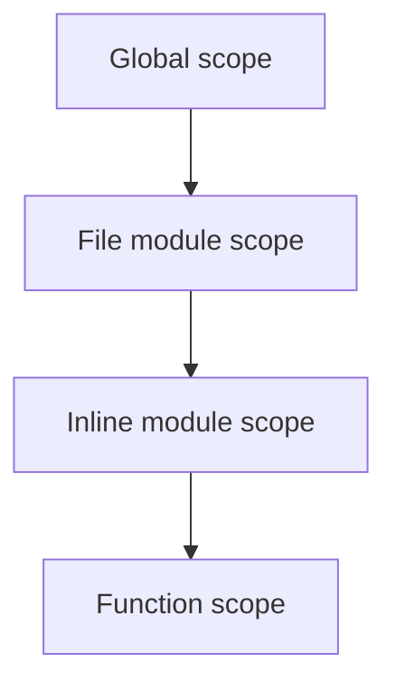

<!-- migrated from the legacy platform spec; canonical OpenSpec source -->
# Modules and visibility Specification

## Purpose

File layout, `public`/`internal` boundaries, and how packages compose. The driver and package manager use the same module graph the typechecker sees.

## Requirements

### Requirement: Module forms and identity
Path `mod` (`mod a.b;`) MUST declare the file’s module path and MUST be the first top-level item when used (**E1505**, **E1506**, **E1507**). Inline `mod name { items }` MUST nest a submodule in the current file. Without a file-scoped `mod`, module identity MUST derive from the file path relative to the project source root. Explicit `mod path;` MUST take precedence over path-derived module identity when present.

#### Scenario: File-scoped mod not first
- **GIVEN** a source file whose file-scoped `mod path;` is not the first top-level item
- **WHEN** module collection runs
- **THEN** the compiler emits **E1505**

### Requirement: Default privacy and pub export
Items MUST default to private to their module. `pub` on an item MUST export it to importers of the containing module. Importing a private item MUST error (**E1501**, **E1107**). v0.1 MUST use private-by-default plus `pub` only; there is no `internal` keyword.

#### Scenario: Private item imported from another module
- **GIVEN** a `use` of a non-`pub` item from another module
- **WHEN** visibility checking runs
- **THEN** the compiler emits **E1501** or **E1107**

### Requirement: Pub use re-exports
`pub use path` MUST re-export symbols, and re-exported names MUST refer to accessible items. Re-exports MUST preserve the underlying symbol’s accessibility rules; `pub use` of a private item from another module MUST be rejected.

#### Scenario: Re-export of inaccessible item
- **GIVEN** a `pub use` that names a private item from another module
- **WHEN** re-export checking runs
- **THEN** the re-export is rejected

### Requirement: File-scoped module nesting restrictions
Duplicate module declarations in one file MUST error. Nested `mod` declarations inside a file-scoped module file MUST error (**E1507**). Package boundaries MUST align with project manifests; cross-package visibility follows the same `pub` rules within each compilation.

#### Scenario: Nested mod in file-scoped module file
- **GIVEN** a file that begins with file-scoped `mod path;` and later contains a nested `mod` declaration
- **WHEN** module collection runs
- **THEN** the compiler emits **E1507**

## Informative Source Provenance

The records below preserve migration history and are not normative except where text was extracted into a requirement above.

### Source Record: Modules and visibility

**Authority:** informative provenance  
**Legacy path:** `/platform-spec/language-meta/program-structure/modules-and-visibility/`  
**Source:** `site/spec-content/platform-spec/language-meta/program-structure/modules-and-visibility/content.md`  
**SHA-256:** `1189b4ca722565e5d8f1aa291084340067411b1173bc3dc84af435957a02e346`

<details>
<summary>Migrated source text</summary>

``````markdown
## Normative specification

### Scope

Defines the **module graph**, **file-scoped modules**, and **`pub` visibility** rules. Name binding is in [Name resolution](/platform-spec/language-meta/program-structure/name-resolution/).

### Module forms

| Form | Rule |
| --- | --- |
| **Path `mod`** | `mod a.b;` declares the file’s module path; **must** be the first top-level item when used (**E1505**, **E1506**, **E1507**) |
| **Inline `mod`** | `mod name { items }` nests a submodule in the current file |
| **File path** | Without file-scoped `mod`, module identity **must** derive from file path relative to project source root |

### Visibility

- Items default to **private** to their module.
- **`pub`** on an item **must** export it to importers of the containing module.
- **`pub use path`** re-exports symbols; re-exported names **must** refer to accessible items.
- Importing a private item **must** error (**E1501**, **E1107**).

### Static rules

- Duplicate module declarations in one file **must** error.
- Nested `mod` declarations inside a file-scoped module file **must** error (**E1507**).
- Package boundaries **must** align with project manifests; cross-package visibility follows the same `pub` rules within each compilation.

### Dynamic semantics

Modules exist at compile time; runtime has no separate module loader beyond linked assemblies/packages produced by the toolchain.

### Diagnostics

Visibility band **E1501–E1507**; unused import **W1503**. Registry: [Diagnostic code registry](/platform-spec/compiler/semantic-pipeline/diagnostic-code-registry/).

### Conformance

**L1** implementations **must** match reference layout tests for file-scoped modules and `pub` boundaries.

## Decisions
<!-- spec:generate:adr-index -->
No ADRs published under **`adr/`** yet.
<!-- /spec:generate:adr-index -->
## Articles
<!-- spec:generate:article-index -->
- [Modules and visibility - Contracts and edge cases](./articles/contracts-and-edge-cases/)
- [Modules and visibility - Design model](./articles/design-model/)
- [Modules and visibility - Examples](./articles/examples/)
- [Modules and visibility - FAQ and troubleshooting](./articles/faq-and-troubleshooting/)
- [Modules and visibility - Flow and algorithm](./articles/flow-and-algorithm/)
- [Modules and visibility - Verification and traceability](./articles/verification-and-traceability/)
<!-- /spec:generate:article-index -->
``````

</details>

### Source Record: Modules and visibility - Contracts and edge cases

**Authority:** informative provenance  
**Legacy path:** `/platform-spec/language-meta/program-structure/modules-and-visibility/articles/contracts-and-edge-cases/`  
**Source:** `site/spec-content/platform-spec/language-meta/program-structure/modules-and-visibility/articles/contracts-and-edge-cases/content.md`  
**SHA-256:** `a9f06769a57c140f51f714bc68b514103d1087017efce26625b7b92b64a31f6d`

<details>
<summary>Migrated source text</summary>

``````markdown
## Hard requirements

- **File-scoped precedence** — Explicit `mod path;` wins over path-derived module identity when present.
- **No `internal` keyword** — v0.1 uses private-by-default plus `pub`; assembly-internal friends are deferred.
- **Package graph is external** — Cross-package edges come from manifests; this chapter defines symbol visibility only.
- **`pub use` re-export** — Re-exports must preserve the underlying symbol's accessibility rules.

## Diagnostic band E15xx

| Code | Condition |
| --- | --- |
| **E1501** | Visibility violation (private item imported) |
| **E1502** | Module not found |
| **E1505** | File-scoped module not first item |
| **E1506** | Duplicate file-scoped module |
| **E1507** | Module declaration forbidden in file-scoped module |
| **W1503** | Unused import |
| **W1504** | Unused private item |

## Edge cases

- **Nested `mod` in file-scoped file** — `ModuleDeclarationForbiddenInFileScopedModule` (**E1507**) prevents nested `mod` declarations inside a file-scoped module file.
- **Circular imports** — Circular `use` dependencies are allowed as long as forward references are not used.
- **Re-export of private** — `pub use` of a private item from another module is rejected.
- **Self-import** — `use self::Name;` is not supported in v0.1.

## Invariants

- Every item must have a resolved module scope after collection.
- Visibility checks must respect the importer's module, not the exporter's.
- Package boundaries must align with project manifests.
``````

</details>

### Source Record: Modules and visibility - Design model

**Authority:** informative provenance  
**Legacy path:** `/platform-spec/language-meta/program-structure/modules-and-visibility/articles/design-model/`  
**Source:** `site/spec-content/platform-spec/language-meta/program-structure/modules-and-visibility/articles/design-model/content.md`  
**SHA-256:** `346074643c6467c81b359d90372af0de3fd8fd689b30c9cbfcd6b32cc1099a14`

<details>
<summary>Migrated source text</summary>

``````markdown
## Vocabulary

| Construct | Role |
| --- | --- |
| **`ModuleDeclaration`** | Out-of-line module declaration (`mod path;`) |
| **`InlineModule`** | Inline nested module (`mod name { items }`) |
| **`UseDeclaration`** | Import with optional alias (`use Path as Alias;`) |
| **`Visibility`** | `pub` or private (default) |

## Module architecture

The module graph is built from file paths and explicit `mod` declarations. The driver and package manager use the same module graph the typechecker sees.


### Subsystem boundaries

| Subsystem | Responsibility | Key file |
| --- | --- | --- |
| Parser | Parse `mod`, `use`, `pub` | `syntax/items/module_declaration.rs`, `use_declaration.rs` |
| AST | Store module structure | `syntax/items/` |
| Resolver | Build scope chain | `resolve/collect.rs` |
| Visibility rules | Check access | `analysis/rules/staged/visibility.rs` |

## Module forms

| Form | Rule |
| --- | --- |
| **Path `mod`** | `mod a.b;` declares the file's module path; must be the first top-level item when used |
| **Inline `mod`** | `mod name { items }` nests a submodule in the current file |
| **File path** | Without file-scoped `mod`, module identity derives from file path relative to project source root |

## Visibility

- Items default to private to their module.
- `pub` on an item exports it to importers of the containing module.
- `pub use path` re-exports symbols; re-exported names must refer to accessible items.
``````

</details>

### Source Record: Modules and visibility - Examples

**Authority:** informative provenance  
**Legacy path:** `/platform-spec/language-meta/program-structure/modules-and-visibility/articles/examples/`  
**Source:** `site/spec-content/platform-spec/language-meta/program-structure/modules-and-visibility/articles/examples/content.md`  
**SHA-256:** `3f49f40cf89781c94a080bd3d27e5e3de473670c8fbac427bc138b228135ed48`

<details>
<summary>Migrated source text</summary>

``````markdown
## File-scoped module

```beskid
mod MyApp.Services;

pub type UserService {
    // ...
}
```

## Inline module

```beskid
mod Internal {
    type Helper {
        // private by default
    }
}
```

## Import with alias

```beskid
use MyApp.Services.UserService as Service;

unit UseService() {
    let s = Service {};
}
```

## Re-export

```beskid
mod PublicApi {
    pub use MyApp.Services.UserService;
    pub use MyApp.Models.User;
}
```

## Visibility

```beskid
mod Library {
    type InternalHelper { }          // private
    pub type PublicApi { }           // public
}
```
``````

</details>

### Source Record: Modules and visibility - FAQ and troubleshooting

**Authority:** informative provenance  
**Legacy path:** `/platform-spec/language-meta/program-structure/modules-and-visibility/articles/faq-and-troubleshooting/`  
**Source:** `site/spec-content/platform-spec/language-meta/program-structure/modules-and-visibility/articles/faq-and-troubleshooting/content.md`  
**SHA-256:** `4a7aba3f3d5916e99b4c2c06c519d38c0d1487d2b48106206ad6eea527789beb`

<details>
<summary>Migrated source text</summary>

``````markdown
## Locked decisions

| Decision | ID | Summary |
| --- | --- | --- |
| File-scoped precedence | D-LM-MOD-001 | Explicit `mod` wins over path-derived identity |
| No `internal` keyword | D-LM-MOD-002 | Private-by-default plus `pub` only |
| Package graph external | D-LM-MOD-003 | Cross-package edges from manifests |
| `pub use` re-export | D-LM-MOD-004 | Preserves underlying accessibility |

## FAQ

### Do I need `mod` in every file?

No. Without an explicit `mod`, the module identity derives from the file path.

### Can I nest modules infinitely?

Yes, but readability degrades. Inline modules and file-scoped modules can be nested arbitrarily.

### What is the difference between `use` and `import`?

Beskid uses `use` for imports. There is no `import` keyword.

## Troubleshooting

| Symptom | Likely cause |
| --- | --- |
| **E1505** | `mod` is not the first item in the file |
| **E1506** | Multiple file-scoped `mod` declarations |
| **E1507** | Nested `mod` inside a file-scoped module file |
| **E1501** | Accessing a private item from another module |
| **E1105** | Import path does not exist |
| **W1503** | Import is never used |
``````

</details>

### Source Record: Modules and visibility - Flow and algorithm

**Authority:** informative provenance  
**Legacy path:** `/platform-spec/language-meta/program-structure/modules-and-visibility/articles/flow-and-algorithm/`  
**Source:** `site/spec-content/platform-spec/language-meta/program-structure/modules-and-visibility/articles/flow-and-algorithm/content.md`  
**SHA-256:** `578056c165505823aa6d529bfb49f4833173a9e087e76da6d115438ea7f7dfc8`

<details>
<summary>Migrated source text</summary>

``````markdown
## Compile pipeline placement


## Module graph algorithm (normative)

1. **Parse module declarations** — `ModuleDeclaration` stores `path` and `visibility`. `InlineModule` stores nested `items`.
2. **Build file-scoped modules** — If a file starts with `mod path;`, that path becomes the file's module identity. `FileScopedModuleNotFirstItem` (**E1505**) if not first. `DuplicateFileScopedModule` (**E1506**) if multiple.
3. **Derive path modules** — Files without file-scoped `mod` derive module identity from their path relative to the source root.
4. **Build inline modules** — `mod name { items }` creates a nested module scope.
5. **Resolve imports** — `use Path;` and `use Path as Alias;` bind imported symbols. `UnknownImportPath` (**E1105**) for invalid paths. `AmbiguousImport` (**E1104**) for conflicts.
6. **Check visibility** — Accessing a private item from another module emits `VisibilityViolationImportPrivate` (**E1501**) or `ResolvePrivateItemInModule` (**E1107**).
7. **Check re-exports** — `pub use` must refer to accessible items.

## Scope chain



## LSP / incremental

Re-run module and visibility analysis when `mod`, `use`, or `pub` declarations change.
``````

</details>

### Source Record: Modules and visibility - Verification and traceability

**Authority:** informative provenance  
**Legacy path:** `/platform-spec/language-meta/program-structure/modules-and-visibility/articles/verification-and-traceability/`  
**Source:** `site/spec-content/platform-spec/language-meta/program-structure/modules-and-visibility/articles/verification-and-traceability/content.md`  
**SHA-256:** `852db63b572c46fb563363361ddae9d6ba2768fd2d9ee09e1a0b22860286fa92`

<details>
<summary>Migrated source text</summary>

``````markdown
## Verification matrix

| Scenario | Expected evidence |
| --- | --- |
| File-scoped `mod` | Parsed as first item; module identity set |
| Inline `mod` | Nested scope created |
| `use` import | Symbol bound in current scope |
| `pub` export | Accessible from importers |
| Private access | **E1501** or **E1107** emitted |
| Unused import | **W1503** warned |

## Implementation checklist

- [x] Grammar: `mod`, `use`, `pub`
- [x] AST: `ModuleDeclaration`, `InlineModule`, `UseDeclaration`
- [x] Parser: `beskid.pest` productions for modules
- [x] Resolver: module scope building in `resolve/collect.rs`
- [x] Visibility rules: `visibility.rs` with **E1501–E1507**
- [x] Diagnostics: **E1501–E1507**, **W1503**, **W1504**
- [ ] Cross-package visibility rules
- [ ] Assembly-internal friends (deferred)

## Test locations

- `compiler/crates/beskid_analysis/src/syntax/items/module_declaration.rs` — parser tests
- `compiler/crates/beskid_analysis/src/syntax/items/use_declaration.rs` — parser tests
- `compiler/crates/beskid_analysis/src/analysis/rules/staged/visibility.rs` — visibility tests
- `compiler/crates/beskid_tests` — integration tests for modules
``````

</details>
