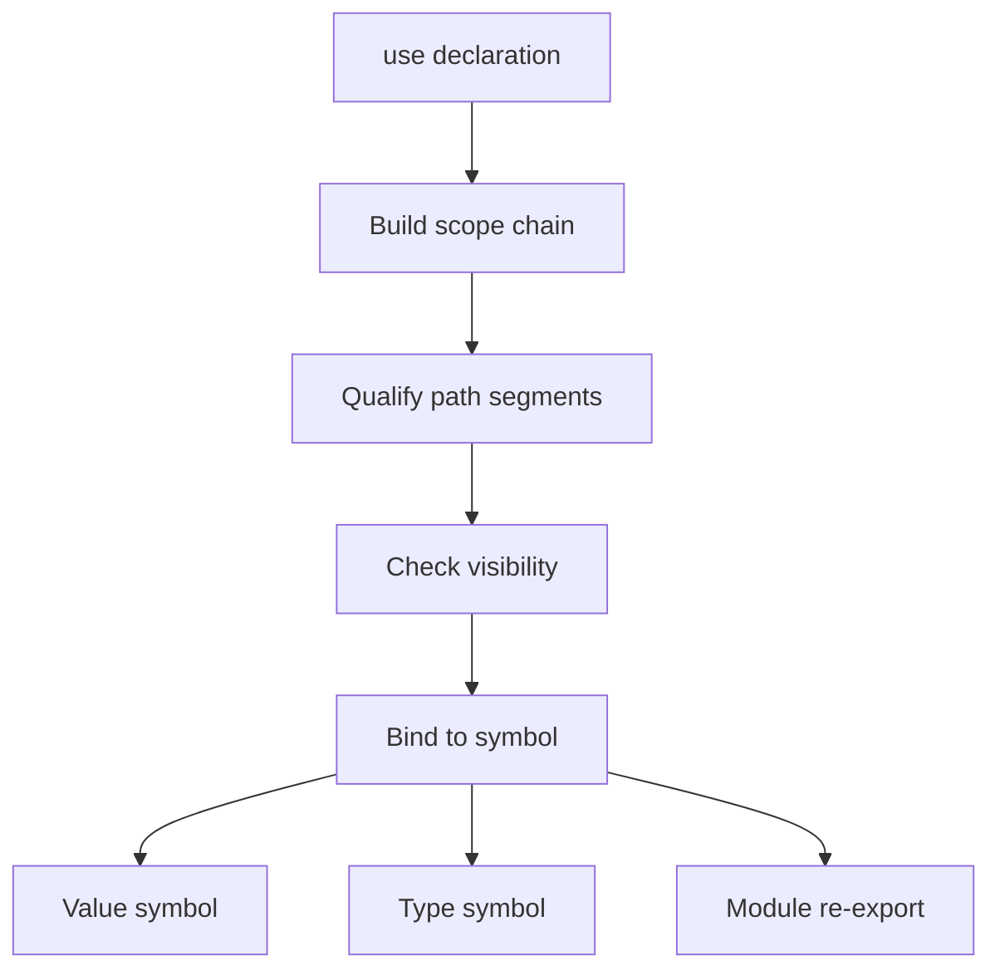
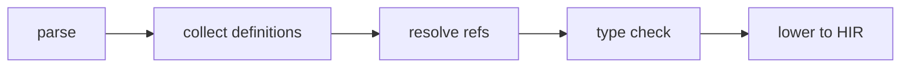
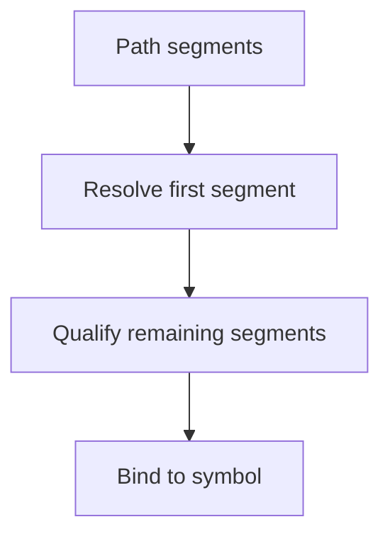

<!-- migrated from the legacy platform spec; canonical OpenSpec source -->
# Name resolution Specification

## Purpose

Scopes, imports, and shadowing tie syntax to symbols. Diagnostics for unresolved names must cite these rules verbatim.

## Requirements

### Requirement: Use declaration resolution and diagnostics
`use Path;` MUST import the final segment into the current scope; `use Path as Alias;` MUST bind the resolved target to `Alias`. Unknown import paths MUST error (**E1105**); ambiguous imports MUST error (**E1104**); `use` before declaration in the same module MUST error (**E1106**) when forward reference is illegal.

#### Scenario: Unknown import path
- **GIVEN** a `use` declaration whose path does not resolve to any module or item
- **WHEN** name resolution processes imports
- **THEN** the compiler emits **E1105** and does not bind the import

### Requirement: Value and type path binding
Value paths MUST resolve to functions, locals, constants, enum constructors, and contract namespaces. Type paths MUST resolve to types, generics, and primitive names. Unresolved value names MUST error (**E1101**); unresolved type names MUST error (**E1201**); unknown module segments MUST error (**E1108**).

#### Scenario: Unresolved value name
- **GIVEN** an expression that references a value name with no binding in scope
- **WHEN** value-path resolution runs
- **THEN** the compiler emits **E1101**

### Requirement: Visibility, duplicates, and shadowing
Resolution MUST respect visibility from the importer’s module; private item access MUST error (**E1107**). Duplicate definitions in the same scope MUST error (**E1006**, **E1102**). Inner scopes MAY shadow outer locals; shadowing SHOULD warn (**W1103**). Generic parameters shadow type names in signature scope only for the declaring signature.

#### Scenario: Private item accessed across modules
- **GIVEN** a reference from module A to a non-`pub` item in module B
- **WHEN** visibility checking runs during resolution
- **THEN** the compiler emits **E1107**

### Requirement: Single resolver snapshot and stable qualified names
The package driver and typechecker MUST share one resolution snapshot per compilation. Emitted metadata MUST record stable `qualifiedName` strings for tooling across compiles. Resolution MUST NOT inject nullable or `optional` aliases as implicit imports.

#### Scenario: Shared resolution snapshot
- **GIVEN** a multi-module compilation
- **WHEN** the package driver and typechecker consult name bindings
- **THEN** both consume the same resolution snapshot and each resolved symbol has a stable `qualifiedName`

## Informative Source Provenance

The records below preserve migration history and are not normative except where text was extracted into a requirement above.

### Source Record: Name resolution

**Authority:** informative provenance  
**Legacy path:** `/platform-spec/language-meta/program-structure/name-resolution/`  
**Source:** `site/spec-content/platform-spec/language-meta/program-structure/name-resolution/content.md`  
**SHA-256:** `807afac546e0cc6b6c29dd6300af1ee0942ea053ae68d5d6e584bdd37f44b82e`

<details>
<summary>Migrated source text</summary>

``````markdown
## Resolution flow



## Normative specification

### Scope

Defines how **identifiers** and **paths** bind to program items across modules. Module shape is in [Modules and visibility](/platform-spec/language-meta/program-structure/modules-and-visibility/).

### `use` declarations

- **`use Path;`** imports the final segment into the current scope.
- **`use Path as Alias;`** binds the resolved target to `Alias`.
- **`use` before declaration** in the same module **must** error (**E1106**) when forward reference is illegal.
- Unknown import paths **must** error (**E1105**); ambiguous imports **must** error (**E1104**).

### Value and type paths

- **Value paths** resolve to functions, locals, constants, enum constructors, and contract namespaces.
- **Type paths** resolve to types, generics, and primitive names.
- Unresolved value **E1101**; unresolved type **E1201**; unknown module segment **E1108**.

### Locals and shadowing

- Inner scopes **may** shadow outer locals; shadowing **should** warn (**W1103**).
- Duplicate definitions in the same scope **must** error (**E1006**, **E1102**).

### Static rules

- Resolution **must** respect visibility from the importer’s module.
- Generic parameters shadow type names in signature scope only for the declaring signature.

### Dynamic semantics

Resolution is compile-time; emitted metadata records stable `qualifiedName` strings for tooling.

### Diagnostics

Import band **E1104–E1108**; resolve duplicates **E1102**. Registry: [Diagnostic code registry](/platform-spec/compiler/semantic-pipeline/diagnostic-code-registry/).

### Conformance

**L1** resolver tests **must** pass for cross-module `use` and private item rejection.

## Decisions
<!-- spec:generate:adr-index -->
No ADRs published under **`adr/`** yet.
<!-- /spec:generate:adr-index -->
## Articles
<!-- spec:generate:article-index -->
- [Name resolution - Contracts and edge cases](./articles/contracts-and-edge-cases/)
- [Name resolution - Design model](./articles/design-model/)
- [Name resolution - Examples](./articles/examples/)
- [Name resolution - FAQ and troubleshooting](./articles/faq-and-troubleshooting/)
- [Name resolution - Flow and algorithm](./articles/flow-and-algorithm/)
- [Name resolution - Verification and traceability](./articles/verification-and-traceability/)
<!-- /spec:generate:article-index -->
``````

</details>

### Source Record: Name resolution - Contracts and edge cases

**Authority:** informative provenance  
**Legacy path:** `/platform-spec/language-meta/program-structure/name-resolution/articles/contracts-and-edge-cases/`  
**Source:** `site/spec-content/platform-spec/language-meta/program-structure/name-resolution/articles/contracts-and-edge-cases/content.md`  
**SHA-256:** `f88861546f048ccbcc0f3ac9cd54e37db1efb5aa9ecb593d67495cbfde5e9eca`

<details>
<summary>Migrated source text</summary>

``````markdown
## Hard requirements

- **Single resolver graph** — Package driver and typechecker share one resolution snapshot per compilation.
- **Contract namespaces** — Contracts may appear as path prefixes for static methods.
- **Qualified names for tooling** — Emitted `qualifiedName` strings must be stable across compiles.
- **No implicit `null` imports** — Resolution must not inject nullable or `optional` aliases.

## Diagnostic band E11xx

| Code | Condition |
| --- | --- |
| **E1101** | Unknown value |
| **E1102** | Duplicate item or local |
| **E1104** | Ambiguous import |
| **E1105** | Unknown import path |
| **E1106** | Use before declaration |
| **E1107** | Private item access |
| **E1108** | Unknown module path |
| **W1103** | Shadowed local |

## Edge cases

- **Forward reference** — `use` before declaration in the same module emits **E1106** when forward reference is illegal.
- **Generic parameter shadowing** — Generic parameters shadow type names in signature scope only for the declaring signature.
- **Self-referential type** — A type may reference itself in its own field types; resolution handles this via deferred binding.
- **Import cycle** — Circular `use` dependencies are allowed as long as no forward references are used.

## Invariants

- Resolution must respect visibility from the importer's module.
- Every resolved symbol must have a stable `qualifiedName` for tooling.
- Re-resolution on incremental edits must produce the same result as full compilation for unchanged sites.
``````

</details>

### Source Record: Name resolution - Design model

**Authority:** informative provenance  
**Legacy path:** `/platform-spec/language-meta/program-structure/name-resolution/articles/design-model/`  
**Source:** `site/spec-content/platform-spec/language-meta/program-structure/name-resolution/articles/design-model/content.md`  
**SHA-256:** `625540a458db9b7eb2f0ff6197b6a3f4de5628c7e20719c20374ca6718b694ce`

<details>
<summary>Migrated source text</summary>

``````markdown
## Vocabulary

| Construct | Role |
| --- | --- |
| **`Resolver`** | Central name resolution state |
| **`Scope`** | Hierarchical binding container |
| **`ValuePath`** | Path resolving to functions, locals, constants, enum constructors |
| **`TypePath`** | Path resolving to types, generics, primitives |

## Resolution architecture

Name resolution is **single-pass** with a shared snapshot per compilation. The package driver and typechecker share one resolver graph.


### Subsystem boundaries

| Subsystem | Responsibility | Key file |
| --- | --- | --- |
| Parser | Parse `use` and paths | `syntax/items/use_declaration.rs` |
| Resolver | Build scope chain and bind names | `resolve/resolver.rs`, `resolve/collect.rs` |
| Resolve refs | Walk AST and resolve references | `resolve/resolve_refs.rs` |
| Name resolution rules | Emit resolution diagnostics | `analysis/rules/staged/name_resolution.rs` |

## Scope chain

Resolution walks from innermost scope outward:
1. Local scope (function/lambda parameters and `let` bindings)
2. Module scope (items in the current module)
3. Import scope (`use` bindings)
4. Global scope (prelude and built-in types)

## Shadowing

Inner scopes may shadow outer locals. `ResolveShadowedLocal` (**W1103**) warns when shadowing occurs.
``````

</details>

### Source Record: Name resolution - Examples

**Authority:** informative provenance  
**Legacy path:** `/platform-spec/language-meta/program-structure/name-resolution/articles/examples/`  
**Source:** `site/spec-content/platform-spec/language-meta/program-structure/name-resolution/articles/examples/content.md`  
**SHA-256:** `72fef604ef0b39ed9a79e4bb87dff7bb942087f125de820a48fcf8dfad43b952`

<details>
<summary>Migrated source text</summary>

``````markdown
## Basic resolution

```beskid
unit Main() {
    let x = 42;
    Console.WriteLine(x);   // resolves local x
}
```

## Import and alias

```beskid
use MyApp.Models.User;
use MyApp.Services.UserService as Service;

unit UseImports() {
    let u = User {};
    let s = Service {};
}
```

## Shadowing

```beskid
unit Shadow() {
    let x = 10;
    {
        let x = 20;   // shadows outer x; W1103 warned
        Console.WriteLine(x);   // 20
    }
    Console.WriteLine(x);   // 10
}
```

## Contract namespace

```beskid
contract Math {
    i32 Abs(i32 value);
}

unit UseNamespace() {
    let n = Math.Abs(-5);   // resolves through contract namespace
}
```

## Qualified path

```beskid
unit Qualified() {
    let u = MyApp.Models.User {};   // fully qualified path
}
```
``````

</details>

### Source Record: Name resolution - FAQ and troubleshooting

**Authority:** informative provenance  
**Legacy path:** `/platform-spec/language-meta/program-structure/name-resolution/articles/faq-and-troubleshooting/`  
**Source:** `site/spec-content/platform-spec/language-meta/program-structure/name-resolution/articles/faq-and-troubleshooting/content.md`  
**SHA-256:** `2131dc5e8e3e2649f762ddbc134c1f00d3247f192c1201c09618549c1b201a1a`

<details>
<summary>Migrated source text</summary>

``````markdown
## Locked decisions

| Decision | ID | Summary |
| --- | --- | --- |
| Single resolver graph | D-LM-NAME-001 | Driver and typechecker share one snapshot |
| Contract namespaces | D-LM-NAME-002 | Contracts as path prefixes for static methods |
| Qualified names for tooling | D-LM-NAME-003 | Stable across compiles |
| No implicit `null` imports | D-LM-NAME-004 | No nullable aliases injected |

## FAQ

### Why is my import not found?

Check that the path is correct and the target item is `pub`. `UnknownImportPath` (**E1105**) means the path does not resolve to any module or item.

### Can I use a type before it is declared?

No. Forward references within the same module emit **E1106** unless the reference is in a type signature (which may be resolved in a second pass).

### What does "shadowed local" mean?

An inner `let` binding has the same name as an outer one. The inner binding takes precedence. **W1103** warns about this.

## Troubleshooting

| Symptom | Likely cause |
| --- | --- |
| **E1101** | Unknown value name |
| **E1201** | Unknown type name |
| **E1102** | Duplicate name in same scope |
| **E1105** | Import path does not exist |
| **E1106** | Forward reference in same module |
| **E1107** | Accessing private item |
| **W1103** | Inner binding shadows outer |
``````

</details>

### Source Record: Name resolution - Flow and algorithm

**Authority:** informative provenance  
**Legacy path:** `/platform-spec/language-meta/program-structure/name-resolution/articles/flow-and-algorithm/`  
**Source:** `site/spec-content/platform-spec/language-meta/program-structure/name-resolution/articles/flow-and-algorithm/content.md`  
**SHA-256:** `387b4a9670ed8178596b20c0763f334c39e8a463255759c50e8618ffb80b0161`

<details>
<summary>Migrated source text</summary>

``````markdown
## Compile pipeline placement



## Resolution algorithm (normative)

1. **Collect definitions** — Walk all items and build a name-to-definition map per module scope.
2. **Process imports** — Resolve `use` paths and add imported names to the module scope. `UnknownImportPath` (**E1105**) for invalid paths.
3. **Build scope chain** — For each function/lambda, create a local scope with parameters and `let` bindings.
4. **Resolve value paths** — Walk expressions and bind identifiers to value symbols. `ResolveUnknownValue` (**E1101**) for unresolved names.
5. **Resolve type paths** — Walk type expressions and bind identifiers to type symbols. `ResolveUnknownType` (**E1201**) for unresolved types.
6. **Check visibility** — Verify that resolved symbols are accessible from the reference site. `ResolvePrivateItemInModule` (**E1107**) for private access.
7. **Check duplicates** — `ResolveDuplicateItem` (**E1102**) and `ResolveDuplicateLocal` (**E1102**) for duplicate names in the same scope.
8. **Handle shadowing** — `ResolveShadowedLocal` (**W1103**) warns when an inner binding shadows an outer one.

## Path resolution



## Contract namespaces

Contracts may appear as path prefixes for static-style calls (`Contract.method()`). The resolver provides contract-as-namespace fallback when a direct value binding is not found.

## LSP / incremental

Re-run resolution when `use` declarations, item definitions, or local bindings change.
``````

</details>

### Source Record: Name resolution - Verification and traceability

**Authority:** informative provenance  
**Legacy path:** `/platform-spec/language-meta/program-structure/name-resolution/articles/verification-and-traceability/`  
**Source:** `site/spec-content/platform-spec/language-meta/program-structure/name-resolution/articles/verification-and-traceability/content.md`  
**SHA-256:** `dc4417d1d251e08c00b8acedb71eb70de4e9b7739486d40336fbf1aa045b29bf`

<details>
<summary>Migrated source text</summary>

``````markdown
## Verification matrix

| Scenario | Expected evidence |
| --- | --- |
| Local resolution | Identifier binds to local declaration |
| Import resolution | `use` path resolves to exported symbol |
| Duplicate name | **E1102** emitted |
| Unknown name | **E1101** or **E1201** emitted |
| Private access | **E1107** emitted |
| Shadowing | **W1103** warned |

## Implementation checklist

- [x] Grammar: identifiers, paths, `use`
- [x] AST: `UseDeclaration`, path expressions
- [x] Parser: `beskid.pest` productions for paths
- [x] Resolver: `resolver.rs`, `collect.rs`, `resolve_refs.rs`
- [x] Name resolution rules: `name_resolution.rs`
- [x] Diagnostics: **E1101–E1108**, **W1103**
- [x] Cross-package resolution (assembly prefetch + `ModuleIndex`)
- [x] Stable package-prefixed symbol identity for tooling (`SymbolRegistry`, `symbolKey`) — see [resolver contract](/platform-spec/compiler/semantic-pipeline/resolver-contract/)

## Test locations

- `compiler/crates/beskid_analysis/src/resolve/resolver.rs` — resolver tests
- `compiler/crates/beskid_analysis/src/resolve/resolve_refs.rs` — reference tests
- `compiler/crates/beskid_analysis/src/analysis/rules/staged/name_resolution.rs` — rule tests
- `compiler/crates/beskid_tests` — integration tests for resolution
``````

</details>
