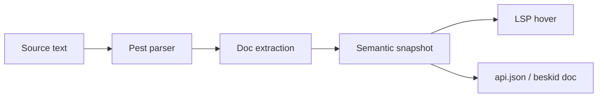
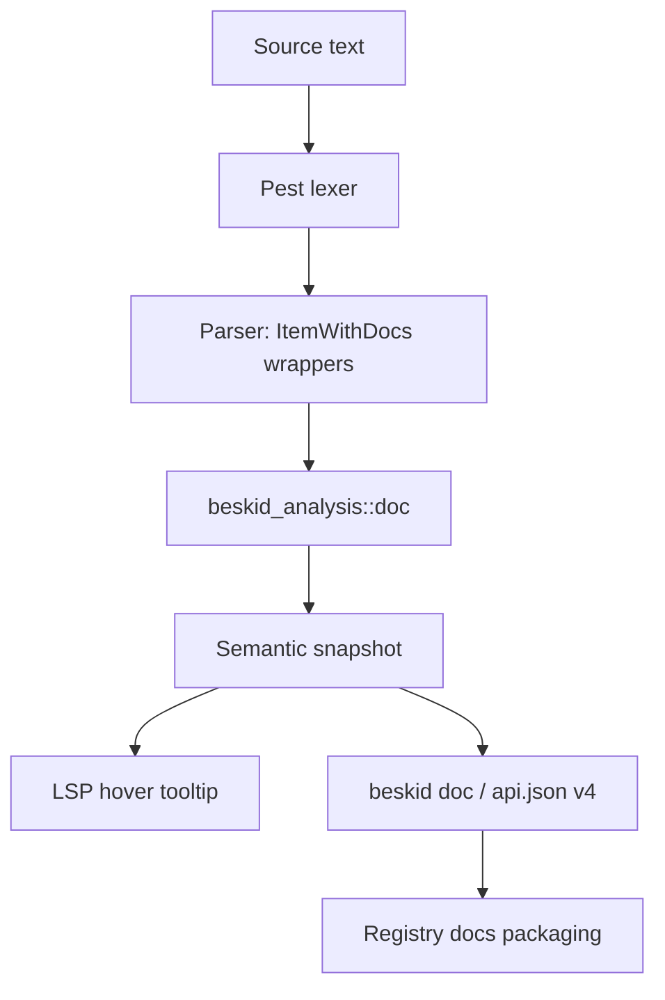

<!-- migrated from the legacy platform spec; canonical OpenSpec source -->
# Documentation comments Specification

## Purpose

Structured comments attach human-readable contracts to declarations. Tooling preserves the comments through formatting and refactors. The tooling does not change the semantics.

## Requirements

### Requirement: Documentation comments - Contracts and edge cases: Invariants [language-meta/surface-syntax/documentation-comments/articles/contracts-and-edge-cases]
The Beskid standard SHALL enforce the following migrated contract section. Accepted ADR decisions are binding; uppercase requirement keywords retain their BCP-14 meaning.

> 1. Doc text is **informative** for type checking; it **must not** alter name lookup or contract satisfaction.
> 2. Tools **should** render `DocRun` as Markdown-compatible plain text.
> 3. The compiler **must** preserve doc text in semantic snapshots for LSP hover and generated API docs.
> 4. Doc comments cannot introduce new MUST rules (D-LM-DOC-002).

**Stable ID:** `BSP-REQ-DB12958A436D`  
**Legacy source:** `site/spec-content/platform-spec/language-meta/surface-syntax/documentation-comments/articles/contracts-and-edge-cases/content.md`  
**Source SHA-256:** `ec6faa27024dac9d68614df1246875da707b4dd577721580d63a6b210f33369e`

#### Scenario: Conformance exercises Invariants
- **GIVEN** an implementation claims conformance with this capability
- **WHEN** behavior governed by this contract section is exercised
- **THEN** every MUST, SHALL, REQUIRED, prohibition, and accepted decision in the section is satisfied

### Requirement: Documentation comments - Design model: Key design decisions [language-meta/surface-syntax/documentation-comments/articles/design-model]
The Beskid standard SHALL enforce the following migrated contract section. Accepted ADR decisions are binding; uppercase requirement keywords retain their BCP-14 meaning.

> | ID | Decision | Rationale |
> |---|---|---|
> | D-LM-DOC-001 | `///` only | Block and `//` comments never form API documentation. |
> | D-LM-DOC-002 | Non-normative doc | Doc comments cannot introduce new MUST rules. |
> | D-LM-DOC-003 | `@arg` on callables only | Parameter tags apply to functions, methods, and contract methods — not record fields. |
> | D-LM-DOC-004 | Signatures from compiler | `api.json` types and links are compiler-derived; prose must not invent parallel type strings. |

**Stable ID:** `BSP-REQ-A5F157522DE3`  
**Legacy source:** `site/spec-content/platform-spec/language-meta/surface-syntax/documentation-comments/articles/design-model/content.md`  
**Source SHA-256:** `93c03b2bee77d97d02b7367532217c68e57737c3958b9f3e60a5e180c0911e87`

#### Scenario: Conformance exercises Key design decisions
- **GIVEN** an implementation claims conformance with this capability
- **WHEN** behavior governed by this contract section is exercised
- **THEN** every MUST, SHALL, REQUIRED, prohibition, and accepted decision in the section is satisfied

## Informative Source Provenance

The records below preserve migration history. They are not normative except where text was extracted into a requirement above.

### Source Record: Documentation comments

**Authority:** informative provenance  
**Legacy path:** `/platform-spec/language-meta/surface-syntax/documentation-comments/`  
**Source:** `site/spec-content/platform-spec/language-meta/surface-syntax/documentation-comments/content.md`  
**SHA-256:** `f1f604a256dcc0167b3fdb13669f1c4149c6c66a1ee9e8b33407eb455939be39`

<details>
<summary>Migrated source text</summary>

``````markdown
## Normative specification

### Scope

Defines how **documentation comments** attach to declarations and how tools **must** expose them. Lexical rules for `///` are in [Lexical and syntax](/platform-spec/language-meta/surface-syntax/lexical-and-syntax/).

### Static rules

- A **documentation run** (`DocRun`) is one or more consecutive lines starting with `///` where the third `/` is **not** followed by another `/`.
- Documentation **must** attach only to items parsed through `ItemWithDocs` or parameter/method/variant doc wrappers.
- Leading documentation on an item **must** appear immediately before the item’s inner declaration (after attributes, if any).

### Dynamic semantics (tooling)

- The compiler **must** preserve doc text in semantic snapshots for LSP hover and generated API docs.
- Doc text is **informative** for type checking; it **must not** alter name lookup or contract satisfaction.
- Tools **should** render `DocRun` as Markdown-compatible plain text.

### Diagnostics

Malformed doc attachment **should** warn once the doc pipeline is strict; v0.1 **may** ignore orphan `///` outside wrappers.

### Conformance

Formatter **must not** reorder `///` runs across distinct items. LSP **must** return stored doc strings for resolved symbols.

## Decisions
<!-- spec:generate:adr-index -->
No ADRs published under **`adr/`** yet.
<!-- /spec:generate:adr-index -->
## Articles
<!-- spec:generate:article-index -->
_No articles in this bundle yet._
<!-- /spec:generate:article-index -->
``````

</details>

### Source Record: Documentation comments - Contracts and edge cases

**Authority:** informative provenance  
**Legacy path:** `/platform-spec/language-meta/surface-syntax/documentation-comments/articles/contracts-and-edge-cases/`  
**Source:** `site/spec-content/platform-spec/language-meta/surface-syntax/documentation-comments/articles/contracts-and-edge-cases/content.md`  
**SHA-256:** `ec6faa27024dac9d68614df1246875da707b4dd577721580d63a6b210f33369e`

<details>
<summary>Migrated source text</summary>

``````markdown
## Hard requirements

A documentation run (`DocRun`) is one or more consecutive lines starting with `///` where the third `/` is **not** followed by another `/`. Documentation **must** attach only to items parsed through `ItemWithDocs` or parameter/method/variant doc wrappers.

Leading documentation on an item **must** appear immediately before the item's inner declaration (after attributes, if any).

## Edge cases

### `////` and longer

Four or more consecutive slashes (`////`, `/////`, etc.) are **never** documentation comments. The third `/` must not be followed by another `/` for the line to qualify as a doc run.

### Orphan doc runs

`///` lines that appear outside of `ItemWithDocs` or doc wrapper productions are orphans. Tools **should** warn on orphan doc runs once the doc pipeline is strict; v0.1 **may** silently ignore them.

### Doc on non-doc items

`///` applied to items that are not wrapped in `ItemWithDocs` (e.g., standalone expressions, inline blocks) is ill-formed. The parser **must** reject these or leave them as parse orphans.

### Attachments between attributes

Doc runs between attributes and a declaration belong to the declaration, not to the last attribute. Attribute position is independent of doc position.

## Invariants

1. Doc text is **informative** for type checking; it **must not** alter name lookup or contract satisfaction.
2. Tools **should** render `DocRun` as Markdown-compatible plain text.
3. The compiler **must** preserve doc text in semantic snapshots for LSP hover and generated API docs.
4. Doc comments cannot introduce new MUST rules (D-LM-DOC-002).

## Contract guarantees

Implementations must satisfy the contracts defined in this capability's Requirements section and in the four decisions D-LM-DOC-001 through D-LM-DOC-004. Violations must be surfaced through the diagnostic system.
``````

</details>

### Source Record: Documentation comments - Design model

**Authority:** informative provenance  
**Legacy path:** `/platform-spec/language-meta/surface-syntax/documentation-comments/articles/design-model/`  
**Source:** `site/spec-content/platform-spec/language-meta/surface-syntax/documentation-comments/articles/design-model/content.md`  
**SHA-256:** `93c03b2bee77d97d02b7367532217c68e57737c3958b9f3e60a5e180c0911e87`

<details>
<summary>Migrated source text</summary>

``````markdown
## Design overview

Documentation comments (`///`) provide a structured surface for attaching human-readable contracts to declarations. Unlike ordinary comments, doc runs are preserved through formatting, refactoring, and LSP operations — they form part of the semantic snapshot.

## Architecture

The doc comment pipeline follows a three-stage architecture:



### Stages

1. **Parsing** — `beskid.pest` identifies `DocRun` productions through `ItemWithDocs` and parameter/method/variant doc wrappers.
2. **Extraction** — The compiler extracts doc text from the parsed AST during semantic analysis. Located in `beskid_analysis/src/doc/`.
3. **Consumption** — Tooling consumes doc text through semantic snapshots (LSP hover) or `api.json` output (`beskid doc`).

## Relationship to api.json

`beskid doc` emits [api.json schema v4](/platform-spec/tooling/cli/api-json-contract/design-model/) with compiler-derived signatures and type links for every resolved symbol. Authors do not duplicate type names in JSON: non-primitive types use `typeAnnotation.refItemId` for navigation; optional `///` prose uses `@ref(Qualified.Name)` for markdown cross-links in `docMarkdown` and structured `summaryMarkdown`.

**`@ref` resolution** prefers `symbolKey` when the target row carries one, then falls back to the same `qualifiedName` index as other `api.json` navigation (not raw declaration `name` alone). Packed docs emit registry links of the form `/docs/{package}@{version}/api/{qualifiedName}` when a publish context is available; cross-package targets use the target row's `declaringPackage` when present.

## Key design decisions

| ID | Decision | Rationale |
|---|---|---|
| D-LM-DOC-001 | `///` only | Block and `//` comments never form API documentation. |
| D-LM-DOC-002 | Non-normative doc | Doc comments cannot introduce new MUST rules. |
| D-LM-DOC-003 | `@arg` on callables only | Parameter tags apply to functions, methods, and contract methods — not record fields. |
| D-LM-DOC-004 | Signatures from compiler | `api.json` types and links are compiler-derived; prose must not invent parallel type strings. |

## Related articles

- [Contracts and edge cases](../contracts-and-edge-cases/)
- [Verification and traceability](../verification-and-traceability/)
``````

</details>

### Source Record: Documentation comments - Examples

**Authority:** informative provenance  
**Legacy path:** `/platform-spec/language-meta/surface-syntax/documentation-comments/articles/examples/`  
**Source:** `site/spec-content/platform-spec/language-meta/surface-syntax/documentation-comments/articles/examples/content.md`  
**SHA-256:** `e71e734d11d8a2893fc5cb9e166fa971f8b455cdba300106d56c367395b230f3`

<details>
<summary>Migrated source text</summary>

``````markdown
## Basic usage

```beskid
// TODO: Add basic usage example for this feature
```

## Common patterns

```beskid
// TODO: Add common usage patterns
```

## Edge case examples

```beskid
// TODO: Add edge case examples
```

> **Note:** Full code examples for this feature are being developed. See this capability's Requirements section for the normative specification.
``````

</details>

### Source Record: Documentation comments - FAQ and troubleshooting

**Authority:** informative provenance  
**Legacy path:** `/platform-spec/language-meta/surface-syntax/documentation-comments/articles/faq-and-troubleshooting/`  
**Source:** `site/spec-content/platform-spec/language-meta/surface-syntax/documentation-comments/articles/faq-and-troubleshooting/content.md`  
**SHA-256:** `ad7f96d46a09121995f00fc3c80d3794cd6b254119b3fd05507b6dd1e295da6e`

<details>
<summary>Migrated source text</summary>

``````markdown
## Frequently asked questions

### Is this feature stable?

This capability's status metadata indicates the maturity level. Articles marked `Proposed` are under active development.

### How does this interact with other features?

See the "Related articles" section in each article and the `related.json` files for cross-feature links.

### Where can I find implementation details?

Implementation anchors are listed under Implementation anchors in this capability's Requirements or Informative Source Provenance.

## Troubleshooting

### Diagnostic codes

Refer to this capability's Requirements section for feature-specific diagnostic codes. All codes are registered in the [Diagnostic code registry](/platform-spec/compiler/semantic-pipeline/diagnostic-code-registry/).

### Common errors

- **Spec violation:** If behavior contradicts this capability's Requirements section, the capability specification takes precedence.
- **Missing conformance:** If a test case is missing, add it to the `articles/verification-and-traceability/` article.
``````

</details>

### Source Record: Documentation comments - Flow and algorithm

**Authority:** informative provenance  
**Legacy path:** `/platform-spec/language-meta/surface-syntax/documentation-comments/articles/flow-and-algorithm/`  
**Source:** `site/spec-content/platform-spec/language-meta/surface-syntax/documentation-comments/articles/flow-and-algorithm/content.md`  
**SHA-256:** `a2538e0ef1500f94d1818c271f80f39de4ac36121c93f5a778e3c331fbad80c2`

<details>
<summary>Migrated source text</summary>

``````markdown
## Processing pipeline

The doc comment pipeline processes `///` runs through several stages from source to tooling consumption.

## Data flow



## Stage details

### 1. Lexing and parsing

`beskid.pest` defines `DocRun` as consecutive `///` lines. The grammar enforces:
- `///` tokens are captured only inside `ItemWithDocs` or parameter/method/variant doc wrapper productions.
- `////` and `/////` sequences are parsed as comments, not doc runs.

### 2. Doc extraction

The compiler crate `beskid_analysis/src/doc/` extracts doc text from the parsed HIR and produces structured doc records. The `doc_comment_parser.rs` file handles `@arg` and `@ref` tag resolution within doc bodies.

### 3. Semantic snapshot attachment

Doc text is stored alongside resolved symbols in the semantic snapshot. This ensures LSP hover and IDE features have fast access to documentation without re-parsing.

### 4. Tooling consumption

- **LSP hover** reads doc text directly from the semantic snapshot.
- **`beskid doc`** emits `api.json` with doc text in `docMarkdown` and `summaryMarkdown` fields, resolved `@ref` links as structured `see` references, and format-appropriate `@arg` entries for callables.
- **Registry packaging** integrates with publish flow when available.

## Key processing rules

- Doc text is preserved through formatting without reordering (`beskid fmt` must not reorder `///` across item boundaries).
- `@ref` resolution prefers `symbolKey` then falls back to `qualifiedName`.
- Cross-package `@ref` targets use `declaringPackage` when present.
``````

</details>

### Source Record: Documentation comments - Verification and traceability

**Authority:** informative provenance  
**Legacy path:** `/platform-spec/language-meta/surface-syntax/documentation-comments/articles/verification-and-traceability/`  
**Source:** `site/spec-content/platform-spec/language-meta/surface-syntax/documentation-comments/articles/verification-and-traceability/content.md`  
**SHA-256:** `e0fb12c1f8e8db7eb3a79ab12175251faffdf87d2cc65b5836256fe4c1cc0db6`

<details>
<summary>Migrated source text</summary>

``````markdown
## Conformance evidence

Conformance to this specification is verified through:

1. **Compiler test suite** — Unit and integration tests in the compiler workspace
2. **Corelib conformance** — Published corelib packages must conform to the specification
3. **End-to-end tests** — E2E tests validate the full pipeline
4. **Formatter stability** — Doc runs must survive formatting without reordering

## Implementation anchors

| Anchor | Role |
|---|---|
| `compiler/crates/beskid_analysis/src/doc/` | Doc comment extraction and API doc model |
| `compiler/crates/beskid_analysis/src/doc_comment_parser.rs` | `///` parsing and `@arg`/`@ref` tag resolution |
| `compiler/crates/beskid_cli/src/commands/doc.rs` | `beskid doc` command emitting `api.json` |

## Conformance rules

- Formatter **must not** reorder `///` runs across distinct items.
- LSP **must** return stored doc strings for resolved symbols.
- Malformed doc attachment **should** warn once the doc pipeline is strict; v0.1 **may** ignore orphan `///` outside wrappers.

## Traceability

Each normative statement in this capability's Requirements section should be traceable to:
- A test case in the compiler test suite
- An ADR documenting the decision (D-LM-DOC-001 through D-LM-DOC-004)
- A diagnostic code in the diagnostic registry
``````

</details>
