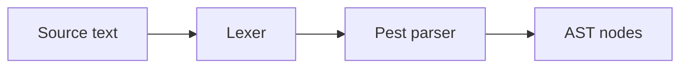
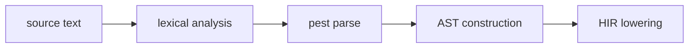

<!-- migrated from the legacy platform spec; canonical OpenSpec source -->
# Lexical and syntax Specification

## Purpose

This specification defines tokens, whitespace, and the context-free skeleton. Every later phase assumes this skeleton. The normative grammar and lexical rules live in the Language Spec. This page records the platform ownership.

## Requirements

### Requirement: Authoritative pest grammar
Implementations SHALL treat the checked-in grammar `compiler/crates/beskid_analysis/src/beskid.pest` as the single syntactic truth. A tool claiming Beskid L0 conformance MUST accept the same token stream as `beskid.pest` for all inputs in the reference parser test corpus.

#### Scenario: L0 token-stream agreement
- **GIVEN** a source file from the reference parser test corpus
- **WHEN** an L0-conformant tool tokenizes and parses the file
- **THEN** the token stream matches the stream produced by `beskid.pest`

### Requirement: Identifier and keyword lexical rules
Identifiers MUST match the `Identifier` production (ASCII letter or `_` followed by alphanumeric/`_` characters) and MUST NOT spell a reserved `Keyword`. Reserved keywords, including DI tokens such as `host`, `registry`, `scope`, `launch`, and `inject`, MUST be tokenized as keywords even when unused in a given compilation unit.

#### Scenario: Keyword rejected as identifier
- **GIVEN** source that uses a reserved keyword as a binding name
- **WHEN** the lexer and parser process the input
- **THEN** the name is not accepted as an `Identifier`

### Requirement: Documentation comment lexical form
`///` on items begins a documentation run attached only via `ItemWithDocs`. `////` and longer slash runs MUST NOT be treated as documentation. Ordinary `//` line comments (not starting a third `/`) and `/* ... */` block comments (nesting by terminator only) remain non-documentation comments.

#### Scenario: Four-slash run is not documentation
- **GIVEN** a line starting with `////` immediately before an item
- **WHEN** documentation attachment runs
- **THEN** the line is not attached as a documentation comment for that item

### Requirement: Parse validity does not imply semantic validity
Lexical and syntactic validity MUST NOT be treated as semantic validity. Phases after parsing MUST reject programs that parse but violate module, type, or contract rules. Parse failures MUST surface as parser diagnostics; early structural issues discovered during HIR construction use diagnostic codes **E1151–E1154**.

#### Scenario: Well-formed syntax with semantic violation
- **GIVEN** a program that parses successfully but violates a module, type, or contract rule
- **WHEN** semantic analysis runs
- **THEN** the program is rejected by a post-parse phase and is not accepted solely because parsing succeeded

## Informative Source Provenance

The records below preserve migration history. They are not normative except where text was extracted into a requirement above.

### Source Record: Lexical and syntax

**Authority:** informative provenance  
**Legacy path:** `/platform-spec/language-meta/surface-syntax/lexical-and-syntax/`  
**Source:** `site/spec-content/platform-spec/language-meta/surface-syntax/lexical-and-syntax/content.md`  
**SHA-256:** `03f378270b4e00bbc30901b7399c81f114e847d2745ff2a814d2bfc42bf412c1`

<details>
<summary>Migrated source text</summary>

``````markdown
## Normative specification

### Scope

This chapter defines **lexical structure** and the **context-free program skeleton** for Beskid v0.1. The authoritative grammar is `compiler/crates/beskid_analysis/src/beskid.pest`; this page states language-law constraints implementations **must** share across parser, formatter, and LSP.

### Lexical rules

- **Whitespace** (` `, tab, CR, LF) is insignificant except as a separator; it **must not** appear inside tokens unless the grammar allows it.
- **Identifiers** **must** match `Identifier`: ASCII letter or `_` followed by alphanumeric/`_` characters, and **must not** spell a reserved **Keyword** (see grammar `Keyword` production).
- **Integer** and **float** literals **must** follow the pest productions; there is no implicit radix or suffix form in v0.1.
- **String** literals support `"..."` with escapes `\"`, `\\`, `\\${`, and `${ expression }` interpolation. Interpolation expressions **must** be valid `Expression` subtrees.
- **Char** literals use single quotes with `\'` escape.
- **Comments:**
  - `//` line comments (not starting a third `/`) are ordinary comments.
  - `///` on items begins a **documentation run** (see [Documentation comments](/platform-spec/language-meta/surface-syntax/documentation-comments/)); `////` and longer slash runs are **not** documentation.
  - `/* ... */` block comments nest by terminator only (no nesting of `/*`).

### Program structure

- A **compilation unit** is `Program = ItemList` terminated by end of input.
- Top-level items **must** be one of: `host`, `macro`, function, `impl`, `extend type`, `type`, `enum`, `contract`, `test`, `attribute`, inline `mod`, `mod` declaration, or `use`.
- **Keywords** reserved for DI (`host`, `registry`, `scope`, `launch`, `inject`, …) **must** be tokenized as keywords even when not yet used in a given compilation unit.

### Static rules (syntax-only)

- Generic parameter lists use angle brackets: `<T, U>`.
- Type syntax order of precedence: `ArrowFunctionType` before `FunctionType` before `T[]` before `TypeName`.
- `mut` **must** prefix the type in `TypedLetStatement` and `Parameter`, or follow `let` in `InferredLetStatement` (`let mut name = expr`).
- `match`, `if`/`else`, `while`, `for … in`, `with`, and `launch` statements **must** parse as `Statement` productions; malformed nesting is a parse error, not a semantic error.

### Dynamic semantics

Lexical and syntactic validity **does not** imply semantic validity. Phases after parsing **must** reject programs that parse but violate module, type, or contract rules.

### Diagnostics

Parse failures **must** surface as parser diagnostics (no stable `E####` band in v0.1). Early structural issues discovered during HIR construction use **E1151–E1154**. See [Diagnostic code registry](/platform-spec/compiler/semantic-pipeline/diagnostic-code-registry/).

### Conformance

A tool claiming Beskid **L0** conformance **must** accept the same token stream as `beskid.pest` for all inputs in the reference parser test corpus.

## Decisions
<!-- spec:generate:adr-index -->
No ADRs published under **`adr/`** yet.
<!-- /spec:generate:adr-index -->
## Articles
<!-- spec:generate:article-index -->
- [Lexical and syntax - Contracts and edge cases](./articles/contracts-and-edge-cases/)
- [Lexical and syntax - Design model](./articles/design-model/)
- [Lexical and syntax - Examples](./articles/examples/)
- [Lexical and syntax - FAQ and troubleshooting](./articles/faq-and-troubleshooting/)
- [Lexical and syntax - Flow and algorithm](./articles/flow-and-algorithm/)
- [Lexical and syntax - Verification and traceability](./articles/verification-and-traceability/)
<!-- /spec:generate:article-index -->
``````

</details>

### Source Record: Lexical and syntax - Contracts and edge cases

**Authority:** informative provenance  
**Legacy path:** `/platform-spec/language-meta/surface-syntax/lexical-and-syntax/articles/contracts-and-edge-cases/`  
**Source:** `site/spec-content/platform-spec/language-meta/surface-syntax/lexical-and-syntax/articles/contracts-and-edge-cases/content.md`  
**SHA-256:** `874e2daaaf91a74f0052bc83a3b19a359eea639618a287dffc60ef10583b6694`

<details>
<summary>Migrated source text</summary>

``````markdown
## Hard requirements

- **Pest as grammar source** — The checked-in pest file is the single syntactic truth.
- **`///` documentation** — Triple-slash doc lines attach only via `ItemWithDocs`; four-or-more slashes are never doc comments.
- **Reserved async/await** — Tokens exist for forward compatibility; semantic use is forbidden.

## Diagnostic band E11xx

| Code | Condition |
| --- | --- |
| **E1151** | Invalid HIR span |
| **E1152** | Unresolved HIR value path |
| **E1153** | Unresolved HIR type path |
| **E1154** | Non-normalized HIR control flow |

## Edge cases

- **Empty file** — A file with no items is valid; it produces an empty `Program`.
- **BOM** — UTF-8 BOM at file start is accepted and skipped.
- **Invalid escape** — Unrecognized string escapes are parse errors.
- **Unclosed string** — Missing closing quote is a parse error.
- **Keyword as identifier** — Reserved keywords cannot be used as identifiers unless escaped (not supported in v0.1).

## Invariants

- Lexical and syntactic validity does not imply semantic validity.
- Phases after parsing must reject programs that parse but violate module, type, or contract rules.
- A tool claiming L0 conformance must accept the same token stream as `beskid.pest`.
``````

</details>

### Source Record: Lexical and syntax - Design model

**Authority:** informative provenance  
**Legacy path:** `/platform-spec/language-meta/surface-syntax/lexical-and-syntax/articles/design-model/`  
**Source:** `site/spec-content/platform-spec/language-meta/surface-syntax/lexical-and-syntax/articles/design-model/content.md`  
**SHA-256:** `bf00bc03e4006e2bf21d293fd00b283a3640c3c4d965707adf021aa3b424c280`

<details>
<summary>Migrated source text</summary>

``````markdown
## Vocabulary

| Construct | Role |
| --- | --- |
| **`beskid.pest`** | Authoritative grammar file (single syntactic truth) |
| **`Identifier`** | ASCII letter or `_` followed by alphanumeric/`_` |
| **`Keyword`** | Reserved tokens (for example `type`, `enum`, `if`, `host`) |
| **`Literal`** | Integer, float, string, char, or **`code`** fenced literal |

## Lexical architecture

The lexical layer tokenizes source text into a stream consumed by the pest parser. All later phases assume the token boundaries defined here.



### Subsystem boundaries

| Subsystem | Responsibility | Key file |
| --- | --- | --- |
| Lexer | Tokenize source | `beskid.pest` (implicit via pest) |
| Parser | Build AST from tokens | `parser.rs`, `parsing/parsable.rs` |
| AST | Store syntax structure | `syntax/` directory |
| Formatter | Pretty-print from AST | `format/` directory |

## Lexical rules

- Whitespace is insignificant except as a separator.
- Identifiers must match `Identifier` production and must not spell a reserved `Keyword`.
- Integer and float literals follow pest productions; no implicit radix or suffix.
- String literals support `"..."` with escapes `\"`, `\\`, `\${`, and `${ expression }` interpolation.
- **`code`** literals use markdown-style fences: `code ```lang` newline body closing `` ``` `` on its own line. Default language tag is **`beskid`**. Non-`beskid` tags store body text verbatim (no parse, no `@{}` evaluation). In **`beskid`** bodies, **`@{ expression }`** holes are Beskid expressions evaluated at **mod generate time** by the host (distinct from runtime `${ expression }` string interpolation).
- Char literals use single quotes with `\'` escape.
- `//` line comments (not starting a third `/`) are ordinary comments.
- `///` on items begins a documentation run; `////` and longer are not documentation.
- `/* ... */` block comments nest by terminator only.

## Program structure

A compilation unit is `Program = ItemList` terminated by end of input. Top-level items must be one of: `host`, `macro`, function, `impl`, `extend type`, `type`, `enum`, `contract`, `test`, `attribute`, inline `mod`, `mod` declaration, or `use`.
``````

</details>

### Source Record: Lexical and syntax - Examples

**Authority:** informative provenance  
**Legacy path:** `/platform-spec/language-meta/surface-syntax/lexical-and-syntax/articles/examples/`  
**Source:** `site/spec-content/platform-spec/language-meta/surface-syntax/lexical-and-syntax/articles/examples/content.md`  
**SHA-256:** `fdd44d5e4d0691b721b3faf54e3163e4e2d30423901b663c6521c9138f0d1aa3`

<details>
<summary>Migrated source text</summary>

``````markdown
## Identifiers

```beskid
unit ValidIdentifiers() {
    let foo = 1;
    let _bar = 2;
    let baz123 = 3;
}
```

## Literals

```beskid
unit Literals() {
    let n = 42;
    let f = 3.14;
    let s = "hello";
    let c = 'a';
    let interpolated = "value = ${n}";
}
```

## Comments

```beskid
// This is an ordinary comment

/// This is a documentation comment
unit Documented() { }

//// This is NOT a documentation comment
```

## Generic syntax

```beskid
type Box<T> {
    T value;
}

unit UseGeneric() {
    let b = Box<i32> { value = 42 };
}
```

## Type precedence

```beskid
unit TypePrecedence() {
    // ref (T[]) — ref applies to array
    let arr = ref i32[] {};
}
```
``````

</details>

### Source Record: Lexical and syntax - FAQ and troubleshooting

**Authority:** informative provenance  
**Legacy path:** `/platform-spec/language-meta/surface-syntax/lexical-and-syntax/articles/faq-and-troubleshooting/`  
**Source:** `site/spec-content/platform-spec/language-meta/surface-syntax/lexical-and-syntax/articles/faq-and-troubleshooting/content.md`  
**SHA-256:** `0ead75277da7c2077d2fe1a2a966539b823eea6032c51bf4a5b5956a4d14e37c`

<details>
<summary>Migrated source text</summary>

``````markdown
## Locked decisions

| Decision | ID | Summary |
| --- | --- | --- |
| Pest as grammar source | D-LM-LEX-001 | Checked-in pest file is single syntactic truth |
| `///` documentation | D-LM-LEX-002 | Triple-slash only; four+ slashes never doc |
| Reserved async/await | D-LM-LEX-003 | Tokens exist; semantic use forbidden |

## FAQ

### Can I use a keyword as an identifier?

No. Reserved keywords cannot be used as identifiers in v0.1.

### Does Beskid support raw string literals?

No. String literals use `"..."` with standard escapes only.

### What is the difference between `//` and `///`?

`//` is an ordinary comment. `///` is a documentation comment attached to the following item.

## Troubleshooting

| Symptom | Likely cause |
| --- | --- |
| Parse error | Syntax does not match `beskid.pest` |
| Invalid identifier | Name spells a reserved keyword |
| Unclosed string | Missing closing `"` or `'` |
| Invalid escape | Unrecognized escape sequence |
| Doc not attached | `///` not immediately before item |
``````

</details>

### Source Record: Lexical and syntax - Flow and algorithm

**Authority:** informative provenance  
**Legacy path:** `/platform-spec/language-meta/surface-syntax/lexical-and-syntax/articles/flow-and-algorithm/`  
**Source:** `site/spec-content/platform-spec/language-meta/surface-syntax/lexical-and-syntax/articles/flow-and-algorithm/content.md`  
**SHA-256:** `2ec4155bf6cbdd89680954946b64e2b6c17c48ae6a929ac5cb4db7217ec69d0d`

<details>
<summary>Migrated source text</summary>

``````markdown
## Compile pipeline placement



## Parsing algorithm (normative)

1. **Read source** — Load source text from file or editor buffer.
2. **Tokenize** — Pest grammar `beskid.pest` drives implicit tokenization.
3. **Parse program** — `Program = ItemList` matches top-level items.
4. **Construct AST** — Each pest rule maps to an AST node via `Parsable` trait implementations.
5. **Attach spans** — Every AST node carries a `SpanInfo` for diagnostic reporting.
6. **Attach docs** — Leading `///` runs are attached to items via `ItemWithDocs` wrappers.
7. **Report parse errors** — Malformed input emits parser diagnostics (no stable `E####` band in v0.1).
8. **Early structural checks** — HIR construction discovers issues like invalid nesting; **E1151–E1154**.

## Type syntax precedence

Type syntax order of precedence (highest to lowest):
1. `ArrowFunctionType`
2. `FunctionType`
3. `T[]`
4. `TypeName`

## Generic parameter lists

Use angle brackets: `<T, U>`. Generic parameters shadow type names in signature scope only.

## LSP / incremental

Re-parse when source text changes. Incremental parsing may be optimized by tracking changed regions.
``````

</details>

### Source Record: Lexical and syntax - Verification and traceability

**Authority:** informative provenance  
**Legacy path:** `/platform-spec/language-meta/surface-syntax/lexical-and-syntax/articles/verification-and-traceability/`  
**Source:** `site/spec-content/platform-spec/language-meta/surface-syntax/lexical-and-syntax/articles/verification-and-traceability/content.md`  
**SHA-256:** `98c65b2d5f26ef523543b28058f784316e2512b393b9ee6d0c34183324a1552e`

<details>
<summary>Migrated source text</summary>

``````markdown
## Verification matrix

| Scenario | Expected evidence |
| --- | --- |
| Identifier parsing | Matches `Identifier` production |
| Keyword rejection | Reserved keywords rejected as identifiers |
| String literal | Escapes and interpolation parsed correctly |
| Char literal | Single quote with escape parsed |
| Comment handling | `//`, `///`, `/* */` handled correctly |
| Empty program | Parses to empty `Program` |

## Implementation checklist

- [x] Grammar: `beskid.pest` with all lexical and syntactic productions
- [x] Parser: `parser.rs` driving pest
- [x] AST: all syntax nodes implement `Parsable`
- [x] Span attachment: every node carries `SpanInfo`
- [x] Doc attachment: `ItemWithDocs` wrappers
- [x] Diagnostics: **E1151–E1154** for early structural issues
- [ ] Incremental parsing optimization
- [ ] Parser error recovery for LSP

## Test locations

- `compiler/crates/beskid_analysis/src/beskid.pest` — grammar definition
- `compiler/crates/beskid_analysis/src/parser.rs` — parser tests
- `compiler/crates/beskid_analysis/src/syntax/` — AST node tests
- `compiler/crates/beskid_tests` — integration tests for parsing
``````

</details>
