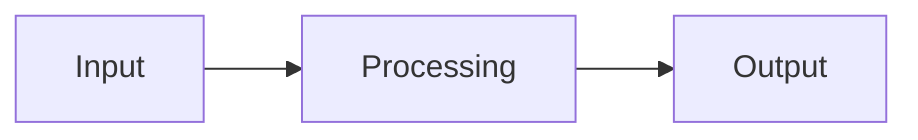

<!-- migrated from the legacy platform spec; canonical OpenSpec source -->
# Enums and match Specification

## Purpose

Algebraic enums and exhaustive `match` tie data representation to control flow. Lowering must preserve discriminant layout described in Execution where relevant.

## Requirements

### Requirement: Enums and match conformance status
This capability SHALL remain non-conformant and MUST NOT be cited as an implemented Beskid guarantee until a validated OpenSpec change adds explicit behavioral requirements.

**Stable ID:** `BSP-REQ-31A4E0CC80AB`

#### Scenario: Capability has descriptive material only
- **GIVEN** the migrated sources contain no uppercase BCP-14 obligation or accepted ADR decision
- **WHEN** an implementation reports Beskid conformance
- **THEN** it MUST NOT claim conformance based on this capability

## Informative Source Provenance

The records below preserve migration history and are not normative except where text was extracted into a requirement above.

### Source Record: Enums and match

**Authority:** informative provenance  
**Legacy path:** `/platform-spec/language-meta/type-system/enums-and-match/`  
**Source:** `site/spec-content/platform-spec/language-meta/type-system/enums-and-match/content.md`  
**SHA-256:** `b2b554463fa97d2aae44bcb188a3f0a5b0da4934938f51c7c3410e3f03d03421`

<details>
<summary>Migrated source text</summary>

``````markdown
## Normative specification

### Scope

Defines **`enum` declarations**, **constructors**, **`match` expressions**, and **patterns**. Type rules integrate with [Types](/platform-spec/language-meta/type-system/types/) and [Control flow](/platform-spec/language-meta/evaluation/control-flow/).

### Enum declarations

- **`enum Name<G…> { variants }`** introduces a nominal sum type.
- Variants **may** be nullary (`Ok`) or carry fields (`Err(message: string)`).
- Duplicate variant names **must** error (**E1002**).

### Constructors and use

- **Qualified** construction **`Enum.Variant`** or **`Enum.Variant(args)`** is required when the enum type is not inferred from context (**E1303** if unqualified where ambiguous).
- For **nullary** variants (no declared fields), parentheses **may** be omitted: **`Enum.Variant`** and **`Enum.Variant()`** are equivalent.
- For variants with fields, **`Enum.Variant(args)`** **must** include parentheses; constructor arity **must** match the variant field list (**E1302**, **E1307**).
- Enum types in expressions **must** resolve to a known enum (**E1301**).

### `match` expressions

- **`match scrutinee { arms }`** evaluates the scrutinee once, then selects the first arm whose **pattern** matches.
- Each arm **`pattern => expression`** **must** produce the same type; mismatches **must** error (**E1305**).
- **`when guard`** on an arm **must** be `bool` (**E1308**).
- Patterns **may** be wildcard `_`, literals, identifiers (bind), or `Enum.Variant(subpatterns)`.
- **Exhaustiveness:** For enum scrutinees, arms **must** cover all variants or include `_`; non-exhaustive matches **must** error (**E1304**).

### Dynamic semantics

- Matching **must** bind pattern variables in the arm expression scope only.
- No fall-through between arms; order is significant for overlapping patterns (overlap **should** be rejected when detectable).

### Diagnostics

Enum/match band **E1301–E1308**. See [Diagnostic code registry](/platform-spec/compiler/semantic-pipeline/diagnostic-code-registry/).

### Conformance

**L2** implementations **must** agree with reference tests on arity, exhaustiveness, and arm typing.

## Decisions
<!-- spec:generate:adr-index -->
No ADRs published under **`adr/`** yet.
<!-- /spec:generate:adr-index -->
## Articles
<!-- spec:generate:article-index -->
_No articles in this bundle yet._
<!-- /spec:generate:article-index -->
``````

</details>

### Source Record: Enums and match - Contracts and edge cases

**Authority:** informative provenance  
**Legacy path:** `/platform-spec/language-meta/type-system/enums-and-match/articles/contracts-and-edge-cases/`  
**Source:** `site/spec-content/platform-spec/language-meta/type-system/enums-and-match/articles/contracts-and-edge-cases/content.md`  
**SHA-256:** `1a15919a9adbcaf100bf7c430f90716a4062bfe772e48cfe79bf5d5ee9a07184`

<details>
<summary>Migrated source text</summary>

``````markdown
## Hard requirements

The normative specification in the parent hub defines the hard requirements for this feature. This article documents edge cases and contract-level guarantees.

## Edge cases

Edge cases are documented as they are discovered during implementation. Key edge cases include:

- Interactions with other features that may produce unexpected results
- Boundary conditions at the limits of defined behavior
- Error paths and diagnostic conditions

## Invariants

The following invariants must hold across all implementations:

1. The normative specification takes precedence over implementation behavior
2. Diagnostic codes are registered in the diagnostic code registry and must not be reused
3. Conformance tests must pass at the declared conformance level

## Contract guarantees

Implementations must satisfy the contracts defined in the parent hub. Violations must be surfaced through the diagnostic system.
``````

</details>

### Source Record: Enums and match - Design model

**Authority:** informative provenance  
**Legacy path:** `/platform-spec/language-meta/type-system/enums-and-match/articles/design-model/`  
**Source:** `site/spec-content/platform-spec/language-meta/type-system/enums-and-match/articles/design-model/content.md`  
**SHA-256:** `0da081ba91e44037acef9c2dfaffd63f951486053ed8f4399006f6c385b46527`

<details>
<summary>Migrated source text</summary>

``````markdown
## Design overview

This article describes the conceptual model and design decisions behind the feature. The normative specification lives in the parent hub's `content.md`; this article expands on the rationale, subsystem boundaries, and architectural choices.

## Key design decisions

- Decision details are recorded as ADRs under the hub's `adr/` directory when formal record-keeping is needed.
- Design rationale here is informative; normative contract language lives in the parent hub specification.

## Subsystem boundaries

Refer to the parent feature hub (`content.md`) for the authoritative specification. This article provides supplementary design context.

## Related articles

- [Contracts and edge cases](../contracts-and-edge-cases/)
- [Verification and traceability](../verification-and-traceability/)
``````

</details>

### Source Record: Enums and match - Examples

**Authority:** informative provenance  
**Legacy path:** `/platform-spec/language-meta/type-system/enums-and-match/articles/examples/`  
**Source:** `site/spec-content/platform-spec/language-meta/type-system/enums-and-match/articles/examples/content.md`  
**SHA-256:** `405299e4d600d48fcff39eea51be09d260961c620f368dd8eb6edb409059d198`

<details>
<summary>Migrated source text</summary>

``````markdown
## Basic usage

```beskid
// TODO: Add basic usage example for this feature
```

## Common patterns

```beskid
// TODO: Add common usage patterns
```

## Edge case examples

```beskid
// TODO: Add edge case examples
```

> **Note:** Full code examples for this feature are being developed. See the parent hub for the normative specification.
``````

</details>

### Source Record: Enums and match - FAQ and troubleshooting

**Authority:** informative provenance  
**Legacy path:** `/platform-spec/language-meta/type-system/enums-and-match/articles/faq-and-troubleshooting/`  
**Source:** `site/spec-content/platform-spec/language-meta/type-system/enums-and-match/articles/faq-and-troubleshooting/content.md`  
**SHA-256:** `dde24ebd5d26dc827f59f630220de36bca6de9e2011451eb668102d4e02fae9d`

<details>
<summary>Migrated source text</summary>

``````markdown
## Frequently asked questions

### Is this feature stable?

The parent hub's `status` field indicates the maturity level. Articles marked `Proposed` are under active development.

### How does this interact with other features?

See the "Related articles" section in each article and the `related.json` files for cross-feature links.

### Where can I find implementation details?

Implementation anchors are listed in the parent hub's `content.md` under "Implementation anchors".

## Troubleshooting

### Diagnostic codes

Refer to the parent hub for feature-specific diagnostic codes. All codes are registered in the [Diagnostic code registry](/platform-spec/compiler/semantic-pipeline/diagnostic-code-registry/).

### Common errors

- **Spec violation:** If behavior contradicts the parent hub, the hub specification takes precedence.
- **Missing conformance:** If a test case is missing, add it to the `articles/verification-and-traceability/` article.
``````

</details>

### Source Record: Enums and match - Flow and algorithm

**Authority:** informative provenance  
**Legacy path:** `/platform-spec/language-meta/type-system/enums-and-match/articles/flow-and-algorithm/`  
**Source:** `site/spec-content/platform-spec/language-meta/type-system/enums-and-match/articles/flow-and-algorithm/content.md`  
**SHA-256:** `663aefb2d09538bf1f8ceb39266fb5339ab14ac5d6725aa91cb037b224df830b`

<details>
<summary>Migrated source text</summary>

``````markdown
## Processing steps

The normative algorithm for this feature is defined in the compiler implementation. This article provides an informative overview of the processing flow.

## Data flow



## Algorithm outline

1. Parse the relevant syntax from the source
2. Resolve names and types according to the rules in the parent hub
3. Lower to intermediate representation
4. Code generation

> **Note:** Detailed flow documentation is being developed. Refer to the compiler implementation for the authoritative algorithm.
``````

</details>

### Source Record: Enums and match - Verification and traceability

**Authority:** informative provenance  
**Legacy path:** `/platform-spec/language-meta/type-system/enums-and-match/articles/verification-and-traceability/`  
**Source:** `site/spec-content/platform-spec/language-meta/type-system/enums-and-match/articles/verification-and-traceability/content.md`  
**SHA-256:** `1767177f3a3965fa6c8bf268beae4da0911f920b215c6b35865a4153a0df4e47`

<details>
<summary>Migrated source text</summary>

``````markdown
## Conformance evidence

Conformance to this specification is verified through:

1. **Compiler test suite** — Unit and integration tests in the compiler workspace
2. **Corelib conformance** — Published corelib packages must conform to the specification
3. **End-to-end tests** — E2E tests validate the full pipeline

## Test coverage

Test coverage for this feature is tracked in the compiler's test suite. Key test areas include:

- Syntax validation
- Semantic analysis (type checking, name resolution)
- Code generation and lowering
- Runtime behavior

## Verification anchors

Implementation anchors are listed in the parent hub's `content.md` under "Implementation anchors".

## Traceability

Each normative statement in the parent hub should be traceable to:
- A test case in the compiler test suite
- An ADR documenting the decision
- A diagnostic code in the diagnostic registry
``````

</details>
