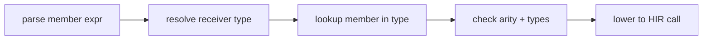
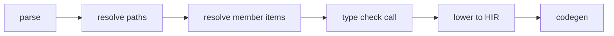

<!-- migrated from the legacy platform spec; canonical OpenSpec source -->
# Method dispatch Specification

## Purpose

Virtual dispatch, overload resolution, and receiver rules decide which code runs. Interop and codegen consume the same dispatch table model.

## Requirements

### Requirement: Method dispatch conformance status
This capability SHALL remain non-conformant and MUST NOT be cited as an implemented Beskid guarantee until a validated OpenSpec change adds explicit behavioral requirements.

**Stable ID:** `BSP-REQ-BB5F70413962`

#### Scenario: Capability has descriptive material only
- **GIVEN** the migrated sources contain no uppercase BCP-14 obligation or accepted ADR decision
- **WHEN** an implementation reports Beskid conformance
- **THEN** it MUST NOT claim conformance based on this capability

## Informative Source Provenance

The records below preserve migration history and are not normative except where text was extracted into a requirement above.

### Source Record: Method dispatch

**Authority:** informative provenance  
**Legacy path:** `/platform-spec/language-meta/type-system/method-dispatch/`  
**Source:** `site/spec-content/platform-spec/language-meta/type-system/method-dispatch/content.md`  
**SHA-256:** `b065db5c3de69d92ca842f1b7c32cb82854db9a08c442f7f2453fd67fc9595ac`

<details>
<summary>Migrated source text</summary>

``````markdown
## Normative specification

### Scope

Defines how **member access** (`receiver.method(args)`) and **free functions** resolve to callable targets. Type shapes come from [Types](/platform-spec/language-meta/type-system/types/); symbols from [Name resolution](/platform-spec/language-meta/program-structure/name-resolution/).

### Receivers and members

- **Instance calls** use postfix `.Identifier` after a **primary** expression that denotes a value type.
- The receiver’s **static type** **must** expose a callable member with matching name and signature, or the call **must** error (**E1101**, **E1213**).
- **`extend type`** members participate in the member set of the extended type with the same visibility rules as declared members.

### Overload resolution (v0.1)

- Overloading **must** be resolved by arity and argument types at the call site; there is no ad hoc ranking beyond signature match.
- Ambiguous overload sets **must** error rather than pick a candidate.
- **Contracts** used as namespaces (`Contract.method()`) follow resolver fallback for contract-as-namespace calls.

### `impl` blocks

- Legacy **`impl Receiver { … }`** blocks **may** still parse; new code **should** use **`extend type`** per [extend type](/platform-spec/language-meta/program-structure/extend-type/).
- Methods in `impl` / `extend type` **must** obey visibility and access rules of the target type.

### Dynamic semantics

- Dispatch is **static** in v0.1: the callee is known at compile time from the receiver’s static type (no virtual table polymorphism for user classes unless introduced by a future decision).
- Interop thunks **must** preserve the statically selected symbol through lowering.

### Diagnostics

Resolution **E1101**; type/call **E1204–E1205**; invalid member **E1213**. Registry: [Diagnostic code registry](/platform-spec/compiler/semantic-pipeline/diagnostic-code-registry/).

### Conformance

Call resolution tests in `beskid_analysis` **must** pass for **L2** claims.

## Decisions
<!-- spec:generate:adr-index -->
No ADRs published under **`adr/`** yet.
<!-- /spec:generate:adr-index -->
## Articles
<!-- spec:generate:article-index -->
- [Method dispatch - Contracts and edge cases](./articles/contracts-and-edge-cases/)
- [Method dispatch - Design model](./articles/design-model/)
- [Method dispatch - Examples](./articles/examples/)
- [Method dispatch - FAQ and troubleshooting](./articles/faq-and-troubleshooting/)
- [Method dispatch - Flow and algorithm](./articles/flow-and-algorithm/)
- [Method dispatch - Verification and traceability](./articles/verification-and-traceability/)
<!-- /spec:generate:article-index -->
``````

</details>

### Source Record: Method dispatch - Contracts and edge cases

**Authority:** informative provenance  
**Legacy path:** `/platform-spec/language-meta/type-system/method-dispatch/articles/contracts-and-edge-cases/`  
**Source:** `site/spec-content/platform-spec/language-meta/type-system/method-dispatch/articles/contracts-and-edge-cases/content.md`  
**SHA-256:** `8b6978cd2ff86ea473a7bad6b228c7481535bc87cedd8edeba07edd4dc427e9f`

<details>
<summary>Migrated source text</summary>

``````markdown
## Hard requirements

- **Static dispatch default** — v0.1 uses compile-time member selection; dynamic polymorphism is deferred.
- **Receiver static type** — Dispatch keys off the static type of the receiver expression, not runtime tags.
- **No `null` receiver** — Calls on possibly-absent values must use `Option<T>` and `match`, not null checks.
- **extend over impl** — `extend type` is the normative extension syntax; `impl` remains parse-compatible during migration.

## Diagnostic bands

| Code | Condition |
| --- | --- |
| **E1101** | Unknown value (includes unresolved method) |
| **E1107** | Private item access |
| **E1204** | Call arity mismatch |
| **E1205** | Call argument type mismatch |
| **E1213** | Invalid member access target |
| **E1511** | `extend type` private member access |

## Edge cases

- **Ambiguous overloads** — When two methods have the same name and compatible signatures, the compiler emits an error rather than picking one.
- **Receiver type unknown** — If the receiver type cannot be resolved, member lookup is skipped and **E1201** is emitted.
- **Contract method vs type method** — When a contract and a type both define the same method name, the type method wins for instance calls; contract namespace calls require explicit qualification.
- **Generic method on generic type** — `Type<T>.method<U>()` requires both type and method generic arguments to be resolved.

## Invariants

- Every member call in HIR must resolve to a single callable target after dispatch.
- `extend type` methods must obey the same visibility rules as declared methods.
- Codegen must preserve the statically selected symbol through lowering.
``````

</details>

### Source Record: Method dispatch - Design model

**Authority:** informative provenance  
**Legacy path:** `/platform-spec/language-meta/type-system/method-dispatch/articles/design-model/`  
**Source:** `site/spec-content/platform-spec/language-meta/type-system/method-dispatch/articles/design-model/content.md`  
**SHA-256:** `aab204a8e8a2c2efb68216174a37caa60bbe835ca15187951471514e0390f1d8`

<details>
<summary>Migrated source text</summary>

``````markdown
## Vocabulary

| Construct | Role |
| --- | --- |
| **`MemberExpression`** | Postfix `.Identifier` access on a receiver value |
| **`MethodDefinition`** | Callable member declared in `type` or `extend type` |
| **`ReceiverType`** | Static type of the expression before the dot |
| **`extend type`** | External member addition to an existing type |

## Dispatch architecture

Beskid v0.1 uses **static dispatch** — the callee is known at compile time from the receiver's static type. There is no virtual table polymorphism for user classes unless introduced by a future decision.



### Subsystem boundaries

| Subsystem | Responsibility | Key file |
| --- | --- | --- |
| Parser | Parse `receiver.method()` syntax | `syntax/expressions/member_expression.rs` |
| Resolver | Bind member names to definitions | `resolve/member_items.rs` |
| Type checker | Validate receiver type and argument types | `types/context/expressions.rs` |
| HIR lowering | Normalize to direct call | `hir/lowering/expressions.rs` |
| Codegen | Emit static call instruction | `beskid_codegen` |

## Receiver rules

- Instance calls use postfix `.Identifier` after a primary expression.
- The receiver's static type must expose a callable member with matching name and signature.
- `extend type` members participate in the member set with the same visibility rules as declared members.

## Overload resolution (v0.1)

Overloading is resolved by arity and argument types at the call site. There is no ad hoc ranking beyond signature match. Ambiguous overload sets emit **E1204** or **E1205** rather than picking a candidate.
``````

</details>

### Source Record: Method dispatch - Examples

**Authority:** informative provenance  
**Legacy path:** `/platform-spec/language-meta/type-system/method-dispatch/articles/examples/`  
**Source:** `site/spec-content/platform-spec/language-meta/type-system/method-dispatch/articles/examples/content.md`  
**SHA-256:** `8d0c824dae5e866afafad46bfe724baf31c46f681dbbb81be8039f62ff271a29`

<details>
<summary>Migrated source text</summary>

``````markdown
## Instance method call

```beskid
type Counter {
    i32 value;

    pub unit Increment() {
        value += 1;
    }
}

unit UseCounter() {
    let c = Counter { value = 0 };
    c.Increment();
}
```

## extend type

```beskid
type Point {
    f32 x;
    f32 y;
}

extend type Point {
    pub f32 DistanceTo(Point other) {
        let dx = x - other.x;
        let dy = y - other.y;
        return dx * dx + dy * dy;
    }
}

unit UseExtension() {
    let a = Point { x = 0.0, y = 0.0 };
    let b = Point { x = 3.0, y = 4.0 };
    let d = a.DistanceTo(b);
}
```

## Contract namespace call

```beskid
contract Math {
    i32 Abs(i32 value);
}

unit UseContractNamespace() {
    let n = Math.Abs(-5);   // static-style contract namespace call
}
```

## Generic method

```beskid
type Container<T> {
    T item;

    pub T Get() {
        return item;
    }
}

unit UseGeneric() {
    let c = Container<i32> { item = 42 };
    let v = c.Get();   // inferred return type: i32
}
```
``````

</details>

### Source Record: Method dispatch - FAQ and troubleshooting

**Authority:** informative provenance  
**Legacy path:** `/platform-spec/language-meta/type-system/method-dispatch/articles/faq-and-troubleshooting/`  
**Source:** `site/spec-content/platform-spec/language-meta/type-system/method-dispatch/articles/faq-and-troubleshooting/content.md`  
**SHA-256:** `2a20ceff530ca6485da09bf8b71723d30ddb663f61409770e3826aac6c63a8c5`

<details>
<summary>Migrated source text</summary>

``````markdown
## Locked decisions

| Decision | ID | Summary |
| --- | --- | --- |
| Static dispatch default | D-LM-DISP-001 | Compile-time member selection; no vtables in v0.1 |
| extend over impl | D-LM-DISP-002 | `extend type` is normative; `impl` parse-compatible |
| Receiver static type | D-LM-DISP-003 | Dispatch keys off static type, not runtime tags |
| No `null` receiver | D-LM-DISP-004 | Use `Option<T>` and `match` for absent values |

## FAQ

### Why no virtual dispatch in v0.1?

Static dispatch keeps the compiler and runtime simple. Dynamic polymorphism may be added in a future version with an explicit opt-in mechanism.

### Can I call a private method from `extend type`?

No. `extend type` may access public members only. `ExtendTypePrivateMemberAccess` (**E1511**) enforces this.

### What happens with method name collisions?

If two `extend type` blocks on the same type define the same method name, the compiler emits an ambiguity error.

## Troubleshooting

| Symptom | Likely cause |
| --- | --- |
| **E1101** | Method name typo or missing import |
| **E1107** | Accessing a private method from another module |
| **E1204** | Wrong number of arguments |
| **E1205** | Argument type does not match parameter |
| **E1511** | `extend type` accessing private member |
``````

</details>

### Source Record: Method dispatch - Flow and algorithm

**Authority:** informative provenance  
**Legacy path:** `/platform-spec/language-meta/type-system/method-dispatch/articles/flow-and-algorithm/`  
**Source:** `site/spec-content/platform-spec/language-meta/type-system/method-dispatch/articles/flow-and-algorithm/content.md`  
**SHA-256:** `dbdaa120669c49e4dd4765bbb278e2e9d111e8187f21c6af265a96ac4e0023f4`

<details>
<summary>Migrated source text</summary>

``````markdown
## Compile pipeline placement



## Member resolution algorithm (normative)

1. **Parse member expression** — `receiver.method(args)` becomes `MemberExpression` + `CallExpression`.
2. **Resolve receiver type** — Type-check the receiver expression to get its static type.
3. **Lookup member** — Search the type's member set (declared + `extend type`) for a matching name.
4. **Check visibility** — Verify the member is accessible from the call site; `ResolvePrivateItemInModule` (**E1107**) otherwise.
5. **Match signature** — Compare argument count and types against the method signature.
6. **Emit mismatch diagnostics** — `TypeCallArityMismatch` (**E1204**) or `TypeCallArgumentMismatch` (**E1205**) if arguments do not match.
7. **Lower to HIR** — Replace member call with a direct function call to the resolved method.

## `extend type` participation

`extend type` blocks add methods to the extended type's member set:
1. During definition collection, `extend type` methods are indexed under the target type.
2. Member lookup includes both declared and extended methods.
3. `ExtendTypePrivateMemberAccess` (**E1511**) prevents access to private members of the extended type from within `extend type`.

## Contract namespace calls

Contracts may be used as namespaces for static-style calls (`Contract.method()`). The resolver falls back to contract-as-namespace when a direct value binding is not found.

## LSP / incremental

Re-run member resolution when type definitions, `extend type` blocks, or method signatures change.
``````

</details>

### Source Record: Method dispatch - Verification and traceability

**Authority:** informative provenance  
**Legacy path:** `/platform-spec/language-meta/type-system/method-dispatch/articles/verification-and-traceability/`  
**Source:** `site/spec-content/platform-spec/language-meta/type-system/method-dispatch/articles/verification-and-traceability/content.md`  
**SHA-256:** `74c15f30b86fe0377116de8dd25b81cd51d565b2c0d4f6218670894715e3b5a2`

<details>
<summary>Migrated source text</summary>

``````markdown
## Verification matrix

| Scenario | Expected evidence |
| --- | --- |
| Instance method call | Resolves to declared method; compiles |
| `extend type` method | Included in member set; compiles |
| Private member access | **E1107** or **E1511** emitted |
| Arity mismatch | **E1204** emitted |
| Argument type mismatch | **E1205** emitted |
| Unknown member | **E1101** or **E1213** emitted |

## Implementation checklist

- [x] Grammar: member expressions, method definitions
- [x] AST: `MemberExpression`, `MethodDefinition`, `ExtendTypeDefinition`
- [x] Resolver: member item collection in `resolve/member_items.rs`
- [x] Type checker: call arity and argument checking
- [x] Visibility: private member rejection
- [x] Diagnostics: **E1101**, **E1107**, **E1204**, **E1205**, **E1213**, **E1511**
- [ ] Dynamic dispatch (deferred to post-v0.1)
- [ ] Virtual table lowering for interface calls

## Test locations

- `compiler/crates/beskid_analysis/src/resolve/member_items.rs` — member resolution tests
- `compiler/crates/beskid_analysis/src/types/context/expressions.rs` — call type checking tests
- `compiler/crates/beskid_tests` — integration tests for dispatch
``````

</details>
