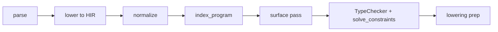
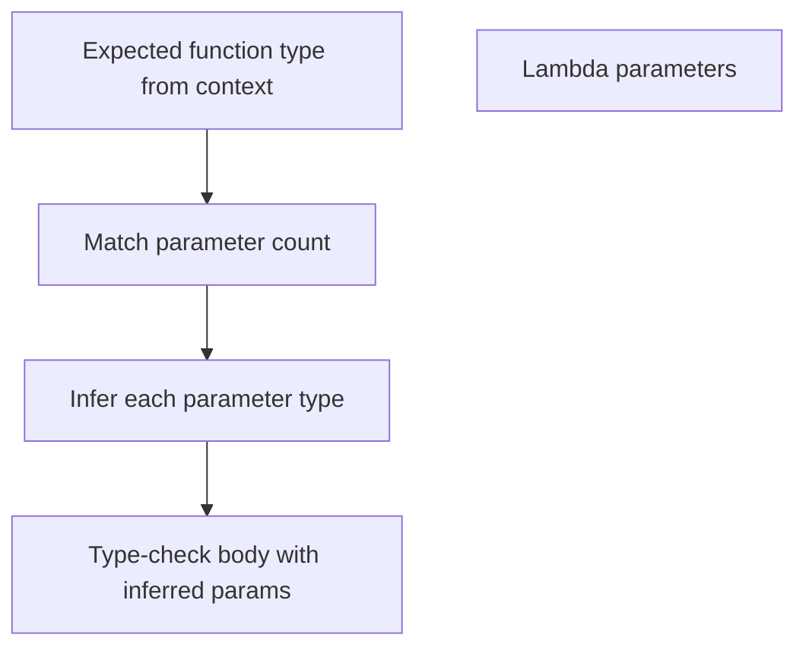

<!-- migrated from the legacy platform spec; canonical OpenSpec source -->
# Type inference Specification

## Purpose

Local type inference reduces annotation burden while keeping programs predictable. The inference algorithm is specified here; diagnostics reference these rules.

## Requirements

### Requirement: Type inference conformance status
This capability SHALL remain non-conformant and MUST NOT be cited as an implemented Beskid guarantee until a validated OpenSpec change adds explicit behavioral requirements.

**Stable ID:** `BSP-REQ-F1A011DD88CC`

#### Scenario: Capability has descriptive material only
- **GIVEN** the migrated sources contain no uppercase BCP-14 obligation or accepted ADR decision
- **WHEN** an implementation reports Beskid conformance
- **THEN** it MUST NOT claim conformance based on this capability

## Informative Source Provenance

The records below preserve migration history and are not normative except where text was extracted into a requirement above.

### Source Record: Type inference

**Authority:** informative provenance  
**Legacy path:** `/platform-spec/language-meta/type-system/type-inference/`  
**Source:** `site/spec-content/platform-spec/language-meta/type-system/type-inference/content.md`  
**SHA-256:** `9af8a0ee3cd9a3361a7f834f889dc0a1355ff4ec5de9a03c04d584e12111173e`

<details>
<summary>Migrated source text</summary>

``````markdown
## Normative specification

### Scope

Defines when types **must** be written explicitly and when the compiler **may** infer types from context. Ground rules for type expressions are in [Types](/platform-spec/language-meta/type-system/types/).

### Inference sites

- **`let name = expr`** (inferred let) **must** infer the variable type from `expr` when unambiguous.
- **`let T name = expr`** (typed let) **must** check `expr` against `T`; no inference of `T` from the initializer alone.
- **Function return types** on top-level functions **should** be explicit; when omitted, inference **may** use body yield rules; explicit annotation is **recommended** for public APIs.
- **Generic arguments** at call sites **may** be inferred from parameter types when a unique solution exists (**E1203** when missing).
- **Lambda** parameter types **may** be inferred from expected function type; untyped lambda parameters require contextual type (**E1202** when missing).

### Static rules

- Inference **must not** widen beyond the declared or inferred constraint (no implicit numeric promotion across unrelated primitives in v0.1).
- Ambiguous inference **must** error with **E1202** (missing annotation) rather than pick an arbitrary type.
- **Enum constructors** and **struct literals** **must** have sufficient context to resolve the target type or require explicit qualification.

### Dynamic semantics

Inference affects compile-time only; no runtime reflection of inferred types beyond debug metadata.

### Diagnostics

**E1202** missing annotation; **E1206** mismatch after inference. Registry: [Diagnostic code registry](/platform-spec/compiler/semantic-pipeline/diagnostic-code-registry/).

### Conformance

Reference compiler tests for `let` inference and generic call inference **must** pass for **L2** claims.

## Decisions
<!-- spec:generate:adr-index -->
No ADRs published under **`adr/`** yet.
<!-- /spec:generate:adr-index -->
## Articles
<!-- spec:generate:article-index -->
- [Type inference - Contracts and edge cases](./articles/contracts-and-edge-cases/)
- [Type inference - Design model](./articles/design-model/)
- [Type inference - Examples](./articles/examples/)
- [Type inference - FAQ and troubleshooting](./articles/faq-and-troubleshooting/)
- [Type inference - Flow and algorithm](./articles/flow-and-algorithm/)
- [Type inference - Verification and traceability](./articles/verification-and-traceability/)
<!-- /spec:generate:article-index -->
``````

</details>

### Source Record: Type inference - Contracts and edge cases

**Authority:** informative provenance  
**Legacy path:** `/platform-spec/language-meta/type-system/type-inference/articles/contracts-and-edge-cases/`  
**Source:** `site/spec-content/platform-spec/language-meta/type-system/type-inference/articles/contracts-and-edge-cases/content.md`  
**SHA-256:** `8c34504b3fe439a90161ad9d11683ef39ceccfaa098bb54b095248778a8fe3e2`

<details>
<summary>Migrated source text</summary>

``````markdown
## Hard requirements

- **Fail on ambiguity** — Prefer errors over guessing when multiple types satisfy constraints.
- **Public API annotations** — Exported functions should declare return types even when inference succeeds.
- **No nullable inference** — Inference must not introduce nullable or `optional` types; use `Option<T>` explicitly.
- **Contextual lambdas** — Untyped lambda parameters require an expected function type from the enclosing expression.

## Diagnostic band E12xx

| Code | Condition |
| --- | --- |
| **E1202** | Missing type annotation (ambiguous inference) |
| **E1203** | Missing generic type arguments |
| **E1206** | Type mismatch after inference |
| **W1203** | Implicit numeric cast detected |

## Edge cases

- **Enum constructor inference** — Enum constructors and struct literals must have sufficient context to resolve the target type or require explicit qualification.
- **Nested lambdas** — Inner lambdas may infer parameter types from the outer lambda's expected type.
- **Generic recursion** — Recursive generic calls may require explicit type arguments to break ambiguity.
- **Empty collections** — `[]` without context cannot infer element type; explicit annotation required.

## Invariants

- Every `let` binding must have a resolved type after `TypeChecker::finish` completes.
- Inference does not mutate HIR; solved types are recorded in `TypeResult.node_types` and `TypeResult.local_types`.
- Re-inference on incremental edits must produce the same result as full compilation for unchanged sites.
``````

</details>

### Source Record: Type inference - Design model

**Authority:** informative provenance  
**Legacy path:** `/platform-spec/language-meta/type-system/type-inference/articles/design-model/`  
**Source:** `site/spec-content/platform-spec/language-meta/type-system/type-inference/articles/design-model/content.md`  
**SHA-256:** `c3dd212f40c100ce6c67832b0f57b46a4d256d7ec3e0167b89a6e5d9fc177ed9`

<details>
<summary>Migrated source text</summary>

``````markdown
## Vocabulary

| Construct | Role |
| --- | --- |
| **`TypedLet`** | `let name = expr` where the variable type is inferred from the initializer |
| **`ExplicitLet`** | `let T name = expr` where the type is written by the author |
| **`TypeVar`** | Inference metavariable introduced during body typing |
| **`ConstraintSet`** | Collected equality and kind constraints for one inference site |
| **`InferenceResult`** | Solved `TypeVar → TypeId` bindings from the constraint solver |
| **`TypeChecker`** | Body typing pass that records `node_types` and emits constraints |

## Inference architecture

Type inference in Beskid is **local and constraint-driven**, not global Hindley-Milner. The [`TypeChecker`](compiler/crates/beskid_analysis/src/types/checker.rs) collects constraints at specific sites; [`solve_constraints`](compiler/crates/beskid_analysis/src/types/inference/solve.rs) resolves metavariables against a read-only [`TypeEnv`](compiler/crates/beskid_analysis/src/types/inference/mod.rs) backed by the hash-consed `TypeTable`.


Inference runs inside the **check** sub-pass of **`lower.type_check`**, after per-unit surfaces are built and merged. It is separate from **lowering prep**, which records codegen metadata on an already-typed tree.

### Constraint vocabulary

| Constraint | Typical source |
| --- | --- |
| `Equal(var, ty)` | `let x = expr`, parameter against contextual expected type |
| `EqualVar(left, right)` | Two metavariables that must unify |
| `ApplyGeneric(item, args)` | Call sites and qualified type paths with omitted generic arguments |
| `IsNumeric(var)` | Binary operators and compound assignment |
| `VariantOf(var, enum, variant)` | `?` desugar sites and enum constructor expressions |

The reference implementation lives in [`types/inference/`](compiler/crates/beskid_analysis/src/types/inference/). Numeric promotion follows the shared [`unify_types`](compiler/crates/beskid_analysis/src/types/inference/unify.rs) rule — there is no wider implicit coercion beyond that rule in v0.1.

### Inference sites

1. **`let name = expr`** — Introduce a `TypeVar` for the binding; constrain it to the initializer type when unambiguous.
2. **Function return types** — When omitted, inference may use body yield rules; explicit annotation is recommended for public APIs.
3. **Generic arguments at call sites** — Propagate constraints from actual argument types to generic parameters; apply when a unique substitution exists.
4. **Lambda parameters** — Inferred from expected function type; untyped parameters require contextual type.

### Subsystem boundaries

| Subsystem | Responsibility | Key file |
| --- | --- | --- |
| Parser | Distinguish `let` from typed `let` | `beskid.pest` |
| AST | Store binding shapes | `syntax/expressions/` |
| Type checker | Walk bodies; collect constraints; write `node_types` | `types/checker.rs` |
| Inference | Solve constraint sets | `types/inference/{constraint,solve,unify}.rs` |
| Semantic rules | Emit ambiguity errors | `analysis/rules/staged/type_checking.rs` |

## Fail-on-ambiguity model

When multiple types satisfy a constraint set, or a metavariable marked `must_resolve` remains unbound after solving, [`solve_constraints`](compiler/crates/beskid_analysis/src/types/inference/solve.rs) emits `TypeError::MissingTypeAnnotation` — surfaced as **E1202** at the inference site rather than guessing. This is locked by decision **D-LM-INF-001**.

The solver **must not** pick an arbitrary default type for unannotated bindings. Ambiguity includes: two satisfiable numeric types with no contextual tie-break, generic call sites with no unique substitution, and lambdas without an expected function type.

## No implicit widening

Inference does not widen beyond declared or inferred constraints. There is no implicit numeric promotion across unrelated primitives in v0.1. `TypeImplicitNumericCast` (**W1203**) warns when a narrowing cast is detected. The only shared numeric unification is the explicit rule in `types/inference/unify.rs`.
``````

</details>

### Source Record: Type inference - Examples

**Authority:** informative provenance  
**Legacy path:** `/platform-spec/language-meta/type-system/type-inference/articles/examples/`  
**Source:** `site/spec-content/platform-spec/language-meta/type-system/type-inference/articles/examples/content.md`  
**SHA-256:** `7ab8ed9c3ace874c60d78f2759d3e78f99a754b48f9b161f18b9b687d94fdbd4`

<details>
<summary>Migrated source text</summary>

``````markdown
## Inferred let

```beskid
unit Inferred() {
    let x = 42;        // inferred: i32
    let y = "hello";   // inferred: string
    let z = true;      // inferred: bool
}
```

## Typed let

```beskid
unit Explicit() {
    let i64 big = 42;
    let string name = "hello";
}
```

## Lambda inference

```beskid
unit Lambdas() {
    // Context from function parameter type
    let add = (a, b) => a + b;   // inferred: (i32, i32) => i32 from context

    // Explicit lambda parameter types when no context
    let mul = (i32 a, i32 b) => a * b;
}
```

## Generic inference

```beskid
type Box<T> {
    T value;
}

unit Generics() {
    let b = Box { value = 42 };   // inferred: Box<i32>
}
```

## Ambiguous inference (error)

```beskid
unit Ambiguous() {
    // let empty = [];   // E1202 — cannot infer element type
    let i32[] empty = [];   // OK — explicit annotation
}
```
``````

</details>

### Source Record: Type inference - FAQ and troubleshooting

**Authority:** informative provenance  
**Legacy path:** `/platform-spec/language-meta/type-system/type-inference/articles/faq-and-troubleshooting/`  
**Source:** `site/spec-content/platform-spec/language-meta/type-system/type-inference/articles/faq-and-troubleshooting/content.md`  
**SHA-256:** `2d90e8dabaf08512e4965feb60177029a865c17fb36d43d39ff0c20b1c5aabaa`

<details>
<summary>Migrated source text</summary>

``````markdown
## Locked decisions

| Decision | ID | Summary |
| --- | --- | --- |
| Fail on ambiguity | D-LM-INF-001 | Prefer errors over guessing |
| Public API annotations | D-LM-INF-002 | Exported functions should declare return types |
| No nullable inference | D-LM-INF-003 | Inference must not introduce nullable types |
| Contextual lambdas | D-LM-INF-004 | Untyped parameters need expected function type |

## FAQ

### Why does `let x = []` fail?

The compiler cannot infer the element type of an empty array without context. Add an explicit type: `let i32[] x = [];`.

### Do I need to annotate every variable?

No. Simple literals and expressions with unambiguous types infer automatically. Annotate when the type is not obvious from the initializer.

### Can inference fail across function boundaries?

Return type inference works within a single function body. Cross-function inference is not supported; function signatures must be self-contained.

## Troubleshooting

| Symptom | Likely cause |
| --- | --- |
| **E1202** | Ambiguous type — add explicit annotation |
| **E1203** | Missing generic arguments at call site |
| **W1203** | Implicit numeric narrowing — add explicit cast |
| Lambda parameter error | No expected function type in context |
``````

</details>

### Source Record: Type inference - Flow and algorithm

**Authority:** informative provenance  
**Legacy path:** `/platform-spec/language-meta/type-system/type-inference/articles/flow-and-algorithm/`  
**Source:** `site/spec-content/platform-spec/language-meta/type-system/type-inference/articles/flow-and-algorithm/content.md`  
**SHA-256:** `2f46d494cfaa1f3b6da93f026efb039e221ec1f5ce47d0f7e2b38cf8ae80c02c`

<details>
<summary>Migrated source text</summary>

``````markdown
## Compile pipeline placement

Type inference runs inside the **check** sub-pass of **`lower.type_check`**, after `index_program` and the surface pass, and before lowering prep:



Entry point: [`TypeChecker::check_entry`](compiler/crates/beskid_analysis/src/types/checker/entry.rs), orchestrated from [`type_check_lowered_hir`](compiler/crates/beskid_analysis/src/services/lower.rs) under phase id **`lower.type_check`**.

## Constraint-driven inference (normative)

Inference is **local and constraint-driven**, not global Hindley-Milner. During the check pass:

1. **Collect inference sites** — Walk HIR bodies and identify `let` bindings, lambda parameters, and generic call sites without explicit types.
2. **Emit constraints** — For each site, push `Equal`, `EqualVar`, `ApplyGeneric`, `IsNumeric`, or `VariantOf` constraints into a `ConstraintSet` on the active `TypeChecker`.
3. **Record provisional types** — Write `node_types[HirNodeId]` and `local_types[LocalId]` as expressions are walked.
4. **Solve at finish** — `TypeChecker::finish` calls [`solve_constraints`](compiler/crates/beskid_analysis/src/types/inference/solve.rs) against a read-only `TypeEnv` backed by the hash-consed `TypeTable`.
5. **Emit ambiguity errors** — If multiple types satisfy constraints, emit **E1202** at the binding site.

## Lambda parameter inference



- The expected function type comes from `contextual_expected_type` on the enclosing `TypeChecker` (for example, a function argument position).
- If the lambda has `n` parameters and the expected type has `n` argument types, each parameter is bound to the corresponding argument type.
- If no expected type exists, untyped lambda parameters require explicit annotations or emit **E1202**.

## Generic call-site inference

When generic arguments are omitted at a call site:
1. Collect the types of the actual arguments.
2. Match them against the generic parameter constraints in the callee signature via `ApplyGeneric` constraints.
3. If a unique substitution exists, apply it during `solve_constraints`.
4. If ambiguous or missing, emit **E1203** or **E1204**.

## Return type inference

For functions without an explicit return type annotation:
1. Type-check the body with `current_return_type` unset.
2. If the body ends with an expression, use that expression's type as the inferred return type.
3. If the body ends with statements only, default to `unit`.
4. Public API functions should declare return types explicitly even when inference succeeds.
``````

</details>

### Source Record: Type inference - Verification and traceability

**Authority:** informative provenance  
**Legacy path:** `/platform-spec/language-meta/type-system/type-inference/articles/verification-and-traceability/`  
**Source:** `site/spec-content/platform-spec/language-meta/type-system/type-inference/articles/verification-and-traceability/content.md`  
**SHA-256:** `bc293ca9f275ff4f7d0eca25bb04ecdd8b78faabcef8365ef61bc24718496541`

<details>
<summary>Migrated source text</summary>

``````markdown
## Verification matrix

| Scenario | Expected evidence |
| --- | --- |
| `let x = 42` | Inferred as `i32`; no diagnostic |
| `let x = []` | **E1202** emitted |
| Lambda with context | Parameters inferred from expected function type |
| Lambda without context | **E1202** if parameters lack types |
| Generic call omission | Arguments inferred from parameter types |
| Public function without return type | Warning or recommendation to annotate |

## Implementation checklist

- [x] Grammar: `let` with and without type annotation
- [x] AST: `TypedLet` vs `ExplicitLet` distinction
- [x] Type context: `try_infer.rs` local inference
- [x] Lambda parameter inference from expected type
- [x] Generic call-site argument inference
- [x] Diagnostics: **E1202**, **E1203**, **W1203**
- [ ] Return type inference for all function forms
- [ ] Enum constructor context inference
- [ ] Integration tests for nested lambda inference

## Test locations

- `compiler/crates/beskid_analysis/src/types/context/try_infer.rs` — inference unit tests
- `compiler/crates/beskid_analysis/src/types/context/expressions.rs` — expression typing tests
- `compiler/crates/beskid_tests` — integration tests for inference scenarios
``````

</details>
