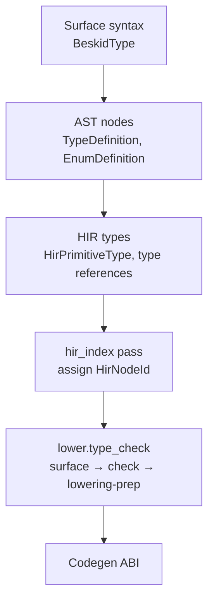

<!-- migrated from the legacy platform spec; canonical OpenSpec source -->
# Types Specification

## Purpose

This specification defines the type grammar. The grammar covers nominal types, generics, and `Option T`. The grammar is the backbone of static checking. All analysis phases share these definitions.

## Requirements

### Requirement: Type expression grammar
A type expression (`BeskidType`) MUST be exactly one of: a primitive (`bool`, `i32`, `i64`, `u8`, `f64`, `char`, `string`, `unit`); a named `Path` with optional `GenericArguments`; an array `T[]`; or a function type `T(params)` / `(params) => R`. Primitives MUST map to `HirPrimitiveType` variants in the reference compiler. There is no `null` literal and no nullable reference type (`?T`, `T?`, or `optional` keyword) in v0.1. Optional presence MUST use `Option<T>` or an explicit enum with a dedicated absent variant.

#### Scenario: Nullable reference type rejected
- **GIVEN** a type annotation written as a nullable form such as `T?` or `optional T`
- **WHEN** the type grammar is parsed or checked under v0.1
- **THEN** the compiler rejects the nullable form

### Requirement: Nominal type declarations and members
`type Name<G…> : Contracts… { members }` MUST introduce a nominal record-like type. Members MAY be value fields, `event` fields, `inject` fields, or methods with implicit receiver access to the type's fields. Inline methods in the owning type body MAY access all fields (public and private) of that type. Conformance lists MUST declare contract implementations checked by the contracts capability. `extend type` MUST add members externally per the extend-type capability.

#### Scenario: Type with field and method
- **GIVEN** `type Account { i32 balance; pub unit Deposit(i32 amount) { ... } }`
- **WHEN** the type is validated
- **THEN** the nominal type exposes both the field and the method to subsequent resolution

### Requirement: Static type rules and diagnostics
Duplicate type or member names in the same scope MUST error (**E1001**, **E1006**). Unknown types in definitions MUST error (**E1005**, **E1201**). Generic arity MUST match at use sites (**E1203**, **E1204**). `unit` is the statement-result type; `never` is the bottom type for non-returning calls. Array values MUST use the `BeskidArray` layout documented in execution ABI material. L2 conforming implementations MUST reject programs with unknown types, arity mismatches, and invalid field access per the reference `beskid_analysis` type tests.

#### Scenario: Generic arity mismatch
- **GIVEN** a generic type used with the wrong number of type arguments
- **WHEN** type checking runs
- **THEN** the compiler emits **E1203** or **E1204**

## Informative Source Provenance

The records below preserve migration history. They are not normative except where text was extracted into a requirement above.

### Source Record: Types

**Authority:** informative provenance  
**Legacy path:** `/platform-spec/language-meta/type-system/types/`  
**Source:** `site/spec-content/platform-spec/language-meta/type-system/types/content.md`  
**SHA-256:** `120aca4058ba910b956fe24dd8737d9e924c7a8d170e8a5d66f02a9ce687b896`

<details>
<summary>Migrated source text</summary>

``````markdown
## Normative specification

### Scope

Defines the **type grammar**, **nominal type declarations**, and static rules shared by resolution, type checking, and lowering. Expression typing is completed in [Type inference](/platform-spec/language-meta/type-system/type-inference/); dispatch in [Method dispatch](/platform-spec/language-meta/type-system/method-dispatch/).

### Type expressions

A **type expression** (`BeskidType`) **must** be exactly one of:

| Form | Syntax | Meaning |
| --- | --- | --- |
| Primitive | `bool`, `i32`, `i64`, `u8`, `f64`, `char`, `string`, `unit` | Builtin scalar types |
| Named | `Path` with optional `GenericArguments` | Nominal reference to `type`, `enum`, or generic parameter |
| Array | `T[]` | Homogeneous slice-like sequence; runtime ABI uses fat pointer layout |
| Function | `T(params)` or `(params) => R` | Function types for values and signatures |

Primitives **must** map to `HirPrimitiveType` variants in the reference compiler.

### Type declarations

- `type Name<G…> : Contracts… { members }` introduces a nominal record-like type.
- **Members** **may** be:
  - value fields (`T name`), `event` fields (see [Events](/platform-spec/language-meta/evaluation/events/)), or `inject` fields (composition only);
  - methods (`pub R Name(params) { body }`) with implicit receiver access to the type's fields (see [Method dispatch](/platform-spec/language-meta/type-system/method-dispatch/)).
- Inline methods in the owning type body **may** access all fields (public and private) of that type.
- **Conformance list** (`: I, J`) declares contract implementations checked in [Contracts](/platform-spec/language-meta/contracts-and-effects/contracts/).
- `enum` declarations are specified in [Enums and match](/platform-spec/language-meta/type-system/enums-and-match/).
- `extend type` adds members **externally** to a type defined elsewhere per [extend type](/platform-spec/language-meta/program-structure/extend-type/). Use inline methods when the behavior belongs with the type definition; use `extend type` for cross-module extension or generated contributions.

### Static rules

- Duplicate type or member names in the same scope **must** error (**E1001**, **E1006**).
- Unknown types in definitions **must** error (**E1005**, **E1201**).
- Generic arity **must** match at use sites (**E1203**, **E1204**).
- `unit` is the statement-result type; `never` is the bottom type for non-returning calls.
- There is **no** `null` literal and **no** nullable reference type (`?T`, `T?`, or `optional` keyword) in v0.1.
- Optional presence **must** use `Option<T>` (`Query.Contracts.Option` in corelib) or an explicit `enum` with a dedicated absent variant at API boundaries.
### Dynamic semantics

Types describe compile-time properties; runtime representation is defined by lowering and execution ABI. Array values **must** use the `BeskidArray` layout documented in execution ABI material.

### Diagnostics

Type band **E12xx** (unknown type, mismatch, missing annotation, member access). Registry: [Diagnostic code registry](/platform-spec/compiler/semantic-pipeline/diagnostic-code-registry/).

### Conformance

**L2** conforming implementations **must** reject programs with unknown types, arity mismatches, and invalid field access per the reference `beskid_analysis` type tests.

## Decisions
<!-- spec:generate:adr-index -->
No ADRs published under **`adr/`** yet.
<!-- /spec:generate:adr-index -->
## Articles
<!-- spec:generate:article-index -->
- [Types - Contracts and edge cases](./articles/contracts-and-edge-cases/)
- [Types - Design model](./articles/design-model/)
- [Types - Examples](./articles/examples/)
- [Types - FAQ and troubleshooting](./articles/faq-and-troubleshooting/)
- [Types - Flow and algorithm](./articles/flow-and-algorithm/)
- [Types - Verification and traceability](./articles/verification-and-traceability/)
<!-- /spec:generate:article-index -->
``````

</details>

### Source Record: Types - Contracts and edge cases

**Authority:** informative provenance  
**Legacy path:** `/platform-spec/language-meta/type-system/types/articles/contracts-and-edge-cases/`  
**Source:** `site/spec-content/platform-spec/language-meta/type-system/types/articles/contracts-and-edge-cases/content.md`  
**SHA-256:** `4bb209b46d5180ef8c0924aac15d4bac7f85fb7ac5941c6b3accdffc9df71042`

<details>
<summary>Migrated source text</summary>

``````markdown
## Hard requirements

- **Nominal types only** — Structural equivalence is not user-definable in v0.1.
- **No `null`** — `null` literal and nullable reference types (`?T`, `T?`) are forbidden.
- **Option for absence** — `Option<T>` (corelib) or explicit enums with absent variants must model optional values.
- **Single type system** — `ref` is a passing mode, not a second class of types.
- **Fat-pointer arrays** — `T[]` shares one runtime representation per target.

## Diagnostic band E12xx

Reserved for type system diagnostics in `diagnostic_kinds.rs`:

| Code | Condition |
| --- | --- |
| **E1201** | Unknown type in expression or signature |
| **E1202** | Missing type annotation where inference fails |
| **E1203** | Missing generic type arguments |
| **E1204** | Generic argument arity mismatch |
| **E1205** | Call argument type mismatch |
| **E1206** | General type mismatch |
| **E1207** | Return type mismatch |
| **E1208** | Non-bool condition |
| **E1209** | Invalid binary operation |
| **E1210** | Invalid unary operation |
| **E1211** | Unknown struct field |
| **E1212** | Missing struct field in literal |
| **E1213** | Invalid member access target |
| **E1214** | Assignment to immutable binding |
| **E1215** | Non-iterable `for` target |

## Edge cases

- **Duplicate type names** — Same-scope `type Foo` and `enum Foo` collide with **E1006**.
- **Generic shadowing** — A generic parameter `T` on a type shadows an outer type named `T` within that type's scope only.
- **Self-referential types** — Direct recursive type definitions (for example `type Node { Node next; }`) are allowed; the compiler handles them through HIR lowering.
- **Empty structs** — `type Empty { }` is valid; it has size determined by the codegen backend.

## Invariants

- Every expression node in HIR must have a resolved type after `type_checking.rs` runs.
- `unit` is the statement-result type; functions without explicit return type default to `unit`.
- `never` is the bottom type for non-returning calls (for example `panic`).
``````

</details>

### Source Record: Types - Design model

**Authority:** informative provenance  
**Legacy path:** `/platform-spec/language-meta/type-system/types/articles/design-model/`  
**Source:** `site/spec-content/platform-spec/language-meta/type-system/types/articles/design-model/content.md`  
**SHA-256:** `acf96f3d88c1aa95a4f3d6509ee4cc5a66a2f9edc59703b0d11f5fef6c9c637f`

<details>
<summary>Migrated source text</summary>

``````markdown
## Vocabulary

| Construct | Role |
| --- | --- |
| **`BeskidType`** | AST node representing any type expression in the grammar |
| **`TypeDefinition`** | Nominal record-like type with fields, inline methods, and conformances |
| **`EnumDefinition`** | Sum type with named variants and optional payload fields |
| **`HirPrimitiveType`** | Lowered primitive type enum used by HIR and codegen |
| **`BeskidArray`** | Runtime fat-pointer layout for array values |
| **`HirNodeId`** | Dense stable id for every typable HIR node within one compilation session |
| **`TypeId`** | Opaque handle into a hash-consed [`TypeTable`](#type-table) |
| **`UnitTypeSurface`** | Per-unit exported signatures, field layouts, and generic arity for dependency typing |

## Type system architecture

The type system is organized into three layers:



### Surface syntax layer

Parsed from `beskid.pest` grammar productions. The `BeskidType` enum covers primitives, named paths, arrays, references, and function types. This layer lives in `compiler/crates/beskid_analysis/src/syntax/`.

### AST declaration layer

`TypeDefinition` (from `syntax/items/type_definition.rs`) stores:
- `visibility`, `name`, `generics`, `conformances`, `fields`, `methods`
- Per-field documentation via `field_docs`; per-method documentation via `method_docs`

Inline methods use the same implicit-receiver model as `extend type` methods but may access private fields of the owning type. `extend type` methods may access **public** fields only (**E1511**).

`EnumDefinition` (from `syntax/items/enum_definition.rs`) stores:
- `visibility`, `name`, `generics`, `variants`
- Per-variant documentation via `variant_docs`

### HIR and analysis layer

After HIR normalization, the reference compiler assigns stable node ids and runs a three-stage type pass under **`lower.type_check`** (see [Type-system pass contract](/platform-spec/compiler/semantic-pipeline/type-system-pass-contract/design-model/)).

#### `HirNodeId` on `Spanned<T>`

Every typable HIR node is wrapped in [`Spanned<T>`](compiler/crates/beskid_analysis/src/syntax/common/span.rs) with three fields: `node`, `span`, and `id: HirNodeId`. New nodes start with `HirNodeId::INVALID`; [`index_program`](compiler/crates/beskid_analysis/src/hir/index.rs) runs **after normalize** and **before** type checking to assign dense `u32` ids in pre-order walk order.

Ids are assigned to expressions, statements, patterns, type-annotated `let` bindings, and match arms. **`HirNodeId` is per compilation session** — it is not serialized and does not cross unit boundaries. Cross-unit typing uses [`ItemId`](#dual-identity-with-resolution) and [`UnitTypeSurface`](#unit-type-surface), not expression ids from dependencies.

**Normative:** HIR normalization that clones or rewrites nodes **must** preserve or remap ids (re-run `index_program` when ids cannot be preserved).

#### Type table

[`TypeTable`](compiler/crates/beskid_analysis/src/types/table.rs) hash-conses structural type info (`TypeInfo`) into opaque [`TypeId`](compiler/crates/beskid_analysis/src/types/table.rs) handles. Primitive and array element lookups are O(1) via dedicated indexes; consumers **must not** scan the intern table linearly.

#### Unit type surface

[`UnitTypeSurface`](compiler/crates/beskid_analysis/src/types/surface.rs) captures the **exported** type shape of one compilation unit in a single walk:

- struct field order and field types
- enum variant payloads
- function and method signatures (including receiver metadata)
- generic parameter lists per item
- contract and foreign-export signatures when present

Dependency units contribute surfaces only; entry compilation merges surfaces into a `MergedTypeEnv` before body checking. Surfaces are keyed by **`ItemId`**, not `HirNodeId`.

Per-unit surfaces are cached incrementally via Salsa (`unit_type_surface_tracked` in `beskid_queries`); the type pass **must not** re-parse dependency sources from disk for prefetch typing.

#### `TypeResult` and node-keyed expression types

The authoritative output of **`lower.type_check`** is [`TypeResult`](compiler/crates/beskid_analysis/src/types/mod.rs), exported from `beskid_analysis::types`. Expression types are stored in **`node_types: HashMap<HirNodeId, TypeId>`** — the primary lookup table for codegen and IDE queries.

| Field | Key | Role |
| --- | --- | --- |
| `types` | — | Hash-consed `TypeTable` |
| `node_types` | `HirNodeId` | Expression and statement result types |
| `local_types` | `LocalId` | Function-local binding types |
| `unit_surfaces` | source path | Cached per-unit `UnitTypeSurface` |
| `function_signatures` | `ItemId` | Top-level and nested function signatures |
| `method_function_signatures` | `ItemId` | Method signatures (receiver-aware) |
| `struct_fields_ordered` | `ItemId` | Declaration-order field names and types |
| `enum_variants_ordered` | `ItemId` | Variant names and payload type lists |
| `generic_items` | `ItemId` | Generic parameter name lists |
| `lowering` | `HirNodeId` | [`LoweringPrep`](#lowering-prep) — call dispatch and cast intents |

**Deleted (normative):** span-keyed `expr_types`, `scoped_expr_types`, top-level `call_kinds` / `cast_intents` flat maps, and `TypeResult::expr_type_at`. Lookup **must** use `node_type(HirNodeId)` or `expr_type(&Spanned<HirExpressionNode>)` (reads `node.id`).

#### Lowering prep

[`LoweringPrep`](compiler/crates/beskid_analysis/src/types/lowering_prep.rs) is produced in a dedicated sub-pass **after** body typing and **before** codegen consumes `TypeResult`:

- `call_kinds: HashMap<HirNodeId, CallLoweringKind>` — how each call site lowers
- `cast_intents: Vec<CastIntent>` — each intent carries `node_id: HirNodeId` (span retained for diagnostics only)

Lowering prep walks an already-typed tree; it performs **no** type inference.

#### Dual identity with resolution

Type maps use **`ItemId`** and **`LocalId`** from resolution ([Resolver contract](/platform-spec/compiler/semantic-pipeline/resolver-contract/design-model/)). `SpanIndex` (`resolve/span_index.rs`) maps `(source_path, byte_offset)` to `ItemId` / `LocalId` / `HirNodeId` for IDE navigation; type lookup **must not** fall back to fuzzy span scans.

## Subsystem boundaries

| Subsystem | Responsibility | Key file |
| --- | --- | --- |
| Parser | Validate type syntax shape | `beskid.pest` |
| AST | Store declaration structure | `syntax/items/type_definition.rs` |
| HIR lowering | Normalize type references | `hir/lowering/items.rs` |
| HIR index | Assign `HirNodeId` after normalize | `hir/index.rs` |
| Type surface | Build per-unit exported shapes | `types/surface.rs`, `services/unit_ops.rs` |
| Type checker | Body typing; emit constraints | `types/checker.rs` |
| Inference | Solve local constraint sets | `types/inference/` |
| Lowering prep | Call kinds and cast intents | `types/lowering_prep.rs` |
| Type orchestration | Wire three passes on lower spine | `services/lower.rs` |
| Semantic rules | Structural immutability only | `analysis/rules/staged/type_checking.rs` |
| Codegen | Read `node_types` and `lowering` | `beskid_codegen` |

## Nominal type model

Beskid uses **nominal** types resolved by path. Two structurally identical types with different names are incompatible. The compiler enforces this through `TypeMismatch` diagnostics (**E1206**) when paths differ.

## Array representation

`T[]` uses a single runtime representation (`BeskidArray`) across targets: a fat pointer carrying length plus data pointer. This is locked by decision **D-LM-TYP-003**.

## Mutability

`mut` is a **prefix modifier** on bindings: `mut T name` for typed locals and parameters, `let mut name` for inferred locals. Parameters pass by value in v0.1.
``````

</details>

### Source Record: Types - Examples

**Authority:** informative provenance  
**Legacy path:** `/platform-spec/language-meta/type-system/types/articles/examples/`  
**Source:** `site/spec-content/platform-spec/language-meta/type-system/types/articles/examples/content.md`  
**SHA-256:** `cf7d30547ae8642e4f758f7a6a020da2a161a45d588951da6c24e143d2204ba5`

<details>
<summary>Migrated source text</summary>

``````markdown
## Primitive types

```beskid
unit Primitives() {
    let b = true;
    let n = 42;
    let big = 9007199254740992i64;
    let byte = 0u8;
    let pi = 3.14;
    let c = 'a';
    let s = "hello";
}
```

## Nominal record type

```beskid
type Person {
    string name;
    i32 age;
}

type Team {
    string name;
    Person[] members;
}
```

## Generic type

```beskid
type Box<T> {
    T value;
}

type Pair<T, U> {
    T first;
    U second;
}
```

## Enum with payloads

```beskid
enum Option<T> {
    Some(T);
    None;
}

enum Result<TValue, TError> {
    Ok(TValue);
    Error(TError);
}
```

## Conformance list

```beskid
contract Named {
    string Name();
}

type Product : Named {
    string name;
    f32 price;

    pub string Name() {
        return name;
    }
}
```

## Array and reference

```beskid
unit Process(ref i32[] values) {
    for v in values {
        // v is i32 by value from iteration
    }
}
```

## Function type

```beskid
type Calculator {
    (i32, i32) => i32 add;
}
```
``````

</details>

### Source Record: Types - FAQ and troubleshooting

**Authority:** informative provenance  
**Legacy path:** `/platform-spec/language-meta/type-system/types/articles/faq-and-troubleshooting/`  
**Source:** `site/spec-content/platform-spec/language-meta/type-system/types/articles/faq-and-troubleshooting/content.md`  
**SHA-256:** `05cb1251802ee4893b2890dc92041d1bac73887fcaa2b3a61066b6f712c47071`

<details>
<summary>Migrated source text</summary>

``````markdown
## Locked decisions

| Decision | ID | Summary |
| --- | --- | --- |
| Nominal types | D-LM-TYP-001 | Path-resolved names; no structural equivalence |
| `Option<T>` only | D-LM-TYP-002 | No `null` or `optional` keyword |
| Fat-pointer arrays | D-LM-TYP-003 | Single runtime representation per target |
| Single type system | D-LM-TYP-004 | `ref` is passing mode, not type class |

## FAQ

### Why no `null`?

Beskid forbids `null` at the language level. Use `Option<T>` or an explicit enum with an absent variant. This eliminates an entire class of runtime errors.

### Can I make a type alias?

Type aliases are not in v0.1. Use `extend type` to add behavior, or declare a wrapper struct.

### What is `unit`?

`unit` is the statement-result type, similar to `void` in other languages. Functions without an explicit return type default to `unit`.

### Are arrays reference types?

`T[]` values use a fat-pointer layout (`BeskidArray`). They are passed by value (the fat pointer is copied), but the elements live on the GC heap.

## Troubleshooting

| Symptom | Likely cause |
| --- | --- |
| **E1201** | Type name typo or missing import |
| **E1203** | Generic arguments omitted at use site |
| **E1204** | Wrong number of generic arguments |
| **E1213** | Accessing a member that does not exist on the receiver type |
| **E1005** | Field type refers to an undefined name |
| **E1006** | Two types with the same name in one scope |
``````

</details>

### Source Record: Types - Flow and algorithm

**Authority:** informative provenance  
**Legacy path:** `/platform-spec/language-meta/type-system/types/articles/flow-and-algorithm/`  
**Source:** `site/spec-content/platform-spec/language-meta/type-system/types/articles/flow-and-algorithm/content.md`  
**SHA-256:** `aacd27f06a83e5fe0f5b15003430577f66d1d8af672744512caffee3624bfc13`

<details>
<summary>Migrated source text</summary>

``````markdown
## Compile pipeline placement

Type checking runs on the **lower spine** under pipeline phase id **`lower.type_check`**, after HIR normalize and post-normalize resolution:

```mermaid
flowchart LR
    parse[parse]
    lower[lower AST to HIR]
    resolve1[resolve pass 1]
    normalize[normalize HIR]
    resolve2[re-resolve]
    index[index_program]
    surface[surface pass]
    check[TypeChecker::check_entry]
    prep[lowering prep]
    codegen[codegen]
    parse --> lower --> resolve1 --> normalize --> resolve2 --> index --> surface --> check --> prep --> codegen
```



Orchestration lives in [`typed_hir_from_lowered`](compiler/crates/beskid_analysis/src/services/lower.rs). For the full contract, see [Type-system pass contract](/platform-spec/compiler/semantic-pipeline/type-system-pass-contract/flow-and-algorithm/).

## Type declaration collection algorithm

1. **Parse program** — `Program = ItemList` from `beskid.pest`; each `TypeDefinition` and `EnumDefinition` becomes an AST node.
2. **Collect definitions** — `analysis/rules/staged/definitions.rs` walks items and builds a name-to-definition map.
3. **Check duplicates** — `DuplicateDefinitionName` (**E1001**) and `DuplicateItemName` (**E1006**) fire when names collide in the same scope.
4. **Validate conformance targets** — `ResolveInvalidConformanceTarget` (**E1607**) checks that `: Contract` paths resolve to actual contract definitions.

## `lower.type_check` algorithm (normative)

### Step 0 — Index HIR nodes

```text
index_program(&mut hir)
```

Assign dense `HirNodeId` values to every typable `Spanned<T>` in pre-order. This runs **after normalize** and **before** any type sub-pass reads `node.id`.

### Step 1 — Surface pass

For each unit in the typing scope (entry plus dependencies per [`DependencyTypingPolicy`](/platform-spec/compiler/semantic-pipeline/type-system-pass-contract/flow-and-algorithm/)):

1. Load or build [`UnitTypeSurface`](compiler/crates/beskid_analysis/src/types/surface.rs) via `build_unit_type_surface`.
2. Merge dependency surfaces into `MergedTypeEnv` for entry body checking.
3. Store per-unit surfaces in `TypeResult.unit_surfaces`.

### Step 2 — Check pass

Run [`TypeChecker::check_entry`](compiler/crates/beskid_analysis/src/types/checker/entry.rs):

1. **Seed primitives** — `TypeChecker::new` initializes primitive mappings (`bool`, `i32`, `i64`, `u8`, `f64`, `char`, `string`, `unit`) in the hash-consed `TypeTable`.
2. **Register declarations** — Seed struct, enum, generic, contract, and method receiver metadata from merged surfaces and entry items.
3. **Walk items** — `type_item` checks each top-level item; expression and statement typing records `node_types[HirNodeId]`.
4. **Check field types** — Every field in a type declaration must resolve to a known type; `UnknownTypeInDefinition` (**E1005**) otherwise.
5. **Check generic arity** — Use sites must supply the correct number of arguments; `TypeMissingTypeArguments` (**E1203**) or `TypeGenericArgumentMismatch` (**E1204**) otherwise.
6. **Check member access** — `TypeInvalidMemberTarget` (**E1213**) when the receiver type does not expose the accessed member.
7. **Solve constraints** — `TypeChecker::finish` runs `solve_constraints` for inference sites; ambiguity emits **E1202**.

### Step 3 — Lowering prep pass

`LoweringPrep::run` walks the typed tree and records `call_kinds` and `cast_intents` keyed by `HirNodeId`. Array bounds checks are inserted at codegen time unless proven safe.

### Step 4 — Assemble `TypeResult`

Merge surfaces, `node_types`, signatures, and lowering metadata. On any `TypeError`, fail with `LowerResolveTypeError::Type`.

## Primitive lowering

Primitives map directly to `HirPrimitiveType` variants:

| Surface | HIR variant |
| --- | --- |
| `bool` | `Bool` |
| `i32` | `I32` |
| `i64` | `I64` |
| `u8` | `U8` |
| `f64` | `F64` |
| `char` | `Char` |
| `string` | `String` |
| `unit` | `Unit` |

## Type path resolution

Named types (`Path` with optional `GenericArguments`) resolve through the same scope chain as value paths:
- Local generic parameters shadow outer type names.
- Imported types via `use` participate in resolution.
- Unknown type paths emit `TypeUnknownType` (**E1201**).

## LSP / incremental

Re-run surface and check passes when `TypeDefinition`, `EnumDefinition`, field shapes, or generic parameter lists change. Per-unit surfaces are cached via Salsa (`unit_type_surface_tracked`); importers are evicted through the unit import graph.
``````

</details>

### Source Record: Types - Verification and traceability

**Authority:** informative provenance  
**Legacy path:** `/platform-spec/language-meta/type-system/types/articles/verification-and-traceability/`  
**Source:** `site/spec-content/platform-spec/language-meta/type-system/types/articles/verification-and-traceability/content.md`  
**SHA-256:** `d988baa66dfcb56d9a8e17a96211eed5b136f634f22c92896fa941d56cde7c51`

<details>
<summary>Migrated source text</summary>

``````markdown
## Verification matrix

| Scenario | Expected evidence |
| --- | --- |
| Primitive type parsing | `beskid_analysis` parser tests pass for all primitives |
| Type declaration with fields | AST round-trip preserves `TypeDefinition` structure |
| Generic arity mismatch | **E1204** emitted at use site |
| Unknown type in field | **E1005** emitted during definition checking |
| Duplicate type name | **E1001** or **E1006** emitted |
| Array type parsing | `T[]` resolves to array type node |
| `mut T` parameter | Accepted in signatures; reassignment allowed in callee |
| Conformance target resolution | **E1607** for invalid contract paths |

## Implementation checklist

- [x] Grammar: `type`, `enum`, generics, conformances, fields, variants
- [x] AST nodes: `TypeDefinition`, `EnumDefinition`, `EnumVariant`
- [x] Parser: `beskid.pest` productions for all type forms
- [x] HIR lowering: primitive mapping, type references
- [x] Type context: primitive registration, declaration lookup
- [x] Semantic rules: `type_checking.rs` with **E12xx** diagnostics
- [x] Diagnostics: `diagnostic_kinds.rs` codes **E1201–E1215**
- [ ] Runtime layout: `BeskidArray` fat pointer verified in codegen
- [ ] Cross-target parity: JIT and AOT agree on primitive sizes

## Test locations

- `compiler/crates/beskid_analysis/src/syntax/items/type_definition.rs` — parser unit tests
- `compiler/crates/beskid_analysis/src/syntax/items/enum_definition.rs` — parser unit tests
- `compiler/crates/beskid_analysis/src/analysis/rules/staged/type_checking.rs` — type rule tests
- `compiler/crates/beskid_tests` — integration tests for type checking
``````

</details>
