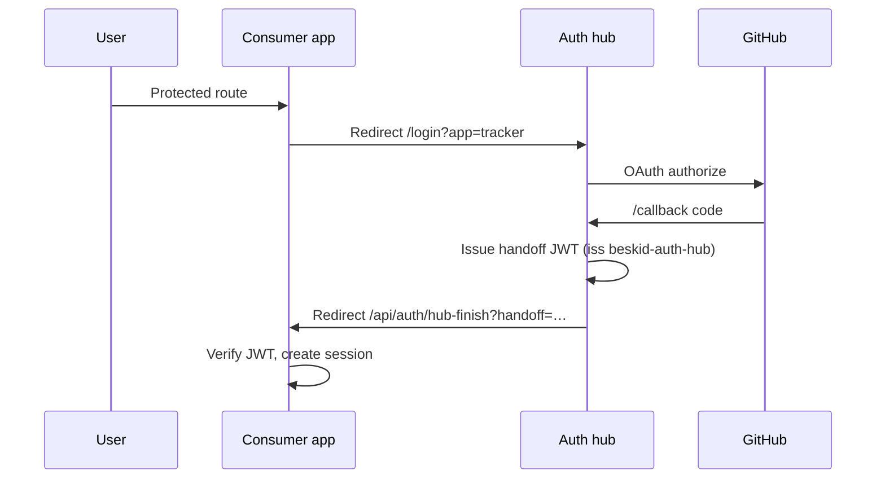

<!-- migrated from the legacy platform spec; canonical OpenSpec source -->
# Design model Specification

## Purpose

Auth hub issuer, OAuth flow, pairing lifecycle, handoff JWT claims, and hub admin bootstrap.

## Requirements

### Requirement: Design model conformance status
This capability SHALL remain non-conformant and MUST NOT be cited as an implemented Beskid guarantee until a validated OpenSpec change adds explicit behavioral requirements.

**Stable ID:** `BSP-REQ-500ABC752238`

#### Scenario: Capability has descriptive material only
- **GIVEN** the migrated sources contain no uppercase BCP-14 obligation or accepted ADR decision
- **WHEN** an implementation reports Beskid conformance
- **THEN** it MUST NOT claim conformance based on this capability

## Informative Source Provenance

The records below preserve migration history and are not normative except where text was extracted into a requirement above.

### Source Record: Design model

**Authority:** informative provenance  
**Legacy path:** `/platform-spec/tooling/auth-hub/design-model/`  
**Source:** `site/spec-content/platform-spec/tooling/auth-hub/design-model/content.md`  
**SHA-256:** `27f732e97500a63a2c6bed33eb0e780aa759327a808bf6f185a47ac6347fda26`

<details>
<summary>Migrated source text</summary>

``````markdown
## Issuer and packages

| Constant | Value | Package |
| --- | --- | --- |
| `AUTH_HUB_ISSUER` | `beskid-auth-hub` | `@beskid/auth-client` |
| `AUTH_API_VERSION` | `v1` | `@beskid/auth-client` |
| `AUTH_APP_IDS` | `tracker`, `nexus`, `pckg` | `@beskid/auth-client` |

Handoff JWTs **must** use `iss: beskid-auth-hub`, `alg: HS256`, and a signing key derived from the consumer's **service token** (32+ characters) issued at pairing time.

## Hub routes

| Path | Purpose |
| --- | --- |
| `/` | Service picker |
| `/login?app=<appId>` | Start GitHub OAuth for a consumer or hub session |
| `/callback` | GitHub OAuth callback → handoff redirect or hub session cookie |
| `/onboarding` | First-run GitHub OAuth app registration |
| `/admin`, `/admin/pairing` | Hub admins, service pairing codes |
| `/api/v1/github/*` | GitHub API proxy for paired apps (Bearer `hubUserToken`) |
| `/api/v1/pairing/*` | Pairing approve/status |
| `/api/v1/health` | Liveness for compose health checks |

## Sign-in flow



Consumers **must** preserve the post-login return path via a redirect cookie set before `/api/auth/github` and read after `/api/auth/hub-finish`.

## Pairing flow

1. Hub admin creates a pairing request (**Admin → Service pairing**) with `appId` and consumer `publicUrl`.
2. Hub returns a short-lived pairing code (24h TTL) and approve URL template: `{publicUrl}/settings/auth/pair?code=…`.
3. Consumer admin opens the approve URL (or calls the app-specific pair API). The consumer stores the returned **service token** locally (SQLite / config file).
4. Subsequent handoffs are verified with `verifyHandoffToken(serviceToken, handoff, expectedApp)`.

**Autopairing (Tracker):** when `TRACKER_PUBLIC_URL` matches the pairing request and `GITHUB_SYNC_TOKEN` or an admin session is available, `GET /settings/auth/pair?code=…` **may** complete approval server-side without manual code entry.

## Hub admin bootstrap

| Rule | Behavior |
| --- | --- |
| AH-01 | If no hub admins are configured, the **first successful GitHub OAuth sign-in** becomes hub admin |
| AH-02 | Admins manage additional logins at **Administration → Hub admins** or `GET/POST/DELETE /api/v1/admin/admins` |
| AH-03 | Re-onboarding when already configured **requires** `AUTH_SETUP_TOKEN` |

## GitHub OAuth app

Exactly **one** GitHub OAuth application is registered on the hub during `/onboarding`. Callback URL **must** be `{AUTH_HUB_PUBLIC_URL}/callback` with no trailing slash on the origin.

Consumers **must not** set `GITHUB_CLIENT_ID`, `GITHUB_CLIENT_SECRET`, or `GITHUB_OAUTH_CALLBACK_URL`.

## Decisions
<!-- spec:generate:adr-index -->
No ADRs published under **`adr/`** yet.
<!-- /spec:generate:adr-index -->
## Articles
<!-- spec:generate:article-index -->
_No articles in this bundle yet._
<!-- /spec:generate:article-index -->
``````

</details>
