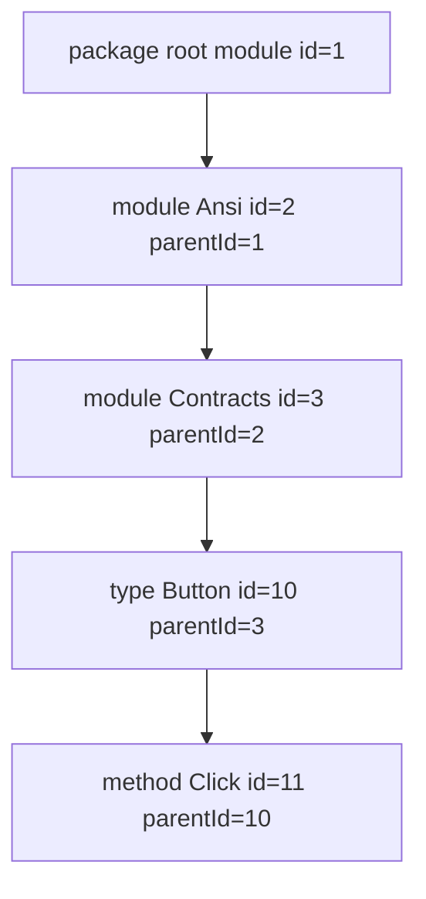

<!-- migrated from the legacy platform spec; canonical OpenSpec source -->
# api.json contract Specification

## Purpose

Normative schema for machine-readable package API documentation emitted by `beskid doc` and consumed by pckg.

## Requirements

### Requirement: api.json primary: Decision [D-TOOL-CLI-0001]
The Beskid standard SHALL enforce the following migrated contract section. Accepted ADR decisions are binding; uppercase requirement keywords retain their BCP-14 meaning.

> api.json is primary structured docs contract.

**Stable ID:** `BSP-REQ-A58B74AB8A91`  
**Legacy source:** `site/spec-content/platform-spec/tooling/cli/api-json-contract/adr/0001-api-json-primary-contract/content.md`  
**Source SHA-256:** `33b1139b1daf631701ec6c0a272ad9c74602c5d157bf8391752ceebff926e802`

#### Scenario: Conformance exercises Decision
- **GIVEN** an implementation claims conformance with this capability
- **WHEN** behavior governed by this contract section is exercised
- **THEN** every MUST, SHALL, REQUIRED, prohibition, and accepted decision in the section is satisfied

### Requirement: Hub authority: Decision [D-TOOL-CLI-0002]
The Beskid standard SHALL enforce the following migrated contract section. Accepted ADR decisions are binding; uppercase requirement keywords retain their BCP-14 meaning.

> Hub and ADRs supersede crate notes.

**Stable ID:** `BSP-REQ-4E1ACC5B874B`  
**Legacy source:** `site/spec-content/platform-spec/tooling/cli/api-json-contract/adr/0002-hub-authority/content.md`  
**Source SHA-256:** `27b5e838e1e3ca2e50afdfe5851bd7c700e5834d8993528356cf8abfa1291b87`

#### Scenario: Conformance exercises Decision
- **GIVEN** an implementation claims conformance with this capability
- **WHEN** behavior governed by this contract section is exercised
- **THEN** every MUST, SHALL, REQUIRED, prohibition, and accepted decision in the section is satisfied

### Requirement: symbolKey stable identity field: Decision [D-TOOL-CLI-0003]
The Beskid standard SHALL enforce the following migrated contract section. Accepted ADR decisions are binding; uppercase requirement keywords retain their BCP-14 meaning.

> Add optional field **`symbolKey`** on each `ApiDocItem` (JSON camelCase) for schema v4 emitters:
> 
> | Rule | Requirement |
> | --- | --- |
> | Presence | Emit **only** when `qualified_name(resolution, item.id)` succeeds (registry-backed exportable symbol) |
> | Omission | Non-exportable rows (`parameter`, synthetic rows, unresolved collect) **must** omit the field |
> | Value | Same encoding as [`SymbolRegistry`](compiler/crates/beskid_analysis/src/resolve/symbol.rs) / `symbol_to_string` (package prefix + `::` segments) |
> | `qualifiedName` | Unchanged; legacy recompute + fallback remains for display and tree labels |
> | Graph edges | **`refItemId`** stays the primary type-link and parent graph edge; `symbolKey` is parallel stable identity |
> 
> Emitters **must not** copy `qualifiedName` into `symbolKey` when the registry has no symbol for the row.
> 
> Consumers **may** index and resolve `@ref` targets by exact `symbolKey` before suffix heuristics on `qualifiedName`.
> 
> Packed library artifacts: pckg **must** validate `symbolKey` when present ([D-TOOL-PCKG-0005](/platform-spec/tooling/registry-client/pckg-client-contract/adr/0005-api-json-symbol-key-validation/)).

**Stable ID:** `BSP-REQ-E0F0CF3BA9B5`  
**Legacy source:** `site/spec-content/platform-spec/tooling/cli/api-json-contract/adr/0003-symbol-key-field/content.md`  
**Source SHA-256:** `2d0ebe4e773319caa9de2251a171e4c04968d5bcc1396124c5eca41e56bab8a5`

#### Scenario: Conformance exercises Decision
- **GIVEN** an implementation claims conformance with this capability
- **WHEN** behavior governed by this contract section is exercised
- **THEN** every MUST, SHALL, REQUIRED, prohibition, and accepted decision in the section is satisfied

## Informative Source Provenance

The records below preserve migration history and are not normative except where text was extracted into a requirement above.

### Source Record: api.json contract

**Authority:** informative provenance  
**Legacy path:** `/platform-spec/tooling/cli/api-json-contract/`  
**Source:** `site/spec-content/platform-spec/tooling/cli/api-json-contract/content.md`  
**SHA-256:** `68c418bb706fc7a61039c9ef4a956b2d7fdd47e3dbd5756a0de6ffed61da0cb6`

<details>
<summary>Migrated source text</summary>

``````markdown
<SpecSection title="What this feature specifies" id="what-this-feature-specifies">

`api.json` is the **primary structured contract** for registry API documentation. The Beskid CLI emits it under `.beskid/docs/` during `beskid doc` and `beskid pckg pack` for **`packageKind: library`** artifacts. Consumers (pckg, IDE tooling, custom renderers) **must** treat the JSON graph as authoritative for navigation, member hierarchy, and type linking—not parallel ad-hoc grouping outside the schema.

**`packageKind: template`** packages **must not** require or display `api.json` on the registry. See **[Template packages](/platform-spec/tooling/project-scaffolding/template-packages/)** and **[Package kinds](/platform-spec/tooling/registry-client/package-kinds/)**.

</SpecSection>

<SpecSection title="Implementation anchors" id="implementation-anchors">

- Schema emission: `compiler/crates/beskid_analysis/src/doc/` (`api.json` snapshot and signatures)
- CLI: `compiler/crates/beskid_cli/src/commands/doc.rs`
- Registry ingestion: `compiler/crates/beskid_pckg/src/api_doc.rs` and pckg `StructuredApiDocDtos`
- UI: pckg `PackageDocs` components driven by deserialized `api.json`

</SpecSection>

<SpecSection title="Articles" id="articles">

<SpecSection title="Decisions" id="decisions">
No open decisions. **`D-TOOL-CLI-0001`** (`api.json` primary contract), **`0002`** (hub authority), **`0003`** (`symbolKey` stable identity)—see **`adr/`** and the **ADRs** tab.
</SpecSection>

</SpecSection>

## Decisions
<!-- spec:generate:adr-index -->
No open decisions. Closed choices are normative ADRs under **`adr/`** (`D-TOOL-CLI-0001` … `D-TOOL-CLI-0003`); use the reader **ADRs** tab for expandable detail.
<!-- /spec:generate:adr-index -->
## Articles
<!-- spec:generate:article-index -->
- [Design model](./articles/design-model/)
- [Registry API reference UI](./articles/registry-api-reference-ui/)
<!-- /spec:generate:article-index -->
``````

</details>

### Source Record: api.json primary

**Authority:** informative provenance  
**Legacy path:** `/platform-spec/tooling/cli/api-json-contract/adr/0001-api-json-primary-contract/`  
**Source:** `site/spec-content/platform-spec/tooling/cli/api-json-contract/adr/0001-api-json-primary-contract/content.md`  
**SHA-256:** `33b1139b1daf631701ec6c0a272ad9c74602c5d157bf8391752ceebff926e802`

<details>
<summary>Migrated source text</summary>

``````markdown
## Context

UI contract.

## Decision

api.json is primary structured docs contract.

## Consequences

Templates exempt.

## Verification anchors

doc emission; pckg UI.
``````

</details>

### Source Record: Hub authority

**Authority:** informative provenance  
**Legacy path:** `/platform-spec/tooling/cli/api-json-contract/adr/0002-hub-authority/`  
**Source:** `site/spec-content/platform-spec/tooling/cli/api-json-contract/adr/0002-hub-authority/content.md`  
**SHA-256:** `27b5e838e1e3ca2e50afdfe5851bd7c700e5834d8993528356cf8abfa1291b87`

<details>
<summary>Migrated source text</summary>

``````markdown
## Context

Informal notes.

## Decision

Hub and ADRs supersede crate notes.

## Consequences

Spec leads code.

## Verification anchors

content verify.
``````

</details>

### Source Record: symbolKey stable identity field

**Authority:** informative provenance  
**Legacy path:** `/platform-spec/tooling/cli/api-json-contract/adr/0003-symbol-key-field/`  
**Source:** `site/spec-content/platform-spec/tooling/cli/api-json-contract/adr/0003-symbol-key-field/content.md`  
**SHA-256:** `2d0ebe4e773319caa9de2251a171e4c04968d5bcc1396124c5eca41e56bab8a5`

<details>
<summary>Migrated source text</summary>

``````markdown
## Context

Schema v4 already carries `qualifiedName`, `refItemId`, and compiler-derived signatures. Cross-package workspace doc runs and registry consumers still need a **stable, package-qualified string** that does not depend on recomputing module paths or splitting display names—especially when the same logical symbol can appear under different dense `ItemId` values during per-unit resolve.

## Decision

Add optional field **`symbolKey`** on each `ApiDocItem` (JSON camelCase) for schema v4 emitters:

| Rule | Requirement |
| --- | --- |
| Presence | Emit **only** when `qualified_name(resolution, item.id)` succeeds (registry-backed exportable symbol) |
| Omission | Non-exportable rows (`parameter`, synthetic rows, unresolved collect) **must** omit the field |
| Value | Same encoding as [`SymbolRegistry`](compiler/crates/beskid_analysis/src/resolve/symbol.rs) / `symbol_to_string` (package prefix + `::` segments) |
| `qualifiedName` | Unchanged; legacy recompute + fallback remains for display and tree labels |
| Graph edges | **`refItemId`** stays the primary type-link and parent graph edge; `symbolKey` is parallel stable identity |

Emitters **must not** copy `qualifiedName` into `symbolKey` when the registry has no symbol for the row.

Consumers **may** index and resolve `@ref` targets by exact `symbolKey` before suffix heuristics on `qualifiedName`.

Packed library artifacts: pckg **must** validate `symbolKey` when present ([D-TOOL-PCKG-0005](/platform-spec/tooling/registry-client/pckg-client-contract/adr/0005-api-json-symbol-key-validation/)).

## Consequences

- Rust type: `ApiSymbolKey` newtype in `api_snapshot.rs` (transparent JSON string).
- CLI: `beskid doc` sets `symbolKey` from registry lookup only.
- Older artifacts without `symbolKey` remain valid; field is additive on v4.

## Verification anchors

- `compiler/crates/beskid_analysis/src/doc/api_snapshot.rs`
- `compiler/crates/beskid_cli/src/commands/doc.rs`
- `compiler/crates/beskid_analysis/src/doc/refs.rs`
- `compiler/crates/beskid_pckg/src/api_doc.rs`
``````

</details>

### Source Record: Design model

**Authority:** informative provenance  
**Legacy path:** `/platform-spec/tooling/cli/api-json-contract/articles/design-model/`  
**Source:** `site/spec-content/platform-spec/tooling/cli/api-json-contract/articles/design-model/content.md`  
**SHA-256:** `0856fe05fe9c1b73b562bcac6835e5affee7d0f9f2cb2ddc98d68f683b0cc6fe`

<details>
<summary>Migrated source text</summary>

``````markdown
## What this covers

Normative shape of **`api.json` schema version 4** with **`navigationModel: "graph-v1"`**. The file lists **every resolved symbol** in the compiled API surface (documented or not). Compiler-derived **signatures** and **type annotations** are mandatory for consumers that render API reference UI; `///` comments only add optional prose.

## C#-style ergonomics

| Authoring | Beskid rule |
| --- | --- |
| XML doc optional; metadata from symbols | `doc` / `docMarkdown` optional on every item row |
| Signature from reflection | `signature`, `parameters`, `returnType`, `fieldType` from HIR + resolution |
| `cref` links | `typeAnnotation.refItemId` for type positions; `@ref` in `///` for prose cross-links |
| Multi-file projects | `beskid doc --project` uses **workspace scan** assembly (all `*.bd` under host + path dependency roots), merges resolution per unit, and sets `location.file` per declaring unit (paths **package-relative** to the declaring package source root, forward slashes) |

`ImportClosure` assembly (entry `use` graph only) is **not** used for `api.json` emission when a `Project.proj` is resolved; prelude-style re-export entrypoints otherwise document only the entry file.

## Root object

| Field | Required | Description |
| --- | --- | --- |
| `schemaVersion` | yes | `4` for this revision (`3` remains readable; new fields optional on v3) |
| `navigationModel` | yes when `schemaVersion >= 3` | Must be `"graph-v1"` |
| `generator` | yes | Tool id (for example `beskid doc`) |
| `source` | yes | Entry source path for the doc run, **artifact-relative** (forward slashes; same path as inside the published `.bpk`, never a host absolute or `obj/beskid/...` path) |
| `items` | yes | Flat list of API rows sharing one `id` space |

## Navigation invariants

### `parentId` tree (graph-v1)



Consumers walk **`parentId`** links upward to build breadcrumbs; **`memberIds`** lists direct children in emission order. Never infer parenthood from `qualifiedName` string splits.

1. Consumers **must** build trees from **`parentId`** and **`memberIds`** only — not by splitting `qualifiedName`.
2. Every item in schema v3+ **must** have **`id`**.
3. Every non-null **`parentId`** **must** reference an existing item **`id`**.
4. **`memberIds`** is emission-order redundant with `parentId`; consumers may use either, but **must not** infer parenthood from name strings.

### Library tree invariants (graph-v1 emitters)

Emitters producing registry API reference UI (for example `beskid doc` on a `Project.proj`) **must** wire a **library tree**, not a flat symbol list:

| Rule | Requirement |
| --- | --- |
| Module nesting | Every `module` row except the package root **must** have `parentId` pointing at its parent `module` item. Prefix modules **must** exist (synthetic rows allowed) so paths like `["Ansi","Contracts"]` are fully linked. |
| Module ownership | Module-level declarations (`type`, `enum`, `contract`, `function`, nested `module`) **must** have `parentId` equal to the owning module item. |
| Detail-only members | `field`, `method`, `contract_method`, `parameter`, `enum_variant`, and similar **must** appear only under their declaring type, enum, or contract — not as graph roots. |
| `modulePath` | On `module` rows, `modulePath` **must** list every logical segment including the module’s own name (for example `["Ansi","Contracts"]` for `Ansi::Contracts`). |
| Roots | After linking, graph roots **should** be top-level modules, optional dependency package groups, or a single package overview — not hundreds of unrelated symbols. |

Consumers (pckg) **may** insert UI-only folder nodes (for example **Types**, **Enums**, **Contracts**, **Functions**) under each module; those folders are **not** serialized in `api.json`.

### Nav kinds (registry UI)

| Nav role | `kind` values shown in the left library tree |
| --- | --- |
| Explorer | `module`, `type`, `enum`, `contract`, `function` |
| Detail only | `field`, `method`, `contract_method`, `parameter`, `enum_variant`, … |

Nav role is **derived from `kind`** unless a future schema adds an explicit `navRole` field.

## Item row (schema v4)

Core identity (unchanged from v3): `id`, `qualifiedName`, `name`, `displayName`, `kind`, `visibility`, `location`, `parentId`, `memberIds`, `docMarkdown`, `doc`, `controls`.

### Stable symbol identity (v4 additive)

| Field | Required | Meaning |
| --- | --- | --- |
| **`symbolKey`** | no | Package-prefixed canonical symbol string from **`SymbolRegistry`** when the row is exportable; **omitted** when collect assigns no symbol (parameters, synthetics). Same encoding as [resolver symbol identity](/platform-spec/compiler/semantic-pipeline/resolver-contract/design-model/). |

Rules ([D-TOOL-CLI-0003](/platform-spec/tooling/cli/api-json-contract/adr/0003-symbol-key-field/)):

1. Emitters **must** set `symbolKey` only when registry lookup succeeds — **must not** copy `qualifiedName` as a fallback.
2. Consumers **should** prefer `symbolKey` over parsing `qualifiedName` for cross-package identity and `@ref` resolution.
3. Graph navigation (`parentId`, `memberIds`, `refItemId`) is unchanged; `symbolKey` is parallel stable identity.
4. Packed artifacts: pckg validates uniqueness and `::` prefix when present ([D-TOOL-PCKG-0005](/platform-spec/tooling/registry-client/pckg-client-contract/adr/0005-api-json-symbol-key-validation/)).

Example row (truncated):

```json
{
  "id": 42,
  "qualifiedName": "Std::System::IO::Output::WriteLine",
  "symbolKey": "corelib_mvp::Std::System::IO::Output::WriteLine",
  "name": "WriteLine",
  "kind": "function"
}
```

### Compiler-derived fields (v4)

| Field | When present | Meaning |
| --- | --- | --- |
| `modulePath` | Root symbols | Logical module segments, e.g. `["Std","Widgets"]` |
| `signature` | Most kinds | Single-line display signature for headers and search |
| `fieldType` | `field`, `parameter` | [`typeAnnotation`](#typeannotation) for the member type |
| `returnType` | `function`, `method`, `contract_method` | Return type annotation |
| `parameters` | Callables | Ordered `{ name, type, modifier?, docMarkdown? }` |
| `genericParameters` | Types, enums, callables with generics | `{ name }` list from HIR |
| `declaringPackage` | Workspace scan / aggregate publish | Registry package id when the symbol is defined in another workspace package (optional on v4; omit when same package). With `location.file`, paths are relative to **that** package's artifact root, not the publishing package |

### typeAnnotation

```json
{
  "display": "MyLib.Widgets.Button",
  "refItemId": 42
}
```

- **`display`**: formatted type text (primitives, arrays, refs, paths).
- **`refItemId`**: present when resolution maps the type span to a **type-like** item (`type`, `enum`, `contract`). Omitted for primitives, unresolved paths, and generic parameters.

Type links in UI **must** use **`refItemId`**, not string parsing of `display`. Cross-package type navigation **may** also use **`symbolKey`** on target rows when `refItemId` is absent but the symbol is registry-backed.

## Documentation fields

- **`docMarkdown`**: full rendered body (resolved `@ref` links when packed with package identity).
- **`doc`**: structured sections (`summaryMarkdown`, `returnsMarkdown`, `arguments`, `enumVariants`, `typeParameters`) from the `///` mini-language.
- **`@arg`** is only valid on **callable** declarations; field docs use per-field `///` or parent enum `@variant`.

Undocumented symbols **must** still appear with `signature` / type fields and **null** doc fields.

## Backward compatibility

- Consumers supporting only v3 **may** ignore v4-only fields.
- Emitters **must** bump `schemaVersion` to `4` when emitting signatures or `typeAnnotation`.
- Legacy v2 (no graph) is symbol-list fallback when resolution fails; pckg requires v3+ for structured docs UI.

## Code anchors

- Schema types: `compiler/crates/beskid_analysis/src/doc/api_snapshot.rs`
- Emission: `compiler/crates/beskid_cli/src/commands/doc.rs`
- Pack validation: `compiler/crates/beskid_pckg/src/api_doc.rs`
- Registry UI: `pckg/src/Server/Components/Docs/`
``````

</details>

### Source Record: Registry API reference UI

**Authority:** informative provenance  
**Legacy path:** `/platform-spec/tooling/cli/api-json-contract/articles/registry-api-reference-ui/`  
**Source:** `site/spec-content/platform-spec/tooling/cli/api-json-contract/articles/registry-api-reference-ui/content.md`  
**SHA-256:** `807893efecd41dd05b465f618fb722d8d096599366f858f9c372559ead9aa774`

<details>
<summary>Migrated source text</summary>

``````markdown
## What this covers

How the **pckg** registry renders published package documentation as an **API reference** (Microsoft .NET API Docs–style), using **`api.json`** as the sole structure driver.

## Page layout

| Region | Content |
| --- | --- |
| Header | Package id, version, primary symbol search |
| Left rail | **Library tree** — collapsible modules, optional dependency groups, kind folders (Types, Enums, Contracts, Functions) |
| Center | Selected symbol: signature, type links, structured `doc`, `docMarkdown` body |
| Right rail | In-page table of contents from markdown headings |
| Overflow | Flat symbol grid and kind filters (secondary to the tree) |

The main content column **must** stay aligned beside the left rail (not displaced below it).

## URL routes

| Route | Purpose |
| --- | --- |
| `` `/docs/{package}@{version}` `` | Package docs landing; default tree selection |
| `` `/docs/{package}@{version}/api/{qualifiedName}` `` | Deep link to one API row (`qualifiedName` percent-encoded) |
| `` `/docs/{package}@{version}/search/{query}` `` | Initial symbol search filter |

The `version` segment may be `latest` or an exact registry version.

## Library tree algorithm

1. Deserialize `api.json` with `navigationModel: "graph-v1"` and `schemaVersion >= 3`.
2. Build parent/child edges from **`parentId`** / **`memberIds`** only ([design model](/platform-spec/tooling/cli/api-json-contract/design-model/)).
3. Include only **explorer** kinds in the tree (`module`, `type`, `enum`, `contract`, `function`).
4. Under each `module` node, group explorer children into UI folders by `kind`.
5. When **`declaringPackage`** is present and differs from the page package, group under **Dependencies** → that package id before module nesting.

Legacy artifacts without module parenting **may** synthesize module edges from `modulePath` until re-published; emitters should not rely on this path.

## Type and cross-package links

- In-package types: navigate via **`refItemId`** when set; otherwise select by `qualifiedName` or exact **`symbolKey`** when present.
- External types (`declaringPackage` ≠ current package): link to `` `/docs/{declaringPackage}@{version}/api/{qualifiedName}` `` (same version segment as the host page when possible); prefer **`symbolKey`**-stable routes when the UI supports percent-encoded symbol keys.
- Markdown `@ref` links packed at publish time **must** use the same qualified-name and **symbolKey** rules as the [design model](/platform-spec/tooling/cli/api-json-contract/design-model/).

## Implementation anchors

- UI: `pckg/src/Server/Components/Docs/` (`PackageDocs`, `ApiDocNavigationBuilder`, `DocsView`)
- API: `GET /api/packages/{id}/versions/{ver}/docs/structured`
- Pack: `.beskid/docs/api.json` inside `.bpk` artifacts
``````

</details>
