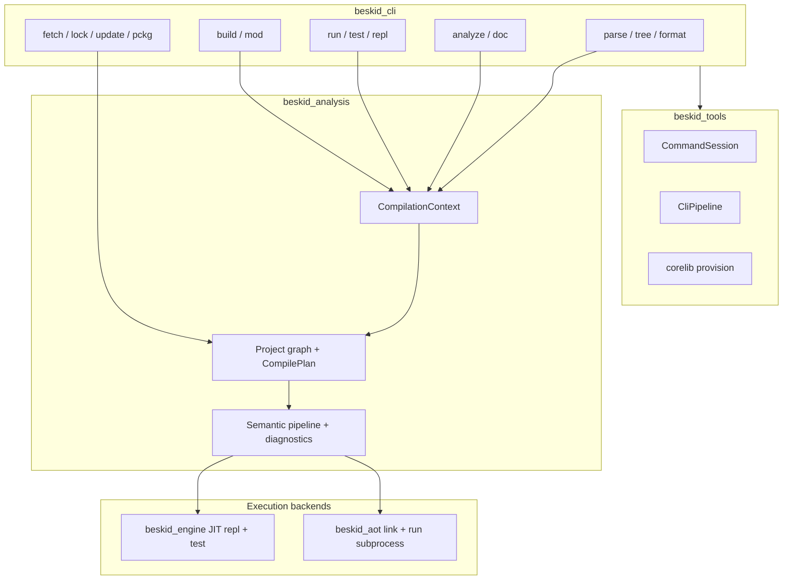
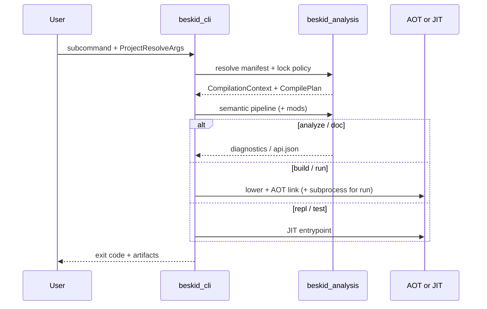

<!-- migrated from the legacy platform spec; canonical OpenSpec source -->
# Build, analyze, and run contract Specification

## Purpose

Expected CLI behavior and outputs across build, analysis, and runtime execution commands.

## Requirements

### Requirement: Hub authority: Decision [D-TOOL-CLI-0001]
The Beskid standard SHALL enforce the following migrated contract section. Accepted ADR decisions are binding; uppercase requirement keywords retain their BCP-14 meaning.

> Hub owns MUST/SHOULD.

**Stable ID:** `BSP-REQ-3399DD008DB2`  
**Legacy source:** `site/spec-content/platform-spec/tooling/cli/build-analyze-run-contract/adr/0001-hub-authority/content.md`  
**Source SHA-256:** `783be1ea80669a334220e370b1c701f5488efac7513b4975855efa6adf74c5c3`

#### Scenario: Conformance exercises Decision
- **GIVEN** an implementation claims conformance with this capability
- **WHEN** behavior governed by this contract section is exercised
- **THEN** every MUST, SHALL, REQUIRED, prohibition, and accepted decision in the section is satisfied

### Requirement: Shared pipeline: Decision [D-TOOL-CLI-0002]
The Beskid standard SHALL enforce the following migrated contract section. Accepted ADR decisions are binding; uppercase requirement keywords retain their BCP-14 meaning.

> Use beskid_analysis aligned with LSP.

**Stable ID:** `BSP-REQ-7C7E4861576C`  
**Legacy source:** `site/spec-content/platform-spec/tooling/cli/build-analyze-run-contract/adr/0002-shared-analysis-pipeline/content.md`  
**Source SHA-256:** `3ca076aaaf41f06f109f036642dc8df280cac244dcb499387e434c2974fed3d3`

#### Scenario: Conformance exercises Decision
- **GIVEN** an implementation claims conformance with this capability
- **WHEN** behavior governed by this contract section is exercised
- **THEN** every MUST, SHALL, REQUIRED, prohibition, and accepted decision in the section is satisfied

## Informative Source Provenance

The records below preserve migration history and are not normative except where text was extracted into a requirement above.

### Source Record: Build, analyze, and run contract

**Authority:** informative provenance  
**Legacy path:** `/platform-spec/tooling/cli/build-analyze-run-contract/`  
**Source:** `site/spec-content/platform-spec/tooling/cli/build-analyze-run-contract/content.md`  
**SHA-256:** `53cfbf9eab29989c356698d0805e520904961f771a4d2eddb32dd4dbea1461d1`

<details>
<summary>Migrated source text</summary>

``````markdown
<SpecSection title="What this feature specifies" id="what-this-feature-specifies">
`Build, analyze, and run contract` defines one operational contract that a newcomer can follow end-to-end: first the model, then execution flow, then strict guarantees, concrete examples, and verification guidance.
</SpecSection>

<SpecSection title="Implementation anchors" id="implementation-anchors">
- CLI command implementations in `compiler/crates/beskid_cli/src/commands/`
- Analysis pipeline in `compiler/crates/beskid_analysis/src/services/`
- Runtime launch via AOT subprocess in `compiler/crates/beskid_aot/src/run.rs`; JIT REPL in `compiler/crates/beskid_repl/`
- CLI-facing tests in `compiler/crates/beskid_tests/src/analysis/pipeline/core.rs`
</SpecSection>

<SpecSection title="Decisions" id="decisions">
No open decisions. **`D-TOOL-CLI-0001`** (hub authority), **`0002`** (shared analysis pipeline with LSP)—see **`adr/`** and the **ADRs** tab.
</SpecSection>

## Decisions
<!-- spec:generate:adr-index -->
No open decisions. Closed choices are normative ADRs under **`adr/`** (`D-TOOL-CLI-0001` … `D-TOOL-CLI-0002`); use the reader **ADRs** tab for expandable detail.
<!-- /spec:generate:adr-index -->
## Articles
<!-- spec:generate:article-index -->
- [Contracts and edge cases](./articles/contracts-and-edge-cases/)
- [Design model](./articles/design-model/)
- [Examples](./articles/examples/)
- [FAQ and troubleshooting](./articles/faq-and-troubleshooting/)
- [Flow and algorithm](./articles/flow-and-algorithm/)
- [Verification and traceability](./articles/verification-and-traceability/)
<!-- /spec:generate:article-index -->
``````

</details>

### Source Record: Hub authority

**Authority:** informative provenance  
**Legacy path:** `/platform-spec/tooling/cli/build-analyze-run-contract/adr/0001-hub-authority/`  
**Source:** `site/spec-content/platform-spec/tooling/cli/build-analyze-run-contract/adr/0001-hub-authority/content.md`  
**SHA-256:** `783be1ea80669a334220e370b1c701f5488efac7513b4975855efa6adf74c5c3`

<details>
<summary>Migrated source text</summary>

``````markdown
## Context

Drift risk.

## Decision

Hub owns MUST/SHOULD.

## Consequences

Articles defer.

## Verification anchors

trudoc.
``````

</details>

### Source Record: Shared pipeline

**Authority:** informative provenance  
**Legacy path:** `/platform-spec/tooling/cli/build-analyze-run-contract/adr/0002-shared-analysis-pipeline/`  
**Source:** `site/spec-content/platform-spec/tooling/cli/build-analyze-run-contract/adr/0002-shared-analysis-pipeline/content.md`  
**SHA-256:** `3ca076aaaf41f06f109f036642dc8df280cac244dcb499387e434c2974fed3d3`

<details>
<summary>Migrated source text</summary>

``````markdown
## Context

CLI/LSP divergence.

## Decision

Use beskid_analysis aligned with LSP.

## Consequences

- CLI compile commands (`run`, `build`, `test`, `clif`) and LSP share the same `beskid_analysis` prepare spine.
- Each compile command performs **one** executable prepare (`executable_gate_prepared` / `PrepareMode::Executable`) before lowering or codegen; a second prepare on the same command is forbidden.
- Lowering and codegen consume the prepared front-end bundle (`into_executable` → `lower_from_front_end`); they must not re-enter `prepare_compilation`.
- Parity: diagnostics, semantic snapshots, and typed HIR products match between CLI and LSP for the same resolved input.

## Verification anchors

- `compiler/crates/beskid_tests/src/spine/single_prepare.rs` — asserts one parent `semantic` and one parent `lower` per run-path prepare.
- Pipeline integration tests under `compiler/crates/beskid_tests/src/analysis/pipeline/`.
``````

</details>

### Source Record: Contracts and edge cases

**Authority:** informative provenance  
**Legacy path:** `/platform-spec/tooling/cli/build-analyze-run-contract/articles/contracts-and-edge-cases/`  
**Source:** `site/spec-content/platform-spec/tooling/cli/build-analyze-run-contract/articles/contracts-and-edge-cases/content.md`  
**SHA-256:** `9c526464afd342fef4f9b9db6982526c99f7a8a3c983dcd5bda317fd905a1844`

<details>
<summary>Migrated source text</summary>

``````markdown
## Normative contracts

- **Single analysis entry** — Project-scoped commands **must not** fork ad-hoc parsers that skip `CompilationContext` when a `Project.proj` is in scope.
- **Corelib always on** — Host projects **must** resolve implicit `Std` / corelib; manifests **must not** opt out (`noCorelib`, `useCorelib: false` are parse errors in `beskid_analysis` `projects/parser.rs`).
- **Exit codes** — Semantic errors on `analyze` **must** yield non-zero process exit; `build`/`run` **must** propagate linker/AOT subprocess failures without masking as warnings; `run` **must** exit with the linked executable's status code on success paths.
- **Pipeline truthfulness** — Reported phase IDs **must** correspond to real `beskid_pipeline` stages; silent no-ops are forbidden for declared progress events.
- **Mod parity** — Capability denial and generator round exhaustion **must** match LSP diagnostics (same codes, same severity).

## Edge cases

| Situation | Expected behavior |
| --- | --- |
| Input is a `.bd` file outside any project root | File-scoped commands work; project commands error with manifest discovery diagnostics |
| Missing `Project.lock` under strict policy | `build`/`run` fail with lock policy message before lowering |
| `Mod` artifact cache miss | `build` triggers AOT compile or reports cache policy failure; no partial host compile |
| Multiple workspace members | `--project` / focused member selection **must** match LSP `BESKID_WORKSPACE_MEMBER_FOR_META_DEFAULT` semantics when set |
| `--entrypoint` on non-`app` target | Rejected with stable CLI error (no silent default to `main`) |
| Corelib root only via env | `BESKID_CORELIB_ROOT` and install layout fallbacks in `resolver.rs` apply before graph build |

## Foreign libraries and link metadata

FFI link lines come from **`project.link`** on host manifests (see **[Project link libraries](/platform-spec/tooling/manifests-and-lockfiles/project-manifest-contract/project-link-libraries/)**). `build` **must** pass resolved native libraries to the AOT linker when present; missing symbols fail at link time, not at runtime silently.
``````

</details>

### Source Record: Design model

**Authority:** informative provenance  
**Legacy path:** `/platform-spec/tooling/cli/build-analyze-run-contract/articles/design-model/`  
**Source:** `site/spec-content/platform-spec/tooling/cli/build-analyze-run-contract/articles/design-model/content.md`  
**SHA-256:** `288a738906fb93f95c3ffa9ad0b1fa9c6705e143c1ff4e5897df905d97ef9e13`

<details>
<summary>Migrated source text</summary>

``````markdown
## Purpose

The `beskid` executable is a thin Clap binary over **`beskid_tools`** (pipeline progress, diagnostic rendering, `CommandSession` resolve/gate helpers, corelib provisioning) and **`beskid_analysis`** (project graph, semantic pipeline, document snapshots), with backend-specific drivers (**AOT** for `run`/`build`, **JIT** for `repl` and interim `test`, **CLIF** introspection). Every project-scoped command shares the same resolution inputs (`ProjectResolveArgs`, `LockfilePolicyArgs`) and **must** provision bundled corelib before dispatch (`ensure_corelib_ready` in `compiler/crates/beskid_cli/src/cli.rs` via `beskid_tools::corelib`).

## Layered model



| Layer | Responsibility |
| --- | --- |
| **Argv + global flags** | `@file` expansion, `--log-cranelift`, subcommand dispatch |
| **Project resolution** | Discover `Project.proj` / `Workspace.proj`, honor lockfile policy, build `CompilationContext` |
| **Pipeline observation** | Map `beskid_pipeline` phase IDs to a Ratatui TUI (Elm Architecture: model / message / update / view) or `--plain` stderr lines |
| **Command backend** | `analyze` emits diagnostics only; `build`/`run` lower + AOT; `repl`/`test` JIT entrypoints |

## Shared resolution contract

`build`, `run`, `test`, `analyze`, `doc`, `clif`, and `format` (when given a project input) **must** enter analysis through the same helpers that construct a **`CompilationContext`** for the resolved manifest path. Mod registration on the host compilation **must** occur after the dependency graph is materialized and before semantic gates, per **[Stage ordering and lowering](/platform-spec/compiler/build-pipeline/stage-ordering/)**.

File-only commands (`parse`, `tree` with a single `.bd` path) may bypass the project graph but still use the parser and formatter crates directly.

## Compiler mods on the CLI

**`Mod`** projects are graph-discovered packages compiled AOT and loaded during host builds. CLI **`beskid mod`** manages artifact cache lifecycle; **`beskid build` / `run` / `test` / `analyze`** route mod work through **`beskid_analysis`** orchestration—the same entrypoints the LSP uses—so diagnostic codes, capability denial, and generator round caps match IDE behavior.

| Concern | Normative rule |
| --- | --- |
| Progress | New pipeline phase IDs **must** surface through the CLI `PipelineObserver` implementation |
| Diagnostics | Meta and semantic diagnostics share `SemanticDiagnostic` / miette shaping |
| Parity | Changing mod scheduling **must** update CLI, LSP, and **[Diagnostics parity](/platform-spec/compiler/build-pipeline/diagnostics-parity/)** together |

## Terminal UI summary

When stderr is a TTY and `--plain` is not set, pipeline-backed commands render phase progress on the alternate screen using a **single flexible shell**: a context bar, a stage-focused primary pane, a secondary pane (pipeline tree, test list, or summary chart), a log strip, and dual progress gauges in the footer. Pane weights shift with the active pipeline stage (workspace resolve, front-end parse, semantic analysis, lowering/codegen, or test execution). **Navigation:** after compile completes the pipeline screen stays visible until **Space** opens the test table (`beskid test`) or summary (other commands); **Space** again opens the summary chart; **Space** or **q** exits. The same facts are always echoed as a one-line stderr summary after the TUI exits so scripts and CI logs stay parseable. `--plain` skips the alternate-screen UI entirely.

## Implementation anchors

- Subcommand wiring: `compiler/crates/beskid_cli/src/cli.rs`, `compiler/crates/beskid_cli/src/commands/`
- Resolution + pipeline UI: `compiler/crates/beskid_cli/src/frontend.rs`, `compiler/crates/beskid_cli/src/project_args.rs`
- Analysis services: `compiler/crates/beskid_analysis/src/services/`, `compilation_context.rs`
- JIT launch (interim test + REPL): `compiler/crates/beskid_engine/`
- REPL snippets: `compiler/crates/beskid_repl/`
- AOT link and run subprocess: `compiler/crates/beskid_aot/`
``````

</details>

### Source Record: Examples

**Authority:** informative provenance  
**Legacy path:** `/platform-spec/tooling/cli/build-analyze-run-contract/articles/examples/`  
**Source:** `site/spec-content/platform-spec/tooling/cli/build-analyze-run-contract/articles/examples/content.md`  
**SHA-256:** `8c0de91b6a26e42ad262f5932fd28c01fb5c5e59a62ae3faef97c1099aff6eef`

<details>
<summary>Migrated source text</summary>

``````markdown
## Analyze a project target

```bash
beskid analyze --project path/to/Project.proj
```

Emits semantic (+ mod) diagnostics for the resolved host target using the same pipeline as the IDE.

## Release build of an app

```bash
beskid build --project apps/demo/Project.proj --release --kind exe
```

Produces an AOT executable with release profile defaults; link mode and runtime strategy follow `beskid_aot` defaults unless overridden.

## Run with explicit entrypoint

```bash
beskid run --project apps/demo/Project.proj --entrypoint DemoHost.Run
```

JIT-compiles the resolved `app` target and invokes the named entry function.

## Workspace lock before CI build

```bash
beskid lock --project apps/demo/Project.proj
beskid build --project apps/demo/Project.proj
```

`lock` materializes `Project.lock`; `build` consumes the pinned graph.

## Plain progress for logs

```bash
beskid build --project apps/demo/Project.proj --plain
```

Maps pipeline phases to line-oriented stderr suitable for CI log parsers.
``````

</details>

### Source Record: FAQ and troubleshooting

**Authority:** informative provenance  
**Legacy path:** `/platform-spec/tooling/cli/build-analyze-run-contract/articles/faq-and-troubleshooting/`  
**Source:** `site/spec-content/platform-spec/tooling/cli/build-analyze-run-contract/articles/faq-and-troubleshooting/content.md`  
**SHA-256:** `912d3c8ddbbb180593aa8c8eedac76e0a23d61bbb5aeadff4db5434d6d73d8e8`

<details>
<summary>Migrated source text</summary>

``````markdown
## Why does `analyze` pass in the IDE but fail in CI?

The CLI runs the full project graph and lock policy. Ensure CI calls `beskid lock` (or checks in `Project.lock`) and sets `BESKID_CORELIB_ROOT` when not using the bundled corelib layout. Compare against the focused `Project.proj` the extension sends to the LSP.

## `build` cannot find corelib / `Std`

Verify `BESKID_CORELIB_ROOT` points at a tree containing `beskid_corelib/Project.proj`, or run `beskid corelib` materialization. Superrepo checkouts should resolve via `compiler/corelib/beskid_corelib` discovery in `resolver.rs`.

## Diagnostics differ between `analyze` and `build`

`build` runs lowering and may surface codegen-only failures. Start with `analyze`; if clean, inspect AOT/link logs. Mod generator failures appear in both when semantic gates run.

## `run` works locally but not in containers

Confirm the JIT runtime matches the target triple and that syscall-backed corelib surfaces are available in the image. Release AOT (`build`) is the supported path for minimal runtime images.

## Where are mod artifacts cached?

`beskid mod` subcommands and the analysis cache under the package/object store documented in **[Compiler Mods](/platform-spec/compiler/compiler-mods/)**. Stale caches: use documented clean/rebuild policy from the mod manifest `artifactPolicy`.
``````

</details>

### Source Record: Flow and algorithm

**Authority:** informative provenance  
**Legacy path:** `/platform-spec/tooling/cli/build-analyze-run-contract/articles/flow-and-algorithm/`  
**Source:** `site/spec-content/platform-spec/tooling/cli/build-analyze-run-contract/articles/flow-and-algorithm/content.md`  
**SHA-256:** `27a33633e6e7ea646f150ca360ec2e04a2131224e9920f718f369cb9b9a06469`

<details>
<summary>Migrated source text</summary>

``````markdown
## Startup

1. Expand response files (`argfile`) and parse global flags.
2. Initialize logging (`BESKID_LOG_CRANELIFT` / `--log-cranelift`).
3. **`ensure_corelib_ready`** — materialize or locate bundled corelib before any project command runs.
4. Dispatch the selected subcommand.

## Project-scoped command flow



### `analyze`

1. Resolve input to a host target and `CompilationContext`.
2. Run the semantic pipeline with builtin (+ mod) rules.
3. Print diagnostics to stderr (miette rendering); non-zero exit when errors exist.

### `build`

1. Resolve `CompilePlan` and target kind (`App`, `Lib`, `Test`).
2. Lower through `beskid_codegen` with pipeline observation.
3. Invoke `beskid_aot::build` with profile, link mode, and runtime strategy flags.
4. Write object/shared/static/executable per `--kind` and target defaults.

### `run`

1. Resolve entry module and optional `--entrypoint`.
2. Lower through `beskid_codegen` with pipeline observation (`RUN_AOT_PHASE_ORDER`).
3. Link an executable via `beskid_aot::build` and execute it in a subprocess; forward stdout/stderr and propagate the child exit code.

### `test` (interim JIT)

1. Resolve entry module and discover `test` items.
2. JIT-compile via `beskid_engine` in-process and aggregate results. Phase 2 will migrate this path to AOT.

### `repl`

1. Read single expression or statement snippets from stdin (no project graph in v1).
2. JIT-compile each snippet via a persistent `beskid_engine::Engine` session in `beskid_repl`.
3. Print formatted results; `:quit` and `:reset` control session lifecycle. See **[REPL command](/platform-spec/tooling/cli/repl-command/)**.

### Workspace maintenance (`fetch`, `lock`, `update`)

These commands mutate or verify the materialized dependency tree and `Project.lock` **before** host compilation. They share graph resolution with build/run but do not themselves lower user code.

## Lockfile interaction

When `LockfilePolicyArgs` require a lock, the CLI **must** fail fast if `Project.lock` is missing or stale relative to manifests, rather than silently fetching in release-critical paths unless the command documents otherwise (`update` vs `build` defaults).

## Verification hooks

Integration coverage lives in `compiler/crates/beskid_tests/src/analysis/pipeline/core.rs` and command-specific tests beside each `commands/*.rs` module.
``````

</details>

### Source Record: Verification and traceability

**Authority:** informative provenance  
**Legacy path:** `/platform-spec/tooling/cli/build-analyze-run-contract/articles/verification-and-traceability/`  
**Source:** `site/spec-content/platform-spec/tooling/cli/build-analyze-run-contract/articles/verification-and-traceability/content.md`  
**SHA-256:** `209c9d4d49c78e132a819391a7d4b68f942071bc654376082541e500ec553fd5`

<details>
<summary>Migrated source text</summary>

``````markdown
## Automated coverage

| Area | Location |
| --- | --- |
| Pipeline + workspace resolution | `compiler/crates/beskid_tests/src/analysis/pipeline/core.rs` |
| Project graph / corelib layout | `compiler/crates/beskid_tests/src/projects/corelib/` |
| CLI integration | Tests adjacent to `compiler/crates/beskid_cli/src/commands/*.rs` where present |

## Traceability matrix

| Contract clause | Verification |
| --- | --- |
| Shared `CompilationContext` | Pipeline tests assert identical diagnostics for CLI vs in-process analysis hooks |
| Lock policy enforcement | Workspace tests with missing/stale `Project.lock` |
| Implicit corelib | `layout.rs` and parser rejection tests for `noCorelib` |
| Mod round caps | Compiler-mod integration tests under `compiler/crates/beskid_tests` mod suites |

## Release checks

Compiler CI builds the `beskid` binary and runs the workspace test crate. Changing command surfaces **must** extend an existing integration test or add a focused CLI test rather than relying on manual smoke runs only.

## Spec maintenance

When adding subcommands or flags, update this feature bundle, the CLI area index, and any pipeline phase registry entries in the same change set.
``````

</details>
