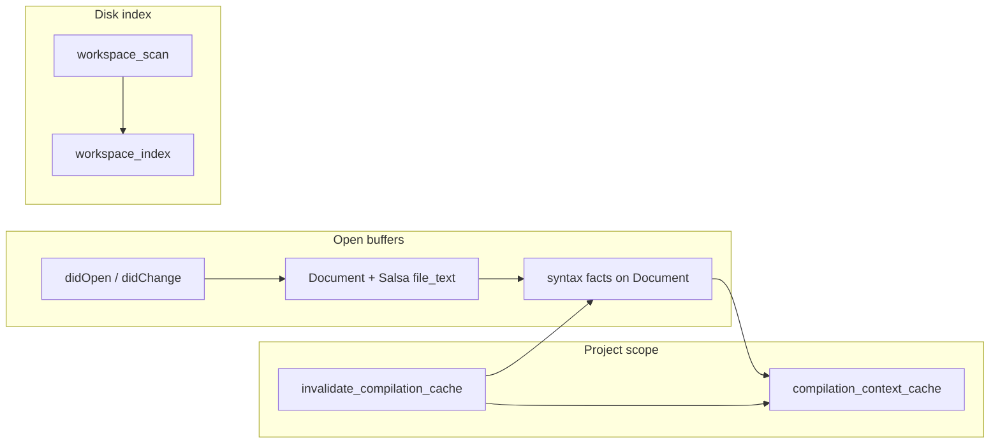
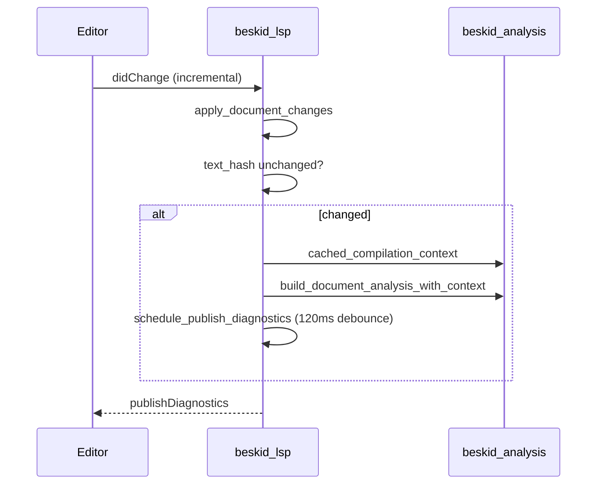

<!-- migrated from the legacy platform spec; canonical OpenSpec source -->
# Snapshot and refresh contract Specification

## Purpose

LSP workspace snapshot lifecycle and refresh guarantees for diagnostics and symbol services.

## Requirements

### Requirement: Hub authority: Decision [D-TOOL-LSP-0001]
The Beskid standard SHALL enforce the following migrated contract section. Accepted ADR decisions are binding; uppercase requirement keywords retain their BCP-14 meaning.

> Hub owns snapshot/refresh MUST/SHOULD.

**Stable ID:** `BSP-REQ-6C7F3ADC8DEE`  
**Legacy source:** `site/spec-content/platform-spec/tooling/lsp/snapshot-and-refresh-contract/adr/0001-hub-authority/content.md`  
**Source SHA-256:** `4efdf60c73a5d7e1f88466b09a72fee61506815654d56db7bcb60b5fed1ec832`

#### Scenario: Conformance exercises Decision
- **GIVEN** an implementation claims conformance with this capability
- **WHEN** behavior governed by this contract section is exercised
- **THEN** every MUST, SHALL, REQUIRED, prohibition, and accepted decision in the section is satisfied

### Requirement: Invalidation: Decision [D-TOOL-LSP-0002]
The Beskid standard SHALL enforce the following migrated contract section. Accepted ADR decisions are binding; uppercase requirement keywords retain their BCP-14 meaning.

> Invalidate on focus, manifest, lock; debounce watchers.

**Stable ID:** `BSP-REQ-4C80F6D47104`  
**Legacy source:** `site/spec-content/platform-spec/tooling/lsp/snapshot-and-refresh-contract/adr/0002-invalidation-on-focus-and-manifest/content.md`  
**Source SHA-256:** `e422c1bff32c23eb0e8d3155395778c9eb4b7504c514c1749ff3c7564ac096c1`

#### Scenario: Conformance exercises Decision
- **GIVEN** an implementation claims conformance with this capability
- **WHEN** behavior governed by this contract section is exercised
- **THEN** every MUST, SHALL, REQUIRED, prohibition, and accepted decision in the section is satisfied

## Informative Source Provenance

The records below preserve migration history and are not normative except where text was extracted into a requirement above.

### Source Record: Snapshot and refresh contract

**Authority:** informative provenance  
**Legacy path:** `/platform-spec/tooling/lsp/snapshot-and-refresh-contract/`  
**Source:** `site/spec-content/platform-spec/tooling/lsp/snapshot-and-refresh-contract/content.md`  
**SHA-256:** `462bcd7396a7962595cfa19edf2743f63d26b807768d84eba3d70be7b9198d69`

<details>
<summary>Migrated source text</summary>

``````markdown
<SpecSection title="What this feature specifies" id="what-this-feature-specifies">
`Snapshot and refresh contract` defines one operational contract that a newcomer can follow end-to-end: first the model, then execution flow, then strict guarantees, concrete examples, and verification guidance.
</SpecSection>

<SpecSection title="Implementation anchors" id="implementation-anchors">
- LSP diagnostics in `compiler/crates/beskid_lsp/src/diagnostics.rs`
- Analysis services in `compiler/crates/beskid_analysis/src/services/`
- Resolver implementation in `compiler/crates/beskid_analysis/src/resolve/resolver.rs`
- LSP tests in `compiler/crates/beskid_tests/src/analysis/resolve.rs`
</SpecSection>

<SpecSection title="Decisions" id="decisions">
No open decisions. **`D-TOOL-LSP-0001`** (hub authority), **`0002`** (invalidation on focus and manifest)—see **`adr/`** and the **ADRs** tab.
</SpecSection>

## Decisions
<!-- spec:generate:adr-index -->
No open decisions. Closed choices are normative ADRs under **`adr/`** (`D-TOOL-LSP-0001` … `D-TOOL-LSP-0002`); use the reader **ADRs** tab for expandable detail.
<!-- /spec:generate:adr-index -->
## Articles
<!-- spec:generate:article-index -->
- [Contracts and edge cases](./articles/contracts-and-edge-cases/)
- [Design model](./articles/design-model/)
- [Examples](./articles/examples/)
- [FAQ and troubleshooting](./articles/faq-and-troubleshooting/)
- [Flow and algorithm](./articles/flow-and-algorithm/)
- [Verification and traceability](./articles/verification-and-traceability/)
<!-- /spec:generate:article-index -->
``````

</details>

### Source Record: Hub authority

**Authority:** informative provenance  
**Legacy path:** `/platform-spec/tooling/lsp/snapshot-and-refresh-contract/adr/0001-hub-authority/`  
**Source:** `site/spec-content/platform-spec/tooling/lsp/snapshot-and-refresh-contract/adr/0001-hub-authority/content.md`  
**SHA-256:** `4efdf60c73a5d7e1f88466b09a72fee61506815654d56db7bcb60b5fed1ec832`

<details>
<summary>Migrated source text</summary>

``````markdown
## Context

One authority.

## Decision

Hub owns snapshot/refresh MUST/SHOULD.

## Consequences

IDE parity.

## Verification anchors

beskid_lsp tests.
``````

</details>

### Source Record: Invalidation

**Authority:** informative provenance  
**Legacy path:** `/platform-spec/tooling/lsp/snapshot-and-refresh-contract/adr/0002-invalidation-on-focus-and-manifest/`  
**Source:** `site/spec-content/platform-spec/tooling/lsp/snapshot-and-refresh-contract/adr/0002-invalidation-on-focus-and-manifest/content.md`  
**SHA-256:** `e422c1bff32c23eb0e8d3155395778c9eb4b7504c514c1749ff3c7564ac096c1`

<details>
<summary>Migrated source text</summary>

``````markdown
## Context

Stale snapshots.

## Decision

Invalidate on focus, manifest, lock; debounce watchers.

## Consequences

Config notification.

## Verification anchors

session store.
``````

</details>

### Source Record: Contracts and edge cases

**Authority:** informative provenance  
**Legacy path:** `/platform-spec/tooling/lsp/snapshot-and-refresh-contract/articles/contracts-and-edge-cases/`  
**Source:** `site/spec-content/platform-spec/tooling/lsp/snapshot-and-refresh-contract/articles/contracts-and-edge-cases/content.md`  
**SHA-256:** `85fffffb42b29f635887df2f726047a883258a98addc51b44b73e0cc48e77e94`

<details>
<summary>Migrated source text</summary>

``````markdown
## Contracts

- **Open buffer wins** — Disk index **must not** overwrite an open `Document` for the same `Uri`.
- **Monotonic versions** — Stale `didChange` versions **must** be ignored per LSP rules.
- **Generation-bound facts** — Open buffers own syntax documentation/diagnostics facts for the current text revision. Hard invalidation **must** clear those facts (fail closed) and rebuild via `rebuild_open_document_syntax_facts`; there is no `ANALYSIS_CACHE_VERSION` shape cache.
- **Diagnostic debounce** — Only the latest scheduled revision per URI may publish; superseded tasks **must** no-op.
- **Manifest URIs** — `.proj` files **must not** run Beskid semantic analysis snapshots.
- **Parity** — Diagnostic codes and severities **must** match `beskid analyze` for the same `CompilationContext`.

## Edge cases

| Case | Behavior |
| --- | --- |
| Source outside focused project tree | Fall back to focused `Project.proj` when path is under focus root (`project_context.rs`) |
| No resolvable manifest | Analysis snapshot is `None`; features degrade gracefully without fabricated graphs |
| Large workspace scan | Progress events **must** remain cancellable by subsequent invalidation |
| Rapid typing | Text-hash fast path avoids parse until pause; debounced diagnostics may lag one generation |
| Lockfile change during edit | Hard invalidation; user may see transient empty diagnostics until rescan completes |

## Meta invalidation

Changes to `project.mod` or mod AOT outputs **must** hard-invalidate compilation cache before re-running generators. Soft paths are opt-in and require proven stable capture keys.
``````

</details>

### Source Record: Design model

**Authority:** informative provenance  
**Legacy path:** `/platform-spec/tooling/lsp/snapshot-and-refresh-contract/articles/design-model/`  
**Source:** `site/spec-content/platform-spec/tooling/lsp/snapshot-and-refresh-contract/articles/design-model/content.md`  
**SHA-256:** `7290e3e304ead382dd8af7705bbbcb5a059aefc0a61a206449c18212c59638ce`

<details>
<summary>Migrated source text</summary>

``````markdown
## Purpose

The Beskid LSP maintains open document buffers (`State.docs`), disk-backed workspace index entries (`State.workspace_index`), generation-bound syntax fact fields on each `Document` (definitions, hovers, symbols, completion, inlay hints, documentation, diagnostics), and a workspace-scoped **`beskid_queries::BeskidDatabase`** (`State.compilation_db`) that owns incremental invalidation. A separate **`CompilationContext`** cache keys off resolved `Project.proj` paths plus workspace member defaults. Lifecycle **must not** own a `DocumentAnalysisSnapshot` or `ANALYSIS_CACHE_VERSION` shape cache.

## Invalidation model

`didChange` **must** call `BeskidDatabase::ensure_file_text` for the edited URI before rebuilding generation-bound syntax facts or publishing diagnostics. Hard invalidation clears `compilation_context_cache`, resets the Salsa DB when warm, and clears open/index syntax facts until `rebuild_open_document_syntax_facts` rebinds them.

## Snapshot stores



| Store | Key | Invalidation trigger |
| --- | --- | --- |
| Open `Document` | LSP `Uri` | Text change, version bump, cache version mismatch |
| Disk snapshot | `Uri` (file not open) | Workspace scan, external file watcher refresh |
| `CompilationContext` | `(Project.proj path, member default)` | Manifest/lock/graph changes, explicit invalidation |

## Analysis snapshot contents

`build_document_analysis` calls `beskid_analysis::services::build_document_analysis_with_context` when a `CompilationContext` exists. Project manifest URIs (`.proj`) **must not** produce analysis snapshots—only Beskid sources.

## Hard vs soft invalidation

**Hard invalidation** clears `compilation_context_cache`, resets the warm Salsa DB, and clears per-document generation-bound syntax facts so every open buffer rebinds via `rebuild_open_document_syntax_facts`:

- `Project.proj`, `Workspace.proj`, or lockfile writes affecting dependency roots
- `project.mod` changes on attached `Mod` projects
- Full workspace rescan after `invalidate_compilation_cache` (`workspace_scan.rs`, `backend.rs`)

**Soft invalidation** (re-run meta without full graph rebuild) is permitted only when capture keys remain valid; otherwise the server **must** hard-invalidate per **[Incremental scheduling and determinism](/platform-spec/compiler/compiler-mods/incremental-scheduling-determinism/)**.

## Status reporting

Workspace scans emit `BeskidStatusParams` with `phase: workspace_scan` and throttled progress (`STATUS_EMIT_INTERVAL` 200ms) so the VS Code extension can mirror CLI-style progress in the status bar.

## Implementation anchors

- Document lifecycle: `compiler/crates/beskid_lsp/src/session/lifecycle.rs`
- Project context cache: `compiler/crates/beskid_lsp/src/session/project_context.rs`
- Workspace scan: `compiler/crates/beskid_lsp/src/workspace_scan.rs`
- Server wiring: `compiler/crates/beskid_lsp/src/server/backend.rs`
- Diagnostics publish debounce: 120ms coalescing in `schedule_publish_diagnostics`
``````

</details>

### Source Record: Examples

**Authority:** informative provenance  
**Legacy path:** `/platform-spec/tooling/lsp/snapshot-and-refresh-contract/articles/examples/`  
**Source:** `site/spec-content/platform-spec/tooling/lsp/snapshot-and-refresh-contract/articles/examples/content.md`  
**SHA-256:** `61b82d0abb776ebb78eabf1f7669f8c8fa2e2a87c3e100df4bad8d734415d46a`

<details>
<summary>Migrated source text</summary>

``````markdown
## Focused project switch

1. User selects a workspace member in **Project** view.
2. Extension sends focused `Project.proj` URI to the LSP.
3. Server invalidates `compilation_context_cache` and schedules `refresh_workspace_scan`.
4. Diagnostics on open `.bd` files refresh against the new graph.

## Edit loop

1. `didChange` updates buffer text and hash.
2. Analysis rebuilds snapshot with current `CompilationContext`.
3. After ~120ms quiet period, `textDocument/publishDiagnostics` fires.

## Close and reopen

1. `didClose` removes open buffer entry.
2. `hydrate_disk_after_close` reads file from disk into `workspace_index`.
3. Reopen uses `didOpen` → fresh open snapshot (disk index entry removed).

## CI parity check

Run `beskid analyze --project <same Project.proj>` and compare diagnostic codes to the Problems panel for the same file generation—discrepancies indicate cache or focus mismatch, not intentional divergence.
``````

</details>

### Source Record: FAQ and troubleshooting

**Authority:** informative provenance  
**Legacy path:** `/platform-spec/tooling/lsp/snapshot-and-refresh-contract/articles/faq-and-troubleshooting/`  
**Source:** `site/spec-content/platform-spec/tooling/lsp/snapshot-and-refresh-contract/articles/faq-and-troubleshooting/content.md`  
**SHA-256:** `e179e9c0287be2b65cf56dc4c0a8290ebc10b84989c13f9dbef690ca7651fcd6`

<details>
<summary>Migrated source text</summary>

``````markdown
## Diagnostics stuck after `Project.lock` update

Trigger a manifest save or run **Beskid: Rescan workspace** (extension command) so the server calls `invalidate_compilation_cache` and rescans. Verify lock materialization succeeded with `beskid lock` in a terminal.

## Wrong project context for a file

Confirm **focused project** in the Project view matches the `Project.proj` owning the file. Multi-root workspaces need the member containing the source path.

## Slow initial open

Full workspace scan is O(files); excluded directories are skipped but large trees still cost IO. Narrow workspace roots or exclude generated folders from the VS Code workspace.

## Stale hover after mod emit

Hard-invalidate paths apply when generated sources touch disk. If emit stays in-memory only, invalidation follows document generation counters—clear and rebuild generation-bound syntax facts when changing that contract.

## `BESKID_WORKSPACE_MEMBER_FOR_META_DEFAULT`

Sets default workspace member for meta scheduling when the environment variable is present; must align with extension focus for consistent mod attachment.
``````

</details>

### Source Record: Flow and algorithm

**Authority:** informative provenance  
**Legacy path:** `/platform-spec/tooling/lsp/snapshot-and-refresh-contract/articles/flow-and-algorithm/`  
**Source:** `site/spec-content/platform-spec/tooling/lsp/snapshot-and-refresh-contract/articles/flow-and-algorithm/content.md`  
**SHA-256:** `9e3d05a2380b1ce60f2d0163dc885173812dcf10f1dd359f91aaadfdd82a8086`

<details>
<summary>Migrated source text</summary>

``````markdown
## Open document refresh



1. Apply LSP content changes to the open `Document`.
2. If the LSP version is stale, ignore the update.
3. Otherwise rebuild generation-bound syntax facts using the workspace Salsa DB and cached `CompilationContext`.
4. Coalesce diagnostic publish jobs per URI revision counter.

## Workspace scan algorithm

`scan_workspace(root, focused_project)`:

1. Walk directory tree, skipping `.git`, `target`, `node_modules`, `.beskid`, `out`, `bin`, `obj`, `.vs`.
2. Collect `.bd` and manifest paths; cap concurrent reads (`MAX_CONCURRENT_READS = 24`).
3. Call `invalidate_compilation_cache` before indexing when graph scope may have changed.
4. For each path, `analyze_document` or hydrate disk snapshot via `set_disk_snapshot` when not open.
5. Emit progress every 25 files or 200ms; finish with `phase: idle`.

Focused project URI steers which `Project.proj` seeds `CompilationContext` when a source file has ambiguous workspace membership.

## External disk change

`refresh_after_disk_change` and `hydrate_disk_after_close` re-read closed files into `workspace_index` without clobbering open buffers. Manifest edits trigger cache invalidation then a full or scoped rescan from `backend.rs` configuration handlers.

## Feature requests and snapshots

IDE features (`completion`, `hover`, `definition`, …) snapshot document text through `protocol/request.rs` helpers so handlers observe a consistent parse tree for the debounced generation.

## Tests

`compiler/crates/beskid_tests/src/analysis/resolve.rs` covers resolver behavior consumed by LSP project context; extend LSP-specific tests when changing invalidation or scan skip rules.
``````

</details>

### Source Record: Verification and traceability

**Authority:** informative provenance  
**Legacy path:** `/platform-spec/tooling/lsp/snapshot-and-refresh-contract/articles/verification-and-traceability/`  
**Source:** `site/spec-content/platform-spec/tooling/lsp/snapshot-and-refresh-contract/articles/verification-and-traceability/content.md`  
**SHA-256:** `33ba39d53dbbce1c99c70cdd0d282307c499e3f5ae9c9ebaa05adb8e1405a140`

<details>
<summary>Migrated source text</summary>

``````markdown
## Test anchors

| Concern | Location |
| --- | --- |
| Resolver + graph | `compiler/crates/beskid_tests/src/analysis/resolve.rs` |
| Analysis services | `compiler/crates/beskid_tests/src/analysis/pipeline/core.rs` |
| Document analysis build | `beskid_analysis::services` unit/integration tests |

## Traceability

| Requirement | Evidence |
| --- | --- |
| Hard invalidation clears facts then rebuild binds documentation | Lifecycle `hard_invalidation_clears_syntax_facts_until_rebuild` |
| Skip directories during scan | `should_skip_dir_for_scan` unit coverage in `workspace_scan.rs` |
| Invalidation on manifest change | `backend.rs` configuration handler paths |
| Diagnostic debounce | Revision counter logic in `schedule_publish_diagnostics` |

## Manual verification

1. Open multi-file project; edit one file; confirm diagnostics update after pause.
2. Change `Project.proj`; confirm all open files refresh.
3. Compare `beskid analyze` output to LSP Problems for same snapshot generation.

## Spec updates

Changes to cache keys, skip lists, or debounce intervals **must** update this article and the VS Code extension status contract when user-visible phases change.
``````

</details>
