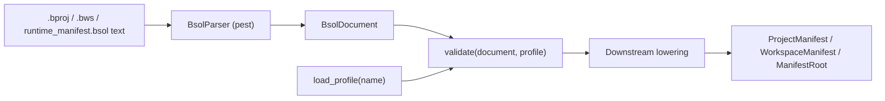

<!-- migrated from the legacy platform spec; canonical OpenSpec source -->
# Bsol (Beskid Structured Object Language) Specification

## Purpose

Normative surface grammar, generic AST, and schema profiles for Beskid manifest files.

## Requirements

### Requirement: Bsol (Beskid Structured Object Language) conformance status
This capability SHALL remain non-conformant and MUST NOT be cited as an implemented Beskid guarantee until a validated OpenSpec change adds explicit behavioral requirements.

**Stable ID:** `BSP-REQ-19BBF2805B3B`

#### Scenario: Capability has descriptive material only
- **GIVEN** the migrated sources contain no uppercase BCP-14 obligation or accepted ADR decision
- **WHEN** an implementation reports Beskid conformance
- **THEN** it MUST NOT claim conformance based on this capability

## Informative Source Provenance

The records below preserve migration history and are not normative except where text was extracted into a requirement above.

### Source Record: Bsol (Beskid Structured Object Language)

**Authority:** informative provenance  
**Legacy path:** `/platform-spec/tooling/manifests-and-lockfiles/bsol/`  
**Source:** `site/spec-content/platform-spec/tooling/manifests-and-lockfiles/bsol/content.md`  
**SHA-256:** `4f890eb0f2795fd6171ed8353d48a2a5ec149fa05affd9ec92becaf0d983f5f7`

<details>
<summary>Migrated source text</summary>

``````markdown
<SpecSection title="What Bsol is" id="what-bsol-is">
**Bsol** (Beskid Structured Object Language) is the shared meta-language for Beskid configuration documents: block-oriented assignment syntax used by **`*.bproj`** project manifests, **`*.bws`** / `workspace.proj` workspace manifests, and **`runtime_manifest.bsol`**.

Bsol specifies **lexical rules**, **generic surface grammar**, the **reference AST**, and **schema profiles**. Manifest **semantics** (required keys, project kinds, Mod blocks, link metadata, runtime ABI tables) remain in sibling contract features and profile-specific lowering crates.
</SpecSection>

<SpecSection title="Authority split" id="authority-split">
| Layer | Owner | Artifact |
| --- | --- | --- |
| Surface syntax + generic AST | **`beskid_bsol` crate** | `src/bsol.pest`, `src/ast.rs`, `parse_bsol_document` |
| Schema profiles | **`beskid_bsol` embedded profiles** | `schemas/project.v1.bsol`, `workspace.v1.bsol`, `runtime.v1.bsol` |
| Project / workspace semantics | Project / workspace contract features | `beskid_analysis::projects::model`, `validator` |
| Runtime ABI semantics | Runtime manifest profile + `beskid_manifest` | `runtime_manifest.bsol` → `ManifestRoot` |
| Diagnostics | Compiler resolution feature | E1801–E1899 meta-contract band after lowering |
</SpecSection>

<SpecSection title="Implementation anchors" id="implementation-anchors">
- `compiler/crates/beskid_bsol/` — grammar, generic AST, schema loader, `validate`
- `compiler/crates/beskid_analysis/src/projects/parser.rs` — lowers `project.v1` / `workspace.v1` to typed manifests
- `compiler/crates/beskid_manifest/` — loads `runtime_manifest.bsol` via `runtime.v1`
- `compiler/runtime_manifest.bsol` — authoritative runtime ABI manifest
- Unit tests: `beskid_bsol`, `beskid_analysis::projects::parser`, `beskid_manifest`
</SpecSection>

## Decisions
<!-- spec:generate:adr-index -->
No ADRs published under **`adr/`** yet.
<!-- /spec:generate:adr-index -->
## Articles
<!-- spec:generate:article-index -->
- [Design model](./articles/design-model/)
- [Runtime manifest profile](./articles/runtime-manifest-profile/)
- [Verification and traceability](./articles/verification-and-traceability/)
<!-- /spec:generate:article-index -->
``````

</details>

### Source Record: Design model

**Authority:** informative provenance  
**Legacy path:** `/platform-spec/tooling/manifests-and-lockfiles/bsol/articles/design-model/`  
**Source:** `site/spec-content/platform-spec/tooling/manifests-and-lockfiles/bsol/articles/design-model/content.md`  
**SHA-256:** `7d5bce6d8519578e60c102392e7d1ee5a18b590375950069d9379d8347c7ed07`

<details>
<summary>Migrated source text</summary>

``````markdown
## Vocabulary

| Construct | Role |
| --- | --- |
| **`bsol.pest`** | Authoritative PEG grammar (single syntactic truth for all Bsol documents) |
| **`BsolParser`** | Pest-derived parser entry type in `beskid_bsol` |
| **`BsolDocument`** | Generic root AST: ordered top-level blocks |
| **`SchemaProfile`** | Declarative rule set loaded from embedded `*.v1.bsol` profile files |
| **`ValidatedDocument`** | AST after schema validation; input to downstream lowering |
| **`ProjectManifest` / `WorkspaceManifest` / `ManifestRoot`** | Typed models produced **after** profile validation + lowering |

## Pipeline



## Lexical rules

- **Whitespace** (` `, tab, newline) is insignificant except as a separator.
- **Comments:** `#` to end of line, or `//` to end of line (not inside string literals at the grammar layer; manifest authors should avoid `#` inside quoted paths).
- **Identifiers:** ASCII letter or `_`, then alphanumeric/`_`.
- **Quoted strings:** `"..."` with no escape sequences (content between quotes is literal).
- **Bracket lists:** `[ item (, item)* ]` where each item is `default`, an identifier, or a quoted string.
- **Assignments:** `ident = value` with optional surrounding whitespace.

## Surface document shape

A Bsol document is a sequence of blocks. Each block has the same syntactic form:

```bsol
block_kind optional "label" {
  key = value
  nested_block { ... }
}
```

Optional **`@schemaless`** before `{` captures the inner `{ ... }` text verbatim without parsing assignments (profile rule must set `schemaless = true`):

```bsol
opaque @schemaless {
  raw { nested } text preserved
}
```

When present, the AST stores the body in `BsolBlock.schemaless_body` instead of `items`.

Manifest-specific block kinds (`target`, `dependency`, `workspace`, `kernel`, …) are **not** encoded in the grammar. They are defined by **schema profiles** (`project.v1`, `workspace.v1`, `runtime.v1`).

## Normative Rust AST

The reference compiler **must** build the following types from a successful Bsol parse. Field names are stable contract surface for tooling, LSP, and test fixtures.

```rust
/// A parsed Bsol document (any profile).
pub struct BsolDocument {
    pub blocks: Vec<BsolBlock>,
}

/// One block in a Bsol document.
pub struct BsolBlock {
    pub span: BsolSpan,
    pub kind: String,                      // block keyword
    pub label: Option<BsolQuotedString>,   // optional quoted label
    pub schemaless_body: Option<String>,   // set when `@schemaless` is used
    pub items: Vec<BsolItem>,
}

/// Body item: assignment or nested block.
pub enum BsolItem {
    Assignment(BsolAssignment),
    Block(BsolBlock),
}

pub struct BsolAssignment {
    pub span: BsolSpan,
    pub key: String,
    pub value: BsolValue,
}

pub enum BsolValue {
    QuotedString(BsolQuotedString),
    Ident(String),
    BracketList(BsolBracketList),
}

pub struct BsolQuotedString {
    pub span: BsolSpan,
    pub value: String,
}

pub struct BsolBracketList {
    pub span: BsolSpan,
    pub items: Vec<BsolListItem>,
}

pub enum BsolListItem {
    Default,
    QuotedString(BsolQuotedString),
    Ident(String),
}

/// UTF-8 source span with 1-based line index for diagnostics.
pub struct BsolSpan {
    pub start: usize,
    pub end: usize,
    pub line: usize,
}
```

Source of truth in the repository: `beskid_bsol/crates/bsol-syntax/src/ast.rs`.

### BSOL v2 extensions

v2 adds optional syntax and schema features (backward compatible with v1 documents):

- **Attributes:** `[Deprecated(since = "2.0")]` on blocks
- **References:** `@node/label` in assignments and lists
- **Inline maps:** `{ key = value, ... }`
- **Typed validation:** `ValidatedValue` alongside string-compat `fields` map
- **Profile composition:** `extends`, `mixes`, `extend "base.v1"`, `import_schema` merge
- **Discriminated unions:** `variant "git" { require = [url, rev] }`
- **Migration routes:** `migration { from = "project.v1" ... }` with `beskid migrate-bsol`

Embedded v2 profiles: `project.v2`, `runtime.v2`, `board.v3`, `configuration.v2`, `schema.v2`.

## Schema profiles

Profiles ship embedded in `beskid_bsol` (`include_str!` from `schemas/`). The only non-declarative layer is the Rust bootstrap loader in `schema/load.rs`.

| Profile | Document | Lowering crate |
| --- | --- | --- |
| `project.v1` / `project.v2` | `*.bproj` project manifests | `beskid_analysis::projects::parser` |
| `workspace.v1` | `*.bws` / `workspace.proj` | `beskid_analysis::projects::parser` |
| `runtime.v1` / `runtime.v2` | `compiler/runtime_manifest.bsol` | `beskid_manifest::lower` |
| `board.v2` / `board.v3` | shell layout BSOL | `beskid_tools::shell::layout` |

Public API:

| API | Returns |
| --- | --- |
| `parse_bsol_document(&str)` | `Result<BsolDocument, BsolError>` |
| `load_profile(&str)` | `Result<SchemaProfile, BsolError>` |
| `validate(&BsolDocument, &SchemaProfile)` | `Result<ValidatedDocument, BsolError>` |

## Lowering boundary

Bsol parsing **stops** at `BsolDocument`. Schema validation rejects unknown blocks, missing labels, and invalid field types. The following are **not** Bsol syntax errors—they are manifest contract failures during lowering or validation:

- Missing required semantic fields after schema pass (`entry` on App targets, dependency path when `source = path`)
- Unknown or misplaced nested blocks (`mod` on host projects)
- Meta-contract band **E1801–E1899** (for example legacy `project { }`, corelib opt-out keys)
- Graph and lockfile rules in compiler resolution features

Downstream entry points (unchanged public surface):

| API | Returns |
| --- | --- |
| `parse_manifest(&str)` | `Result<ProjectManifest, ProjectError>` |
| `parse_workspace_manifest(&str)` | `Result<WorkspaceManifest, ProjectError>` |
| `beskid_manifest::load_manifest(path)` | `Result<ManifestRoot, String>` |

## Relationship to Beskid surface syntax

Bsol is a **distinct** meta-language from Beskid `.bd` source. It shares the pest-based implementation stack but uses its own grammar file (`beskid_bsol/src/bsol.pest`) and crate. Beskid program syntax remains specified under **[Surface syntax](/platform-spec/language-meta/surface-syntax/)**.
``````

</details>

### Source Record: Runtime manifest profile

**Authority:** informative provenance  
**Legacy path:** `/platform-spec/tooling/manifests-and-lockfiles/bsol/articles/runtime-manifest-profile/`  
**Source:** `site/spec-content/platform-spec/tooling/manifests-and-lockfiles/bsol/articles/runtime-manifest-profile/content.md`  
**SHA-256:** `8dcf93a5c3a950713b006ed6d61ae057bcdae007e3462db60a57e41a5f908cac`

<details>
<summary>Migrated source text</summary>

``````markdown
## Authority

The compiler runtime ABI tables are authored in **`compiler/runtime_manifest.bsol`**. This file replaces the former `runtime_manifest.toml` format (hard cutover).

Build-time consumers load the manifest via `beskid_manifest::load_manifest`, which:

1. Parses Bsol surface syntax (`parse_bsol_document`)
2. Validates against embedded profile **`runtime.v1`**
3. Lowers to `ManifestRoot` for codegen into ABI, host, runtime, and analysis registries

## Profile rules (`runtime.v1`)

| Block kind | Cardinality | Purpose |
| --- | --- | --- |
| `manifest` | exactly one | `abi_version` (u32) |
| `profile "name"` | many | Runtime profile owners (`minimal`, `std`, …) |
| `kernel` | many | Kernel symbol registration |
| `dispatch_usize` / `dispatch_ptr` / `dispatch_unit` / `dispatch_i64` | many | Typed dispatch table entries |
| `intrinsic` | many | Intrinsic symbol paths |

Schema source: `compiler/crates/beskid_bsol/schemas/runtime.v1.bsol`.

## Example

```bsol
manifest {
  abi_version = 4
}

profile "minimal" {
  owners = [language]
}

kernel {
  symbol = alloc
  name = Alloc
  params = [usize, ptr]
  returns = ptr
  injected = true
  beskid_path = [__alloc]
}

dispatch_i64 {
  tag = 1
  dispatch_key = print_i64
  name = PrintI64
  params = [i64]
  returns = unit
  injected = true
  beskid_path = [__print_i64]
  owner = language
}
```

## Generated artifacts

`beskid_manifest` codegen emits Rust sources consumed by:

- `beskid_abi` (dispatch tags, symbols, builtins)
- `beskid_analysis` (builtins registry)
- `beskid_host`, `beskid_runtime`, `beskid_engine`, `beskid_runtime_bridge`

Generated file banners reference `runtime_manifest.bsol` as the source of truth.

## Verification

```bash
cd compiler && cargo test -p beskid_manifest
cd compiler && cargo test -p beskid_tests abi::contracts
```
``````

</details>

### Source Record: Verification and traceability

**Authority:** informative provenance  
**Legacy path:** `/platform-spec/tooling/manifests-and-lockfiles/bsol/articles/verification-and-traceability/`  
**Source:** `site/spec-content/platform-spec/tooling/manifests-and-lockfiles/bsol/articles/verification-and-traceability/content.md`  
**SHA-256:** `1a0ea3ddb9199b579598dc4b7d6c6ea1cc9684f4ab20a787e053fa76f4be372e`

<details>
<summary>Migrated source text</summary>

``````markdown
## Compiler tests

| Topic | Path |
| --- | --- |
| Bsol parse + schema profile load | `beskid_bsol::schema::load::tests` |
| Project manifest lowering | `beskid_analysis::projects::parser::tests` |
| Runtime manifest lowering | `beskid_manifest::lower::tests`, `beskid_manifest::codegen::tests` |
| Link block merge spans | `beskid_analysis::external_library::manifest_merge::tests` |
| Manifest contract integration | `beskid_tests::projects::manifest` (when crate compiles) |

Run targeted gate:

```bash
cd compiler && cargo test -p beskid_bsol
cd compiler && cargo test -p beskid_analysis projects::
cd compiler && cargo test -p beskid_manifest
```

Full compiler workspace per project policy:

```bash
cd compiler && cargo test
```

## Spec maintenance

Grammar, AST, or profile shape changes **must** update, in order:

1. **`beskid_bsol/src/bsol.pest`** and **`ast.rs`** (keep in sync)
2. Embedded **`schemas/*.v1.bsol`** when validation rules change
3. **[Bsol design model](./design-model/)** Rust AST excerpt when public types change
4. **[Runtime manifest profile](./runtime-manifest-profile/)** when `runtime_manifest.bsol` rules change
5. Manifest contract articles when lowering semantics or diagnostic bands change
6. `cd site/website && bun run verify:trudoc -- --preset ci` after MDX edits

## Traceability matrix

| Bsol rule | Implementation | Verification |
| --- | --- | --- |
| BSOL-001 Single grammar file | `beskid_bsol/src/bsol.pest` | Pest compile via `BsolParser` derive |
| BSOL-002 Stable generic AST | `beskid_bsol/src/ast.rs` | Struct/enum names match design model |
| BSOL-003 Span-backed parse errors | `BsolError`, `ProjectError::ParseAt` | `projects::parser::tests::name_must_stay_quoted` |
| BSOL-004 Schema profiles | `beskid_bsol/schemas/*.v1.bsol` | `schema::load::tests`, profile validate tests |
| BSOL-005 Lowering defers semantics | `projects/parser.rs`, `beskid_manifest/lower.rs` | Existing E18xx manifest tests unchanged |
``````

</details>
