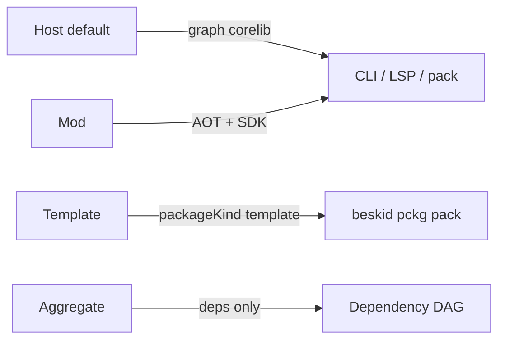

<!-- migrated from the legacy platform spec; canonical OpenSpec source -->
# Project manifest contract Specification

## Purpose

Project manifest schema including Mod project type, resolution inputs, and mod orchestration wiring.

## Requirements

### Requirement: Hub authority: Decision [D-TOOL-MAN-0001]
The Beskid standard SHALL enforce the following migrated contract section. Accepted ADR decisions are binding; uppercase requirement keywords retain their BCP-14 meaning.

> Hub owns Project.proj normative text.

**Stable ID:** `BSP-REQ-72018498B51F`  
**Legacy source:** `site/spec-content/platform-spec/tooling/manifests-and-lockfiles/project-manifest-contract/adr/0001-hub-authority/content.md`  
**Source SHA-256:** `46821e3fc5012e7e3e94b549978485f64b5b8602fd010c3401d8832c90f0d580`

#### Scenario: Conformance exercises Decision
- **GIVEN** an implementation claims conformance with this capability
- **WHEN** behavior governed by this contract section is exercised
- **THEN** every MUST, SHALL, REQUIRED, prohibition, and accepted decision in the section is satisfied

### Requirement: Mod and Template types: Decision [D-TOOL-MAN-0002]
The Beskid standard SHALL enforce the following migrated contract section. Accepted ADR decisions are binding; uppercase requirement keywords retain their BCP-14 meaning.

> May declare type Mod or Template; hosts use Host + corelib.

**Stable ID:** `BSP-REQ-A0B30F20C9DF`  
**Legacy source:** `site/spec-content/platform-spec/tooling/manifests-and-lockfiles/project-manifest-contract/adr/0002-mod-and-template-project-types/content.md`  
**Source SHA-256:** `350b8733b3edeba93154481d6b33984d01cb00a79833ec5507f22c1364220a1a`

#### Scenario: Conformance exercises Decision
- **GIVEN** an implementation claims conformance with this capability
- **WHEN** behavior governed by this contract section is exercised
- **THEN** every MUST, SHALL, REQUIRED, prohibition, and accepted decision in the section is satisfied

## Informative Source Provenance

The records below preserve migration history and are not normative except where text was extracted into a requirement above.

### Source Record: Project manifest contract

**Authority:** informative provenance  
**Legacy path:** `/platform-spec/tooling/manifests-and-lockfiles/project-manifest-contract/`  
**Source:** `site/spec-content/platform-spec/tooling/manifests-and-lockfiles/project-manifest-contract/content.md`  
**SHA-256:** `54c2ed599212ca2e683703a86494991f633b65e2a741f091eacae08c0fe84461`

<details>
<summary>Migrated source text</summary>

``````markdown
<SpecSection title="What this feature specifies" id="what-this-feature-specifies">
`Project manifest contract` defines one operational contract that a newcomer can follow end-to-end: first the model, then execution flow, then strict guarantees, concrete examples, and verification guidance.
</SpecSection>

<SpecSection title="Implementation anchors" id="implementation-anchors">
- Bsol parse + AST: `compiler/crates/beskid_analysis/src/bsol.pest`, `projects/bsol/`
- Manifest loading in `compiler/crates/beskid_analysis/src/services/`
- CLI project graph setup in `compiler/crates/beskid_cli/src/commands/`
- Workspace resolution in `compiler/crates/beskid_analysis/src/resolve/items.rs`
- Contract tests in `compiler/crates/beskid_tests/src/projects/corelib/mod.rs`
</SpecSection>

<SpecSection title="Mod project type (`Mod`)" id="meta-project-type">
A manifest may declare **`type: Mod`**. A **`Mod`** project is a compiler-mod package: discovered from the dependency graph, compiled AOT, and executed through SDK contracts during host compilation. See **[Compiler Mod SDK](/platform-spec/language-meta/metaprogramming/compiler-mod-sdk/)** and **[Compiler Mods](/platform-spec/compiler/compiler-mods/)**.

Normative **`project.mod`** keys (`maxGeneratorRounds`, `capabilities`, optional `artifactPolicy`) are specified in **[design model](./design-model/)**; **[examples](./examples/)** show illustrative manifests.

**v0.3 FFI:** optional **`project.link`** for foreign libraries is specified in **[project link libraries](./project-link-libraries/)** and populated via **[foreign library import](/platform-spec/tooling/foreign-library-import/)**.
</SpecSection>

<SpecSection title="Template project type (`Template`)" id="template-project-type">
A manifest may declare **`type: Template`** for template authoring packages. Consumer-facing scaffold contracts live under **[Project scaffolding](/platform-spec/tooling/project-scaffolding/)**. Instantiated **host** projects from templates follow normal `Host` rules; **corelib** is always implicit (no opt-out manifest flag).
</SpecSection>

<SpecSection title="Decisions" id="decisions">
No open decisions. **`D-TOOL-MAN-0001`** (hub authority), **`0002`** (Mod and Template project types), **`D-TOOL-MAN-0006`** (explicit use, no prelude; supersedes prelude ADRs under compiler and core-library)—see **`adr/`** and the **ADRs** tab.
</SpecSection>

## Decisions
<!-- spec:generate:adr-index -->
No open decisions. Closed choices are normative ADRs under **`adr/`** (`D-TOOL-MAN-0001` … `D-TOOL-MAN-0002`); use the reader **ADRs** tab for expandable detail.
<!-- /spec:generate:adr-index -->
## Articles
<!-- spec:generate:article-index -->
- [Contracts and edge cases](./articles/contracts-and-edge-cases/)
- [Design model](./articles/design-model/)
- [Examples](./articles/examples/)
- [FAQ and troubleshooting](./articles/faq-and-troubleshooting/)
- [Flow and algorithm](./articles/flow-and-algorithm/)
- [Project link libraries](./articles/project-link-libraries/)
- [Verification and traceability](./articles/verification-and-traceability/)
<!-- /spec:generate:article-index -->
``````

</details>

### Source Record: Hub authority

**Authority:** informative provenance  
**Legacy path:** `/platform-spec/tooling/manifests-and-lockfiles/project-manifest-contract/adr/0001-hub-authority/`  
**Source:** `site/spec-content/platform-spec/tooling/manifests-and-lockfiles/project-manifest-contract/adr/0001-hub-authority/content.md`  
**SHA-256:** `46821e3fc5012e7e3e94b549978485f64b5b8602fd010c3401d8832c90f0d580`

<details>
<summary>Migrated source text</summary>

``````markdown
## Context

Consumers need one contract.

## Decision

Hub owns Project.proj normative text.

## Consequences

Mod/Template on hub.

## Verification anchors

manifest tests.
``````

</details>

### Source Record: Mod and Template types

**Authority:** informative provenance  
**Legacy path:** `/platform-spec/tooling/manifests-and-lockfiles/project-manifest-contract/adr/0002-mod-and-template-project-types/`  
**Source:** `site/spec-content/platform-spec/tooling/manifests-and-lockfiles/project-manifest-contract/adr/0002-mod-and-template-project-types/content.md`  
**SHA-256:** `350b8733b3edeba93154481d6b33984d01cb00a79833ec5507f22c1364220a1a`

<details>
<summary>Migrated source text</summary>

``````markdown
## Context

Discriminate project kinds.

## Decision

May declare type Mod or Template; hosts use Host + corelib.

## Consequences

Links to mods/scaffolding.

## Verification anchors

project fixtures.
``````

</details>

### Source Record: Contracts and edge cases

**Authority:** informative provenance  
**Legacy path:** `/platform-spec/tooling/manifests-and-lockfiles/project-manifest-contract/articles/contracts-and-edge-cases/`  
**Source:** `site/spec-content/platform-spec/tooling/manifests-and-lockfiles/project-manifest-contract/articles/contracts-and-edge-cases/content.md`  
**SHA-256:** `c49fdc085ed6cc94e4fee016c04b76c902c3adcaf57a4976e84b4e97296b59c1`

<details>
<summary>Migrated source text</summary>

``````markdown
## Contracts

- **`Mod` must be explicit** — Compiler-mod contracts (`Collector`, `Generator`, `Analyzer`, `Rewriter`, `AttributeGenerator`) are valid only in `type: Mod` projects.
- **No host targets on Mod projects** — `Mod` manifests must not declare App/Lib/Test `target` blocks.
- **Transitive discovery** — Host compilations auto-load all transitive `Mod` dependencies from the resolved graph.
- **Scope via Collector** — Target narrowing is declared by `Collector` contracts, not manifest attach metadata.
- **AOT-only execution** — Mod packages compile to AOT artifacts; no compile-time JIT path is normative.

## Edge cases

- **Invalid `project.mod` keys** — Unknown keys error with stable codes (**E1801–E1810**).
- **Capability denial** — Effects without granted capability fail with **E1821–E1835** diagnostics.
- **Generator round exhaustion** — Exceeding `maxGeneratorRounds` is a hard error, not a silent partial program.
- **Conflicting typed contributions** — Merge failures use **E1836–E1850** and leave syntax unchanged.
``````

</details>

### Source Record: Design model

**Authority:** informative provenance  
**Legacy path:** `/platform-spec/tooling/manifests-and-lockfiles/project-manifest-contract/articles/design-model/`  
**Source:** `site/spec-content/platform-spec/tooling/manifests-and-lockfiles/project-manifest-contract/articles/design-model/content.md`  
**SHA-256:** `c67e1caa32db18d80a002a6e045ee862278e83d2390e885d9eb47241a93bae23`

<details>
<summary>Migrated source text</summary>

``````markdown
## Purpose

Tooling-facing shape of **`.bproj`** project manifests: project kind, mod orchestration block, template metadata, readme publishing, and host `app` launch rules. Files are written in **[Bsol](/platform-spec/tooling/manifests-and-lockfiles/bsol/)** and parsed to `BsolDocument` before lowering to `ProjectManifest`. Resolution-graph behavior and diagnostic bands live in **[Project manifest contract (compiler)](/platform-spec/compiler/resolution-and-projects/project-manifest-contract/)**—this article does not duplicate full manifest key tables from the manifests area hub.

## On-disk naming

| Rule | Detail |
| --- | --- |
| Extension | **`.bproj`** only (legacy **`Project.proj`** → **E1894**) |
| Location | Project root; exactly one `*.bproj` per directory |
| Filename | **Should** equal `{name}.bproj` (for example `corelib.bproj` when `name = "corelib"`) |

## Named root block

The manifest **must** contain exactly one named root block. The block kind **must** equal the `name` field (**E1896** on mismatch). The legacy `project { ... }` wrapper is rejected (**E1894**).

```text
myapp {
  name    = "myapp"
  version = "0.1.0"
  root    = "Src"
}

target "App" {
  kind  = App
  entry = "Main.bd"
}
```

## Extras on the root block

Keys other than `name`, `version`, `root`, `root_namespace`, `type`, and `readme` are stored in **`project.extras`**. The compiler **must not** interpret extras unless a feature contract names them. Manifests **must not** use extras to opt out of corelib graph attachment (`noCorelib`, `useCorelib = false` → **E1876**).

## Project kinds



| `type` | Role |
| --- | --- |
| *(omitted)* | **`Host`** — default application or library project |
| **`Mod`** | Compiler-mod package (see below) |
| **`Template`** | Template authoring; published as **`packageKind: template`** |
| **`Aggregate`** | Dependency-only aggregate; **must not** declare `target` blocks; **must** declare at least one `dependency` |

Unknown `type` values **must** be rejected at structural parse time (**E1807**).

### Host projects and corelib

Every host project **must** resolve **corelib** through toolchain graph attachment (implicit `Std` / `corelib` path when not already declared). This is **dependency graph** wiring only—see **[Explicit use, no prelude](/platform-spec/tooling/manifests-and-lockfiles/adr/0006-explicit-use-no-prelude/)** for symbol visibility. Manifests **must not** define `noCorelib`, `useCorelib: false`, or equivalent opt-out keys.

### Aggregate projects (`Aggregate`)

Aggregate manifests model packages that exist only to group path dependencies—canonical **`corelib`** is the reference:

```text
corelib {
  name    = "corelib"
  version = "0.1.0"
  type    = Aggregate
}

dependency "corelib_foundation" {
  source = path
  path   = "../packages/foundation"
}
```

| Rule | Detail |
| --- | --- |
| Targets | **Forbidden** — **E188x** band when `target` blocks are present |
| Dependencies | **Required** — at least one `dependency` block |
| `root` | Defaults to empty string when omitted (no standalone source tree on the aggregate node) |
| Prelude | Aggregate corelib **must not** ship `Prelude.bd`; consumers import shard modules via explicit `use` after path/registry deps |

## Targets and `entry`

| `target.kind` | `entry` |
| --- | --- |
| **`App`** | **Required** — path relative to `project.root` |
| **`Test`** | **Required** |
| **`Lib`** | **Optional** — when omitted, tooling discovers `.bd` files under `project.root` (workspace scan) |

## Package readme (`readme`)

The root block **may** include `readme = "relative/path.md"`. When omitted, tooling treats **`readme.md`** at the project root as the default when present. `beskid pckg pack` publishes the resolved file as root **`README.md`** in the `.bpk` artifact.

## Mod project type (`Mod`)

When set to **`Mod`**, the manifest denotes a compiler-mod package discovered through dependency resolution, compiled AOT, and loaded via SDK contracts during host compilation. User-visible contract semantics: **[Compiler Mod SDK](/platform-spec/language-meta/metaprogramming/compiler-mod-sdk/)**.

### On-disk nesting

```text
my_mod {
  name    = "my_mod"
  version = "0.1.0"
  type    = Mod
  mod {
    maxGeneratorRounds = 4
    capabilities       = [emit_syntax]
    generatedOutputs   = [
      { layout = "generate.layout.json", root = "Generated" }
    ]
    artifactPolicy     = reuse
  }
}
```

### Normative `mod { }` keys (v0.2 target)

| Key | Required | Meaning |
| --- | --- | --- |
| `maxGeneratorRounds` | no | Positive cap on generator replay; default `4` |
| `capabilities` | no | Closed vocabulary (`emit_syntax`, `read_project_sources`, `query_semantic_snapshot`, `extern_ffi`, `rewrite_syntax`) |
| `generatedOutputs` | no | When present, host **may** materialize generator output to disk on Collector target fingerprint miss. Each entry names a **`layout`** file (relative to project root) and a **`root`** directory for emitted `.bd` paths. Disk write is optional and compiler-owned—there is no `beskid mod generate` CLI. |
| `artifactPolicy` | no | Cache policy for fetched mods (`reuse`, `rebuild`, `clean_rebuild`); governs mod artifact invalidation before collect/generate during rebuild and host builds |

Validation phases: structural parse in `ProjectManifest` build, then graph validation for mod topology (**E1801–E1899** band).

## Grammar block (`grammar { }`)

Consumer projects that ship embedded Pest grammars **may** declare a root-level **`grammar`** block. Keys **must** use **camelCase** (BSOL manifest convention). The block tells `GrammarGenerator` mods (for example `corelib_pest_gen`) which `.pest` roots to collect and where to emit generated combinator modules.

```text
my_dsl {
  name    = "my_dsl"
  version = "0.1.0"
  root    = "Src"

  grammar {
    roots = ["grammars"]
    grammarOutput {
      pest      = "grammars/regex.pest"
      module    = "Core.Text.Regex.Generated"
      packageId = "corelib_foundation"
    }
  }
}
```

| Key | Required | Meaning |
| --- | --- | --- |
| `roots` | no | Directory paths (relative to project root) scanned for `*.pest` files when no per-entry `pest` path is given |
| `grammarOutput` | no | Single output binding; repeatable as additional `grammarOutput` entries when multiple generated modules are required |
| `grammarOutput.pest` | yes (per entry) | Source `.pest` file path relative to project root |
| `grammarOutput.module` | yes (per entry) | Beskid module path for emitted combinator sources (for example `Core.Text.Regex.Generated`) |
| `grammarOutput.packageId` | yes (per entry) | Owning package id in the workspace graph (for example `corelib_foundation`) |

The compiler lowers the block to `ProjectGrammarSection` / `GrammarOutputEntry` in the resolution model. Disk materialization is compiler-owned on `GrammarGenerator` fingerprint miss—there is no `beskid mod generate` CLI. Mod tunables (callable prefix, term emission) live in a separate **`pestGenConfig`** BSOL schema read by the mod package, not in the consumer `grammar` block.

## Application host and `app` target

Hosted applications use the **`app`** executable target. The entry module **must** perform exactly one **`launch SomeHost(...)`** per run. **`Lib`** projects **may** declare reusable **`host`** types but **must not** use **`launch`**.

## Template project type (`Template`)

Optional nested block:

```text
my_template {
  name    = "my_template"
  version = "0.1.0"
  type    = Template
  template {
    shortName = "console"
    identity  = "beskid.templates.console"
  }
}
```

Authoritative engine manifest: **`.beskid/template.json`** (`beskid.template.v1`). See **[Template packages](/platform-spec/tooling/project-scaffolding/template-packages/)**.

## Implementation anchors

- Parse + validation: `compiler/crates/beskid_analysis/src/projects/parser.rs`, `validator.rs`
- Discovery: `compiler/crates/beskid_analysis/src/projects/discovery.rs` (`.bproj`, E1894)
- Manifest resolve: `compiler/crates/beskid_analysis/src/projects/manifest_resolve.rs`
- Graph + plan: `compiler/crates/beskid_analysis/src/projects/graph/`, `compile_plan.rs`
- Pack profile: `compiler/crates/beskid_pckg/src/pack.rs`
``````

</details>

### Source Record: Examples

**Authority:** informative provenance  
**Legacy path:** `/platform-spec/tooling/manifests-and-lockfiles/project-manifest-contract/articles/examples/`  
**Source:** `site/spec-content/platform-spec/tooling/manifests-and-lockfiles/project-manifest-contract/articles/examples/content.md`  
**SHA-256:** `9c2e91c3d349da6ea38f5b12b0cee506a6c2213582f9d28fc16fa08693dd051f`

<details>
<summary>Migrated source text</summary>

``````markdown
## Illustrative `Mod` project manifest

```text
project {
  name = "serialization-mod"
  version = "0.1.0"
  root = "Src"
  type = Mod
  mod {
    maxGeneratorRounds = 6
    capabilities = [read_project_sources, emit_syntax]
  }
}

dependency "compiler-sdk" {
  source = registry
  version = "..."
}
```

`Mod` projects **must not** declare host `target` blocks. Discovery is contract-based; scope narrowing is implemented in `Collector` contracts, not manifest attach fields.

## Host app depending on a mod package

```text
project {
  name = "demo-app"
  version = "0.1.0"
}

target "main" {
  kind = App
  entry = "Main.bd"
}

dependency "serialization" {
  source = registry
  version = "..."
}
```

The compiler auto-loads transitive `Mod` dependencies (for example `serialization-mod` referenced by `serialization`) and runs their contracts during host compilation.

## Mod artifact management commands

- `beskid mod rebuild` — clean and rebuild mod artifacts for the active workspace slice.
- `beskid mod clean` — remove cached mod artifacts under the object store.

**`beskid mod generate`** is not normative. Typed generation and optional disk writes run during host builds when Collector targets miss their fingerprint; mods declare materialization roots via **`generatedOutputs`** in the `mod { }` block (see **[design model](/platform-spec/tooling/manifests-and-lockfiles/project-manifest-contract/design-model/)**).

See **[Compiler Mod SDK](/platform-spec/language-meta/metaprogramming/compiler-mod-sdk/)** and **[Compiler Mods](/platform-spec/compiler/compiler-mods/)** for contract and host execution details.

## Template authoring project

```text
project {
  name    = "beskid-templates-console"
  version = "0.0.0"
  type    = Template
  template {
    shortName = "console"
    identity  = "beskid.templates.console"
  }
}
```

Pack publishes **`packageKind: template`** and **`.beskid/template.json`**. See **[Project templates](/platform-spec/tooling/project-scaffolding/project-templates/examples/)**.

## Instantiated console app (template output)

Template-generated host project (no corelib opt-out; corelib resolved on `beskid lock`):

```text
project {
  name    = "MyApp"
  version = "0.1.0"
  root    = "Src"
}

target "app" {
  kind  = App
  entry = "Main.bd"
}
```
``````

</details>

### Source Record: FAQ and troubleshooting

**Authority:** informative provenance  
**Legacy path:** `/platform-spec/tooling/manifests-and-lockfiles/project-manifest-contract/articles/faq-and-troubleshooting/`  
**Source:** `site/spec-content/platform-spec/tooling/manifests-and-lockfiles/project-manifest-contract/articles/faq-and-troubleshooting/content.md`  
**SHA-256:** `e7f7cad3a5dd7c77658f42911075d0450be4359270e321ad955e7afd09de474f`

<details>
<summary>Migrated source text</summary>

``````markdown
## Unknown `project.type`

Only `Host` (omitted), `Mod`, and `Template` are valid. Typos fail structural parse with stable diagnostics (**E1801–E1899** band — see compiler manifest feature).

## Mod contracts in a host project

Move compiler-mod code to a `type: Mod` dependency package. Hosts consume mods through the graph, not inline contract definitions.

## `maxGeneratorRounds` ignored

Ensure `mod { }` is nested under `project`, not a top-level block. Unknown `mod` keys error at parse time.

## Readme missing on pckg after pack

Set `readme = "docs/README.md"` or add root `readme.md`. `beskid pckg pack` maps the resolved file to zip root `README.md`.

## Template `shortName` mismatch

Align `project.template.shortName` with `.beskid/template.json` when both are present.

## Full key reference

See **[Project manifest contract (compiler)](/platform-spec/compiler/resolution-and-projects/project-manifest-contract/)** and the manifests area hub—avoid duplicating tables in tooling articles.
``````

</details>

### Source Record: Flow and algorithm

**Authority:** informative provenance  
**Legacy path:** `/platform-spec/tooling/manifests-and-lockfiles/project-manifest-contract/articles/flow-and-algorithm/`  
**Source:** `site/spec-content/platform-spec/tooling/manifests-and-lockfiles/project-manifest-contract/articles/flow-and-algorithm/content.md`  
**SHA-256:** `ab906fd15dc340dbad48c2e3273bbff844d0029ba4382a4b567db64bdc4ef0aa`

<details>
<summary>Migrated source text</summary>

``````markdown
## Validation flow

1. Parse `Project.proj` into `ProjectManifest`.
2. Classify project type. If **`Mod`**, validate optional `project.mod` keys (`maxGeneratorRounds`, `capabilities`, `artifactPolicy`).
3. Insert node into workspace/project graph; reject invalid Mod dependency topology.
4. For host builds, resolve transitive `Mod` dependencies and ensure AOT artifacts are available (build or cache hit).

## Host compilation flow

1. Build `CompilePlan` for App/Lib/Test host target.
2. Resolve transitive `Mod` packages from dependency graph.
3. Load/build mod AOT artifacts (`mod.load`).
4. Run `Collector` → `Generator` → semantic → `Analyzer` → optional `Rewriter` per **[Stage ordering](/platform-spec/compiler/build-pipeline/stage-ordering/)**.

Lockfile and materialized dependency roots for mod packages use the same workspace materialization path as ordinary projects.
``````

</details>

### Source Record: Project link libraries

**Authority:** informative provenance  
**Legacy path:** `/platform-spec/tooling/manifests-and-lockfiles/project-manifest-contract/articles/project-link-libraries/`  
**Source:** `site/spec-content/platform-spec/tooling/manifests-and-lockfiles/project-manifest-contract/articles/project-link-libraries/content.md`  
**SHA-256:** `0c82a5f6ee4061c114e19661269cb589537db69ba65a5ce3f913fe28db7beebe`

<details>
<summary>Migrated source text</summary>

``````markdown
## `project.link` block (v0.3)

Hosts **must** parse a nested block under `project`:

```text
project:
  name: myapp
  link:
    libraries: [libc, pthread]
    searchPaths: [/usr/lib, /opt/local/lib]
    extraArgs: ["-lm"]
```

| Key | Required | Meaning |
| --- | --- | --- |
| **`libraries`** | no | Logical names matching `Extern` `Library` fields; resolved via **[ExternalLibrary](/platform-spec/tooling/foreign-library-import/external-library-trait/)** |
| **`searchPaths`** | no | Additional linker search paths |
| **`extraArgs`** | no | Raw linker arguments appended after provider resolution |

Unknown keys **must** error with stable diagnostics (manifest band **E1801–E1899** or dedicated link band when assigned).

## Validation

1. Every **`Extern`** `Library` string used by the project **should** appear in `link.libraries` or be resolved by a provider without manifest entry (provider-defined).
2. Conflicting resolutions between manifest and CLI import **must** be diagnosed at build time.

## Platform tables (optional extension)

Projects **may** add host-scoped tables in a later manifest revision:

```text
link:
  linux:
    libraries: [libc.so.6]
  macos:
    libraries: [libc]
```

Until host tables are implemented, platform packages (console, threading) carry per-file `Extern` `Library` strings as today.

## WinAPI

**WinAPI** / MSVC link metadata is **not** required for stdlib **Standard** manifests ([platform tier matrix](/platform-spec/language-meta/interop/c-abi-profile/platform-tier-matrix/)).

## Verification anchors

- **Model:** `compiler/crates/beskid_analysis/src/projects/model.rs::ProjectLinkSection`.
- **Parser:** `compiler/crates/beskid_analysis/src/projects/parser.rs::parse_link_block_contents` (top-level `link { ... }` block; accepts `libraries`, `searchPaths`, `extraArgs` list fields only).
- **Validator:** `compiler/crates/beskid_analysis/src/projects/validator.rs::validate_link_section` (diagnostic band **E1890** duplicate block / **E1891** unknown field / **E1892** empty entry / **E1893** duplicate library).
- **Round-trip tests:** parser unit tests in `projects::parser::tests::parse_link_block_*` and CLI integration tests in `compiler/crates/beskid_tests/src/cli/import_lib.rs`.
``````

</details>

### Source Record: Verification and traceability

**Authority:** informative provenance  
**Legacy path:** `/platform-spec/tooling/manifests-and-lockfiles/project-manifest-contract/articles/verification-and-traceability/`  
**Source:** `site/spec-content/platform-spec/tooling/manifests-and-lockfiles/project-manifest-contract/articles/verification-and-traceability/content.md`  
**SHA-256:** `9f9b2d0744470d9195c1ea77528411beb91c7d5405b0c78a809d5fe90823089b`

<details>
<summary>Migrated source text</summary>

``````markdown
## Compiler tests

| Topic | Path |
| --- | --- |
| Corelib + manifest helpers | `compiler/crates/beskid_tests/src/projects/corelib/mod.rs` |
| Mod manifest validation | Compiler-mod test suites + Bsol lowering tests in `projects/parser.rs` |
| Pack profile from manifest | `beskid_pckg/src/pack.rs` tests |

## Tooling traceability

| Tooling rule | Verification |
| --- | --- |
| `Mod` type routing | `detect_pack_profile` + graph `ProjectKind::Mod` |
| Template `packageKind` | pckg server template integration tests |
| Readme injection | Pack tests + `PackagePublishDocumentationTests` |
| Corelib opt-out forbidden | `reject_corelib_opt_out_keys` parser tests |

## Spec maintenance

Manifest vocabulary changes **must** update: tooling **[design model](./design-model/)**, compiler project-manifest feature, **[Diagnostic code registry](/platform-spec/compiler/semantic-pipeline/diagnostic-code-registry/)**, and any template scaffolds under `beskid_templates/`.

## CI

Run `cd site/website && bun run verify:trudoc -- --preset ci` after MDX edits; compiler `cargo test` for touched parser/graph modules.
``````

</details>
