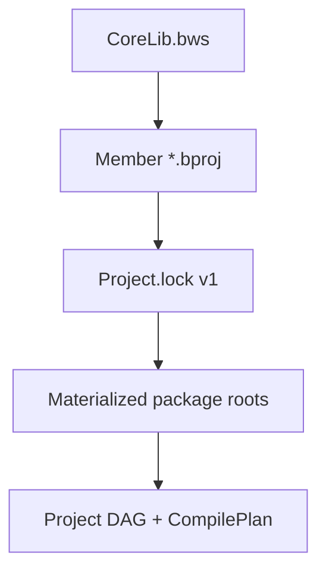
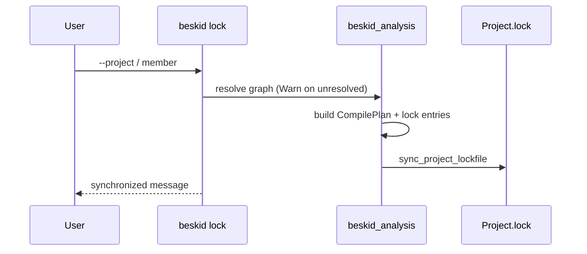

<!-- migrated from the legacy platform spec; canonical OpenSpec source -->
# Workspace and lock contracts Specification

## Purpose

Workspace manifest and lockfile behavior for dependency resolution, reproducibility, and update flows.

## Requirements

### Requirement: Hub authority: Decision [D-TOOL-MAN-0001]
The Beskid standard SHALL enforce the following migrated contract section. Accepted ADR decisions are binding; uppercase requirement keywords retain their BCP-14 meaning.

> Hub owns workspace and lock rules.

**Stable ID:** `BSP-REQ-4CF0609B398D`  
**Legacy source:** `site/spec-content/platform-spec/tooling/manifests-and-lockfiles/workspace-and-lock-contracts/adr/0001-hub-authority/content.md`  
**Source SHA-256:** `be3de69d53c52480d2d9a280c3d95015699a663f15470169e426811aed536194`

#### Scenario: Conformance exercises Decision
- **GIVEN** an implementation claims conformance with this capability
- **WHEN** behavior governed by this contract section is exercised
- **THEN** every MUST, SHALL, REQUIRED, prohibition, and accepted decision in the section is satisfied

### Requirement: CLI lock mutations: Decision [D-TOOL-MAN-0002]
The Beskid standard SHALL enforce the following migrated contract section. Accepted ADR decisions are binding; uppercase requirement keywords retain their BCP-14 meaning.

> fetch/lock must use CLI resolver.

**Stable ID:** `BSP-REQ-370E7A9A4EAD`  
**Legacy source:** `site/spec-content/platform-spec/tooling/manifests-and-lockfiles/workspace-and-lock-contracts/adr/0002-lock-mutations-via-cli/content.md`  
**Source SHA-256:** `2b402d2da94d7cf7f022b3c6b390e3b6f38b043c2356980f82bd85632b3e8929`

#### Scenario: Conformance exercises Decision
- **GIVEN** an implementation claims conformance with this capability
- **WHEN** behavior governed by this contract section is exercised
- **THEN** every MUST, SHALL, REQUIRED, prohibition, and accepted decision in the section is satisfied

## Informative Source Provenance

The records below preserve migration history and are not normative except where text was extracted into a requirement above.

### Source Record: Workspace and lock contracts

**Authority:** informative provenance  
**Legacy path:** `/platform-spec/tooling/manifests-and-lockfiles/workspace-and-lock-contracts/`  
**Source:** `site/spec-content/platform-spec/tooling/manifests-and-lockfiles/workspace-and-lock-contracts/content.md`  
**SHA-256:** `6e25b41663a0ec7d75d49768da0f0c1d8813162a72ac3bf4d54a5b73e92821f4`

<details>
<summary>Migrated source text</summary>

``````markdown
<SpecSection title="What this feature specifies" id="what-this-feature-specifies">
`Workspace and lock contracts` defines one operational contract that a newcomer can follow end-to-end: first the model, then execution flow, then strict guarantees, concrete examples, and verification guidance.
</SpecSection>

<SpecSection title="Implementation anchors" id="implementation-anchors">
- Lock/update commands in `compiler/crates/beskid_cli/src/commands/`
- Project and dependency resolution in `compiler/crates/beskid_analysis/src/resolve/mod.rs`
- Workspace tests in `compiler/crates/beskid_tests/src/analysis/pipeline/core.rs`
- Corelib package tests in `compiler/crates/beskid_tests/src/projects/corelib/layout.rs`
</SpecSection>

<SpecSection title="Decisions" id="decisions">
No open decisions. **`D-TOOL-MAN-0001`** (hub authority), **`0002`** (lock mutations via CLI)—see **`adr/`** and the **ADRs** tab.
</SpecSection>

## Decisions
<!-- spec:generate:adr-index -->
No open decisions. Closed choices are normative ADRs under **`adr/`** (`D-TOOL-MAN-0001` … `D-TOOL-MAN-0002`); use the reader **ADRs** tab for expandable detail.
<!-- /spec:generate:adr-index -->
## Articles
<!-- spec:generate:article-index -->
- [Contracts and edge cases](./articles/contracts-and-edge-cases/)
- [Design model](./articles/design-model/)
- [Examples](./articles/examples/)
- [FAQ and troubleshooting](./articles/faq-and-troubleshooting/)
- [Flow and algorithm](./articles/flow-and-algorithm/)
- [Verification and traceability](./articles/verification-and-traceability/)
<!-- /spec:generate:article-index -->
``````

</details>

### Source Record: Hub authority

**Authority:** informative provenance  
**Legacy path:** `/platform-spec/tooling/manifests-and-lockfiles/workspace-and-lock-contracts/adr/0001-hub-authority/`  
**Source:** `site/spec-content/platform-spec/tooling/manifests-and-lockfiles/workspace-and-lock-contracts/adr/0001-hub-authority/content.md`  
**SHA-256:** `be3de69d53c52480d2d9a280c3d95015699a663f15470169e426811aed536194`

<details>
<summary>Migrated source text</summary>

``````markdown
## Context

Lock alignment.

## Decision

Hub owns workspace and lock rules.

## Consequences

CLI/IDE defer.

## Verification anchors

resolution tests.
``````

</details>

### Source Record: CLI lock mutations

**Authority:** informative provenance  
**Legacy path:** `/platform-spec/tooling/manifests-and-lockfiles/workspace-and-lock-contracts/adr/0002-lock-mutations-via-cli/`  
**Source:** `site/spec-content/platform-spec/tooling/manifests-and-lockfiles/workspace-and-lock-contracts/adr/0002-lock-mutations-via-cli/content.md`  
**SHA-256:** `2b402d2da94d7cf7f022b3c6b390e3b6f38b043c2356980f82bd85632b3e8929`

<details>
<summary>Migrated source text</summary>

``````markdown
## Context

Resolver bypass risk.

## Decision

fetch/lock must use CLI resolver.

## Consequences

Matches VSC-0002.

## Verification anchors

CLI integration.
``````

</details>

### Source Record: Contracts and edge cases

**Authority:** informative provenance  
**Legacy path:** `/platform-spec/tooling/manifests-and-lockfiles/workspace-and-lock-contracts/articles/contracts-and-edge-cases/`  
**Source:** `site/spec-content/platform-spec/tooling/manifests-and-lockfiles/workspace-and-lock-contracts/articles/contracts-and-edge-cases/content.md`  
**SHA-256:** `42d5a92739decad9a38d9230e725aa207677eace977d6ccb463a56013e4a8cb7`

<details>
<summary>Migrated source text</summary>

``````markdown
## Contracts

- **Lock header version** — Only `# Project.lock v1` is accepted; unknown headers **must** error.
- **Required lock fields** — Each dependency entry **must** include materialized and source roots for replay.
- **Registry alias resolution** — Unknown aliases **must** fail at fetch time with actionable messages.
- **Workspace member integrity** — Every `member` path **must** resolve to a `Project.proj` under the workspace root.
- **Reproducible materialization** — `materialized_root` paths **must** be stable for a given lock file on the same machine class (OS-specific subtrees allowed when documented in compiler feature).

## Edge cases

| Case | Behavior |
| --- | --- |
| Missing lock under strict CLI policy | `build`/`run` fail before compile |
| Stale lock after manifest edit | `lock`/`update` rewrite; LSP invalidates compilation cache |
| Partial fetch failure | Unresolved dependency policy (`Warn` vs `Error`) controls whether graph proceeds |
| Duplicate dependency names | Validation error during graph build |
| Corelib-only path fallback | Implicit `Std` edge omitted for corelib workspace shards to avoid cycles |

## pckg integration

Published workspace bundles on the registry use server-side validation in `pckg/src/Server/Services/Workspace/` (`WorkspacePublishService`, `WorkspacePackageManifest`). Client-side `beskid pckg` commands **must** emit manifests compatible with those validators before upload.
``````

</details>

### Source Record: Design model

**Authority:** informative provenance  
**Legacy path:** `/platform-spec/tooling/manifests-and-lockfiles/workspace-and-lock-contracts/articles/design-model/`  
**Source:** `site/spec-content/platform-spec/tooling/manifests-and-lockfiles/workspace-and-lock-contracts/articles/design-model/content.md`  
**SHA-256:** `938767a15964abbba3da129843b2ebf16b6df33ee0c6518b9eb68b8b50b2285b`

<details>
<summary>Migrated source text</summary>

``````markdown
## Purpose

Tooling-facing contract for **`.bws`** workspace manifests, per-member **`.bproj`** graphs, and **`Project.lock`** v1 files that pin materialized dependency roots. The compiler realizes graph resolution and lock sync in `beskid_analysis::projects`; this article defines what operators and CLI commands may assume without restating full manifest key tables.

## Artifacts



| Artifact | Role |
| --- | --- |
| **`.bws` workspace manifest** | Declares `member` projects, registry URL aliases, optional dependency overrides; legacy **`Workspace.proj`** → **E1895** |
| **`.bproj` member manifest** | Declares dependencies, targets, project kind (`Host`, `Mod`, `Template`, `Aggregate`) — see **[Project manifest contract](/platform-spec/tooling/manifests-and-lockfiles/project-manifest-contract/)** |
| **`Project.lock`** | Records `root_manifest`, resolved dependency names, `manifest` paths, `source_root`, `materialized_root` |

## Workspace block and extras

Known fields on `workspace { }`: **`name`**, **`resolver`** (default `v1`). Additional keys land in **`workspace.extras`**.

| Extra key | Semantics |
| --- | --- |
| **`defaultTestMember`** | Member label selected when resolving a workspace path without `--workspace-member` and without a source path under a member tree |
| **`schema`** | Informational workspace schema id (for example `beskid.workspace.v1`); not a compiler graph input |

Example:

```text
workspace {
  name               = "corelib"
  resolver           = v1
  schema             = "beskid.workspace.v1"
  defaultTestMember  = "corelib_tests"
}
```

## Member blocks and merged metadata

Each `member "<label>" { path = "..." }` block **must** include a unique label and **`path`** relative to the workspace root. Keys other than **`path`** are stored in **`member.extras`**—publish and editor metadata merged from the workspace manifest, **not** a substitute for the member's `.bproj`:

| Extra key | Role |
| --- | --- |
| **`package`** | Registry package id for the member (may differ from `.bproj` `name`) |
| **`description`** | Human-readable summary for registry UI and docs |
| **`category`** | Coarse kind hint (for example `Library`, `Test`) |
| **`tags`** | Search/filter tags (Bsol bracket list or repeated assignments per Bsol profile) |

```text
member "foundation" {
  path        = "packages/foundation"
  package     = "corelib_foundation"
  description = "Low-level primitives shared by Beskid corelib workspace packages."
  category    = "Library"
  tags        = ["corelib", "foundation", "beskid"]
}
```

Member selection when `--workspace-member` is omitted: longest-prefix match of the input path against member roots, then **`defaultTestMember`**, then the first declared member.

## Resolution rules surface

`WorkspaceResolutionRules` (in `resolver.rs`) carries:

- `workspace_root` and `workspace_members`
- `overrides_by_dependency` (version pins)
- `registry_aliases` and `registry_urls` for `beskid fetch` / registry client

Registry dependencies resolve through **`beskid_pckg`** HTTP flows; path dependencies normalize under the consumer project root.

## Lockfile semantics (tooling view)

- Header **must** be `# Project.lock v1`.
- Each dependency line **must** include `name`, `manifest`, `project`, `source_root`, `materialized_root`.
- `beskid lock` synchronizes lock content from the current `CompilePlan` (`sync_project_lockfile` in `workflow.rs`).
- LSP may replay `effective_roots_from_lockfile` when a prepared workspace cache is absent.

## Workspace readme

The `workspace` block **may** include `readme = "relative/path.md"` with the same publishing behavior as project readmes (pack → root `README.md` in `.bpk`). Details live under **[Project manifest contract — design model](/platform-spec/tooling/manifests-and-lockfiles/project-manifest-contract/design-model/#package-readme-readme)**.

## Implementation anchors

- Lock format + sync: `compiler/crates/beskid_analysis/src/projects/workflow.rs`
- Graph resolver: `compiler/crates/beskid_analysis/src/projects/graph/resolver.rs`
- Member selection: `compiler/crates/beskid_analysis/src/projects/manifest_resolve.rs`
- CLI: `compiler/crates/beskid_cli/src/commands/lock.rs`, `fetch.rs`, `update.rs`
- Lock replay: `compiler/crates/beskid_analysis/src/projects/assembly/roots.rs`
``````

</details>

### Source Record: Examples

**Authority:** informative provenance  
**Legacy path:** `/platform-spec/tooling/manifests-and-lockfiles/workspace-and-lock-contracts/articles/examples/`  
**Source:** `site/spec-content/platform-spec/tooling/manifests-and-lockfiles/workspace-and-lock-contracts/articles/examples/content.md`  
**SHA-256:** `dcf36d39d4514a9ed62ba689ddca5eedba5733c25723aef7b6c80db63c7e94a0`

<details>
<summary>Migrated source text</summary>

``````markdown
## Minimal workspace manifest

```text
workspace {
  name = "demo-workspace"
}
member {
  id = "app"
  path = "apps/demo/Project.proj"
}
registry {
  default = "https://pckg.example/api/"
}
```

Run `beskid lock --project apps/demo/Project.proj --workspace-member app` when multiple members exist.

## Lock file excerpt

```text
# Project.lock v1
root_manifest = apps/demo/Project.proj
project_name = demo-app
dependency {
  name = corelib_foundation
  manifest = .beskid/packages/corelib_foundation/Project.proj
  project = corelib_foundation
  source_root = .beskid/packages/corelib_foundation
  materialized_root = .beskid/packages/corelib_foundation
}
```

Exact paths depend on fetch layout; treat materialized roots as opaque but stable for a given lock revision.

## CI sequence

```bash
beskid fetch --project apps/demo/Project.proj
beskid lock --project apps/demo/Project.proj
git add apps/demo/Project.lock
beskid build --project apps/demo/Project.proj
```

Commit the lock when reproducibility is required; use `update` locally when bumping dependency ranges in manifests.
``````

</details>

### Source Record: FAQ and troubleshooting

**Authority:** informative provenance  
**Legacy path:** `/platform-spec/tooling/manifests-and-lockfiles/workspace-and-lock-contracts/articles/faq-and-troubleshooting/`  
**Source:** `site/spec-content/platform-spec/tooling/manifests-and-lockfiles/workspace-and-lock-contracts/articles/faq-and-troubleshooting/content.md`  
**SHA-256:** `5b207151650484dd7793d862dc707300b976fbb9963c6894555a9e813a3a7d9c`

<details>
<summary>Migrated source text</summary>

``````markdown
## `Project.lock` out of date

Run `beskid lock` or `beskid update` from the project root. If manifests changed on another branch, merge lock conflicts explicitly—do not hand-edit `materialized_root` without understanding fetch layout.

## Registry alias not found

Add the alias to `Workspace.proj` `registry { }` blocks or use the `default` URL. Verify `beskid pckg` config points at the same host (`PckgClientConfig`).

## Member project not in graph

Check `member.path` is relative to the workspace root and ends with `Project.proj`. Typos in `member.id` break `--workspace-member` CLI flags.

## LSP uses wrong dependency roots

Delete `.beskid` cache only when documentation recommends it; otherwise refresh lock and rescan workspace. Ensure focused project matches the lock’s `root_manifest`.

## Workspace publish rejected by pckg

Server validators (`WorkspacePackageManifest`, `PackageArtifactValidator`) enforce readme, docs, and member consistency—align local `beskid pckg pack` output with **[pckg client contract](/platform-spec/tooling/registry-client/pckg-client-contract/)** before retrying upload.
``````

</details>

### Source Record: Flow and algorithm

**Authority:** informative provenance  
**Legacy path:** `/platform-spec/tooling/manifests-and-lockfiles/workspace-and-lock-contracts/articles/flow-and-algorithm/`  
**Source:** `site/spec-content/platform-spec/tooling/manifests-and-lockfiles/workspace-and-lock-contracts/articles/flow-and-algorithm/content.md`  
**SHA-256:** `19de0968582bd68e46b4fe974bb42695d3808a4f648b24bfe2c1877104f83314`

<details>
<summary>Migrated source text</summary>

``````markdown
## `beskid lock` flow



1. Resolve workspace member or standalone `Project.proj`.
2. Walk dependencies (path + registry), applying workspace overrides.
3. Materialize or verify package roots per policy.
4. Serialize `ProjectLockfileV1` beside the root manifest.
5. Skip write when on-disk lock already matches expected content.

## `beskid fetch` / `beskid update`

- **`fetch`** resolves registry aliases to URLs (`registry_urls`), downloads packages via **`beskid_pckg`**, and lays out materialized roots referenced by future lock lines.
- **`update`** reapplies resolution with a stricter unresolved policy (typically failing on drift) and refreshes materialized trees.

Both commands **must** share graph construction with `lock` so CI and local machines produce comparable `materialized_root` paths.

## LSP lock replay

When the language server lacks an in-memory prepared workspace:

1. Read `Project.lock` from the project root.
2. `effective_roots_from_lockfile` seeds dependency manifest paths.
3. Subsequent analysis uses the same roots until invalidation.

## Corelib path injection during resolve

While walking the DAG, host projects without explicit `Std` receive implicit corelib path attachment (`default_corelib_dependency_path` in `resolver.rs`). Workspace shards under `compiler/corelib/packages/*` **must not** create cyclic back-links to the aggregate `beskid_corelib` package.

## Tests

`compiler/crates/beskid_tests/src/analysis/pipeline/core.rs` and `projects/corelib/layout.rs` exercise workspace + lock layouts.
``````

</details>

### Source Record: Verification and traceability

**Authority:** informative provenance  
**Legacy path:** `/platform-spec/tooling/manifests-and-lockfiles/workspace-and-lock-contracts/articles/verification-and-traceability/`  
**Source:** `site/spec-content/platform-spec/tooling/manifests-and-lockfiles/workspace-and-lock-contracts/articles/verification-and-traceability/content.md`  
**SHA-256:** `2c4a3531601ade798e7640a3340e4863c7512c5c71cac568fcf5cba712c661fa`

<details>
<summary>Migrated source text</summary>

``````markdown
## Compiler tests

| Topic | Path |
| --- | --- |
| Pipeline + lock sync | `compiler/crates/beskid_tests/src/analysis/pipeline/core.rs` |
| Corelib workspace layout | `compiler/crates/beskid_tests/src/projects/corelib/layout.rs` |
| Lock parse errors | `projects/workflow.rs` unit tests |

## pckg server tests

| Topic | Path |
| --- | --- |
| Workspace publish | `pckg/src/Server.Tests/Integration/WorkspacePublishIntegrationTests.cs` |
| Manifest metadata | `pckg/src/Server.Tests/Unit/PackageManifestMetadataReaderTests.cs` |
| Artifact validation | `pckg/src/Server.Tests/Unit/PackageArtifactValidatorTests.cs` |

## Traceability

Tooling articles describe operator-visible contracts; compiler feature pages own diagnostic code bands for lock parse failures. Changes to `Project.lock` v1 **must** update both sides and bump any fixture locks in tests.

## CI

Superrepo and `compiler` CI run workspace tests on every graph change. Website spec verify: `cd site/website && bun run verify:trudoc -- --preset ci` after MDX edits.
``````

</details>
