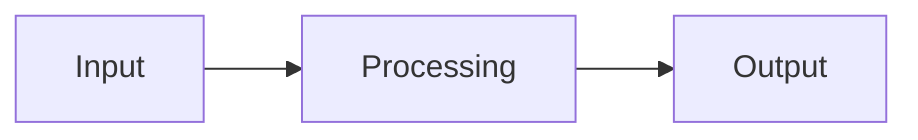

<!-- migrated from the legacy platform spec; canonical OpenSpec source -->
# Package kinds Specification

## Purpose

Registry taxonomy for `packageKind` on `beskid.package.v1` — Standard surfaces for library, template, and tool packages.

## Requirements

### Requirement: packageKind field: Decision [D-TOOL-PCKG-0001]
The Beskid standard SHALL enforce the following migrated contract section. Accepted ADR decisions are binding; uppercase requirement keywords retain their BCP-14 meaning.

> Explicit packageKind on package manifest.

**Stable ID:** `BSP-REQ-3359F55179C2`  
**Legacy source:** `site/spec-content/platform-spec/tooling/registry-client/package-kinds/adr/0001-explicit-package-kind-field/content.md`  
**Source SHA-256:** `ae39f88fb40e1ba030d9015fe8a1dc5786587de27190a9330845c0853fb5ebdd`

#### Scenario: Conformance exercises Decision
- **GIVEN** an implementation claims conformance with this capability
- **WHEN** behavior governed by this contract section is exercised
- **THEN** every MUST, SHALL, REQUIRED, prohibition, and accepted decision in the section is satisfied

### Requirement: beskid.templates.*: Decision [D-TOOL-PCKG-0003]
The Beskid standard SHALL enforce the following migrated contract section. Accepted ADR decisions are binding; uppercase requirement keywords retain their BCP-14 meaning.

> First-party templates use beskid.templates.* prefix.

**Stable ID:** `BSP-REQ-1A4512AD38C2`  
**Legacy source:** `site/spec-content/platform-spec/tooling/registry-client/package-kinds/adr/0003-beskid-templates-prefix/content.md`  
**Source SHA-256:** `42e9c9c08d02ace8aafd978bb305dc0ee74bb3d760ec56ae8087ff122f9b74b6`

#### Scenario: Conformance exercises Decision
- **GIVEN** an implementation claims conformance with this capability
- **WHEN** behavior governed by this contract section is exercised
- **THEN** every MUST, SHALL, REQUIRED, prohibition, and accepted decision in the section is satisfied

### Requirement: tool kind lifted to Standard: Decision [D-TOOL-PCKG-0004]
The Beskid standard SHALL enforce the following migrated contract section. Accepted ADR decisions are binding; uppercase requirement keywords retain their BCP-14 meaning.

> Lift **`packageKind: tool`** from Reserved to **Standard** with the following normative profile:
> 
> 1. **Server validator** (**`PackageArtifactValidator`**) **must** accept **`packageKind: tool`** artifacts. The artifact **must not** contain **`.beskid/template.json`**; the artifact **may** contain **`.beskid/docs/api.json`**, but it **must not** be required by `Pckg:Publish:RequireStructuredApiDoc`. The packed **`package.json`** **must not** include **`documentation.apiJson`** for the tool kind.
> 2. **Publish persistence** **must** record the resolved **`packageKind`** in the version metadata via the existing `PackageManifestMetadataReader` path.
> 3. **Dashboard routing** (**`PackageDetails.razor`**) **must** mirror the template-kind pattern: an `_isToolPackage` flag selects an install/usage card and suppresses the Docs / Source tabs by default. The Ratings tab and Versions tab remain unchanged.
> 4. **Rust pack flow** (`beskid_pckg::pack`) **must** add a **`PackProfile::Tool`** variant and the `build_package_json` path **must** emit `"packageKind": "tool"` without a `documentation` block. A new `strip_tool_pack_excludes` helper **must** remove `.beskid/docs/api.json` from the artifact body when the tool profile is selected.
> 5. **CLI surface** (`beskid_pckg::cli`) **must** add a **`--package-kind <library|template|tool>`** flag to `pack`. When set to `tool`, the CLI **must** skip the **`api.json`** pre-generation pass in `beskid_cli::cli::maybe_generate_docs_for_pack`. The flag **must** refuse to combine with a `Project.proj` whose `project.type = Template`.

**Stable ID:** `BSP-REQ-F4585730DF8C`  
**Legacy source:** `site/spec-content/platform-spec/tooling/registry-client/package-kinds/adr/0004-tool-kind-standard/content.md`  
**Source SHA-256:** `b6da5ad31495ac878940343cdba7c5a526fffcde09ed02a789fbd3a16a161fb5`

#### Scenario: Conformance exercises Decision
- **GIVEN** an implementation claims conformance with this capability
- **WHEN** behavior governed by this contract section is exercised
- **THEN** every MUST, SHALL, REQUIRED, prohibition, and accepted decision in the section is satisfied

## Informative Source Provenance

The records below preserve migration history and are not normative except where text was extracted into a requirement above.

### Source Record: Package kinds

**Authority:** informative provenance  
**Legacy path:** `/platform-spec/tooling/registry-client/package-kinds/`  
**Source:** `site/spec-content/platform-spec/tooling/registry-client/package-kinds/content.md`  
**SHA-256:** `21407ffe300feedea85abb16eb7298aa5d6a92f77ab93fd58d30c7c5f1726e54`

<details>
<summary>Migrated source text</summary>

``````markdown
<SpecSection title="What this feature specifies" id="what-this-feature-specifies">
The **`packageKind`** field on **`beskid.package.v1`** — discriminates **library**, **template**, and **tool** packages, each with a normative validator profile, dashboard surface, and CLI routing. `tool` is **Standard** as of D-TOOL-PCKG-0004 (this feature) — the previous **Reserved** status (D-TOOL-PCKG-0002) is **superseded**.
</SpecSection>

<SpecSection title="Implementation anchors" id="implementation-anchors">
- **`compiler/crates/beskid_pckg_server/Services/PackageKinds.cs`** — kind constants and `IsSupported` / `IsTemplate` / `IsTool` predicates
- **`compiler/crates/beskid_pckg_server/Services/PackageArtifactValidator.cs`** — per-kind validator profiles (library / template / tool)
- **`compiler/crates/beskid_pckg_server/Services/PackagePublishDocumentation.cs`** — exempts `template` and `tool` from structured `api.json` requirements
- **`compiler/crates/beskid_pckg_server/Components/Pages/PackageDetails.razor`(`.cs`)** — Fluent UI dashboard routing (badge, install-instructions card, hidden Documentation / Source tabs for `template` and `tool`)
- **`compiler/crates/beskid_pckg/src/pack.rs`** and **`cli.rs`** — Rust `PackProfile` (`Library` / `Template` / `Tool`), `detect_pack_profile_with_override`, `strip_tool_pack_excludes`, and `beskid pckg pack --package-kind {auto,tool}`
</SpecSection>

<SpecSection title="Contract statement" id="contract-statement">
Every published **`beskid.package.v1`** artifact **must** declare its role through **`packageKind`**. Kinds drive validator profiles, registry UI routing, and CLI behavior. Unknown `packageKind` values **must** be rejected at publish time with a structured **`BadRequest`** diagnostic, never a 500.

**`project.type`** on `Project.proj` is the **project-tree** analogue (`Host`, `Mod`, `Template`, …); **`packageKind`** is the **registry artifact** analogue—they are related but not interchangeable.
</SpecSection>

<SpecSection title="Normative kinds" id="normative-kinds">
| `packageKind` | Purpose | `api.json` requirement | `.beskid/template.json` | Primary CLI |
| --- | --- | --- | --- | --- |
| **`library`** (default) | Beskid source package consumed as dependency | **Required** when server policy mandates `api.json` | **Forbidden** | `beskid pckg pack`, consumer `beskid fetch` |
| **`template`** | Scaffold package for `beskid new` | **Forbidden** in artifact body; structured docs hidden in UI | **Required** | `beskid new install`, `beskid new <shortName>` |
| **`tool`** | CLI / developer-tool binaries and CLI-only packages distributed via pckg | **Optional** — server does not require it, validator does not reject its absence | **Forbidden** (`tool` and `template` are mutually exclusive) | `beskid pckg pack --package-kind tool`, consumer `beskid pckg download <name> --version <v> --output <path>` |

Unknown `packageKind` values **must** be rejected at publish time. The server **must** reject a `tool` artifact that contains `.beskid/template.json` (and vice versa) with a deterministic message naming the conflicting file.
</SpecSection>

<SpecSection title="Validator profile per kind" id="validator-profile">
The pckg server applies the kind-specific validator profile during publish:

- **`library`** — when the server enforces structured docs, the artifact **must** carry `.beskid/docs/api.json`; the artifact **must not** carry `.beskid/template.json`.
- **`template`** — the artifact **must** carry `.beskid/template.json` and **must not** carry `.beskid/docs/api.json` (server treats template-kind artifacts as scaffold-only; the dashboard hides the **Documentation** and **Source** tabs).
- **`tool`** — the artifact **may** omit `.beskid/docs/api.json` entirely (no docs-required diagnostic fires); it **must not** carry `.beskid/template.json`. The dashboard renders a **Tool package** Fluent badge and an install-instructions card with the registry download command (`beskid pckg download …`).

All kinds remain subject to the shared safeguards: zip-bomb / path-traversal guards, package-id authorization, and per-package owner gating.
</SpecSection>

<SpecSection title="CLI routing" id="cli-routing">
The Beskid CLI surfaces `packageKind` through **`beskid pckg pack --package-kind {auto, tool}`**:

- **`auto`** (default) — reproduces the historical manifest-driven detection. `Project.proj` with `type = Template` packs a `template` artifact (template summary copied from `.beskid/template.json`); any other manifest or a missing manifest packs a `library` artifact.
- **`tool`** — packs a `tool` artifact even when `Project.proj` is absent, which is the expected layout for CLI-only tool packages. `--package-kind tool` **must** reject template projects (manifest with `type = Template`) so a template payload is never silently lost; the error message **must** name `--package-kind tool` so users can correct it.

`tool` pack runs strip generated `.beskid/docs/**` entries from the artifact (`strip_tool_pack_excludes`); `tool` `package.json` omits `documentation.apiJson` and the schema version pointer.

Consumers download tool artifacts with **`beskid pckg download <name> --version <v> --output <path>`**; the dashboard install card surfaces the exact command (e.g. `beskid pckg download beskid-fmt-extra --version 0.1.0 --output ./beskid-fmt-extra.bpk`).
</SpecSection>

<SpecSection title="Project.type alignment" id="project-type-alignment">
| `project.type` | Typical `packageKind` when published |
| --- | --- |
| *(absent)* / `Host` | `library` (or `tool` via `--package-kind tool` for CLI-only packages with no `Project.proj`) |
| `Mod` | `library` |
| `Template` | `template` |

A **`library`** package **must not** publish with `type: Template` on `Project.proj`. A **`template`** package **must** include `.beskid/template.json`. A **`tool`** package **must not** include `.beskid/template.json`; it does not require `Project.proj` at all.
</SpecSection>

<SpecSection title="Versioning" id="versioning">
All kinds share: registry-assigned publish semver, immutability per version, yank, checksum verification, and download URLs.
</SpecSection>

<SpecSection title="Decisions" id="decisions">
- **D-TOOL-PCKG-0001** — Explicit `packageKind` field on `beskid.package.v1` (see `adr/0001-explicit-package-kind-field.mdx`).
- **D-TOOL-PCKG-0002** — *Superseded.* `tool` packageKind no longer reserved; see `adr/0002-tool-kind-reserved.mdx` for the historical record and `adr/0004-tool-kind-standard.mdx` for the active decision.
- **D-TOOL-PCKG-0003** — `beskid.templates.*` identity prefix for template packages (see `adr/0003-beskid-templates-prefix.mdx`).
- **D-TOOL-PCKG-0004** — `tool` packageKind is Standard with a normative validator profile, CLI override, and dashboard routing (`adr/0004-tool-kind-standard.mdx`).

Use the **ADRs** tab to expand each decision.
</SpecSection>

<SpecSection title="Verification and traceability" id="verification-and-traceability">
- `compiler/crates/beskid_pckg_server/tests/Unit/PackageArtifactValidatorTests.cs` — `ValidateAsync_Accepts_Tool_Artifact_Without_Api_Json`, `ValidateAsync_Accepts_Tool_Artifact_With_Optional_Api_Json`, `ValidateAsync_Rejects_Tool_With_Template_Json`, `ValidateAsync_Rejects_Unknown_Package_Kind`.
- `compiler/crates/beskid_pckg_server/tests/Unit/PackagePublishDocumentationTests.cs` — `EnsureStructuredApiDoc_skips_tool_packages`.
- `compiler/crates/beskid_pckg_server/tests/Integration/ToolPackagePublishIntegrationTests.cs` — end-to-end tool publish with structured docs absent, kind persisted on the version summary.
- `compiler/crates/beskid_pckg/src/pack.rs` tests — `pack_profile_helpers_track_variant`, `build_package_json_tool_profile_omits_api_doc_pointer`, `strip_tool_pack_excludes_removes_generated_docs`, `detect_pack_profile_with_override_forces_tool_when_no_manifest`, `detect_pack_profile_with_override_rejects_template_project`, `detect_pack_profile_auto_matches_legacy_behavior`.
- `compiler/crates/beskid_pckg/src/cli.rs` tests — `pack_args_default_package_kind_is_auto`, `pack_args_package_kind_tool_flag_parses`, `pack_args_package_kind_rejects_unknown_value`.
</SpecSection>

<SpecSection title="Related features" id="related-features">
- **[Template packages](/platform-spec/tooling/project-scaffolding/template-packages/)** — the `template` packageKind.
- **[pckg client contract](/platform-spec/tooling/registry-client/pckg-client-contract/)** — publish / download surface used by `tool` packages.
- **[Formatter](/platform-spec/tooling/formatter/)** — representative tool delivered via `beskid format` (a possible future `packageKind: tool` distribution candidate).
- **[api.json contract](/platform-spec/tooling/cli/api-json-contract/)** — applies to `library` packages; **does not** apply to `tool` artifacts.
</SpecSection>

## Decisions
<!-- spec:generate:adr-index -->
No open decisions. Closed choices are normative ADRs under **`adr/`** (`D-TOOL-PCKG-0001` … `D-TOOL-PCKG-0004`); use the reader **ADRs** tab for expandable detail.
<!-- /spec:generate:adr-index -->
## Articles
<!-- spec:generate:article-index -->
_No articles in this bundle yet._
<!-- /spec:generate:article-index -->
``````

</details>

### Source Record: packageKind field

**Authority:** informative provenance  
**Legacy path:** `/platform-spec/tooling/registry-client/package-kinds/adr/0001-explicit-package-kind-field/`  
**Source:** `site/spec-content/platform-spec/tooling/registry-client/package-kinds/adr/0001-explicit-package-kind-field/content.md`  
**SHA-256:** `ae39f88fb40e1ba030d9015fe8a1dc5786587de27190a9330845c0853fb5ebdd`

<details>
<summary>Migrated source text</summary>

``````markdown
## Context

Registry taxonomy.

## Decision

Explicit packageKind on package manifest.

## Consequences

Validators and UI.

## Verification anchors

Server tests.
``````

</details>

### Source Record: tool reserved (superseded)

**Authority:** informative provenance  
**Legacy path:** `/platform-spec/tooling/registry-client/package-kinds/adr/0002-tool-kind-reserved/`  
**Source:** `site/spec-content/platform-spec/tooling/registry-client/package-kinds/adr/0002-tool-kind-reserved/content.md`  
**SHA-256:** `eaf5ae30045e5361b02ae73753f482deab703f9d7156e658a474b2762f42e4a3`

<details>
<summary>Migrated source text</summary>

``````markdown
## Status

**Superseded by [D-TOOL-PCKG-0004 — `tool` kind Standard](./0004-tool-kind-standard.mdx)** on 2026-05-23.

This decision documented the original intent to *reserve* `packageKind: tool` in the registry taxonomy without committing to a validator profile, dashboard surface, or CLI routing. That reservation has now been replaced with a fully normative profile. Implementations **must** follow D-TOOL-PCKG-0004; this ADR is preserved for history.

## Context (historical)

When the `packageKind` field was introduced on `beskid.package.v1`, two kinds (`library`, `template`) had concrete validator profiles and dashboard routing; `tool` was anticipated but not yet specified. The team did not want the absence of `tool` rules to be interpreted as silent acceptance.

## Decision (historical)

Reserve `tool` as a known-but-not-Standard `packageKind` value. The pckg server **accepted** the literal string but did not commit to validator behavior, dashboard routing, or CLI flags. Publishers were warned that the contract would land in a follow-up decision.

## Consequences (historical)

- Validators recognised the kind without expanding the supported set: any deviation from the `library` profile would be a future, opt-in change.
- The dashboard fell back to the `library` rendering for `tool` artifacts, which made the kind effectively invisible to users.
- CLI tooling (`beskid pckg pack`) had no `--package-kind` flag, so publishers could not deliberately mark an artifact as `tool`.

## Verification anchors (historical)

Verification responsibility transferred to D-TOOL-PCKG-0004; see `0004-tool-kind-standard.mdx` for the current test surface.
``````

</details>

### Source Record: beskid.templates.*

**Authority:** informative provenance  
**Legacy path:** `/platform-spec/tooling/registry-client/package-kinds/adr/0003-beskid-templates-prefix/`  
**Source:** `site/spec-content/platform-spec/tooling/registry-client/package-kinds/adr/0003-beskid-templates-prefix/content.md`  
**SHA-256:** `42e9c9c08d02ace8aafd978bb305dc0ee74bb3d760ec56ae8087ff122f9b74b6`

<details>
<summary>Migrated source text</summary>

``````markdown
## Context

Registry taxonomy.

## Decision

First-party templates use beskid.templates.* prefix.

## Consequences

Validators and UI.

## Verification anchors

Server tests.
``````

</details>

### Source Record: tool kind lifted to Standard

**Authority:** informative provenance  
**Legacy path:** `/platform-spec/tooling/registry-client/package-kinds/adr/0004-tool-kind-standard/`  
**Source:** `site/spec-content/platform-spec/tooling/registry-client/package-kinds/adr/0004-tool-kind-standard/content.md`  
**SHA-256:** `b6da5ad31495ac878940343cdba7c5a526fffcde09ed02a789fbd3a16a161fb5`

<details>
<summary>Migrated source text</summary>

``````markdown
## Context

D-TOOL-PCKG-0002 reserved **`tool`** as a forbidden **`packageKind`** while validator profiles, CLI routing, and registry UI surfaces remained undefined. By the v0.3 baseline, three concrete needs converged:

1. **External tool packs** (custom diagnostics, formatter rule packs, language-server extensions) want to ship through pckg without being mis-classified as **`library`** (which forces `api.json` generation) or **`template`** (which forces `.beskid/template.json`).
2. The registry dashboard already routes **`library`** and **`template`** kinds to distinct surfaces via `PackageDetails.razor`. A third surface — with no Docs / Source tabs — is straightforward to add given the existing `_isTemplatePackage` pattern.
3. The Beskid CLI already supports per-profile packing in `beskid_pckg::pack::PackProfile`. Extending the enum with a **`Tool`** variant and a **`--package-kind tool`** CLI flag is a localized change.

The platform-spec leads code: this ADR makes the validator profile, CLI routing, and dashboard surface normative so the implementation can land without ambiguity.

## Decision

Lift **`packageKind: tool`** from Reserved to **Standard** with the following normative profile:

1. **Server validator** (**`PackageArtifactValidator`**) **must** accept **`packageKind: tool`** artifacts. The artifact **must not** contain **`.beskid/template.json`**; the artifact **may** contain **`.beskid/docs/api.json`**, but it **must not** be required by `Pckg:Publish:RequireStructuredApiDoc`. The packed **`package.json`** **must not** include **`documentation.apiJson`** for the tool kind.
2. **Publish persistence** **must** record the resolved **`packageKind`** in the version metadata via the existing `PackageManifestMetadataReader` path.
3. **Dashboard routing** (**`PackageDetails.razor`**) **must** mirror the template-kind pattern: an `_isToolPackage` flag selects an install/usage card and suppresses the Docs / Source tabs by default. The Ratings tab and Versions tab remain unchanged.
4. **Rust pack flow** (`beskid_pckg::pack`) **must** add a **`PackProfile::Tool`** variant and the `build_package_json` path **must** emit `"packageKind": "tool"` without a `documentation` block. A new `strip_tool_pack_excludes` helper **must** remove `.beskid/docs/api.json` from the artifact body when the tool profile is selected.
5. **CLI surface** (`beskid_pckg::cli`) **must** add a **`--package-kind <library|template|tool>`** flag to `pack`. When set to `tool`, the CLI **must** skip the **`api.json`** pre-generation pass in `beskid_cli::cli::maybe_generate_docs_for_pack`. The flag **must** refuse to combine with a `Project.proj` whose `project.type = Template`.

## Consequences

- **Forwards-compatible:** Existing **`library`** and **`template`** artifacts are unaffected; pre-existing `tool`-rejection tests are updated rather than removed.
- **Server-side migration:** `PackageKinds.IsSupported` now returns true for `tool`. Operators running validator policy `RequireStructuredApiDoc = true` see no behavior change for library packages; tool packages explicitly bypass that requirement.
- **CLI ergonomics:** Publishers who want to ship a developer tool through the registry no longer need to hand-author **`package.json`**; the **`beskid pckg pack --package-kind tool`** flow handles it.
- **Dashboard parity:** The pckg UI uses shared `@beskid` React component patterns for the new tool card, matching the existing template install card. No new design tokens are introduced.

## Verification anchors

- `compiler/crates/beskid_pckg_server/tests/Unit/PackageArtifactValidatorTests.cs::ValidateAsync_Accepts_Tool_Artifact_Without_Api_Json`
- `compiler/crates/beskid_pckg_server/tests/Unit/PackageArtifactValidatorTests.cs::ValidateAsync_Rejects_Tool_With_Template_Json`
- `compiler/crates/beskid_pckg_server/tests/Integration/ToolPackagePublishIntegrationTests.cs`
- `compiler/crates/beskid_pckg/src/pack.rs::tests::build_package_json_tool_profile_omits_api_doc_pointer`
- `compiler/crates/beskid_pckg/src/pack.rs::tests::strip_tool_pack_excludes_removes_api_json`
- `compiler/crates/beskid_pckg/src/cli.rs::tests::pack_args_accepts_package_kind_tool`
``````

</details>

### Source Record: Package kinds - Contracts and edge cases

**Authority:** informative provenance  
**Legacy path:** `/platform-spec/tooling/registry-client/package-kinds/articles/contracts-and-edge-cases/`  
**Source:** `site/spec-content/platform-spec/tooling/registry-client/package-kinds/articles/contracts-and-edge-cases/content.md`  
**SHA-256:** `ebf08049bae8a9c6d26a177faceb9c22bc802289532c819bff663e69393f868f`

<details>
<summary>Migrated source text</summary>

``````markdown
## Hard requirements

The normative specification in the parent hub defines the hard requirements for this feature. This article documents edge cases and contract-level guarantees.

## Edge cases

Edge cases are documented as they are discovered during implementation. Key edge cases include:

- Interactions with other features that may produce unexpected results
- Boundary conditions at the limits of defined behavior
- Error paths and diagnostic conditions

## Invariants

The following invariants must hold across all implementations:

1. The normative specification takes precedence over implementation behavior
2. Diagnostic codes are registered in the diagnostic code registry and must not be reused
3. Conformance tests must pass at the declared conformance level

## Contract guarantees

Implementations must satisfy the contracts defined in the parent hub. Violations must be surfaced through the diagnostic system.
``````

</details>

### Source Record: Package kinds - Design model

**Authority:** informative provenance  
**Legacy path:** `/platform-spec/tooling/registry-client/package-kinds/articles/design-model/`  
**Source:** `site/spec-content/platform-spec/tooling/registry-client/package-kinds/articles/design-model/content.md`  
**SHA-256:** `91717460b2d2c2d42599b25b5ad3cd913c30200e2eac61bd0fdd7c23ef37d1bc`

<details>
<summary>Migrated source text</summary>

``````markdown
## Design overview

This article describes the conceptual model and design decisions behind the feature. The normative specification lives in the parent hub's `content.md`; this article expands on the rationale, subsystem boundaries, and architectural choices.

## Key design decisions

- Decision details are recorded as ADRs under the hub's `adr/` directory when formal record-keeping is needed.
- Design rationale here is informative; normative contract language lives in the parent hub specification.

## Subsystem boundaries

Refer to the parent feature hub (`content.md`) for the authoritative specification. This article provides supplementary design context.

## Related articles

- [Contracts and edge cases](../contracts-and-edge-cases/)
- [Verification and traceability](../verification-and-traceability/)
``````

</details>

### Source Record: Package kinds - Examples

**Authority:** informative provenance  
**Legacy path:** `/platform-spec/tooling/registry-client/package-kinds/articles/examples/`  
**Source:** `site/spec-content/platform-spec/tooling/registry-client/package-kinds/articles/examples/content.md`  
**SHA-256:** `d0e1fd31b603c00316e52b03c69ceea81ba3f3f1dcbb26812ebbfbe7b76c38be`

<details>
<summary>Migrated source text</summary>

``````markdown
## Basic usage

```beskid
// TODO: Add basic usage example for this feature
```

## Common patterns

```beskid
// TODO: Add common usage patterns
```

## Edge case examples

```beskid
// TODO: Add edge case examples
```

> **Note:** Full code examples for this feature are being developed. See the parent hub for the normative specification.
``````

</details>

### Source Record: Package kinds - FAQ and troubleshooting

**Authority:** informative provenance  
**Legacy path:** `/platform-spec/tooling/registry-client/package-kinds/articles/faq-and-troubleshooting/`  
**Source:** `site/spec-content/platform-spec/tooling/registry-client/package-kinds/articles/faq-and-troubleshooting/content.md`  
**SHA-256:** `85dde537b89da9f715eb1cdc04feaa6f40852af520ea80541e9b2e37cb1bf647`

<details>
<summary>Migrated source text</summary>

``````markdown
## Frequently asked questions

### Is this feature stable?

The parent hub's `status` field indicates the maturity level. Articles marked `Proposed` are under active development.

### How does this interact with other features?

See the "Related articles" section in each article and the `related.json` files for cross-feature links.

### Where can I find implementation details?

Implementation anchors are listed in the parent hub's `content.md` under "Implementation anchors".

## Troubleshooting

### Diagnostic codes

Refer to the parent hub for feature-specific diagnostic codes. All codes are registered in the [Diagnostic code registry](/platform-spec/compiler/semantic-pipeline/diagnostic-code-registry/).

### Common errors

- **Spec violation:** If behavior contradicts the parent hub, the hub specification takes precedence.
- **Missing conformance:** If a test case is missing, add it to the `articles/verification-and-traceability/` article.
``````

</details>

### Source Record: Package kinds - Flow and algorithm

**Authority:** informative provenance  
**Legacy path:** `/platform-spec/tooling/registry-client/package-kinds/articles/flow-and-algorithm/`  
**Source:** `site/spec-content/platform-spec/tooling/registry-client/package-kinds/articles/flow-and-algorithm/content.md`  
**SHA-256:** `11da0470d38a7c18d7d86e1cd5d19d81cb46b8e601f6d2f479d580532c4b8167`

<details>
<summary>Migrated source text</summary>

``````markdown
## Processing steps

The normative algorithm for this feature is defined in the compiler implementation. This article provides an informative overview of the processing flow.

## Data flow



## Algorithm outline

1. Parse the relevant syntax from the source
2. Resolve names and types according to the rules in the parent hub
3. Lower to intermediate representation
4. Code generation

> **Note:** Detailed flow documentation is being developed. Refer to the compiler implementation for the authoritative algorithm.
``````

</details>

### Source Record: Package kinds - Verification and traceability

**Authority:** informative provenance  
**Legacy path:** `/platform-spec/tooling/registry-client/package-kinds/articles/verification-and-traceability/`  
**Source:** `site/spec-content/platform-spec/tooling/registry-client/package-kinds/articles/verification-and-traceability/content.md`  
**SHA-256:** `d720e610eefaa0b0d16ac8ec2baa12bb0cd87e8e58b361f48bbcab62ec4bd86d`

<details>
<summary>Migrated source text</summary>

``````markdown
## Conformance evidence

Conformance to this specification is verified through:

1. **Compiler test suite** — Unit and integration tests in the compiler workspace
2. **Corelib conformance** — Published corelib packages must conform to the specification
3. **End-to-end tests** — E2E tests validate the full pipeline

## Test coverage

Test coverage for this feature is tracked in the compiler's test suite. Key test areas include:

- Syntax validation
- Semantic analysis (type checking, name resolution)
- Code generation and lowering
- Runtime behavior

## Verification anchors

Implementation anchors are listed in the parent hub's `content.md` under "Implementation anchors".

## Traceability

Each normative statement in the parent hub should be traceable to:
- A test case in the compiler test suite
- An ADR documenting the decision
- A diagnostic code in the diagnostic registry
``````

</details>
