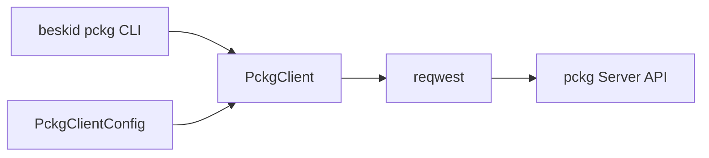
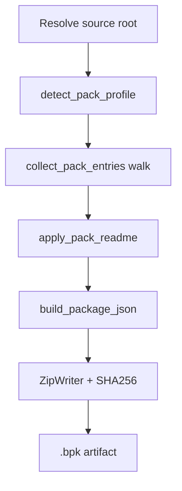

<!-- migrated from the legacy platform spec; canonical OpenSpec source -->
# pckg client contract Specification

## Purpose

Contract surface for the Beskid package registry client crate used by tooling workflows.

## Requirements

### Requirement: Hub authority: Decision [D-TOOL-PCKG-0001]
The Beskid standard SHALL enforce the following migrated contract section. Accepted ADR decisions are binding; uppercase requirement keywords retain their BCP-14 meaning.

> Hub owns HTTP and auth.

**Stable ID:** `BSP-REQ-4C374A0F8991`  
**Legacy source:** `site/spec-content/platform-spec/tooling/registry-client/pckg-client-contract/adr/0001-hub-authority/content.md`  
**Source SHA-256:** `16eeeaea148e9201cc4c515fbb8b107ed86466a2f99bd5781411990eaa2c1b63`

#### Scenario: Conformance exercises Decision
- **GIVEN** an implementation claims conformance with this capability
- **WHEN** behavior governed by this contract section is exercised
- **THEN** every MUST, SHALL, REQUIRED, prohibition, and accepted decision in the section is satisfied

### Requirement: Registry versions: Decision [D-TOOL-PCKG-0002]
The Beskid standard SHALL enforce the following migrated contract section. Accepted ADR decisions are binding; uppercase requirement keywords retain their BCP-14 meaning.

> Registry-assigned publish versions in routine flows.

**Stable ID:** `BSP-REQ-96F30E1AED03`  
**Legacy source:** `site/spec-content/platform-spec/tooling/registry-client/pckg-client-contract/adr/0002-registry-assigned-versions/content.md`  
**Source SHA-256:** `b202b1e7377a19ac989aefe5f1b07e702cf42377fa2db20c4d287616385c0a84`

#### Scenario: Conformance exercises Decision
- **GIVEN** an implementation claims conformance with this capability
- **WHEN** behavior governed by this contract section is exercised
- **THEN** every MUST, SHALL, REQUIRED, prohibition, and accepted decision in the section is satisfied

### Requirement: api.json symbolKey pack validation: Decision [D-TOOL-PCKG-0005]
The Beskid standard SHALL enforce the following migrated contract section. Accepted ADR decisions are binding; uppercase requirement keywords retain their BCP-14 meaning.

> `validate_packed_api_doc` **must** run **`validate_symbol_keys`** for `schemaVersion >= 4` graph artifacts. When `symbolKey` is present on an item:
> 
> | Check | Rule |
> | --- | --- |
> | Non-empty | Reject blank strings |
> | Package prefix | Must contain `::` (package-prefixed canonical form) |
> | Uniqueness | Reject duplicate `symbolKey` values across items |
> | Leaf consistency | Lenient check: obvious mismatch between `symbolKey` leaf segment and `qualifiedName` leaf **may** reject when unambiguous |
> 
> Absence of `symbolKey` on any row **remains valid** (backward compatibility with pre-registry emitters).

**Stable ID:** `BSP-REQ-BBEFDCD80BA7`  
**Legacy source:** `site/spec-content/platform-spec/tooling/registry-client/pckg-client-contract/adr/0005-api-json-symbol-key-validation/content.md`  
**Source SHA-256:** `dd618229faa546df91192be63fb37ac8dc9a4e66451d51f81bca590fd6bf5aa9`

#### Scenario: Conformance exercises Decision
- **GIVEN** an implementation claims conformance with this capability
- **WHEN** behavior governed by this contract section is exercised
- **THEN** every MUST, SHALL, REQUIRED, prohibition, and accepted decision in the section is satisfied

## Informative Source Provenance

The records below preserve migration history and are not normative except where text was extracted into a requirement above.

### Source Record: pckg client contract

**Authority:** informative provenance  
**Legacy path:** `/platform-spec/tooling/registry-client/pckg-client-contract/`  
**Source:** `site/spec-content/platform-spec/tooling/registry-client/pckg-client-contract/content.md`  
**SHA-256:** `864c73fb43cef0388cc6a8fdae95bf25be89d371da8ce07c4bd527bf283b6145`

<details>
<summary>Migrated source text</summary>

``````markdown
<SpecSection title="What this feature specifies" id="what-this-feature-specifies">
`pckg client contract` defines one operational contract that a newcomer can follow end-to-end: first the model, then execution flow, then strict guarantees, concrete examples, and verification guidance.
</SpecSection>

<SpecSection title="Implementation anchors" id="implementation-anchors">
- Public client API in `compiler/crates/beskid_pckg/src/lib.rs`
- HTTP and auth flows in `compiler/crates/beskid_pckg/src/client.rs`
- CLI integration in `compiler/crates/beskid_pckg/src/cli.rs`
- Package dashboard behavior in `compiler/crates/beskid_pckg_server/Components/Pages/Dashboard/Packages.razor.cs`
</SpecSection>

<SpecSection title="Decisions" id="decisions">
No open decisions. **`D-TOOL-PCKG-0001`** (hub authority), **`0002`** (registry-assigned versions), **`0005`** (`api.json` **`symbolKey`** validation)—see **`adr/`** and the **ADRs** tab.
</SpecSection>

## Decisions
<!-- spec:generate:adr-index -->
No open decisions. Closed choices are normative ADRs under **`adr/`** (`D-TOOL-PCKG-0001` … `D-TOOL-PCKG-0005`); use the reader **ADRs** tab for expandable detail.
<!-- /spec:generate:adr-index -->
## Articles
<!-- spec:generate:article-index -->
- [Contracts and edge cases](./articles/contracts-and-edge-cases/)
- [Design model](./articles/design-model/)
- [Examples](./articles/examples/)
- [FAQ and troubleshooting](./articles/faq-and-troubleshooting/)
- [Flow and algorithm](./articles/flow-and-algorithm/)
- [Verification and traceability](./articles/verification-and-traceability/)
<!-- /spec:generate:article-index -->
``````

</details>

### Source Record: Hub authority

**Authority:** informative provenance  
**Legacy path:** `/platform-spec/tooling/registry-client/pckg-client-contract/adr/0001-hub-authority/`  
**Source:** `site/spec-content/platform-spec/tooling/registry-client/pckg-client-contract/adr/0001-hub-authority/content.md`  
**SHA-256:** `16eeeaea148e9201cc4c515fbb8b107ed86466a2f99bd5781411990eaa2c1b63`

<details>
<summary>Migrated source text</summary>

``````markdown
## Context

One client story.

## Decision

Hub owns HTTP and auth.

## Consequences

Extension defers.

## Verification anchors

beskid_pckg; pckgClient.
``````

</details>

### Source Record: Registry versions

**Authority:** informative provenance  
**Legacy path:** `/platform-spec/tooling/registry-client/pckg-client-contract/adr/0002-registry-assigned-versions/`  
**Source:** `site/spec-content/platform-spec/tooling/registry-client/pckg-client-contract/adr/0002-registry-assigned-versions/content.md`  
**SHA-256:** `b202b1e7377a19ac989aefe5f1b07e702cf42377fa2db20c4d287616385c0a84`

<details>
<summary>Migrated source text</summary>

``````markdown
## Context

Manual semver drift.

## Decision

Registry-assigned publish versions in routine flows.

## Consequences

UI shows server version.

## Verification anchors

publish API tests.
``````

</details>

### Source Record: api.json symbolKey pack validation

**Authority:** informative provenance  
**Legacy path:** `/platform-spec/tooling/registry-client/pckg-client-contract/adr/0005-api-json-symbol-key-validation/`  
**Source:** `site/spec-content/platform-spec/tooling/registry-client/pckg-client-contract/adr/0005-api-json-symbol-key-validation/content.md`  
**SHA-256:** `dd618229faa546df91192be63fb37ac8dc9a4e66451d51f81bca590fd6bf5aa9`

<details>
<summary>Migrated source text</summary>

``````markdown
## Context

Registry ingestion already validates graph navigation (`parentId`, `refItemId`, package-relative paths). With registry-backed **`symbolKey`** on v4 rows, pack-time validation must catch malformed or duplicated keys before artifacts reach the docs UI.

## Decision

`validate_packed_api_doc` **must** run **`validate_symbol_keys`** for `schemaVersion >= 4` graph artifacts. When `symbolKey` is present on an item:

| Check | Rule |
| --- | --- |
| Non-empty | Reject blank strings |
| Package prefix | Must contain `::` (package-prefixed canonical form) |
| Uniqueness | Reject duplicate `symbolKey` values across items |
| Leaf consistency | Lenient check: obvious mismatch between `symbolKey` leaf segment and `qualifiedName` leaf **may** reject when unambiguous |

Absence of `symbolKey` on any row **remains valid** (backward compatibility with pre-registry emitters).

## Consequences

- Implementation: `compiler/crates/beskid_pckg/src/api_doc.rs`
- Operators re-pack with a current `beskid doc` / CLI to populate keys on new publishes; old `.bpk` files without keys still ingest.

## Verification anchors

- `compiler/crates/beskid_pckg/src/api_doc.rs` unit tests (accept distinct keys, reject duplicate / malformed, accept omitted field)
``````

</details>

### Source Record: Contracts and edge cases

**Authority:** informative provenance  
**Legacy path:** `/platform-spec/tooling/registry-client/pckg-client-contract/articles/contracts-and-edge-cases/`  
**Source:** `site/spec-content/platform-spec/tooling/registry-client/pckg-client-contract/articles/contracts-and-edge-cases/content.md`  
**SHA-256:** `a3542b970f3ebed643de20b370ee2db7151d7ff25634288586abcf0887d76556`

<details>
<summary>Migrated source text</summary>

``````markdown
## Contracts

- **HTTPS in production** — Operators **should** configure `BESKID_PCKG_URL` with TLS endpoints; clients honor redirects per reqwest defaults.
- **Auth mutual exclusion** — Bearer and API key flags **must not** be combined on one invocation.
- **Structured `api.json`** — Library packs **should** include compiler-emitted `.beskid/docs/api.json` as the docs UI contract (see **[api.json contract](/platform-spec/tooling/cli/api-json-contract/)**). When **`symbolKey`** is present on v4 rows, pack validation **must** enforce registry invariants ([D-TOOL-PCKG-0005](/platform-spec/tooling/registry-client/pckg-client-contract/adr/0005-api-json-symbol-key-validation/)).
- **Readme artifact name** — Packed readmes **must** appear as root `README.md` in the zip for dashboard listing.
- **Template discriminator** — Template packs **must** set `packageKind: template` and ship `.beskid/template.json`.

## Edge cases

| Case | Behavior |
| --- | --- |
| Missing `Project.proj` at pack root | Defaults to library profile without template metadata |
| Invalid `api.json` graph / symbolKey | `validate_packed_api_doc` rejects before ingest (duplicate or malformed **`symbolKey`**, broken `parentId`, absolute paths) |
| Missing auth on publish | `MissingAuthToken` before HTTP |
| Large trees | Walkdir-based collection; operators exclude build outputs via manifest/layout conventions |
| `iconUrl` on publish | Server validates HTTP(S) URLs and length caps (`PackageManifestMetadata`) |

## Server rejection mirrors

Client-side pack **should** prevalidate paths the server will reject (docs layout, workspace member consistency) to avoid wasted uploads; integration tests live in `compiler/crates/beskid_pckg_server/tests/`.
``````

</details>

### Source Record: Design model

**Authority:** informative provenance  
**Legacy path:** `/platform-spec/tooling/registry-client/pckg-client-contract/articles/design-model/`  
**Source:** `site/spec-content/platform-spec/tooling/registry-client/pckg-client-contract/articles/design-model/content.md`  
**SHA-256:** `4529f877e3e6f438814b57a2b46d888128d3103dbc42f1df1fb8391b37c56184`

<details>
<summary>Migrated source text</summary>

``````markdown
## Purpose

`beskid_pckg` is the single HTTP client for the **pckg** registry service. The CLI exposes it as `beskid pckg <subcommand>`; analysis-time fetch uses the same `PckgClient` types. Server behavior for published artifacts is implemented in `compiler/crates/beskid_pckg_server/` (validation, docs ingestion, workspace bundles).

## Component model



| Piece | Role |
| --- | --- |
| **`PckgClientConfig`** | `base_url`, timeout, `user_agent`, auth (`BearerToken` or `PublisherApiKey`) |
| **`PckgClient`** | JSON and multipart request builders with unified `PckgError` mapping |
| **`pack` module** | Walk tree → zip `.bpk`, inject `README.md`, build `package.json` (`PackProfile`) |
| **Repository config** | `.beskid/pckg/repositories.json` maps registry aliases to API keys |

## Authentication

Authenticated routes **must** receive either:

- `BESKID_PCKG_TOKEN` / `--bearer-token`, or
- `BESKID_PCKG_API_KEY` / `--api-key` (header name from config, used for publisher keys)

Missing auth on `require_auth` endpoints returns `PckgError::MissingAuthToken` without contacting the network.

## Pack profiles

| Profile | Detection | `package.json` |
| --- | --- | --- |
| **Library** | Default or non-`Template` `Project.proj` | Includes docs paths, `api.json` when present under `.beskid/docs/` |
| **Template** | `project.type = Template` | `packageKind: template` + summary from `.beskid/template.json` |

Readme resolution uses `discover_readme_for_package_root` from `beskid_analysis` (optional `readme` key or default `readme.md`).

## Server-side counterparts

| Concern | pckg path |
| --- | --- |
| Publish validation | `compiler/crates/beskid_pckg_server/Services/PackageArtifactValidator.cs` |
| Docs + `api.json` | `compiler/crates/beskid_pckg_server/Services/PackagePublishDocumentation.cs` |
| Workspace bundles | `compiler/crates/beskid_pckg_server/Services/Workspace/WorkspacePublishService.cs` |
| Dashboard listing | `compiler/crates/beskid_pckg_server/Components/Pages/Dashboard/Packages.razor.cs` |

## Implementation anchors

- `compiler/crates/beskid_pckg/src/lib.rs`, `client.rs`, `cli.rs`, `pack.rs`
- Models: `compiler/crates/beskid_pckg/src/models.rs`, `packages.rs`
``````

</details>

### Source Record: Examples

**Authority:** informative provenance  
**Legacy path:** `/platform-spec/tooling/registry-client/pckg-client-contract/articles/examples/`  
**Source:** `site/spec-content/platform-spec/tooling/registry-client/pckg-client-contract/articles/examples/content.md`  
**SHA-256:** `49200f8160b8136fe34413f7c7cc42b2418f99e58d5d229d35072ef8100b1ca7`

<details>
<summary>Migrated source text</summary>

``````markdown
## Pack a library project

```bash
beskid pckg pack --project compiler/corelib/beskid_corelib/Project.proj
```

Produces a `.bpk` with `README.md`, sources, and `.beskid/docs/` when present.

## Publish with API key

```bash
export BESKID_PCKG_URL=https://pckg.example/
export BESKID_PCKG_API_KEY=...
beskid pckg upload path/to/package.bpk
```

Exact subcommand names follow `PckgCommand` in `cli.rs` (use `beskid pckg --help` in installed CLI).

## Repository config file

`.beskid/pckg/repositories.json`:

```json
{
  "repositories": {
    "default": { "api_key": "..." }
  }
}
```

Maps to registry aliases in `Workspace.proj`.

## CI corelib publish

Compiler CI uses `BESKID_PCKG_KEY` to publish the **`corelib`** package identity after build—same client stack as local `beskid pckg` with injected secrets.
``````

</details>

### Source Record: FAQ and troubleshooting

**Authority:** informative provenance  
**Legacy path:** `/platform-spec/tooling/registry-client/pckg-client-contract/articles/faq-and-troubleshooting/`  
**Source:** `site/spec-content/platform-spec/tooling/registry-client/pckg-client-contract/articles/faq-and-troubleshooting/content.md`  
**SHA-256:** `c1d06f1d6a9b0f052e0f489797e1a2296627434922e47ec7307e08758a5e3b7a`

<details>
<summary>Migrated source text</summary>

``````markdown
## 401 / MissingAuthToken

Set `BESKID_PCKG_API_KEY` or bearer token. For multi-registry setups, ensure `.beskid/pckg/repositories.json` keys match `Workspace.proj` registry alias names.

## Pack missing docs on pckg site

Run `beskid doc --project ...` before pack so `.beskid/docs/api.json` exists. Server ingestion (`PackagePublishDocumentation`) treats that tree as first-class.

## Template pack rejected

Verify `project.type = Template`, `.beskid/template.json` (`beskid.template.v1`), and `packageKind: template` in generated `package.json`.

## Wrong package version after publish

Registry assigns versions in normal flows—do not expect local `project.version` alone to drive the published label. Query the server for the assigned version summary.

## Local dev server URL

Default `https://pckg.beskid-lang.org` points at the public registry; override with `BESKID_PCKG_URL` for local compose (`http://127.0.0.1:8082`) or other hosts.
``````

</details>

### Source Record: Flow and algorithm

**Authority:** informative provenance  
**Legacy path:** `/platform-spec/tooling/registry-client/pckg-client-contract/articles/flow-and-algorithm/`  
**Source:** `site/spec-content/platform-spec/tooling/registry-client/pckg-client-contract/articles/flow-and-algorithm/content.md`  
**SHA-256:** `6527900c9219ba5eca67eaba2986a017114026bb60278198a4937764a857fbaa`

<details>
<summary>Migrated source text</summary>

``````markdown
## `beskid pckg pack` algorithm



1. Read `Project.proj` when present; choose `PackProfile::Library` or `Template`.
2. Walk files (respect template exclude strips via `strip_template_pack_excludes`).
3. Include `.beskid/docs/**` and package docs for library profiles.
4. Copy resolved readme to zip root `README.md` when not already present.
5. Emit `package.json` metadata (registry assigns version on publish—clients do not invent release versions in normal flows).

## Publish / upload

1. Build or locate `.bpk` bytes.
2. `PckgClient::send_multipart` to registry upload endpoint with publisher auth.
3. Server runs `PackageArtifactValidator` + documentation ingestion; failures return structured API errors mapped to `PckgError::Api`.

## Fetch into workspace

`beskid fetch` (CLI command in `beskid_cli`) uses registry URLs from `Workspace.proj` and downloads through `PckgClient`, writing materialized roots recorded later in `Project.lock`. Version resolution follows registry-assigned versions, not ad-hoc client version strings.

## Version state file

Pack may persist local version hints in `.beskid/pckg` state (`PackVersionState`) for iterative dev publishes; production CI should rely on server-assigned versions after upload.

## Error handling

All HTTP failures surface as `PckgError` with status, message, and optional body text suitable for `--verbose` CLI output.
``````

</details>

### Source Record: Verification and traceability

**Authority:** informative provenance  
**Legacy path:** `/platform-spec/tooling/registry-client/pckg-client-contract/articles/verification-and-traceability/`  
**Source:** `site/spec-content/platform-spec/tooling/registry-client/pckg-client-contract/articles/verification-and-traceability/content.md`  
**SHA-256:** `8e3169375c1155d615be1d82d05ebef8f793ad3726d97a4431ed6aee2cc6535a`

<details>
<summary>Migrated source text</summary>

``````markdown
## Client / compiler

| Area | Location |
| --- | --- |
| Pack profile detection | `beskid_pckg/src/pack.rs` unit tests |
| CLI wiring | `beskid_pckg/src/cli.rs` |
| Workspace fetch integration | `beskid_tests` pipeline + fetch scenarios |

## pckg server

| Area | Location |
| --- | --- |
| Artifact validation | `compiler/crates/beskid_pckg_server/tests/Unit/PackageArtifactValidatorTests.cs` |
| Publish documentation | `compiler/crates/beskid_pckg_server/tests/Unit/PackagePublishDocumentationTests.cs` |
| Workspace publish | `compiler/crates/beskid_pckg_server/tests/Integration/WorkspacePublishIntegrationTests.cs` |
| Manifest metadata | `compiler/crates/beskid_pckg_server/tests/Unit/PackageManifestMetadataReaderTests.cs` |

## Traceability

| Contract | Verification |
| --- | --- |
| `README.md` zip entry | Pack tests + server doc browser smoke |
| `api.json` primary docs model | Publish documentation tests |
| Template `packageKind` | `detect_pack_profile` + server template validators |
| Registry-assigned versions | Server API integration (no client-side version override in CI publish) |

Spec edits **must** stay aligned with `PackageManifestMetadata` and workspace provisioning changes in `compiler/crates/beskid_pckg_server/Services/Workspace/`.
``````

</details>
